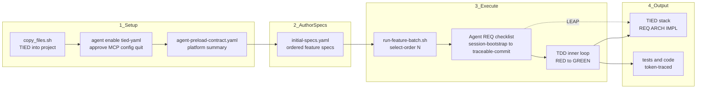
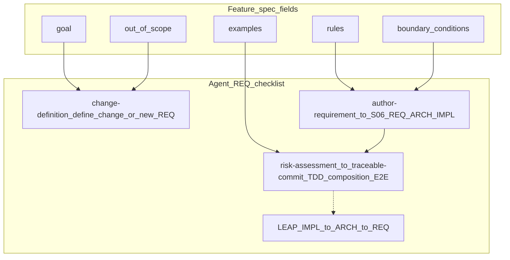
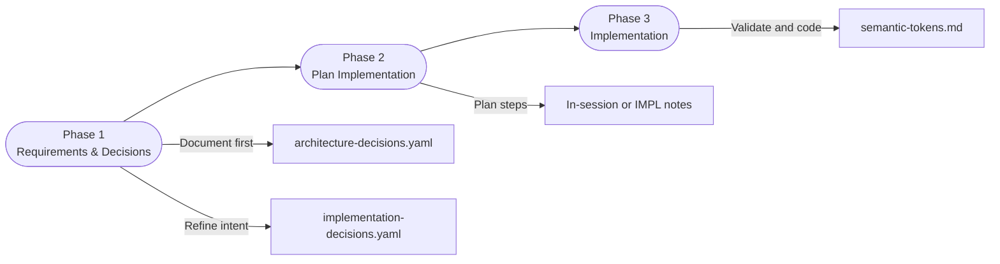
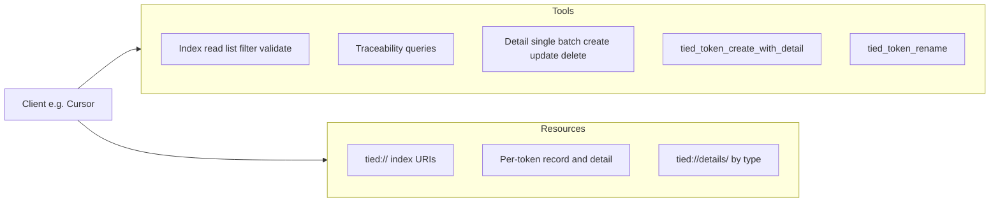
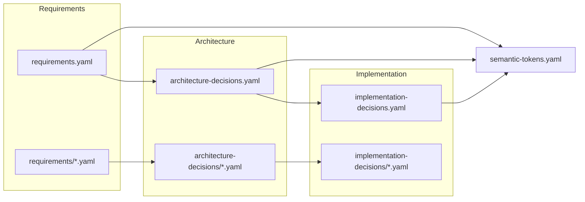

# TIED Methodology Template

**TIED Methodology Version**: 2.2.0

> **Note**: This methodology was previously known as STDD (Semantic Token-Driven Development). It has been renamed to TIED (Token-Integrated Engineering & Development) to better reflect its core value proposition: semantic tokens "tie" code to intent, making it impossible to modify code without confronting related context.

> **v2.2.0+**: Planning and execution are driven by the **traceability chain** (requirements → architecture → implementation → tests → code) and, for agents, by **agentstream** feeding the **agent requirement implementation checklist** one step at a time—not by a separate project task ledger file.

This repository ([https://github.com/fareedst/tied](https://github.com/fareedst/tied)) contains the **Token-Integrated Engineering & Development (TIED)** methodology template that can be used as a base for development projects in any language.

## Spec-Driven Development with TIED

**Priority path for new TIED clients:** drive development with an **ordered list of feature specs** run through the **[agent requirement implementation checklist](docs/agent-req-implementation-checklist.md)** (`[PROC-AGENT_REQ_CHECKLIST]`). That checklist sequences **CITDP** (change impact and test design), **LEAP** (logic elevation and propagation), and **TDD** so agent output stays aligned with intent. Add an **agent preload contract** so the model loads platform and project facts once instead of rediscovering them each session.

### End-to-end pipeline (TIED + LEAP + CITDP)



*Bootstrap copies TIED into the project; in Cursor, run `agent enable tied-yaml` (approve the project MCP config when prompted; type `quit` to exit the Agent CLI). The platform contract and spec list establish context; each selected spec is executed under the lead checklist; TDD produces code and tests; LEAP keeps REQ/ARCH/IMPL consistent when behavior diverges from the plan.*

### Process for a new TIED client

1. **Bootstrap** — Copy TIED into the project: run `$TIED/copy_files.sh` with your project path (or `./copy_files.sh /path/to/project` from a clone of this repository). After `copy_files.sh`, build the MCP server in the TIED repo if needed, then from the **client project** directory run `agent enable tied-yaml`, **approve** the update to the project MCP config in Cursor, and type **`quit`** to exit the `agent` UI. Full options and MCP setup: **[Getting Started with a New Project](#getting-started-with-a-new-project)** below.

2. **Platform contract** — If the project already has implemented code, add a local **`agent-preload-contract.yaml`** at the project root that summarizes platform and project features (fewer redundant tool calls, steadier agent behavior). Start from **[docs/agent-preload-contract-template.yaml](docs/agent-preload-contract-template.yaml)**. When this repository is the workspace, use **[docs/agent-preload-contract-tied-repo.yaml](docs/agent-preload-contract-tied-repo.yaml)** as the tailored layout. If the project is **new**, work through enough requirements to capture what is implemented; **refresh** the contract as the platform grows.

3. **Spec list** — Create an ordered YAML file (for example **`prompts/initial-specs.yaml`**) listing specs. Each entry uses fields such as `order`, `feature_name`, `goal`, `rules`, `examples`, `boundary_conditions`, and `out_of_scope`.

4. **Batch run** — Implement one or more specs with **`scripts/run-feature-batch.sh`** (Ruby **`tools/agent-stream/run_agent_stream.rb`**) or **`scripts/run-feature-batch-agentstream.sh`** (Go **`tools/agentstream`**), passing the workspace, optional preload contract, lead checklist YAML, feature-spec batch YAML, and **`--select-order`** (single order `N` or inclusive range `N-M`). The Go path **optionally** validates `.cursor/mcp.json` for tied-yaml (**`--tied-mcp-preflight`** or **`AGENTSTREAM_TIED_MCP_PREFLIGHT=1`**); by default it does not. See **`tools/agentstream/README.md`**.

**Example spec entry** (shape for `prompts/initial-specs.yaml` or your chosen path):

```yaml
- order: 1
  feature_name: "Default search root"
  goal: "A search runs from the current working directory when no root path is provided."
  rules:
    - "If no root path is given, the search root is the current working directory."
    - "The run summary shows the effective search root."
  examples:
    - given: "the current working directory contains app.rb"
      when: "a file-name search for 'app' is run with no root path"
      then: "app.rb is eligible to match and the summary shows the current working directory"
  boundary_conditions:
    - "An empty root path is treated the same as no root path."
  out_of_scope: "Resolving shell aliases or environment-variable syntax in the path"
```

**Example command** (implements only the first spec; set `$TIED` to your TIED repository clone and adjust paths for your workspace):

```bash
# Implements only the first spec in the batch
./scripts/run-feature-batch.sh \
  --workspace . \
  --prompt-file ./docs/agent-preload-contract-tied-repo.yaml \
  --lead-checklist-yaml $TIED/docs/agent-req-implementation-checklist.yaml \
  --feature-spec-batch-yaml ./prompts/initial-specs.yaml \
  --select-order 1
```

**UX-relevant updates (this working tree / branch):** Bootstrap instructions above favor **`copy_files.sh`** and spell out **`templates/` → `tied/methodology/`** vs **project `tied/*.yaml`** instead of a long manual `cp` list. In **this** repository, duplicate **root-level** TIED indexes (`requirements.yaml`, `architecture-decisions.yaml`, `implementation-decisions.yaml`, `semantic-tokens.yaml` and their old root detail dirs) are **removed**—use **`tied/`** only so there is a single place to edit project REQ/ARCH/IMPL data. **`copy_files.sh`** installs **`tied/`** and **`.cursor/skills/tied-yaml/`** (from this repo’s **`.cursor/skills/tied-yaml`** when present, else from **`tools/bundled-tied-yaml-skill/`** so `tied-cli.sh` is always available) but does **not** write **`.cursor/mcp.json`**; configure **`tied-yaml`** per **`docs/adding-tied-mcp-and-invoking-passes.md`**, and use **`tied-cli.sh`** with **`TIED_MCP_BIN`** when the MCP server binary lives outside the client tree (see **`.cursor/skills/tied-yaml/SKILL.md`**). **[scripts/run-feature-batch.sh](scripts/run-feature-batch.sh)** passes through **`-f` / `--first-turn`** (with **`-s` / `--session-id`** when starting after turn 1) for **mid-batch resume**; **[scripts/run-feature-batch-agentstream.sh](scripts/run-feature-batch-agentstream.sh)** wraps the Go **`agentstream`** CLI with the same flags plus optional **lead checklist step bounds** (`--lead-checklist-from-step` / `--lead-checklist-to-step`). Go **`tools/agentstream`** unifies batch + checklist + TDD YAML driving with **dry-run**, **feature-spec preview**, and **tied-yaml MCP preflight** (see **`tools/agentstream/README.md`**). **[docs/run-agent-stream-tied.md](docs/run-agent-stream-tied.md)** covers the Ruby runner; **`scripts/verify-agentstream-dry-run-parity.sh`** compares dry-run output against Ruby where both exist. **[docs/tdd_development_loop.yaml](docs/tdd_development_loop.yaml)** supports **`--tdd-yaml`** multi-turn runs. **[AGENTS.md](AGENTS.md)** and **[ai-principles.md](ai-principles.md)** require confirming **`tied_config_get_base_path`** before MCP writes (wrong **`TIED_BASE_PATH`** can mutate another repo’s `tied/`) and document **agentstream** preflight skip flags. **[docs/checklist_feedback_loops.md](docs/checklist_feedback_loops.md)** and **[docs/conversation-analysis-tools.md](docs/conversation-analysis-tools.md)** explain checklist feedback loops and **Ruby extractors** for Cursor hook / transcript YAML (`scripts/extract_*.rb`). **[.cursor/hooks/log.rb](.cursor/hooks/log.rb)** records **`model`** on `sessionStart` details alongside session metadata.

Defaults and flags: **[scripts/run-feature-batch.sh](scripts/run-feature-batch.sh)**, **[scripts/run-feature-batch-agentstream.sh](scripts/run-feature-batch-agentstream.sh)**; Ruby runner: **[tools/agent-stream/README.md](tools/agent-stream/README.md)**, **[docs/run-agent-stream-tied.md](docs/run-agent-stream-tied.md)**; Go runner: **`tools/agentstream`** — **[tools/agentstream/README.md](tools/agentstream/README.md)**. In client projects, the lead checklist is typically **`tied/docs/agent-req-implementation-checklist.yaml`** after `copy_files.sh`.

### How one spec maps into the checklist and TIED



*Goals and out-of-scope anchor intent at **change-definition**; **rules** and **boundary_conditions** feed REQ/ARCH/IMPL authoring; **examples** ground tests and acceptance; **LEAP** applies when code or tests diverge from IMPL.*

**Deeper visuals:** [docs/methodology-diagrams.md](docs/methodology-diagrams.md) — traceability stack, dev cycle, TDD inner loop, CITDP, YAML edit loop.

---

## What is TIED?

**Token-Integrated Engineering & Development (TIED)** uses semantic tokens to create a traceable chain from requirements through architecture and implementation to tests and code.

### Key Benefits

- **Traceability**: Every code decision can be traced back to its requirement
- **Context Preservation**: The "why" behind decisions is never lost
- **Living Documentation**: Documentation stays connected to code via tokens
- **Onboarding**: New developers can understand intent quickly
- **Refactoring Confidence**: Changes can be validated against original intent

## Getting Started with a New Project

This section covers **bootstrap**, **methodology vs project YAML**, and **MCP** (or working without MCP). For the **spec list + batch runner + checklist** workflow that drives agent sessions in order, start with **[Spec-Driven Development with TIED](#spec-driven-development-with-tied)** at the top of this README.

The primary way to work with TIED is via the MCP server; a standalone bootstrap and workflow for non-MCP users is also available.

### Step 1: Copy Templates to Your Project

**Recommended:** Download or clone the TIED repository somewhere convenient, then run `./copy_files.sh /path/to/project` (or `./copy_files.sh` if you are already in the project directory). The script copies the **core methodology (inherited LEAP R+A+I)** from `templates/` into the target project's `tied/` directory so every project has the methodology-enforcing requirements, architecture, and implementation tokens and their detail files. It will never overwrite an existing `AGENTS.md` or `.cursorrules` file that may already be present in the destination.

```bash
# From the TIED repo root—adjust the target path as needed
./copy_files.sh /path/to/your/project
```

**Alternative (manual):** Prefer `./copy_files.sh` — it copies methodology YAML from `templates/` into `tied/methodology/`, creates project stub indexes under `tied/` when missing, and wires MCP. If you mirror by hand, follow the same source paths as [`copy_files.sh`](copy_files.sh): methodology index and detail YAML from `templates/` (and `templates/requirements/`, `templates/architecture-decisions/`, `templates/implementation-decisions/`) into `tied/methodology/`; copy guide `.md` files from the TIED repo root into `tied/`; copy `AGENTS.md`, `.cursorrules`, and `ai-principles.md` into the project root when absent.

**Important**: Each project should have its own copies of these files. Canonical methodology YAML lives under **`templates/`** in the TIED repository; the same filenames in a client's `tied/methodology/` are the read-only methodology copy, and `tied/*.yaml` at the project root (plus detail dirs) hold client-specific REQ/ARCH/IMPL data.

### Methodology vs project YAML split

TIED distinguishes between methodology-owned YAML and project-owned YAML:

- Methodology-owned content is written under `tied/methodology/` and is overwritten on each `copy_files.sh` run.
- Project-owned index YAML lives in the `tied/` root (e.g. `tied/requirements.yaml`, `tied/architecture-decisions.yaml`, `tied/implementation-decisions.yaml`), and is created if missing but never overwritten.
- Methodology guide docs are copied into `tied/docs/` (so agent checklists and validation guidance work in clients).

When using the TIED MCP server, writes go only to project-owned YAML so methodology can be refreshed without losing project data.

### Step 2 (optional): Use the MCP server

The MCP server is **not** copied into your project; it stays in the TIED repository.

1. **Build once** (in the TIED repo): From the TIED repo root, run `cd mcp-server && npm install && npm run build`. You need this **`dist/index.js`** for **`.cursor/mcp.json`** and for **`tied-cli.sh`** (via **`TIED_MCP_BIN`**).
2. **Bootstrap** (if not already done): Run `./copy_files.sh` targeting your development project for **`tied/`** and **`.cursor/skills/tied-yaml/`**. **`copy_files.sh` does not write `.cursor/mcp.json`** — add the **`tied-yaml`** entry manually or follow **`agent enable tied-yaml`** after creating **`mcp.json`** (see **[docs/adding-tied-mcp-and-invoking-passes.md](docs/adding-tied-mcp-and-invoking-passes.md)**).
3. **Enable in Cursor (recommended):** From the **client project** root (the workspace that contains `tied/` and `.cursor/mcp.json`), run `agent enable tied-yaml`. When Cursor prompts you to apply the project MCP configuration, **approve** the update. Type **`quit`** to exit the interactive `agent` session.
4. **Verify:** List MCP tools (e.g. `yaml_index_read`, `tied_config_get_base_path`) or read a resource such as `tied://requirements` to confirm the server is loaded.

Alternatively, configure MCP manually: set **command/args** to the **TIED repo's** built server and **env** `TIED_BASE_PATH` to your **project's** `tied/` directory—see [TIED YAML MCP Server](#tied-yaml-mcp-server) and [mcp-server/README.md](mcp-server/README.md) for the exact JSON and paths.

For a full example process of adding the TIED MCP to a project and invoking it in several passes (bootstrap, establish REQ/ARCH/IMPL, maintain), see [docs/adding-tied-mcp-and-invoking-passes.md](docs/adding-tied-mcp-and-invoking-passes.md).

### Using TIED without MCP

If you do not use MCP, run `./bootstrap_without_mcp.sh /path/to/project` to get the same `tied/` layout; then manage YAML by hand or with tools (e.g. `yq`). See [docs/using-tied-without-mcp.md](docs/using-tied-without-mcp.md) for the workflow.

## Example Workflow

**Streamlined path:** an ordered **feature spec YAML** plus **`run-feature-batch.sh`** and the **agent REQ checklist** — see **[Spec-Driven Development with TIED](#spec-driven-development-with-tied)**. The steps below are the same methodology expressed as a manual narrative.

1. **Capture intent**: Create `[REQ-USER_AUTH]` (or equivalent) in `requirements.yaml`; expand into pseudo-code and decisions.
2. **Design**: Document architecture in `architecture-decisions.yaml` with `[ARCH-*]` tokens and implementation in `implementation-decisions.yaml` with `[IMPL-*]` tokens; update `semantic-tokens.yaml`. Plan implementation steps in-session or in `implementation-decisions` (checklist-driven work uses `docs/agent-req-implementation-checklist.yaml` via agentstream).
3. **Review**: Human reviews planning documents before any code is written.
4. **Implement**: Unit tests first (strict TDD conforming to IMPL pseudo-code), then unit code via TDD, then composition tests for bindings between units, then composition code via TDD, then E2E tests only for behavior requiring UI invocation (each must justify why it cannot be tested at composition level). Update documentation as decisions are made or refined.
5. **Close the loop**: Verify TIED data matches implementation; run token/consistency validation; ensure all tests pass and semantic tokens are consistent across code, tests, and documentation.

For the full procedure from user prompt to commit (including diagram), see **[tied/docs/new-feature-process.md](tied/docs/new-feature-process.md)**. For AI agent configuration and checklists, see **AGENTS.md** (copied into projects via `copy_files.sh`). Commit messages: [CONTRIBUTING.md](CONTRIBUTING.md) (TIED repo); projects get **tied/docs/commit-guidelines.md** as the quick reference (from **`docs/commit-guidelines.md`** via `copy_files.sh`).

### Phase Flow Shortcut

*Mermaid flowchart showing the documentation-first cadence before code begins.*

## LEAP (for non-programmers)

**LEAP** (Logic Elevation And Propagation) is the core loop that keeps TIED consistent: we write the **plan** for how the product should behave in one place (implementation pseudo-code), and we keep that plan in sync with the actual code and tests. When tests show the plan was wrong, we update the plan first, then the code—so the plan is always the single place that describes the logic.

- **In plain language**: We keep one written description of how the product is supposed to behave, update it when tests show we were wrong, and make sure code and tests always match that description—so we never lose the reasoning behind our decisions.
- **Analogy**: Like a recipe. We write the recipe before cooking; when we taste and something’s off, we change the recipe and then cook again. The recipe stays the source of truth for the next cook (or the next sprint).

For the full process definition, see `tied/processes.md` § LEAP. For an expert-level treatment (including why AI agents are more efficient reading IMPL pseudo-code than hunting through source files), see [docs/LEAP.md](docs/LEAP.md).

## TIED traceability walkthrough

This section is a compact example of related **R/A/I** tokens, their content, token-decorated pseudo-code, and how TIED with LEAP develops tests and code and updates TIED. No code or tests are written here—only the structure and the workflow.

### A small R/A/I chain (formatted)

The following is a compact view of one requirement, one architecture decision, and one implementation decision that trace to each other. In real TIED data these live in `tied/requirements.yaml`, `tied/architecture-decisions.yaml`, and `tied/implementation-decisions.yaml` (and their detail files).

**REQ — Requirement (what and why)** · **`[REQ-TIED_SETUP]`**

```
REQ-TIED_SETUP
  name: TIED Methodology Setup
  priority: P0
  rationale.why: Ensure traceability of intent from requirements to code
  satisfaction_criteria:
    - tied/ directory exists with proper structure
    - All required documentation files exist and are populated
  traceability.architecture: [ ARCH-TIED_STRUCTURE ]
  traceability.implementation: [ IMPL-TIED_FILES ]
```

*Links to **ARCH-TIED_STRUCTURE** and **IMPL-TIED_FILES**.*

**ARCH — Architecture (high-level how)** · **`[ARCH-TIED_STRUCTURE]`**

```
ARCH-TIED_STRUCTURE
  name: TIED Project Structure
  cross_references: [ REQ-TIED_SETUP ]
  rationale.why: Keeps documentation close to code in a dedicated namespace
  implementation_approach.summary: Create dedicated tied/ directory with YAML indexes and detail subdirectories
  traceability.requirements: [ REQ-TIED_SETUP ]
  traceability.implementation: [ IMPL-TIED_FILES ]
```

*Satisfies **REQ-TIED_SETUP**; implemented by **IMPL-TIED_FILES**.*

**IMPL — Implementation (low-level how and pseudo-code)** · **`[IMPL-TIED_FILES]`**

```
IMPL-TIED_FILES
  name: TIED File Creation
  cross_references: [ ARCH-TIED_STRUCTURE, REQ-TIED_SETUP ]
  implementation_approach.summary: Bootstrap script that creates tied/, copies templates, sets up base files
  code_locations.files: [ { path: copy_files.sh } ]
  traceability.requirements: [ REQ-TIED_SETUP ]
  traceability.architecture: [ ARCH-TIED_STRUCTURE ]
```

*Implements the ARCH; code lives in `copy_files.sh`.*

### Pseudo-code with tokens and blocks

The IMPL detail file holds **essence_pseudocode**: the logical representation of the solution, with blocks documented by **tokens and text**. A snippet from the Hoverboard browser extension:

```
# [IMPL-ICON_CLICK_BEHAVIOR] [ARCH-ICON_CLICK_BEHAVIOR] [REQ-ICON_CLICK_BEHAVIOR]
# Icon click opens side panel (default) or popup; when side panel, click toggles (close if already open).
INPUT: user clicks extension toolbar icon
OUTPUT: side panel opens or closes (toggle) when option enabled; else popup opens
DATA: SW _iconClickOpensSidePanel (cached), _sidePanelWindowId; panel _sidePanelLoadTime; MESSAGE_TYPES.REQUEST_SIDE_PANEL_CLOSE

# [REQ-ICON_CLICK_BEHAVIOR] [ARCH-ICON_CLICK_BEHAVIOR] [IMPL-ICON_CLICK_BEHAVIOR]
# Manifest: no default_popup so onClicked fires.
manifest action: default_icon, default_title; no default_popup

# [REQ-ICON_CLICK_BEHAVIOR] [ARCH-ICON_CLICK_BEHAVIOR] [IMPL-ICON_CLICK_BEHAVIOR]
# SW: listener passes tab from Chrome into handleActionClick(tab).
action.onClicked.addListener((tab) => handleActionClick(tab))

# [REQ-ICON_CLICK_BEHAVIOR] [ARCH-ICON_CLICK_BEHAVIOR] [IMPL-ICON_CLICK_BEHAVIOR]
# SW handleActionClick(tab): prefer clicked window; Chrome requires sidePanel.open() in same synchronous user-gesture stack.
handleActionClick(tab):
  openSidePanel = (this._iconClickOpensSidePanel !== false)
  IF NOT openSidePanel: action.openPopup(); RETURN
  IF NOT sidePanel.open available: action.openPopup(); RETURN
  # [IMPL-ICON_CLICK_BEHAVIOR] Prefer clicked window: use tab from onClicked when provided, else cache.
  clickedWindowId = tab?.windowId != null ? tab.windowId : null
  cachedWindowId = this._sidePanelWindowId
  useWindowId = clickedWindowId != null ? clickedWindowId : cachedWindowId
  IF useWindowId != null:
    IF clickedWindowId != null AND NOT _isRestrictedForSidePanel(tab?.url): this._sidePanelWindowId = clickedWindowId
    sidePanel.open({ windowId: useWindowId }); windows.update(useWindowId, { focused: true }); sendMessage(REQUEST_SIDE_PANEL_CLOSE); RETURN
  # [IMPL-ICON_CLICK_BEHAVIOR] Cold start: no tab and no cache; do NOT call sidePanel.open in async callback (gesture would be lost). Seed cache for next click; open popup as fallback.
  tabs.query({ active: true, currentWindow: true }, (tabs) =>
    tabFromQuery = tabs?.[0]
    IF tabFromQuery?.windowId != null AND NOT _isRestrictedForSidePanel(tabFromQuery.url): this._sidePanelWindowId = tabFromQuery.windowId
  )
  action.openPopup()
```

#### Blocks in this pseudo-code

Each logical block is documented with **tokens** and **text**:

1. **Header block** — The opening lines (INPUT/OUTPUT/DATA) are tagged with `[IMPL-ICON_CLICK_BEHAVIOR]` `[ARCH-ICON_CLICK_BEHAVIOR]` `[REQ-ICON_CLICK_BEHAVIOR]` and a text comment describing the feature (icon click opens side panel or popup; toggle when side panel).
2. **Manifest block** — Same token triplet plus text: "Manifest: no default_popup so onClicked fires."
3. **Listener registration** — Same triplet plus text: "SW: listener passes tab from Chrome into handleActionClick(tab)."
4. **handleActionClick body** — Token triplet on the procedure header; inner blocks use `[IMPL-ICON_CLICK_BEHAVIOR]` plus text for "Prefer clicked window" and "Cold start" behavior.
5. **Cold-start fallback** — Documented with `[IMPL-ICON_CLICK_BEHAVIOR]` and a comment explaining why `sidePanel.open` must not run in an async callback (gesture would be lost).

Several blocks are documented this way (tokens + text), making the pseudo-code the **single source of consistent logic**; code and tests are derived from it and must stay aligned (LEAP).

### How TIED with LEAP develops tests, code, and E2E, then closes the loop

1. **Tests first (TDD)**  
   Tests are written to **conform to** the IMPL pseudo-code; test names and comments carry the same REQ/ARCH/IMPL tokens. No production code yet (or only the minimum needed to make the first test pass). Define tests that validate each IMPL block (e.g. unit tests for “directory created,” “files copied,” “index YAML parseable”; integration tests for “full bootstrap produces valid tied/ layout.” Test names and comments reference the same tokens (e.g. `[REQ-TIED_SETUP]`, `[IMPL-TIED_FILES]`).
2. **Code via TDD**  
   Code is written to **satisfy** the tests. The **entire** IMPL pseudo-code is implemented via TDD: write test → make it pass → refactor; repeat until every IMPL block is covered. If behavior discovered during TDD **differs** from the IMPL, **elevate** the change into IMPL first (LEAP bottom-up), then adjust code; or adjust code to match the IMPL. If scope changed, propagate to ARCH and REQ in the same work item.

3. **Binding / glue**  
   After TDD, write **binding, non-unit-test-covered code** (entry points, platform wiring, manifest, etc.) so the full REQ/ARCH/IMPL can run. Document any non-trivial glue in the IMPL (e.g. `e2e_only_reason` or `testability: e2e_only`).

4. **E2E**  
   E2E tests are written **after** binding code to **protect** the glue and the most basic features.

5. **Closing the loop**  
   When all tests pass and all requirements are met, **update TIED** to match the implementation: IMPL `code_locations`, `traceability.tests`, and any refined `essence_pseudocode`; ARCH/REQ if scope or satisfaction criteria changed. Run `tied_validate_consistency` so the full stack (REQ ↔ ARCH ↔ IMPL ↔ tests ↔ code) remains consistent. This **propagation** (IMPL → ARCH → REQ when scope changes) is LEAP keeping the stack consistent.

**LEAP** is the loop that keeps the plan (IMPL) in sync with tests and code and feeds changes back into TIED (REQ/ARCH/IMPL) so the written record stays the source of truth.

See `tied/processes.md` § LEAP and § PROC-TIED_DEV_CYCLE for the rules and mandatory implementation order; [docs/implementation-order.md](docs/implementation-order.md) gives a short standalone reference.

## Repository Structure

This repository contains:

This repository may **track** `tied/` under version control (methodology and project indexes); `tied/` is not listed in `.gitignore`.

### Scripts
- `copy_files.sh` — Bootstrap a project with TIED templates (used by both MCP and non-MCP users; MCP users then configure the server).
- `bootstrap_without_mcp.sh` — Same bootstrap as `copy_files.sh`, then prints next steps for non-MCP users.
- `scripts/prepare_readme_demo.sh` — Ensures `tied/` exists with inherited LEAP R+A+I (runs `copy_files.sh .` if needed), then runs the README Query Examples (yq commands) against the bootstrapped `tied/`.
- `scripts/analyze_hook_log.rb` — Streaming analysis of Cursor hook YAML logs under `~/.cursor/logs/` (event counts, failures, aggregates; use `--help`).
- `scripts/strip_transcripts.rb` — Stream-edit large hook logs to drop embedded transcript bodies (see `--dry-run`).
- `scripts/dedupe_transcript_yaml.rb` — Deduplicate long text nodes in hook transcript YAML trees (shares helpers with `.cursor/hooks/log.rb`).
- `scripts/run-feature-batch.sh` — Batch driver for agent-stream and feature-spec workflows. Defaults use the **current repository** as workspace (`.`), with runner and lead checklist paths **from this repo** (`tools/agent-stream/run_agent_stream.rb`, `docs/agent-req-implementation-checklist.yaml`). Supports `-o/--select-order ARG` where `ARG` is a single order `N` or an inclusive range `N-M` (it filters feature-spec-batch records by their `order`). Passes through `-f/--first-turn` and `-s/--session-id` for mid-batch resume. `agent-preload-contract.yaml` and `prompts/all.yaml` are picked up only when those files exist in the workspace. Override with `-r` / `-c` (see `--help`).
- `scripts/run-feature-batch-agentstream.sh` — Same CLI surface as `run-feature-batch.sh` but invokes Go **`tools/agentstream`** (`go run` or **`AGENTSTREAM`** path to a built binary). Forwards checklist step bounds and resume flags; see script header and **`tools/agentstream/README.md`**.
- `scripts/verify-agentstream-dry-run-parity.sh` — Compares Go `agentstream -d` argv reconstruction against Ruby dry-run fixtures under `scripts/testdata-dry-run-parity/`.
- `scripts/lint_yaml.sh` — Wrapper to validate changed TIED YAML (see **[PROC-YAML_EDIT_LOOP]**).
- `scripts/extract_user_prompts.rb`, `scripts/extract_repeated_tool_calls.rb`, `scripts/extract_tool_failure_bursts.rb`, `scripts/extract_agent_struggle_phrases.rb`, `scripts/extract_struggle_episodes.rb` — Stream-friendly extractors for Cursor hook / conversation YAML; see **[docs/conversation-analysis-tools.md](docs/conversation-analysis-tools.md)**.
- `tools/agent-stream/` — Vendored **Cursor `agent` stream-json** runner (`run_agent_stream.rb`) plus `lib/` for multi-turn `--resume`, `--tdd-yaml`, and `--lead-checklist-yaml` (checklist-driven CITDP/LEAP/TIED sessions). Requires Ruby 3.x and `agent` on `PATH`. See [tools/agent-stream/README.md](tools/agent-stream/README.md) and [docs/run-agent-stream-tied.md](docs/run-agent-stream-tied.md).
- `tools/agentstream/` — Go module **`stdd/agentstream`**: **`agentstream`** CLI plus packages for config, pipeline, executor, feature-spec batch, TDD loop YAML, checklist expansion, and **tied-yaml MCP preflight**. Build: `cd tools/agentstream && go build -o agentstream ./cmd/agentstream`. See [tools/agentstream/README.md](tools/agentstream/README.md).

### Methodology Documentation (Reference Only)
- `docs/LEAP.md` - LEAP (Logic Elevation And Propagation) for expert programmers: why IMPL pseudo-code is more efficient for AI than hunting through source
- `docs/implementation-order.md` - Mandatory implementation order (unit tests, unit code via TDD, composition tests, composition code via TDD, E2E) in one place; same order in `tied/processes.md` § PROC-TIED_DEV_CYCLE
- `docs/impl-code-test-linkage.md` - Three-way alignment guide (IMPL pseudo-code / tests / code); 9 phases with worked examples and LEAP micro-cycle
- `docs/methodology-diagrams.md` - 6 mermaid diagrams: traceability stack, development phases, dev-cycle session workflow, TDD inner loop, CITDP procedure, YAML edit loop
- `docs/yaml-update-mcp-runbook.md` - Agent runbook: MCP-first routing for project TIED YAML writes (copied to `tied/docs/` via `copy_files.sh` when listed in `DOCS_TO_COPY`)
- `docs/checklist_feedback_loops.md` - CITDP, TIED, and LEAP feedback in the agent requirement checklist (Mermaid flows, descriptive phases)
- `docs/conversation-analysis-tools.md` - Catalog of Ruby preprocessors and extractors for Cursor hook / transcript YAML
- `docs/reddit-intro-tied-agentstream.md` - Short intro to TIED + agent batch tooling (shareable overview)
- `docs/leap-proposal-queue.md` - Optional MCP LEAP proposal queue (non-canonical hints, human review before yaml MCP writes)
- `docs/conversation-log-yaml-structure-and-agent-difficulties.md` - Hook log YAML structure and agent pitfalls
- `docs/run-agent-stream-tied.md`, `docs/run-agent-stream-impl-e2e.md`, `docs/run-agent-stream-impl-composition.md`, `docs/run-agent-stream-upstream.md` - Agent stream runner (CITDP/LEAP/TIED multi-turn sessions); `docs/tdd_development_loop.yaml` - six-step TDD loop YAML for `--tdd-yaml`
- `docs/requirement-list-state-guide-agent-workflow.md` - State guide workflow for MCP tool `requirement_list_state_guide`
- `ai-principles.md` - Agent operational mandates and checklists (copied to projects via copy_files.sh)
- `conversation.template.md` - Template conversation demonstrating TIED workflow
- `AGENTS.md` - Canonical AI agent operating guide
- `.cursorrules` - Cursor IDE loader that points to `AGENTS.md`
- `CHANGELOG.md` - Version history of the TIED methodology
- `VERSION` - Current methodology version

### Project Template Files (Copy to Your Project)

At repo root these files are templates; in your project's `tied/` they are the project indexes (same filename, location distinguishes use).

- `requirements.md` - Template guide for requirements documentation
- `requirements.yaml` - YAML database template for requirements with `[REQ-*]` tokens **(v1.5.0: structured fields for traceability, rationale, criteria, metadata)**
- `requirements/` - Individual requirement detail file examples
- `architecture-decisions.md` - Template guide for architecture decisions documentation
- `architecture-decisions.yaml` - YAML database template for architecture decisions with `[ARCH-*]` tokens **(v1.5.0: structured fields for traceability, rationale, alternatives, metadata)**
- `architecture-decisions/` - Individual architecture decision detail file examples
- `implementation-decisions.md` - Template guide for implementation decisions documentation
- `implementation-decisions.yaml` - YAML database template for implementation decisions with `[IMPL-*]` tokens **(v1.5.0: structured fields for traceability, rationale, code_locations, metadata)**
- `implementation-decisions/` - Individual implementation decision detail file examples
- `processes.md` - Template for process tracking including `[PROC-YAML_DB_OPERATIONS]`, `[PROC-YAML_EDIT_LOOP]`, `[PROC-TEST_STRATEGY]`, `[PROC-TIED_DEV_CYCLE]`, `[PROC-COMMIT_MESSAGES]`, `[PROC-RELEASE]`, `[PROC-NEW_FEATURE]`, `[PROC-CITDP]` (change impact and test design), `[PROC-IMPL_CODE_TEST_SYNC]` (IMPL-code-tests linkage), and `[PROC-SWIFT_BUILD]` (Swift build/test gate)
- `docs/commit-guidelines.md` - Source for the project’s **tied/docs/commit-guidelines.md** (copied by `copy_files.sh` when missing); commit message quick reference (full format in **processes.md** § PROC-COMMIT_MESSAGES)
- `semantic-tokens.md` - Template for semantic token registry
- `semantic-tokens.yaml` - YAML registry of REQ/ARCH/IMPL/PROC tokens (minimal, foundational for bootstrap)

The YAML index files at root contain only methodology-relevant records; new REQ/ARCH/IMPL can be added via the MCP server tools or by copying the template block at the bottom of each index file (or a template detail file such as `requirements/REQ-IDENTIFIER.yaml`).

## Project File Structure

After copying templates, your project should have:

```
your-project/
├── AGENTS.md                 # Canonical AI agent instructions
├── .cursorrules              # Cursor IDE loader (optional, if using Cursor)
├── tied/
│   ├── requirements.md       # Requirements guide/documentation
│   ├── requirements.yaml     # Requirements YAML index/database with [REQ-*] records
│   ├── requirements/         # Individual requirement detail files
│   │   ├── REQ-TIED_SETUP.md
│   │   ├── REQ-MODULE_VALIDATION.md
│   │   └── ...
│   ├── architecture-decisions.md  # Architecture decisions guide/documentation
│   ├── architecture-decisions.yaml # Architecture decisions YAML index/database with [ARCH-*] records
│   ├── architecture-decisions/    # Individual architecture decision detail files
│   │   ├── ARCH-TIED_STRUCTURE.md
│   │   ├── ARCH-MODULE_VALIDATION.md
│   │   └── ...
│   ├── implementation-decisions.md # Implementation decisions guide/documentation
│   ├── implementation-decisions.yaml # Implementation decisions YAML index/database with [IMPL-*] records
│   ├── implementation-decisions/   # Individual implementation decision detail files
│   │   ├── IMPL-MODULE_VALIDATION.md
│   │   └── ...
│   ├── semantic-tokens.yaml   # Semantic tokens YAML index/database (canonical token registry)
│   ├── semantic-tokens.md     # Semantic tokens guide with format and conventions
│   └── processes.md          # Your project's process tracking (includes [PROC-YAML_DB_OPERATIONS])
└── [your source code]        # Your actual project code
```

**Note**: Narrative methodology under `docs/` is developed in the [TIED repository](https://github.com/fareedst/tied); `copy_files.sh` copies selected guides into your project's `tied/docs/` when missing. `AGENTS.md` and `ai-principles.md` are copied to the project root when missing—see `copy_files.sh` for the exact lists.

## TIED YAML MCP Server

This repository includes an **MCP (Model Context Protocol) server** that exposes the TIED YAML indexes and detail files as **tools** and **resources** for AI assistants and editors (e.g. Cursor).

- **Location**: `mcp-server/` (in this TIED repo; the server is not copied into your project).
- **Build**: In the **TIED repository**, run `cd mcp-server && npm install && npm run build` (the server is not copied into your project).
- **Configure**: In your **development project**, add or edit your MCP config (e.g. `.cursor/mcp.json`) so the server runs from the **TIED repo's** `mcp-server/dist/index.js` and `TIED_BASE_PATH` is set to your **project's** `tied/` directory.

See [mcp-server/README.md](mcp-server/README.md) for the full tool and resource list, example JSON, and usage.

### Value of MCP for managing REQ/ARCH/IMPL

MCP gives AI assistants and tools a single, consistent way to read and write requirements, architecture, and implementation decisions without editing YAML by hand. Benefits:

- **Discoverability**: List tokens by index or type; run traceability queries (which ARCH/IMPL satisfy a REQ; which REQs does a decision reference).
- **Bulk and single-token detail access**: Read one detail file by token or request details for many tokens (or all tokens of a type) in one call.
- **One-shot creation**: Create a new REQ, ARCH, or IMPL token with both index record and full detail YAML in a single tool call (`tied_token_create_with_detail`).
- **Token rename**: Rename a semantic token across all YAML indexes, detail files, and the detail filename in one call (`tied_token_rename`); optional dry run and processes.md update. The tool validates output; for **hand-edited** YAML (including after rename), use **`lint_yaml`** per `[PROC-YAML_EDIT_LOOP]` in `processes.md`—not ad hoc multi-file `yq` invocations.
- **Requirement list walk**: `requirement_list_state_guide` steps through a client-supplied ordered requirement list (continuation state). For each item, follow the agent REQ checklist in **[docs/agent-req-implementation-checklist.md](docs/agent-req-implementation-checklist.md)** (session-bootstrap–traceable-commit); there are no MCP tools for the linear checklist sequence itself.
- **Verification and backlog**: `tied_verify`, `tied_cycles`, and `tied_backlog` support verification-gated status and dependency views ([mcp-server/README.md](mcp-server/README.md)).
- **LEAP proposal queue (optional)**: Tools `tied_leap_proposal_*` stage inferred documentation hints under `{project_root}/leap-proposals/` (`queue.json` and append-only `audit-log.jsonl`). When loading `queue.json`, the server reads UTF-8 text and strips a leading BOM (U+FEFF) before `JSON.parse`, so files saved by editors that emit a BOM still load. Diff and session import require `explicit_opt_in: true`; queue tools never write project `tied/*.yaml`—apply canonical REQ/ARCH/IMPL updates with the yaml MCP tools, then mark proposals applied. See [docs/leap-proposal-queue.md](docs/leap-proposal-queue.md).

This works for **any language or stack**: TIED is methodology-level; the server only needs a `tied/` (or `TIED_BASE_PATH`) layout with YAML indexes and optional detail directories.

### MCP API

**Tools**: Index read, list tokens, filter by field, validate YAML; config (`tied_config_get_base_path`); traceability (`get_decisions_for_requirement`, `get_requirements_for_decision`); index insert/update; detail read (single and batch `yaml_detail_read_many`), detail list/create/update/delete; create-with-detail (`tied_token_create_with_detail`); token rename (`tied_token_rename`); consistency (`tied_validate_consistency`); verification and backlog (`tied_verify`, `tied_cycles`, `tied_backlog`); requirement list walk (`requirement_list_state_guide`); feedback (`tied_feedback_add`, `tied_feedback_export`) for feature requests, bug reports, and methodology reporting to the TIED project; optional LEAP proposal queue (`tied_leap_proposal_list`, `tied_leap_proposal_add`, `tied_leap_proposal_extract_diff`, `tied_leap_proposal_import_session`, lifecycle tools). See [mcp-server/README.md](mcp-server/README.md) for parameters and the full table.

**Resources**: Full indexes (`tied://requirements`, `tied://architecture-decisions`, `tied://implementation-decisions`, `tied://semantic-tokens`); single record by token (`tied://requirement/{token}`, `tied://decision/{token}`); single-token detail (`tied://requirement/{token}/detail`, `tied://decision/{token}/detail`); all details by type (`tied://details/requirements`, `tied://details/architecture`, `tied://details/implementation`).



*MCP API: tools (index, traceability, detail, create-with-detail, token rename) and resources (index URIs, per-token, details-by-type).*

**For AI agents**: Use the TIED MCP server as the **primary** way to read and write TIED data. See [docs/ai-agent-tied-mcp-usage.md](docs/ai-agent-tied-mcp-usage.md) for the full directive (MCP-first; direct file access only when no tool supports the operation). For routing project TIED YAML writes through MCP (mandatory paths, failure playbook), see [docs/yaml-update-mcp-runbook.md](docs/yaml-update-mcp-runbook.md).

**Configuration and validation**

- **`tied_config_get_base_path`** — Returns the effective TIED base path and raw `TIED_BASE_PATH` env value; use to confirm configuration or debug path issues.
- **`yaml_index_validate`** — Validates YAML syntax of all TIED index files (requirements, architecture, implementation, semantic-tokens). Run after edits to ensure indexes are parseable; combine with project token validation (e.g. `./scripts/validate_tokens.sh`) for full data validation before considering a pass complete.

### Data flow

REQ, ARCH, and IMPL live as YAML indexes plus per-token detail files. Traceability links connect them; `semantic-tokens.yaml` is the registry.



*REQ index and detail dir feed ARCH, then IMPL; all reference the semantic-tokens registry. MCP tools and resources read/write these files under TIED_BASE_PATH.*

## Key Principles

### v1.5.0 Structured YAML Schema

The YAML index files use **structured, machine-parseable fields** instead of markdown-formatted strings:

- **Structured traceability**: `traceability.architecture[]`, `traceability.tests[]` - Direct list access
- **Structured rationale**: `rationale.why`, `rationale.problems_solved[]`, `rationale.benefits[]` - Organized reasoning
- **Structured criteria**: Lists of items with optional metrics/coverage for precise validation
- **Structured metadata**: Grouped `created`, `last_updated`, `last_validated` with date/author/reason/result

**Query Examples** (use bootstrapped `tied/` with inherited LEAP R+A+I):

To run these in the TIED repo, first create `tied/` with the inherited methodology: `./copy_files.sh .` (from repo root). Or run `./scripts/prepare_readme_demo.sh` to ensure `tied/` exists and print this output. Agents refer to `templates/` in the TIED repo for structure and sample records.

```bash
# Get architecture dependencies
yq '.REQ-TIED_SETUP.traceability.architecture[]' tied/requirements.yaml

# Get satisfaction criteria
yq '.REQ-TIED_SETUP.satisfaction_criteria[].criterion' tied/requirements.yaml

# Get alternatives considered
yq '.ARCH-TIED_STRUCTURE.alternatives_considered[].name' tied/architecture-decisions.yaml

# Get code file locations
yq '.IMPL-TIED_FILES.code_locations.files[].path' tied/implementation-decisions.yaml
```

Example output (from bootstrapped tied/ with inherited LEAP R+A+I):

```
ARCH-TIED_STRUCTURE
tied/ directory exists with proper structure
All required documentation files exist and are populated from templates
Base files properly configured
Detail directories exist
Root-level files
.github or .docs folder
copy_files.sh
```

This enables **direct field access**, **structured queries**, **easy filtering**, and **better tool integration** compared to parsing markdown-formatted strings.

---

1. **Semantic Token Cross-Referencing**
   - All code, tests, requirements, architecture, and implementation decisions MUST be cross-referenced using semantic tokens

2. **Documentation-First Development**
   - Requirements MUST be expanded into pseudo-code and architectural decisions before implementation
   - No code changes until requirements are fully specified with semantic tokens

3. **Independent Module Validation Before Integration**
   - Logical modules MUST be validated independently before integration into code satisfying specific requirements
   - Each module must have clear boundaries, interfaces, and validation criteria defined before development
   - Modules must pass independent validation (unit tests with mocks, integration tests with test doubles, contract validation, edge case testing, error handling validation) before integration
   - Integration only occurs after module validation passes
   - **Rationale**: Eliminates bugs related to code complexity by ensuring each module works correctly in isolation before combining with other modules

4. **Test-Driven Documentation**
   - Tests MUST reference the requirements they validate using semantic tokens
   - Test names should include semantic tokens

5. **Priority-Based Implementation**
   - Work should be prioritized: P0 (Critical) > P1 (Important) > P2 (Nice-to-have) > P3 (Future)
   - Focus on Tests > Code > Basic Functions > Infrastructure

6. **Test strategy and E2E-only minimization** ([PROC-TEST_STRATEGY], [REQ-MODULE_VALIDATION])
   - Minimize code that is only measurable via E2E or manual testing; logic should live in testable modules unless justified.
   - Composition tests cover bindings between units (event listeners, IPC, entry-point wiring); E2E-only classification requires justification naming the specific platform constraint.
   - IMPL details can classify testability (`unit` | `integration` | `e2e_only`) and, when `e2e_only`, document the reason (`e2e_only_reason`).
   - Use the TIED development cycle ([PROC-TIED_DEV_CYCLE]) per session: plan from REQ/ARCH/IMPL, author pseudo-code and tokens, unit tests first, unit code via TDD, composition tests, composition code via TDD, E2E (justified), validate, then sync TIED to code and update README/CHANGELOG.

## Language-Specific Notes

The TIED methodology is language-agnostic. When customizing templates for your project:

- **Language‑specific projects**: Update code examples in templates to match your chosen language
- **Other languages**: Adapt the templates to your language's conventions

The semantic token system and development process remain the same regardless of language.

## Repository

**TIED Methodology Repository**: [https://github.com/fareedst/tied](https://github.com/fareedst/tied)

# License

The document is available as open source under the terms of the [MIT License](https://opensource.org/licenses/MIT).
