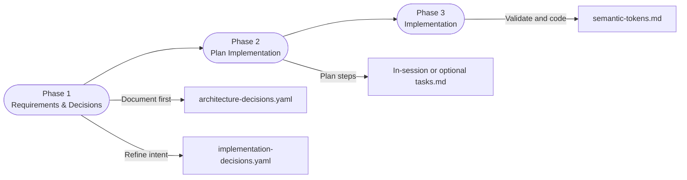
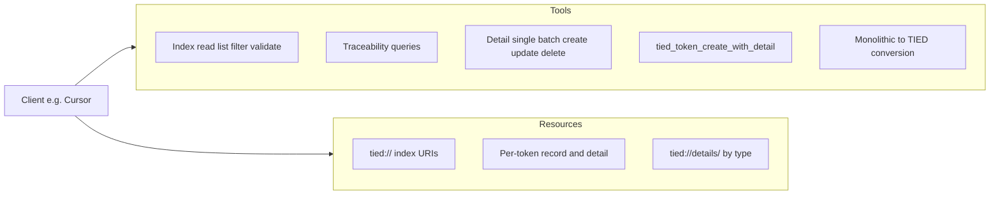
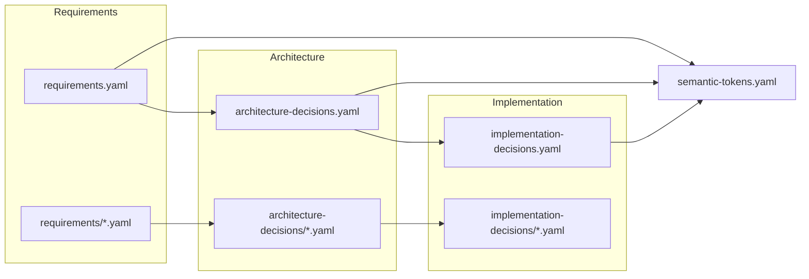
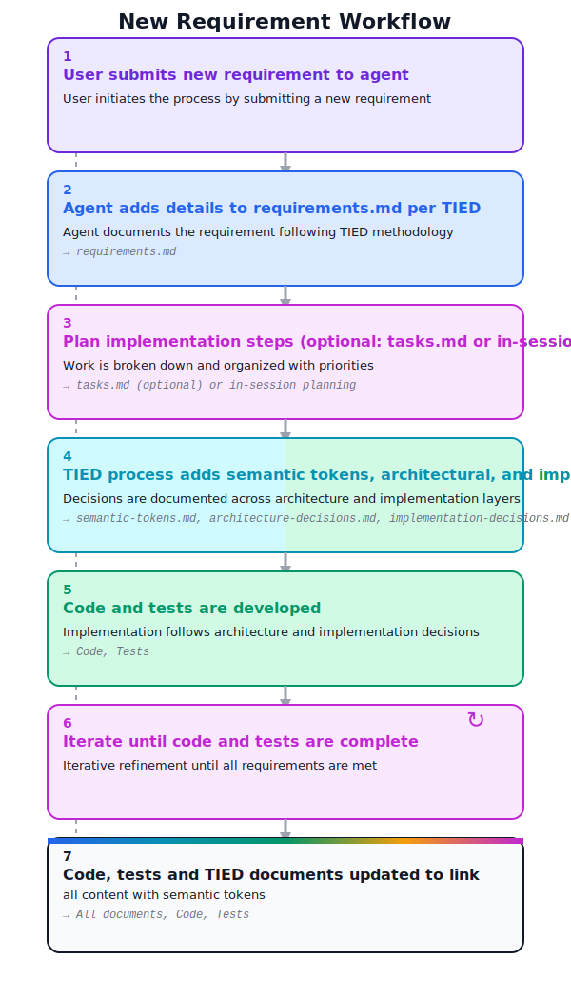
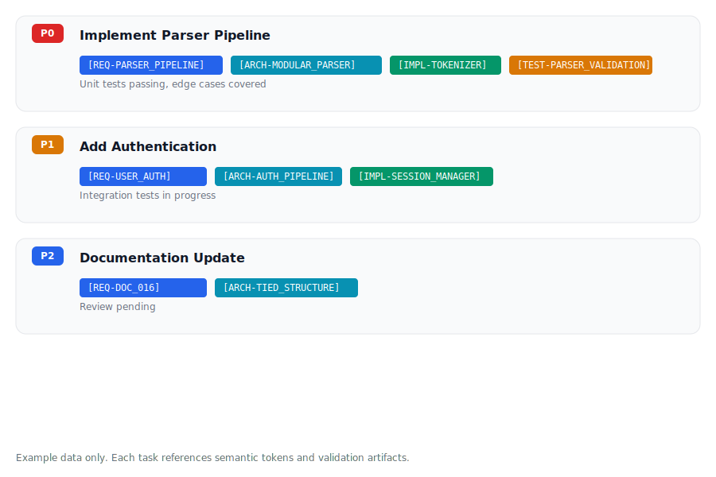

# TIED Methodology Template

**TIED Methodology Version**: 2.2.0

> **Note**: This methodology was previously known as STDD (Semantic Token-Driven Development). It has been renamed to TIED (Token-Integrated Engineering & Development) to better reflect its core value proposition: semantic tokens "tie" code to intent, making it impossible to modify code without confronting related context.

> **v2.2.0**: Task tracking via `tasks.md` is **optional**. The core TIED value is in the **traceability chain** (requirements → architecture → implementation → tests → code) maintained through semantic tokens, not in task tracking artifacts. Agents may maintain planning state in-session or document work breakdown in `implementation-decisions`. Use `tasks.template.md` only if your project benefits from a shared task list.

This repository ([https://github.com/fareedst/tied](https://github.com/fareedst/tied)) contains the **Token-Integrated Engineering & Development (TIED)** methodology template that can be used as a base for development projects in any language.

## What is TIED?

**Token-Integrated Engineering & Development (TIED)** uses semantic tokens to create a traceable chain from requirements through architecture and implementation to tests and code.

### Key Benefits

- **Traceability**: Every code decision can be traced back to its requirement
- **Context Preservation**: The "why" behind decisions is never lost
- **Living Documentation**: Documentation stays connected to code via tokens
- **Onboarding**: New developers can understand intent quickly
- **Refactoring Confidence**: Changes can be validated against original intent

## Getting Started with a New Project

The primary way to work with TIED is via the MCP server; a standalone bootstrap and workflow for non-MCP users is also available.

### Step 1: Copy Templates to Your Project

**Recommended:** Download or clone the TIED repository somewhere convenient, then run `./copy_files.sh /path/to/project` (or `./copy_files.sh` if you are already in the project directory). The script copies every `.template` file into the target project's `tied/` directory, removes the `.template` suffix for you, and will never overwrite an existing `AGENTS.md` or `.cursorrules` file that may already be present in the destination.

```bash
# From the TIED repo root—adjust the target path as needed
./copy_files.sh /path/to/your/project
```

**Alternative (manual):**

```bash
# In your project directory (after cloning/downloading the TIED repository)
mkdir -p tied
cp requirements.template.md tied/requirements.md
cp requirements.template.yaml tied/requirements.yaml
mkdir -p tied/requirements
cp requirements.template/*.md tied/requirements/
cp architecture-decisions.template.md tied/architecture-decisions.md
cp architecture-decisions.template.yaml tied/architecture-decisions.yaml
mkdir -p tied/architecture-decisions
cp architecture-decisions.template/*.md tied/architecture-decisions/
cp implementation-decisions.template.md tied/implementation-decisions.md
cp implementation-decisions.template.yaml tied/implementation-decisions.yaml
mkdir -p tied/implementation-decisions
cp implementation-decisions.template/*.md tied/implementation-decisions/
cp processes.template.md tied/processes.md
cp semantic-tokens.template.md tied/semantic-tokens.md
cp semantic-tokens.template.yaml tied/semantic-tokens.yaml
# Optional: cp tasks.template.md tied/tasks.md  # Task tracking is optional
cp AGENTS.md AGENTS.md              # Copy canonical AI agent guide
cp .cursorrules .cursorrules        # Copy Cursor loader if using Cursor
```

**Important**: Each project should have its own copies of these files. The template files remain in the [TIED repository](https://github.com/fareedst/tied) as reference templates.

### Step 2 (optional): Use the MCP server

The MCP server is **not** copied into your project; it stays in the TIED repository.

1. **Build once** (in the TIED repo): From the TIED repo root, run `cd mcp-server && npm install && npm run build`.
2. **In your development project**, configure your MCP client (e.g. Cursor) so that the server **command/args** point to the **TIED repo's** built server (e.g. `node /path/to/tied-repo/mcp-server/dist/index.js`) and **env** `TIED_BASE_PATH` points to your **project's** `tied/` directory (e.g. `./tied` if your project root is the workspace, or an absolute path).

See [TIED YAML MCP Server](#tied-yaml-mcp-server) and [mcp-server/README.md](mcp-server/README.md) for the exact JSON and paths. For a full example process of adding the TIED MCP to a project and invoking it in several passes (bootstrap, establish REQ/ARCH/IMPL, maintain), see [docs/adding-tied-mcp-and-invoking-passes.md](docs/adding-tied-mcp-and-invoking-passes.md).

### Using TIED without MCP

If you do not use MCP, run `./bootstrap_without_mcp.sh /path/to/project` to get the same `tied/` layout; then manage YAML by hand or with tools (e.g. `yq`). See [docs/using-tied-without-mcp.md](docs/using-tied-without-mcp.md) for the workflow.

## Example Workflow

1. **User Request**: "Add user authentication"
2. **AI Response (Planning Phase - NO CODE YET)**: 
   - Creates `[REQ-USER_AUTH]` token in `requirements.yaml`
   - Expands into pseudo-code and decisions
   - **IMMEDIATELY** documents architecture decisions in `architecture-decisions.yaml` with `[ARCH-*]` tokens
   - **IMMEDIATELY** documents implementation decisions in `implementation-decisions.yaml` with `[IMPL-*]` tokens
   - **IMMEDIATELY** updates `semantic-tokens.yaml` with all new tokens
   - Plans implementation steps (optionally in `tasks.md`, or via in-session planning)
   - **NO code changes yet**
3. **User Approval**: User reviews and approves planning documents
4. **Implementation Phase**: 
   - Implement work, starting with highest priority
   - **DURING implementation**: Update documentation as decisions are made or refined
5. **Completion Phase**: 
   - Verify all documentation is up-to-date and mirrors the semantic tokens referenced by the finished code and tests
   - Ensure the semantic tokens registered in `semantic-tokens.yaml` match the tokens used across code, tests, and documentation for these changes

See [LLM Response Guide](llm-response-guide.md) for detailed information about how AI assistants should respond when working with TIED. For the full step-by-step procedure from user prompt to commit (including diagram), see **[docs/new-feature-process.md](docs/new-feature-process.md)** (`[PROC-NEW_FEATURE]`). Commit messages per session: see [CONTRIBUTING.md](CONTRIBUTING.md).

### Phase Flow Shortcut

*Mermaid flowchart showing the documentation-first cadence before code begins.*

## Repository Structure

This repository contains:

### Scripts
- `copy_files.sh` — Bootstrap a project with TIED templates (used by both MCP and non-MCP users; MCP users then configure the server).
- `bootstrap_without_mcp.sh` — Same bootstrap as `copy_files.sh`, then prints next steps for non-MCP users.

### Methodology Documentation (Reference Only)
- `TIED.md` - TIED methodology overview (for beginners, intermediate, and experts)
- `ai-principles.md` - Complete TIED principles and process guide
- `tied-language-spec.md` - TIED language specification (pseudo-code templates with semantic tokens)
- `conversation.template.md` - Template conversation demonstrating TIED workflow
- `AGENTS.md` - Canonical AI agent operating guide
- `.cursorrules` - Cursor IDE loader that points to `AGENTS.md`
- `CHANGELOG.md` - Version history of the TIED methodology
- `VERSION` - Current methodology version

### Project Template Files (Copy to Your Project)
- `requirements.template.md` - Template guide for requirements documentation
- `requirements.template.yaml` - YAML database template for requirements with `[REQ-*]` tokens **(v1.5.0: structured fields for traceability, rationale, criteria, metadata)**
- `requirements.template/` - Individual requirement detail file examples
- `architecture-decisions.template.md` - Template guide for architecture decisions documentation
- `architecture-decisions.template.yaml` - YAML database template for architecture decisions with `[ARCH-*]` tokens **(v1.5.0: structured fields for traceability, rationale, alternatives, metadata)**
- `architecture-decisions.template/` - Individual architecture decision detail file examples
- `implementation-decisions.template.md` - Template guide for implementation decisions documentation
- `implementation-decisions.template.yaml` - YAML database template for implementation decisions with `[IMPL-*]` tokens **(v1.5.0: structured fields for traceability, rationale, code_locations, metadata)**
- `implementation-decisions.template/` - Individual implementation decision detail file examples
- `processes.template.md` - Template for process tracking including `[PROC-YAML_DB_OPERATIONS]`, `[PROC-TEST_STRATEGY]`, `[PROC-TIED_DEV_CYCLE]`, and `[PROC-NEW_FEATURE]` (new feature implementation; full procedure in [docs/new-feature-process.md](docs/new-feature-process.md))
- `semantic-tokens.template.md` - Template for semantic token registry
- `semantic-tokens.template.yaml` - YAML registry of REQ/ARCH/IMPL/PROC tokens (minimal, foundational for bootstrap)
- `tasks.template.md` - **Optional** template for task tracking (not required by methodology)

The YAML index templates (`*.template.yaml`) contain only methodology-relevant records; new REQ/ARCH/IMPL can be added via the MCP server tools or by copying the template block at the bottom of each index file (or a template detail file such as `requirements.template/REQ-IDENTIFIER.yaml`).

## Project File Structure

After copying templates, your project should have:

```
your-project/
├── AGENTS.md                 # Canonical AI agent instructions
├── .cursorrules              # Cursor IDE loader (optional, if using Cursor)
├── tied/
│   ├── requirements.md       # Requirements guide/documentation
│   ├── requirements.yaml     # Requirements YAML index/database with [REQ-*] records
│   ├── requirements/         # Individual requirement detail files
│   │   ├── REQ-TIED_SETUP.md
│   │   ├── REQ-MODULE_VALIDATION.md
│   │   └── ...
│   ├── architecture-decisions.md  # Architecture decisions guide/documentation
│   ├── architecture-decisions.yaml # Architecture decisions YAML index/database with [ARCH-*] records
│   ├── architecture-decisions/    # Individual architecture decision detail files
│   │   ├── ARCH-TIED_STRUCTURE.md
│   │   ├── ARCH-MODULE_VALIDATION.md
│   │   └── ...
│   ├── implementation-decisions.md # Implementation decisions guide/documentation
│   ├── implementation-decisions.yaml # Implementation decisions YAML index/database with [IMPL-*] records
│   ├── implementation-decisions/   # Individual implementation decision detail files
│   │   ├── IMPL-MODULE_VALIDATION.md
│   │   └── ...
│   ├── semantic-tokens.yaml   # Semantic tokens YAML index/database (canonical token registry)
│   ├── semantic-tokens.md     # Semantic tokens guide with format and conventions
│   ├── tasks.md              # (Optional) Your project's active task tracking
│   └── processes.md          # Your project's process tracking (includes [PROC-YAML_DB_OPERATIONS])
└── [your source code]        # Your actual project code
```

**Note**: The methodology documentation files (`TIED.md`, `ai-principles.md`) remain in the [TIED repository](https://github.com/fareedst/tied) as reference. You don't need to copy them to your project unless you want local copies.

## TIED YAML MCP Server

This repository includes an **MCP (Model Context Protocol) server** that exposes the TIED YAML indexes and detail files as **tools** and **resources** for AI assistants and editors (e.g. Cursor).

- **Location**: `mcp-server/` (in this TIED repo; the server is not copied into your project).
- **Build**: In the **TIED repository**, run `cd mcp-server && npm install && npm run build` (the server is not copied into your project).
- **Configure**: In your **development project**, add or edit your MCP config (e.g. `.cursor/mcp.json`) so the server runs from the **TIED repo's** `mcp-server/dist/index.js` and `TIED_BASE_PATH` is set to your **project's** `tied/` directory.

See [mcp-server/README.md](mcp-server/README.md) for the full tool and resource list, example JSON, and usage.

### Value of MCP for managing REQ/ARCH/IMPL

MCP gives AI assistants and tools a single, consistent way to read and write requirements, architecture, and implementation decisions without editing YAML by hand. Benefits:

- **Discoverability**: List tokens by index or type; run traceability queries (which ARCH/IMPL satisfy a REQ; which REQs does a decision reference).
- **Bulk and single-token detail access**: Read one detail file by token or request details for many tokens (or all tokens of a type) in one call.
- **One-shot creation**: Create a new REQ, ARCH, or IMPL token with both index record and full detail YAML in a single tool call (`tied_token_create_with_detail`).
- **Migration**: Convert monolithic requirements/architecture/implementation markdown into TIED YAML indexes and detail files via conversion tools.

This works for **any language or stack**: TIED is methodology-level; the server only needs a `tied/` (or `TIED_BASE_PATH`) layout with YAML indexes and optional detail directories.

### MCP API

**Tools**: Index read, list tokens, filter by field, validate YAML; config (`tied_config_get_base_path`); traceability (`get_decisions_for_requirement`, `get_requirements_for_decision`); index insert/update; detail read (single and batch `yaml_detail_read_many`), detail list/create/update/delete; create-with-detail (`tied_token_create_with_detail`); feedback (`tied_feedback_add`, `tied_feedback_export`) for feature requests, bug reports, and methodology reporting to the TIED project; monolithic-to-TIED conversion (per-doc or all at once).

**Resources**: Full indexes (`tied://requirements`, `tied://architecture-decisions`, `tied://implementation-decisions`, `tied://semantic-tokens`); single record by token (`tied://requirement/{token}`, `tied://decision/{token}`); single-token detail (`tied://requirement/{token}/detail`, `tied://decision/{token}/detail`); all details by type (`tied://details/requirements`, `tied://details/architecture`, `tied://details/implementation`).



*MCP API: tools (index, traceability, detail, create-with-detail, conversion) and resources (index URIs, per-token, details-by-type).*

**For AI agents**: Use the TIED MCP server as the **primary** way to read and write TIED data. See [docs/ai-agent-tied-mcp-usage.md](docs/ai-agent-tied-mcp-usage.md) for the full directive (MCP-first; direct file access only when no tool supports the operation).

**Configuration and validation**

- **`tied_config_get_base_path`** — Returns the effective TIED base path and raw `TIED_BASE_PATH` env value; use to confirm configuration or debug path issues.
- **`yaml_index_validate`** — Validates YAML syntax of all TIED index files (requirements, architecture, implementation, semantic-tokens). Run after edits to ensure indexes are parseable; combine with project token validation (e.g. `./scripts/validate_tokens.sh`) for full data validation before considering a pass complete.

### Data flow

REQ, ARCH, and IMPL live as YAML indexes plus per-token detail files. Traceability links connect them; `semantic-tokens.yaml` is the registry.



*REQ index and detail dir feed ARCH, then IMPL; all reference the semantic-tokens registry. MCP tools and resources read/write these files under TIED_BASE_PATH.*

## Key Principles

### v1.5.0 Structured YAML Schema

The YAML index files use **structured, machine-parseable fields** instead of markdown-formatted strings:

- **Structured traceability**: `traceability.architecture[]`, `traceability.tests[]` - Direct list access
- **Structured rationale**: `rationale.why`, `rationale.problems_solved[]`, `rationale.benefits[]` - Organized reasoning
- **Structured criteria**: Lists of items with optional metrics/coverage for precise validation
- **Structured metadata**: Grouped `created`, `last_updated`, `last_validated` with date/author/reason/result

**Query Examples**:
```bash
# Get architecture dependencies
yq '.REQ-TIED_SETUP.traceability.architecture[]' tied/requirements.yaml

# Get satisfaction criteria
yq '.REQ-TIED_SETUP.satisfaction_criteria[].criterion' tied/requirements.yaml

# Get alternatives considered
yq '.ARCH-TIED_STRUCTURE.alternatives_considered[].name' tied/architecture-decisions.yaml

# Get code file locations
yq '.IMPL-TIED_FILES.code_locations.files[].path' tied/implementation-decisions.yaml
```

This enables **direct field access**, **structured queries**, **easy filtering**, and **better tool integration** compared to parsing markdown-formatted strings.

---

1. **Semantic Token Cross-Referencing**
   - All code, tests, requirements, architecture, and implementation decisions MUST be cross-referenced using semantic tokens

2. **Documentation-First Development**
   - Requirements MUST be expanded into pseudo-code and architectural decisions before implementation
   - No code changes until requirements are fully specified with semantic tokens

3. **Independent Module Validation Before Integration**
   - Logical modules MUST be validated independently before integration into code satisfying specific requirements
   - Each module must have clear boundaries, interfaces, and validation criteria defined before development
   - Modules must pass independent validation (unit tests with mocks, integration tests with test doubles, contract validation, edge case testing, error handling validation) before integration
   - Integration only occurs after module validation passes
   - **Rationale**: Eliminates bugs related to code complexity by ensuring each module works correctly in isolation before combining with other modules

4. **Test-Driven Documentation**
   - Tests MUST reference the requirements they validate using semantic tokens
   - Test names should include semantic tokens

5. **Priority-Based Implementation**
   - Work should be prioritized: P0 (Critical) > P1 (Important) > P2 (Nice-to-have) > P3 (Future)
   - Focus on Tests > Code > Basic Functions > Infrastructure

6. **Test strategy and E2E-only minimization** ([PROC-TEST_STRATEGY], [REQ-MODULE_VALIDATION])
   - Minimize code that is only measurable via E2E or manual testing; logic should live in testable modules unless justified.
   - IMPL details can classify testability (`unit` | `integration` | `e2e_only`) and, when `e2e_only`, document the reason (`e2e_only_reason`).
   - Use the TIED development cycle ([PROC-TIED_DEV_CYCLE]) per session: plan from REQ/ARCH/IMPL, author pseudo-code and tokens, add and align tests, implement (TDD), minimal glue, validate, then sync TIED to code and update README/CHANGELOG.

## Visual Guides

### New Requirement Timeline


### Traceability Graph

*Sample graph illustrating how requirements branch to architecture and implementation tokens before hitting validation tests.*

### Task & Token Alignment


| Work Item | Priority | Token Trail | Validation Evidence
| --- | --- | --- | ---
| Implement Parser Pipeline `[REQ-CFG_005]` | P0 | `[ARCH-FORMAT_PIPELINE] → [IMPL-PLACEHOLDER_ENGINE]` | Token audit + formatter unit test bundle
| Validate Formatter Module | P1 | `[ARCH-MODULE_VALIDATION] → [IMPL-VALIDATION_SUITE]` | Contract test suite + `[PROC-TOKEN_VALIDATION]` run
| Update Docs for New Feature | P2 | `[REQ-TIED_SETUP] → [ARCH-TIED_STRUCTURE] → [IMPL-TIED_FILES]` | Documentation review checklist

*Hypothetical work items showing how planning (whether in `tasks.md`, `implementation-decisions`, or in-session) should carry semantic tokens and validation artifacts.*


## Language-Specific Notes

The TIED methodology is language-agnostic. When customizing templates for your project:

- **Language‑specific projects**: Update code examples in templates to match your chosen language
- **Other languages**: Adapt the templates to your language's conventions

The semantic token system and development process remain the same regardless of language.

## Repository

**TIED Methodology Repository**: [https://github.com/fareedst/tied](https://github.com/fareedst/tied)

# License

The document is available as open source under the terms of the [MIT License](https://opensource.org/licenses/MIT).
