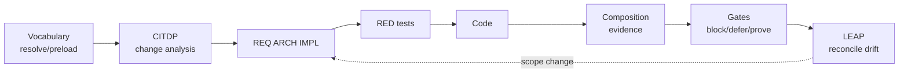

# TIED Methodology

**TIED Methodology Version**: 3.0.0

[TIED](https://github.com/fareedst/tied) means **Token-Integrated Engineering & Development**. This repository is a methodology template for projects built in any language or stack.

## The problem TIED addresses

In a short-lived coding task, the current conversation may be enough context. In a long-lived system, intent is spread across sessions, agents, issue descriptions, design discussions, tests, and implementation details. When that context is not recorded in a form the next person or agent can reload, the team must reconstruct it from code.

That reconstruction creates a predictable failure mode:

- clearly specified behavior is usually easy to review;
- unspecified behavior is often filled in by an implementation choice;
- the choice may become an accidental requirement;
- the mismatch is discovered later in review, integration, maintenance, or production.

TIED is designed for work where preserving the reasoning matters: multi-session development, agent-assisted implementation, changing tools or languages, and systems expected to live through refactors. It does not promise zero rework. It gives intent a durable structure that can be revised when the system teaches us something new.

## Sponsor and executor: the iceberg model

The human sponsor stays above the waterline. The sponsor:

- states what must be true and why;
- bounds the change with unchanged behavior, non-goals, and explicit success conditions;
- resolves ambiguous terms;
- decides at classification points, such as accepting an architectural trade-off or owning a deferral;
- reviews evidence and outcomes rather than choreographing every file edit.

The executor is the discipline below the waterline. TIED carries the sponsor’s intent through:

```text
shared vocabulary  → understanding
change analysis    → blast radius and risks
requirements       → what must be true (REQ)
architecture       → boundaries and trade-offs (ARCH)
implementation     → operational contracts (IMPL pseudo-code)
tests              → executable evidence
code               → mechanism
composition        → binding seams tested separately
gates              → block, defer with ownership, or prove
LEAP               → reconcile drift upward (IMPL → ARCH → REQ)
```

The sponsor designs from the top. The methodology makes the mass below the waterline visible and reviewable.

## Gated lifecycle and classification

TIED treats unspecified behavior as work to classify, not as permission for an agent to improvise silently.


```mermaid
flowchart LR
    Vocab["Vocabulary\nresolve/preload"]
    CITDP["CITDP\nchange analysis"]
    Stack["REQ ARCH IMPL"]
    Tests["RED tests"]
    Code["Code"]
    Composition["Composition\nevidence"]
    Gates["Gates\nblock/defer/prove"]
    LEAP["LEAP\nreconcile drift"]

    Vocab --> CITDP --> Stack --> Tests --> Code --> Composition --> Gates --> LEAP
    LEAP -.->|"scope change"| Stack
```

At the relevant gate, an edge case or open question belongs in one of five buckets:

1. **Required behavior** — a product obligation recorded in a REQ.
2. **Architectural constraint** — a boundary or trade-off recorded in an ARCH decision.
3. **Implementation failure mode** — an operational risk or error path recorded in an IMPL decision.
4. **Test obligation** — evidence that must be created and run.
5. **Explicit deferral or waiver** — an owned risk with a reason, owner, and expiry or review point.

If a decision cannot be classified, the checklist and configured gate policy can block progression until the missing intent is resolved. An explicit deferral is different from silently leaving a gap.

The negative space is part of the design. Record what must remain unchanged, what is out of scope, and which counterexamples would falsify “done.” The full procedure is the [agent requirement implementation checklist](tied/docs/agent-req-implementation-checklist.md), identified by `[PROC-AGENT_REQ_CHECKLIST]`.

## What TIED is

TIED creates a traceability chain:

```text
vocabulary → REQ (what and why) → ARCH (high-level how)
          → IMPL (operational how and pseudo-code)
          → tests → code → composition and quality evidence
```

Semantic tokens such as `[REQ-FEATURE]`, `[ARCH-DESIGN]`, and `[IMPL-IMPLEMENTATION]` connect the records, tests, code, and documentation. The token registry is `tied/semantic-tokens.yaml`.

TIED is methodology-level and language-independent. Templates and process rules can be adapted to Go, Ruby, TypeScript, Swift, or another stack. Language-specific syntax belongs in the implementation decision for that project; the intent and traceability model remains the same.

LEAP means **Logic Elevation And Propagation**. When tests or code disagree with an existing implementation decision, reconcile the written logic first: update IMPL, then ARCH and REQ when scope changed. LEAP does not invent requirements; it resynchronizes an existing stack.

## Benefits, costs, and fit

TIED is most useful when context has to survive time, people, agents, and implementation changes.

Potential benefits include:

- **Temporal context** — the reasons behind decisions can be reloaded after a session ends.
- **Horizontal consistency** — vocabulary gives sponsors, pseudo-code, tests, and code one preferred set of terms.
- **Vertical traceability** — a requirement can be followed through architecture, implementation, evidence, and code.
- **Implementation fluidity** — a project can change tools or languages while preserving and reconciling intent.
- **Visible technical debt** — ambiguity, missing failure modes, binding gaps, and owned deferrals become discussable records.
- **Reviewable evidence** — reviewers can distinguish unit, composition, E2E, structural, and other evidence instead of relying on a green status alone.

Those benefits have costs:

- terms and boundaries need clarification earlier;
- records, tokens, and links need maintenance;
- gates add friction when work is genuinely underspecified;
- a team can create false confidence if it bypasses gates or records evidence without challenging the assumptions.

TIED is a poor fit for a disposable script, a one-off experiment, or work whose context will not outlive a single session. A lightweight vocabulary and requirement record may be enough for a small change; integrated checklist, evidence, and adversarial depth should be reserved for work whose risk and lifespan justify them.

## Proof boundaries and honest limits

TIED makes a class of technical debt more explicit and reviewable. That is an operational hypothesis about a workflow, not a controlled claim that debt or bugs disappear.

```text
valid records != correct product
passing tests != complete edge-case coverage
traceability != runtime correctness
```

Records can be wrong. Tests can miss behavior. Structural checks can pass while runtime behavior fails. Gate receipts and consistency checks show what was checked and what remains unresolved; they do not replace domain judgment, execution, or production observation.

## How to use this repository

There are two useful starting points:

1. **Evaluate TIED** — read this overview, then the [Core seven references](tied/docs/client-development-index.md), [LEAP guide](tied/docs/LEAP.md), and [methodology diagrams](tied/docs/methodology-diagrams.md).
2. **Bootstrap a client** — run `copy_files.sh` against a project, then choose the optional MCP or documented non-MCP workflow below.

The TIED repository is the source of the methodology. A client receives its own copy of the layout and can maintain project-specific requirements, decisions, and tokens without changing the inherited methodology.

## Spec-driven execution (optional)

For a new client, an ordered feature-spec YAML can drive one change at a time through the checklist. A spec commonly contains `order`, `feature_name`, `goal`, `rules`, `examples`, `boundary_conditions`, and `out_of_scope`.

Example:

```yaml
- order: 1
  feature_name: "Default search root"
  goal: "A search runs from the current working directory when no root path is provided."
  rules:
    - "If no root path is given, the search root is the current working directory."
    - "The run summary shows the effective search root."
  examples:
    - given: "the current working directory contains app.rb"
      when: "a file-name search for 'app' is run with no root path"
      then: "app.rb is eligible to match and the summary shows the current working directory"
  boundary_conditions:
    - "An empty root path is treated the same as no root path."
  out_of_scope: "Resolving shell aliases or environment-variable syntax in the path"
```

Run one selected spec with the Ruby driver:

```bash
./scripts/run-feature-batch.sh \
  --workspace . \
  --prompt-file ./tied/agent-preload-contract.yaml \
  --lead-checklist-yaml $TIED/tied/docs/agent-req-implementation-checklist.yaml \
  --feature-spec-batch-yaml ./prompts/initial-specs.yaml \
  --select-order 1
```

The Go alternative is `scripts/run-feature-batch-agentstream.sh`, backed by `tools/agentstream`. Its optional TIED MCP preflight is enabled with `--tied-mcp-preflight` or `AGENTSTREAM_TIED_MCP_PREFLIGHT=1`; it is off by default. See [tools/agentstream/README.md](tools/agentstream/README.md) for the Go runner and [tools/agent-stream/README.md](tools/agent-stream/README.md) for the Ruby runner.

## Getting started with a new project

### 1. Copy the methodology

From a TIED repository clone, run:

```bash
./copy_files.sh /path/to/your/project
```

The script copies the inherited methodology from `templates/` into the client’s `tied/methodology/`, creates missing project indexes under `tied/`, and copies the canonical guides into `tied/docs/`. It does not overwrite an existing `AGENTS.md` or `.cursorrules`.

Methodology-owned YAML under `tied/methodology/` is read-only in the client and can be refreshed by running `copy_files.sh` again. Project-owned REQ/ARCH/IMPL indexes and detail files live at the root of the client’s `tied/` directory and are not overwritten.

### 2. Optionally enable the MCP server

The MCP server stays in this TIED repository; it is not copied into the client. Build it once from the TIED repository root:

```bash
cd mcp-server && npm install && npm run build
```

The resulting `mcp-server/dist/index.js` can serve a client. `copy_files.sh` creates `.cursor/mcp.json` with the `tied-yaml` entry when that file is missing, and preserves an existing file byte-for-byte. For manual configuration or details, see [adding TIED MCP and invoking passes](tied/docs/adding-tied-mcp-and-invoking-passes.md). From the client project root, the recommended Cursor flow is:

```bash
agent mcp enable tied-yaml
```

Approve the project MCP configuration when prompted, then type `quit` to exit the interactive Agent session. Set `TIED_BASE_PATH` to the client’s absolute `tied/` directory. If the server binary is outside the client tree, set `TIED_MCP_BIN` to the absolute path of the TIED repository’s `mcp-server/dist/index.js`.

Confirm the server with a tool such as `yaml_index_read` or `tied_config_get_base_path`, or read the `tied://requirements` resource. The [MCP server README](mcp-server/README.md) documents the full tool surface and configuration.

### 3. Work without MCP

If Node or the built server is unavailable, use the documented bootstrap and manual project-YAML workflow:

```bash
./bootstrap_without_mcp.sh /path/to/your/project
```

Read [using TIED without MCP](tied/docs/using-tied-without-mcp.md) before managing project records by hand.

## Tooling and scripts

- `copy_files.sh` — bootstrap a project with the inherited TIED layout.
- `bootstrap_without_mcp.sh` — bootstrap and print next steps for non-MCP use.
- `scripts/run-feature-batch.sh` — Ruby feature-spec batch driver with checklist and resume support.
- `scripts/run-feature-batch-agentstream.sh` — Go `agentstream` feature-spec and checklist driver.
- `tools/agent-stream/` — Ruby `agent` stream-json runner for multi-turn TIED sessions.
- `tools/agentstream/` — Go runner with feature batches, checklist expansion, TDD YAML, and optional MCP preflight.
- `scripts/yaml_tool.sh` and `scripts/lint_yaml.sh` — canonicalize or lint TIED YAML according to the documented edit loop.
- `scripts/prepare_readme_demo.sh` — bootstrap `tied/` when needed and run the README’s structured YAML query examples.
- `mcp-server/` — TypeScript MCP server for TIED indexes, details, traceability, and validation.

## Where to read next

The [client development index](tied/docs/client-development-index.md) names the Core seven documents for applying TIED:

1. [AGENTS.md](AGENTS.md) — repository operating rules.
2. [Vocabulary routing](tied/vocab/routing.md) — resolve and preload preferred terms.
3. [Agent requirement implementation checklist](tied/docs/agent-req-implementation-checklist.md) — the executable process.
4. [Checklist YAML](tied/docs/agent-req-implementation-checklist.yaml) — the trackable copy of that process.
5. [Processes](tied/docs/processes.md) — definitions for CITDP, LEAP, TDD, validation, and evidence.
6. [Pseudo-code guide](tied/docs/pseudocode-writing-and-validation.md) — author and validate IMPL behavior contracts.
7. [CITDP policy and record template](tied/docs/citdp-policy.md) — determine when to persist change analysis.

For orientation, read [methodology diagrams](tied/docs/methodology-diagrams.md) and the [LEAP guide](tied/docs/LEAP.md). For YAML operations, use the [TIED YAML agent index](tied/docs/tied-yaml-agent-index.md) and the [tied-yaml skill](.cursor/skills/tied-yaml/SKILL.md). Agents should read [AGENTS.md](AGENTS.md) before working in a client project.

## Repository layout

```text
stdd/
├── templates/                 # Canonical methodology YAML copied to clients
├── tied/
│   ├── docs/                  # Methodology guides and executable checklists
│   ├── vocab/                 # Source-repository domain vocabulary
│   └── ...                    # Project indexes and detail data
├── mcp-server/                # TIED YAML MCP server
├── tools/
│   ├── agent-stream/           # Ruby stream-json runner
│   └── agentstream/            # Go runner and CLI
├── scripts/                   # Bootstrap, batch, YAML, and analysis utilities
├── copy_files.sh              # Client bootstrap
├── bootstrap_without_mcp.sh   # Non-MCP bootstrap
├── AGENTS.md                  # Agent operating guide
└── CHANGELOG.md               # Methodology version history
```

Client projects keep project-specific data in `tied/`, while inherited methodology YAML is under `tied/methodology/`. See [copy_files.sh](copy_files.sh) for the exact copied file set.

## Language-specific adaptation

TIED remains language-independent. Adapt code examples, test commands, and implementation details to the client’s language and tooling while retaining the REQ → ARCH → IMPL → tests → code traceability model.

## License

This document is available as open source under the terms of the [MIT License](https://opensource.org/licenses/MIT).
