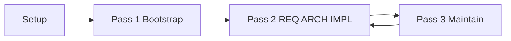

# Adding the TIED MCP to a Project and Invoking It in Several Passes

This document describes the **MCP-first** process to establish and maintain REQ (requirements), ARCH (architecture decisions), and IMPL (implementation decisions) in a project using the TIED YAML Index MCP server. It is intended for developers and AI agents who are setting up TIED in a project and want to use the MCP server across multiple, ordered passes.

**Related**: [REQ-CONVERSION_TOOL], [PROC-YAML_DB_OPERATIONS], [ARCH-TIED_STRUCTURE]

---

## 1. Purpose and audience

This guide explains how to add the TIED MCP server to a development project and how to invoke it in **several passes** so that requirements, architecture, and implementation decisions are created and maintained with full traceability. The workflow is MCP-first: the primary way to create and query REQ/ARCH/IMPL is via MCP tools and resources, with optional use of scripts (e.g. `copy_files.sh`) for bootstrap.

**Audience**: Developers or AI agents configuring TIED in a project and using the MCP server to establish and maintain the REQ → ARCH → IMPL chain.

---

## 2. Prerequisites

- **Node.js 18+** (required to run the MCP server).
- **TIED repository** cloned or downloaded (the repo that contains `mcp-server/`, templates, and this doc).
- **Target project** with a chosen workspace root (the project that will have a `tied/` directory).
- **Cursor** (or another MCP client) for the configuration examples that use `.cursor/mcp.json`.

---

## 3. Adding the TIED MCP to a project (one-time)

### 3.1 Build the server

Build the MCP server **in the TIED repository** (not inside your project):

```bash
cd mcp-server
npm install
npm run build
```

The server binary lives at `mcp-server/dist/index.js` inside the TIED repo. Your project does not contain the server; it only references it via MCP configuration.

### 3.2 Configure MCP in the project

In your **development project** (the project that has or will have a `tied/` directory), add or edit the MCP config. For Cursor, this is typically `.cursor/mcp.json` in the project root (or Cursor Settings → MCP with the project as workspace).

- **command**: `"node"`
- **args**: Absolute path to the TIED repo’s built server, e.g. `"/path/to/tied/mcp-server/dist/index.js"`
- **env.TIED_BASE_PATH**: Your project’s `tied/` directory — use an absolute path (e.g. `/path/to/your/project/tied`) or a path relative to the workspace root (e.g. `tied` or `./tied`)

Example:

```json
{
  "mcpServers": {
    "tied-yaml": {
      "command": "node",
      "args": ["/path/to/tied/mcp-server/dist/index.js"],
      "env": {
        "TIED_BASE_PATH": "/path/to/your/project/tied"
      }
    }
  }
}
```

Path resolution: All path parameters (`output_base_path`, `file_path`, etc.) are resolved by the Node process. Absolute paths are used as-is; relative paths are resolved relative to the process current working directory (usually the workspace root). `TIED_BASE_PATH` is also cwd-relative unless you set it to an absolute path. See [mcp-server/README.md](../mcp-server/README.md) for details.

### 3.3 Verify

- List MCP tools (e.g. `yaml_index_read`, `convert_monolithic_requirements`) to confirm the server is loaded.
- Read a resource such as `tied://requirements` (or attempt a read) to confirm the server sees your project’s `tied/` — you may get empty or missing-file behavior before bootstrap, which is expected.

---

## 4. Pass 1: Bootstrap (get a `tied/` layout)

Before the MCP server can manage REQ/ARCH/IMPL, the project must have a `tied/` directory with YAML indexes (and optionally detail files). Choose one of the following.

### Option A — From templates (greenfield)

Run from the **TIED repository** root:

```bash
./copy_files.sh /path/to/your/project
```

This copies template YAML indexes and guide docs into the project’s `tied/` directory. No MCP conversion is involved. After this, MCP tools operate on that `tied/` (with `TIED_BASE_PATH` pointing to it).

### Option B — From monolithic docs (migration) [REQ-CONVERSION_TOOL]

If you have existing monolithic `requirements.md`, `architecture-decisions.md`, and `implementation-decisions.md`, use the MCP conversion tools to create `tied/` with YAML indexes and detail files.

**Single pass:** Call the tool `convert_monolithic_all` with:

- `requirements_path`, `architecture_path`, `implementation_path` — paths to your monolithic markdown files (or use `requirements_content`, `architecture_content`, `implementation_content` to pass raw content; content overrides path when both are set).
- `output_base_path` — e.g. `tied` or the value of `TIED_BASE_PATH`.
- Optionally `dry_run: true` first to get `tokens`, `index_path`, and `detail_paths` without writing.

**Three passes:** If you prefer to run conversions one document at a time (e.g. to inspect or fix between steps):

1. Call `convert_monolithic_requirements` with `file_path` or `content`, and `output_base_path` (e.g. `tied`). Optionally `dry_run: true` first.
2. Call `convert_monolithic_architecture` with the same `output_base_path`.
3. Call `convert_monolithic_implementation` with the same `output_base_path`.

Order (REQ → ARCH → IMPL) matches the dependency chain and the internal order of `convert_monolithic_all`.

After conversion, update `semantic-tokens.yaml` with any new tokens (manually or via MCP index tools). See [mcp-server/README.md](../mcp-server/README.md) and [using-tied-without-mcp.md](using-tied-without-mcp.md) for non-MCP alternatives.

---

## 5. Pass 2: Establish REQ → ARCH → IMPL (documentation-first, no code yet)

This pass aligns with **TIED Phase 1: Requirements → Pseudo-Code** and the documentation-first rule in [ai-principles.md](../ai-principles.md). No code changes; only YAML indexes and detail files.

### Pass 2a — Create a new requirement

- Use **`yaml_index_insert`** with `index: "requirements"`, `token` (e.g. `REQ-MY_FEATURE`), and `record` (JSON string with name, category, priority, status, rationale, satisfaction_criteria, validation_criteria, traceability, detail_file, metadata, etc.), **or**
- Use **`tied_token_create_with_detail`** to create the requirement token with both an index record and a detail YAML file in one call.

Record satisfaction criteria, validation criteria, and rationale so the requirement is fully specified before architecture and implementation.

### Pass 2b — Create architecture linked to REQ

- Use **`yaml_index_insert`** with `index: "architecture"` and a record that includes traceability to the `[REQ-*]` token(s), **or**
- Use **`tied_token_create_with_detail`** for the architecture token.

Optionally read existing requirements first via **`yaml_index_read`** (index `requirements`) or the resource **`tied://requirements`** to keep cross-references consistent.

### Pass 2c — Create implementation linked to ARCH and REQ

- Use **`yaml_index_insert`** with `index: "implementation"` and a record that references the relevant `[ARCH-*]` and `[REQ-*]` tokens, **or**
- Use **`tied_token_create_with_detail`** for the implementation token.

Optionally call **`get_decisions_for_requirement`** with the requirement token to see existing ARCH/IMPL before adding a new implementation decision.

### Pass 2d — Register tokens

Ensure every new REQ/ARCH/IMPL token is present in **`semantic-tokens.yaml`**. Use **`yaml_index_insert`** or **`yaml_index_update`** on the index **`semantic-tokens`** to add or update entries (e.g. type, status, source_index).

**Summary:** This pass produces only documentation (YAML indexes and detail files). It satisfies “expand requirements into pseudo-code and decisions before implementation.”

---

## 6. Pass 3: Maintain and query (ongoing)

Use the MCP server to keep REQ/ARCH/IMPL consistent and to drive planning or implementation.

### Traceability

- **`get_decisions_for_requirement`** — Given a requirement token (e.g. `REQ-TIED_SETUP`), returns all ARCH and IMPL that reference it.
- **`get_requirements_for_decision`** — Given a decision token (ARCH-* or IMPL-*), returns all REQ it references (with full requirement records).

Use these to check consistency and to see the impact of a requirement or decision.

### Bulk read

- **Resources**: `tied://requirements`, `tied://architecture-decisions`, `tied://implementation-decisions`, `tied://semantic-tokens`.
- **Details by type**: `tied://details/requirements`, `tied://details/architecture`, `tied://details/implementation`.

Use these to load full context for the LLM or tooling.

### Single record and detail

- **Tools**: **`yaml_detail_read`**, **`yaml_detail_read_many`** (by token(s) or by type).
- **Resources**: `tied://requirement/{token}`, `tied://decision/{token}`, `tied://requirement/{token}/detail`, `tied://decision/{token}/detail`.

### Updates

- **`yaml_index_update`** and **`yaml_detail_update`** — Refine existing records or detail files.
- **`yaml_index_validate`** — Validate YAML syntax of all index files under `TIED_BASE_PATH`. Run this (and any project-specific token validation script, e.g. `./scripts/validate_tokens.sh`) before considering the pass complete.

### Token audit

Follow [ai-principles.md](../ai-principles.md) and [AGENTS.md](../AGENTS.md): confirm that code and tests carry the correct `[REQ-*]`, `[ARCH-*]`, and `[IMPL-*]` tokens and that the registry matches usage. Run the project’s token validation script when available.

---

## 7. Example flow diagram



- **Setup**: Build MCP server in TIED repo; configure MCP in project with `TIED_BASE_PATH`.
- **Pass 1**: Bootstrap `tied/` via `copy_files.sh` or conversion tools (single or three-pass).
- **Pass 2**: Establish REQ → ARCH → IMPL with index/detail tools and register tokens (no code).
- **Pass 3**: Maintain via traceability queries, bulk/single reads, updates, and token audit; iterate back to Pass 2 when adding new requirements or decisions.

---

## 8. References

| Document | Description |
|----------|-------------|
| [mcp-server/README.md](../mcp-server/README.md) | Full tool and resource list, Cursor config example, path resolution, conversion options |
| [README.md](../README.md) | Getting Started, Step 2 (MCP), TIED YAML MCP Server section, value of MCP, data flow |
| [docs/using-tied-without-mcp.md](using-tied-without-mcp.md) | Workflow when not using MCP (bootstrap and manual YAML management) |
| [ai-principles.md](../ai-principles.md) | TIED phases, documentation-first rule, token discipline, priority order |
| [AGENTS.md](../AGENTS.md) | Canonical AI agent operating guide and checklists |
