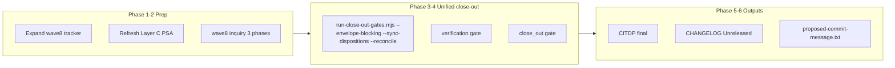

# Wave 8 close-out — adherence realignment

**Status:** Close-out executed 2026-09-11 (`run_id: wave8-closeout-20260911`); verification + close_out `merged_decision.allowed: true`; envelope zero blocking gaps; FILEHASH smoke pass; combined Wave 7+8 commit created.  
**Parent build plan:** [`adherence-realignment-wave8-plan.md`](adherence-realignment-wave8-plan.md) (W8-D1–D7 shipped 2026-09-11)  
**Grandparent analysis:** [`evidence-collection-conversation-patterns.md`](evidence-collection-conversation-patterns.md) (§12 Wave 7 close-out; §13 Wave 8 status)  
**Primary tokens:** `[REQ-TIED_CHECKLIST_GATE_ENFORCEMENT]`, `[REQ-REQUEST_EVIDENCE_ENVELOPE]`, `[PROC-AGENT_REQ_CHECKLIST]`

**Cursor draft source:** `~/.cursor/plans/wave_8_plan-close-out_445d1bb3.plan.md`

---

## Refinement decisions (close-out pass)

| Decision | Accepted value | Rationale |
|---|---|---|
| **Document role** | Unified LEAP close-out procedure for Wave 8 build (W8-D1–D7) on `REQ-TIED_CHECKLIST_GATE_ENFORCEMENT` | Mirrors §12 Wave 7 template; separates **procedure** from **execution receipt** |
| **TIED applicability** | Full TIED under `[PROC-AGENT_REQ_CHECKLIST]`; extend existing REQ/ARCH/IMPL — no new REQ | Same owning REQ as Waves 5–7 |
| **Inquiry depth** | `depth_tier: integrated` | Close-out integrity + methodology tooling + disposable-client replay |
| **Gate policy** | `gate_policy: advisory` for observed/unresolved inquiry findings | Structural/producer-consumer misalignment remains blocking |
| **Quality profiles** | `baseline-functional`, `data-integrity-migration`, `stateful-reliability` | Envelope/ledger layout + sync/replay touch persistence |
| **CITDP timing** | Draft at refine-plan; **finalize at plan-close-out** (`persist-citdp-record`) | `evidence.commands` and `activation.artifact_hashes` populated after gates run |
| **Eligibility triggers** | `strict-close-out`, `methodology-tooling-change`, `persistence`, `external-input` | Matched at `risk-assessment`; no `integrated_waiver` |
| **Tracker strategy** | **Single tracker expansion** on `agent-req-implementation-checklist-wave8-adherence-realignment.yaml` (mirror Wave 7) | Separate `wave8-close-out.yaml` stub **not created** — gate validate pairs one Tracker + one CITDP per wave |
| **Run identity** | `run_id: wave8-closeout-20260911` for inquiry phases, verification, and close_out gates | Distinct from `wave5-*`, `wave7-closeout-*`; reusing Wave 5/7 inquiry fails `activation_pairing_incomplete` |
| **Commit posture** | `commit_deferred: true` on `traceable-commit`; **no git commit** in plan-close-out | Proposed message may combine Wave 7 + Wave 8 if both remain uncommitted |
| **Ambiguity resolutions** | See §0 Resolved terms; disposable FILEHASH smoke ≠ stdd dogfood; `merged_decision` = W8-D4 gate+envelope cross-read | Empirical cohort grading (parent session) |

---

## 0. Resolved terms (close-out-specific)

| Sponsor / observed wording | Canonical meaning | Vocabulary RECORD |
|---|---|---|
| **commit_deferred** | `traceable-commit` completed with `policy.commit_deferred: true`; CHANGELOG + proposed message written; sponsor must explicitly request git commit | prompt-composer.md — **plan-close-out (commit deferred)** |
| **wave8-closeout-20260911** | Identity-bound `run_id` for Wave 8 inquiry phases, verification gate, and close_out gate | quality-assurance.md — **activation pairing** |
| **combined Wave 7+8 commit** | Single proposed message covering Wave 7 (conversation adherence) and Wave 8 (adherence realignment) when both trackers show `commit_deferred` | quality-assurance.md — **traceable-commit** |
| **disposable FILEHASH smoke** | Acceptance replay on `/Users/fareed/Documents/dev/test/1789147101` (`REQ-FILEHASH`); validates W8-D1–D3 fixes without mutating stdd working tree | quality-assurance.md — **evaluation corpus** |
| **stdd dogfood** | Close-out on this repo (`REQ-TIED_CHECKLIST_GATE_ENFORCEMENT`) using Wave 8 tracker/CITDP paths below | methodology-closeout-integrity-plan |
| **merged_decision** | Unified runner output merging gate `allowed` with envelope blocking gaps (`merged_decision.allowed`); authoritative after W8-D4 | quality-assurance.md — **single completion entrypoint** |
| **three completion signals** | **Machine close-out**, **process contract**, **adherence ledger** — never conflated in handoff | [`completion-signals-handoff.md`](../tools/bundled-prompt-type-skills/prompt-shared/completion-signals-handoff.md) |

**PRELOAD:** `tied/vocab/prompt-composer.md`, `tied/vocab/quality-assurance.md`, `tied/vocab/pseudocode-and-citdp.md`, `tied/vocab/fidelity-research.md`  
**VALIDATE:** Terms reconciled to Wave 8 deliverables and §12 Wave 7 template; no new glossary files required.

---

## 1. Context and current gap

**Build-plan handoff (complete):** W8-D1–D7 shipped; unit/Go tests green; disposable FILEHASH replay passes (`merged_decision.allowed: true`, no `psa_missing`, `thin_ledger` cleared).

**Close-out gap:** Wave 8 tracker is still **planning-only**:

| Artifact | Path | Current state |
|---|---|---|
| Tracker | `working/REQ-TIED_CHECKLIST_GATE_ENFORCEMENT/agent-req-implementation-checklist-wave8-adherence-realignment.yaml` | `status: planning_refine_complete`; all `wave_deliverables: pending`; no implementation slugs |
| CITDP | `working/REQ-TIED_CHECKLIST_GATE_ENFORCEMENT/CITDP-wave8-adherence-realignment.yaml` | `leap_feedback.record_status: draft`; close_out activation placeholders |
| Pre_implementation receipt | `working/REQ-TIED_CHECKLIST_GATE_ENFORCEMENT/gates/wave8-pre-implementation-refine.json` | `allowed: false` (expected at refine scope) |
| Inquiry phases | `working/REQ-TIED_CHECKLIST_GATE_ENFORCEMENT/adversarial-inquiry/phase-{pre_implementation,verification,close_out}/` | **No wave8 identity dirs** — Wave 7 reused Wave 5; Wave 8 requires fresh `run_id` |
| Envelope | `working/REQ-TIED_CHECKLIST_GATE_ENFORCEMENT/evidence/request-evidence-envelope.v1.json` | Stale relative to W8 implementation — refresh via unified runner |

**Wave 7 prerequisite:** Machine close-out **complete** per [§12.6](evidence-collection-conversation-patterns.md); tracker `closeout_pending_commit`; **git commit pending**. Wave 8 close-out should produce a **combined or sequential** proposed commit message.



---

## 2. Artifact paths (authoritative)

| Role | Path |
|---|---|
| Close-out procedure (this document) | `docs/adherence-realignment-wave8-close-out.md` |
| Build plan | `docs/adherence-realignment-wave8-plan.md` |
| Tracker (expand in Phase 1) | `working/REQ-TIED_CHECKLIST_GATE_ENFORCEMENT/agent-req-implementation-checklist-wave8-adherence-realignment.yaml` |
| CITDP (finalize in Phase 5) | `working/REQ-TIED_CHECKLIST_GATE_ENFORCEMENT/CITDP-wave8-adherence-realignment.yaml` |
| Wave 7 tracker (commit context) | `working/REQ-TIED_CHECKLIST_GATE_ENFORCEMENT/agent-req-implementation-checklist-wave7-conversation-adherence.yaml` |
| IMPL sidecar | `tied/implementation-decisions/IMPL-TIED_CHECKLIST_GATE_ENFORCEMENT-pseudocode.md` |
| PSA Layer C output | `working/REQ-TIED_CHECKLIST_GATE_ENFORCEMENT/pseudocode-analysis/` |
| Envelope | `working/REQ-TIED_CHECKLIST_GATE_ENFORCEMENT/evidence/request-evidence-envelope.v1.json` |
| Verification manifest | `working/REQ-TIED_CHECKLIST_GATE_ENFORCEMENT/evidence/verification-evidence-manifest.v1.json` |
| Inquiry four-pack (per phase) | `working/REQ-TIED_CHECKLIST_GATE_ENFORCEMENT/adversarial-inquiry/phase-{phase}/` |
| Verification gate receipt (expected) | `working/REQ-TIED_CHECKLIST_GATE_ENFORCEMENT/gates/wave8-verification-20260911.json` |
| Close_out gate receipt (expected) | `working/REQ-TIED_CHECKLIST_GATE_ENFORCEMENT/gates/wave8-closeout-20260911.json` |
| Merged gate result (expected) | `working/REQ-TIED_CHECKLIST_GATE_ENFORCEMENT/evidence/wave8-closeout-gate-result.json` |
| Reconcile summary (expected) | `working/REQ-TIED_CHECKLIST_GATE_ENFORCEMENT/evidence/wave8-closeout-reconcile-summary.json` |
| Proposed commit message | `working/REQ-TIED_CHECKLIST_GATE_ENFORCEMENT/evidence/proposed-commit-message-wave8.txt` (or combined file — see Phase 6) |
| Disposable FILEHASH client | `/Users/fareed/Documents/dev/test/1789147101` |
| Evaluation corpus | `working/evaluation/evaluation-corpus.v1.yaml` (gitignored; operator-local) |

---

## 3. Tracker close-out checklist (slug gates)

Mirror [`agent-req-implementation-checklist-wave7-conversation-adherence.yaml`](../working/REQ-TIED_CHECKLIST_GATE_ENFORCEMENT/agent-req-implementation-checklist-wave7-conversation-adherence.yaml). Expand Wave 8 tracker **before** any gate validate.

### 3.1 Required slugs before `pre_implementation` (build-plan re-run)

| Slug | Required disposition | Notes |
|---|---|---|
| `session-bootstrap` through `test-strategy` | `completed` | Already complete from refine-plan |
| `gate-pseudocode-validation` | `completed` | W8 IMPL blocks updated; `pseudocode_validate` pass |
| `sub-adversarial-inquiry-pass` | `completed` | Fresh wave8 `pre_implementation` inquiry four-pack |

### 3.2 Required slugs before `verification` gate

| Slug | Required disposition | Notes |
|---|---|---|
| All §3.1 slugs | `completed` | |
| `sub-pseudocode-static-analysis-pass` | `completed` | PSA Layer C refresh (Phase 1c) |
| `sub-pseudocode-validation-pass` | `completed` | If separate from gate-pseudocode-validation |
| `unit-test-red` | `completed` | |
| `unit-test-green` | `completed` | Wave 8 regression block exit 0 |
| `composition-integration` | `completed` | Go + MCP composition |
| Wave 8 inquiry `verification` phase | four-pack present | `run_id: wave8-closeout-20260911` |

### 3.3 Required slugs before `close_out` gate

| Slug | Required disposition | Notes |
|---|---|---|
| All §3.2 slugs | `completed` | |
| `verification-gate` | `completed` | Receipt: `gates/wave8-verification-20260911.json` |
| Wave 8 inquiry `close_out` phase | four-pack present | Distinct from verification phase artifacts |
| `sub-close-out-evidence-sync` | `pending` → `completed` | **Completed by unified runner** in Phase 4 — do not pre-complete |

### 3.4 Close-out output slugs (after gates pass)

| Slug | Target disposition | Notes |
|---|---|---|
| `sub-close-out-evidence-sync` | `completed` | Typed refs to runner outputs |
| `gitignore-close-out-hygiene` | `completed` | Confirm replay scripts tracked |
| `sync-tied-stack` | `completed` | IMPL sidecar + plan doc alignment |
| `three-way-alignment-unit` | `completed` | W8-D1–D7 test refs |
| `persist-citdp-record` | `completed` | CITDP `record_status: final` |
| `traceable-commit` | `completed` with `commit_deferred: true` | **No git commit** |

### 3.5 Wave deliverables (tracker `wave_deliverables`)

Mark **W8-D1–D7** `completed` with typed `evidence_refs` pointing to primary files from [build plan §3](adherence-realignment-wave8-plan.md):

| ID | Primary evidence files |
|---|---|
| W8-D1 | `mcp-server/src/checklist-gate-evidence-hydration.ts`, `mcp-server/src/checklist-gate-evidence-hydration.test.ts` |
| W8-D2 | `tools/bootstrap/templates/sync-tracker-dispositions.mjs`, `tools/agentstream/checklist/adherence_ledger.go` |
| W8-D3 | `tools/bootstrap/templates/run-close-out-gates.mjs`, `mcp-server/src/fidelity-research/evidence-chain-profile.ts` |
| W8-D4 | `mcp-server/src/checklist-validator.ts`, `run-close-out-gates.mjs` |
| W8-D5 | `tools/bundled-prompt-type-skills/build-plan/SKILL.md`, `tools/bundled-prompt-type-skills/plan-close-out/SKILL.md` |
| W8-D6 | `scripts/replay-adherence-fixtures.mjs`, `scripts/replay-adherence-fixtures.test.mjs` |
| W8-D7 | `tools/agentstream/checklist/traceable_commit_envelope.go` |

Set tracker `status: verification_pending_closeout` after implementation slugs complete; `closeout_pending_commit` after Phase 5–6.

**Dual-write rule:** Sync `execution_evidence.completed` **only** via `--sync-dispositions` in unified runner — never manual append without matching `steps[].tracking.status`.

---

## 4. Blocking policy (close-out)

Aligned with [Wave 8 build plan blocking matrix](adherence-realignment-wave8-plan.md#blocking-policy-matrix) and [§12.5](evidence-collection-conversation-patterns.md):

| Diagnostic class | Close-out effect | Blocks Wave 8 close-out? |
|---|---|---|
| **`psa_missing`** when PSA files exist on disk | `error` (hydration bug — W8-D1 regression) | **Yes** |
| **`thin_ledger`** under `--envelope-blocking` | `error` after W8-D2 | **Yes** |
| **`tracker_sparse`** / **`tracker_dual_write`** without sync | `error` under `--envelope-blocking` | **Yes** |
| Missing/malformed activation, stale phase artifact | `error` | **Yes** |
| Strict or confirmed error-severity inquiry finding | `error` | **Yes** |
| **`merged_decision.allowed: false`** | Gate or envelope blocking | **Yes** |
| **`finding_unresolved`** (advisory policy) | `warn` in envelope | **No** — document in handoff |
| **`evidence_stale`** hash drift | `warn` | **No** — operator refresh recommended |
| **`process_grade` band D** (legacy manifest/stale) | Measured via reconcile; may remain warn | **No** under advisory — does not block machine close-out if envelope zero blocking gaps |
| Profile **`not_measured`** when PSA + manifest present | `warn` at integrated; `error` at strict_candidate | **No** at integrated after W8-D3 (should be observed) |

**Pass definition:** Gate `allowed: true` **and** envelope zero **blocking** error gaps under `--envelope-blocking` — not zero observations.

---

## 5. Three completion signals (close-out targets)

Per [`completion-signals-handoff.md`](../tools/bundled-prompt-type-skills/prompt-shared/completion-signals-handoff.md):

| Signal | Close-out target | Likely blockers (pre-close-out) |
|---|---|---|
| **Machine close-out** | `close_out` `merged_decision.allowed: true` + envelope zero blocking gaps | Tracker planning-only; no wave8 inquiry; `thin_ledger` if sync skipped |
| **Process contract** | Synced dispositions, manifest, PSA Layer C, W8-D1–D7 refs | Dual-write until Phase 1 + Phase 4 |
| **Adherence ledger** | Reconcile `process_grade` ≥ B; `thin_ledger` clear | Legacy band D may **warn** only under advisory |

If any **blocking** signal fails, label handoff **incomplete**.

---

## 6. Close-out phases

### Phase 0 — Bootstrap

1. Preface `Observing AI principles!`; PRELOAD vocab per §0.
2. Call **`tied_config_get_base_path`** — must resolve to `/Users/fareed/Documents/dev/chatgpt/stdd/tied/`.
3. Build MCP server:

```bash
npm run build --prefix mcp-server
```

**Pass criterion:** `mcp-server/dist/index.js` exists; build exit 0.

---

### Phase 1 — Tracker and TIED stack sync

#### 1a. Expand wave8 tracker (critical)

Update `working/REQ-TIED_CHECKLIST_GATE_ENFORCEMENT/agent-req-implementation-checklist-wave8-adherence-realignment.yaml` per §3.

**Pass criterion:** Tracker `status: verification_pending_closeout`; W8-D1–D7 `completed`; implementation slugs populated mirroring Wave 7 tracker structure.

#### 1b. IMPL pseudo-code and validation

- Confirm W8 blocks in `tied/implementation-decisions/IMPL-TIED_CHECKLIST_GATE_ENFORCEMENT-pseudocode.md` (`hydratePseudocodeReportsFromDisk`, merged envelope cross-read).
- Run **`pseudocode_validate`** on changed sidecars.
- Run **`tied_validate_consistency`**.

**Pass criterion:** Both MCP tools return `ok: true`; no blocking pseudo-code diagnostics.

#### 1c. PSA Layer C refresh

```bash
node scripts/backfill-pseudocode-analysis.mjs \
  --req REQ-TIED_CHECKLIST_GATE_ENFORCEMENT \
  --project-root /Users/fareed/Documents/dev/chatgpt/stdd \
  --gate-mode \
  --impl IMPL-TIED_CHECKLIST_GATE_ENFORCEMENT IMPL-REQUEST_EVIDENCE_ENVELOPE
```

Store under `working/REQ-TIED_CHECKLIST_GATE_ENFORCEMENT/pseudocode-analysis/`.

**Pass criterion:** PSA JSON files present for changed IMPLs; verification gate no longer reports `psa_missing` for on-disk files.

---

### Phase 2 — Integrated inquiry activation (wave8 identity)

**Run_id:** `wave8-closeout-20260911`

For each phase (`pre_implementation`, `verification`, `close_out`):

1. CALL **`sub-adversarial-inquiry-pass`** / `tied_adversarial_inquiry_run` with scope `REQ-TIED_CHECKLIST_GATE_ENFORCEMENT` + W8 deliverable success criteria.
2. Persist four-pack under `working/REQ-TIED_CHECKLIST_GATE_ENFORCEMENT/adversarial-inquiry/phase-{phase}/`:
   - `obligation-report.json`
   - `finding-ledger.jsonl`
   - `gate-result.json`
   - `evidence-provenance.json`
3. Collect activation via **`tied_checklist_activation_collect`** for gate validate.

**Pass criterion:** All three phase dirs exist with valid four-packs; activation pairing succeeds for `run_id: wave8-closeout-20260911`.

**Note:** Reusing Wave 5/7 inquiry for Wave 8 close-out will fail `activation_pairing_incomplete`.

---

### Phase 3 — Evidence prep and regression

Run Wave 8 regression block from [build plan §4](adherence-realignment-wave8-plan.md):

```bash
node --test mcp-server/dist/checklist-validator.test.js
node --test mcp-server/dist/checklist-gate-evidence-hydration.test.js
node --test mcp-server/dist/request-evidence-envelope/process-adherence-gaps.test.js
go test ./tools/agentstream/checklist/... -count=1
go test ./tools/agentstream/cmd/adherence-reconcile/... -count=1
node scripts/replay-adherence-fixtures.mjs --corpus working/evaluation/evaluation-corpus.v1.yaml
```

**Pass criterion:** All commands exit 0.

**Omit:** `mcp-server/dist/e2e/prompt-type-subagent.test.js` — pre-existing env path issue (same waiver as Wave 7).

Verification manifest collected into `working/REQ-TIED_CHECKLIST_GATE_ENFORCEMENT/evidence/verification-evidence-manifest.v1.json` via close-out runner in Phase 4.

---

### Phase 4 — Unified close-out (mandatory)

Follow [`tied-close-out-process.md`](../tools/bundled-prompt-type-skills/prompt-shared/tied-close-out-process.md) — CALL **`sub-close-out-evidence-sync`** via unified runner.

#### 4a. Verification gate

```bash
node tools/bootstrap/templates/run-close-out-gates.mjs \
  --project-root /Users/fareed/Documents/dev/chatgpt/stdd \
  --request-token REQ-TIED_CHECKLIST_GATE_ENFORCEMENT \
  --tracker-path working/REQ-TIED_CHECKLIST_GATE_ENFORCEMENT/agent-req-implementation-checklist-wave8-adherence-realignment.yaml \
  --citdp-path working/REQ-TIED_CHECKLIST_GATE_ENFORCEMENT/CITDP-wave8-adherence-realignment.yaml \
  --phase verification \
  --run-id wave8-closeout-20260911 \
  --envelope-blocking \
  --sync-dispositions \
  --reconcile
```

**Pass criterion:**

- `merged_decision.allowed: true`
- No blocking `psa_missing` when PSA files present (W8-D1)
- Receipt written (expected: `gates/wave8-verification-20260911.json`)

#### 4b. Close_out gate

Same runner with `--phase close_out`. Chains:

- Disposition sync + **`outcome_verified`** emission (W8-D2)
- Manifest collect
- Adherence reconcile (`thin_ledger` clearance)
- Envelope build/validate with **`fail_on_error_gaps`** (process-strict at integrated depth)
- Profile substance when manifest + PSA present (W8-D3)

```bash
node tools/bootstrap/templates/run-close-out-gates.mjs \
  --project-root /Users/fareed/Documents/dev/chatgpt/stdd \
  --request-token REQ-TIED_CHECKLIST_GATE_ENFORCEMENT \
  --tracker-path working/REQ-TIED_CHECKLIST_GATE_ENFORCEMENT/agent-req-implementation-checklist-wave8-adherence-realignment.yaml \
  --citdp-path working/REQ-TIED_CHECKLIST_GATE_ENFORCEMENT/CITDP-wave8-adherence-realignment.yaml \
  --phase close_out \
  --run-id wave8-closeout-20260911 \
  --envelope-blocking \
  --sync-dispositions \
  --reconcile
```

**Pass criterion:**

- `merged_decision.allowed: true`
- Envelope zero **blocking** gaps under `--envelope-blocking`
- Advisory `finding_unresolved` may remain as **warn**
- Receipt written (expected: `gates/wave8-closeout-20260911.json`, `evidence/wave8-closeout-gate-result.json`)

#### 4c. Disposable FILEHASH smoke (acceptance — not stdd dogfood)

Replay on disposable client to confirm W8 fixes generalize:

```bash
node tools/bootstrap/templates/run-close-out-gates.mjs \
  --project-root /Users/fareed/Documents/dev/test/1789147101 \
  --request-token REQ-FILEHASH \
  --tracker-path working/REQ-FILEHASH/agent-req-implementation-checklist.yaml \
  --citdp-path tied/citdp/CITDP-REQ-FILEHASH.yaml \
  --phase close_out \
  --envelope-blocking --sync-dispositions --reconcile
```

**Pass criterion:** `merged_decision.allowed: true`; no `psa_missing`; `thin_ledger` clear.

#### 4d. Post-gate validation

```bash
# Via TIED MCP or tied-cli
tied_validate_consistency
tied_verify  # with update — derive REQ/IMPL status from tests
```

**Pass criterion:** Both return `ok: true`.

---

### Phase 5 — CITDP, docs, CHANGELOG

| Task | Target | Pass criterion |
|---|---|---|
| Finalize CITDP | `CITDP-wave8-adherence-realignment.yaml` | `leap_feedback.record_status: final`; `evidence.commands` = regression block; `activation.artifact_hashes` from close_out collect |
| Update build plan status | `docs/adherence-realignment-wave8-plan.md` | Note close-out complete |
| Update §13 | `docs/evidence-collection-conversation-patterns.md` | build-plan + close-out complete |
| CHANGELOG | `CHANGELOG.md` `[Unreleased]` | Wave 8 entry (W8-D1–D7 summaries) |
| Mark `persist-citdp-record` | Tracker slug | `completed` with CITDP ref |

**Gitignore hygiene:** Confirm `scripts/replay-adherence-fixtures.mjs` and `scripts/replay-adherence-fixtures.test.mjs` are tracked; `working/evaluation/` remains gitignored by design.

---

### Phase 6 — traceable-commit (deferred)

#### Commit message strategy (Wave 7 + Wave 8)

| Option | When to use | Proposed message path |
|---|---|---|
| **Single combined commit** (recommended) | Both Wave 7 and Wave 8 show `commit_deferred`; sponsor wants one atomic methodology commit | `working/REQ-TIED_CHECKLIST_GATE_ENFORCEMENT/evidence/proposed-commit-message.txt` |
| **Split commits** | Sponsor prefers incremental history | `proposed-commit-message-wave7.txt` then `proposed-commit-message-wave8.txt` |

**Combined message outline:**

```
feat(checklist): Waves 7–8 conversation adherence and realignment

Wave 7: transcript scoring rubric, operator backfill, corpus require_envelope,
PSA gate hydration, agentstream warn/enforce pilot.

Wave 8: PSA auto-load, outcome_verified sync, profile substance chain,
merged gate+envelope decision, skill defaults, cohort replay fixtures,
agentstream enforce default.

Refs: REQ-TIED_CHECKLIST_GATE_ENFORCEMENT
```

- Mark tracker step **`traceable-commit`**: `completed` with `policy.commit_deferred: true`.
- **Do not** `git add` or `git commit` (plan-close-out forbidden ops).

**Pass criterion:** CHANGELOG + proposed message written; tracker `status: closeout_pending_commit`.

---

## 7. Close-out acceptance criteria

Mirror [§12.6](evidence-collection-conversation-patterns.md):

- [ ] Wave 8 tracker expanded: W8-D1–D7 `completed`; implementation slugs mirror Wave 7 pattern
- [ ] Fresh wave8 inquiry four-packs for three phases (`run_id: wave8-closeout-20260911`)
- [ ] `sub-close-out-evidence-sync` completed with typed evidence refs
- [ ] `verification` gate `merged_decision.allowed: true`
- [ ] `close_out` gate `merged_decision.allowed: true`
- [ ] Envelope zero blocking gaps under `--envelope-blocking` (including `thin_ledger` cleared)
- [ ] Disposable FILEHASH smoke pass (§4c)
- [ ] CITDP finalized with Wave 8 `evidence.commands`
- [ ] PSA Layer C refreshed for changed IMPLs
- [ ] `tied_validate_consistency` and `tied_verify` pass
- [ ] CHANGELOG + proposed commit message written (Wave 7+8 strategy documented)
- [ ] `traceable-commit` completed with `commit_deferred: true`; **git commit** remains pending until sponsor requests commit

**Delegation:** Invoke **plan-close-out** subagent with this document linked; follow [`tied-close-out-process.md`](../tools/bundled-prompt-type-skills/prompt-shared/tied-close-out-process.md).

---

## 8. Known risks and mitigations

| Risk | Mitigation |
|---|---|
| Tracker too sparse for gate | Expand to Wave 7-style steps with typed refs before gates (Phase 1) |
| No wave8 inquiry dirs | Phase 2 fresh `run_id` before verification |
| `prompt-type-subagent.test.js` env failure | Omit from CITDP commands (pre-existing; same as Wave 7) |
| Wave 7 uncommitted | Single proposed commit message covering Waves 7+8 (Phase 6) |
| Profile substance skipped | Ensure CITDP `evidence.commands` populated so W8-D3 chain runs |
| Process grade band D (non-blocking) | Document in handoff; does not block under advisory policy |
| Evaluation corpus gitignored | Operator-local path; replay script must exist in repo |

---

**Last updated:** 2026-09-11 (refine-plan pass — close-out procedure materialized; execution not authorized)
