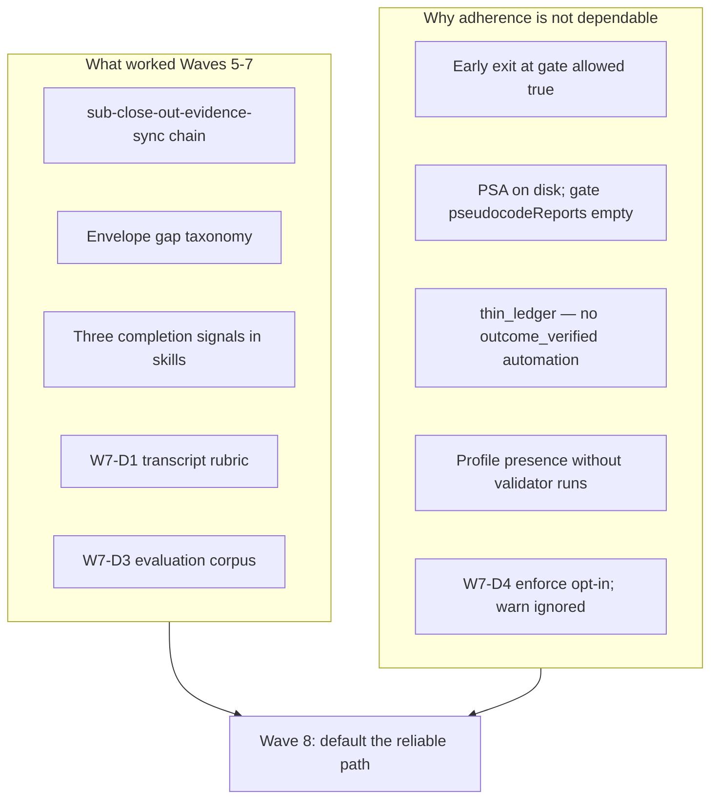

# Adherence Realignment Wave 8 Plan

**Status:** Build-plan and close-out complete (2026-09-11); verification + close_out gates `wave8-closeout-20260911` allowed; envelope zero blocking gaps; combined Wave 7+8 commit.  
**Parent:** [`evidence-collection-conversation-patterns.md`](evidence-collection-conversation-patterns.md) (Waves 6–7; §13 cross-link)  
**Grandparent:** [`methodology-closeout-integrity-plan.md`](methodology-closeout-integrity-plan.md) (Waves 1–4), [`process-adherence-evidence-grade-plan.md`](process-adherence-evidence-grade-plan.md) (Wave 5)  
**Primary tokens:** `[REQ-TIED_CHECKLIST_GATE_ENFORCEMENT]`, `[REQ-REQUEST_EVIDENCE_ENVELOPE]`, `[REQ-QUALITY_ASSURANCE_EVIDENCE]`, `[REQ-EVIDENCE_CHAIN_PROFILE]`, `[REQ-PSEUDOCODE_STATIC_ANALYSIS]`, `[PROC-AGENT_REQ_CHECKLIST]`

---

## Refinement decision and gate posture

This document is an implementation-ready **plan**, not an implementation authorization or a close-out receipt. Refinement decisions accepted for Wave 8:

| Decision | Accepted value | Rationale |
|---|---|---|
| **Document role** | Successor wave plan to Waves 6–7 analysis; specifies producer/consumer alignment for dependable unified close-out | Wave 5–7 made adherence **measurable**; Wave 8 makes the reliable path **default** |
| **TIED applicability** | Full TIED under `[PROC-AGENT_REQ_CHECKLIST]`; extend existing REQ/ARCH/IMPL chain — **no new REQ** unless sponsor requests `[REQ-ADHERENCE_REALIGNMENT]` | Same owning REQ as Waves 5–7 (`REQ-TIED_CHECKLIST_GATE_ENFORCEMENT`) |
| **Inquiry depth** | `depth_tier: integrated` | Close-out integrity + methodology tooling change + disposable-client replay |
| **Gate policy** | `gate_policy: advisory` for observed/unresolved inquiry findings | Structural/producer-consumer misalignment failures remain blocking |
| **Quality profiles** | `baseline-functional` (required); `data-integrity-migration` (envelope/ledger layout); `stateful-reliability` (sync/replay); `[REQ-QUALITY_ASSURANCE_EVIDENCE]` owns proof boundaries | Profile substance and ledger automation touch persistence and replay |
| **CITDP timing** | Draft at refine-plan (`CITDP-wave8-adherence-realignment.yaml`); finalize at `persist-citdp-record` during build-plan close-out | This refine pass does not persist final CITDP |
| **Eligibility triggers** | `strict-close-out`, `methodology-tooling-change`, `persistence`, `external-input` (disposable clients) | Matched at `risk-assessment`; no `integrated_waiver` |
| **Prerequisite** | Wave 7 close-out per [`evidence-collection-conversation-patterns.md` §12](evidence-collection-conversation-patterns.md) **before Wave 8 build-plan authorization** | Machine close-out on Wave 7 must not drift parallel to Wave 8 implementation |
| **Ambiguity resolutions** | See §0 Resolved terms; PSA false negative = hydration bug not missing agent work; path-dependent adherence = outcome depends on which close-out path the conversation invoked | Empirical cohort grading (parent session) |

### Blocking policy matrix

Aligned with [`methodology-closeout-integrity-plan.md`](methodology-closeout-integrity-plan.md) blocking policy format:

| Diagnostic class | Advisory inquiry policy | Close-out effect (Wave 8 default at integrated `close_out`) |
|---|---|---|
| Observed/unresolved inquiry finding | Visible, non-blocking | Envelope records `warn`; no blocking gap |
| Strict finding or confirmed error-severity finding | Blocking | Gate and envelope record `error` |
| Missing/malformed activation, stale phase artifact, invalid hash | Always blocking | `error` |
| **PSA file on disk but gate `pseudocodeReports` empty** (hydration bug) | N/A — producer defect | **`error` after W8-D1** |
| PSA truly missing + step `gate-pseudocode-validation` completed | Always blocking | `error` (W7-D5 + W8-D1) |
| **`thin_ledger`** (completed slugs without `outcome_verified`) | N/A — ledger contract | **`error` under `--envelope-blocking` after W8-D2** |
| **`tracker_sparse`** / **`tracker_dual_write`** | Warn at minimal; process-strict at integrated | **`error` under `--envelope-blocking`** when sync not run |
| Profile validators **`not_measured`** when PSA + manifest present | Advisory until W8-D3 ships | **`warn` → `error` at `strict_candidate` depth** |
| **`evidence_stale`** hash drift | Warn default | **`warn`** (unchanged; operator refresh) |
| **`finding_unresolved`** (advisory policy) | Non-blocking | **`warn`** (unchanged) |
| Valid documented waiver | Non-blocking within waiver scope | Envelope records waiver + residual risk |

The envelope “zero blocking gaps” target means zero **blocking** error gaps, not zero observations. Gate and envelope must derive the same effective severity from this matrix.

---

## Executive thesis

Adherence became **more measurable** in Wave 7 but not yet **dependable**. Parent-session cohort grading proves the reliable path exists but is not the default conversation exit:

| Client | Request | What improved | What still breaks |
|---|---|---|---|
| `1789136889` | `REQ-TCP_CONNECT_CHECKER` (post-remediation) | Unified sync → manifest + profile with **observed** validators; `close_out allowed: true` | No Layer C PSA; 1× `evidence_stale` warn |
| `1789147101` | `REQ-FILEHASH` (newest cohort) | **First 4/4 PSA** in cohort (`ok: true`, grammar v1); populated `execution_evidence.completed[]` (27 slugs); envelope + manifest | `close_out allowed: false`; `thin_ledger`; profile **all `not_measured`**; gate reports `psa_missing:*` **while PSA files exist on disk** |

**Core finding:** The reliable path already exists (`run-close-out-gates.mjs --envelope-blocking --sync-dispositions --reconcile`). Failure mode is **conversation exit before that path runs**, plus **producer/consumer misalignment** (artifacts on disk that gates do not load).



**Wave 8 goal:** Make **machine close-out + process contract + ledger correlation** achievable in a **single default invocation**, without requiring operators to remember flags.

---

## 0. Resolved terms

| Sponsor / observed wording | Canonical meaning | Vocabulary RECORD |
|---|---|---|
| path-dependent adherence | Close-out quality depends on whether the conversation invoked the unified runner vs gate-only exit | quality-assurance.md — **process grade**, **sub-close-out-evidence-sync** |
| three completion signals | **Machine close-out**, **process contract**, **adherence ledger** — never conflated in handoff | prompt-composer.md — **plan-close-out (commit deferred)**; quality-assurance.md |
| thin_ledger | Envelope gap: completed tracker slugs without matching `outcome_verified` ledger rows | quality-assurance.md — **adherence ledger**, **OUTCOME_VERIFIED_EVENT** |
| PSA false negative | Layer C files at `working/{REQ}/pseudocode-analysis/{IMPL}.v1.json` (or `evidence/psa-{IMPL}.json`) present but gate `input.pseudocodeReports` empty → `psa_missing` diagnostics | pseudocode-and-citdp.md — **Layer C artifact** |
| profile shell | Evidence chain profile exists but validators show `not_measured` / `observed_at: 1970` | quality-assurance.md — **attach provenance**, **EVIDENCE_CHAIN_PROFILE** |
| producer/consumer misalignment | Artifact producers (agents, sync scripts) and gate/envelope consumers read different paths or omit hydration | methodology-closeout-integrity-plan — dual completion signals extension |
| early exit at gate | Agent stops after first `tied_checklist_gate_validate allowed: true` without envelope validate or unified runner | W7-D1 dimension `early_exit_at_gate` |
| tracker_sparse | Reconcile/envelope signal: many `execution_evidence.completed` slugs with thin disposition/evidence coverage | process-adherence-gaps taxonomy |
| single completion entrypoint | Gate validate at verification/close_out always builds/refreshes envelope and merges blocking decision | W8-D4 |
| dependable close-out | All three completion signals pass under default skill invocation without operator flags | Wave 8 acceptance |

**PRELOAD:** `tied/vocab/prompt-composer.md`, `tied/vocab/quality-assurance.md`, `tied/vocab/pseudocode-and-citdp.md`  
**VALIDATE:** Terms above reconciled to plan deliverables and corpus rows; no new glossary files required.

---

## 1. What worked (empirical, cite fixtures)

Document these as **proven demand mechanisms** (not hypotheses):

1. **Unified close-out runner** — [`tools/bootstrap/templates/run-close-out-gates.mjs`](../tools/bootstrap/templates/run-close-out-gates.mjs) chains disposition sync → manifest collect → optional reconcile → envelope build/validate → gate. Only cohort client observed to run most of pipeline end-to-end: `1789136889` ([§7.1](evidence-collection-conversation-patterns.md)).

2. **Three completion signals separation** — [`completion-signals-handoff.md`](../tools/bundled-prompt-type-skills/prompt-shared/completion-signals-handoff.md) (Wave 6). Stops honest agents from conflating gate success with machine close-out.

3. **Envelope gap detection** — [`process-adherence-gaps.ts`](../mcp-server/src/request-evidence-envelope/process-adherence-gaps.ts): `tracker_dual_write`, `thin_ledger`, `evidence_stale`, `expected_artifact_missing` (Wave 5). Makes hollow process visible without blocking by default.

4. **Measurement before hard enforcement** — W7-D1 `conversation-adherence-score.mjs` scores seven dimensions with denominators; W7-D3 registers mature `/dev/test` rows with `require_envelope`. Informs where to tighten defaults.

5. **PSA production when static-analysis sub-stub runs** — `1789147101` is first cohort client with `working/{REQ}/pseudocode-analysis/{IMPL}.v1.json` ×4. Proves agents **can** produce Tier-3 artifacts when verification path includes Layer C.

6. **TCP remediation playbook** — Grading + remediation of `1789136889`: literal block-leads, `async_in_scope` + catalog, populated tracker, profile with observed validators → gate pass.

**Pattern to preserve:** *Measure → visible gaps → optional enforce → cohort replay* (not enforce-first).

---

## 2. Remaining failure modes (Wave 8 targets)

| Failure mode | Evidence | Root cause | Owner |
|---|---|---|---|
| **PSA false negative** | FILEHASH: files at `pseudocode-analysis/` + `evidence/psa-*`; gate `psa_missing:*` | [`validatePseudocodeAnalysis`](../mcp-server/src/checklist-validator.ts) reads `input.pseudocodeReports`; gate path does not auto-load from canonical paths | **W8-D1** |
| **thin_ledger persists after sync** | FILEHASH envelope: 27 completed slugs, 1 ledger row (`gate_decided` only) | [`tied_adherence_reconcile_run`](../docs/checklist-adherence-remaining-work-plan.md) is read-only; sync does not **emit** `outcome_verified` rows | **W8-D2** |
| **Profile shell** | FILEHASH: `observed_at: 1970`, validators `not_measured`; TCP post-remediation: observed validators | Profile generation not chained to manifest/PSA paths after collect | **W8-D3** |
| **Gate ignores envelope** | Agents cite `allowed: true` while envelope lists errors (`1789069630`) | Gate and envelope remain separate exit criteria unless unified runner invoked | **W8-D4** |
| **Backfill cannot invent artifacts** | W7-D2: 8/8 tracker-only backfills `ok: false` | Backfill indexes existing files; does not substitute for live `sub-close-out-evidence-sync` | W7 operator follow-up |
| **Warn-only ignored** | W7-D4 `--enforce-envelope` opt-in; W5-D12/D13 deferred | No default block at `traceable-commit` when envelope missing | **W8-D7** |
| **Checklist prose without machine gate** | Async catalog 1/12; Layer C was 0/5 before FILEHASH | Prose steps not wired unless hydration + inventory checks pass | W8-D1 + W8-D5 |

---

## 3. Wave 8 deliverables (W8-D1–D7)

**Implementation slices:** A — fix false negatives; B — ledger + profile substance; C — single signal + conversation; D — regression + enforce last.

| ID | Deliverable | Owning tokens | Primary files | Slice |
|---|---|---|---|---|
| **W8-D1** | **PSA auto-load for gate validate** — Before `validatePseudocodeAnalysis`, scan `working/{REQ}/pseudocode-analysis/{IMPL}.v1.json` and `evidence/psa-{IMPL}.json` alias into `pseudocodeReports`; fail only when truly absent | `[REQ-TIED_CHECKLIST_GATE_ENFORCEMENT]`, `[REQ-PSEUDOCODE_STATIC_ANALYSIS]` · `[ARCH-TIED_CHECKLIST_GATE_ENFORCEMENT]` · `[IMPL-TIED_CHECKLIST_GATE_ENFORCEMENT]` | `mcp-server/src/checklist-gate-evidence-hydration.ts`, `checklist-validator.ts` | A |
| **W8-D2** | **Sync emits outcome_verified** — Extend sync/close-out runner to append `outcome_verified` JSONL rows per completed slug with typed `evidence_refs` hashes; clear `thin_ledger` by construction | `[REQ-TIED_CHECKLIST_GATE_ENFORCEMENT]`, `[REQ-REQUEST_EVIDENCE_ENVELOPE]` · `[IMPL-TIED_CHECKLIST_GATE_ENFORCEMENT]` | `tools/bootstrap/templates/sync-tracker-dispositions.mjs`, `tools/agentstream/checklist/adherence_ledger.go` | B |
| **W8-D3** | **Profile substance chain** — After manifest collect + PSA present, runner invokes `pseudocode_validate`, `pseudocode_analyze`, `tied_validate_consistency` and writes **observed** profile rows (mirror TCP post-remediation) | `[REQ-EVIDENCE_CHAIN_PROFILE]`, `[REQ-QUALITY_ASSURANCE_EVIDENCE]` · `[ARCH-EVIDENCE_CHAIN_PROFILE]` · `[IMPL-EVIDENCE_CHAIN_PROFILE]` | `mcp-server/src/tools/index.ts`, `run-close-out-gates.mjs` | B |
| **W8-D4** | **Single completion entrypoint** — Gate validate at verification/close_out **always** builds/refreshes envelope and cross-reads blocking gaps (merge gate + envelope decision); document as authoritative close-out API | `[REQ-TIED_CHECKLIST_GATE_ENFORCEMENT]`, `[REQ-REQUEST_EVIDENCE_ENVELOPE]` · `[IMPL-TIED_CHECKLIST_GATE_ENFORCEMENT]`, `[IMPL-REQUEST_EVIDENCE_ENVELOPE]` | `checklist-validator.ts`, `run-close-out-gates.mjs` | C |
| **W8-D5** | **Skill default tightening** — `build-plan`, `plan-close-out`, `tied-implement`: CALL unified runner with `--envelope-blocking --sync-dispositions --reconcile` **required** at verification-gate and close-out; handoff forbids “complete” without three signals table | `[REQ-PROMPT_TYPE_GLOBAL_SKILLS]` · `[IMPL-PROMPT_TYPE_GLOBAL_SKILLS]` | `tools/bundled-prompt-type-skills/build-plan/SKILL.md`, `plan-close-out/SKILL.md`, agent wrappers | C |
| **W8-D6** | **Cohort replay regression** — CI or `npm run test:adherence-fixtures` replays four disposable clients after each change | `[REQ-TIED_CHECKLIST_GATE_ENFORCEMENT]`, `[REQ-EVIDENCE_CHAIN_REPORT]` · `[IMPL-TIED_CHECKLIST_GATE_ENFORCEMENT]` | New `mcp-server/src/adherence-fixtures/` or extend gate tests; `scripts/replay-adherence-fixtures.mjs` | D |
| **W8-D7** | **Promote agentstream enforce** — After W8-D6 green + W7-D1 `early_exit_at_gate` denominator improves, flip `--enforce-envelope` to default at integrated depth (retain `--allow-missing-envelope` opt-out) | `[REQ-TIED_CHECKLIST_GATE_ENFORCEMENT]` · `[IMPL-TIED_CHECKLIST_GATE_ENFORCEMENT]` | `tools/agentstream/checklist/traceable_commit_envelope.go` | D |

### 3.1 Per-deliverable test and verification contract

| ID | RED test outline | Verification command | Acceptance criterion |
|---|---|---|---|
| **W8-D1** | Fixture: PSA JSON on disk, empty `pseudocodeReports` input → hydration populates map; missing file → `psa_missing` retained | `node --test mcp-server/dist/checklist-gate-evidence-hydration.test.js` | FILEHASH replay: gate no longer reports `psa_missing` when 4/4 PSA files exist |
| **W8-D2** | Fixture tracker with 3 completed slugs → sync emits 3 `outcome_verified` rows with hashed refs; envelope `thin_ledger` cleared | `go test ./tools/agentstream/checklist/... -run TestOutcomeVerified -count=1` (new) | FILEHASH replay: envelope zero `thin_ledger` under `--envelope-blocking` |
| **W8-D3** | Fixture: manifest + PSA paths → profile rows `observed` for `pseudocode_analyze`, `tied_validate_consistency` | Extend evidence-chain profile tests + runner integration test | FILEHASH profile: no `not_measured` for chained validators when inputs present |
| **W8-D4** | Gate validate with stale envelope → auto-refresh; blocking gap → `allowed: false` even if dispositions pass | `node --test mcp-server/dist/checklist-validator.test.js` | Single MCP/CLI path produces merged gate+envelope decision document in receipt |
| **W8-D5** | Skill contract test: close-out steps reference unified runner flags (extend prompt-type subagent or static SKILL scan) | `node --test mcp-server/dist/e2e/prompt-type-subagent.test.js` (when env fixed) or grep contract test | Handoff template includes three-signals table; skills forbid gate-only complete |
| **W8-D6** | Parameterized replay: 4 corpus rows → expected `allowed`/gap codes snapshot | `node scripts/replay-adherence-fixtures.mjs --corpus working/evaluation/evaluation-corpus.v1.yaml` | All four fixtures match acceptance matrix §5 |
| **W8-D7** | Go test: integrated depth defaults enforce; `--allow-missing-envelope` opt-out works | `go test ./tools/agentstream/checklist/... -run TestTraceableCommitEnvelope -count=1` | Default enforce on; W5-D12/D13 deferral retired with corpus proof |

**Recommended implementation order:** W8-D1 → W8-D2 → W8-D3 → W8-D4 → W8-D5 → W8-D6 → W8-D7 (enforce last).

---

## 4. Acceptance criteria (Wave 8 complete)

Wave 8 is **complete** when:

1. **FILEHASH replay (`1789147101`):** `run-close-out-gates.mjs --envelope-blocking --sync-dispositions --reconcile` → `close_out allowed: true`; envelope zero blocking gaps; `thin_ledger` clear; no `psa_missing` when PSA files exist.
2. **TCP replay (`1789136889`):** Regression unchanged or improved (still `allowed: true`; PSA optional gap documented).
3. **`1789087315`:** Dual-write detected pre-sync; post-sync `process_grade` ≥ B.
4. **`1789069630`:** Document-only regression — envelope errors remain visible; no silent pass.
5. **Unit/composition tests** for W8-D1–D4 green per §3.1 verification commands.
6. **Wave 7 close-out** for `[REQ-TIED_CHECKLIST_GATE_ENFORCEMENT]` completed first ([§12](evidence-collection-conversation-patterns.md)) — Wave 8 build-plan does not start on parallel drift.

### Verification commands (Wave 8 regression block)

```bash
npm run build --prefix mcp-server
node --test mcp-server/dist/checklist-validator.test.js
node --test mcp-server/dist/checklist-gate-evidence-hydration.test.js
node --test mcp-server/dist/request-evidence-envelope/process-adherence-gaps.test.js
go test ./tools/agentstream/checklist/... -count=1
go test ./tools/agentstream/cmd/adherence-reconcile/... -count=1
node scripts/replay-adherence-fixtures.mjs --corpus working/evaluation/evaluation-corpus.v1.yaml
```

---

## 5. Wave ownership

| Artifact | Path |
|---|---|
| Plan (this document) | `docs/adherence-realignment-wave8-plan.md` |
| Parent analysis | `docs/evidence-collection-conversation-patterns.md` (§13) |
| Tracker (planning copy) | `working/REQ-TIED_CHECKLIST_GATE_ENFORCEMENT/agent-req-implementation-checklist-wave8-adherence-realignment.yaml` |
| CITDP (draft) | `working/REQ-TIED_CHECKLIST_GATE_ENFORCEMENT/CITDP-wave8-adherence-realignment.yaml` |
| Pre_implementation gate receipt | `working/REQ-TIED_CHECKLIST_GATE_ENFORCEMENT/gates/wave8-pre-implementation-refine.json` |
| Regression fixtures | `/Users/fareed/Documents/dev/test/1789136889`, `1789147101`, `1789087315`, `1789069630` |
| Evaluation corpus | `working/evaluation/evaluation-corpus.v1.yaml` (includes `1789147101` row) |

---

## 6. Relationship to open work

1. **Complete Wave 7 close-out first** — [§12](evidence-collection-conversation-patterns.md): machine close-out on Wave 7 is **complete** per §12.6; sponsor **git commit** may remain pending. Wave 8 **build-plan authorization** requires Wave 7 commit + no open Wave 7 gate regressions.

2. **Wave 8 close-out procedure** — After W8-D1–D7 build-plan completes, run unified LEAP close-out per [`adherence-realignment-wave8-close-out.md`](adherence-realignment-wave8-close-out.md) (tracker expansion, wave8 inquiry phases, unified runner, CHANGELOG + proposed commit). Invoke **plan-close-out** subagent with that document linked; **no git commit** in plan-close-out.

3. **Retire W5-D12/D13 deferral** — Wave 8-D7 subsumes with corpus-backed default enforce (not minimal-depth-only tightening).

4. **Do not duplicate analysis corpus** — Full §1–8 analysis remains in parent doc; this plan references empirical fixtures only.

**Deferred beyond Wave 8:**

- Async catalog envelope kind
- `semantic-tokens.yaml` bootstrap track
- Grammar v2 adoption (orthogonal to adherence)
- Canvas / visualization

---

**Last updated:** 2026-09-11 (build-plan complete; close-out procedure linked in §6)
