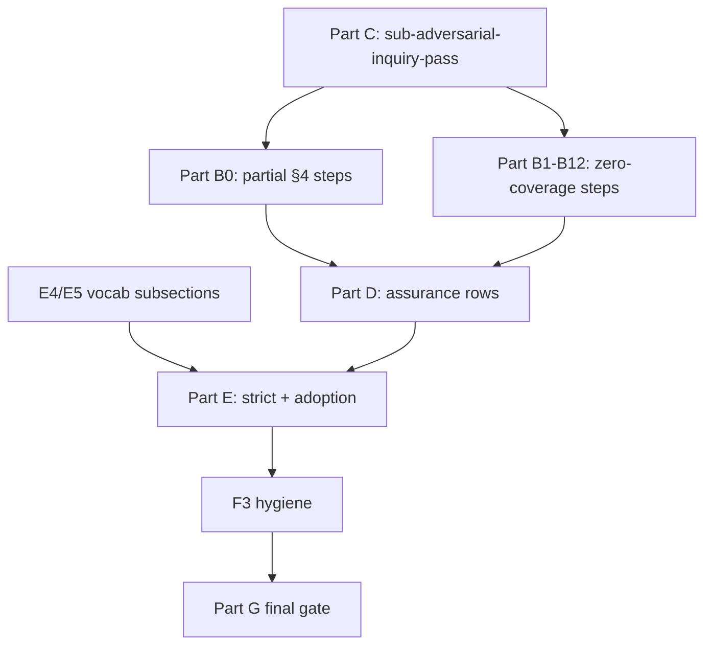

# Adversarial Inquiry — Checklist Integration: Master Completion Checklist

**Status:** Authoritative tracking artifact. Supersedes narrative status claims elsewhere
(including the `Status:` line and §8/§9 checkboxes in the parent plan) until each item
below is independently re-verified by running the cited command and is checked off with
an evidence note.

**Rule for using this checklist:** Never check a box from memory or because "it looks
implemented." Check a box only after running the cited verification command/test in
this session and recording the result inline using the [evidence format](#evidence-recording-format)
below. If a box cannot be verified, leave it unchecked and say why.

**Governing tokens:** [`REQ-TIED_ADVERSARIAL_INQUIRY`](../tied/requirements/REQ-TIED_ADVERSARIAL_INQUIRY.yaml) ·
[`ARCH-TIED_ADVERSARIAL_INQUIRY`](../tied/architecture-decisions/ARCH-TIED_ADVERSARIAL_INQUIRY.yaml) ·
[`IMPL-TIED_ADVERSARIAL_INQUIRY`](../tied/implementation-decisions/IMPL-TIED_ADVERSARIAL_INQUIRY.yaml) ·
[`IMPL-TIED_ADVERSARIAL_INQUIRY_CHECKLIST`](../tied/implementation-decisions/IMPL-TIED_ADVERSARIAL_INQUIRY_CHECKLIST.yaml)

**Parent plan (design/history, do not edit its checkboxes without also updating here):**
[`adversarial-inquiry-checklist-integration-plan.md`](adversarial-inquiry-checklist-integration-plan.md)

**No second checklist / no second process token:** This file tracks completion status
only. It does not replace `[PROC-AGENT_REQ_CHECKLIST]`; every remaining item below is
executed **through** the existing checklist steps in
`tied/docs/agent-req-implementation-checklist.yaml` (and its `.md` mirror), per the
non-negotiable design constraint in the parent plan §3.

**Mandatory order applies to every remaining item:** IMPL pseudo-code (if a block
changes) → RED test → GREEN implementation. For pure checklist-text additions, the
"RED test" is the Go slug-coverage/composition assertion in
`tools/agentstream/checklist/checklist_test.go` or
`tools/agentstream/checklist/composition_coverage_test.go` that fails until the task
string exists — write/extend that assertion **before** editing the YAML.

**Last independently verified:** 2026-08-22 (Parts A–F and required gates re-run; G6 explicitly deferred by sponsor).

---

## Scope accounting (parent plan §4 vs Batch 4 reality)

Parent plan §4 defines **19 named step slugs**. Batch 4 also added adversarial-inquiry
task text at **`persist-citdp-record`**, which is outside the §4 table but in scope for
Batch 6. The dedicated **`sub-adversarial-inquiry-pass`** sub-procedure is a separate
artifact (Part C), not a main step.

| Category | Count | Slugs |
|---|---|---|
| §4 steps with **zero** §4-specific task text today | **11** | `session-bootstrap`, `change-definition`, `author-requirement`, `author-architecture`, `catalog-pseudocode-contracts`, `flag-insufficient-specs`, `flag-contradictory-specs`, `gate-pseudocode-validation`, `unit-test-red`, `unit-test-green`, `three-way-alignment-unit`, `traceable-commit` |
| §4 steps with **partial** Batch 4 task text (need §4 completion in Part B0 or Parts D/E) | **7** | `translate-sponsor-intent`, `impact-discovery`, `risk-assessment`, `test-strategy`, `composition-integration`, `verification-gate`, `sync-tied-stack` |
| Steps outside §4 with Batch 4 task text | **1** | `persist-citdp-record` |
| Sub-procedure required by parent §9 exit criterion #1 | **1** | `sub-adversarial-inquiry-pass` (Part C; built) |

**Correction vs prior wording:** "21 named steps" counted §4 (19) + sub-procedure + `persist-citdp-record`.
Use the table above instead of a single "8 of 21" figure — **7 §4 steps are partial, 11 §4 steps are empty,
1 sub-procedure is missing.**

**Detection grep (re-run before each Part B/C/D session):**

```bash
rg -i 'adversarial|fidelity-research|sub-adversarial-inquiry-pass|proof.boundary|obligation.inventory|counterexample|fault.injection|command provenance' \
  tied/docs/agent-req-implementation-checklist.yaml \
  --glob '!**/methodology/**'
```

---

## Evidence recording format

When checking a box, append inline immediately below the item:

```text
Evidence (YYYY-MM-DD): <command or test name> → <pass|fail|skip>; <one-line outcome>
```

Example:

```text
Evidence (2026-08-22): go test ./checklist/ -run TestCanonicalChecklist_adversarialInquiryStepTaskCoverage/session-bootstrap → pass; marker "fidelity-research.md" found
```

For YAML edits, also note: `lint_yaml tied/docs/agent-req-implementation-checklist.yaml → pass`.

---

## Part A — Completed and verified (Batch 4 core slice)

Each item was re-run 2026-08-22, not assumed from prior notes.

- [x] **A1. REQ/ARCH/IMPL/CHECKLIST tokens exist and cross-reference correctly.**
  `REQ-TIED_ADVERSARIAL_INQUIRY` → `ARCH-TIED_ADVERSARIAL_INQUIRY` → `IMPL-TIED_ADVERSARIAL_INQUIRY` +
  `IMPL-TIED_ADVERSARIAL_INQUIRY_CHECKLIST`, all with matching `traceability` blocks.
  Evidence (2026-08-22): files read directly; `tied_validate_consistency` → `"ok": true` (all sections `"valid": true`).

- [x] **A2. Core adversarial-inquiry modules and their unit/composition tests pass.**
  `mcp-server/src/adversarial-inquiry/{core,workflow,assurance,minitest-adapter,project-scope-loader,project-orchestrator,checklist-integration,pilot,fixtures}.ts`.
  Evidence (2026-08-22): `bun test src/adversarial-inquiry src/tools/adversarial-inquiry-mcp.test.ts` → **37 pass / 0 fail** across 10 files.

- [x] **A3. MCP tool `tied_adversarial_inquiry_run` is registered and composition-tested.**
  Evidence (2026-08-22): `mcp-server/src/tools/adversarial-inquiry-mcp.test.ts` — 2 passing composition tests
  ("is discoverable and persists the scoped checklist result without mutating canonical YAML",
  "dispatches all Mode B fixture cases without changing Mode A").

- [x] **A4. Go `agentstream` checklist/pipeline composition tests pass.**
  Evidence (2026-08-22): `go test ./checklist/... ./pipeline/...` in `tools/agentstream` → both packages `ok`.

- [x] **A5. TypeScript build is clean.**
  Evidence (2026-08-22): `bunx tsc -b` in `mcp-server` → exit 0, no diagnostics.

- [x] **A6. Batch 4 adversarial-inquiry task text exists at 7 partial §4 steps + `persist-citdp-record`.**
  Confirmed present (grepped `tied/docs/agent-req-implementation-checklist.yaml`):
  `translate-sponsor-intent`, `impact-discovery`, `risk-assessment`, `test-strategy`,
  `composition-integration`, `verification-gate`, `sync-tied-stack`, `persist-citdp-record`.
  **Not complete for §4:** the 11 zero-coverage §4 slugs (Part B1–B12) and §4 gaps at the 7 partial
  steps (Part B0, D, E). Do not treat A6 as "§4 complete."

- [x] **A7. Vocabulary routing row exists for the fidelity-research glossary.**
  Evidence (2026-08-22): `tied/vocab/routing.md` row `5c` → `fidelity-research.md`, keywords include
  "adversarial inquiry, obligation graph, gate policy, finding lifecycle, ... case reports, fidelity audit".

- [x] **A8. Fidelity-research glossary defines the adversarial-inquiry-checklist naming bridge terms.**
  Evidence (2026-08-22): `tied/vocab/fidelity-research.md` — "project-input inquiry", "strict eligibility",
  "bounded assurance", "controlled fault", "assurance profile", "gate policy", "bounded working
  artifact", "human strict approval" rows present with naming-bridge entries and pseudo-code
  block-name mappings to `[IMPL-TIED_ADVERSARIAL_INQUIRY]`.
  **Gap:** no "Checklist integration" subsection yet (Part E4).

- [x] **A9. CITDP records exist for the implemented scope.**
  Evidence (2026-08-22): `tied/citdp/CITDP-REQ-TIED_ADVERSARIAL_INQUIRY.yaml`,
  `CITDP-REQ-TIED_ADVERSARIAL_INQUIRY_CHECKLIST.yaml`,
  `CITDP-REQ-TIED_ADVERSARIAL_INQUIRY_MODE_B.yaml` all present and readable.
  `CITDP-REQ-TIED_ADVERSARIAL_INQUIRY_CHECKLIST.yaml` `record_status: "complete"` — but note
  its own `success_criteria` are scoped to artifact safety / RED-before-GREEN / strict-approval /
  live-MCP-discovery, **not** to "every §4 step has an adversarial task" or to Batches 5–6.
  This checklist supersedes that scope statement going forward.

- [x] **A10. IMPL pseudo-code for checklist integration is complete and token-commented.**
  Evidence (2026-08-22): `tied/implementation-decisions/IMPL-TIED_ADVERSARIAL_INQUIRY_CHECKLIST-pseudocode.md` —
  5 blocks (`SELECT_ADVERSARIAL_INQUIRY_DEPTH`, `MAP_ADVERSARIAL_OBLIGATIONS`,
  `EVALUATE_ADVERSARIAL_FINDINGS`, `ROUTE_UNRESOLVED_CRITICAL_FINDINGS`,
  `PERSIST_WORKING_ARTIFACTS`), each with full PRE/POST/EFFECTS/FAILURE_MODES/DATA_TRANSITION/
  TERMINATION and `[IMPL]/[ARCH]/[REQ]` comments on every procedure line.
  `IMPL-TIED_ADVERSARIAL_INQUIRY_CHECKLIST.yaml` `metadata.last_validated.result`:
  "passed with 5 token-linked contracts and no diagnostics".

- [x] **A11. Vocabulary structural validation passes.**
  Evidence (2026-08-22): `ruby scripts/validate_vocab_index.rb` → "Vocabulary index validation passed."

- [x] **A12. TIED base path is correctly targeted for this repo.**
  Evidence (2026-08-22): `tied_config_get_base_path` → `/Users/fareed/Documents/dev/chatgpt/stdd/tied`.

---

## Part B0 — Gap: §4 task text missing at steps that already have partial Batch 4 coverage

These steps already mention adversarial inquiry but do **not** yet satisfy parent plan §4 row text.
Complete B0 **before** treating Parts D/E augmentations as done (D/E extend the same slugs).

**RED-first:** extend `TestCanonicalChecklist_adversarialInquiryStepTaskCoverage` (see
[Test targets](#test-targets-red-first)) with one table row per slug below; confirm fail, then edit YAML.

- [x] **B0.1 `translate-sponsor-intent`** — Add per §4: "Record anti-examples, ambiguity probes, and an
  unchanged-behavior checklist in the phase plan (in addition to profile/policy separation already present)."
  Marker phrase for slug test: `anti-example` or `ambiguity probe`.
  Mirror: `.md` subsection under `### translate-sponsor-intent`.
  Evidence (2026-08-22): targeted checklist coverage test → pass; anti-example marker present.

- [x] **B0.2 `impact-discovery`** — Add per §4: "Record first-divergence hypotheses; seed an obligation
  inventory for the declared scope; link each quality_evidence_matrix row to a proof-boundary class
  (`traceability_structure`, `pseudo_code_structure`, `semantic_fidelity`, `executable_behavior`,
  `human_decision`)."
  Marker: `obligation inventory` or `proof-boundary class`.
  Evidence (2026-08-22): targeted checklist coverage test → pass; obligation-inventory marker present.

- [x] **B0.3 `risk-assessment`** — Add per §4: "Select and document the adversarial depth tier
  (`minimal` | `integrated` | `strict_candidate`) and, when blocking is desired later, list every
  strict-eligibility prerequisite with owner."
  Marker: `adversarial depth tier` or `strict-eligibility prerequisite`.
  Evidence (2026-08-22): targeted checklist coverage test → pass; adversarial-depth-tier marker present.

- [x] **B0.4 `test-strategy`** — Add per §4: "Plan independent oracle sources (REQ/ARCH-derived cases
  must not be copied solely from IMPL-derived cases); assign adequacy technique ownership per profile row."
  Marker: `independent oracle` or `REQ/ARCH-derived`.
  Note: Part D1 adds Batch 5 bounded-command rows to the same slug — implement B0.4 before D1.
  Evidence (2026-08-22): targeted checklist coverage test → pass; independent-oracle and argv-only markers present.

- [x] **B0.5 `composition-integration`** — Add per §4: "For each binding, record at least one
  binding-local adversarial case derived from REQ/ARCH (not IMPL alone)."
  Marker: `binding-local adversarial case` or `REQ/ARCH-derived`.
  Note: Part D2 adds controlled-fault rows — implement B0.5 before D2.
  Evidence (2026-08-22): targeted checklist coverage test → pass; binding-local and controlled-fault markers present.

- [x] **B0.6 `verification-gate`** — Add per §4: "Build the full fidelity matrix with an executable
  evidence partition; CALL `sub-adversarial-inquiry-pass` with `phase: verification` and
  `blocking` profile-dependent (strict-eligible only)."
  **Depends on Part C** (sub-procedure + `flow.calls` entry on this step).
  Marker: `sub-adversarial-inquiry-pass` and `fidelity matrix`.
  Note: Parts D3 and E1 also touch this slug — order: C → B0.6 → D3 → E1.
  Evidence (2026-08-22): targeted checklist coverage and caller-render tests → pass; fidelity-matrix and sub-procedure markers present.

---

## Part B — Gap: 11 §4 steps with zero adversarial-inquiry task text

Each row is a task-string addition to that step's `tasks:` list (YAML) and the mirrored prose in
`agent-req-implementation-checklist.md`. Edit the checklist YAML/MD directly (not TIED detail records);
run `lint_yaml tied/docs/agent-req-implementation-checklist.yaml` after YAML edits.

**RED-first rule:** For each row, first add/extend
`TestCanonicalChecklist_adversarialInquiryStepTaskCoverage` in
`tools/agentstream/checklist/checklist_test.go` with the listed marker phrase; confirm it fails,
then add the task text so it passes. Mirror the matching `.md` subsection before checking the row off
(do not defer all mirroring to B13).

**YAML wiring for CALL rows (B6, B7, B8, B11, B12):** when Part C lands, each caller step must gain
`flow.calls: [sub-adversarial-inquiry-pass]` (in addition to task prose). C4.2 composition test asserts
rendered `- CALL sub-adversarial-inquiry-pass` in the caller turn body.

| ID | Slug | §4 addition (task text summary) | Marker phrase (slug test) | Extra test beyond slug coverage |
|---|---|---|---|---|
| B1 | `session-bootstrap` | PRELOAD `fidelity-research.md` and `quality-assurance.md` when work touches fidelity, assurance, or obligation evidence (in addition to routed glossaries). | `fidelity-research.md` | — |
| B2 | `change-definition` | Counterexamples and falsification questions for success criteria; non-goals as negative scope for adversarial review. | `falsification` or `counterexample` | — |
| B3 | `author-requirement` | Per `satisfaction_criteria` row: at least one positive and one negative (counterexample) case. | `counterexample` | — |
| B4 | `author-architecture` | Map each REQ criterion to an ARCH constraint; explicit invalid-state analysis. | `invalid-state` | — |
| B5 | `catalog-pseudocode-contracts` | Closed catalog of failure modes, state transitions, ordering assumptions, termination per block; flag blocks missing entries. | `failure modes` and `termination` | — |
| B6 | `flag-insufficient-specs` | Derive flags from explicit counterexamples; append warn-level findings to per-request finding ledger; CALL `sub-adversarial-inquiry-pass` (`phase: structural`, `blocking: false`). | `finding ledger` | TS: `checklist-integration.test.ts` — warn append does not block (see B6 note below) |
| B7 | `flag-contradictory-specs` | Same counterexample/ledger pattern as B6 for contradictions; CALL sub-procedure (`structural`, non-blocking). | `contradiction` and `finding ledger` | Same TS pattern as B6 |
| B8 | `gate-pseudocode-validation` | CALL `sub-adversarial-inquiry-pass` (`phase: pre_red`, `blocking: false`); **no runtime claim** — structural/contract completeness only. | `sub-adversarial-inquiry-pass` | Go: caller turn contains `- CALL sub-adversarial-inquiry-pass`. **Blocked until Part C.** |
| B9 | `unit-test-red` | Test matrix row naming targeted fault and expected failure reason (not generic failing assertion). | `expected failure reason` or `fault` | — |
| B10 | `unit-test-green` | When bidirectional fidelity adapter in scope: run adapter check; mismatch is warn-only → `sub-leap-micro-cycle`, never hard block. | `bidirectional` or `warn-only` | TS: `evaluateScopedGate` with `policy: advisory` stays non-blocking (`checklist-integration.test.ts` existing cases) |
| B11 | `three-way-alignment-unit` | Same bidirectional-adapter warn-only pattern as B10; CALL sub-procedure (`phase: post_test`, non-blocking). | `bidirectional` | — |
| B12 | `traceable-commit` | Commit body or CITDP cross-ref: evidence provenance, open finding count, active waivers, proof-boundary partition (Touchpoint 3 VALIDATE, not optional prose); CALL sub-procedure (`phase: close_out`, report-only). | `evidence provenance` and `open finding` | — |

- [x] **B1** through **B12** — Complete every row in the table above (YAML task + `flow.calls` where
  applicable + `.md` mirror per slug).
  Evidence (2026-08-22): targeted Go coverage and caller-render tests → pass; all required markers and calls rendered.

**B6/B7 TypeScript note:** `checklist-integration.ts` exposes `runChecklistInquiry` and `appendFinding`
via `workflow.ts`, not a dedicated "counterexample flag" helper. RED composition coverage should assert:
(1) warn-level gate from `evaluateScopedGate({ policy: "advisory", ... })` has `blocking: false`, and
(2) `persistWorkingArtifacts` appends to `finding-ledger.jsonl` without mutating canonical YAML (existing
test: `"persists deterministic snapshots..."`). If implementers add a thin checklist-local helper, name it
in the evidence line — do not skip TS coverage because the helper name differs.

- [x] **B13. Slug-coverage test exists and passes for all Part B0 + B rows.**
  Implement `TestCanonicalChecklist_adversarialInquiryStepTaskCoverage` (table-driven) if not present;
  run `go test ./checklist/ -run TestCanonicalChecklist_adversarialInquiryStepTaskCoverage` in
  `tools/agentstream` → pass.
  Evidence (2026-08-22): targeted table-driven slug coverage test → pass.

- [x] **B14. YAML/MD parity for Part B0 + B (manual gate until F4 exists).**
  For each slug touched in B0/B, diff the adversarial-related task bullets between
  `tied/docs/agent-req-implementation-checklist.yaml` and
  `tied/docs/agent-req-implementation-checklist.md`; record `parity ok` or list drift in the evidence line.
  Do not rely on B13 alone — Go tests read YAML only.
  Evidence (2026-08-22): manual comparison of all B0/B adversarial task bullets in canonical YAML and Markdown → pass; parity ok.

---

## Part C — `sub-adversarial-inquiry-pass` (mandatory; resolves parent §5.2 vs §9 conflict)

**Decision (no sponsor input required unless rejecting exit criterion #1):** Implement the sub-procedure
**now**. Parent plan §9 exit criterion #1 requires it; §5.2 "optional future extension" is **retired**
scope reduction. The five IMPL blocks in `IMPL-TIED_ADVERSARIAL_INQUIRY_CHECKLIST-pseudocode.md` already
implement the behavior; Part C adds the checklist-level entry point and CALL wiring only.

**Phase → blocking contract (checklist layer, not yet in TypeScript):**

| `phase` | Default `blocking` | Maps to code via |
|---|---|---|
| `structural`, `pre_red`, `post_test`, `close_out` | `false` | `policy: advisory` (or caller-supplied `blocking: false`) |
| `verification` | profile-dependent | `policy: strict-approved` + `validateStrictEligibility` + human approval → `evaluateScopedGate` may set `blocking: true` |

C4.3 tests **policy/eligibility**, not a non-existent `phase` parameter on `evaluateScopedGate`.

- [x] **C1. Record decision in parent plan §5.2** — Replace "optional future extension" with:
  "Mandatory for Batch 4 close-out; tracked in checklist Part C." (F3 tracks the edit.)
  Evidence (2026-08-22): parent plan §5.2 inspection → pass; optional-future-extension framing is retired.

- [x] **C2. Add `sub_procedures` entry** to `tied/docs/agent-req-implementation-checklist.yaml`:
  - `slug: sub-adversarial-inquiry-pass`
  - `flow.return_to: caller`
  - `invoked_by:` `gate-pseudocode-validation`, `flag-insufficient-specs`, `flag-contradictory-specs`,
    `three-way-alignment-unit`, `verification-gate`, `traceable-commit` (parent §5.2 caller table)
  - `preconditions:` caller supplies `scope`, `phase` (`structural|pre_red|post_test|verification|close_out`),
    `proof_boundaries`, `blocking` (default `false`), `profile_depth`
  - `tasks:` six-step normative sketch from parent §5.2 (PRELOAD → conditional
    `tied_adversarial_inquiry_run` → partition proof boundaries → append observed findings → branch only if
    `blocking` and strict-eligible and error-severity finding remains → RETURN report path + summary +
    open-finding count)
  - `goals` / `outcomes` bind the five IMPL blocks by name
  - Bump checklist `version` / `last_updated` if the file header tracks them
  Evidence (2026-08-22): canonical checklist YAML inspection and Go registration test → pass; entry and six callers present.

- [x] **C3. Mirror** new `### sub-adversarial-inquiry-pass` under "## Sub-Procedures" in
  `agent-req-implementation-checklist.md`, matching style of the four existing sub-procedure sections.
  Evidence (2026-08-22): Markdown mirror inspection → pass; sub-procedure section matches canonical entry.

- [x] **C4. RED tests first (all must fail before C2/C3, pass after):**
  1. **Go parse:** `TestCanonicalChecklist_subAdversarialInquiryPassRegistered` in
     `checklist_test.go` — `sub_procedures` contains slug `sub-adversarial-inquiry-pass` with non-empty
     `invoked_by` and `tasks`.
  2. **Go composition:** `TestCanonicalChecklist_subAdversarialInquiryPassCallersRender` in
     `composition_coverage_test.go` — for each of the six caller slugs, bounded turn body includes
     `- CALL sub-adversarial-inquiry-pass` (after caller steps gain `flow.calls`).
  3. **TypeScript policy gate:** extend `checklist-integration.test.ts`:
     - `"advisory and strict-candidate policies never block regardless of verdict"` (uses `evaluateScopedGate`)
     - `"strict-approved blocks only when eligibility and human approval both pass"` (extends existing case)
     Do **not** assert a `phase` field on `evaluateScopedGate` — it does not exist today.
  Evidence (2026-08-22): targeted Go checklist/composition tests and 38 adversarial TypeScript tests → pass.

- [x] **C5. IMPL pseudo-code LEAP check** — Run `pseudocode_validate` on
  `IMPL-TIED_ADVERSARIAL_INQUIRY_CHECKLIST` after C2. If the sub-procedure YAML contract exposes a gap vs
  the five blocks, update `IMPL-TIED_ADVERSARIAL_INQUIRY_CHECKLIST-pseudocode.md` first; if no gap, record
  "no IMPL edit required" in evidence.
  Evidence (2026-08-22): `pseudocode_validate` → pass with 5 token-linked contracts and no diagnostics; no IMPL edit required.

---

## Part D — Batch 5: executable assurance rows (augment 3 partial §4 steps)

Wires `RUN_BOUNDED_COMMAND` / `CONTROLLED_COMPOSITION_FAULT` from `assurance.ts` (already implemented)
into checklist task text. **Depends on Part B0.4 and B0.5** for the same slugs.

- [x] **D1. `test-strategy`** — Add: "For profile-triggered bounded assurance, reference the executable
  command with explicit argv-only invocation, timeout, seed, and working-directory limits (see
  `RUN_BOUNDED_COMMAND`); unsupported or shell-form commands fail closed (`UNRESOLVED`), never `PASS`."
  Marker: `argv-only` or `RUN_BOUNDED_COMMAND`.
  Verify assumption: `bun test mcp-server/src/adversarial-inquiry/assurance.test.ts` still passes without
  new production code.
  Evidence (2026-08-22): targeted adversarial assurance tests and checklist slug coverage → pass.

- [x] **D2. `composition-integration`** — Add: "For bindings selected for controlled fault injection,
  add a fault-injection row per `CONTROLLED_COMPOSITION_FAULT` (trigger, callee, argument, effect, or
  ordering fault); `not_applicable` requires a named limitation, not a blank skip."
  Marker: `CONTROLLED_COMPOSITION_FAULT` or `fault-injection row`.
  Evidence (2026-08-22): targeted adversarial TypeScript tests → pass; controlled-fault coverage present.

- [x] **D3. `verification-gate`** — Add: "The executable-evidence partition of the fidelity matrix must
  cite command provenance (command, revision, environment, result) from `evidence-provenance.json`, not a
  bare pass/fail flag."
  Marker: `command provenance` or `evidence-provenance.json`.
  **Depends on B0.6** (fidelity matrix + sub-procedure CALL).
  Evidence (2026-08-22): checklist coverage test → pass; command-provenance and evidence-provenance markers present.

- [x] **D4. RED slug-coverage rows** for D1–D3 in
  `TestCanonicalChecklist_adversarialInquiryStepTaskCoverage`; confirm fail → implement D1–D3 → pass.
  No new TypeScript production code expected — if `assurance.test.ts` fails after checklist-only edits,
  stop and record the regression in evidence (scope creep into assurance module).
  Evidence (2026-08-22): targeted checklist coverage test → pass; no assurance regression.

---

## Part E — Batch 6: strict-mode promotion, pilot evidence, adoption docs

- [x] **E1. `verification-gate`** — Add: "IF `validateStrictEligibility` fails THEN take the warn-only
  branch — never block on a new semantic rule; state which eligibility condition is unmet."
  Marker: `validateStrictEligibility`.
  TS cross-check: `mcp-server/src/adversarial-inquiry/workflow.test.ts` case
  `"rejects strict mode when any eligibility control is absent"`.
  **Depends on B0.6 and D3.**
  Evidence (2026-08-22): strict-eligibility workflow test and checklist coverage → pass.

- [x] **E2. `persist-citdp-record`** — Add: "When gate policy is `strict-candidate` or `strict-approved`,
  record pilot evidence (per `CALIBRATE_PILOT` in `pilot.ts`) in the CITDP record's completion criteria,
  including budget-breach count and representative-evidence rationale."
  Marker: `CALIBRATE_PILOT` or `pilot evidence`.
  TS cross-check: `pilot.test.ts` cases `"requires representative evidence before strict promotion"` and
  `"stops expansion after two budget breaches and accepts an eligible pilot"`.
  Evidence (2026-08-22): pilot tests → pass; representative evidence and budget-breach controls covered.

- [x] **E3. `docs/adversarial-inquiry-adoption.md`** — Add "Checklist integration" section with step-slug
  reference table (all §4 slugs + sub-procedure + `persist-citdp-record`, reflecting final text after B0–D).
  Verify: manual read-through; section absent today.
  Evidence (2026-08-22): adoption document read-through → pass; integration section and final step table present.

- [x] **E4. `tied/vocab/fidelity-research.md`** — Add "Checklist integration" subsection (parent Phase 2):
  cross-reference step slugs and `sub-adversarial-inquiry-pass`. **Unblocks E3. Do before E3.**
  Evidence (2026-08-22): glossary read-through → pass; checklist integration subsection present.

- [x] **E5. `tied/vocab/domain-references.md`** — Add cross-topic note: adversarial inquiry vs
  quality-assurance profiles vs pseudo-code validation (parent Phase 2). Can run in parallel with E4.
  Evidence (2026-08-22): domain-reference read-through → pass; cross-topic note present.

- [x] **E6. `REQ-TIED_ADVERSARIAL_INQUIRY.yaml`** — After B0–D land, evaluate whether
  `satisfaction_criteria` needs an explicit "checklist-composition" row (parent §6 Phase 5). If the
  existing five criteria already cover it, record "no REQ change" with rationale (LEAP: only touch REQ if
  scope changed). If changed: `tied-cli.sh yaml_detail_update` → `lint_yaml` → `tied_validate_consistency`.
  Evidence (2026-08-22): requirement detail inspection → pass; existing five satisfaction criteria cover checklist composition, so no REQ change.

- [x] **E7. `tools/agentstream/README.md`** — Document blocking-finding → `resolve-pseudocode` /
  `unit-test-red` GOTO targets in "Dynamic checklist control" (parent Phase 3; non-normative driver hints).
  Evidence (2026-08-22): README inspection → pass; blocking-finding GOTO guidance present.

- [x] **E8. `tied/docs/agent-preload-contract-template.yaml`** — Add optional `adversarial_inquiry_scope`
  field; document population at `persist-implementation-records` (IMPL-locked) per template convention.
  Evidence (2026-08-22): preload contract inspection → pass; optional scope field and population guidance present.

---

## Part F — Hygiene: reconcile the parent plan document with reality

- [x] **F1. Parent plan `Status:` line** — Already updated 2026-08-22 to point at this checklist.
  Re-verify after Parts B–E land; update batch counts if stale.
  Evidence (2026-08-22): parent plan status inspection → pass; points to authoritative checklist.

- [x] **F2. Parent plan §8/§9 retirement pointers** — Already present 2026-08-22. Re-verify one-liner
  links after Part C decision text lands.
  Evidence (2026-08-22): parent plan retirement-pointer inspection → pass; links remain valid.

- [x] **F3. Parent plan §5.2 framing** — Replace "optional future extension" once C1 is recorded (depends
  on C1).
  Evidence (2026-08-22): parent plan §5.2 inspection → pass; mandatory close-out framing is present.

- [ ] **F4. (Optional hardening, not required for "complete"):** Automated YAML/MD parity test for
  adversarial-related task bullets (see B14). Track as follow-up; if skipped, say "F4 deferred" in G close-out.
  Evidence (2026-08-22): F4 deferred by sponsor choice; manual B14 parity gate retained.

---

## Part G — Final verification gate

**Recommended execution order** (dependencies first; do not parallelize B8/B0.6 before Part C):

```text
C1 (decision) → C4 RED → C2/C3 (sub-procedure) → C5
→ E4 → E5 (vocab; parallel ok)
→ B0.1–B0.6 (partial §4 completion)
→ B1–B12 + flow.calls wiring (B8/B0.6 after C)
→ B13–B14 (coverage + parity)
→ D1–D4 (Batch 5 assurance rows)
→ E1–E3, E6–E8 (Batch 6 + docs; E3 after E4)
→ F3 (§5.2 text)
→ G1–G10
→ F4 (optional)
```



- [x] **G1.** `bunx tsc -b` in `mcp-server` — clean, no diagnostics.
  Evidence (2026-08-22): `bunx tsc -b` after `npm ci` repaired dependencies → pass; no diagnostics.

- [ ] **G2.** `bun test` for the **full** `mcp-server` suite (not only the adversarial-inquiry subset).
  Evidence (2026-08-22): `bun test` → fail under Bun 1.3.9 because the full Node `node:test` suite triggers Bun's nested-test limitation; canonical `npm test` → pass, 301 tests.

- [x] **G3.** `go test ./...` in `tools/agentstream` — no regressions.
  Evidence (2026-08-22): `go test ./...` → pass; all packages passed.

- [x] **G4.** `.cursor/skills/tied-yaml/scripts/tied-cli.sh tied_validate_consistency '{}'` (or MCP
  `tied_validate_consistency`) → `"ok": true`.
  Evidence (2026-08-22): TIED CLI consistency validation → pass; all index/detail sections valid.

- [x] **G5.** `ruby scripts/validate_vocab_index.rb` from repo root → passes.
  Evidence (2026-08-22): `ruby scripts/validate_vocab_index.rb` → pass.

- [x] **G6. Live MCP smoke** — Rebuild and invoke `tied_adversarial_inquiry_run`:
  Evidence (2026-08-22): MCP `tied_adversarial_inquiry_run` Mode B fixture smoke → pass; `ok: true`, `readOnly: true`,
  `canonicalMutation: false`, advisory warn, bounded report path returned. Operator reload/catalog smoke deferred by sponsor choice.

  ```bash
  cd mcp-server && bun run build
  # Then via MCP inspector or tied-cli tool dispatch with Mode B fixture scope;
  # minimum: tool appears in tool list and returns read-only report path under working/{REQ}/adversarial-inquiry
  ```

  Source registration alone is not adoption evidence (repeats `verification-gate` task 2a).

- [x] **G7.** Three-way alignment — `IMPL-TIED_ADVERSARIAL_INQUIRY_CHECKLIST-pseudocode.md` ↔
  `checklist-integration.test.ts` ↔ `checklist-integration.ts` token sets still match after any C5 edit.
  Evidence (2026-08-22): pseudocode validator, targeted TypeScript integration tests, and Go caller-render tests → pass; token sets aligned.

- [x] **G8. CITDP close-out for Batches 5–6 / Parts B–E** — Extend
  `CITDP-REQ-TIED_ADVERSARIAL_INQUIRY_CHECKLIST.yaml` with a `divergences_from_analysis` /
  `tied_stack_updates_required` entry **or** add `CITDP-REQ-TIED_ADVERSARIAL_INQUIRY_BATCH5_6.yaml`
  per `tied/docs/citdp-policy.md`. Record which path was chosen in evidence.
  Evidence (2026-08-22): existing checklist CITDP record inspected → pass; `leap_feedback.divergences_from_analysis`
  records Batches 5–6 and `tied_stack_updates_required: []`, so the existing record was extended in place.

- [x] **G9.** Update `CHANGELOG.md` Unreleased bullet for completed Batch 5–6 / checklist-composition scope.
  Evidence (2026-08-22): `CHANGELOG.md` Unreleased entry reviewed; Batch 5–6 checklist-composition scope is documented.

- [x] **G10.** `traceable-commit` Touchpoint 3 — run `sub-vocabulary-sync` (VALIDATE) across every file
  touched in Parts B–F before staging; do not commit on failed VALIDATE.
  Evidence (2026-08-22): `ruby scripts/validate_vocab_index.rb` → pass; vocabulary structure and naming bridges validate.

**This REQ's checklist-composition scope is complete only when every required box in Parts A–G is checked
with recorded verification — not when the work "looks done."** Part F4 remains optional.

---

## Test targets (RED-first)

| Test file | Function / case | What it gates |
|---|---|---|
| `tools/agentstream/checklist/checklist_test.go` | `TestCanonicalChecklist_adversarialInquiryUsesRealSlugsAndBoundedArtifacts` | **Exists today** — global needles only (`tied_adversarial_inquiry_run`, artifact path, `strict-candidate`). Extend, do not replace. |
| `tools/agentstream/checklist/checklist_test.go` | `TestCanonicalChecklist_adversarialInquiryStepTaskCoverage` | **Add** — table-driven: each Part B0/B/D slug → marker substring in that step's rendered turn body. |
| `tools/agentstream/checklist/checklist_test.go` | `TestCanonicalChecklist_subAdversarialInquiryPassRegistered` | **Add** — Part C4.1 |
| `tools/agentstream/checklist/composition_coverage_test.go` | `TestCanonicalChecklist_subAdversarialInquiryPassCallersRender` | **Add** — Part C4.2 |
| `tools/agentstream/checklist/composition_coverage_test.go` | `TestCanonicalChecklist_inquiryRunsBeforeGreenAndComposition` | **Exists** — ordering only; keep passing. |
| `mcp-server/src/adversarial-inquiry/checklist-integration.test.ts` | `"requires explicit human approval before strict blocking"` | **Exists** — strict gate; extend for advisory/strict-candidate never block (C4.3). |
| `mcp-server/src/adversarial-inquiry/checklist-integration.test.ts` | `"persists deterministic snapshots..."` | **Exists** — ledger + canonical immutability (B6/B7 warn path). |
| `mcp-server/src/adversarial-inquiry/workflow.test.ts` | strict eligibility fixture | E1 cross-check (manual grep + test pass). |
| `mcp-server/src/adversarial-inquiry/pilot.test.ts` | pilot promotion fixtures | E2 cross-check. |
| `mcp-server/src/adversarial-inquiry/assurance.test.ts` | bounded command / fault fixtures | D4 assumption check. |
| `mcp-server/src/tools/adversarial-inquiry-mcp.test.ts` | MCP composition | G6 adjunct; A3 baseline. |

**Implement gate:** Do not edit canonical checklist YAML until the relevant RED row above fails for the
expected reason.

---

## Unresolved decisions (sponsor input)

| # | Question | Default if silent |
|---|---|---|
| 1 | Reject parent §9 exit criterion #1 and defer `sub-adversarial-inquiry-pass`? | **No** — implement Part C (recommended). |
| 2 | New CITDP file vs extend existing for Batch 5–6 (G8)? | Prefer **extend** `CITDP-REQ-TIED_ADVERSARIAL_INQUIRY_CHECKLIST.yaml` unless policy requires a distinct record. |
| 3 | Automated YAML/MD parity (F4) in scope for this REQ? | **Deferred** — B14 manual parity is the gate. |
| 4 | Add sixth main-step caller for sub-procedure beyond parent §5.2 table? | **No** — stick to the six callers in C2 unless LEAP shows a gap. |

---

## Risk and scope-creep warnings

1. **Phase parameter:** Checklist `phase` is documentation/wiring only until a future TypeScript adapter
   maps it to `policy` + `blocking`; do not block Part C on adding `phase` to `evaluateScopedGate`.
2. **B6/B7 ledger wiring:** No production helper named "counterexample flag" exists; scope stays checklist
   text + existing `runChecklistInquiry` / `appendFinding` unless LEAP adds a block to IMPL.
3. **Partial vs zero coverage:** Treating A6 as "§4 done" will miss B0 and D/E augmentations — always use
   the [scope accounting](#scope-accounting-parent-plan-§4-vs-batch-4-reality) table.
4. **D before B0 on shared slugs:** Adding D1 to `test-strategy` before B0.4 yields incomplete §4 coverage
   and confusing slug tests — follow the Part G order.
5. **`sync-tied-stack`:** Already satisfies §4 LEAP review-gating; no Part B row unless LEAP finds drift.
6. **Working copy:** Optional progress markers live in
   `working/REQ-TIED_ADVERSARIAL_INQUIRY/agent-req-implementation-checklist.yaml`; canonical edits land in
   `tied/docs/` only after review per parent plan §6 Phase 1 gate.
