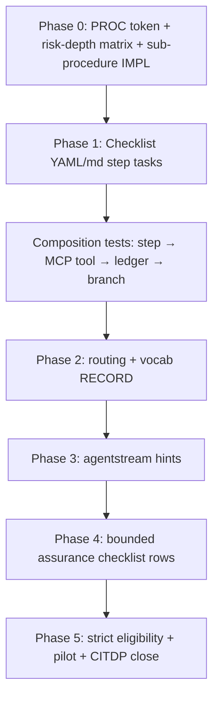

# Adversarial Inquiry — Checklist Integration Plan

**Status:** Batch 4 core slice implemented and tested (see the authoritative tracking
checklist for exact scope: [`adversarial-inquiry-checklist-integration-checklist.md`](adversarial-inquiry-checklist-integration-checklist.md)
Part A). Batches 5–6 and 13 of the 21 named steps in § 4 below still have no
adversarial-inquiry task text; the dedicated `sub-adversarial-inquiry-pass` sub-procedure
in § 5.2 was never built. **Do not hand-check the boxes in § 8/§ 9 of this document** —
they are retired in favor of the tracking checklist, which must be re-verified by command
before any box there is checked.
**Scope:** Integrate `[REQ-TIED_ADVERSARIAL_INQUIRY]`, `[ARCH-TIED_ADVERSARIAL_INQUIRY]`, and `[IMPL-TIED_ADVERSARIAL_INQUIRY]` into the canonical agent requirement implementation checklist (`[PROC-AGENT_REQ_CHECKLIST]`)
**Priority:** Batch 4 of the adversarial inquiry program (after tooling foundation Batches 0–3)
**Purpose:** Wire read-only obligation mapping, bidirectional fidelity evidence, review-gated findings, and risk-triggered assurance into existing checklist steps — **without** creating a parallel workflow or second source of intent.

**Parent plan:** [`tied-adversarial-inquiry-plan.md`](tied-adversarial-inquiry-plan.md) § P0.4, § 8 Batch 4–6
**Adoption guide:** [`adversarial-inquiry-adoption.md`](adversarial-inquiry-adoption.md)
**Checklist (canonical):** [`tied/docs/agent-req-implementation-checklist.yaml`](../tied/docs/agent-req-implementation-checklist.yaml) · [`tied/docs/agent-req-implementation-checklist.md`](../tied/docs/agent-req-implementation-checklist.md)
**Working copy (trackable):** [`working/REQ-TIED_ADVERSARIAL_INQUIRY/agent-req-implementation-checklist.yaml`](../working/REQ-TIED_ADVERSARIAL_INQUIRY/agent-req-implementation-checklist.yaml)
**Authoritative completion tracking (strictly followed):** [`adversarial-inquiry-checklist-integration-checklist.md`](adversarial-inquiry-checklist-integration-checklist.md)

---

## 1. Executive decision

**Adversarial inquiry is applicable to the checklist and should be integrated there.**

The implementation (MCP tool `tied_adversarial_inquiry_run`, modules under
`mcp-server/src/adversarial-inquiry/`, vocabulary in
`tied/vocab/fidelity-research.md`) provides the **tooling layer**. The
canonical checklist in `tied/docs/agent-req-implementation-checklist.yaml`
now carries the bounded profile, artifact, proof-boundary, and strict-gate
guidance for this slice.

Integration follows the parent plan constraint:

> Add bounded adversarial questions to existing steps rather than creating a parallel workflow.

Low-risk work receives bounded manual questions. High-risk or profile-triggered work may invoke `tied_adversarial_inquiry_run` and, only after strict-mode eligibility is demonstrated, block at `verification-gate`.

---

## 2. Applicability verdict

| Layer | Implemented in this change | Checklist after integration | Remaining gap |
|---|---|---|---|
| Vocabulary | `tied/vocab/fidelity-research.md` (adversarial case, proof boundary, strict eligibility, negative control, obligation graph, etc.) | Routing and checklist preloading reference the glossary | Broader domain adoption remains risk-triggered |
| Analysis tooling | `mcp-server/src/adversarial-inquiry/*`, MCP `tied_adversarial_inquiry_run` | Checklist integration invokes the read-only analyzer for declared scope | Runtime assurance remains bounded and profile-triggered |
| Quality assurance | Manual profiles/matrix in `impact-discovery` | Research, assurance, and gate dimensions remain separate | Specialized profiles require their own evidence |
| Findings / LEAP | `workflow.ts` append-only ledger; review-gated design in ARCH/IMPL | Findings remain observed until review and route only through existing owners | Confirmed findings still require human adjudication |
| Proof boundaries | Core architecture (`ARCH-TIED_ADVERSARIAL_INQUIRY`) | Checklist tasks preserve structural, semantic, executable, and human boundaries | None for the implemented checklist slice |

### 2.1 What the checklist already partially covered

Several checklist steps already encode **manual** adversarial-adjacent behavior:

| Step slug | Existing overlap |
|---|---|
| `impact-discovery` | Assurance profiles, quality evidence matrix, bounded scenarios, abuse cases |
| `risk-assessment` | Profile confirmation, residual risk with owner/expiry |
| `test-strategy` | Mutation/property/fuzz/replay planning |
| `verification-gate` | Three-way alignment, post-test pseudo-code validation |
| `sync-tied-stack` | LEAP on confirmed divergence |

### 2.2 What this implementation wires into the checklist

- `tied_adversarial_inquiry_run` invocation for the declared scope
- Proof-boundary separation in checklist task outcomes
- Finding lifecycle with review-gated LEAP handoff
- Adversarial cases derived independently from REQ/ARCH rather than IMPL alone
- Negative-control requirements per blocking detector
- Strict-eligibility gate before blocking verification
- Composition fault-injection checklist tasks tied to tooling
- Evidence provenance requirements at `traceable-commit`
- Early-phase anti-examples, ambiguity probes, and falsification questions
- A reusable checklist-local pass without introducing a second process token

---

## 3. Design constraints (non-negotiable)

1. **No second checklist** — extend `[PROC-AGENT_REQ_CHECKLIST]` only.
2. **No canonical YAML mutation from analysis** — reports, obligation projections, and finding ledgers are generated or append-only research artifacts.
3. **No PASS from structure alone** — checklist text must state this at `gate-pseudocode-validation` and `verification-gate`.
4. **LEAP is review-gated** — `observed` findings do not trigger stack edits; only **confirmed** findings after adjudication may route to LEAP.
5. **Proof boundaries stay separate** — traceability structure, pseudo-code structure, semantic fidelity, executable behavior, and human decision must never be conflated in task outcomes or commit messages.
6. **Risk-triggered depth** — not universal ceremony on every REQ; record N/A with rationale when a profile or depth tier does not apply.
7. **Methodology placement** — checklist changes live in `tied/docs/` (installed into clients by `copy_files.sh`); do not fork per-feature checklists in project YAML.

---

## 4. Checklist step mapping (P0.4)

Each row below is a **task addition** (and optionally a **CALL**) to the named slug in `agent-req-implementation-checklist.yaml`. Blocking behavior is profile- and eligibility-dependent unless noted.

| Step slug | Adversarial inquiry additions | Default blocking? |
|---|---|---|
| `session-bootstrap` | PRELOAD `fidelity-research.md` and `quality-assurance.md` when work touches fidelity, assurance, or obligation evidence | No |
| `translate-sponsor-intent` | Anti-examples, ambiguity probes, unchanged-behavior checklist in phase plan | No |
| `change-definition` | Counterexamples for success criteria; falsification questions; explicit non-goals as negative scope | No |
| `impact-discovery` | First-divergence hypotheses; seed obligation inventory; link quality matrix rows to proof-boundary class | No (warn) |
| `author-requirement` | Per-criterion positive and negative examples | No |
| `author-architecture` | Criterion→constraint mapping; invalid-state analysis | No |
| `catalog-pseudocode-contracts` | Closed failure, state, ordering, and termination catalog | No |
| `flag-insufficient-specs` | Counterexample-driven findings → finding ledger | Warn |
| `flag-contradictory-specs` | Counterexample-driven contradictions → finding ledger | Warn |
| `gate-pseudocode-validation` | CALL `sub-adversarial-inquiry-pass` (structural + contract review); **no runtime claim** | Pre-RED structural only |
| `risk-assessment` | Select adversarial depth tier; document strict-eligibility prerequisites if blocking desired later | No |
| `test-strategy` | Independent oracle source (REQ/ARCH-derived cases ≠ IMPL-derived); adequacy technique ownership | No |
| `unit-test-red` | Expected failure reason; targeted fault/mutation row in test matrix | No |
| `unit-test-green` | Bidirectional block check when adapter in scope | Warn → LEAP |
| `three-way-alignment-unit` | Bidirectional block check via adapter when in scope | Warn → LEAP |
| `composition-integration` | Controlled fault injection rows; binding adversarial cases | Profile-triggered |
| `verification-gate` | Full fidelity matrix + executable evidence partition; CALL tool; scoped blocking when strict-eligible | **Yes** (scoped) |
| `sync-tied-stack` | LEAP only for **confirmed** findings (not observed-only) | Existing LEAP rules |
| `traceable-commit` | Evidence provenance, open findings, waivers, proof boundaries in commit body / CITDP cross-ref | VALIDATE gate |

### 4.1 Branching and loop-back rules

| Condition | Route |
|---|---|
| Structural gap (missing PRE/POST, stale block, unresolved reference) | `resolve-pseudocode` |
| Semantic fidelity mismatch (false statement, missing behavior, wrong delegation) | `three-way-alignment-unit` or `unit-test-red` |
| Scope change confirmed after review | LEAP: IMPL → ARCH → REQ via existing loop-back clearance |
| Strict-eligible + unresolved **error** finding at `verification-gate` | Block gate; GOTO owning step per finding `recommended_leap_target` |
| Low-risk profile | Manual bounded questions only; tool optional; no blocking |
| Strict mode not yet eligible | Warn-only; never block on new semantic rules |

---

## 5. New artifacts

### 5.1 Process-token decision

No new adversarial inquiry process token is introduced:

- The augmentation pattern is owned by `[PROC-AGENT_REQ_CHECKLIST]`.
- The existing checklist process tokens remain the authoritative workflow.
- This avoids a second process token while preserving bounded questions, optional MCP calls,
  proof-boundary reporting, and review-gated LEAP.

### 5.2 Checklist-local pass (mandatory for Batch 4 close-out)

**Decision (2026-08-22):** Implement `sub-adversarial-inquiry-pass` now. Parent §9 exit
criterion #1 requires it; the prior "optional future extension" framing is retired. The five
IMPL blocks in `IMPL-TIED_ADVERSARIAL_INQUIRY_CHECKLIST-pseudocode.md` already implement the
behavior — Part C of
[`adversarial-inquiry-checklist-integration-checklist.md`](adversarial-inquiry-checklist-integration-checklist.md)
adds the checklist-level entry point and CALL wiring only. Tracked parallel to
`sub-pseudocode-validation-pass` and `sub-vocabulary-sync`.

**Inputs (conceptual):**

```yaml
scope: []              # REQ/ARCH/IMPL tokens or changed-block set
phase: structural | pre_red | post_test | verification | close_out
proof_boundaries: []   # which classes to evaluate this pass
blocking: false        # true only when strict-eligibility satisfied
profile_depth: minimal | integrated | strict_candidate
```

**Tasks (normative sketch):**

1. PRELOAD `fidelity-research.md`; RESOLVE adversarial case, proof boundary, and finding lifecycle terms.
2. IF `profile_depth >= integrated`: run `tied_adversarial_inquiry_run` with explicit scope, phase, and read-only guarantee.
3. Partition results: `traceability_structure` | `pseudo_code_structure` | `semantic_fidelity` | `executable_behavior` | `human_decision`.
4. Append **observed** findings to the per-request finding ledger; never mutate canonical TIED YAML.
5. IF `blocking` AND strict-eligible AND unresolved error-severity findings: RETURN failure to caller with GOTO target per finding.
6. RETURN report path, proof-boundary summary, and open-finding count to caller.

**Callers:**

| Caller step | Typical `phase` | Typical `blocking` |
|---|---|---|
| `gate-pseudocode-validation` | `pre_red` / structural | false |
| `flag-insufficient-specs` / `flag-contradictory-specs` | structural | false |
| `three-way-alignment-unit` | post_test | false |
| `verification-gate` | verification | profile-dependent |
| `traceable-commit` | close_out | false (report only) |

### 5.3 Risk-depth matrix

Define a table (in this plan’s implementation phase, persisted in vocab or CITDP template) mapping assurance profile → checklist behavior:

| Profile / tier | Manual questions | Tool invocation | Blocking at verification |
|---|---|---|---|
| `baseline-functional` | Yes (minimal) | Optional | No |
| `integrated-agent` | Yes | Yes at `verification-gate` | Warn-only |
| `human-research` | Yes (full) | Yes at multiple phases | Warn-only |
| `strict-candidate` | Yes | Yes | Yes when `validateStrictEligibility` passes |

Source profiles: `tied/vocab/quality-assurance.md`. Depth selection occurs at `impact-discovery` and is confirmed at `risk-assessment`.

### 5.4 Per-request artifact paths

Generated artifacts must **not** land in canonical TIED YAML:

```
working/{REQ-TOKEN}/adversarial-inquiry/
  obligation-report.json
  finding-ledger.json
  gate-result.json
  evidence-provenance.json
```

CITDP `persist-citdp-record` references these paths in `completion_criteria` / evidence sections when present.

### 5.5 IMPL extension

Extend `[IMPL-TIED_ADVERSARIAL_INQUIRY]` (or add a focused IMPL block set) with pseudo-code for:

- `CHECKLIST_ADVERSARIAL_PASS` — sub-procedure orchestration
- `CHECKLIST_GATE_BRANCH` — blocking vs warn-only branch logic
- `CHECKLIST_STRICT_ELIGIBILITY_HOOK` — delegation to `validateStrictEligibility`

Every block requires token comments per `[PROC-IMPL_PSEUDOCODE_TOKENS]`.

---

## 6. Implementation phases

### Phase 0 — Design contracts (before checklist YAML edits)

**Goal:** Define invocation contracts and traceability before mutating the canonical checklist.

| Deliverable | Location |
|---|---|
| Process-token decision and rationale | This section; checklist integration remains owned by `[PROC-AGENT_REQ_CHECKLIST]` |
| Risk-depth matrix (draft) | This doc § 5.3 → promote to `fidelity-research.md` or `quality-assurance.md` |
| Sub-procedure IMPL pseudo-code | `IMPL-TIED_ADVERSARIAL_INQUIRY-pseudocode.md` |
| CITDP analysis update | `tied/citdp/CITDP-REQ-TIED_ADVERSARIAL_INQUIRY.yaml` (Batch 4 scope section) |

**Gate:** Pseudo-code structural validation; TIED YAML validation; no checklist YAML changes yet.

---

### Phase 1 — Checklist YAML and markdown (Batch 4 core)

**Goal:** Extend canonical checklist with step tasks and `sub-adversarial-inquiry-pass`.

| File | Action |
|---|---|
| `tied/docs/agent-req-implementation-checklist.yaml` | Add tasks per § 4; add sub-procedure; bump `version` / `last_updated`; update slug table in markdown |
| `tied/docs/agent-req-implementation-checklist.md` | Mirror step tasks and document the checklist-owned sub-procedure |
| `working/REQ-TIED_ADVERSARIAL_INQUIRY/agent-req-implementation-checklist.yaml` | Track implementation progress with completion markers |

**Gate:**

- No parallel checklist file exists.
- Low-risk path has bounded requirements, not universal ceremony.
- High-risk unresolved error findings block only at `verification-gate` when strict-eligible.
- Later-phase divergence routes to correct pseudo-code / ARCH / REQ owner.

**Tests (write first):**

1. YAML parse and slug coverage — every § 4 step contains at least one adversarial task or explicit N/A rationale field.
2. Composition: checklist step descriptor → mock MCP `tied_adversarial_inquiry_run` → finding ledger append → branch target.
3. Workflow: blocking finding at verification → GOTO `resolve-pseudocode` with loop-back clearance respected.
4. Read-only: canonical TIED input bytes unchanged after tool run (existing `core.test.ts` pattern).

---

### Phase 2 — Routing and vocabulary

**Goal:** Touchpoint 2 PRELOAD and Touchpoint 3 VALIDATE for adversarial terms.

| File | Action |
|---|---|
| `tied/vocab/routing.md` | Add row (~5c): keywords `adversarial inquiry`, `obligation graph`, `proof boundary`, `strict eligibility`, `negative control`, `finding ledger` → `fidelity-research.md` |
| `tied/vocab/fidelity-research.md` | Add § “Checklist integration” cross-referencing step slugs and sub-procedure |
| `tied/vocab/domain-references.md` | Cross-topic note: adversarial inquiry vs quality-assurance profiles vs pseudo-code validation |

**Gate:** `[PROC-VOCABULARY_INDEX]` VALIDATE passes at `traceable-commit` for all new terms.

---

### Phase 3 — Agentstream and driver hints

**Goal:** Optional session boundaries and dynamic GOTO for heavy adversarial passes.

| Item | Action |
|---|---|
| `agentstream_new_session` | Confirm or set on `verification-gate` when adversarial pass is profile-triggered |
| `agentstream_control` GOTO | Document blocking-finding → `resolve-pseudocode` / `unit-test-red` targets in agentstream README |
| `agent-preload-contract-template.yaml` | Optional fields: `adversarial_inquiry_scope`, report paths (IMPL-locked at `persist-implementation-records`) |

**Gate:** Driver hint documented as non-normative; procedural gating does not depend on agentstream.

---

### Phase 4 — Executable assurance checklist rows (Batch 5, checklist-facing)

**Goal:** Wire bounded assurance outputs into checklist evidence matrix rows.

| Step | Addition |
|---|---|
| `test-strategy` | Reference bounded assurance commands with argv-only, timeout, seed, cwd limits |
| `composition-integration` | Controlled fault injection rows; `not_applicable` requires named limitation |
| `verification-gate` | Executable evidence partition must cite command provenance |

**Gate:** Every blocking detector cites a negative-control fixture ID; unsupported commands fail closed (`UNRESOLVED`, not PASS).

---

### Phase 5 — Strict mode promotion and close-out (Batch 6)

**Goal:** Enable scoped blocking only after eligibility demonstration.

| Item | Action |
|---|---|
| `verification-gate` | IF `validateStrictEligibility` fails → warn-only branch (never block) |
| Pilot evidence | Record in CITDP at `persist-citdp-record` |
| `docs/adversarial-inquiry-adoption.md` | Add “Checklist integration” section with step slug reference table |
| REQ satisfaction | Close checklist-composition criterion on `[REQ-TIED_ADVERSARIAL_INQUIRY]` |

**Gate:** Two consecutive budget breaches stop subset expansion (5 min local / 15 min CI per adoption guide).

---

## 7. Implementation order (TDD-aligned)



| Work item | Primary artifact | Test first |
|---|---|---|
| Sub-procedure contract | IMPL pseudo-code + `sub-adversarial-inquiry-pass` YAML stub | Composition: mock MCP → ledger append |
| Step task additions | `agent-req-implementation-checklist.yaml` | Parse/validate YAML; slug coverage test |
| Tool invocation at gate | `verification-gate` tasks | Pilot test with fixture project scope |
| Blocking branch | `loop_back_clearance` + GOTO | Workflow test: blocking finding → resolve-pseudocode |
| Strict promotion | `risk-assessment` + eligibility | `validateStrictEligibility` fixtures |

**Recommended first commit scope:** Phase 0 + Phase 1 (PROC token, sub-procedure IMPL block, checklist YAML tasks, composition tests) on the **working copy** first; merge to canonical checklist after review.

---

## 8. Evaluation checklist (for reviewers) — retired, see tracking checklist

**Retired as of 2026-08-22.** The boxes below were left in an inconsistent state (mostly
unchecked while the header above claimed "Implemented"). Do not check or uncheck them
going forward — use
[`adversarial-inquiry-checklist-integration-checklist.md`](adversarial-inquiry-checklist-integration-checklist.md)
Parts A–G instead, which requires a re-run verification command before any item is marked
complete. This section is kept only for historical reference to the original review intent.

Use this section before authorizing implementation.

### 8.1 Strategic fit

- [ ] Confirms integration into existing checklist, not a parallel workflow
- [ ] Preserves REQ/ARCH/IMPL as sole canonical intent
- [ ] Risk-triggered depth avoids universal ceremony
- [ ] Aligns with parent plan Batch 4–6 sequencing

### 8.2 Step coverage

- [ ] All § 4 step slugs reviewed for proportionality (task count vs agent burden)
- [ ] Blocking limited to `verification-gate` with strict eligibility
- [ ] LEAP handoff remains review-gated (observed ≠ confirmed)

### 8.3 Tooling readiness

- [ ] `tied_adversarial_inquiry_run` MCP tool stable for integrated profile
- [ ] Read-only guarantee tested (Batches 1–3 gates passed)
- [ ] Minitest adapter scope documented (`UNRESOLVED` for unsupported assertions)

### 8.4 Traceability

- [x] No separate process token introduced; `[PROC-AGENT_REQ_CHECKLIST]` remains authoritative
- [ ] IMPL pseudo-code blocks token-commented
- [ ] CITDP Batch 4 scope recorded
- [ ] Working checklist copy tracks step completion

### 8.5 Vocabulary

- [ ] Routing row added for fidelity-research PRELOAD
- [ ] Preferred terms used consistently (adversarial case, proof boundary, finding lifecycle)
- [ ] No collision with IMPL grammar vocabulary (INPUT/OUTPUT/PRE/POST)

### 8.6 Agentstream / automation

- [ ] Driver hints documented as optional
- [ ] Dynamic GOTO schema compatible with existing agentstream control trailer
- [ ] No procedural dependency on multi-session handoffs

---

## 9. Exit criteria (implementation complete) — see tracking checklist for actual status

**As of 2026-08-22, criterion #1 below (`sub-adversarial-inquiry-pass` in the canonical
YAML) is not met**, and § 4's task additions are present for only 8 of 21 named steps.
Actual status of every criterion is tracked in
[`adversarial-inquiry-checklist-integration-checklist.md`](adversarial-inquiry-checklist-integration-checklist.md)
(Parts B and C) rather than restated here.

Batch 4 (checklist integration) is complete when:

1. Canonical `agent-req-implementation-checklist.yaml` includes `sub-adversarial-inquiry-pass` and § 4 task additions.
2. No separate process token is introduced; checklist integration remains referenced through `[PROC-AGENT_REQ_CHECKLIST]`.
3. Composition tests pass: step → tool → ledger → branch without mutating canonical YAML.
4. Findings remain review-gated; observed findings do not auto-trigger LEAP.
5. Scoped verification does not demote unrelated TIED records.
6. `tied_validate_consistency` passes after TIED token updates.
7. Vocabulary routing and fidelity-research cross-reference updated.
8. Adoption guide documents checklist step entry points.

Batches 5–6 complete when § Phase 4–5 gates pass and pilot evidence is recorded in CITDP.

---

## 10. References

| Resource | Path |
|---|---|
| Parent adversarial inquiry plan | [`docs/tied-adversarial-inquiry-plan.md`](tied-adversarial-inquiry-plan.md) |
| Client adoption guide | [`docs/adversarial-inquiry-adoption.md`](adversarial-inquiry-adoption.md) |
| REQ | [`tied/requirements/REQ-TIED_ADVERSARIAL_INQUIRY.yaml`](../tied/requirements/REQ-TIED_ADVERSARIAL_INQUIRY.yaml) |
| ARCH | [`tied/architecture-decisions/ARCH-TIED_ADVERSARIAL_INQUIRY.yaml`](../tied/architecture-decisions/ARCH-TIED_ADVERSARIAL_INQUIRY.yaml) |
| IMPL | [`tied/implementation-decisions/IMPL-TIED_ADVERSARIAL_INQUIRY.yaml`](../tied/implementation-decisions/IMPL-TIED_ADVERSARIAL_INQUIRY.yaml) |
| IMPL pseudo-code | [`tied/implementation-decisions/IMPL-TIED_ADVERSARIAL_INQUIRY-pseudocode.md`](../tied/implementation-decisions/IMPL-TIED_ADVERSARIAL_INQUIRY-pseudocode.md) |
| Fidelity vocabulary | [`tied/vocab/fidelity-research.md`](../tied/vocab/fidelity-research.md) |
| Quality assurance vocabulary | [`tied/vocab/quality-assurance.md`](../tied/vocab/quality-assurance.md) |
| Agent checklist (executable) | [`tied/docs/agent-req-implementation-checklist.yaml`](../tied/docs/agent-req-implementation-checklist.yaml) |
| Agent checklist (prose) | [`tied/docs/agent-req-implementation-checklist.md`](../tied/docs/agent-req-implementation-checklist.md) |
| MCP adversarial inquiry module | [`mcp-server/src/adversarial-inquiry/`](../mcp-server/src/adversarial-inquiry/) |
| CITDP record | [`tied/citdp/CITDP-REQ-TIED_ADVERSARIAL_INQUIRY.yaml`](../tied/citdp/CITDP-REQ-TIED_ADVERSARIAL_INQUIRY.yaml) |

---

**Last updated:** 2026-08-21
**Author:** AI Agent (evaluation artifact; implementation authorization per TIED batch gates)
