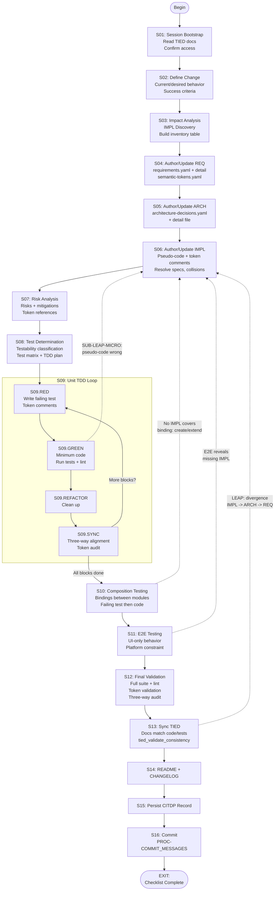

# Agent Requirement Implementation Checklist

**Audience**: AI agents. Process token: `[PROC-AGENT_REQ_CHECKLIST]`.

**Purpose**: This document is the primary procedural template an AI agent follows for every new requirement or change to the tested system. It unifies and sequences the controlling processes into a single executable checklist with explicit branching and looping. The agent executes this checklist from start to finish; skipping steps is not permitted unless a branch directive says otherwise.

**Processes unified here**: `[PROC-CITDP]`, `[PROC-TIED_DEV_CYCLE]`, `[PROC-IMPL_CODE_TEST_SYNC]`, `[PROC-LEAP]`, `[PROC-YAML_EDIT_LOOP]`, `[PROC-IMPL_PSEUDOCODE_TOKENS]`, `[PROC-TOKEN_AUDIT]`, `[PROC-TOKEN_VALIDATION]`, `[PROC-TEST_STRATEGY]`, `[PROC-COMMIT_MESSAGES]`.

**Mandatory order**: IMPL pseudo-code (every block token-commented) → RED tests (with token comments) → code (with token comments). No code before RED; no RED before complete IMPL pseudo-code.

---

## Entry Points

| Scenario | Start at | Notes |
|---|---|---|
| New requirement | S01 | Full checklist applies |
| Change to existing system | S01 | CITDP analysis applies at S02-S03; existing tokens loaded at S03 |
| TIED prepared; tests/code not updated | S01 | S04–S06 verify-only; use updated REQ/ARCH/IMPL as source of truth; follow [PROC-TIED_FIRST_IMPLEMENTATION](tied-first-implementation-procedure.md) |
| Bug fix | S01 | At S02, determine if a REQ is missing; if so, create REQ at S04 before defining the fix |

### Variant: TIED prepared, implementation pending

When REQ/ARCH/IMPL have already been updated and the remaining work is to align tests and code: use the checklist from S01. S02–S03 define the change and impact from the **updated** TIED (desired behavior = new design; current behavior = prior tests/code). S04–S06 are **verify-only** (confirm REQ/ARCH/IMPL completeness and block token comments; fix gaps before proceeding). S07–S16 are unchanged. Full procedure: [tied-first-implementation-procedure.md](tied-first-implementation-procedure.md) (`[PROC-TIED_FIRST_IMPLEMENTATION]`).

## Flow Control Notation

| Symbol | Meaning |
|---|---|
| `GOTO Sxx` | Jump to step Sxx; resume from there |
| `IF condition THEN action` | Conditional branch |
| `LOOP ... UNTIL condition` | Repeat enclosed steps until condition is met |
| `CALL SUB-xxx` | Invoke sub-procedure; return to the calling step when done |
| `RETURN` | Return from a sub-procedure to the caller |
| `EXIT` | Checklist complete |

---

## S01: Session Bootstrap

**Goals**: Confirm access to all governing TIED documents; understand current project state and priorities.

**Tasks**:
1. Preface the response with `"Observing AI principles!"`.
2. Read `ai-principles.md` completely.
3. Review `tied/semantic-tokens.yaml` (token registry) and `tied/semantic-tokens.md` (token guide).
4. Review `tied/architecture-decisions.yaml` and `tied/implementation-decisions.yaml` (YAML indexes).
5. Review `tied/implementation-decisions.md` (IMPL schema, pseudo-code rules, block token rules per `[PROC-IMPL_PSEUDOCODE_TOKENS]`).
6. Confirm TIED MCP server availability (if applicable); prefer MCP for TIED data read/write.
7. Understand priority order: Tests > Code > Basic Functions > Developer Experience > Infrastructure > Security.

**Outcomes**: Agent has read all governing documents. Session context is established.

**Reference**: `AGENTS.md` § 1-2; `ai-principles.md` § Mandatory Acknowledgment, § Checklist for AI Agents.

---

## S02: Define Change or New Requirement

**Goals**: Articulate what is changing or being added, why, what stays the same, and measurable success criteria.

**Tasks**:
1. State **current behavior** (or "none" for a new requirement).
2. State **desired behavior**.
3. State **unchanged behavior** (explicit boundaries of what is not affected).
4. State **non-goals** (what this work intentionally does not address).
5. State **success criteria** (measurable outcomes that determine when the work is done).

**Outcomes**: A clear change definition exists. For CITDP records, this populates the `change_definition` section.

**Branch**: IF this is a bug fix AND no REQ exists for the expected behavior THEN create the missing REQ at S04 first, then return here to define the fix.

**Reference**: `tied/processes.md` § `[PROC-CITDP]` step 1; `ai-principles.md` § Bugs vs requirements.

---

## S03: Impact Analysis and IMPL Discovery

**Goals**: Identify all affected modules, tokens, code, and tests; build an IMPL inventory table that serves as the working context for the rest of the checklist.

**Tasks**:
1. Identify affected modules and functions with their tied tokens.
2. Identify module boundaries the change touches or crosses.
3. Build `tied_context`:
   - `tied_tokens_affected` — existing REQ/ARCH/IMPL tokens touched by the change.
   - `tied_tokens_new` — tokens to be created.
4. **IMPL Discovery** (`[PROC-IMPL_CODE_TEST_SYNC]` Phase A):
   - **A1.** Load each affected IMPL detail file. Record `cross_references`, `related_decisions` (`depends_on`, `composed_with`, `see_also`), and `traceability` fields.
   - **A2.** Discover related IMPLs via four paths:
     - (a) Follow `composed_with` and `depends_on` links in `related_decisions`.
     - (b) Query shared REQ/ARCH tokens (MCP `get_decisions_for_requirement` or index grep).
     - (c) Compare `code_locations` across IMPLs for file/function overlaps.
     - (d) Search managed source and tests for `[IMPL-*]` token references.
   - **A3.** Build an **IMPL inventory table**:

     | IMPL token | Pseudo-code loaded | Code files | Test files | Testability |
     |---|---|---|---|---|
     | *(populated per IMPL)* | | | | |

5. **Stop expanding** when no new IMPLs share code paths, REQ/ARCH tokens, or `composed_with` links with the current set.

**Outcomes**: Complete impact map; IMPL inventory table ready; all affected and related tokens identified.

**Branch**: IF the IMPL set is large (signal of high coupling) THEN consider whether IMPLs need decomposition before proceeding.

**Reference**: `tied/processes.md` § `[PROC-CITDP]` step 2; `tied/processes.md` § `[PROC-IMPL_CODE_TEST_SYNC]` Phase A (A1-A3); `tied/docs/impl-code-test-linkage.md` § Phase A — Discovery.

---

## S04: Author/Update REQ

**Goals**: Create or update the requirement record so the change has a formal `[REQ-*]` token with full traceability fields.

**Tasks**:
1. Create or update the entry in `requirements.yaml` with all required fields: `name`, `category`, `priority`, `status`, `rationale` (`why`, `problems_solved`, `benefits`), `satisfaction_criteria`, `validation_criteria`, `traceability` (`architecture`, `implementation`, `tests`, `code_annotations`), `related_requirements`, `detail_file`, `metadata`.
2. Create or update the REQ detail file in `requirements/REQ-{TOKEN}.yaml` per `tied/detail-files-schema.md` § REQ.
3. Register the REQ token in `semantic-tokens.yaml`.
4. **CALL SUB-YAML** for each changed YAML file.

**Outcomes**: REQ record exists in both the index and the detail file; token is registered in `semantic-tokens.yaml`; all YAML validated.

**Reference**: `tied/processes.md` § `[PROC-YAML_DB_OPERATIONS]` § Appending a New Record; `tied/detail-files-schema.md` § 1; `tied/semantic-tokens.md` § Token Creation Requirements.

---

## S05: Author/Update ARCH

**Goals**: Create or update architecture decision(s) that fulfill the REQ, with cross-references.

**Tasks**:
1. Identify architectural decisions needed (or update existing ones).
2. Create or update the entry in `architecture-decisions.yaml` with `cross_references` to the REQ token(s), `decision`, `rationale`, `alternatives_considered`, `traceability`, `related_decisions`, `metadata`.
3. Create or update the ARCH detail file in `architecture-decisions/ARCH-{TOKEN}.yaml` per `tied/detail-files-schema.md` § ARCH.
4. Register each new ARCH token in `semantic-tokens.yaml`.
5. **CALL SUB-YAML** for each changed YAML file.

**Outcomes**: ARCH records exist with REQ cross-references; tokens registered; YAML validated.

**Reference**: `tied/processes.md` § `[PROC-YAML_DB_OPERATIONS]`; `tied/detail-files-schema.md` § 2; `ai-principles.md` § Phase 1.

---

## S06: Author/Update IMPL with Pseudo-Code

**Goals**: Create or update IMPL decisions with complete `essence_pseudocode` and block-level token comments. Resolve all logical and flow issues in pseudo-code before any tests or code. Pseudo-code is the **source of consistent logic**.

**Tasks**:

### S06.1: Read and Catalog Contracts (Phase B — Reasoning)

1. Read each IMPL's `essence_pseudocode` sequentially. For each, note:
   - INPUT/OUTPUT/DATA declarations (and CONTROL when present).
   - Procedure names (UPPER_SNAKE or camelCase).
   - Key branches (IF/ELSE), loops (FOR ... IN), error paths (ON error, RETURN error).
   - Async boundaries (AWAIT, Promise).

### S06.2: Identify Insufficient Specs

2. Flag any of the following as incomplete (resolution required before tests or code):
   - Missing INPUT or OUTPUT declarations.
   - Procedures referenced but not defined (called by name but body absent).
   - Branches without error handling on a fallible path.
   - Stub or template pseudo-code on an IMPL with `status: Active`.
   - Blocks with no token comment (violates `[PROC-IMPL_PSEUDOCODE_TOKENS]`).

### S06.3: Identify Contradictory Specs

3. Compare across IMPLs in the inventory table:
   - **Shared DATA conflict** — two IMPLs read/write the same DATA key with different assumptions.
   - **Ordering conflict** — IMPL-A expects to run before IMPL-B, but IMPL-B has no ordering constraint or assumes the reverse.
   - **Incompatible OUTPUT types** — IMPL-A produces `{ result }` but IMPL-B expects `{ result, metadata }` from the same procedure.
   - **Duplicate logic** — the same step appears in two IMPLs with different parameters or behavior.

**Branch**: IF two IMPLs have irreconcilable assumptions THEN refactor (split or restructure) one IMPL before proceeding. Do not paper over contradictions.

### S06.4: Resolve and Update

4. For each issue found in S06.2-S06.3:
   - Update the affected IMPL's `essence_pseudocode` so contracts are compatible, ordering is explicit, and every block is complete.
   - IF resolution changes the scope of an ARCH THEN **GOTO S05** to update ARCH, then return here.
   - IF resolution changes the scope of a REQ THEN **GOTO S04** to update REQ, then return here.

### S06.5: Apply Block Token Comments (Phase C — Documentation)

5. Apply `[PROC-IMPL_PSEUDOCODE_TOKENS]` to every IMPL in the set:
   - **Top-level comment**: `# [IMPL-X] [ARCH-Y] [REQ-Z]` followed by a one-line summary.
   - **Sub-blocks (same token set)**: comment only the *how* (no token list repetition).
   - **Sub-blocks (different token set)**: open with `# [IMPL-...] [ARCH-...] [REQ-...]` naming that set and stating how the sub-block implements them.
6. **Cross-IMPL dependency comments**: when a procedure in IMPL-A calls or depends on IMPL-B, the calling block in IMPL-A names IMPL-B (and its ARCH/REQ) so the dependency is visible.
7. **Collision and composition notes**: for each `composed_with` pair or code-path overlap, document:
   - **Ordering**: which IMPL's procedure runs first and why.
   - **Shared data**: which DATA keys are read/written by both; expected state at each boundary.
   - **Pre/post conditions**: what each IMPL expects before it runs and guarantees after.

### S06.6: Persist IMPL Records

8. Create or update `implementation-decisions.yaml` index entries with all required fields.
9. Create or update IMPL detail files in `implementation-decisions/IMPL-{TOKEN}.yaml` per `tied/detail-files-schema.md` § IMPL. Include complete `essence_pseudocode`.
10. Register each new IMPL token in `semantic-tokens.yaml`.
11. **CALL SUB-YAML** for each changed YAML file.

**Outcomes**: All IMPL pseudo-code is complete, authoritative, and token-commented. No contradictions or gaps remain. All YAML validated.

**Reference**: `tied/processes.md` § `[PROC-IMPL_CODE_TEST_SYNC]` Phases B-C; `tied/implementation-decisions.md` § Mandatory essence_pseudocode, § Preferred vocabulary, § Expressing sequence and structure; `tied/docs/impl-code-test-linkage.md` §§ 2-3.

---

## S07: Risk Analysis

**Goals**: Identify and document risks associated with the change.

**Tasks**:
1. List risks with severity and likelihood.
2. Where applicable, attach `tied_token_references` to each risk (which REQ/ARCH/IMPL the risk affects).
3. Document mitigation strategies.

**Outcomes**: Risks documented with token references. Mitigations identified.

**Reference**: `tied/processes.md` § `[PROC-CITDP]` step 4.

---

## S08: Test Determination and Planning

**Goals**: Classify testability for each IMPL block; produce a test matrix; plan the TDD sequence.

**Tasks**:
1. For each IMPL block/procedure, classify as: `unit`, `integration`, or `e2e_only`.
2. IF `e2e_only` THEN document `e2e_only_reason` naming the specific platform constraint in the IMPL detail. "Complex UI flow" is not a sufficient reason; a named platform constraint is required (e.g., "native OS file dialog cannot be triggered programmatically in the test environment").
3. Build a **test matrix**:

   | Test name | IMPL block ref | REQ token | Token comments | Testability |
   |---|---|---|---|---|
   | *(populated per test)* | | | | |

4. Plan the TDD sequence per mandatory implementation order:
   - (1) Unit tests first (conform to IMPL pseudo-code, before production code).
   - (2) Unit code via TDD (code satisfies tests; entire IMPL via TDD).
   - (3) Composition tests first (for every binding between units).
   - (4) Composition code via TDD (binding code satisfies composition tests).
   - (5) E2E (only for behavior requiring UI invocation).
   - (6) Validate and sync.
5. Identify module boundaries and validation criteria per `[REQ-MODULE_VALIDATION]`.

**Outcomes**: Test matrix complete; every IMPL block has a testability classification; TDD sequence planned; module boundaries documented.

**Reference**: `tied/processes.md` § `[PROC-TEST_STRATEGY]`; `tied/processes.md` § `[PROC-CITDP]` step 5; `ai-principles.md` § Thin Entry Points and Testability Classification; `tied/docs/implementation-order.md`.

---

## S09: Unit TDD (Phases D-E-F)

**Goals**: Implement all unit-testable IMPL blocks via strict TDD while maintaining three-way alignment (pseudo-code / tests / code).

```
LOOP FOR each IMPL block classified as unit or integration in S08:
```

### S09.RED: Write Failing Test (Phase D)

**Goals**: Map pseudo-code to a failing test.

**Tasks**:
1. Map the pseudo-code block/procedure to one test group (`describe`/`it` or test function). One block maps to approximately one test group.
2. Name the test group after the procedure and include the REQ token (e.g., `describe("SAVE_WORKFLOW REQ_DATA_SAVE", ...)`).
3. Carry the **same** REQ/ARCH/IMPL token comment as the pseudo-code block, stating *what the test validates*:
   ```
   // [IMPL-X] [ARCH-Y] [REQ-Z] — validates that PROCEDURE returns { ok }
   //   when input is valid and DEPENDENCY succeeds.
   ```
4. Write the failing test. Run the test suite. Confirm the test fails for the expected reason. No production code is written in this step.
5. Verify the assertion corresponds to the OUTPUT or effect described in the pseudo-code block.
6. IF no programmatic assertion can be written for the block THEN mark it `testability: e2e_only` in the IMPL detail with `e2e_only_reason`; skip to the next block.

**Outcomes**: Failing test exists that matches pseudo-code; no production code written.

### S09.GREEN: Write Minimum Production Code (Phase E)

**Goals**: Write the minimum code to pass the failing test.

**Tasks**:
1. Write only enough production code to make the failing test pass.
2. Carry the **same** REQ/ARCH/IMPL token comment as the pseudo-code block, stating *how the code implements*:
   ```
   // [IMPL-X] [ARCH-Y] [REQ-Z] — PROCEDURE: validates input, delegates
   //   to DEPENDENCY, returns { ok }.
   ```
   Nested blocks follow the same rules: same token set comments only *how*; different token set names that set.
3. Run tests. IF tests fail THEN iterate on production code only (do not add new tests in GREEN).
4. Run language-specific lint: Rust → `bun run lint:rust`; TypeScript → `bunx tsc -b` or `bun run lint:ts`; Swift → `swift build && swift test`; YAML → `yq -i -P <changed files>`. IF lint fails THEN fix before proceeding.

**Branch**: IF GREEN reveals the pseudo-code is incomplete, wrong, or requires a new dependency THEN **CALL SUB-LEAP-MICRO**. Do not silently diverge.

**Outcomes**: Test passes; lint clean; code carries correct token comments.

### S09.REFACTOR (optional)

**Goals**: Improve code quality without changing behavior.

**Tasks**:
1. Clean up test or production code (extract functions, rename, simplify).
2. Re-run tests + lint. Confirm no regressions.

**Outcomes**: Code is cleaner; all tests still pass; lint still clean.

### S09.SYNC: Three-Way Alignment Check (Phase F)

**Goals**: Verify that pseudo-code, tests, and code carry identical token sets with corresponding descriptions.

**Tasks**:
1. For every block in this iteration, verify the three artifacts carry the **same** token set:

   | Artifact | Comment content |
   |---|---|
   | **Pseudo-code block** | `# [IMPL-X] [ARCH-Y] [REQ-Z] — how this block implements ...` |
   | **Test block** | `// [IMPL-X] [ARCH-Y] [REQ-Z] — validates that ...` |
   | **Code block** | `// [IMPL-X] [ARCH-Y] [REQ-Z] — how this code implements ...` |

   IF any artifact names a token not present in the other two, or omits a token that the others carry, alignment is broken.

2. IF any diverge THEN update pseudo-code first, then test, then code (LEAP order: IMPL → test → code).
3. Run `[PROC-TOKEN_AUDIT]`: every token named in any of the three must exist in `semantic-tokens.yaml`. IF missing tokens THEN register them and **CALL SUB-YAML**.

**Outcomes**: Three-way alignment verified for the iteration. All tokens registered.

```
END LOOP (repeat S09.RED → S09.GREEN → S09.REFACTOR → S09.SYNC
          UNTIL all unit/integration IMPL blocks are covered and all tests pass)
```

**Reference**: `tied/processes.md` § `[PROC-IMPL_CODE_TEST_SYNC]` Phases D-F (steps 11-20); `tied/docs/impl-code-test-linkage.md` § Stage 2 — Unit TDD; `tied/docs/implementation-order.md` steps 1-2.

---

## S10: Composition Testing (Phase G)

**Goals**: Test bindings between validated modules without invoking the UI. Every binding between units must have IMPL coverage and a composition test.

**Tasks**:
1. **Identify bindings**: event listeners, IPC channels, entry-point delegation, function wiring, platform hooks. Each binding connects two or more units validated independently in S09.
2. **For each binding**, locate the IMPL whose `essence_pseudocode` describes the composition (often in ON/WHEN event handlers or wiring procedures):
   - IF an IMPL block describes the binding THEN proceed to step 3.
   - IF no IMPL covers the binding AND the binding belongs to an existing IMPL THEN extend that IMPL's pseudo-code to add a composition block. **GOTO S06.5** (apply token comments to the new block), **CALL SUB-YAML**, then return here.
   - IF no IMPL covers the binding AND the binding is a distinct design decision THEN create a new IMPL. **GOTO S06** (full IMPL authoring from S06.1), then return here.
3. Write a **failing composition test** for each binding (before composition code):
   - Carries the IMPL block's token comments.
   - Verifies: trigger fires → correct unit called → correct arguments → correct effect.
   - Does **not** invoke the UI. IF it would require UI invocation THEN it belongs in S11 (E2E), not here.
4. Write **composition code** to pass the test. No composition code without a preceding failing test.
5. Apply three-way alignment (same rules as S09.SYNC).
6. Run tests + lint. Fix any failures.

**Outcomes**: All bindings have composition tests; composition code passes; three-way alignment holds.

**Reference**: `tied/processes.md` § `[PROC-IMPL_CODE_TEST_SYNC]` Phase G (steps 21-24); `tied/docs/impl-code-test-linkage.md` § 4 — From unit modules to composition; `tied/docs/implementation-order.md` steps 3-4. For this project’s binding inventory and coverage, see `tied/docs/composition-coverage.md`.

---

## S11: E2E Testing (Phase H)

**Goals**: Cover behavior that genuinely requires UI invocation. E2E does not substitute for composition tests.

**Tasks**:
1. Identify E2E-only behavior: native OS menus, visual rendering, platform behavior that cannot be simulated below E2E. Everything else should already be covered by unit or composition tests from S09-S10.
2. Confirm the IMPL detail file has:
   - `testability: e2e_only`.
   - `e2e_only_reason` naming the specific platform constraint (e.g., "native OS file dialog cannot be triggered programmatically in JSDOM or Playwright").
   - A block in `essence_pseudocode` that documents the E2E-only boundary with a comment (e.g., `# E2E-only: platform onMessage binding`).
3. Write E2E test referencing REQ and IMPL tokens. A comment in the test justifies why composition-level testing is insufficient (repeating or referencing `e2e_only_reason`).
4. E2E does **not** substitute for composition tests. IF a binding is testable below E2E THEN it must have a composition test even if E2E also covers it.

**Decision gate**: "Can I fire this trigger programmatically (via a function call, message, or event) and observe the effect without a browser/UI?" IF yes THEN it is a composition test (S10), not E2E.

**Branch**: IF E2E reveals a missing IMPL block THEN **GOTO S06** to create or extend the IMPL pseudo-code, then return here.

**Outcomes**: E2E tests exist for all UI-only behavior; each is justified with a named platform constraint.

**Reference**: `tied/processes.md` § `[PROC-IMPL_CODE_TEST_SYNC]` Phase H (steps 25-28); `tied/docs/impl-code-test-linkage.md` § 4 — The E2E decision; `tied/docs/implementation-order.md` step 4.

---

## S12: Final Validation (Phase I)

**Goals**: Confirm everything is aligned, passing, and consistent. This is the compound gate that must pass before work is considered complete.

**Tasks**:
1. Run the **full test suite** (unit, composition, E2E). All must pass.
2. Run **lint** for each language in scope: Rust → `bun run lint:rust`; TypeScript → `bunx tsc -b`; Swift → `swift build && swift test`; YAML → `yq -i -P <changed files>`.
3. Run **`[PROC-TOKEN_VALIDATION]`**: `./scripts/validate_tokens.sh` (stub; see `tied/docs/token-validation.md`) or **`tied_validate_consistency`** (MCP). This project uses MCP for validation; fix any issues before proceeding.
4. **Final three-way alignment audit**: for every IMPL touched, verify pseudo-code / test / code carry the same token set with logically corresponding descriptions. Document remaining `e2e_only` blocks and confirm each has `e2e_only_reason`.
5. **Update IMPL detail metadata** for each changed IMPL detail file:
   - `traceability.tests` — list all tests that validate this IMPL.
   - `code_locations` — update files and functions to reflect the current code.
   - `metadata.last_updated` — date, author, reason.
   - **CALL SUB-YAML** on each changed detail file.
6. **Module validation** per `[REQ-MODULE_VALIDATION]`: confirm each module was validated independently before integration. Document validation results.

**Outcomes**: All tests pass; lint clean; token validation passes; three-way alignment verified; IMPL metadata current; module validation documented.

**Branch**: IF any validation fails THEN fix the issue and re-run from the appropriate earlier step:
- Test failure → return to S09 (unit) or S10 (composition) or S11 (E2E).
- Lint failure → fix code, re-run lint.
- Token validation failure → register missing tokens, fix traceability gaps.
- Three-way alignment failure → apply LEAP order (pseudo-code first, then test, then code).

**Reference**: `tied/processes.md` § `[PROC-IMPL_CODE_TEST_SYNC]` Phase I (steps 29-33); `tied/processes.md` § `[PROC-CITDP]` step 7.

---

## S13: Sync TIED to Code and Tests

**Goals**: Ensure TIED documentation matches the final implementation. TIED docs remain the single source of truth for intent.

**Tasks**:
1. Update REQ/ARCH/IMPL index entries and detail files so they match the final code and tests. Ensure IMPLs modified this session reflect the implemented code, including block-level comments with semantic tokens.
2. Sync `semantic-tokens.yaml`, `requirements.yaml`, `architecture-decisions.yaml`, and `implementation-decisions.yaml` (and detail files) so no documentation drift exists.
3. **CALL SUB-YAML** on every changed file.
4. Run `tied_validate_consistency` (MCP) — must report `"ok": true`.

**Branch**: IF divergence between TIED docs and code/tests is detected THEN apply LEAP:
- Update IMPL first (GOTO S06.4 scope).
- IF scope changed, update ARCH (GOTO S05 scope).
- IF scope changed, update REQ (GOTO S04 scope).
- Then return here and re-run consistency validation.

**Outcomes**: TIED docs are consistent with implementation; `tied_validate_consistency` passes.

**Reference**: `tied/processes.md` § `[PROC-TIED_DEV_CYCLE]` steps 8-9; `tied/processes.md` § `[PROC-LEAP]`.

---

## S14: Update README and CHANGELOG

**Goals**: Record user-facing and release-facing changes made in this session.

**Tasks**:
1. Update `README.md` for any user-facing changes (new features, changed behavior, setup instructions).
2. Update `CHANGELOG.md` for release-facing changes (features, fixes, breaking changes).

**Outcomes**: External documentation reflects the session's changes.

**Reference**: `tied/processes.md` § `[PROC-TIED_DEV_CYCLE]` step 9.

---

## S15: Persist CITDP Record

**Goals**: Store the change-analysis record so the analysis, decisions, and outcomes are available for future reference.

**Tasks**:
1. Populate the CITDP YAML record with:
   - **Record identity**: change request ID, date, author.
   - **Change definition** (from S02): current behavior, desired behavior, unchanged behavior, non-goals, success criteria.
   - **Impact analysis** (from S03): affected modules, tied_context, IMPL inventory.
   - **Risk analysis** (from S07): risks with token references.
   - **Test strategy** (from S08): test matrix, testability classifications.
   - **TDD sequence** (from S09-S11): what was implemented and in what order.
   - **Completion criteria**: validation results from S12.
   - **LEAP feedback**: `divergences_from_analysis` (any places where implementation differed from the original analysis), `tied_stack_updates_required` (LEAP propagations triggered), `record_status`.
2. Store as `docs/citdp/CITDP-{change_request_id}.yaml` (or project-defined location).
3. **CALL SUB-YAML** on the record file.

**Outcomes**: CITDP record stored and validated; analysis available for future reference.

**Branch**: IF YAML validation fails THEN fix and repeat step 3. When to create vs skip a CITDP record: see `tied/docs/citdp-policy.md`.

**Reference**: `tied/processes.md` § `[PROC-CITDP]` step 8; `tied/processes.md` § `[PROC-YAML_DB_OPERATIONS]`; `tied/docs/citdp-policy.md` (project policy).

---

## S16: Commit

**Goals**: Create a traceable commit with proper format and token references.

**Tasks**:
1. Write the commit message per `[PROC-COMMIT_MESSAGES]`:
   - **Header**: `<type>(<scope>): <subject>` (keep the full header line to 50 characters or fewer).
   - **Type**: One of `feat`, `fix`, `docs`, `refactor`, `test`, `build`, `ci`, `chore`, `perf`, `style`.
   - **Scope**: Area affected (e.g., `core`, `ui`, `tied`, `tests`). See `tied/processes.md` § `[PROC-COMMIT_MESSAGES]` for the full scope list.
   - **Subject**: Imperative, present tense; no capitalization; no period.
   - **Body**: Motivation and behavior change (imperative tense). Keep lines to 100 characters.
   - **Footer**: `Closes #issue` or `Fixes #issue` if applicable. Reference main REQ/ARCH/IMPL tokens touched.
2. Stage relevant files. Commit.
3. Do NOT push unless explicitly asked.

**Outcomes**: Commit exists with proper format; TIED tokens referenced in body or footer.

**EXIT**: Checklist complete. Do not create a stand-alone summary document.

**Reference**: `tied/processes.md` § `[PROC-COMMIT_MESSAGES]`.

---

## Sub-Procedures

### SUB-YAML: YAML Edit and Validation Loop

**Invoked by**: Any step that creates or modifies TIED YAML (S04, S05, S06, S09.SYNC, S10, S12, S13, S15).

**Goals**: Ensure every TIED YAML file is syntactically valid and canonically formatted before use.

**Tasks**:
1. Run `yq -i -P <file>` on the changed file. This validates syntax and canonicalizes formatting in place.
2. IF validation fails THEN fix the YAML error and repeat step 1. The file is not valid for use until this passes.
3. (Optional, recommended at session boundaries) Run `tied_validate_consistency` (MCP) for cross-file traceability.
4. IF consistency check fails THEN fix the issue in the TIED stack and **RETURN** to the calling step to re-validate.

**Outcomes**: YAML file is syntactically valid, canonically formatted, and ready for use by MCP, scripts, and downstream steps.

**RETURN** to calling step.

**Reference**: `tied/processes.md` § `[PROC-YAML_EDIT_LOOP]`; `tied/docs/methodology-diagrams.md` Diagram 6.

---

### SUB-LEAP-MICRO: LEAP Micro-Cycle During TDD

**Invoked by**: S09.GREEN when production code reveals the pseudo-code is incomplete, wrong, or missing a dependency.

**Goals**: Keep pseudo-code authoritative at every point during TDD. Prevent silent divergence, which is the primary way traceability breaks.

**Tasks**:
1. **STOP** writing production code immediately.
2. **Update IMPL** `essence_pseudocode`: add the missing block, fix the contract, or add the new dependency comment. **CALL SUB-YAML** on the detail file.
3. **Update or add the test** to match the corrected pseudo-code. Carry the same token comments.
4. **Update the production code** to pass the corrected test. Carry the same token comments.
5. **Verify three-way alignment** for the affected block (per S09.SYNC rules).
6. IF the change affects ARCH scope THEN update ARCH: **GOTO S05** (scoped to the affected ARCH), **CALL SUB-YAML**, then return here.
7. IF the change affects REQ scope THEN update REQ: **GOTO S04** (scoped to the affected REQ), **CALL SUB-YAML**, then return here.

**Outcomes**: Pseudo-code remained authoritative at every point. No silent divergence occurred. Three-way alignment holds for the affected block.

**RETURN** to the calling TDD iteration (S09.GREEN continues with the next assertion or block).

**Reference**: `tied/docs/impl-code-test-linkage.md` § 3 — LEAP Micro-Cycle During TDD; `tied/processes.md` § `[PROC-LEAP]` rule 1.

---

## Process Diagram



---

## Quick Reference

| Step | Primary output | Key rule |
|---|---|---|
| **S01** | Session context | Read all TIED docs before work begins |
| **S02** | Change definition | Current, desired, unchanged, non-goals, success criteria |
| **S03** | Impact map + IMPL inventory | Follow all four discovery paths; stop when set stabilizes |
| **S04** | REQ record + token | Index + detail + semantic-tokens.yaml; SUB-YAML |
| **S05** | ARCH record + token | Cross-references to REQ; SUB-YAML |
| **S06** | Complete IMPL pseudo-code | Resolve all issues before tests; token comments in every block |
| **S07** | Risk register | Risks with token references and mitigations |
| **S08** | Test matrix + TDD plan | Testability classification; mandatory implementation order |
| **S09** | Unit tests + code (TDD) | RED entry; GREEN minimum; three-way alignment per iteration |
| **S10** | Composition tests + code | Every binding needs IMPL coverage + composition test |
| **S11** | E2E tests | E2E-only requires named platform constraint |
| **S12** | Validation passed | Full suite + lint + token validation + three-way audit |
| **S13** | TIED docs synced | `tied_validate_consistency` must pass |
| **S14** | README + CHANGELOG | User/release-facing changes documented |
| **S15** | CITDP record | Analysis persisted as validated YAML |
| **S16** | Commit | Format per PROC-COMMIT_MESSAGES; tokens in body/footer |

---

## References

| Document | What it provides |
|---|---|
| `tied/processes.md` | Canonical definitions for all `[PROC-*]` tokens referenced in this checklist |
| `tied/docs/impl-code-test-linkage.md` | Three-way alignment guide with worked examples and the 33-step IMPL_CODE_TEST_SYNC procedure |
| `tied/docs/LEAP.md` | LEAP rationale: why IMPL pseudo-code beats hunting through source |
| `tied/docs/implementation-order.md` | Mandatory implementation order (tests → TDD → glue → E2E → close loop) |
| `tied/docs/methodology-diagrams.md` | Visual diagrams for the traceability stack, dev cycle, TDD inner loop, CITDP, and YAML edit loop |
| `ai-principles.md` | Agent principles, checklists, change impact tracking matrix |
| `tied/implementation-decisions.md` | IMPL detail schema, pseudo-code rules, preferred vocabulary, collision detection |
| `tied/semantic-tokens.md` | Token format, naming convention, registry usage, creation requirements |
| `tied/detail-files-schema.md` | YAML schema for REQ, ARCH, and IMPL detail files |
| `AGENTS.md` | Agent operating guide; session bootstrap; mandatory acknowledgment |
| `tied/docs/ai-agent-tied-mcp-usage.md` | MCP workflow and rationale for TIED data access |
| `tied/docs/token-validation.md` | Project policy: token validation via MCP only; no local script |
| `tied/docs/composition-coverage.md` | Binding inventory and composition vs E2E coverage for this project |
| `tied/docs/citdp-policy.md` | When to create vs skip a CITDP record |
