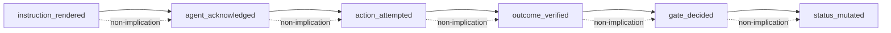

# Checklist Adherence Improvement Plan

**Status:** Evidence-chain design + IMPL pseudo-code (2026-08-24 build-plan); Stages G–L production code deferred to next integrated build-plan
**Scope:** Producer-side Tracker state and its integration with existing TIED checklist gates
**Primary tokens:** `[REQ-TIED_CHECKLIST_GATE_ENFORCEMENT]`, `[ARCH-TIED_CHECKLIST_GATE_ENFORCEMENT]`, `[IMPL-TIED_CHECKLIST_GATE_ENFORCEMENT]`, `[REQ-TIED_ADVERSARIAL_INQUIRY]`, `[ARCH-TIED_ADVERSARIAL_INQUIRY]`, `[IMPL-TIED_ADVERSARIAL_INQUIRY]`, `[IMPL-TIED_ADVERSARIAL_INQUIRY_CHECKLIST]`, `[PROC-AGENT_REQ_CHECKLIST]`, `[PROC-TIED_VERIFICATION_GATED]`, `[PROC-TOKEN_AUDIT]`, `[PROC-TOKEN_VALIDATION]`
**Motivation:** Client `1787626480` claimed checklist completion, but the authoritative checklist evidence gate returned `tracker_sparse` and `missing_required_step:sub-adversarial-inquiry-pass`.

## 0. Refine and plan gates

### Resolved terms

| Sponsor wording | Canonical meaning |
|---|---|
| tracker | **Authoritative Tracker**: a persisted, per-request state artifact supplied to `tied_checklist_gate_validate`; not the canonical checklist definition and not a synthetic projection |
| tracker writer | **Tracker writer**: the agentstream component that validates a **Tracker completion receipt** and atomically updates exactly one per-request Tracker step |
| checklist completion | A non-pending **Tracker disposition** with its disposition-specific evidence contract; `execution_evidence.completed` is only a derived compatibility summary |
| gate result | Raw output from the **checklist evidence gate**; distinct from the adversarial inquiry phase artifact named `gate-result.json` |
| activation evidence | **Integrated activation evidence**: one successful inquiry receipt paired with all four identity-bound artifacts for the same request, project, run, phase, scope, and hashes |
| phase artifacts | Exactly the four bounded files under a **phase artifact directory**: `obligation-report.json`, `finding-ledger.jsonl`, `gate-result.json`, and `evidence-provenance.json` |
| advisory | Finding policy only; it never permits missing Tracker dispositions, missing activation pairing, stale evidence, or status mutation before a successful checklist gate |
| adherence ledger | Append-only `agent-adherence-event.v1` JSONL storing six lifecycle event classes; distinct from **evidence chain profile** |
| adherence event class | One of `instruction_rendered`, `agent_acknowledged`, `action_attempted`, `outcome_verified`, `gate_decided`, `status_mutated`; governed by non-implication rules |
| instruction binding | Per-turn `instruction_nonce` + `instruction_hash` tying rendered prompt bytes to Tracker completion receipt |

Vocabulary ownership and names are defined in `tied/vocab/agentstream.md`, `tied/vocab/fidelity-research.md`, and `tied/vocab/quality-assurance.md`. No new REQ/ARCH/IMPL token is required for this plan: the producer behavior completes the existing machine-enforced checklist evidence contract; the evidence-chain blocks extend `[IMPL-TIED_CHECKLIST_GATE_ENFORCEMENT]`.

### Depth and gate policy

| Context | `depth_tier` | `gate_policy` | `profile_depth` | Reason |
|---|---|---|---|---|
| This documentation + pseudo-code build-plan pass | `minimal` | `advisory` | `not_measured` | No Stages G–L production code; updates plan doc, IMPL pseudo-code, and vocabulary only |
| Next behavior-changing build-plan (Stages G–L) | `integrated` | `advisory` | Selected independently if measured | Adherence ledger, instruction binding, evidence resolution, and durable gate/status receipts mutate persistent workflow evidence |

For this pass, `sub-adversarial-inquiry-pass` is `not_applicable` with policy and rationale in the per-request Tracker. The later build-plan must run distinct integrated inquiry passes at `pre_implementation`, `verification`, and `close_out`.

### Workflow artifacts

- Per-request Tracker (refine-plan): `working/REQ-TIED_CHECKLIST_GATE_ENFORCEMENT/REQ-TIED_CHECKLIST_GATE_ENFORCEMENT_checklist-adherence-plan-refinement_20260824.yaml`
- Per-request Tracker (this build-plan): `working/REQ-TIED_CHECKLIST_GATE_ENFORCEMENT/checklist-adherence-evidence-build_20260824.yaml`
- CITDP draft: `working/REQ-TIED_CHECKLIST_GATE_ENFORCEMENT/CITDP-REQ-TIED_CHECKLIST_GATE_ENFORCEMENT-tracker-writer-draft.yaml`
- Build-plan gate receipt: `working/REQ-TIED_CHECKLIST_GATE_ENFORCEMENT/gate-adherence-evidence-build-pre-implementation.json`
- CITDP persistence is deferred until the integrated behavior-changing build-plan, per `tied/docs/citdp-policy.md`.

### Refine-plan gate result (2026-08-24)

Raw `tied_checklist_gate_validate` output for `phase: pre_implementation` with the Tracker and CITDP above:

- `allowed: true`, `blocking: false`, `depth: minimal`, `diagnostics: []`
- At minimal depth the gate auto-requires only `sub-adversarial-inquiry-pass` (as `not_applicable` or `waived` with policy/rationale); pending implementation steps such as `unit-test-red` are out of scope for this documentation-only pass and do not block pre-implementation progression.
- Vocabulary RECORD/VALIDATE: terms in §0 resolved terms align with `tied/vocab/agentstream.md` and `tied/vocab/fidelity-research.md`; no new REQ/ARCH/IMPL token required.

## 1. Current state and confirmed gap

### Already implemented — consumer side

- `mcp-server/src/checklist-validator.ts` reads `steps`, accepts only `pending`, `completed`, `not_applicable`, or `waived`, requires evidence by disposition, derives phase-aware slugs, rejects sparse/synthetic Trackers, and validates activation pairing.
- `mcp-server/src/verify.ts` rejects status updates without `checklist_gate` and calls `validateChecklistGate` before writing REQ/IMPL status.
- `mcp-server/src/feature-orchestration/commands.ts` blocks gated lifecycle commands when the shared validator rejects their evidence.
- Existing acceptance tests prove `tracker_sparse`, `tracker_not_authoritative`, activation, provenance, finding, freshness, waiver, and close-out diagnostics (A6/A7 in `checklist-validator.test.ts`; A9 in `verify.test.ts`).

### Already implemented — producer side (Tracker writer Stages B–E)

| Capability | Status | Evidence |
|---|---|---|
| Authoritative Tracker materialization incl. `sub-adversarial-inquiry-pass` | **done** | `tools/agentstream/checklist/tracker.go` — `MaterializeAuthoritativeTracker`, `EnsureTracker` |
| Strict `agentstream_tracker` receipt parse (latest fenced JSON wins) | **done** | `tools/agentstream/checklist/tracker_receipt.go` |
| Atomic disposition write + idempotent/conflicting replay | **done** | `tools/agentstream/checklist/tracker_writer.go` — `ApplyTrackerDisposition` |
| Loop-back downstream invalidation on `goto` | **done** | `InvalidateTrackerDownstream`, wired in `tools/agentstream/cmd/agentstream/main.go` |
| Runner blocks turn N+1 without valid receipt | **done** | `main.go`, `tools/agentstream/cmd/agentstream/tracker_composition_test.go` |
| Go→TS gate fixture composition | **done** | `tools/agentstream/checklist/tracker_gate_fixture_test.go` + TypeScript tests |

### Remaining producer/test gaps (honest partials)

- `ValidateTrackerIdentity` request-token mismatch: code exists, **no test**.
- `ApplyTrackerDisposition` for `not_applicable` / `waived`: parser tested, **writer untested**.
- `clearCloseOutGateSummaries` on loop-back: **code only, no test**.
- Composition: **no E2E for `goto` invalidation**; no adversarial-inquiry sub turn.
- Receipt scans **combined** thinking + assistant transcript (`tools/agentstream/executor/executor.go` merges both into one stream).

### Remaining evidence-chain gaps

The six stage names below are **design targets**, not code identifiers today. They are **orthogonal** to `[REQ-EVIDENCE_CHAIN_PROFILE]` / `evidence-chain-profile.v1`, which measures TIED structural completeness. The new `agent-adherence-event.v1` ledger measures session/checklist adherence lifecycle.



| Stage | Current closest machinery | Gap |
|---|---|---|
| `instruction_rendered` | `checklist.LoadTurns` renders turns; hooks log `beforeSubmitPrompt` | No instruction hash persisted; no link to turn identity |
| `agent_acknowledged` | Docs require "Observing AI principles!"; hooks log `afterAgentResponse` | No machine verification; not in Tracker or gate |
| `action_attempted` | Cursor hooks (tool/shell/MCP); receipt parse attempt | Hooks not wired to agentstream/gate; no attempt ledger |
| `outcome_verified` | `verification-evidence-manifest.v1`; gate optional evidence validators | `evidence_refs` not resolved against manifests/commands |
| `gate_decided` | `validateChecklistGate` returns decision | Gate JSON not auto-persisted with input hash |
| `status_mutated` | `tied_verify` dry_run/writes | No post-mutation receipt linking gate → token changes |

The next implementation target is the **six-stage adherence evidence chain** (Stages G–L), not another validator rewrite.

## 2. Change definition

### Achieved behavior (Tracker producer Stages B–E)

For each lead-checklist Turn, agentstream now:

1. materializes or validates a per-request **Authoritative Tracker** including `sub-adversarial-inquiry-pass`;
2. renders a strict **Tracker completion receipt** contract in the turn prompt;
3. parses the receipt from the captured assistant transcript;
4. validates slug, disposition contract, and replay identity;
5. atomically updates exactly one Tracker step;
6. refuses to advance when the receipt is missing, malformed, stale, mismatched, or unsupported;
7. clears downstream dispositions and evidence on a validated `goto`;
8. produces Tracker state consumable by the existing checklist evidence gate and `tied_verify` without a synthetic adapter.

### Remaining evidence controls (Stages G–L)

1. **Instruction binding** — hash rendered turn bytes, issue per-turn `instruction_nonce`, append `instruction_rendered` events before subprocess.
2. **Final-text separation** — parse receipts from final assistant text only; exclude thinking stream.
3. **Receipt hardening** — bind `instruction_nonce`, `instruction_hash`, `request_token`, and `run_id` in `agentstream_tracker` schema.
4. **Evidence ref resolution** — resolve `evidence_refs[]` to files, manifests, or command receipts before accepting `completed`.
5. **Durable gate/status receipts** — persist `tied_checklist_gate_validate` and `tied_verify` mutation receipts with input hashes.
6. **Adherence ledger and reconciliation** — append-only `agent-adherence-event.v1` JSONL and read-only reconciliation findings.

### Current behavior (pre-evidence-chain)

A lead-checklist run can still advance on a valid receipt without proving that observed actions match declared evidence, that gate decisions were persisted, or that status mutations reference the gate chain. Operators may supply generic prose in `evidence_refs` that the writer accepts but the evidence chain cannot verify.

### Unchanged behavior

- The canonical checklist remains a read-only procedure definition.
- `agentstream_control` remains the routing protocol; completion state is a separate envelope.
- The shared TypeScript validator remains the authority for progression.
- `tied_verify` remains the only status-promotion writer and revalidates its `checklist_gate` payload before mutation.
- Advisory inquiry does not mutate canonical TIED YAML and only confirmed findings may trigger LEAP.
- Legacy full checklist copies and Trackers without adherence events remain readable during migration.

### Non-goals

- Reimplementing activation pairing, evidence provenance, or finding lifecycle in Go.
- Treating `execution_evidence.completed`, token presence, TIED consistency, or prose as completion evidence.
- Automatically marking a step complete from subprocess exit code alone.
- Making every adversarial finding blocking.
- Adding UI/E2E coverage where unit and process-composition tests can prove the behavior.
- Retrofitting or promoting statuses in existing client Trackers.
- Merging `agent-adherence-event.v1` into `evidence-chain-profile.v1`.
- Elevating hook transport success to product/checklist success.
- Editing Stages G–L production code in this build-plan pass.

## 3. Authoritative contracts

### 3.1 Checklist definition versus Authoritative Tracker

The canonical file `tied/docs/agent-req-implementation-checklist.yaml` is the checklist definition. A generated per-request Tracker is the mutable state artifact.

The Tracker uses a top-level `steps` collection containing one unique row for every executable main step and every gate-governed sub-procedure. In particular, `sub-adversarial-inquiry-pass` must be materialized as a state row even though its procedure body remains under `sub_procedures` in the definition.

Each Tracker step must contain:

- `slug`;
- `kind` (`main` or `sub_procedure`);
- `disposition` (`pending`, `completed`, `not_applicable`, or `waived`);
- `evidence_refs` for `completed`;
- `policy` and `rationale` for `not_applicable`;
- `owner`, `expiry`, `approval`, and `residual_risk` for `waived`;
- `updated_at`, source turn identity, and receipt hash for audit/replay protection.

`execution_evidence.completed` may be regenerated from `steps` for compatibility, but it is never an input to disposition authority. New writer output uses `disposition`; the gate may continue accepting legacy `status` and `tracking.status` during the migration window.

### 3.2 Tracker completion receipt

Each successful lead-checklist Turn must end with one strict fenced JSON envelope:

```json
{
  "agentstream_tracker": {
    "schema_version": 1,
    "slug": "change-definition",
    "disposition": "completed",
    "evidence_refs": ["working/REQ-X/change-definition.md"],
    "instruction_nonce": "550e8400-e29b-41d4-a716-446655440000",
    "instruction_hash": "sha256:…",
    "request_token": "REQ-X",
    "run_id": "20260824-pre-implementation"
  }
}
```

**Schema v1 (current):** `schema_version`, `slug`, `disposition`, and disposition-specific evidence fields.

**Schema v1 extension (design; Stage G):** add required `instruction_nonce`, `instruction_hash`, `request_token`, and `run_id` with a migration window where v1 without binding fields remains accepted for legacy runs only.

Rules:

- prose and subprocess success never imply completion;
- the receipt slug must equal the current `StepStub`;
- `completed`, `not_applicable`, and `waived` use the same evidence contracts as `validateTracker`;
- generic `skipped` is invalid;
- unknown fields are rejected for schema version 1;
- a byte-equivalent replay is idempotent; a conflicting replay for the same turn identity fails;
- when `agentstream_control.action` is `goto`, the runner applies loop-back invalidation and does not require the current step to be marked complete;
- **receipt parse source (Stage G):** parse from **final assistant text only**; receipts found only in the thinking stream are rejected;
- **binding rejection (Stage G):** reject missing receipt, multiple valid receipts, stale `instruction_nonce`, copied `instruction_hash` from a prior turn, or binding fields that do not match the issued instruction for the current turn.

**Executor separation (design only):**

```go
// tools/agentstream/executor/executor.go — proposed RunResult buckets
type RunResult struct {
  SessionID    string
  FinalText    string // assistant message.content text only — receipt scan target
  ThinkingText string // optional; excluded from receipt scan
  Transcript   string // full audit trail
}
```

### 3.3 Tracker writer

The writer must:

1. refuse the canonical checklist path as a writable target;
2. materialize a per-request Tracker from the canonical definition when explicitly requested;
3. initialize every step to `pending` and clear inherited completion/gate evidence;
4. merge the validated receipt into exactly one matching step;
5. append bounded state history without duplicating an idempotent replay;
6. write through a same-directory temporary file, `fsync`/close, and atomic rename;
7. leave the prior Tracker byte-valid and unchanged on parse, validation, or write failure;
8. preserve unrelated Tracker fields;
9. recompute any compatibility summary only after the authoritative step write succeeds.

### 3.4 Loop-back invalidation

`loop_back_clearance.<target>.clear_slugs` governs state invalidation. A validated `goto` sets every listed Tracker row to `pending` and clears disposition evidence, waiver fields, gate receipts, and downstream derived summaries before the queue is replaced.

The checklist definition is never mutated. A missing clear target, missing state row, or failed atomic write blocks routing.

### 3.5 Gate and status ordering

The completion pipeline order is:

1. unit and composition tests;
2. language-specific build and lint;
3. integrated inquiry for the current phase when selected;
4. activation collection from the matching phase directory;
5. `tied_checklist_gate_validate` for `verification`;
6. `tied_verify` with the same current Tracker/CITDP/activation inputs so it revalidates before status mutation;
7. `tied_validate_consistency`;
8. vocabulary and token audit;
9. distinct close-out inquiry or valid close-out inquiry waiver;
10. `tied_checklist_gate_validate` for `close_out`;
11. close-out publication.

This corrects the earlier order that placed `tied_verify` before checklist validation.

### 3.6 Integrated activation and persisted evidence

For each integrated phase, use a distinct `run_id`. Persist only these four files inside:

`working/{REQ-TOKEN}/adversarial-inquiry/phase-{phase}/`

- `obligation-report.json`
- `finding-ledger.jsonl`
- `gate-result.json`
- `evidence-provenance.json`

The activation collector output and raw checklist evidence gate output are receipts outside the phase artifact directory, for example under `working/{REQ-TOKEN}/gates/`. The inquiry `gate-result.json` is not the checklist evidence gate receipt.

The root `adversarial-inquiry/` projection is convenience-only and cannot satisfy phase pairing. Receipt identity, phase, scope, scope hash, and artifact hashes must match. Verification evidence cannot be reused as close-out activation.

### 3.7 Advisory versus blocking

The checklist evidence gate always fails closed for malformed or missing process evidence, regardless of `gate_policy`.

Under advisory policy:

- valid process evidence may carry non-blocking findings;
- every finding must be triaged to a lifecycle state and either dismissed, deferred/routed with owner, accepted as residual risk with approval/expiry, or confirmed;
- only confirmed findings route through the owning checklist step and can trigger LEAP;
- warning labels are not proof of successful activation.

Strict blocking remains limited to strict-eligible, explicitly approved scope.

### 3.8 Evidence lifecycle (provable controls)

Before each checklist turn in `tools/agentstream/cmd/agentstream/main.go`:

1. **Instruction binding** — hash rendered `t.Parts` → `instruction_hash`; issue per-turn `instruction_nonce`; append `instruction_rendered` event to `working/{REQ-TOKEN}/adherence/events.jsonl`.
2. **Receipt hardening** — extend `agentstream_tracker` with binding fields (§3.2); parse from `FinalText` only.
3. **Evidence ref resolution** — when disposition is `completed`, resolve each `evidence_refs[]` entry:
   - **File path** → must exist; hash recorded in `outcome_verified`.
   - **Manifest reference** → must match `verification-evidence-manifest.v1` (`tied/docs/quality-evidence-manifest.md`); `exit_code != 0` rejected.
   - **Generic prose** ("tests passed") → reject at writer or pre-gate validator.
   Reuse gate helpers: `validateCommandEvidence`, `validateProvenanceComplete`, `validateEvidenceFreshness` in `mcp-server/src/checklist-validator.ts`.
4. **Gate and status receipts** — persist raw `tied_checklist_gate_validate` JSON to `working/{REQ-TOKEN}/gates/{phase}-{timestamp}.json` with input Tracker/CITDP hash; persist `tied_verify` dry_run/apply result with `previous_status` → `next_status` map and gate receipt pointer; reconciliation compares ledger `status_mutated` rows to canonical TIED YAML indexes.
5. **Hook integration (reference only, bounded proof)** — document proof boundaries for `.cursor/hooks/log.rb`:
   - `postToolUse` / `afterShellExecution` / `afterMCPExecution` → candidate `action_attempted` sources.
   - Hook transport success ≠ product success.
   - Hooks are **supplementary**; runner-observed commands remain authoritative for checklist evidence.

## 4. Module boundaries and impact

| Module | Responsibility | Files | Independent validation |
|---|---|---|---|
| Tracker materializer | Convert checklist definition to clean per-request state; include gate-governed sub-procedures | `tools/agentstream/checklist/tracker.go` | Go unit tests — **done** |
| Receipt parser | Parse and validate `agentstream_tracker` without changing routing semantics | `tools/agentstream/checklist/tracker_receipt.go` | Table tests — **done**; binding tests — Stage G |
| Atomic Tracker writer | Apply one receipt or loop-back invalidation without corrupting state | `tools/agentstream/checklist/tracker_writer.go` | Temp-directory tests — **done**; `not_applicable`/`waived` writer tests — Stage I |
| Runner composition | Connect executor transcript → receipt parser → writer before advancing; route `goto` through Tracker invalidation | `tools/agentstream/cmd/agentstream/main.go`, `tools/agentstream/config/` | Fake-agent composition — **done**; goto invalidation E2E — Stage I |
| Gate compatibility | Prove writer output is accepted/rejected by the existing shared gate and by `tied_verify` dry-run | `mcp-server/src/checklist-validator.test.ts`, `mcp-server/src/verify.test.ts` | TypeScript contract tests — **done** |
| Executor | Separate final vs thinking text for receipt scan | `tools/agentstream/executor/executor.go` | `executor_test.go` — Stage G |
| Adherence ledger | Append-only JSONL writer for six event classes | **new** `tools/agentstream/checklist/adherence_ledger.go` | Schema + correlation tests — Stage K |
| Evidence resolver | Resolve refs → manifests/artifacts | **new** `tools/agentstream/checklist/evidence_resolve.go` + TS hook in validator | Writer + validator rejection — Stage H |
| Reconciliation | Read-only adherence chain report | **new** `tools/agentstream/checklist/adherence_reconcile.go` or MCP read tool | Table-driven finding codes — Stage K |
| Gate/status receipts | Persist gate and verify decisions | extend `mcp-server/src/verify.ts`, gate callers | `verify.test.ts` fixtures — Stage J |
| Procedure and operator docs | Define Tracker path, receipt contract, adherence ledger, migration | `tools/agentstream/README.md`, this plan | Static contract tests — Stage F partial |
| TIED logic | Producer + evidence-chain Active blocks | `[IMPL-TIED_CHECKLIST_GATE_ENFORCEMENT]` pseudo-code sidecar/detail | `pseudocode_validate`, `tied_validate_consistency` |
| Vocabulary | RECORD adherence ledger and event-class terms | `tied/vocab/agentstream.md`, `tied/vocab/quality-assurance.md` | `[PROC-VOCABULARY_INDEX]` VALIDATE |

No UI boundary exists; E2E is not required. The fake `cursor agent` subprocess test is a process-composition test, not UI E2E.

## 5. Implementation sequence

### Stage A — LEAP and pseudo-code gate (**complete for producer; extended for evidence chain**)

1. Extend `[IMPL-TIED_CHECKLIST_GATE_ENFORCEMENT]` with token-commented Active blocks:
   - Producer (implemented): `MATERIALIZE_AUTHORITATIVE_TRACKER`, `PARSE_TRACKER_COMPLETION_RECEIPT`, `APPLY_TRACKER_DISPOSITION`, `INVALIDATE_TRACKER_DOWNSTREAM`, `COMPOSE_TRACKER_WITH_CHECKLIST_GATE`
   - Evidence chain (this build-plan): `RENDER_INSTRUCTION_EVIDENCE`, `SEPARATE_FINAL_ASSISTANT_TEXT`, `BIND_RECEIPT_TO_INSTRUCTION`, `RESOLVE_EVIDENCE_REFS`, `PERSIST_GATE_DECISION_RECEIPT`, `PERSIST_STATUS_MUTATION_RECEIPT`, `RECONCILE_ADHERENCE_CHAIN`
2. Add PRE/POST/EFFECTS, failure modes, state transitions, and termination contracts.
3. Update IMPL code locations/tests through TIED YAML tooling.
4. RECORD finalized names in vocabulary.
5. Run pseudo-code validation. **Stage G RED unblocked after pseudocode_validate passes.**

### Stage B — RED: materializer and receipt parser (**complete**)

Implemented with Go unit tests: materialization inventory, path refusal, receipt schema/disposition table tests, idempotent/conflicting replay.

**Residual test debt:** see Stage I.

### Stage C — RED: atomic write and loop-back state (**complete**)

Implemented with temp-directory tests, idempotency, write-failure doubles, and loop-back invalidation code.

**Residual test debt:** `not_applicable`/`waived` writer tests; `clearCloseOutGateSummaries` test — see Stage I.

### Stage D — RED: runner composition (**complete**)

Fake-agent composition tests prove receipt-before-turn-N+1, malformed receipt exit, and canonical checklist byte preservation.

**Residual test debt:** goto invalidation composition — see Stage I.

### Stage E — RED: shared gate/status composition (**complete**)

Go-emitted Tracker fixtures consumed by TypeScript `validateChecklistGate` and `tied_verify` dry-run tests.

### Stage F — Documentation, rollout, and verification (**partial**)

1. Writable Tracker argument documented in `tools/agentstream/README.md` — **done**.
2. Legacy gate reads of `status`/`tracking.status` preserved — **done**.
3. Materialize/migrate preview for old copies — **partial**.
4. Controlled-client pilot — deferred to Stage L.
5. Methodology refresh via `copy_files.sh` — ongoing operator step.
6. Full test/lint/validation — **done** for Stages B–E; Stages G–L pending.
7. Stop rollout conditions defined — see Stage L.

### Stage G — RED: instruction render + receipt binding

**Tests first:**

- `tools/agentstream/executor/executor_test.go`: thinking excluded from `FinalText`; receipt in thinking-only stream fails.
- `tools/agentstream/checklist/tracker_receipt_test.go`: nonce/hash mismatch, stale nonce, missing binding fields.
- `tools/agentstream/cmd/agentstream/tracker_composition_test.go`: `instruction_rendered` JSONL row written before subprocess.

### Stage H — RED: evidence ref resolution

**Tests first:**

- Go unit: reject generic evidence strings; accept manifest path with matching hash.
- TypeScript unit: extend checklist-validator with `evidence_refs` resolution hook (or composition test calling shared fixture).
- Writer test: `completed` with unresolvable ref fails before Tracker write.

### Stage I — RED: Tracker hardening (close remaining gaps)

**Tests first:**

- request_token mismatch (`tracker_test.go`)
- `not_applicable` / `waived` apply (`tracker_writer_test.go`)
- `clearCloseOutGateSummaries` (`tracker_writer_test.go`)
- goto composition invalidation (`tracker_composition_test.go`)

### Stage J — RED: gate/status durable receipts

**Tests first:**

- `mcp-server/src/verify.test.ts`: gate receipt persisted on dry_run; status mutation records gate hash.
- New fixture: gate JSON under `working/.../gates/` consumed by reconciliation.

### Stage K — RED: adherence ledger + reconciliation report

**Tests first:**

- JSONL schema validation; correlation field completeness.
- Reconciliation table-driven tests for all six finding codes.
- End fixture: all six event classes linked for one synthetic request.

### Stage L — Controlled-client pilot + rollout stop conditions

- Pilot one client at `depth_tier: integrated` with distinct phase `run_id`s.
- **Stop rollout if:** writer corrupts Tracker; turn advances without bound receipt; reconciliation shows `status_change_without_verification_receipt`; canonical checklist bytes change.

## 6. Objective acceptance matrix

| ID | Acceptance | Required evidence |
|---|---|---|
| A1 | Fresh materialization produces a non-sparse Tracker with all main slugs plus `sub-adversarial-inquiry-pass` | Go unit fixture and semantic YAML assertion |
| A2 | No checklist Turn advances without a valid current-step receipt bound to issued instruction | Fake-agent composition test; instruction_nonce/hash table test |
| A3 | Every non-pending disposition satisfies its evidence contract | Parser/writer table tests and shared validator fixture |
| A4 | Loop-back invalidates all configured downstream state before rerouting | Go composition test and before/after Tracker fixture |
| A5 | Canonical checklist bytes never change | Snapshot/hash assertion |
| A6 | Writer output passes the existing minimal pre-implementation gate | Raw `tied_checklist_gate_validate` result |
| A7 | Integrated writer output without activation fails under advisory policy | TypeScript gate test with `integrated_depth_requires_pairing` |
| A8 | Each integrated phase uses a distinct identity-bound run and four phase-local artifacts | Three activation receipts plus artifact hashes |
| A9 | Verification gate runs before and inside `tied_verify`; invalid input causes no status diff | `tied_verify` dry-run rejection and unchanged index assertions |
| A10 | Completed step evidence names exact commands, reports, decisions, or resolvable artifact refs | Tracker fixture audit; generic prose and unresolvable refs rejected |
| A11 | No REQ/detail status drift after successful verification | `tied_verify` result followed by `tied_validate_consistency` |
| A12 | Vocabulary, pseudo-code, tests, and code retain token/name alignment | `[PROC-TOKEN_AUDIT]`, `[PROC-TOKEN_VALIDATION]`, vocabulary VALIDATE |
| A13 | Each checklist turn emits `instruction_rendered` before subprocess | Composition test + JSONL fixture |
| A14 | Receipt parsed only from final assistant text | `executor_test` with thinking+assistant streams |
| A15 | Receipt bound to issued nonce + instruction hash | `tracker_receipt` table test |
| A16 | No `completed` disposition with unresolved `evidence_refs` | Writer + validator rejection test |
| A17 | Gate decision persisted with input hash | Gate JSON fixture + `verify.test` |
| A18 | Status mutation references gate receipt | `tied_verify` result + reconciliation pass |
| A19 | Reconciliation report links all six classes for pilot request | Controlled-client report artifact |
| A20 | Replay-safe loop-back clears adherence downstream hashes | Goto composition + reconcile finding absent |

## 7. Required commands and proof boundaries

Planned build-plan verification:

- `go test ./tools/agentstream/...` — Go unit and process-composition behavior only.
- `go test ./tools/agentstream/checklist/...` — adherence ledger, evidence resolver, and reconciliation when implemented (Stages G–K).
- `npm run build --prefix mcp-server` — TypeScript build/type boundary.
- targeted Node test commands for checklist validator and verify composition — shared gate/status behavior only.
- `./scripts/validate_tokens.sh` — token existence/annotation consistency only.
- TIED YAML lint for changed structured records — YAML/schema formatting only.
- `pseudocode_validate` — IMPL pseudo-code structural validation only.
- `tied_validate_consistency` — REQ→ARCH→IMPL/detail/pseudo-code consistency only.
- `adherence-reconcile` (planned Go CLI or MCP read tool) — read-only reconciliation report; observational only.

None of these alone proves integrated activation; that requires the phase-specific inquiry receipt and four paired artifacts.

## 8. Build-plan entry contract

Use `--checklist-tracker-yaml PATH` for the explicit writable per-request Tracker. `--lead-checklist-yaml` continues to identify the read-only checklist definition. When the Tracker path does not exist, agentstream materializes `checklist-tracker.v1`; when it exists, agentstream validates its request/source identity before execution. Resolving both flags to the same file is an error.

**Proposed (Stage G):** `--adherence-ledger PATH` defaulting to `working/{REQ-TOKEN}/adherence/events.jsonl`.

Build-plan pre-implementation gate: `allowed: true` at minimal depth (receipt at `working/REQ-TIED_CHECKLIST_GATE_ENFORCEMENT/gate-adherence-evidence-build-pre-implementation.json`). **Stage G RED is unblocked after IMPL pseudo-code extension and `pseudocode_validate`.** Production code for Stages G–L remains out of scope for this documentation + pseudo-code pass; the next build-plan must select `depth_tier: integrated` and run distinct inquiry passes per phase.

## 9. Six-stage adherence evidence model

Store events in derived ledger **`agent-adherence-event.v1`** (append-only JSONL under `working/{REQ-TOKEN}/adherence/`). Each record is a **hash/reference edge**, not a copy of prompts, transcripts, Tracker YAML, manifests, or TIED indexes. **Do not conflate** with `[REQ-EVIDENCE_CHAIN_PROFILE]` / `evidence-chain-profile.v1`.

### Six non-interchangeable event classes

| Event class | Meaning | Authoritative source |
|---|---|---|
| `instruction_rendered` | Exact turn prompt bytes issued to agent | agentstream pre-`executor.Run` |
| `agent_acknowledged` | Agent attestation only (Tracker receipt) | `agentstream_tracker` fenced JSON |
| `action_attempted` | Runner/hook-observed tool/shell/MCP/command | Cursor hooks + optional runner capture |
| `outcome_verified` | Machine-verified result for an evidence ref | verification manifest, gate receipts, artifact hashes |
| `gate_decided` | Checklist evidence gate decision | persisted `tied_checklist_gate_validate` output |
| `status_mutated` | REQ/IMPL status promotion | `tied_verify` previous→next diff receipt |

### Non-implication rules (normative)

- Acknowledgment (`agent_acknowledged`) **never** proves action.
- Action (`action_attempted`) **never** proves success.
- Success (`outcome_verified`) **never** authorizes progression without a passing gate.
- Gate pass (`gate_decided`) **never** proves status mutation occurred.
- Status mutation (`status_mutated`) **never** retroactively validates earlier missing links.

### Correlation contract (required on every ledger row)

Bind these across all six classes (hash or stable ID where bodies are excluded):

- `request_token`, `project_id`, `run_id`, `phase`, `turn_index`, `step_slug`
- `session_id_hash`, `instruction_hash`, `receipt_hash`, `tool_use_id` (when applicable)
- `source_revision` (git commit or `dirty:<hash>`)
- `artifact_ref` + `artifact_hash` (pointer into existing files, not inline bodies)

### Ledger row shape (sketch)

```yaml
schema_version: agent-adherence-event.v1
event_class: instruction_rendered | agent_acknowledged | action_attempted | outcome_verified | gate_decided | status_mutated
correlation:
  request_token: REQ-TIED_CHECKLIST_GATE_ENFORCEMENT
  run_id: "~"
  turn_index: 1
  step_slug: change-definition
  instruction_hash: sha256:…
source:
  kind: agentstream | cursor_hook | mcp_gate | tied_verify
  path: working/REQ-X/adherence/events.jsonl
  line: 42
proof_boundary:
  - "Does not prove agent followed unstated instructions"
```

**Privacy:** store hashed session/project identities; keep prompt/response bodies outside the ledger; ledger rows reference hook YAML paths and line offsets only.

## 10. Monitoring, reconciliation, retention, and migration

### Deterministic reconciliation findings (read-only)

Implement `adherence-reconcile` (Go CLI or MCP read tool) emitting diagnostics:

| Finding code | Meaning |
|---|---|
| `rendered_without_acknowledgment` | `instruction_rendered` exists; no matching `agent_acknowledged` for turn/slug |
| `acknowledged_without_attempt` | receipt present; no observed action for declared `evidence_refs` |
| `attempt_without_verified_outcome` | hook/runner action logged; no manifest/hash match |
| `completed_with_unresolved_evidence` | Tracker `completed` but ref resolution failed |
| `gate_without_current_evidence` | gate receipt hashes stale vs current Tracker |
| `status_change_without_verification_receipt` | TIED status changed without matching gate+verify chain |
| `legacy_no_adherence_chain` | Tracker predates adherence ledger; non-blocking during migration window |

The report is **observational** — it cannot mutate Tracker or TIED YAML.

### Retention policy

- Ledger + gate receipts: immutable append-only for request lifetime.
- Tracker `state_history`: bounded (e.g. last N turns); prune only unreferenced rows.
- Hook YAML: follow existing `~/.cursor/logs/` rotation; ledger stores path+hash only.

### Migration

- Legacy Trackers without adherence events remain valid; reconciliation marks `legacy_no_adherence_chain` (non-blocking during window).
- Schema v1 receipts without binding fields accepted for legacy runs only during migration window.
- Do not retroactively claim adherence for legacy client Trackers.

### Controlled-client pilot stop conditions (Stage L)

Stop rollout if: writer corrupts Tracker; turn advances without bound receipt; reconciliation shows `status_change_without_verification_receipt`; canonical checklist bytes change.
