# Feedback loops in CITDP + LEAP + TIED

Source: [docs/agent-req-implementation-checklist.yaml](docs/agent-req-implementation-checklist.yaml) (executable checklist; internal step codes stay in that file only).

**Mermaid and plain text:** Each flow has a **Mermaid** diagram (for viewers that render it) and a **Plain-text flow** block right below (for Reddit, email, or any Markdown that shows Mermaid as an unreadable code fence).

---

## 1. End-to-end spine (forward path)

The default run is **one long forward pass**. Feedback loops (later sections) are **jumps back** to an earlier kind of work—not extra steps on this main line.

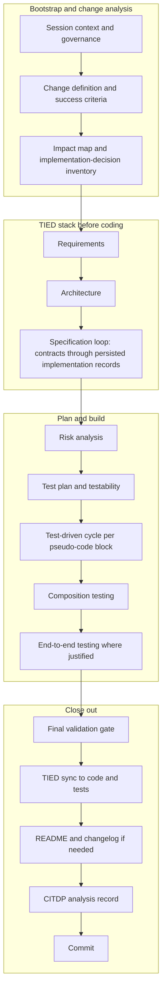

**Plain-text flow (e.g. Reddit, plain Markdown):** one forward chain; group names match the diagram subgraphs.

```
Bootstrap and change analysis
  Session context and governance
  -> Change definition and success criteria
  -> Impact map and implementation-decision inventory

TIED stack before coding
  -> Requirements
  -> Architecture
  -> Specification loop (contracts through persisted implementation records)

Plan and build
  -> Risk analysis
  -> Test plan and testability
  -> Test-driven cycle per pseudo-code block
  -> Composition testing
  -> End-to-end testing where justified

Close out
  -> Final validation gate
  -> TIED sync to code and tests
  -> README and changelog if needed
  -> CITDP analysis record
  -> Commit
```

Linear shortcut (same order):  
`Session/governance` → `Change + criteria` → `Impact + IMPL inventory` → `Requirements` → `Architecture` → `Specification loop` → `Risks` → `Test plan` → `TDD per block` → `Composition` → `E2E` → `Final validation` → `TIED sync` → `README/CHANGELOG` → `CITDP record` → `Commit`.

- The **specification** column is where pseudo-code is hardened before tests—see §4.
- The **test-driven cycle** node is the tight TDD loop—see §5 and §6.

---

## 2. What “feedback loop” means; LEAP ordering

**Feedback loop:** later work produces evidence (fails, missing coverage, consistency errors) that forces **revisiting** an earlier activity.

**Aligning artifacts (same scope):** bring **implementation pseudo-code**, **tests**, and **production code** into agreement in this order:

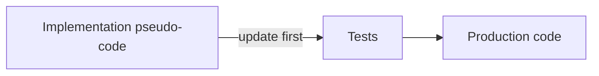

**Plain-text flow:** align in this order (repeat until stable):

1. **Implementation pseudo-code** (authoritative for behavior)
2. **Tests** (match pseudo-code)
3. **Production code** (pass tests)

**When scope changes** (what the system must do or how it is shaped), updates may need to move **up** the traceability stack—not only down into code:

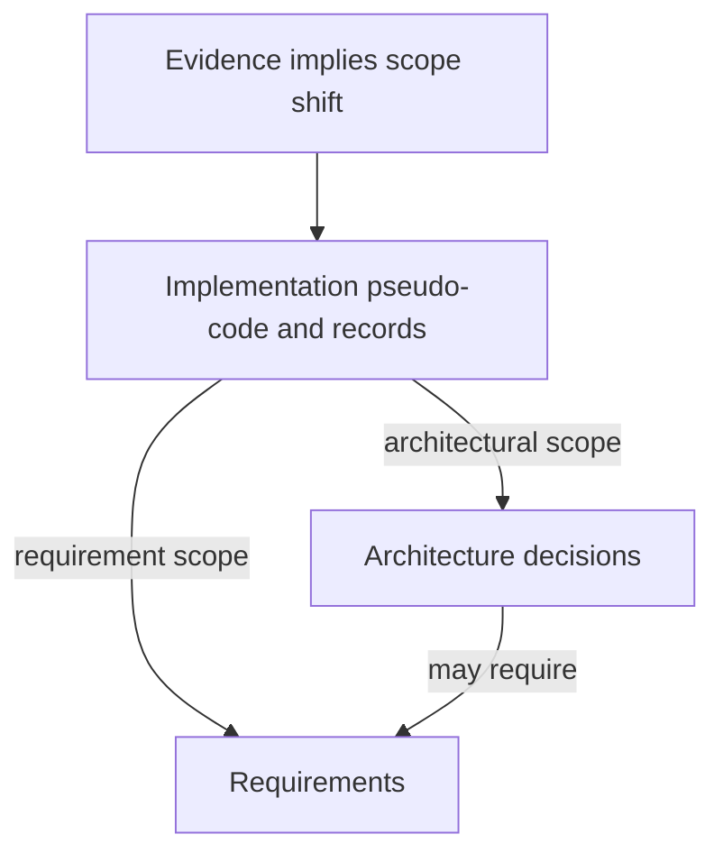

**Plain-text flow:** scope shifts propagate **up** the stack (not only into code).

```
Evidence implies scope shift
  -> Update implementation pseudo-code and records
       -> If architectural scope changed: update architecture decisions
       -> If requirement scope changed: update requirements
  (Architecture changes may require requirement updates.)
```

---

## 3. CITDP: feed-forward analysis, then retrospective record

Early outputs (**change definition**, **impact**, **risks**, **test strategy**) are **consumed** during implementation; they are not a tight retry loop in the middle of the run.

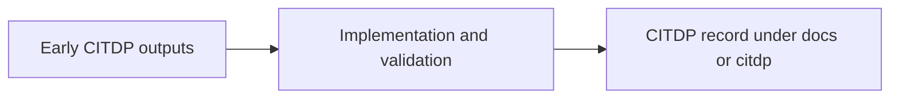

**Plain-text flow:**

```
Early CITDP outputs  ->  Implementation and validation  ->  CITDP record (e.g. under docs/citdp)
```

The **record** step captures **what happened versus the early analysis** (divergences, required TIED updates, status)—closing the loop into **durable memory**, not into an immediate redo of analysis.

---

## 4. Specification loop (before relying on failing tests)

This loop keeps **implementation pseudo-code** authoritative and complete **before** the main test-writing phase.

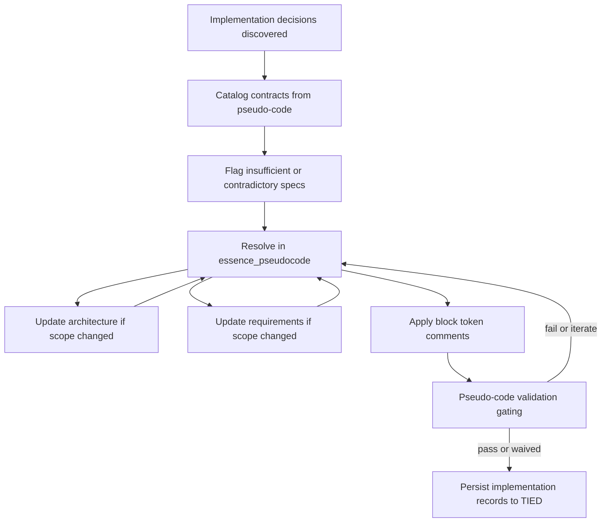

**Plain-text flow:**

```
Start: implementation decisions discovered
  -> Catalog contracts from pseudo-code
  -> Flag insufficient or contradictory specs
  -> Resolve in essence_pseudocode
        |-> If architecture scope changed: update architecture, then back to Resolve
        |-> If requirement scope changed: update requirements, then back to Resolve
  -> Apply block token comments
  -> Pseudo-code validation (gating)
        |-> Fail or iterate: back to Resolve
        |-> Pass or waived: Persist implementation records to TIED
```

- **Irreconcilable** contradictions between two implementation views: **restructure or split** decisions—do not patch over conflicts.
- **Validation** repeats until gates pass or a waiver is documented.

---

## 5. Test-driven inner loop and exit to composition

Per **logical block** of pseudo-code:

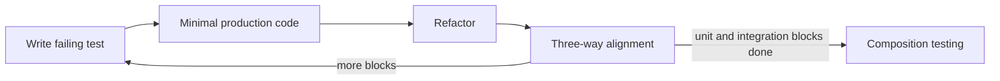

**Plain-text flow:**

```
Write failing test
  -> Minimal production code
  -> Refactor
  -> Three-way alignment
        |-> More blocks to cover: loop to "Write failing test"
        |-> Unit/integration blocks done: go to Composition testing
```

- **Three-way alignment:** pseudo-code, test, and code share the same semantic token set and intent; on mismatch, use the **pseudo-code → tests → code** order from §2.

---

## 6. LEAP micro-cycle during minimal coding

When “green” work shows pseudo-code is wrong, incomplete, or needs a new dependency—**stop** adding production code and realign.

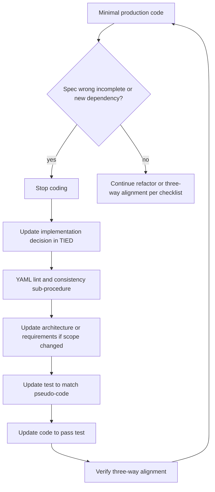

**Plain-text flow:**

```
Minimal production code
  -> Spec wrong, incomplete, or new dependency?
       NO  -> Continue refactor or three-way alignment (normal checklist)
       YES -> Stop coding
              -> Update implementation decision in TIED
              -> YAML lint and consistency sub-procedure
              -> Update architecture or requirements if scope changed
              -> Update test to match pseudo-code
              -> Update code to pass test
              -> Verify three-way alignment
              -> Resume minimal production code
```

- **Architecture or requirements** updates run through the same YAML validation path before retargeting tests and code.
- After a micro-cycle, **minimal coding** resumes until the increment passes; when there is **no** spec mismatch, follow the normal **refactor** and **alignment** steps without entering the halt branch.

---

## 7. Composition and end-to-end: discovery loops back into implementation intent

Integration and UI-level work can expose **missing** formal implementation coverage.

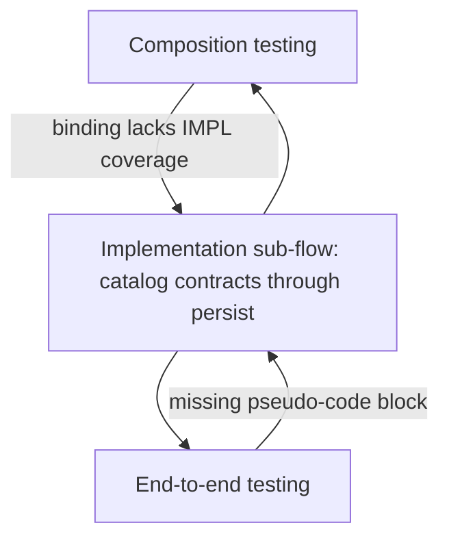

**Plain-text flow:**

```
Composition testing
  -> Binding lacks IMPL coverage?
       Yes: run implementation sub-flow (catalog contracts through persist), then return to Composition testing

End-to-end testing
  -> Missing pseudo-code block for observed behavior?
       Yes: run the same implementation sub-flow, then return to End-to-end testing
```

- **Light gap:** extend existing implementation pseudo-code, then return to **token-comment** work before returning to composition.
- **Separate design:** rerun the full **specification loop** from contract cataloging through persistence, then return.

---

## 8. Final validation gate (compound exit check)

Everything must pass before treating the work as complete. Failures **route back** by kind of problem:

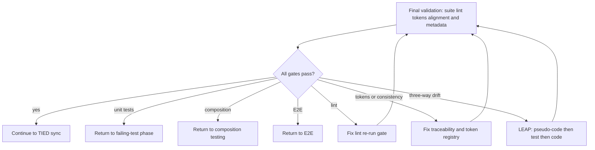

**Plain-text flow:**

```
Final validation (suite, lint, tokens, alignment, metadata)
  -> All gates pass?
       YES -> Continue to TIED sync
       NO  -> By failure kind:
                Unit test failure        -> Return to failing-test phase
                Composition failure      -> Return to composition testing
                E2E failure              -> Return to E2E
                Lint                     -> Fix lint, re-run final validation
                Tokens / consistency     -> Fix traceability, re-run final validation
                Three-way drift          -> LEAP (pseudo-code, then test, then code), re-run final validation
```

---

## 9. Post-implementation TIED sync (outer drift loop)

After behavior stabilizes, **sync** ensures TIED still matches code and tests.

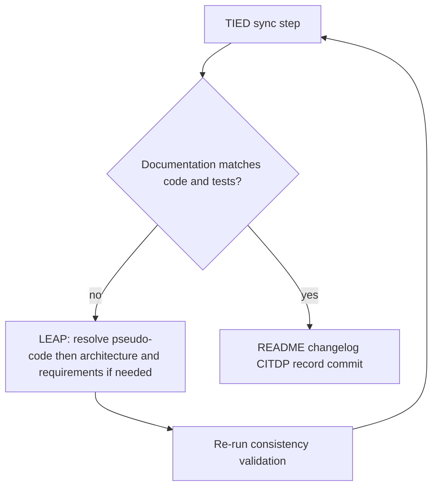

**Plain-text flow:**

```
TIED sync step
  -> Documentation matches code and tests?
       YES -> Continue (README, changelog, CITDP record, commit)
       NO  -> LEAP: resolve pseudo-code; update architecture and requirements if needed
              -> Re-run consistency validation
              -> Return to TIED sync step (repeat until aligned)
```

This prevents **long-lived drift** between repository behavior and traceable intent.

---

## 10. YAML edit and validation sub-procedure

Any TIED YAML mutation goes through **lint** (for direct edits) and **consistency validation**. The main checklist does not advance on broken or inconsistent YAML.

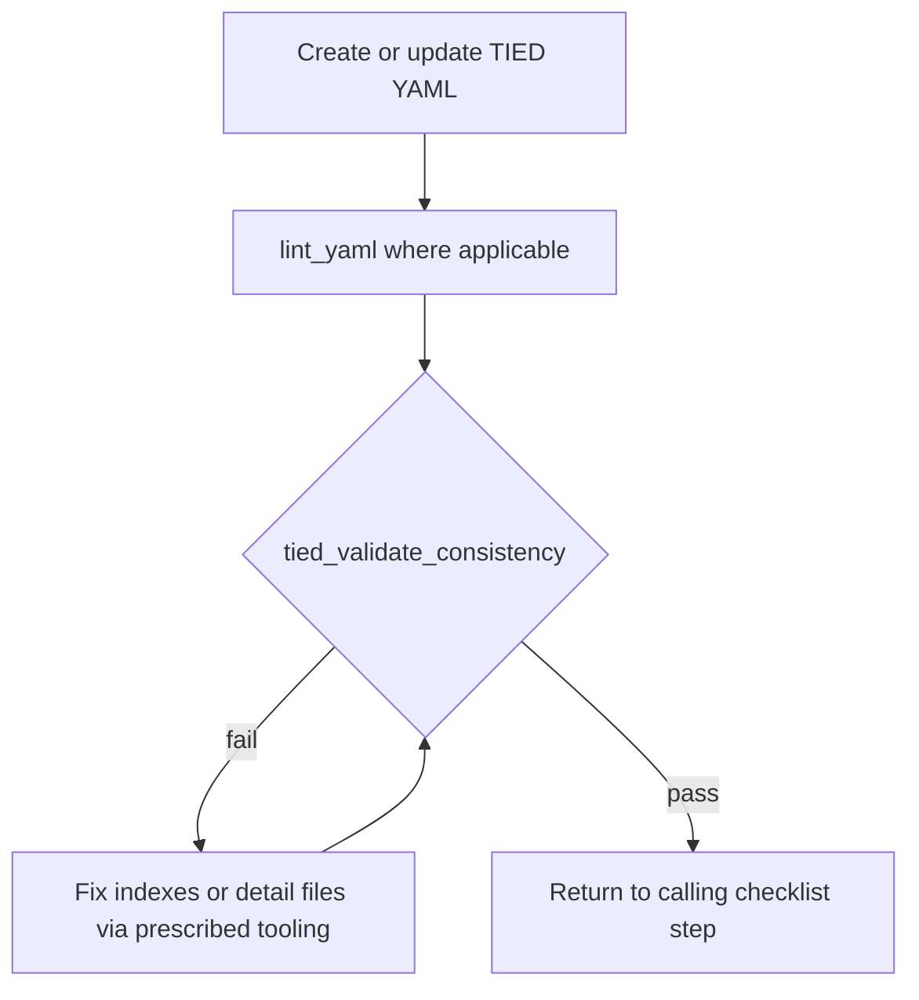

**Plain-text flow:**

```
Create or update TIED YAML
  -> lint_yaml (where applicable)
  -> tied_validate_consistency
        |-> FAIL: fix indexes or detail files via prescribed tooling, then validate again
        |-> PASS: return to the calling checklist step
```

**Callers** include (conceptually): requirement, architecture, and implementation persistence; three-way alignment; composition; final validation; sync; CITDP record write; and the LEAP micro-cycle when it touches implementation files.

---

## 11. Checklist tracking on re-entry

The machine-readable checklist defines **which completion markers to clear** when an agent **re-enters** an earlier phase after a loop-back—so downstream steps are not left incorrectly marked finished. This is **bookkeeping** for honest re-runs, not a separate business logic loop.

---

## 12. Compact mental model (three pillars)

| Pillar | Role in loops |
|--------|----------------|
| **CITDP** | Analyze early; **close** with a stored record that can hold divergences. |
| **TIED** | Wrap doc changes in **validate → fix → re-validate** (§10). |
| **LEAP** | Surface gaps from tests, composition, E2E, or sync → return to **implementation pseudo-code** (and **architecture** or **requirements** when scope changes) → propagate **pseudo-code → tests → code** (§2, §5, §6). |

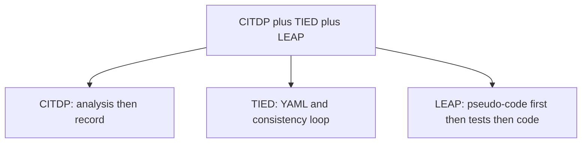

**Plain-text flow:**

```
Checklist unifies three ideas in parallel:
  - CITDP: analysis early, then a closing record
  - TIED: YAML edits wrapped in lint + consistency until pass
  - LEAP: pseudo-code first, then tests, then code; scope changes move up REQ/ARCH/IMPL
```
