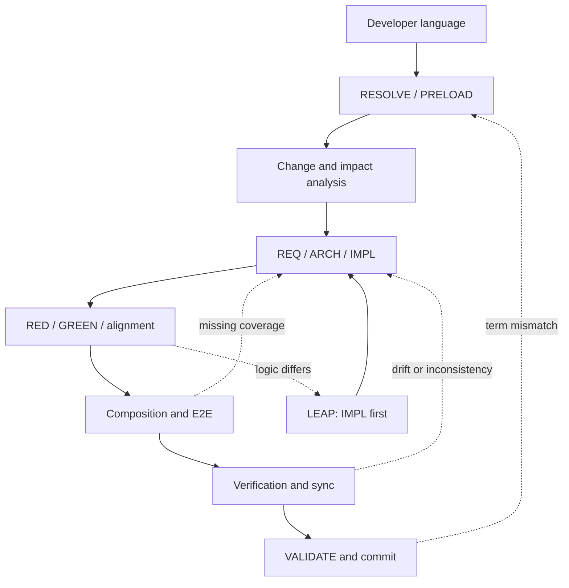

# Agent checklist: phases and feedback loops

**TIED Methodology Version**: 3.0.0

This page explains how the [agent requirement implementation checklist](../tied/docs/agent-req-implementation-checklist.md) governs agent behavior. The executable tracker remains the source for step order, branching, completion markers, and loop-back bookkeeping; this page explains the purpose and benefit of each phase without reproducing that tracker.

## The agent’s operating pattern

Every change follows the same conversational discipline:

1. **Acknowledge and orient.** Read the governing guidance and state the active change and checklist phase.
2. **Resolve language.** Map developer or sponsor wording to one preferred domain term before interpreting the request.
3. **Preload context.** Read [`tied/vocab/routing.md`](../tied/vocab/routing.md), match task keywords, and open only the relevant glossaries before reading TIED records, source, or tests.
4. **Work through the gate.** Report the phase outcome and its evidence; do not silently skip a gate.
5. **Record and validate.** Capture new concepts as they appear, then validate vocabulary and traceability before commit.
6. **Loop back honestly.** If evidence contradicts the current intent, return to the appropriate earlier phase instead of patching around the contradiction.

Vocabulary is therefore a control layer, not a documentation afterthought. `RESOLVE`, `PRELOAD`, `RECORD`, and `VALIDATE` have the same practical blocking importance as pseudo-code, semantic-token, YAML, and test validation.

## Phase benefits

### Bootstrap, intake, and change analysis

- **Vocabulary and bootstrap:** Establishes the terms, tools, priorities, and repository boundaries the agent is allowed to use. The benefit is a shared conversation and a correct starting context instead of confident work based on synonyms or stale assumptions.
- **Change definition:** Separates current behavior, desired behavior, unchanged behavior, non-goals, and measurable success. The benefit is a bounded request that can be tested and reviewed.
- **Impact discovery (Phase A):** Finds affected modules, tokens, implementation decisions, tests, risks, and vocabulary routes. The benefit is a finite blast radius and a working inventory rather than source hunting without a boundary.

### TIED authoring and pseudo-code specification

- **REQ and ARCH authoring:** Converts agreed language into a traceable obligation and a structural decision. The benefit is that “what” and “why” remain linked to “how.”
- **Contract catalog (Phase B):** Reads implementation pseudo-code for inputs, outputs, state, control, branches, failure modes, and termination. The benefit is that missing behavior is found before tests encode it.
- **Resolution and token comments (Phase C):** Repairs contradictions, records scope changes, and tags every logical block with its REQ/ARCH/IMPL relationship. The benefit is comparable pseudo-code and reliable three-way traceability.
- **Pseudo-code validation and persistence:** Gates the authoritative behavior description before RED tests or production code. The benefit is a stable design surface that prevents implementation from becoming an undocumented second specification.

### Risk, test strategy, and implementation

- **Risk assessment:** Connects risks and mitigations to TIED tokens and evidence owners. The benefit is proportionate quality work with visible residual risk.
- **Test strategy:** Classifies each block and plans module validation, unit tests, composition evidence, and justified E2E. The benefit is test coverage aimed at the actual behavior and boundaries, not universal ceremony.
- **Unit TDD (Phases D–F):** RED proves the intended behavior can fail, GREEN adds only enough code to pass, and alignment reconciles pseudo-code, tests, and code. The benefit is small increments, fast diagnosis, and no silent logic drift.
- **Composition (Phase G):** Tests bindings between independently validated modules without invoking the UI. The benefit is direct evidence for wiring, arguments, and effects while keeping entry points thin.
- **E2E (Phase H):** Reserves UI-level tests for named platform constraints. The benefit is meaningful UI coverage without using slow E2E tests to hide testable module or binding gaps.

### Verification and close-out

- **Verification (Phase I):** Runs the full suite, language lint, token validation, consistency checks, alignment audit, metadata updates, and module-validation review. The benefit is a compound exit check that catches drift across artifacts.
- **TIED synchronization:** Updates REQ/ARCH/IMPL metadata and traceability to match the final tests and code. The benefit is durable documentation that remains useful to the next agent.
- **Release notes and CITDP record:** Communicates user-facing impact and preserves the difference between early analysis and delivered behavior. The benefit is searchable institutional memory without pretending the implementation was perfectly predictable.
- **Traceable commit:** Performs the final vocabulary `VALIDATE`, then commits with token references and a clear reason. The benefit is a reviewable unit of change whose language and evidence are internally consistent.

## Feedback loops

The forward path is linear for clarity; feedback loops are controlled returns to the phase that owns the failed assumption.

```mermaid
flowchart TD
    intake["Developer language"] --> vocab["RESOLVE / PRELOAD"]
    vocab --> analysis["Change and impact analysis"]
    analysis --> spec["REQ / ARCH / IMPL"]
    spec --> tests["RED / GREEN / alignment"]
    tests --> compose["Composition and E2E"]
    compose --> verify["Verification and sync"]
    verify --> commit["VALIDATE and commit"]
    tests -.->|"logic differs"| leap["LEAP: IMPL first"]
    leap --> spec
    compose -.->|"missing coverage"| spec
    verify -.->|"drift or inconsistency"| spec
    commit -.->|"term mismatch"| vocab
```

### Vocabulary lifecycle

**RESOLVE → PRELOAD → RECORD → VALIDATE** keeps the same concept stable across conversation, TIED records, pseudo-code block names, tests, code, storage, and UI text.

- **Benefit:** It prevents false synonyms from becoming different tokens or identifiers.
- **Loop behavior:** An ambiguous phrase pauses interpretation; a new concept is recorded with its naming bridge; a pre-commit mismatch returns to RESOLVE or RECORD.

### Specification loop

Contract cataloging can expose missing inputs, outputs, contracts, failure modes, dependencies, or contradictory IMPL assumptions. The agent resolves those issues in pseudo-code, updates ARCH or REQ when scope changes, reapplies token comments, validates, and persists.

- **Benefit:** Tests and code inherit one coherent behavior description.
- **Loop behavior:** Validation failure returns to pseudo-code resolution; irreconcilable assumptions require restructuring or splitting, not a compensating code patch.

### LEAP micro-cycle

If GREEN work reveals that pseudo-code is incomplete, wrong, or missing a dependency, the agent stops production coding. It updates IMPL first, validates YAML, updates ARCH/REQ if scope changed, updates the test, updates code, and checks three-way alignment.

- **Benefit:** Newly learned implementation truth is elevated into the durable design instead of remaining hidden in source.
- **Loop behavior:** The normal TDD iteration resumes only after pseudo-code → test → code is aligned.

### Composition and E2E discovery loop

If a binding lacks IMPL coverage, the agent extends an existing IMPL or runs the full implementation specification path for a distinct design. It then returns to composition testing. If E2E reveals a missing pseudo-code block, the same return applies.

- **Benefit:** Integration evidence cannot create undocumented behavior.
- **Loop behavior:** The smallest missing intent is added at the implementation layer, then the affected test and binding are revalidated.

### Verification and TIED drift loop

Failures route by evidence: unit failures return to RED/GREEN, composition failures to composition, E2E failures to E2E, lint failures to the changed artifact, token failures to registry/traceability repair, and three-way drift to LEAP.

- **Benefit:** The agent spends effort at the layer that owns the defect instead of rerunning everything blindly.
- **Loop behavior:** TIED synchronization repeats until the final implementation, tests, and records agree.

### YAML consistency loop

Every supported TIED YAML mutation follows **write → lint/validate → consistency check → repair → re-check**.

- **Benefit:** Broken syntax, missing detail files, and invalid cross-references are caught before downstream work relies on them.
- **Loop behavior:** The calling checklist phase cannot be marked complete until the consistency check passes.

### CITDP close-out loop

CITDP feeds the forward run with change definition, impact, risks, and test strategy; after implementation, its record captures divergences, evidence, and required TIED updates.

- **Benefit:** Early analysis guides delivery while the retrospective record preserves what was learned without forcing an unnecessary restart of the whole analysis.

## A short behavior example

Developer: “Make the config loader handle the local layer.”

The agent should respond and act in this order:

1. **RESOLVE:** Check whether “config loader” is the preferred term; use **config discovery** if that is the indexed concept.
2. **PRELOAD:** Route “local layer” and configuration keywords, then read only the matched glossary before inspecting TIED or source.
3. **State the gate:** Explain that the request is at intake/change-definition, not yet permission to write code.
4. **Record and formalize:** Use the preferred term in the change definition, REQ/ARCH/IMPL names, and the relevant pseudo-code block; record any new local-layer naming bridge.
5. **Prove and close:** Carry the term into the RED test and GREEN code, reconcile it during alignment, and report vocabulary `VALIDATE` with the final traceability evidence.

The checklist is the agent’s behavioral contract: it tells the agent how to converse, what to read before forming conclusions, which artifact owns a correction, and what evidence is required before moving on.
