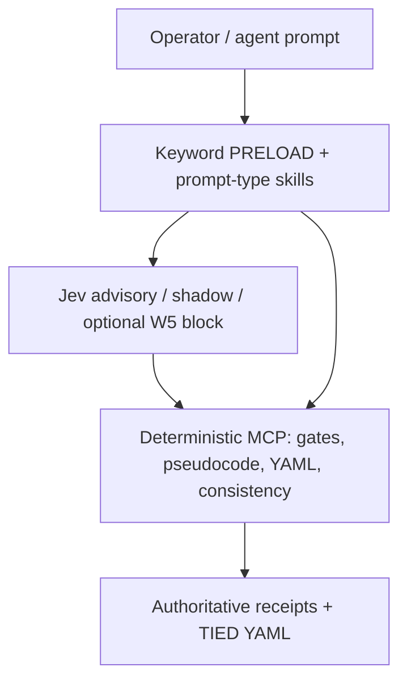

# Jev (System One) × TIED — canonical reference

| Field | Value |
| --- | --- |
| **Purpose** | Operator-facing guide: what System One / Jev is, how TIED uses it today, known gaps, and where bounded judgment helps next. |
| **Audience** | TIED implementers, agent operators, and plan-skill authors wiring advisory layers. |
| **Program coordinator** | Executable waves, gates, and evidence live in [`working/REQ-TIED_JEV_DECISION_COPROCESSOR/PLAN.md`](../../working/REQ-TIED_JEV_DECISION_COPROCESSOR/PLAN.md). |
| **Preferred vocabulary** | [`tied/vocab/decision-copilot.md`](../../tied/vocab/decision-copilot.md) |
| **TIED stack (reference only)** | [REQ-TIED_JEV_DECISION_COPROCESSOR](../../tied/requirements/REQ-TIED_JEV_DECISION_COPROCESSOR.yaml) · [ARCH-TIED_JEV_DECISION_COPROCESSOR](../../tied/architecture-decisions/ARCH-TIED_JEV_DECISION_COPROCESSOR.yaml) · [IMPL-TIED_JEV_DECISION_COPROCESSOR](../../tied/implementation-decisions/IMPL-TIED_JEV_DECISION_COPROCESSOR.yaml) — **Implemented** (2026-09-26); this doc does not mint new tokens. |
| **Last updated** | 2026-09-28 (doc refresh: `DOC-JEV-COMPARISON-REFRESH`) |

---

## Complementarity

| Center of gravity | TIED today | Jev (System One) |
| --- | --- | --- |
| Primary asset | Semantic DB + deterministic MCP gates + checklist receipts | Fast **typed** judgments (`choice` / `score` / `noul`) in one parallel pass |
| Agent contract | Checklist + tokens + YAML MCP writes | Millisecond **decision coprocessor**; optional **block** on risky tools when W5 harness is enabled |
| Routing | Keyword **PRELOAD** from `tied/vocab/routing.md` | **Shadow** / advisory glossary picks — never replaces PRELOAD without an explicit product decision |
| Proof | `tied_checklist_gate_validate`, inquiry four-artifact activation | Observation logs, redacted replay JSONL, plan-skill evidence under `working/` |

**Compose-don't-fork:** Jev does not replace `tied_checklist_gate_validate`, `pseudocode_analyze`, `tied_validate_consistency`, integrated adversarial inquiry activation, or authoritative YAML MCP writes.

---

## System One model (contract)

System One models (Jev) are **not** general LLMs for prose or JSON repair. They expose a single HTTP **`/v1/decide`** surface: you send compact **state** plus a map of **typed questions**; the model returns structured **answers** in one **speculative fan-out** (all questions evaluated together, not a token stream).

### Primitives

| Type | Question shape | Answer shape | Confidence |
| --- | --- | --- | --- |
| **`choice`** | Pick one of up to 255 labeled options (`criteria` map) | `choice`, `confidence`, `probabilities` | Explicit confidence on the choice |
| **`score`** | Position on 2–10 ordered levels (`criteria` array) | `score` (may be fractional), `confidence`, `probabilities` | Explicit confidence on the score |
| **`noul`** | Calibrated yes/no | `noul` in \([0, 1]\) | **No separate confidence field** — the probability *is* the belief |

### Client obligations in this repo

The W1 wrapper [`jevDecide`](../../mcp-server/src/jev/client.ts) enforces:

- **`JEV_API_KEY`** server-side only; missing key → `skipped: true` (no vendor call).
- **State size cap** (`DEFAULT_JEV_MAX_STATE_CHARS`) → skip when too large.
- **Redaction** before wire send ([`redact-state.ts`](../../mcp-server/src/jev/redact-state.ts)).
- **502 retry** on transient vendor errors (see client implementation).

**Confidence threshold policy** (when to allow, confirm, block, or escalate) is **code-owned**, pinned per harness/module — not inferred from vendor docs alone. Example: W5 harness uses `CONFIRM_RISK_THRESHOLD = 0.45` and `BLOCK_RISK_THRESHOLD = 0.72` in [`harness-tool-guard.ts`](../../mcp-server/src/jev/harness-tool-guard.ts).

### Cascade architecture (where Jev sits)

Use a **fast deterministic layer first**, then System One, then heavier models or humans:

1. **Deterministic code** — regex, routing tables, MCP validators, token graph checks.
2. **System One front door** — parallel nouls/choices on **trimmed** state.
3. **Specialized / cheaper LLM** — only when typed answers are insufficient.
4. **Frontier model / human** — high consequence, low confidence, or policy-mandated waiver.

---

## Article-derived patterns vs repo evidence

Patterns below come from the vendor **System One / Jev article** (session extraction `Jev_article_full_extraction.md`; not checked into this repo). **Repo evidence** cites fixtures, tests, or live replay logs under [`working/REQ-TIED_JEV_DECISION_COPROCESSOR/evidence/`](../../working/REQ-TIED_JEV_DECISION_COPROCESSOR/evidence/).

| Pattern | Article claim (label: *Article*) | Repo evidence (label: *Repo*) |
| --- | --- | --- |
| Parallel typed decisions | Many small judgments in one API call beat sequential LLM chains for latency and cost | W2/W3/W4/W5 use multi-question fan-out in `mcp-server/src/jev/*` |
| Calibration | Aggregate calibration can align confidence with accuracy | *Article* — treat vendor RLCD/calibration marketing as **unverified** here unless reproduced in labeled fixtures |
| Compact state | Accuracy degrades on bloated or noisy state | Client enforces max state chars + redaction; W5 context filter is **advisory** only |
| Action from confidence | Thresholds branch automation vs confirm vs escalate | W5 harness maps nouls + regex to `allow` / `confirm` / `block` in code |
| Cost / latency | Sub-second, low per-call cost vs frontier LLM | *Article* — do not copy numeric savings into TIED gates; use labeled replay logs for local measurements |
| Ready-made APIs | Agent risk, context filter, model route shortcuts | TIED uses **custom question maps** in-repo; ready-mades are optional future composition |

**Live replay (2026-09-26, sponsor key — see [live-jev-evidence-2026-09-26.md](../../working/REQ-TIED_JEV_DECISION_COPROCESSOR/evidence/live-jev-evidence-2026-09-26.md)):**

- W2 vocab shadow: **70%** keyword–Jev agreement on 10 prompts (*Repo*).
- W4 adversarial triage pilot: **~83%** label agreement on 6 fixtures (*Repo*).

Sub-0.90 agreement is **tuning signal**, not checklist gate failure for the closed program.

---

## TIED layering (authority)

**Authoritative (never delegated to Jev):**

- `tied_checklist_gate_validate` → `allowed` / waiver receipts
- YAML MCP writes and `tied_validate_consistency`
- Keyword **PRELOAD** glossary sets (unless a future explicit product change says otherwise)
- Integrated adversarial inquiry **four-artifact** activation

**Advisory:** W2 shadow, W3 prompt-type hints, W6 plan-skills shadow/tiebreak **display**, W4/W6d triage pilot.

**Conditional block:** W5 live harness may **`block`** high-risk `bash` / `Shell` proposals when opt-in env/manifest is active — see **Correctness audit** (limits G2–G4).

**Never:** Jev mutates TIED YAML, sets gate `allowed`, or replaces human LEAP/waiver decisions.

---

## Caveats and jagged edges

Valid structured output can still be **wrong** — calibration is **aggregate**, not per-call truth.

| Limit | Implication for TIED |
| --- | --- |
| Literal reading of state | Hostile or manipulated user text in `state` is not automatically safe; trim and redact |
| No arithmetic / dates / counting | Use deterministic code for token validation, semver, file counts |
| No prose / explanation | Do not use Jev to draft IMPL pseudo-code, commit messages, or YAML |
| Bloated context | Prefer bounded excerpts; W5 context filter advises keep/truncate/drop — sample only today |
| Vendor metrics | Latency, pricing, and headline calibration claims stay ***Article*** unless reproduced in repo fixtures |

---

## Adoption snapshot (W1–W6d on `main`)

| Wave | Capability | Status | Primary anchor |
| --- | --- | --- | --- |
| **W1** | `/v1/decide` HTTP client, env contract | **Current** | [`mcp-server/src/jev/client.ts`](../../mcp-server/src/jev/client.ts) |
| **W2** | Vocab PRELOAD **shadow** (metrics only) | **Current** | [`shadow-vocab-preload.ts`](../../mcp-server/src/jev/shadow-vocab-preload.ts), [`replay-jev-vocab-shadow.ts`](../../mcp-server/scripts/replay-jev-vocab-shadow.ts) |
| **W3** | Prompt-type **advisory** (13 leaf types + heuristic) | **Current** | [`prompt-type-advisory.ts`](../../mcp-server/src/jev/prompt-type-advisory.ts) |
| **W4** | Adversarial triage **pilot** (observation nouls) | **Partial** | [`adversarial-triage-pilot.ts`](../../mcp-server/src/jev/adversarial-triage-pilot.ts) — not integrated inquiry activation |
| **W5** | Agentstream harness: preflight, live tool gate, context advisory | **Current** | [`jev-harness-preflight.ts`](../../mcp-server/packages/agentstream/src/jev-harness-preflight.ts), [`jev-harness-live-tool-gate.ts`](../../mcp-server/packages/agentstream/src/jev-harness-live-tool-gate.ts), [`context-filter-advisory.ts`](../../mcp-server/src/jev/context-filter-advisory.ts) |
| **W6** | Plan-skills MCP + shadow | **Current** | [`jev-plan-skills-tools.ts`](../../mcp-server/src/tools/jev-plan-skills-tools.ts), [`plan-skills-shadow.ts`](../../mcp-server/src/jev/plan-skills-shadow.ts), [`jev-plan-skills-adjunct.md`](../../tools/bundled-prompt-type-skills/prompt-shared/jev-plan-skills-adjunct.md) |
| **W6d** | Tiebreak **display** + triage MCP adapter | **Current** | [`plan-skills-tiebreak.ts`](../../mcp-server/src/jev/plan-skills-tiebreak.ts), [`plan-skills-triage-mcp.ts`](../../mcp-server/src/jev/plan-skills-triage-mcp.ts) |

Prior versions of this file listed W5 and MCP tools as **Gap**; implementation and tests exist — gaps below are **correctness / safety** items, not missing waves.

---

## Integration map

- **Core module:** [`mcp-server/src/jev/`](../../mcp-server/src/jev/) (client, shadow, advisory, harness guard, plan-skills, types, tests).
- **MCP tools:** [`mcp-server/src/tools/jev-plan-skills-tools.ts`](../../mcp-server/src/tools/jev-plan-skills-tools.ts) — `tied_jev_status`, `tied_jev_vocab_shadow`, `tied_jev_adversarial_triage_pilot`.
- **Agentstream:** [`live-executor.ts`](../../mcp-server/packages/agentstream/src/live-executor.ts) creates live gate; [`executor-run.ts`](../../mcp-server/packages/agentstream/src/executor-run.ts) parses stream-json tool proposals; [`live-driver-bind.ts`](../../mcp-server/packages/agentstream/src/live-driver-bind.ts) binds Cursor vs Claude drivers.
- **Tests:** `mcp-server/src/jev/*.test.ts`, [`jev-harness-live-tool-gate.test.ts`](../../mcp-server/packages/agentstream/src/jev-harness-live-tool-gate.test.ts).
- **Evidence / replay:** [`working/REQ-TIED_JEV_DECISION_COPROCESSOR/evidence/`](../../working/REQ-TIED_JEV_DECISION_COPROCESSOR/evidence/).

---

## System One–aligned behaviors (today)

- **Typed fan-out** — W2 glossary choices, W3 prompt types, W4 triage nouls, W5 agent-risk nouls in one `jevDecide` where applicable.
- **Bounded/redacted state** — prompt slices (~4k), redaction helper, skip when over cap or no key.
- **Opt-in surfaces** — plan-skills (`TIED_JEV_PLAN_SKILLS` / config), agentstream harness env + manifest flags.
- **Shadow-only PRELOAD** — keyword baseline unchanged; `agrees` compares Jev picks to keyword set ([`vocabShadowAgrees`](../../mcp-server/src/jev/shadow-vocab-preload.ts)).
- **Code-owned effects** — only harness + executor interpret `block` / diagnostics; Jev answers alone never write YAML.

---

## Correctness audit (known gaps)

Document these when interpreting metrics or enabling W5 in production. **Follow-on code CITDP** under [REQ-TIED_JEV_DECISION_COPROCESSOR] is the right owner; this doc pass does not fix them.

| ID | Gap | Primary anchor | Verify |
| --- | --- | --- | --- |
| **G1** | ~~Shadow metrics: vendor errors → `agrees: true`~~ **Fixed 2026-09-28 (S1/1C):** `jev_error` + `agrees: false`; `summarizeShadowAgreement.jev_errors`; live replay exits non-zero on errors | [`shadow-vocab-preload.ts`](../../mcp-server/src/jev/shadow-vocab-preload.ts); [`plan-skills-shadow.ts`](../../mcp-server/src/jev/plan-skills-shadow.ts); [`replay-jev-vocab-shadow.ts`](../../mcp-server/scripts/replay-jev-vocab-shadow.ts) | `rg -n 'jev_error' mcp-server/src/jev/shadow-vocab-preload.ts mcp-server/scripts/replay-jev-vocab-shadow.ts` |
| **G2** | Live gate: missing built `mcp-server/dist/jev/harness-tool-guard.js` → `createJevLiveToolGate` returns **null** (fail-open while harness flag set) | [`jev-harness-live-tool-gate.ts`](../../mcp-server/packages/agentstream/src/jev-harness-live-tool-gate.ts) L129–132 | `rg -n 'loadJevHarnessDistModule' mcp-server/packages/agentstream/src/jev-harness-live-tool-gate.ts` |
| **G3** | ~~Live loop ignored `confirm`~~ **Fixed 2026-09-28 (S3):** local log-only; **`CI=true`** or **`AGENTSTREAM_JEV_HARNESS_CONFIRM_STRICT=1`** aborts on `confirm` | [`jev-harness-live-tool-gate.ts`](../../mcp-server/packages/agentstream/src/jev-harness-live-tool-gate.ts) (`jevHarnessConfirmStrictEnabled`) | `rg -n 'jevHarnessConfirmStrictEnabled' mcp-server/packages/agentstream/src/jev-harness-live-tool-gate.ts` |
| **G4** | ~~Claude bypassed `jevToolGate`~~ **Fixed 2026-09-28 (S4):** `collectClaudeStreamFromSpawn` + bind default launch share gate with Cursor | [`claude-driver.ts`](../../mcp-server/packages/agentstream/src/claude-driver.ts), [`live-driver-bind.ts`](../../mcp-server/packages/agentstream/src/live-driver-bind.ts) | `rg -n 'jevToolGate' mcp-server/packages/agentstream/src/live-driver-bind.ts mcp-server/packages/agentstream/src/claude-driver.ts` |
| **G5** | This comparison doc was **stale** (W5/W6 listed as missing) | *This file* — fixed 2026-09-28 | `rg -n 'Gap' docs/comparisons/jev-for-tied-improvement.md` — should not claim W5/W6 implementation gap |

Additional hardening notes (not separate G-rows): response shape validation for unknown `choice` keys is limited; static thresholds are not yet version-bound to `JEV_MODEL` in a single registry doc (optional `threshold-tuning-doc` wave in program PLAN).

---

## Ranked opportunity catalog (future waves)

Each row is a **bounded procedural judgment** — Jev suggests; deterministic code and gates commit.

| Rank | Procedure | Typed question(s) | State (bounded) | Confidence / fallback | Authority |
| --- | --- | --- | --- | --- | --- |
| 1 | Checklist gate **semantic adjunct** | Nouls: “evidence thin?”, “step likely complete?” | Step id + redacted evidence summary | Low confidence → omit hint; never set `allowed` | **`tied_checklist_gate_validate`** remains sole gate authority |
| 2 | Empty / ambiguous **PRELOAD cascade** | `choice`: next glossary id from allowed set | Prompt + matched routing rows | Shadow log only; fallback keyword PRELOAD | PRELOAD unchanged |
| 3 | Touchpoint 1 **RESOLVE** | `choice`: sponsor term → glossary id | Term + glossary index titles | Low confidence → ask human | RECORD in vocab when confirmed |
| 4 | IMPL **testability** / e2e-only | `choice` or `noul`: unit vs composition vs e2e-only | IMPL block excerpt + checklist snippet | Escalate to human on low confidence | Tests/code still follow IMPL + checklist |
| 5 | **Residuality** W2 disposition pre-sort | `noul` fan-out on drift classes | REQ excerpt vs pseudo-code vs test snippet | W4-style observation log | Not inquiry activation |
| 6 | **Conversation adherence** second opinion | `noul`: “response skipped mandatory step?” | Checklist step ids + assistant summary | Advisory flag only | Operator decides loop-back |
| 7 | **Binding / scope** classification | `choice`: binding type for composition test | Module boundary description | Fallback: human architecture review | ARCH/IMPL tokens unchanged |
| 8 | **Evidence / tracker thin-completion** | `score`: completeness 1–10 | Tracker YAML slice + gate receipt ids | Warn-only under confidence floor | No auto-complete checklist steps |
| 9 | **Gitignore / secret hygiene** (optional) | `noul`: “path likely credential leak?” | Diff path list | High noul → block commit script hint | Human + hooks authoritative |

### Do not use Jev for

- Authoritative **`allowed`** on checklist gates, waivers, or LEAP promotion
- Exact **arithmetic**, semver ordering, token cross-reference graphs (`tied_validate_consistency`)
- **Prose generation** — requirements, pseudo-code, commit messages, YAML bodies
- **Replacing** keyword routing tables without shadow period and explicit policy
- **Parsing** free-form LLM JSON with retry loops (use typed decide or deterministic parsers)

### Recommended implementation sequence (doc-only ranking)

1. ~~Fix **G1**~~ **Done (2026-09-28)** — vendor errors use `jev_error`; strict live replay fails on `jev_errors > 0`.
2. **PRELOAD cascade** shadow (rank 2) — extends proven W2 pattern.
3. Checklist **semantic adjunct** (rank 1) — highest operator value if kept strictly non-authoritative.
4. Touchpoint 1 **RESOLVE** assist (rank 3) — pairs with vocab discipline.
5. W5 production hardening bundle: **G2–G4** (dist fail-closed, `confirm` policy, Claude parity).
6. W4-style **residuality** expansion (rank 5) before any integrated inquiry coupling.
7. Threshold tuning doc + model-version registry (program optional `threshold-tuning-doc` todo).

Sequence **5** is gated on sponsor **4A** (Claude + Cursor parity) before calling live W5 “production ready.” **2B** and **3C** remain documented limits until a follow-on code CITDP changes runtime behavior.

---

## Sponsor policy decisions (2026-09-28)

Binding for follow-on implementation CITDPs under [REQ-TIED_JEV_DECISION_COPROCESSOR]. Persisted: [`tied/citdp/CITDP-DOC-JEV-COMPARISON.yaml`](../../tied/citdp/CITDP-DOC-JEV-COMPARISON.yaml).

| ID | Topic | Decision | Plain effect |
| --- | --- | --- | --- |
| **S1** | Shadow errors (G1) | **1C** | Replay/CI scripts **fail** when Jev returns a vendor/transport error—not counted as agreement. |
| **S2** | Missing harness `dist` (G2) | **2B** | Live runs may continue **without** the gate if build output is missing; **document** clearly (no silent “safe” claim). |
| **S3** | Medium risk `confirm` (G3) | **3C** | **Implemented:** CI / `AGENTSTREAM_JEV_HARNESS_CONFIRM_STRICT=1` aborts on `confirm`; local default log-only. |
| **S4** | Live drivers (G4) | **4A** | **Implemented:** Claude default launch wires `jevToolGate` (parity with Cursor `runAgent`). |
| **S5** | Live agreement rates | **7A** | 70% / ~83% live samples are **tuning baseline**, not gate failure for the closed program. |
| **S6** | W4 vs inquiry | **8B** | Keep W4 **observation-only**; **integrated adversarial inquiry** is a **separate program** later. |
| **S7** | Article in repo | **10A** | **Paraphrase only** in-repo; full article stays out of git. |
| **S8** | Next code investment | *(prior)* | **G1 metrics fix** first (implements S1). |
| **S9** | PRELOAD long term | *(prior)* | Keyword PRELOAD stays authoritative; **gated promotion** of Jev picks is a **future** policy change only. |

---

## Handoff checklist (doc maintenance)

When updating this file again:

1. Reconcile **Adoption snapshot** with [`PLAN.md`](../../working/REQ-TIED_JEV_DECISION_COPROCESSOR/PLAN.md) and `mcp-server/src/jev/`.
2. Re-run **`rg`** anchors in the **Correctness audit** table after code fixes.
3. Run **`tied_validate_consistency`** (read-only) — project stack should remain consistent; this doc does not edit YAML.
4. Keep ***Article*** vs ***Repo*** labels on any new performance or calibration claims.
