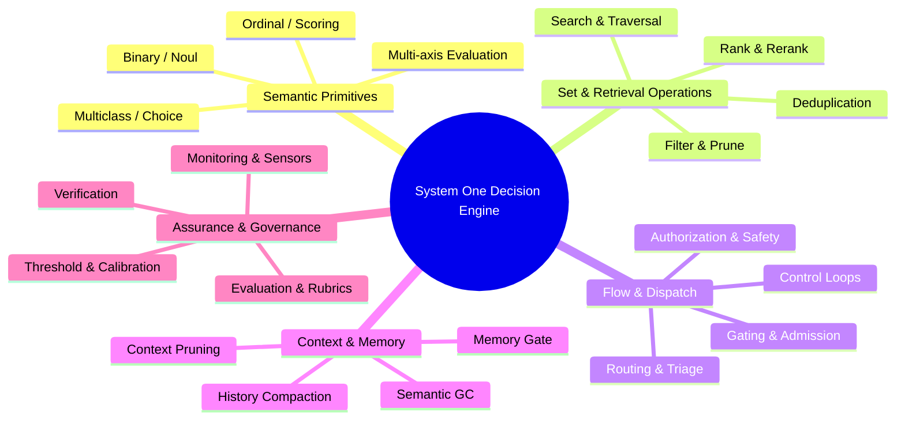
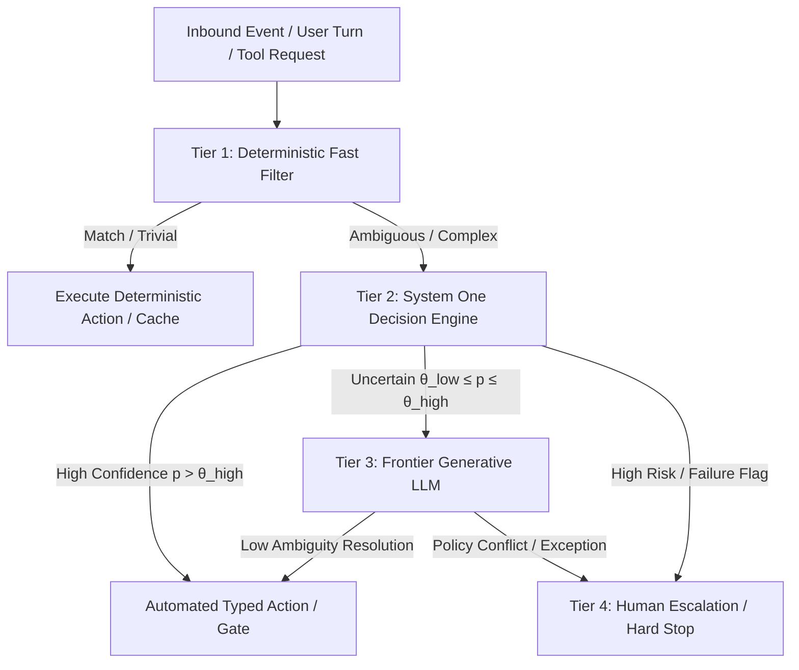

# System One (Jev) Decision Model Taxonomy & TIED Operator Opportunities

| Field | Value |
| --- | --- |
| **Purpose** | Comprehensive reference taxonomy of System One (Jev) decision models, underlying decision algebra, and systematic mapping to existing LLM tasks across TIED agent workflows. |
| **Audience** | AI agent developers, TIED systems architects, and harness engineers designing fast, bounded judgment layers. |
| **Traceability** | [REQ-TIED_JEV_DECISION_COPROCESSOR](../../tied/requirements/REQ-TIED_JEV_DECISION_COPROCESSOR.yaml) · [ARCH-TIED_JEV_DECISION_COPROCESSOR](../../tied/architecture-decisions/ARCH-TIED_JEV_DECISION_COPROCESSOR.yaml) · [IMPL-TIED_JEV_DECISION_COPROCESSOR](../../tied/implementation-decisions/IMPL-TIED_JEV_DECISION_COPROCESSOR.yaml) |
| **Related Docs** | [`docs/comparisons/jev-for-tied-improvement.md`](jev-for-tied-improvement.md) · [`tied/vocab/decision-copilot.md`](../../tied/vocab/decision-copilot.md) · [`working/REQ-TIED_JEV_DECISION_COPROCESSOR/PLAN.md`](../../working/REQ-TIED_JEV_DECISION_COPROCESSOR/PLAN.md) |
| **Status** | Canonical reference (2026-09-29) |

---

## 1. Executive Summary & Core Abstraction

### What System One Is

System One models (exemplified by TypeSafe Jev) are **not** general-purpose generative LLMs. They do not generate prose, write code, repair malformed JSON, or engage in unbounded conversational dialogue. Instead, a System One model functions as a **bounded semantic decision engine**:

$$\text{Compact State} + \{\text{Typed Questions}\} \xrightarrow{\text{Single Speculative Pass}} \{\text{Typed Judgments} + \text{Calibrated Probabilities}\}$$

Application state enters; one or more typed judgments (`choice`, `score`, `noul`) return with calibrated probabilities in a single sub-second network call; ordinary deterministic code decides what actions, branches, or escalations to execute based on those judgments.

### Why This Matters for Agent Systems

Modern frontier LLM agents (e.g. Claude 3.5/3.7, GPT-4o/o3, Gemini 1.5/2.0) spend a large fraction of their execution time, token budgets, and latency on **narrow, closed-vocabulary classifications**:
- "Which tool should be called next?"
- "Is this terminal output safe to execute?"
- "Does this test failure indicate an environmental error or a regression?"
- "Which vocabulary glossary is relevant to this user prompt?"
- "Has this checklist step satisfied its evidence requirements?"

Running a 200B+ frontier generative model with multi-second time-to-first-token (TTFT) and high token cost to answer a discrete boolean or 5-way categorical question introduces unnecessary latency, operational expense, non-deterministic drift, and fragile JSON schema parsing loops.

System One decision models offload these bounded semantic evaluations into sub-second, typed, parallel judgments, allowing frontier LLMs to concentrate exclusively on generative tasks (code authoring, detailed reasoning, architecture design) where open-ended synthesis is truly required.

---

## 2. The Decision Algebra & Core Lexicon

Nearly all applications across operating systems, agent supervision, security, search, databases, and workflow orchestration decompose into a compact six-operator decision algebra:

### The Six Algebraic Operations

1. **Judge**
   $$\text{state} \to \{\text{boolean} \mid \text{category} \mid \text{score}\} + \text{probability}$$
   The atomic semantic operation mapping unstructured or semi-structured state to a discrete, probability-bearing judgment.
2. **Transform a Collection**
   $$\text{items} \to \text{judge}(\text{each}) \to \text{filter} \mid \text{rank} \mid \text{group} \mid \text{select}$$
   Applying semantic judgment across sets to reorder, partition, prune, or bucket items without altering item contents.
3. **Control a Program**
   $$\text{state} \to \text{judge} \to \text{branch}$$
   Evaluating semantic preconditions to direct control flow in conventional software.
4. **Control a Sequence**
   $$\text{observe} \to \text{enumerate legal actions} \to \text{judge} \to \text{act} \to \text{observe}$$
   Closed-loop progression where code defines the legal action space and System One selects the next action, producing long-horizon emergent behavior from local bounded decisions.
5. **Control Uncertainty**
   $$\text{judge} \to \text{confident} \;?\; \text{automate} : \text{defer} / \text{escalate}$$
   Using calibrated probability directly as an engineering control signal to define explicit abstention, human escalation, or dual-model cascade policies.
6. **Control Expensive Intelligence**
   $$\text{cheap deterministic work} \to \text{System One judgment} \to \text{selectively invoke expensive LLM}$$
   Guarding frontier model invocations so heavy reasoning is spent only when ambiguity or complexity warrants it.

### The 27 Top-Level Decision Verbs

Rather than cataloging by industry domain, System One capabilities are organized across 27 canonical action verbs:

$$\begin{matrix}
\textbf{classify} & \textbf{detect} & \textbf{score} & \textbf{compare} & \textbf{match} \\
\textbf{filter} & \textbf{rank} & \textbf{select} & \textbf{route} & \textbf{gate} \\
\textbf{authorize} & \textbf{prioritize} & \textbf{verify} & \textbf{diagnose} & \textbf{triage} \\
\textbf{allocate} & \textbf{escalate} & \textbf{abstain} & \textbf{supervise} & \textbf{navigate} \\
\textbf{control} & \textbf{curate} & \textbf{remember} & \textbf{prune} & \textbf{monitor} \\
\textbf{compose} & \textbf{evaluate} & \textbf{calibrate} & & 
\end{matrix}$$

---

## 3. The 40 System One Decision Patterns

Below is the comprehensive taxonomy of bounded semantic decision patterns cataloged across current System One implementations.

### Pattern 1: Primitive Semantic Judgments
- **Binary judgment (`noul`)**: Does condition $X$ hold for given state?
- **Multiclass classification (`choice`)**: Which single label from a closed set applies?
- **Ordinal classification (`score`)**: Position on an ordered qualitative scale (e.g. *negligible / low / moderate / high / critical*).
- **Numeric or bounded scoring**: Assign a scalar value against an explicit criteria rubric.
- **Multi-axis scoring**: Evaluate the same entity across independent dimensions simultaneously via speculative fan-out.
- **Multi-label detection**: Query multiple independent boolean properties of a single entity in parallel.
- **Candidate selection**: Choose the best element from an explicitly supplied candidate array.
- **Candidate matching**: Determine which target entity best corresponds to an incoming description.
- **Relationship classification**: Determine the semantic link between two entities (*identical / related / unrelated / conflicting / superseding*).
- **Pairwise comparison**: Determine which of two candidates better satisfies a stated requirement.
- **Evidence judgment**: Assess whether supplied excerpt $E$ constitutes sufficient factual support for claim $C$.
- **Semantic predicate**: Treat natural language criteria as a deterministic boolean condition inside application code.

### Pattern 2: Set and Collection Operations
- **Filter**: Retain or discard items based on semantic criteria.
- **Rank**: Compute comparative scores and order elements.
- **Rerank**: Reorder initial candidate retrievals produced by lexical or embedding methods.
- **Top-k selection**: Extract the most pertinent subset within an items collection.
- **Threshold selection**: Retain items whose probability or score exceeds an empirical boundary.
- **Prioritization**: Determine processing queue sequence according to semantic urgency.
- **Semantic grouping**: Cluster records into conceptual groups defined by criteria.
- **Semantic bucketing**: Partition records into operational buckets (e.g. *immediate / deferred / discarded*).
- **Curation**: Keep, discard, or flag records for human review.
- **Deduplication judgment**: Semantic equivalence detection between records with divergent lexical representation.
- **Candidate-pair evaluation**: Generate candidate pairs algorithmically, then judge semantic compatibility per pair.
- **Semantic sorting**: Order database records by semantic relevance rather than literal column sorting.
- **Batch labeling**: Rapidly classify large volumes of records using high-throughput typed endpoints.
- **Selective annotation**: Apply metadata tags only to records satisfying semantic criteria.
- **Semantic SQL predicate**: Embed semantic judgment directly into query logic (`WHERE`, `ORDER BY`, `HAVING`).

### Pattern 3: Search and Information-Selection Operations
- **Semantic search**: Score candidate passages against an information query.
- **Retrieval filtering**: Eliminate false-positive passages returned by vector or keyword search.
- **Retrieval reranking**: Reorder retrieved chunks to maximize precision before LLM context packing.
- **Source selection**: Select which database, index, or API to query.
- **Search-strategy selection**: Choose between exact keyword search, semantic search, or graph traversal.
- **Time-range selection**: Determine the relevant historical window for time-series or log retrieval.
- **Query-tool selection**: Route queries to the optimal specialized search utility.
- **File selection**: Identify candidate source files likely to contain needed definitions or implementations.
- **Passage selection**: Extract the exact relevant section within a voluminous file.
- **Evidence localization**: Pinpoint the precise sentences providing factual support.
- **Graph traversal**: Select the next edge or node to follow during knowledge graph exploration.
- **Tree traversal**: Select the appropriate branch in hierarchical search spaces.
- **Hierarchical search**: Execute successive bounded selections when the total candidate space exceeds single-pass limits.
- **Test selection**: Identify which specific test suites are relevant to a given diff.
- **Skill selection**: Identify which installed agent skill is required for a user turn.
- **Tool selection**: Identify which specific MCP tool should execute a proposed action.

### Pattern 4: Routing and Dispatch
- **Request routing**: Direct an incoming user turn to the appropriate subsystem.
- **Workflow routing**: Choose the next procedural step in a multi-stage workflow.
- **Agent routing**: Select which specialized subagent receives a delegated task.
- **Tool routing**: Map an abstract intent to a specific tool implementation.
- **Model routing**: Select between model families based on task domain.
- **Model-tier routing**: Route simple tasks to fast models and complex tasks to frontier models.
- **Reasoning-effort routing**: Select low vs high reasoning effort (thinking budget).
- **Speed/quality-mode routing**: Toggle between latency-optimized and quality-optimized pipelines.
- **Service routing**: Choose the target backend or provider.
- **Human vs automation routing**: Direct high-confidence tasks to automation and low-confidence tasks to human operators.
- **Specialist vs generalist routing**: Route domain-specific queries to fine-tuned or prompt-specialized agents.
- **Local vs remote processing routing**: Determine if processing can occur locally or requires cloud infrastructure.
- **Generation vs non-generation routing**: Determine whether an LLM call is needed at all or if a deterministic handler suffices.
- **Simple-vs-complex request routing**: Handle common patterns via deterministic scripts; escalate novel variations.

### Pattern 5: Gating and Admission Control
- **Allow/deny gate**: Binary permission for incoming requests.
- **Proceed/stop gate**: Pipeline execution checkpoint.
- **Accept/reject gate**: Ingestion checkpoint for artifacts or contributions.
- **Publish/do-not-publish gate**: Public release checkpoint.
- **Execute/do-not-execute gate**: Execution safety check prior to script or binary runs.
- **Install/do-not-install gate**: Package or dependency admission check.
- **Forward/drop gate**: Stream network packet or message filter.
- **Keep/prune gate**: Cache and context eviction gate.
- **Approve/review gate**: Automated approval vs human review queue.
- **Automatic/manual gate**: Autopilot execution vs user-confirmation requirement.
- **Deploy/do-not-deploy gate**: CI/CD staging gate.
- **Pass/fail quality gate**: Quality standard validation prior to phase transition.
- **Completion gate**: Verifying whether a task meets completion definitions before declaring done.
- **Evidence gate**: Assessing whether required factual evidence exists before advancing.
- **Confidence gate**: Enforcing strict probability cutoffs for unattended execution.
- **Compound gate**: Combining multiple parallel boolean judgments into a code-owned composite decision.

### Pattern 6: Authorization and Safety Control
- **Tool-call authorization**: Assessing proposed tool arguments for authorization compliance.
- **Command-risk assessment**: Evaluating shell command strings for destructive potential (`rm -rf`, disk wipes, network leaks).
- **Operation-risk assessment**: Scoring proposed file operations for blast radius and recovery difficulty.
- **User-intent consistency checking**: Validating that an agent's proposed action strictly reflects the user's prompt.
- **Policy compliance checking**: Verifying alignment with corporate or operational guidelines.
- **Rule compliance checking**: Checking adherence to static coding standards or project rules.
- **Scope/boundary checking**: Verifying that proposed modifications remain within declared change boundaries.
- **Prompt-injection detection**: Identifying adversarial hijacking attempts in external inputs.
- **Malicious-content detection**: Detecting harmful payloads or offensive text.
- **Malware/supply-chain risk judgment**: Evaluating third-party packages or scripts for supply-chain risks.
- **Spam/scam detection**: Flagging unsolicited or fraudulent messages.
- **Phishing judgment**: Evaluating links or communication for credential-harvesting indicators.
- **Abuse detection**: Monitoring API usage for platform abuse patterns.
- **Profanity/content moderation**: Classifying content against safety standards.
- **PII detection**: Identifying personal data requiring redaction.
- **Secret/credential detection**: Detecting accidental inclusion of API keys, tokens, or private certificates.
- **Sensitivity classification**: Categorizing data according to privacy tiers (Public, Internal, Confidential, Restricted).
- **Threat categorization**: Labeling security events by MITRE ATT&CK or custom threat taxonomies.
- **Risk severity scoring**: Assigning scalar risk scores to detected security anomalies.
- **Vulnerability attribute selection**: Mapping vulnerability descriptions to CWE categories.
- **Streaming output gate**: Inspecting streaming tokens in real time and aborting on policy violation.
- **Action-chain assessment**: Evaluating the compound safety of an action sequence rather than isolated steps.

### Pattern 7: Agent Control-Flow Decisions
- **Next-action selection**: Choosing the next step from an enumerated legal action set.
- **Continue/stop decision**: Evaluating whether agent iteration should continue.
- **Goal-completed decision**: Determining whether the high-level objective has been achieved.
- **Stuck/not-stuck detection**: Identifying repetitive action loops or lack of progress.
- **On-track/off-track judgment**: Verifying that intermediate work aligns with the user request.
- **Recovery-needed decision**: Detecting an error state requiring strategy alteration.
- **Recovery-path selection**: Selecting which recovery maneuver to initiate.
- **Retry/escalate/abort selection**: Triaging execution errors.
- **Handoff decision**: Determining when a subagent should return control to the orchestrator.
- **Handoff-target selection**: Selecting which peer agent is suited for the next phase.
- **Subagent invocation decision**: Determining whether a task warrants spawning a child agent.
- **Tool-needed decision**: Deciding whether an external tool is required or internal knowledge suffices.
- **Verification-needed decision**: Determining whether an output requires automated testing before submission.
- **More-information-needed decision**: Detecting when user clarification is mandatory.
- **Human-intervention-needed decision**: Flagging edge cases requiring human judgment.
- **Accept/reject worker output**: Evaluating subagent deliverables before integrating into the main thread.
- **Supervisor judgment over another agent**: Independent audit of an agent's reasoning by a fast observer.

### Pattern 8: Closed-Loop Control
- **Observe $\to$ choose $\to$ execute $\to$ observe loop**: Foundational loop for autonomous interaction.
- **Browser navigation control**: Selecting DOM click/input actions from interactable elements.
- **Desktop/UI control**: Selecting operating system UI actions from screen state.
- **Mobile-device control**: Directing touch and gesture inputs on mobile interfaces.
- **Game control**: Selecting tactical maneuvers in simulated environments.
- **Robot action selection**: Selecting kinematic primitives in physical or simulated robotics.
- **Vehicle/path selection**: Choosing navigation trajectories based on obstacle state.
- **Movement selection**: Directing directional navigation in grid or continuous spaces.
- **Target selection**: Prioritizing focus targets in dynamic environments.
- **Speed selection**: Modulating execution pace or throttling based on environmental feedback.
- **Resource/yield decision**: Balancing compute consumption against time budgets.
- **Scheduling/order selection**: Selecting the next job in asynchronous execution queues.
- **Real-time or near-real-time control policy**: High-frequency decision making where millisecond latency is mandatory.
- **Action verification after execution**: Assessing immediate post-execution state to confirm action success.

### Pattern 9: Context and Memory Management (Semantic GC)
- **Context relevance scoring**: Assigning utility scores to previous conversation turns or tool outputs.
- **Keep/drop context decision**: Binary decision to retain or evict context chunks.
- **Context compaction by selection**: Pruning low-value turns rather than running expensive lossy summarization.
- **Tool-output pruning**: Retaining only critical diagnostic lines from voluminous tool logs (e.g. compiler outputs).
- **Conversation-history pruning**: Removing obsolete back-and-forth turns when tasks conclude.
- **Log filtering**: Extracting salient events from diagnostic logs prior to LLM injection.
- **Skill-description pruning**: Loading only skill documentation relevant to active intents.
- **Freshness-aware context selection**: Deprecating stale observations in favor of recent state.
- **Memory admission**: Determining whether an interaction constitutes durable long-term memory.
- **Memory rejection**: Discarding ephemeral details from long-term memory storage.
- **Memory recall selection**: Identifying which stored memory records are pertinent to the current turn.
- **Memory conflict detection**: Identifying contradictions between newly observed state and stored knowledge.
- **Relevant-history selection**: Selecting relevant past sessions from agent transcript archives.
- **Verbatim evidence preservation**: Retaining exact literal proof snippets while pruning commentary.
- **Context-budget allocation**: Distributing available context window tokens across prompt sections.

### Pattern 10: Triage
- **Incident triage**: Categorizing incoming operational outages by severity and component.
- **Issue triage**: Routing bug reports to appropriate product teams.
- **Support-request triage**: Categorizing customer tickets by urgency and topic.
- **Review-finding triage**: Categorizing static analysis or security review findings into genuine vs noisy.
- **Test-failure triage**: Distinguishing environmental failures, flaky tests, and legitimate code regressions.
- **Log/event triage**: Separating operational noise from critical system warnings.
- **Alert triage**: De-duplicating and prioritizing telemetry alerts.
- **Document triage**: Categorizing incoming documents for workflow routing.
- **Research-paper/screening triage**: Rapidly filtering scientific papers during systematic literature reviews.
- **Candidate/job/application screening**: Screening applications against mandatory qualifications.
- **High-confidence automatic handling with low-confidence human review**: The core triage architecture.
- **Priority assignment**: Tagging items with P0/P1/P2/P3 severity.
- **Owner/team assignment**: Matching items to responsible functional owners.

### Pattern 11: Verification
- **Claim verification against supplied evidence**: Checking if a claim is factually justified by evidence.
- **Requirement-satisfaction verification**: Verifying that implemented code satisfies specification clauses.
- **Goal-completion verification**: Checking that the user's initial prompt has been satisfied.
- **Result-validity verification**: Sanity-checking tool output before acting upon it.
- **Tool-result verification**: Assessing if a tool executed cleanly or failed silently.
- **Action-result verification**: Validating that an expected file or database state change occurred.
- **Change-intent verification**: Verifying that a proposed code patch matches stated refactoring intent.
- **Rule-compliance verification**: Checking that code changes satisfy architectural invariants.
- **Generated-answer evidence verification**: Auditing LLM answers for hallucinated citations.
- **Draft quality verification**: Pre-flight checks on drafts prior to external submission.
- **Cross-checking another model's answer**: Using System One as an independent sanity checker on LLM generation.
- **Checking whether a proposed finding is genuine**: Validating candidate security findings against source.
- **Checking whether an agent really performed the claimed work**: Auditing git diffs against agent self-reports.

### Pattern 12: Evaluation and Rubric Application
- **Single-rubric evaluation**: Scoring an artifact against one specific qualitative criterion.
- **Multi-rubric scorecard**: Evaluating an artifact across multiple orthogonal rubrics simultaneously.
- **Quality scoring**: Assigning scalar scores for workmanship or technical quality.
- **Clarity scoring**: Evaluating readability and coherence.
- **Tone scoring**: Assessing communication tone (professional, defensive, empathetic).
- **Relevance scoring**: Evaluating how well a response answers the input query.
- **Significance scoring**: Determining whether an event or finding represents a major impact.
- **Risk scoring**: Scoring exposure to operational, legal, or security risk.
- **Readiness scoring**: Evaluating whether a branch or release is ready for deployment.
- **Compatibility scoring**: Assessing API or architectural backward compatibility.
- **Fit/match scoring**: Scoring suitability for a defined role or scenario.
- **Importance scoring**: Ranking items by business or architectural value.
- **Diagnostic-value scoring**: Evaluating whether a log statement provides actionable diagnostic insight.
- **Confidence-aware evaluation**: Modulating evaluation scores by the model's reported certainty.
- **Candidate evaluation followed by deterministic disposition**: Scoring options, then using code to execute thresholds.

### Pattern 13: Quality Assurance and Review
- **Code-review finding generation-by-selection**: Identifying defect types from an enumerated catalog.
- **PR/change classification**: Categorizing pull requests (e.g. *bugfix, refactor, feature, chore, docs, security*).
- **Commit classification**: Categorizing commits according to conventional commit specifications.
- **Diff assessment**: Assessing whether a diff contains dangerous modifications or hidden scope creep.
- **UI QA judgment**: Judging screenshot rendering against visual design specifications.
- **E2E test-action selection**: Choosing next interactive steps during automated GUI exploration.
- **Test-result judgment**: Evaluating whether test outputs reflect valid behavior or test harness artifacts.
- **Review lead prioritization**: Ordering code review comments so critical issues are addressed first.
- **Potential defect filtering**: Pruning static analysis false alarms.
- **Design-option assessment**: Scoring competing technical proposals against established criteria.
- **Debugging-hypothesis assessment**: Scoring competing root-cause hypotheses against observed symptoms.
- **Acceptance-condition checking**: Verifying that each acceptance test criterion has been exercised.

### Pattern 14: Diagnosis
- **Failure-type classification**: Categorizing errors into syntax, type, runtime, network, or permission errors.
- **Failure-cause selection**: Selecting the root cause from a pre-defined taxonomy of failure modes.
- **Likely-root-cause prioritization**: Ranking debugging hypotheses to guide investigation.
- **Debugging-hypothesis ranking**: Ordering investigative steps by probability of resolving an anomaly.
- **Anomaly classification**: Categorizing performance or telemetry outliers into known fault classes.
- **Operational-state diagnosis**: Determining whether a system is normal, degraded, recovering, or deadlocked.
- **"Needs intervention" detection**: Spotting states where automatic recovery has stalled.
- **Suggested recovery-category selection**: Choosing between restart, retry, rollback, or cache invalidation.

### Pattern 15: Monitoring and Observability
- **Event significance judgment**: Tagging stream events with operational significance.
- **Log relevance judgment**: Filtering out high-frequency repetitive logs to surface critical signals.
- **Diagnostic-value labeling**: Labeling traces with diagnostic categories to facilitate downstream search.
- **Event priority scoring**: Dynamically scoring telemetry events for priority alerting.
- **Event routing**: Directing events to specific Kafka topics, Sentry projects, or PagerDuty schedules.
- **Trace assessment**: Evaluating distributed trace spans for architectural anti-patterns.
- **Agent-behavior monitoring**: Tracking agent actions in real time for policy deviations.
- **Continuous policy checking**: Continuously validating that active processes comply with security baselines.
- **Decision journaling**: Logging every System One judgment, input hash, and probability to an immutable ledger.
- **Semantic sensors**: Converting unstructured system metrics or logs into discrete, typed virtual sensor states.

### Pattern 16: Resource Allocation and Optimization
- **Choose cheapest adequate model**: Routing queries to small, medium, or large models based on task complexity.
- **Choose amount of reasoning effort**: Setting thinking budgets (shallow vs deep) based on problem difficulty.
- **Choose whether expensive reasoning is warranted**: Skipping heavy reasoning when tasks are standard.
- **Choose whether an LLM call can be skipped entirely**: Satisfying queries from cache or templates.
- **Choose which subset of context to spend tokens on**: Allocating prompt budgets to high-utility context slices.
- **Choose which tests to spend compute on**: Running only test suites relevant to modified code.
- **Choose which records deserve deeper analysis**: Filtering large datasets before submitting to deep analysis.
- **Choose which candidate deserves an expensive second-stage evaluation**: Stage 1 screening before Stage 2 LLM analysis.
- **Semantic compiler/optimizer decisions**: Selecting optimization passes based on code characteristics.
- **Select a processing depth or quality tier**: Dynamically selecting minimal, standard, or comprehensive processing.

### Pattern 17: Escalation and Cascades
- **Fast model $\to$ expensive model on uncertainty**: Invoking frontier LLMs only when System One confidence is low.
- **Rules $\to$ System One only for ambiguous cases**: Deterministic regex/rules first; System One resolves boundary cases.
- **System One $\to$ human on uncertainty**: Routing confident cases to automation; flagging ambiguous cases for human review.
- **System One $\to$ deep model for disagreement/review**: Using deep models as an appeals court when observers disagree.
- **Cheap model $\to$ System One supervisor $\to$ expensive model**: Tri-level execution and oversight architecture.
- **Multiple decision stages of increasing cost**: Cascading filters with progressively tighter criteria and higher compute cost.
- **Prefilter $\to$ semantic judge $\to$ deterministic action**: Standard architectural pattern for high-throughput pipelines.
- **Broad retrieval $\to$ System One reranking $\to$ deep reading**: Multi-stage information retrieval architecture.

### Pattern 18: Abstention and Uncertainty Management
- **Explicit uncertain branch**: Modeling uncertainty as a first-class branch in control flow.
- **Do nothing below confidence threshold**: Refusing automated action unless probability exceeds safety thresholds.
- **Defer to human**: Creating human-in-the-loop work items when confidence is intermediate.
- **Defer to larger model**: Escalating to frontier models when System One reports high entropy.
- **Collect more evidence**: Triggering additional telemetry or search queries when state is ambiguous.
- **Retain rather than discard uncertain records**: Conservatively preserving ambiguous records during pruning.
- **Fail open**: Permitting operations when uncertainty is acceptable and availability is prioritized.
- **Fail closed**: Blocking operations when uncertainty touches high-security boundaries.
- **Request verification**: Triggering an automated test run when confidence in a patch is borderline.
- **Conservative batch policy**: Flagging an entire batch for review if any single element falls below the certainty cutoff.

### Pattern 19: Semantic Decomposition of a Complex Decision
- **Break one vague decision into several independent binary judgments**: Decomposing monolithic reviews into parallel nouls.
- **Break into several scored dimensions**: Evaluating quality across clarity, correctness, and security separately.
- **Combine boolean and score questions**: Using nouls for hard constraints and scores for optimization criteria.
- **Evaluate all dimensions in parallel**: Leveraging speculative fan-out to obtain all criteria in one round-trip.
- **Apply deterministic formulas/rules afterward**: Combining component probabilities mathematically in local code.
- **Use one dimension to determine whether another matters**: Conditional branching across decision dimensions.
- **Construct a decision matrix from model outputs**: Populating multi-criteria decision tables deterministically.

### Pattern 20: Hierarchical Decision Making
- **First choose a broad category**: Coarse classification to narrow the candidate universe.
- **Then choose a candidate within that category**: Fine-grained selection from a bounded sub-array.
- **Repeatedly narrow a large action space**: Multi-tier trees overcoming the 255-choice limit of single-question APIs.
- **Traverse menus, taxonomies, graphs, or component libraries**: Navigating deep hierarchies via bounded choices.
- **Circumvent finite-choice limits**: Structuring decision trees to handle thousands of candidate options.

### Pattern 21: Planning by Repeated Local Decisions
- **Code retains the overall objective**: Application code maintains goal state, invariant constraints, and execution logs.
- **Compute currently legal alternatives**: Code computes the legal action set for the current state.
- **Ask the decision model for the best local choice**: System One selects the next local maneuver.
- **Execute action**: Application code runs the selected action.
- **Recompute state**: State updates based on environment feedback.
- **Repeat until goal is achieved**: Emergent long-horizon problem solving without speculative generative planning.

### Pattern 22: Selection-Based Construction
- **UI construction**: Selecting UI component types and layouts from a design system library.
- **Music construction**: Selecting chord progressions, instruments, and rhythm patterns.
- **Workflow construction**: Selecting sequential workflow stages from a predefined catalog of steps.
- **Document/layout construction**: Assembling templates and sections from predefined modules.
- **Configuration construction**: Selecting configuration settings through successive bounded choices.
- **Emoji/icon selection**: Selecting appropriate graphical iconography for UI labels.
- **Style/property selection**: Choosing CSS classes or stylistic themes from a design palette.
- **Parameter selection from legal values**: Choosing optimal hyperparameters from valid ranges.

### Pattern 23: Generation-Adjacent Judgment
- **Judge a generated draft**: Evaluating an LLM-authored text draft against tone or style rules.
- **Label a generated scene/state**: Categorizing synthetic scenarios generated by an agent.
- **Select whether generation is required**: Deciding whether an inbound turn can be answered with a static snippet.
- **Choose the model that should generate**: Selecting which frontier model is best suited for the authoring task.
- **Choose generation policy/style**: Selecting parameters (temperature, system prompt profile) before generation.
- **Review generated content before release**: Pre-release safety and quality gating of frontier LLM responses.
- **Judge whether generated content satisfies requirements**: Cross-checking LLM code against technical specs.
- **Select among several generated alternatives**: Generating $N$ candidate completions and using System One to select the best.

### Pattern 24: Constrained Generation through Repeated Decisions
- **Word-by-word choice**: Selecting the next token from an allowed vocabulary set.
- **Phrase-by-phrase choice**: Assembling structured responses by selecting from pre-authored phrase fragments.
- **Token/candidate-sequence selection**: Controlled text generation restricted to formal grammar tokens.
- **Semantic feature vector $\to$ deterministic language renderer**: System One outputs structured traits; code generates text.
- **Repeated candidate selection until termination**: Iterative selection loop until an explicit `STOP` option is chosen.

### Pattern 25: Conversation-State Decisions
- **Intent classification**: Mapping user turns to functional intents.
- **Emotion/state classification**: Assessing user sentiment or frustration levels.
- **Topic-change detection**: Detecting conversational context shifts.
- **Turn-ending detection**: Assessing whether a user has finished their input.
- **Command vs conversation routing**: Separating operational execution requests from casual chat.
- **Response-policy selection**: Choosing whether a response should be concise, exhaustive, or step-by-step.
- **Simple-service vs conversational-model routing**: Routing basic questions to static FAQs.
- **Sensitive-content detection during conversation**: Flagging security, compliance, or safety issues during chat turns.

### Pattern 26: Event and Stream Processing
- **Judge each event independently**: High-throughput stateless semantic evaluation.
- **Judge sliding windows**: Evaluating temporal patterns across event sequences.
- **Route events according to semantics**: Directing event streams to specialized consumer queues.
- **Drop low-value events**: Dropping repetitive or uninformative log events at the ingestion boundary.
- **Interrupt a stream when a condition emerges**: Aborting real-time streaming if policy violations are detected.
- **Enrich each event with semantic labels/scores**: Appending semantic metadata to event envelopes.
- **Trigger downstream workflows when thresholds are crossed**: Automating incident response on high-confidence alerts.
- **Semantic admission control at edge/gateway**: Gating ingress requests at API gateways before backend propagation.

### Pattern 27: Matching and Recommendation
- **Object-to-object fit**: Assessing semantic compatibility between two records.
- **Requirement-to-candidate fit**: Scoring a candidate's qualifications against job requirements.
- **Person/task/resource matching**: Assigning incoming tasks to personnel with optimal skill profiles.
- **Part/component matching**: Matching spare parts or software modules to technical specifications.
- **Document/query matching**: High-precision matching of technical documents to operator questions.
- **Resume/job matching**: Ranking applicant resumes against job requisitions.
- **Candidate recommendation**: Recommending next actions or items to users.
- **Next-best candidate selection**: Selecting secondary fallbacks when primary candidates are unavailable.

### Pattern 28: Temporal and State-Change Judgments
- **Did an important state transition occur?**: Distinguishing cosmetic output shifts from structural system transitions.
- **Is a condition still true?**: Validating that an earlier invariant has not been invalidated by subsequent actions.
- **Has something remained in an undesirable state too long?**: Flagging hung processes or stalled compilations.
- **Is the current observation materially different from the prior one?**: Detecting meaningful progress in iterative loops.
- **Is action now warranted?**: Assessing whether accumulated telemetry warrants intervention.
- **Has the process reached a terminal state?**: Detecting clean completion or irrecoverable failure.

### Pattern 29: Policy Implementation
- **Encode policy dimensions as typed questions**: Translating governance documents into explicit boolean/choice maps.
- **Evaluate observed state against policy dimensions**: Testing application states against policy question sets.
- **Keep threshold and policy composition outside the model**: Deterministic code enforces the policy matrix.
- **Version the policy separately from the model**: Updating policy thresholds in code without model retraining.
- **Combine deterministic rules with semantic judgments**: Rules enforce syntax; System One enforces semantics.
- **Produce exact machine actions from the resulting policy matrix**: Generating deterministic API calls from evaluations.

### Pattern 30: Human-Review Augmentation
- **Rank what a person should inspect**: Sorting audit queues by probability of defect.
- **Highlight probable problems**: Pinpointing the exact lines or clauses requiring scrutiny.
- **Suppress obvious non-problems**: Auto-approving trivial changes to reduce reviewer fatigue.
- **Supply probabilities alongside findings**: Providing calibrated confidence scores to inform human judgment.
- **Show supporting source/evidence**: Pairing each finding with localized evidence citations.
- **Separate confident decisions from ambiguous ones**: Automating clear cases; reserving human attention for edge cases.
- **Recommend approval while preserving human authority**: Advisory recommendations requiring human sign-off.
- **Construct review queues**: Segmenting review queues by domain specialization.

### Pattern 31: Shadow Judgment
- **Run the model without affecting production behavior**: Running System One in parallel with existing logic.
- **Compare its decision to existing rules**: Benchmarking System One decisions against legacy regex or heuristics.
- **Compare it to another model**: Running System One against frontier LLMs on identical inputs.
- **Collect disagreement cases**: Logging divergence instances for analysis and prompt tuning.
- **Estimate whether it could safely assume a decision role later**: Measuring potential precision and recall.
- **Evaluate alternative policy thresholds offline**: Simulating different cutoffs on historical logs.

### Pattern 32: Benchmarking and Model Evaluation
- **Accuracy measurement**: Evaluating classification correctness against gold-standard fixture sets.
- **Calibration measurement**: Measuring expected calibration error (ECE) to verify probability reliability.
- **Latency measurement**: Benchmarking p50, p95, and p99 response times.
- **Cost measurement**: Tracking dollar costs per thousand judgments compared to generative calls.
- **Threshold evaluation**: Calculating receiver operating characteristic (ROC) curves across thresholds.
- **Selective-automation evaluation**: Measuring accuracy as a function of coverage (automation rate).
- **Error analysis by question type**: Diagnosing whether errors cluster in `noul`, `score`, or `choice` questions.
- **Model-vs-model comparison**: Benchmarking newer model pins against historical releases.
- **Decision-question comparison**: Comparing prompt phrasing formulations to optimize question clarity.
- **Probability-distribution inspection**: Detecting overconfidence or uncalibrated entropy spikes.
- **Failure-mode analysis**: Identifying edge cases causing model misclassification.

### Pattern 33: Production-Contract Testing
- **Save representative states/questions**: Storing production inputs and questions in versioned fixture files.
- **Save expected decisions or acceptable ranges**: Defining expected choice outputs or probability bands.
- **Compare a new model version against the fixture set**: Running regression suites before updating `JEV_MODEL`.
- **Detect semantic regressions**: Catching shifts in interpretation between model releases.
- **Detect probability changes that alter thresholds**: Identifying calibration drift that would affect threshold behavior.
- **Treat the decision model like another versioned dependency**: Enforcing contract testing for AI dependencies.

### Pattern 34: Calibration and Threshold Engineering
- **Measure probabilities against labeled examples**: Plotting empirical accuracy against predicted probabilities.
- **Select action thresholds empirically**: Setting operating points based on cost-matrix tradeoffs.
- **Maintain different thresholds for different consequences**: Strict thresholds for destructive actions; relaxed for logging.
- **Define an uncertainty region**: Implementing dual-threshold bands ($p < \theta_{\text{low}}$ reject, $p > \theta_{\text{high}}$ accept, intermediate escalate).
- **Tune false-positive vs false-negative behavior**: Shifting operating points based on risk appetite.
- **Re-evaluate thresholds when models or data distributions change**: Updating threshold constants upon model upgrades.

### Pattern 35: Model Drift and Change Detection
- **Periodically rerun fixed examples**: Scheduled cron runs of standard prompt fixtures.
- **Compare category distributions**: Detecting shifts in categorical output frequencies over time.
- **Compare score distributions**: Monitoring drift in mean and variance of score outputs.
- **Compare calibration**: Verifying that 90% confidence continues to represent 90% accuracy.
- **Detect threshold crossings caused by model changes**: Flagging when background vendor updates alter system behavior.
- **Decide whether production policy needs adjustment**: Updating code thresholds in response to measured drift.

### Pattern 36: Distillation and Replacement Analysis
- **Collect repeated System One input/output examples**: Building a dataset of production questions and judgments.
- **Train or configure a cheaper/local specialized model**: Training lightweight local classifiers (e.g. SetFit, DeBERTa, GGUF).
- **Compare in shadow mode**: Running the local model in parallel with the System One API.
- **Determine where the specialized model is interchangeable**: Identifying tasks safe for local execution.
- **Retain System One as fallback for uncertain cases**: Hierarchical cascade from local model $\to$ System One $\to$ Frontier LLM.

### Pattern 37: Decision Caching
- **Cache stable judgments**: Caching model outputs keyed by hash of (state, question map, model pin).
- **Reuse scores/classifications for unchanged objects**: Skipping model calls when underlying code or text is untouched.
- **Avoid repeated model calls in database/search pipelines**: Reusing judgments across iterative query loops.
- **Invalidate when relevant state changes**: Invalidating cache keys on file edits or git head updates.

### Pattern 38: Semantic Middleware
- **Place model between client and server**: Ingress validation and request normalization.
- **Place model between agent and tool**: Safety gating and parameter validation before tool execution.
- **Place model between LLM and user**: Output filtering and policy enforcement on generated responses.
- **Place model between retrieval and reasoning**: Reranking and pruning chunks before LLM ingestion.
- **Place model between generated result and execution**: Verifying code patches before applying to disk.
- **Place model between stream and consumer**: Real-time stream filtering and emergency interruption.
- **Place model between database candidate generation and query result**: Semantic SQL filtering middleware.

### Pattern 39: Semantic State Sensors
- **Convert complex raw state into small stable typed signals**: Distilling massive system logs into a simple status enum.
- **Publish signal as application state**: Exposing typed signals to message buses, Prometheus, or state machines.
- **Let conventional automation react to it**: Triggering shell scripts or CI actions based on semantic sensor readings.
- **Decouple observation from control**: System One acts purely as an observability probe without direct actuation.

### Pattern 40: Decision-Point Discovery and Design
- **Identify places currently using brittle heuristics**: Finding fragile regex or keyword string checks.
- **Identify expensive LLM calls whose outputs are bounded**: Converting JSON-generating LLM prompts to typed questions.
- **Identify human decisions that have a finite outcome vocabulary**: Mapping repetitive operator choices to System One.
- **Convert them to typed questions**: Formulating precise `choice`, `score`, and `noul` question schemas.
- **Compare question formulations**: A/B testing prompt phrasings to maximize discriminative power.
- **Design threshold and fallback behavior**: Establishing safe operating points and graceful failure modes.
- **Determine whether a model call is warranted at all**: Validating that deterministic code cannot solve the problem first.

---

## 4. Systematic Mapping to Existing LLM Tasks in TIED

Below is a detailed analysis of current tasks delegated to frontier LLMs across TIED methodologies and agent environments, identifying where System One models provide superior speed, lower cost, and tighter determinism.

| Existing Agent / LLM Task | Current Execution | System One Pattern | Input State | Output Type & Question | Expected Improvement |
| :--- | :--- | :--- | :--- | :--- | :--- |
| **Touchpoint 2: Vocabulary PRELOAD Routing** | Frontier LLM reads `routing.md` & reasons over matched glossaries | **Pattern 4** (Routing) & **Pattern 3** (Source selection) | Prompt text + table of candidate glossary descriptions | `choice`: glossary ID from allowed set (speculative fan-out across candidates) | **10x faster**, 0 token burn in main context; sub-second glossary loading. |
| **Touchpoint 1: Sponsor Intent RESOLVE** | Frontier LLM parses unstructured user phrasing to find preferred terms | **Pattern 1** (Candidate matching) & **Pattern 27** (Matching) | User prompt phrase + active vocabulary preferred terms | `choice`: canonical preferred term from candidate set | Eliminates naming drift; instant normalization to approved vocab. |
| **Prompt-Type Skill Dispatch** | User turn analyzed to select 1 of 13 skills (`plan-new-feature`, `build-plan`, etc.) | **Pattern 4** (Workflow/Agent routing) & **Pattern 1** (Multiclass) | Turn prompt + current repo state summary | `choice`: prompt-type skill identifier + confidence | Sub-second skill routing; eliminates frontier model turn for simple dispatch. |
| **Harness Live Tool Authorization** | Frontier LLM or human approves shell commands and file mutations | **Pattern 6** (Authorization & command risk) & **Pattern 5** (Allow/deny gate) | Proposed tool name + argument payload (redacted) | `noul`: is command destructive? `noul`: is command aligned with prompt? | **Instant safety block** on dangerous operations; prevents runaway rm/git commands. |
| **Context Window Semantic GC (Pruning)** | Frontier LLM ingests 50k tokens of compiler / test / git logs | **Pattern 9** (Semantic GC) & **Pattern 2** (Filter/prune) | Raw terminal / test runner output chunk | `score`: diagnostic value (1-5); `noul`: keep this line/block | **80-90% prompt token reduction**; strips noise before frontier LLM sees it. |
| **Checklist Step Evidence Sufficiency** | Frontier LLM checks if written evidence satisfies checklist gate | **Pattern 11** (Verification) & **Pattern 5** (Evidence gate) | Checklist criterion + submitted evidence excerpt | `noul`: evidence substantive? `noul`: tokens present? `score`: completeness (1-10) | Prevents premature checklist advancement; flags placeholder/fake evidence. |
| **IMPL Testability Classification** | Developer or LLM tags code paths as unit, composition, or E2E-only | **Pattern 1** (Multiclass) & **Pattern 13** (QA / test-action) | IMPL pseudo-code block + boundary description | `choice`: `unit` vs `composition` vs `e2e_only` | Enforces thin entry-point discipline; flags unauthorized E2E classifications. |
| **Test Suite Selection from Diff** | Developer or full CI executes entire test suite on small diffs | **Pattern 3** (Test selection) & **Pattern 2** (Filter/rank) | Git diff summary + test file descriptions | `noul` fan-out across test suites: relevant to this diff? | **Massive CI speedup**; runs only affected tests in local dev loops. |
| **Adversarial Inquiry Triage** | Frontier LLM analyzes code to spot fidelity divergences | **Pattern 10** (Triage) & **Pattern 11** (Finding verification) | Spec clause + code snippet + candidate divergence | `noul`: is divergence genuine? `choice`: failure category | Filters out false alarms; logs only credible findings for human audit. |
| **Conversation Adherence Monitoring** | Adherence checkers or human supervisors audit chat transcripts | **Pattern 15** (Agent monitoring) & **Pattern 6** (Rule compliance) | Latest assistant response turn | `noul`: acknowledged principles? `noul`: tokens cited? `noul`: summary omitted? | Real-time policy checking; immediate loop-back if agent skips rules. |
| **Residuality Stressor & Residue Sorting** | Architect classifies stressors and architectural residues | **Pattern 1** (Multi-axis scoring) & **Pattern 14** (Diagnosis) | Stressor description + architectural boundary | `choice`: internal vs external; `choice`: desirable vs harmful residue | Fast pre-sorting of residuality matrices before detailed analysis. |
| **Pre-Commit Git Hygiene & Token Parity** | Manual review or heavy script checking git diffs for token tags | **Pattern 6** (Boundary checking) & **Pattern 11** (Verification) | Git staged diff patch | `noul`: token missing in new function? `noul`: credential leak? | Hard stop at commit boundary before pushing non-compliant code. |
| **Model Tier & Reasoning Effort Routing** | Orchestrator decides whether to spawn thinking model vs fast model | **Pattern 4** (Model-tier routing) & **Pattern 16** (Resource allocation) | User prompt + task complexity context | `choice`: `fast_flash` vs `standard` vs `deep_thinking` | Optimizes cost/latency; avoids burning expensive reasoning tokens on trivia. |

---

## 5. High-Leverage Blueprints for Immediate TIED Adoption

### Blueprint A: Context Semantic Garbage Collection & Log Pruning (Pattern 9)

**Problem:** Terminal execution commands (e.g. `bun test`, `tsc -b`, `cargo build`, `npm run lint`) frequently emit 500 to 5,000 lines of output. When agents blindly inject this output into context, context windows fill up rapidly, leading to high token costs, degraded reasoning, and loss of earlier requirements from attention.

**System One Solution:**
Place a System One semantic filter in the execution stream:
1. Conventional code captures stdout/stderr.
2. If output is under 30 lines, pass through verbatim.
3. If output exceeds 30 lines, chunk into 10-line blocks.
4. Send chunks to Jev in one parallel speculative fan-out:
   - Question 1 (`noul`): "Does this block contain a fatal error, failed test, or compiler diagnostic?"
   - Question 2 (`noul`): "Is this block purely informational progress/boilerplate?"
5. Code retains only blocks where Question 1 $p > 0.40$ and Question 2 $p < 0.60$, plus 2 lines of surrounding context.
6. The pruned log (typically 15-40 lines containing the exact failure points) is returned to the agent.

**Benefit:** 80% to 95% reduction in terminal context consumption; sub-second processing; prevents agent distraction by repetitive passing test logs.

---

### Blueprint B: Prompt-Type Routing & Subagent Dispatch (Pattern 4)

**Problem:** In Cursor and agent workflows, routing a user prompt to the correct subagent (`plan-new-feature`, `refine-plan`, `build-plan`, `plan-close-out`, `debug`, `question`, etc.) currently requires either:
- The human explicitly typing `@plan-new-feature` or `@build-plan`.
- A frontier LLM turn parsing the prompt and emitting a tool call to spawn the subagent.

**System One Solution:**
1. Intercept prompt intake before agent execution.
2. Call Jev with prompt text and closed candidate set of 13 prompt skills.
3. If top choice confidence exceeds 0.85, automatically suggest or pre-select the appropriate subagent.
4. If confidence is between 0.50 and 0.85, display an advisory hint.
5. If confidence is under 0.50, fall back to the generic agent or ask the user.

**Benefit:** Eliminates an entire frontier LLM reasoning turn ($2–5$ seconds, tens of thousands of prompt tokens); near-instantaneous subagent activation.

---

### Blueprint C: Checklist Gate Evidence Sufficiency Verification (Pattern 11 & 5)

**Problem:** Agents running checklists (e.g. `agent-req-implementation-checklist.yaml`) sometimes advance checklist steps with vacuous, placeholder, or circular evidence (e.g. writing "All tests pass" without including test commands or output), leading to downstream verification failures.

**System One Solution:**
Before calling `tied_checklist_gate_validate`:
1. Extract the current step's required evidence contract and the agent's proposed `execution_evidence` block.
2. Send to Jev with three typed questions:
   - `noul_evidence_substantive`: "Does the evidence text contain concrete execution outputs (commands, logs, file paths, or test counts) rather than generic narrative claims?"
   - `noul_tokens_present`: "Are the required semantic tokens cited in the evidence block?"
   - `score_evidence_completeness`: "Score the completeness of this evidence against the gate criteria from 1 (placeholder) to 5 (complete proof)."
3. In local code:
   - If `noul_evidence_substantive` $p < 0.60$ or `score_evidence_completeness` $\le 2$, reject the gate submission locally with an actionable error: `"Gate evidence appears superficial. Provide exact terminal output and token citations."`
   - Only advance to deterministic gate validation if semantic sufficiency passes.

**Benefit:** Catches superficial checklist advancement early; maintains high evidence integrity without burdening human operators.

---

### Blueprint D: Harness Live Tool Guard & Shell Safety Gating (Pattern 6)

**Problem:** Autonomous agent execution loops can generate dangerous or unintended shell commands (`rm -rf /`, force pushes to git remotes, editing wrong config files, dropping databases) when running in unattended mode.

**System One Solution (Active in W5 Harness):**
1. Intercept every tool execution proposal matching `Shell` or `bash`.
2. Extract the proposed command line.
3. Check deterministic fast-deny regexes (e.g. `rm -rf /`, `mkfs`).
4. If not caught by regex, send command to Jev with risk questions:
   - `noul_destructive_risk`: "Does this command permanently delete files, drop database tables, or overwrite git history?"
   - `noul_scope_violation`: "Does this command attempt to modify files outside the declared workspace?"
5. Code evaluates calibrated probabilities:
   - $p < 0.45$: **Allow** automatically.
   - $0.45 \le p < 0.72$: **Confirm** (pause for human approval in interactive mode, log warning).
   - $p \ge 0.72$: **Block** hard; fail the tool call with security violation message.

**Benefit:** Fail-closed safety boundary protecting developer workstations and build infrastructure without requiring frontier LLM overhead on every terminal command.

---

## 6. What System One Must NEVER Do (Anti-Patterns)

To preserve system integrity, the architectural boundary between probabilistic System One models, deterministic software, and generative LLMs must be strictly enforced:

| Forbidden Task | Why It Fails with System One | Proper Authority |
| :--- | :--- | :--- |
| **Authoritative Checklist Gate `allowed: true`** | Calibrated probability is not cryptographic or procedural proof; a 98% belief is not a verified gate receipt. | Deterministic MCP validator (`tied_checklist_gate_validate`). |
| **Writing TIED YAML Records** | System One outputs discrete labels/scores, not YAML syntax or valid schema structures. | `project-0-stdd-tied-yaml` MCP tools (`yaml_detail_create`, `yaml_index_update`). |
| **Synthesizing IMPL Pseudo-code** | Authoring `essence_pseudocode` requires multi-layered architectural reasoning and language grammar. | Frontier generative LLM (Claude/GPT) with human review. |
| **Authoring Production Code or Tests** | Complex programming requires long-sequence token generation and syntax construction. | Frontier LLM via strict TDD inner loop. |
| **Exact Token Graph Consistency** | Token cross-reference validation is pure relational graph traversal and exact string matching. | Deterministic graph validation (`tied_validate_consistency`). |
| **Overriding Keyword PRELOAD by Default** | Changing active vocabulary must be an explicit, audited human/product decision, not an invisible model flip. | Deterministic `tied/vocab/routing.md` table; Jev used in shadow/advisory mode only. |
| **Mathematical or Semver Calculations** | Neural classifiers cannot perform rigorous arithmetic or semantic version comparisons. | Deterministic code (`semver` library, integer math). |

---

## 7. The 4-Tier Cascade Architecture

The optimal architecture places System One as the high-throughput front door between deterministic filters and heavy generative reasoning:

1. **Tier 1: Deterministic Fast Filter ($< 1\,\text{ms}$, \$0)**
   Regex, hash tables, token databases, permission bitmasks, and cache lookups. If a situation is syntactically clear, execute immediately without AI.
2. **Tier 2: System One Decision Engine ($100–300\,\text{ms}$, minimal cost)**
   Parallel speculative fan-out of `noul`, `choice`, and `score` questions over compact state. Handles classification, triage, filtering, gating, and routing with calibrated certainty.
3. **Tier 3: Frontier Generative LLM ($2,000–10,000\,\text{ms}$, standard cost)**
   Invoked only when Tier 2 reports high uncertainty, or when the task genuinely requires generative synthesis (writing code, authoring documentation, deep architectural reasoning).
4. **Tier 4: Human Review / Hard Stop**
   Triggered when safety gates flag high risk ($p \ge \text{block}$), when confidence remains low across both AI tiers, or when high-consequence waivers are required.

---

## 8. Summary & Reference Lexicon

For quick reference across agent prompts and design documentation, keep these core terms consistent:

- **Bounded Semantic Decision Engine**: An AI system that maps state to typed choices, scores, or booleans with calibrated probabilities, without prose generation.
- **Speculative Fan-Out**: Querying multiple independent questions in a single request, evaluated concurrently by the model.
- **Noul**: A calibrated binary probability $p \in [0, 1]$ where the probability *is* the model's confidence in the proposition.
- **Semantic Garbage Collection (Semantic GC)**: Using semantic filters to prune low-value context, logs, and turns before LLM ingestion.
- **Decision Coprocessor**: An advisory System One component that informs deterministic software without holding final commit authority.
- **Shadow Mode**: Running System One evaluations in parallel with existing logic to measure agreement, calibration, and drift without altering system behavior.
- **Compose-Don't-Fork**: Integrating System One beside existing deterministic validators, ensuring formal gates remain inviolable.
