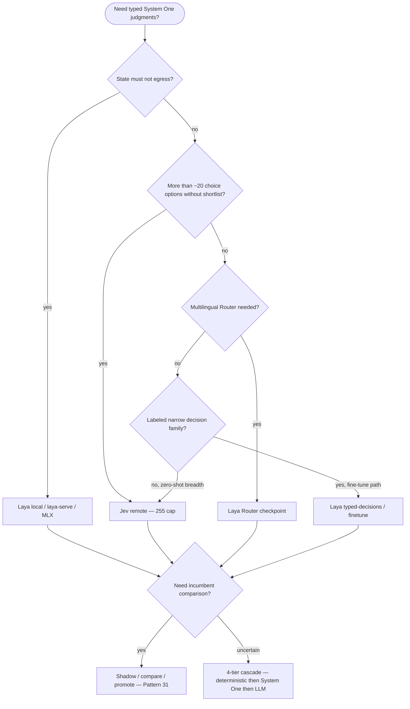

# System One: Jev vs Laya — decision model comparison

| Field | Value |
| --- | --- |
| **Purpose** | Permanent reference comparing the two System One decision models used or planned in TIED: **Jev** (closed, hosted) and **Laya** (open weights, self-hosted), including limits, when to use either or both, and repo integration gaps. |
| **Audience** | TIED implementers, harness engineers, and operators choosing `remote` vs `local` decision backends. |
| **Traceability (reference only)** | [REQ-TIED_JEV_DECISION_COPROCESSOR](../../tied/requirements/REQ-TIED_JEV_DECISION_COPROCESSOR.yaml) · [ARCH-TIED_JEV_DECISION_COPROCESSOR](../../tied/architecture-decisions/ARCH-TIED_JEV_DECISION_COPROCESSOR.yaml) · [IMPL-TIED_JEV_DECISION_COPROCESSOR](../../tied/implementation-decisions/IMPL-TIED_JEV_DECISION_COPROCESSOR.yaml) · [REQ-TIED_JEV_LOCAL_DECISION_PROVIDER](../../tied/requirements/REQ-TIED_JEV_LOCAL_DECISION_PROVIDER.yaml) · [ARCH-TIED_JEV_LOCAL_DECISION_PROVIDER](../../tied/architecture-decisions/ARCH-TIED_JEV_LOCAL_DECISION_PROVIDER.yaml) · [IMPL-TIED_JEV_LOCAL_DECISION_PROVIDER](../../tied/implementation-decisions/IMPL-TIED_JEV_LOCAL_DECISION_PROVIDER.yaml) — **no new tokens** in this doc. |
| **Related docs** | [`jev-for-tied-improvement.md`](jev-for-tied-improvement.md) · [`system-one-jev-taxonomy-and-opportunities.md`](system-one-jev-taxonomy-and-opportunities.md) · [`tied/vocab/decision-copilot.md`](../../tied/vocab/decision-copilot.md) |
| **Sources** | **Laya docs** — ConvAI Innovations documentation site (README-deferred sections: inference, limits, hooks, staged adoption, benchmarks). **Jev vendor** — TypeSafe Jev API docs and System One article patterns cited in sibling docs. **Repo** — `mcp-server/src/jev/*`, bridge script, child REQ plans under `working/`. |
| **Status / date** | Canonical reference (2026-09-30) |

---

## 1. Shared contract: what makes both "System One"

Both Jev and Laya implement the same **bounded semantic decision engine** contract:

$$\text{Compact state} + \{\text{typed questions}\} \xrightarrow{\text{one parallel pass}} \{\text{typed answers} + \text{calibrated probabilities}\}$$

- **Inputs:** compact **state** (text describing context) plus a map of **questions**, each with a primitive **type**.
- **Outputs:** structured **answers** — not prose, not tool calls, not YAML.
- **Primitives (same three):**
  - **`choice`** — pick one labeled option.
  - **`score`** — position on an ordered level scale.
  - **`noul`** — calibrated belief that the proposition is true, in \([0, 1]\).

Neither model is a substitute for a frontier LLM on open-ended generation, JSON repair, or checklist authority.

**Wire portability in TIED:** Laya’s **`laya-serve`** HTTP surface speaks a **Jev-compatible** **`/v1/systemone`** (and related) protocol, so the in-repo **`jevDecide`** question maps and redaction pipeline are **portable** across remote Jev and local Laya backends when the bridge normalizes answer shapes (*Repo*: [`decision-provider.ts`](../../mcp-server/src/jev/decision-provider.ts), [`local-client.ts`](../../mcp-server/src/jev/local-client.ts)).

---

## 2. Side-by-side comparison

### Provenance and licensing

- **Jev (*Jev vendor*)**
  - Closed weights; hosted API at `jevtypesafeai.com`.
  - Model pin via **`JEV_MODEL`** (default **`jev-1.13.0`**).
  - Auth via server-side **`JEV_API_KEY`** only (*Repo*: [`client.ts`](../../mcp-server/src/jev/client.ts)).
- **Laya (*Laya docs*)**
  - Apache 2.0 open weights: **`convaiinnovations/laya`** (English, multilingual, typed-decisions variants).
  - Community MLX port: **`aac6fef/laya-mlx`** (default in **`TIED_JEV_LOCAL_MODEL`** (*Repo*)).
  - Self-host: in-process Python, **`laya-serve`**, MCP server, ONNX, MLX; targets CPU, CUDA, MPS, ARM64, DGX Spark.

### Deployment and data path

- **Jev**
  - State leaves the operator boundary after **redaction**; optional **`jev_data_tier`** (`standard_us` / `eu_strict`) (*Repo* + *Jev vendor*).
  - Network latency and vendor availability are operational dependencies.
- **Laya**
  - Decisions can run **entirely on-prem** — no vendor egress when **`TIED_JEV_DECISION_PROVIDER=local`**.
  - **`laya-serve`** exposes the same typed-decision HTTP contract for drop-in replacement of remote calls.
  - Hooks (*Laya docs*): audit, redact, cache, gate, route pin — mirror TIED’s opt-in **`system-one-decide-trace.v1`** seam.

### Primitive and context limits

| Axis | Jev (*Repo* + *Jev vendor*) | Laya (*Laya docs*) |
| --- | --- | --- |
| **Choice options** | Up to **255** labeled options per question | **`head_max_len`** 192/256; ~**20 options** practical; HTTP hard cap **100**; use **`predict_shortlist`** for larger sets |
| **Score levels** | **2–10** ordered levels | **`MAX_SCORE_LEVELS=10`** |
| **State / context** | **`DEFAULT_JEV_MAX_STATE_CHARS = 120_000`** (*Repo*) | **512/1024-token** working context (8192 encoder max); long text via **`predict_long`** windowing |
| **Batch** | Multi-question fan-out in one `/v1/decide` | **`predict_batch`** for many short chunks |

### Confidence semantics

- **Jev (*Jev vendor*):** choice/score expose **`confidence`** derived from \((n \cdot p_{\max} - 1)/(n - 1)\) over the option or level set; **noul** has **no separate confidence** — the probability is the belief.
- **Laya (*Laya docs*):** entropy-based **`confidence`** on the head **plus** calibrated **`answer_confidence`**; optional **`min_confidence`** gating; shipped models can be **over-confident** relative to labeled accuracy.

**Operator rule:** threshold constants pinned in TIED code (**Blueprint C** `0.60` nouls, **Blueprint D** `0.45` / `0.72` bands) were tuned against **Jev** behavior — **do not transfer numerically** to Laya without labeled fixture re-fit (*Repo*).

### Latency, cost, accuracy (published, not reproduced here)

- **Laya-published (*Laya docs*):** on T4-class GPU, reported **~32.8–39.5 ms** p50 and **~6–7×** vs third-party Jev p50 in their tables; typed-decisions fine-tuned checkpoint **0.766** vs base **0.727** on their internal suite; **Banking77** benchmark shows **Jev leading** on that task in their comparison table.
- **Jev (*Article* in sibling doc):** sub-second, low marginal cost vs frontier LLM — treat numeric marketing as **unverified** until reproduced in **`working/`** labeled fixtures.

Label all such numbers **Laya-published** or **Jev vendor**; do not paste them into gate constants without **Pattern 32–34** evaluation (*Repo*: [`system-one-jev-taxonomy-and-opportunities.md`](system-one-jev-taxonomy-and-opportunities.md)).

### Extensibility

- **Laya:** Python **`decide()`** schema bridge, fine-tuning path, eval harness as CI gate, **`Router`** checkpoint routing for multilingual, hooks for policy seams.
- **Jev:** **ready-made APIs** (agent risk, context filter, model route) — TIED today uses **custom question maps** (*Repo*); ready-mades remain optional composition.

### Multilingual

- **Laya (*Laya docs*):** **`Router`** + **100+ languages** with checkpoint routing.
- **Jev (*Jev vendor*):** no published multilingual benchmark in materials summarized here — assume English-first unless you validate locally.

---

## 3. Known limits of each

### Laya (*Laya docs* — honest limits)

- Zero-shot **base** weights can sit **near chance** on narrow tasks; prefer **typed-decisions** or fine-tuned checkpoints for production bands.
- **Noul label-following** fragility (community issues cited in docs: e.g. criteria wording sensitivity).
- **Negation** and **option-order bias** called out in issue trackers — design questions and option order deliberately.
- **`score`** is the **weakest** primitive relative to choice/noul in published evals.
- Models can be **over-confident** as shipped; use **`answer_confidence`** and offline calibration, not raw entropy alone.
- **`act_probability`** documented as **unusable** for automation — do not wire to gates.

### Jev (*Jev vendor* + sibling doc)

- Reads **literal state** — no reliable arithmetic or symbolic reasoning inside the model.
- Vendor **calibration** claims are **unverified** in this repo until fixture replay proves them.
- **Laya-published benchmark note:** zero-probability on the true label on ~**16%** of DAIR Emotion in their Jev comparison — treat low **`probabilities`** mass as a signal to escalate, not as proof of safety.

---

## 4. Decision guide: when to use which

**Prose rules**

1. **Privacy / no egress / air-gapped** → **Laya** with **`TIED_JEV_DECISION_PROVIDER=local`** (or **`auto`** only when fallback policy is explicit).
2. **Large choice sets (>~20 without `predict_shortlist`)** → **Jev remote** (255 options) unless you implement Laya shortlist plumbing.
3. **Multilingual operator prompts** → **Laya `Router`**, not assumed Jev coverage.
4. **Fine-tunable, repetitive decision family with labels** → **Laya typed-decisions** + eval harness; promote via staged adoption (*Laya docs*).
5. **Broad zero-shot coverage without training budget** → **Jev** incumbent until local fixtures match.
6. **Both models** → run **Pattern 31 shadow** (log disagreements), then **Pattern 36** distillation when local specialized accuracy is interchangeable on a slice; TIED **`TIED_JEV_LOCAL_FALLBACK`** controls whether **`auto`** may egress to Jev.

---

## 5. Using both: cascade and provider patterns

### Four-tier cascade (unchanged)

From [`jev-for-tied-improvement.md`](jev-for-tied-improvement.md):

1. Deterministic code (regex, MCP validators, token graph).
2. System One front door (parallel nouls/choices on trimmed state).
3. Specialized / cheaper LLM when typed answers are insufficient.
4. Frontier model or human for high consequence or policy waiver.

Laya and Jev both occupy **tier 2**; which backend serves tier 2 is a **provider** choice, not a second API surface.

### `TIED_JEV_DECISION_PROVIDER` (*Repo*)

| Mode | Behavior |
| --- | --- |
| **`remote`** (default) | HTTP Jev via **`jevDecide`** |
| **`local`** | Subprocess bridge only; **never** vendor egress |
| **`auto`** | Try local when **`decisionBackendReady`**; honor **`TIED_JEV_LOCAL_FALLBACK`**: `skip` (default), `error`, or `remote` |

**Shadow vs incumbent:** run Laya (local) in parallel with Jev (remote) on identical redacted state; log JSONL under `working/` — **Pattern 31**. Do not change PRELOAD or gate **`allowed`** from shadow alone.

**Pattern 36 distillation:** Laya as **local specialized** tier-2 model; Jev as **fallback** when **`answer_confidence`** or noul bands sit in the uncertainty region. Aligns with Laya **staged adoption** (observe → shadow → promote).

**Audit seam:** Laya **hooks** (audit/redact) correspond to TIED **`JEV_DECIDE_TRACE`** and **`system-one-decide-trace.v1`** — one line per fan-out with redacted state metadata.

---

## 6. TIED authority boundary (unchanged for both)

Neither Jev nor Laya may:

- Set checklist gate **`allowed`**, emit gate receipts, or replace **`tied_checklist_gate_validate`** authority.
- Write or mutate TIED YAML via MCP on their own.
- Replace keyword **PRELOAD** from **`tied/vocab/routing.md`** without an explicit product decision.
- Generate IMPL pseudo-code or prose checklists.

**Threshold policy** remains **code-owned**, pinned per **model + checkpoint + dtype + provider path**. Changing **`JEV_MODEL`**, Laya checkpoint, or MLX vs CUDA is a **Pattern 33–34** contract-testing event.

---

## 7. Current state in this repo and integration gaps (*Repo*)

| Item | State |
| --- | --- |
| Provider router | Implemented — [`decision-provider.ts`](../../mcp-server/src/jev/decision-provider.ts) |
| Local subprocess client | Implemented — [`local-client.ts`](../../mcp-server/src/jev/local-client.ts) |
| Bridge script | **Stub** — [`jev-local-laya-mlx-bridge.py`](../../mcp-server/scripts/jev-local-laya-mlx-bridge.py) returns fixed **0.5** answers until real MLX inference lands |

**Follow-ups for [REQ-TIED_JEV_LOCAL_DECISION_PROVIDER](../../tied/requirements/REQ-TIED_JEV_LOCAL_DECISION_PROVIDER.yaml)** (not fixed in this doc):

1. **Context length:** **`laya-mlx`** ~**512-token** context vs **`DEFAULT_JEV_MAX_STATE_CHARS = 120_000`** — requires trimming or Laya **`predict_long`** before local blocking gates trust full excerpts.
2. **Score shape:** Laya **`score`** returns a **level index**; **`validateJevAnswers`** requires **`score ∈ [0, 1]`** — bridge must normalize (e.g. divide by max level) or extend validation for local backend.
3. **Noul criteria keys:** Laya expects criteria keys **`true`** / **`false`**; Jev question maps must align at the bridge.
4. **Threshold re-fit:** Blueprint **C** (**0.60** nouls) and **D** (**0.45** / **0.72**) were pinned on **Jev** — re-run sufficiency and harness benchmarks on labeled fixtures before **`local`** fail-closed paths block production tools.
5. **Checkpoint default:** **`aac6fef/laya-mlx`** vs upstream **`multilingual`** for non-English — document operator choice per deployment.

Real MLX smoke: **`JEV_LOCAL_MLX_SMOKE=1`** only (not CI).

---

## 8. Per-Blueprint applicability

| Blueprint | Role | Jev fit | Laya fit |
| --- | --- | --- | --- |
| **A — context log pruning** | Semantic garbage collection on log chunks | Incumbent remote fan-out | Many **short chunks** → **`predict_batch`** locally; watch 512-token trim |
| **B — prompt-type routing** | Advisory glossary / prompt-type hints | Strong zero-shot breadth | Shadow compare then promote if Router/lang match |
| **C — evidence sufficiency** | Pre-gate on vacuous evidence | Thresholds already on Jev replay | Local only after **0.60** noul re-fit; fail-open on skip today |
| **D — tool safety gating** | Fail-closed harness on destructive tools | Requires **`JEV_API_KEY`** or ready local backend | **Local availability** avoids egress dependency; must pass dist gate + real bridge |
| **W2 — vocab shadow** | Pattern 31 keyword vs model glossary | Production baseline | Ideal **shadow** candidate — log **`agrees`** without changing PRELOAD |

---

## 9. Reference lexicon

| Term | Meaning |
| --- | --- |
| **`laya-serve`** | HTTP server exposing Jev-compatible System One endpoints for self-host (*Laya docs*). |
| **`answer_confidence`** | Laya calibrated confidence distinct from entropy **`confidence`** — prefer for gating after local calibration. |
| **`head_max_len`** | Laya choice-head width; drives practical ~20-option limit. |
| **`predict_shortlist`** | Laya path for larger choice sets before full head scoring. |
| **`predict_long`** | Windowed inference for text longer than single context. |
| **`Router`** | Laya checkpoint router for multilingual and variant selection. |
| **Staged adoption** | Laya rollout: observe → shadow → promote (*Laya docs*). |
| **Jev-compatible wire protocol** | Shared `/v1/systemone` shape so **`jevDecide`** maps stay provider-agnostic (*Repo*). |

Preferred vocabulary authority: [`tied/vocab/decision-copilot.md`](../../tied/vocab/decision-copilot.md).

---

## 10. Handoff checklist

When refreshing this document:

1. Re-read **Laya docs** for version bumps, limit changes, and new checkpoints — update §2–3 with **Laya docs** labels.
2. Reconcile §7 with **`mcp-server/scripts/jev-local-laya-mlx-bridge.py`** and **`local-client.ts`** — keep **Repo** labels on integration truth.
3. Keep **Laya docs** / **Jev vendor** / **Repo** discipline; never promote published vendor or Laya benchmark numbers into gate constants without fixture replay.
4. Run **`tied_validate_consistency`** (read-only) — this doc does not edit YAML.
5. Cross-check sibling docs [`jev-for-tied-improvement.md`](jev-for-tied-improvement.md) and [`system-one-jev-taxonomy-and-opportunities.md`](system-one-jev-taxonomy-and-opportunities.md) for link rot.
