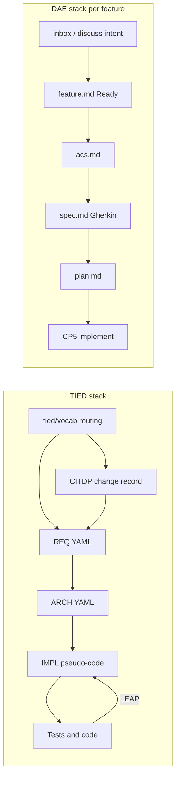

# TIED vs Disciplined Agentic Engineering (DAE)

**Audience:** Engineers evaluating or combining agentic development methodologies.

**Sources (TIED):** This repository — enter via [`tied/vocab/routing.md`](../../tied/vocab/routing.md) (client handoff) and methodology snapshot under `tied/methodology/vocab/` after `copy_files.sh`. Spine docs: [`tied/docs/client-development-index.md`](../../tied/docs/client-development-index.md), [`tied/docs/vocabulary-layer-tied-leap-citdp.md`](../../tied/docs/vocabulary-layer-tied-leap-citdp.md), [`tied/docs/agent-req-implementation-checklist.md`](../../tied/docs/agent-req-implementation-checklist.md), [`tied/docs/LEAP.md`](../../tied/docs/LEAP.md).

**Sources (DAE):** [swingerman/engineer](https://github.com/swingerman/engineer) (Disciplined Agentic Engineering). This analysis was written against a local clone layout: `engineer/` plugin root, `engineer/references/`, `engineer/scripts/dae_*.py`, README.

Neither repository references the other by name. Both target **engineer-led AI development** with **spec/test discipline** and **deterministic gates** instead of prompt-only control.

**Last updated:** 2026-09-22

---

## Executive summary

| Dimension | TIED | DAE |
| --- | --- | --- |
| **North star** | Token-linked REQ / ARCH / IMPL + pseudo-code as logical source of truth | Layered feature docs + Gherkin IR + generated acceptance pipeline |
| **Unit of work** | Project-wide `tied/` YAML graph; optional `tied/features/` orchestration | `features/NNN-slug/` under `.engineer/` manifest |
| **Discipline carrier** | Checklist slugs, MCP/`tied-cli`, validation scripts | 21 stdlib Python guardrails + checkpoint handoffs |
| **Behavior contract** | IMPL `essence_pseudocode` (+ Gherkin not required) | Domain ACs → `spec.md` → `.build/spec.json` |
| **Change record** | `tied/citdp/CITDP-*.yaml` | Handoffs, tracker, panels (no CITDP twin) |
| **Resync when code learns** | LEAP (IMPL → ARCH → REQ) | Refine, edit specs/plan, re-verify, mutation |
| **Test signature** | Unit TDD, composition-before-wiring, justified E2E | Dual green streams (acceptance + unit), mutation, CRAP |
| **Reference host UX** | Editor + TIED MCP (e.g. Cursor) | Claude Code plugins/skills |

---

## Shared thesis

Both methodologies assume capable LLMs **and** engineer judgment. Both reject sustained **vibe coding** (fast prompts without durable contracts).

| Theme | TIED | DAE |
| --- | --- | --- |
| Human owns intent and architecture | REQ/ARCH tokens; sponsor language via vocab **RESOLVE** | `CHARTER.md`; human confirms architecture at CP4 (`plan`) |
| Behavior before implementation detail | IMPL pseudo-code; **LEAP** when tests/code diverge | Domain ACs → Gherkin; Golden Rule: no implementation leakage in specs |
| Agents type; discipline is external | Checklist, MCP, `tied_validate_consistency` | `dae_*.py`; non-zero exit blocks progress |
| Layered specs | REQ → ARCH → IMPL (+ sidecar) | `feature.md` → `acs.md` → `spec.md` → `plan.md` (Speckit-style) |
| Two test concerns | Unit + composition (+ justified E2E) | Acceptance + unit streams both green |
| Beyond “tests pass” | Test adequacy, composition evidence, optional adversarial / evidence chains | Mutation (CP8), differential re-mutate, CRAP on diff |
| Naming / graph integrity | `tied/vocab/*.md` + routing **PRELOAD** | `dae_ontology.py`; intent ↔ AI-native SDLC map |

Influence overlap: DAE cites Speckit, Uncle Bob’s acceptance-pipeline and ATDD lineage; TIED’s [`LEAP.md`](../../tied/docs/LEAP.md) describes the same abstraction ladder (specification as the rung above raw code).

---

## Structural contrast

---

## 1. Artifact equivalence: DAE feature stack ↔ TIED REQ / ARCH / IMPL

### DAE per-feature artifacts

| Artifact | Checkpoint | Role |
| --- | --- | --- |
| `feature.md` | 1.5 Ready | Outcome, scope, `autonomy_level`, branch, optional `gate_profile`, `validation_method` |
| `acs.md` | 2 | Acceptance criteria in **domain language** |
| `spec.md`, `.build/spec.json` | 3 | Standard Gherkin; JSON IR for generators/mutators |
| `plan.md` | 4 | Architecture (human-owned), Charter Check, test strategy, optional `gauntlet:` |
| Code + tests | 5–8 | Implement, refine, verify (`arch-check`, CRAP), harden (mutation) |

Intent may start in `.engineer/inbox.md`, `/engineer.discuss`, or async `intent.md` (see DAE `engineer/references/intent.md`).

### TIED project artifacts

See [`tied/docs/detail-files-schema.md`](../../tied/docs/detail-files-schema.md).

| Layer | Location | Role |
| --- | --- | --- |
| Understanding | `tied/vocab/*.md` | Preferred terms before formal YAML |
| Change analysis | `tied/citdp/CITDP-*.yaml` | Blast radius, risks, test plan, LEAP feedback at close-out |
| REQ | `tied/requirements/REQ-*.yaml` | `satisfaction_criteria`, `validation_criteria`, `traceability` |
| ARCH | `tied/architecture-decisions/ARCH-*.yaml` | Structural decision, `cross_references` |
| IMPL | `IMPL-*.yaml` + `IMPL-*-pseudocode.md` | Operational logic in pseudo-code blocks |
| Proof | Tests and code | Token comments; `code_locations` in IMPL detail |

### Mapping table (equivalence, not identity)

| DAE | TIED | Notes |
| --- | --- | --- |
| `feature.md` outcome/scope | REQ `description`, `satisfaction_criteria`, `rationale` | TIED splits measurable criteria into YAML fields |
| `acs.md` | REQ `satisfaction_criteria` (+ vocab references in criteria) | DAE separates AC discovery (CP2) from Gherkin (CP3) |
| `spec.md` / IR | IMPL `essence_pseudocode` + tests | **Main gap:** Gherkin IR vs language-agnostic pseudo-code |
| `plan.md` Architecture | ARCH `decision`, `implementation_approach` | DAE bundles Charter Check in one markdown file |
| `plan.md` Test strategy | REQ `validation_criteria`, checklist `test-strategy` | DAE `validation_method` (canary, staging) parallels non-default validation |
| `CHARTER.md` | Distributed ARCH/REQ/PROC tokens + `AGENTS.md` | Single charter vs tokenized methodology |
| Handoffs / tracker | Per-request checklist YAML + CITDP | Token graph vs checkpoint audit trail |

### Irreducible gaps

1. **Primary behavior IR:** Gherkin + project acceptance pipeline (DAE) vs IMPL pseudo-code sidecars (TIED).
2. **Scope:** One feature folder (DAE) vs many tokens across a repo (TIED).
3. **CITDP:** TIED persists [`citdp-record-template`](../../tied/docs/citdp-record-template.yaml)-shaped YAML; DAE embeds analysis in skills, panels, and scripts.
4. **No DAE ARCH/IMPL YAML** unless you add TIED separately.

**Integration thought experiment (not shipped in either repo):** One REQ token per feature folder; Gherkin for acceptance; LEAP updates IMPL when mutation or acceptance tests force behavior changes.

---

## 2. Gate mechanics: TIED checklist / MCP vs DAE ledger scripts

### DAE Step 0 (every checkpoint skill)

| Tool | Enforces |
| --- | --- |
| `dae_handoff.py <feature-dir> --through N` | Prior checkpoint complete; exit criteria met |
| `dae_branch.py` | On feature branch (unless `git.manual: true`) |
| `dae_progress.py` | Breadcrumb only; never blocks |
| `dae_ontology.py` (checkpoint exit) | Enumerations, AC↔scenario closure, verifier ≠ implementer |

Handoffs: YAML frontmatter per DAE `handoff-summary.md`, including `exit_criteria[]` with tool evidence. Dispatch: `handoff-dispatch.md` — `autonomy_level` (`low` | `medium` | `high`); external writes (push, merge PR) always need explicit human authorization.

**Gate profile** (`gate-profile.md`): `gate_profile.front` (`auto` | `bundled`) and `verify` (`light` | `standard` | `heavy` | `auto`) bundle human decisions at the ends of the pipeline.

### TIED checklist gates

Spine: [`agent-req-implementation-checklist.md`](../../tied/docs/agent-req-implementation-checklist.md) + per-request [`agent-req-implementation-checklist.yaml`](../../tied/docs/agent-req-implementation-checklist.yaml).

| Phase | Slugs (examples) | Gate character |
| --- | --- | --- |
| Intake | `session-bootstrap`, `change-definition`, `impact-discovery` | Vocab touchpoints 1–2; CITDP steps |
| Design | `author-requirement` … `persist-implementation-records`, `gate-pseudocode-validation` | **No production code** until IMPL complete and validated |
| Build | `unit-test-red/green`, `three-way-alignment-unit`, `composition-integration`, `end-to-end-ui` | RED before GREEN; composition before wiring |
| Close-out | **`verification-gate`**, `sync-tied-stack`, `persist-citdp-record`, **`traceable-commit`** | Full suite, lint, `tied_validate_consistency`, vocab **VALIDATE** |

**`verification-gate`:** Full tests, language lint, optional adversarial inquiry at verification phase, token validation, three-way alignment audit, IMPL metadata updates.

**`traceable-commit`:** Touchpoint 3 **VALIDATE** on all changed names; conventional commit referencing REQ/ARCH/IMPL tokens; no push unless asked.

**Subs:** `sub-yaml-edit-loop`, `sub-pseudocode-validation-pass`, `sub-leap-micro-cycle` (IMPL first on divergence).

### Side-by-side

| Concern | DAE | TIED |
| --- | --- | --- |
| May I start this step? | Handoff + branch scripts | Prior slugs + implementation freeze |
| Structured integrity | `dae_ontology.py` | `tied_validate_consistency`, pseudo-code layers |
| Human judgment | Review panel CP2/4; `consistency-check` warnings | REQ/ARCH authoring; adversarial advisory default |
| Session continuity | `/engineer.next` | Checklist copy; optional `agentstream` |

---

## 3. Vocabulary vs ontology

### TIED

- Entry: [`tied/vocab/routing.md`](../../tied/vocab/routing.md) → **PRELOAD** matched glossaries only.
- Modes: **RESOLVE**, **PRELOAD**, **RECORD**, **VALIDATE** at three touchpoints (prompt intake, pre-read, pre-commit).
- Domain vocab is plain Markdown; distinct from IMPL grammar (`INPUT`, `OUTPUT`, `PRE`, `POST`, …).

See [`vocabulary-layer-tied-leap-citdp.md`](../../tied/docs/vocabulary-layer-tied-leap-citdp.md).

### DAE

- **`dae_ontology.py`:** mechanical constraints at checkpoint exit (enumerations, functional properties, AC↔`@AC-N` closure, disjoint verifier/implementer).
- **`consistency-check` skill:** judgment (domain language, outcome coverage, plan rigor).

See DAE `engineer/references/ontology.md`.

### Contrast

| | TIED | DAE |
| --- | --- | --- |
| Primary pain | Cross-artifact **naming** (UI, CLI, YAML, blocks) | Within-feature **artifact graph** (AC↔scenario join) |
| Leakage | Domain vs IMPL grammar in pseudo-code doc | Golden Rule + spec-guardian on Gherkin |
| Consistency tool | Vocab VALIDATE at commit + MCP consistency | Ontology at every checkpoint exit |

---

## 4. Autonomy and strict gates

| | DAE | TIED |
| --- | --- | --- |
| Mechanical autonomy | `feature.md` `autonomy_level`: low / medium / high (manifest caps, path overrides) | Checklist driver hints; not the same single dial |
| Human at the ends | `gate_profile` bundles front/back; plan architecture always human under `bundled` | Full checklist with explicit human steps in authoring |
| Verification independence | Ontology: verifier handoff `agent_id` ≠ implementer | Same principle in adversarial / checklist policy |
| Strict blocking | Charter, outward writes, `plan` panel errors | Adversarial **gate_policy** `strict-*` rare; default **advisory**; verification-gated REQ status optional per project |

---

## 5. Two paths (spec-first vs prototype-first)

### DAE (`two-paths.md`, `prototype` skill, `express-lane.md`)

- **Spec-first:** ACs and architecture decided up front, then build.
- **Prototype-first:** Iterate runnable artifact, then reverse-engineer ACs, derive spec/plan, disposition (`in-place` vs `rebuild`) by size/risk.
- **Express (XS):** One-pass lane; tests as spec; light gates.

### TIED

- Change entry via CITDP + checklist scenarios in [`client-development-index.md`](../../tied/docs/client-development-index.md) (new REQ, change, TIED-first repair, bug fix, fidelity research, feature onboarding).
- No single “prototype checkpoint”; exploration happens inside implementation with composition/TDD rules, not a formal CP parallel.

---

## 6. Tooling portability

| Capability | TIED | DAE |
| --- | --- | --- |
| Read/write structured intent | TIED MCP + `tied-cli` / bundled skill | Skills + `dae_resolve.py` |
| Validate without LLM | `lint_yaml`, `tied_validate_consistency`, `validate_tokens.sh`, pseudo-code static analysis | All `dae_*.py` with `test_*.py` siblings (483+ tests in upstream README) |
| Host binding | IDE-agnostic; `TIED_BASE_PATH` risk documented in AGENTS | `host-capabilities.md` required vs optional capabilities |
| Orchestrated multi-turn | Go `agentstream` + checklist YAML (optional in consumer repos) | `atdd-team`, parallelism, worktrees |

What **cannot** be enforced without an LLM in DAE: domain-language quality, “does this AC cover the outcome?”, architecture soundness — same class as TIED steps that remain judgment in `consistency-check` / authoring slugs.

---

## 7. Verification philosophy

### TIED order ([`PROC-TIED_DEV_CYCLE`](../../tied/docs/processes.md), core seven)

1. Complete IMPL pseudo-code (block token comments).
2. Unit RED → GREEN; **`sub-leap-micro-cycle`** on divergence.
3. **Composition/integration** for bindings before UI wiring.
4. E2E only with documented platform constraint.
5. **`verification-gate`:** suite, lint, consistency, optional adversarial inquiry under `working/{REQ}/`.

Mutation is **not** central in core seven; quality/evidence tooling is documented separately (evidence chain profiles, test adequacy, composition coverage).

### DAE order (checkpoints 3–8)

| Layer | Question |
| --- | --- |
| Acceptance tests | **WHAT** — external behavior |
| Unit tests | **HOW** — internal structure |
| Mutation (CP8) | **REAL?** — tests catch bugs |
| CRAP (CP7) | Change risk on diff |
| `arch-check` | Charter layering, cycles, size |
| Gauntlet | Subjective bar when `gauntlet:` declared in `plan.md` |

DAE distinguishes **IR mutator** (acceptance wiring) vs **source mutator** (unit hardening) in `spec-ir.md`.

### Panel vs adversarial inquiry

| | DAE | TIED |
| --- | --- | --- |
| Pre-build challenge | Adviser + advocate on ACs and plan | CITDP + optional adversarial pass |
| Findings storage | Handoff `panel_findings` | `obligation-report.json`, etc. (non-canonical YAML) |
| LEAP trigger | Edits to specs/plan/code paths | Observed inquiry findings **do not** auto-trigger LEAP |

---

## 8. Operational UX

| Need | DAE | TIED |
| --- | --- | --- |
| What should I pick up? | `/engineer.next` | Next checklist **slug** on per-request YAML |
| Where am I in the pipeline? | `dae_progress.py` | Optional checklist render via `tools/agentstream` |
| New feature | `feature-init`, `discuss` | `tied init` / feature orchestration (see vocab routing for `feature-orchestration`) |
| Bootstrap | Plugin marketplace install | `copy_files.sh` + MCP config |

---

## 9. When to lean which way

**Lean TIED** when you need durable **token traceability** across modules and repos, **IMPL pseudo-code** as the agent’s primary logic surface, and **persisted CITDP** change records.

**Lean DAE** when you want **productized ATDD + mutation + charter arch-check** on Claude Code (or a host that maps `host-capabilities.md`), with **minimal dependencies** (stdlib Python gates).

**Use both consciously** only with an explicit integration design (REQ token ↔ feature folder, LEAP on divergence); neither upstream ships that merge.

---

## References (quick links)

| Topic | TIED path | DAE path (in engineer repo) |
| --- | --- | --- |
| Routing / bootstrap | `tied/vocab/routing.md`, `tied/docs/client-development-index.md` | README, `engineer/skills/onboard/SKILL.md` |
| Handoffs / gates | `tied/docs/agent-req-implementation-checklist.md` | `engineer/references/handoff-summary.md`, `dae_handoff.py` |
| Behavior spec | `tied/docs/pseudocode-writing-and-validation.md` | `engineer/references/spec-ir.md`, `atdd` plugin |
| Change analysis | `tied/docs/citdp-policy.md` | `discuss`, `feature-init`, `consistency-check` |
| LEAP / resync | `tied/docs/LEAP.md`, `processes.md` § PROC-LEAP | `refine`, `feature-edit`, re-run verify |

---

*This file lives under `docs/comparisons/` (gitignored local analysis). Refresh when either methodology version changes materially.*
