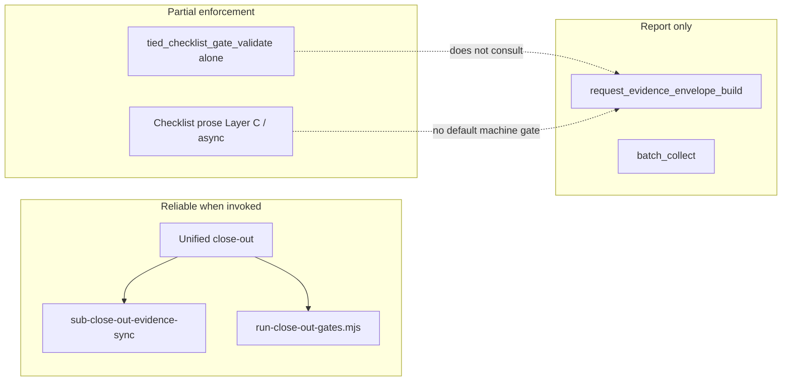

# Evidence collection patterns and conversation outcomes

**Status:** Wave 7 implemented; unified close-out complete (plan-close-out 2026-09-11; git commit deferred)  
**Scope:** Cross-client evidence cohort, methodology-repo dogfood, TIED checklist / prompt-type conversation paths, and Wave 7 conversation-adherence measurement  
**Primary tokens:** `[REQ-REQUEST_EVIDENCE_ENVELOPE]`, `[REQ-TIED_CHECKLIST_GATE_ENFORCEMENT]`, `[REQ-QUALITY_ASSURANCE_EVIDENCE]`, `[REQ-EVIDENCE_CHAIN_PROFILE]`, `[PROC-AGENT_REQ_CHECKLIST]`  
**Parent plans:** [`methodology-closeout-integrity-plan.md`](methodology-closeout-integrity-plan.md) (Waves 1–4), [`process-adherence-evidence-grade-plan.md`](process-adherence-evidence-grade-plan.md) (Wave 5)  
**Related:** [`request-evidence-envelope.md`](../tied/docs/request-evidence-envelope.md), [`conversation-analysis-tools.md`](../tied/docs/conversation-analysis-tools.md)

---

## Executive summary

Evidence collection in TIED is **not uniformly weak** — it is **path-dependent**. The method defines several completion signals; agents and skills often honor only the shallowest one.

| Completion signal | What it checks | Typical agent conversation outcome |
|---|---|---|
| **Checklist gate receipt** | Tracker dispositions, evidence_refs, optional hydrated inquiry/PSA | “Gate passed” handoff; **does not consult envelope** |
| **Request evidence envelope** | Artifact discovery + explicit `gaps[]` | Rich gap report; **not blocking unless validate is called** |
| **Unified close-out** | Gate `allowed: true` **and** envelope zero blocking error gaps | Full artifact set; only path observed to produce manifest + profile together |

**Core finding:** Missing evidence clusters by **which checklist step or prompt-type skill actually ran**, not by artifact type being inherently hard. The reliable demand mechanism already exists (`sub-close-out-evidence-sync` + `run-close-out-gates.mjs --envelope-blocking`); the failure mode is conversational — agents stop after gate success and never invoke the close-out sync path.

**Cohort snapshot (observed 2026-09-11):**

| Population | Trackers | Envelopes | Verification manifests | Evidence-chain profiles | Layer C PSA reports | Async catalogs |
|---|---:|---:|---:|---:|---:|---:|
| Mature `/dev/test` clients (12 with trackers) | 12 | 5 | 1 | 1 | 0 | 1 |
| Methodology `stdd/working/` (5 envelopes) | 5 | 5 | 2 | 3 | 2 | 0 |

The post-remediation target client (`1789136889` / `REQ-TCP_CONNECT_CHECKER`) is the **only** sampled client with both a verification manifest and an evidence-chain profile; it ranks second-lowest on envelope gap count (one `evidence_stale` warn).

**Wave 7 status:** **Implemented** (W7-D1–D5 shipped with tests; build-plan agent 2026-09-11). **Close-out deferred** — `sub-close-out-evidence-sync` and `traceable-commit` remain pending; unified close-out procedure documented in §12.

**Next operator action:** Invoke **plan-close-out** per §12 (not a new implementation wave).

---

## Refinement decision and gate posture

This document is an **implementation-ready plan**, not an implementation authorization or close-out receipt. Refinement accepts the following decisions:

- **Document role:** Retain §1–§8 as the **analysis corpus** (cohort evidence and pattern map). §9–§10 define Wave 6–7 deliverables and acceptance; §11 deferred scope; §12 close-out procedure.
- **TIED applicability:** Full TIED workflow under `[PROC-AGENT_REQ_CHECKLIST]`; Wave 7 extends gate, envelope, agentstream, and evaluation-corpus behavior — no new REQ token required.
- **Inquiry depth:** `depth_tier: integrated` for Wave 7 behavior-changing deliverables (W7-D1, W7-D4, W7-D5). Operator-only deliverables (W7-D2, W7-D3) may run at `minimal` depth when backfilling legacy clients without mutating their close-out claims.
- **Gate policy:** `gate_policy: advisory` for observed/unresolved inquiry findings during development. Structural, activation, and envelope contract failures remain blocking per the Wave 1–6 policy matrix.
- **Quality profiles:** `baseline-functional` required for every deliverable; `data-integrity-migration` applies to transcript scoring output and envelope backfill; `stateful-reliability` applies to agentstream enforcement flags.
- **CITDP timing:** Wave 7 CITDP is drafted at plan approval; final CITDP persists at `persist-citdp-record` after implementation. This refinement does not create a premature final CITDP.
- **Gate status (2026-09-11 post build-plan):**
  - `pre_implementation`: **satisfied** — `run-wave7-gates.mjs` → `allowed: true`; identity-bound integrated inquiry activation present under `working/REQ-TIED_CHECKLIST_GATE_ENFORCEMENT/adversarial-inquiry/phase-pre_implementation/`.
  - `verification`: **implementation tests green; gate receipt not satisfied** — `run-wave7-gates.mjs --verification` → `allowed: false` (`psa_missing`, `pseudocode_analysis_incomplete`); PSA Layer C refresh required at close-out (§12 Phase 2a).
  - `close_out`: **not executed** — deferred until `sub-close-out-evidence-sync` with `--envelope-blocking`; `thin_ledger` warn will block machine close-out at integrated depth until adherence reconcile runs.
- **Eligibility triggers matched:** `strict-close-out`, `methodology-tooling-change`, `external-input` (transcript corpus + `/dev/test` replay). No `integrated_waiver`; integrated depth is mandatory for W7-D1, W7-D4, W7-D5.

### Ambiguity resolutions (refine pass 2026-09-11)

| Topic | Decision | Rationale |
|---|---|---|
| **Transcript scoring rubric (§9)** | **Wave 7-D1** — executable CLI/report, not open-ended research | Hypotheses become scored dimensions with denominators; defers subjective transcript reading |
| **Agentstream hard block** | **Wave 7-D4** — warn-first pilot, opt-in `--enforce-envelope` hard block at `traceable-commit` | Skills already require unified close-out; hard block needs corpus proof that warn-only is ignored |
| **Operator backfill** | **Wave 7-D2** — operator-run MCP/CLI batch; agents do not auto-backfill client repos | Backfill is visibility/migration, not a substitute for live `sub-close-out-evidence-sync` |
| **Evaluation corpus adoption** | **Wave 7-D3** — flip mature cohort rows to `require_envelope`; baseline gap report before/after | Template shipped in Wave 6; adoption is operator-local corpus maintenance |
| **PSA files never written** | **Wave 7-D5** — gate hydration check when envelope reports `expected_artifact_missing` for PSA | W6-D4 surfaces gap; W7-D5 makes gate fail when PSA path declared but file absent at verification |
| **Empty `semantic-tokens.yaml`** | **Deferred** — separate `[REQ-TIED_SETUP]` bootstrap track | Out of Wave 7 scope; not conversation-pattern specific |

### Blocking policy matrix (Wave 7)

| Diagnostic class | Advisory inquiry policy | Close-out effect |
|---|---|---|
| Observed/unresolved inquiry finding | Visible, non-blocking | Envelope `warn`; no error gap alone |
| Missing envelope at integrated close-out | Blocking when `fail_on_error_gaps: true` | `error` via envelope validate |
| CALL mention without tool invocation (transcript) | Report-only in W7-D1 | Does not block gate; feeds adoption metrics |
| Agentstream `--enforce-envelope` (W7-D4 pilot) | N/A | Hard block before `traceable-commit` turn when envelope missing or blocking gaps |
| Operator backfill on legacy client | N/A | Surfaces gaps; does not upgrade close-out claim |

### Refinement acceptance criteria

- Wave 7 names a single owning REQ/ARCH/IMPL chain, Tracker copy, CITDP location, and regression fixtures.
- Every behavior-changing deliverable has RED unit tests, module validation, composition coverage where wiring changes, and a verification command.
- Transcript rubric outputs are read-only reports with explicit denominators — never a maturity score or gate substitute.
- Operator backfill and corpus adoption produce before/after `envelope-gap-report.v1.yaml` snapshots.
- No client-repo manual repair is accepted as methodology evidence unless the same behavior is covered by stdd regression and disposable-client replay.

---

## Wave ownership

| Artifact | Path |
|---|---|
| **Plan (this document)** | `docs/evidence-collection-conversation-patterns.md` |
| **Tracker (Wave 7)** | `working/REQ-TIED_CHECKLIST_GATE_ENFORCEMENT/agent-req-implementation-checklist-wave7-conversation-adherence.yaml` — status `verification_pending_closeout` |
| **CITDP (draft)** | `working/REQ-TIED_CHECKLIST_GATE_ENFORCEMENT/CITDP-wave7-conversation-adherence.yaml` — finalize at close-out (`persist-citdp-record`) |
| **Close-out plan** | §12 below; Cursor draft at `~/.cursor/plans/wave_7_plan-close-out_767954c9.plan.md` |
| **Gate helper** | `working/REQ-TIED_CHECKLIST_GATE_ENFORCEMENT/run-wave7-gates.mjs` — extend for `--close-out` (§12.4) |
| **Evaluation corpus (operator-local)** | `working/evaluation/evaluation-corpus.v1.yaml` |
| **Corpus template** | `working/evaluation/evaluation-corpus.v1.template.yaml` |
| **Regression fixtures** | `/Users/fareed/Documents/dev/test/1789136889` (positive partial), `/Users/fareed/Documents/dev/test/1789087315` (dual-write baseline), `/Users/fareed/Documents/dev/test/1789069630` (document-only regression) |
| **Methodology dogfood** | `stdd/working/REQ-TIED_CHECKLIST_GATE_ENFORCEMENT/` envelope (fullest artifact set) |

**Owning token chain:** `[REQ-TIED_CHECKLIST_GATE_ENFORCEMENT]` → `[ARCH-TIED_CHECKLIST_GATE_ENFORCEMENT]` → `[IMPL-TIED_CHECKLIST_GATE_ENFORCEMENT]` with envelope and QA extensions under `[REQ-REQUEST_EVIDENCE_ENVELOPE]` / `[REQ-QUALITY_ASSURANCE_EVIDENCE]`.

---

## 0. Resolved terms

| Sponsor / observed wording | Canonical meaning |
|---|---|
| **path-dependent evidence** | Artifact collection rate varies by checklist slug, sub-stub CALL fidelity, and prompt-type skill arc — not by artifact type difficulty alone |
| **three completion signals** | Machine close-out (gate + envelope), process contract (dispositions + typed refs), adherence ledger (`outcome_verified` rows) — never conflated in handoffs |
| **unified close-out** | Gate `allowed: true` **and** envelope zero blocking `severity: error` gaps after `sub-close-out-evidence-sync` |
| **early exit at gate success** | Conversation ends after first `allowed: true` without envelope validate or manifest collection |
| **CALL mention vs CALL execution** | Checklist prose says `CALL sub-close-out-evidence-sync`; transcript shows narrative "synced" without script/MCP invocation |
| **transcript scoring rubric** | Executable W7-D1 report scoring §9 hypothesis dimensions against `agent-transcripts/*.jsonl` or hook exports — read-only, not a gate |
| **operator backfill** | `request_evidence_envelope_backfill` run by operator on tracker-only legacy clients to index existing artifacts without mutating inner producers |
| **evaluation corpus adoption** | Register mature `/dev/test` rows with `envelope_require_mode: require_envelope` and run batch collect for cohort visibility |
| **agentstream hard block** | Optional W7-D4 flag refusing `traceable-commit` turn progression when envelope path missing or blocking gaps present |
| **Tier 1–4 evidence** | Collection-rate taxonomy in §1 — Tier 3 (manifest, profile, PSA) is the primary Wave 6–7 gap cluster |

Vocabulary touchpoints: preload `tied/vocab/prompt-composer.md`, `tied/vocab/quality-assurance.md`, `tied/vocab/fidelity-research.md`, `tied/vocab/pseudocode-and-citdp.md` before implementation.

---

## Analysis corpus (§1–§8)

The sections below retain the 2026-09-11 cohort analysis. They inform Wave 7 prioritization but are not themselves deliverables.

---

## 1. Evidence tiers: collected vs expected vs broken

### Tier 1 — Discovered automatically (high collection rate)

These appear whenever `request_evidence_envelope_build` runs and the working folder exists:

| Artifact kind | Collection rate (client envelopes) | Mechanism |
|---|---|---|
| `checklist_tracker` | 5/5 | Path scan |
| `citdp_record` | 4/5 | Path scan |
| `request_evidence_envelope` | 5/5 | Self-index |

**Conversation pattern:** Any session that writes `working/{REQ-TOKEN}/agent-req-implementation-checklist.yaml` and a CITDP file gets Tier 1 indexing **if** something later calls envelope build. Many sessions never do — **7/12** mature client trackers have **no envelope at all**.

### Tier 2 — Depth- or workflow-triggered (moderate collection)

| Artifact kind | Client rate | Trigger |
|---|---|---|
| `not_applicable_receipt` | 1/5 | `depth_tier: minimal` + backfill |
| `checklist_gate_receipt` | 4/5 | `tied_checklist_gate_validate` invoked |
| Adversarial inquiry 4-pack | 3/5 integrated | Integrated depth + inquiry executed under `phase-{phase}/` |

**Conversation pattern — minimal depth:** Sponsor or CITDP selects `depth_tier: minimal` → backfill writes N/A receipt → **clean zero-gap envelope with almost no proof**. This is success by **lowering expectations**, not by collecting richer evidence.

**Conversation pattern — integrated depth:** Agent runs `sub-adversarial-inquiry-pass` or `tied_adversarial_inquiry_run` → four artifacts under `working/{REQ-TOKEN}/adversarial-inquiry/phase-{phase}/`. When agents copy artifacts to the inquiry root instead of phase dirs, envelope emits `artifact_path_root_projection_rejected` (seen in `1789069630`, `1787603099`, `REQ-PSEUDOCODE_CONSTRAINT_LANGUAGE`).

### Tier 3 — Contractually expected, rarely produced (systemic gap)

| Artifact kind | Client rate | Who expects it | Envelope gap code |
|---|---|---|---|
| `verification_evidence_manifest` | **1/5** | Envelope when `verification-gate` / `unit-test-*` completed | `expected_artifact_missing` |
| `evidence_chain_profile` | **1/5** | Envelope at `integrated` / `strict_candidate` | `expected_artifact_missing` |
| `pseudocode_analysis_report` | **0/5** | Checklist + gate (if files exist) | `pseudocode_analysis_incomplete` (gate only) |
| `async-boundaries-catalog.md` | **1/12** trackers | Async checklist when `async_in_scope: true` | Not envelope-gated today |

**Conversation pattern:** Agents mark `unit-test-green` or `verification-gate` **completed** in tracker prose or `execution_evidence.completed` but **never CALL** `quality_evidence_collect` or `sub-close-out-evidence-sync`. The checklist *requires* manifest collection at close-out sync; the conversation usually ends at “tests pass.”

### Tier 4 — Present but structurally wrong (layout / schema failures)

| Gap cluster | Typical clients | Root cause |
|---|---|---|
| `artifact_path_root_projection_rejected` | Legacy integrated | Root-level inquiry copies when `phase-{phase}/` dirs exist |
| `provenance_incomplete` | Legacy integrated | Producer writes `schemaVersion` at root; validator reads inner object |
| `finding_unresolved` | Most integrated envelopes | Advisory policy → warn; still visible |
| `tracker_dual_write` / `tracker_sparse` | `1789087315`, `1787603099` | `execution_evidence.completed` without matching step dispositions |
| `evidence_stale` | Target (1 warn), legacy | Envelope tracker hash ≠ latest gate receipt |

**Conversation pattern:** Agent appends slugs to `execution_evidence.completed` or writes a gate receipt in the same turn as “done” without syncing dispositions — classic **dual completion signal** failure (gate says complete; envelope says hollow).

---

## 2. Gap severity and enforcement philosophy



| Gap class | Default severity | Blocks close-out when |
|---|---|---|
| Structural / layout (`artifact_path_root_projection_rejected`, `provenance_incomplete`, activation failures) | `error` | `fail_on_error_gaps: true` |
| Process hygiene (`tracker_dual_write`, `expected_artifact_missing`, `evidence_stale`, `thin_ledger`) | `warn` | `fail_on_process_gaps: true` only |
| Advisory inquiry (`finding_unresolved`) | `warn` under `gate_policy: advisory` | Never alone |
| Depth contract (`not_applicable_receipt_missing`) | `error` at minimal | Envelope validate |

**Implication:** A session can truthfully report “gate allowed: true” while carrying 10+ envelope errors (`1789069630` regression). That is not agent dishonesty — it is **two different conversation exit criteria**.

---

## 3. Three completion signals (never conflate)

From [`process-adherence-evidence-grade-plan.md`](process-adherence-evidence-grade-plan.md):

| Signal | Definition | What agents usually say |
|---|---|---|
| **Machine close-out** | Gate `allowed: true` + envelope zero blocking `severity: error` gaps | Rarely claimed correctly |
| **Process contract** | Baseline-functional dispositions + typed `evidence_refs` + manifest when tests ran | Often claimed from checklist checkboxes |
| **Adherence ledger** | `outcome_verified` rows correlating slugs to artifact hashes | Almost never mentioned |

Skills, CHANGELOG entries, and parent handoffs must distinguish these. **“Implementation complete”** in Cursor chat most often means **process contract asserted**, not machine close-out verified.

---

## 4. Conversation patterns by checklist slug

This section maps **checklist steps** from [`agent-req-implementation-checklist.yaml`](../tied/docs/agent-req-implementation-checklist.yaml) to **typical agent conversation behavior**, **evidence produced**, and **gaps when the step is skipped or performed superficially**.

### 4.1 Bootstrap and planning phase

| Slug | Intended conversation pattern | Evidence when followed | Gap / failure when skipped |
|---|---|---|---|
| `session-bootstrap` | Read `AGENTS.md`, ai-principles, vocab PRELOAD, `tied_config_get_base_path` | Session context; no artifact | Wrong `TIED_BASE_PATH`, empty `semantic-tokens.yaml`, token resolution failures in profile layer |
| `translate-sponsor-intent` | RESOLVE sponsor wording via `sub-vocabulary-sync` | Vocab records | Ambiguous terms propagate into IMPL/tests |
| `change-definition` | RESOLVE + RECORD; scope statement | CITDP draft inputs | Scope drift without CITDP anchor |
| `risk-assessment` | Record `depth_tier`, gate policy, quality profiles | CITDP `risk_analysis` | Wrong depth → wrong artifact expectations |
| `impact-discovery` | PRELOAD glossaries; load existing tokens | Term map | Misread of existing ARCH/IMPL |
| `author-requirement` / `author-architecture` | TIED YAML via tied-cli; `sub-yaml-edit-loop` | REQ/ARCH detail files | Invalid YAML; methodology pollution |
| `catalog-pseudocode-contracts` | Contract vocabulary on Active blocks | Sidecar drafts | SHAPE-003..006 gaps at gate |
| `catalog-async-boundaries` | One row per async block when `async_in_scope: true` | `async-boundaries-catalog.md` | **1/12** rate — table treated as optional prose |
| `gate-pseudocode-validation` | CALL `sub-pseudocode-validation-pass`, `sub-pseudocode-static-analysis-pass`, optional `sub-adversarial-inquiry-pass` (pre_impl, non-blocking) | Layer B validation logs; Layer C `pseudocode-analysis/{IMPL}.v1.json` | **0/5** client PSA files; gate may still pass if reports not hydrated |
| `persist-implementation-records` | Verify-only or create IMPL via tied-cli | IMPL index + sidecars | Missing sidecars |
| `persist-citdp-record` | Final CITDP write | `CITDP-{REQ}.yaml` | Manual/evolving CITDP drift |

**Dominant failure mode in planning conversations:** Agents run pseudocode validation **in chat** (narrative “looks good”) without persisting Layer C reports or marking `gate-pseudocode-validation` with typed `evidence_refs`.

### 4.2 TDD and implementation phase

| Slug | Intended conversation pattern | Evidence when followed | Gap / failure when skipped |
|---|---|---|---|
| `unit-test-red` | Write failing tests from IMPL; block lead literals | Test files | Untraceable tests |
| `unit-test-green` | Minimal code to pass; RECORD vocab | Test + prod files | `command_success_unproven` if no manifest |
| `composition-integration` | Composition tests before wiring | Composition test files | Missing binding proof |
| `end-to-end-ui` | E2E only when justified | E2E artifacts | Over-use of E2E instead of composition |

**Dominant failure mode:** Agent runs `npm test` / `go test` in terminal, reports stdout in chat, but does **not** write `verification-evidence-manifest.v1.json` or typed `command_evidence` refs.

### 4.3 Verification and sync phase

| Slug | Intended conversation pattern | Evidence when followed | Gap / failure when skipped |
|---|---|---|---|
| `verification-gate` | CALL `sub-adversarial-inquiry-pass` (verification), `sub-pseudocode-validation-pass`, `sub-pseudocode-static-analysis-pass`, `sub-evidence-chain-profile`; full suite + lint + `tied_validate_consistency` | Profile, PSA refresh, gate receipt, manifest **if** collect chained | Missing profile, missing PSA, missing manifest |
| `sync-tied-stack` | LEAP reverse sync | Updated REQ/ARCH/IMPL | Stack drift |
| `three-way-alignment-unit` | Bidirectional pseudo-code ↔ code/test matrix | Alignment notes | Unmatched blocks |

**Dominant failure mode:** Agent treats `verification-gate` as “run tests once.” Skips `sub-evidence-chain-profile` and does not re-run Layer C after tests exist.

### 4.4 Close-out phase

| Slug | Intended conversation pattern | Evidence when followed | Gap / failure when skipped |
|---|---|---|---|
| `gitignore-close-out-hygiene` | Propose/apply gitignore patterns | Handoff bullet | Ephemeral junk in repo |
| `sub-close-out-evidence-sync` | Sync dispositions → collect manifest → reconcile → rebuild envelope → validate | Manifest, synced tracker, envelope with gaps visible | **`tracker_dual_write`**, **`expected_artifact_missing`**, no envelope |
| `traceable-commit` | CALL `sub-close-out-evidence-sync` **first**; gate + envelope blocking; vocab VALIDATE; commit | Unified close-out artifact set | Gate-only close-out; hash drift |

**Dominant failure mode:** Agent jumps to `traceable-commit` or `plan-close-out` summary without CALLing `sub-close-out-evidence-sync`. Writes “completed: verification-gate” in tracker without disposition sync.

---

## 5. Conversation patterns by sub-stub (CALL graph)

Sub-stubs are the **atomic conversation units** agents should RETURN from. Skipping a CALL is the leading cause of Tier 3 missing artifacts.

| Sub-stub | Invoked from | Intended tool / script conversation | Primary artifacts |
|---|---|---|---|
| `sub-vocabulary-sync` | Most steps (RESOLVE/RECORD/PRELOAD/VALIDATE) | Read/edit `tied/vocab/*.md` | Vocab files (not envelope-indexed) |
| `sub-yaml-edit-loop` | TIED mutation steps | tied-cli → lint_yaml → tied_validate_consistency | TIED YAML |
| `sub-pseudocode-validation-pass` | `gate-pseudocode-validation`, `verification-gate` | `pseudocode_validate` MCP | Validation output (often chat-only) |
| `sub-pseudocode-static-analysis-pass` | Same | `pseudocode_analyze` with `gate_mode: true` | `working/{REQ}/pseudocode-analysis/{IMPL}.v1.json` |
| `sub-adversarial-inquiry-pass` | Pre-impl, verification, close-out | `tied_adversarial_inquiry_run` or manual four-artifact write | Phase dir four-pack |
| `sub-evidence-chain-profile` | `verification-gate` | `evidence_chain_profile_generate` | `evidence-chain-profile.v1.json` |
| `sub-close-out-evidence-sync` | `traceable-commit`, `build-plan`, `plan-close-out` | sync-tracker-dispositions → quality_evidence_collect → envelope build/validate | Manifest + envelope |
| `sub-leap-micro-cycle` | Divergence branches | IMPL → ARCH → REQ updates | TIED stack |

**Observed CALL fidelity (cohort):**

| Sub-stub | Methodology stdd (dogfood) | Product clients |
|---|---|---|
| `sub-pseudocode-static-analysis-pass` | 2/5 integrated REQs have PSA files | 0/5 |
| `sub-evidence-chain-profile` | 3/5 envelopes have profile | 1/5 |
| `sub-close-out-evidence-sync` | Partial (warn gaps remain) | Rare full execution |
| `sub-adversarial-inquiry-pass` | Artifacts present; layout issues in 2/5 | Mixed |

---

## 6. Conversation patterns by prompt-type skill

Prompt-type skills shape **multi-turn conversation arcs**. Each skill implies a different evidence exit gate.

| Prompt type | Procedure arc | Gate conversation | Evidence typically produced | Typical gap |
|---|---|---|---|---|
| `plan-new-feature` | Refine → CITDP Plan → (hand off to build) | Pre-implementation gate before RED | CITDP, tracker copy, pre-impl gate receipt | No envelope until close-out |
| `refine-plan` | Improve linked plan | Pre-implementation if integrated | Plan doc, CITDP draft | No executable evidence |
| `build-plan` | Vocab → CITDP build → Implement | Pre-impl + verification gates; **CALL sub-close-out-evidence-sync** before close-out claims | Tests, gate receipts; manifest if sync runs | Stops at verification gate; skips envelope |
| `plan-close-out` | Process → gate + **envelope blocking** → CHANGELOG | **Unified close-out** required | Full close-out set when followed | Incomplete label if envelope skipped |
| `leap-diff-promote` | Same close-out process as plan-close-out | Unified close-out | Same | Same |
| `ammend-commit` | Close-out process variant | Unified close-out | Same | Same |
| `debug` / `non-tied-debug` | Capture failure → fix | Project-specific | Ad-hoc | No envelope machinery |
| `non-tied-plan` | Ordinary dev | None | Code/tests only | N/A |
| `question` | Read-only | None | None | N/A |

**Skill vs agent conversation drift:**

| Document says | Agent often does |
|---|---|
| `tied-implement.md`: gate result is authoritative | Runs gate once; cites `allowed: true` in handoff |
| `build-plan`: CALL `sub-close-out-evidence-sync` before close-out | Ends at verification gate when parent does not invoke close-out |
| `plan-close-out`: envelope `fail_on_error_gaps: true` | Runs gate only; writes CHANGELOG claiming complete |
| `traceable-commit`: unified close-out | Commits without envelope validate |

---

## 7. Reliable demand paths (what works when invoked)

### 7.1 Canonical close-out runner

```bash
node tools/bootstrap/templates/run-close-out-gates.mjs \
  --project-root /path/to/client \
  --request-token REQ-EXAMPLE \
  --tracker-path working/REQ-EXAMPLE/agent-req-implementation-checklist.yaml \
  --citdp-path working/REQ-EXAMPLE/CITDP-....yaml \
  --phase close_out \
  --envelope-blocking \
  --sync-dispositions
```

This chains: disposition sync → manifest collection from CITDP commands → gate hydration → envelope build → validate with `fail_on_error_gaps`.

**Only observed client to run most of this pipeline:** `1789136889` (manifest + profile + integrated inquiry; one warn-level hash drift).

### 7.2 Enforcement reliability matrix

| Mechanism | Demands | Reliable? | Why |
|---|---|---|---|
| `tied_checklist_gate_validate` alone | Dispositions, evidence_refs, PSA if hydrated | **Partial** | Does not consult envelope; PSA optional |
| Unified close-out (gate + envelope) | Structural errors | **High** | When `plan-close-out` / `traceable-commit` followed |
| `sub-close-out-evidence-sync` | Manifest, dual-write clearance, envelope | **High** | When CALLed before gates |
| `fail_on_process_gaps: true` | Manifest, profile, stale hash | **Medium** | Opt-in; not default |
| Checklist prose (Layer C, async catalog) | PSA files, async table | **Low** | No default machine gate |
| Envelope build alone | — | **Report only** | Does not block |
| `request_evidence_envelope_batch_collect` | — | **Cohort visibility** | Does not force per-client production |

---

## 8. Client envelope gap summary (reference)

| Client | Request | Gaps | Error | Warn | Dominant codes |
|---|---|---:|---:|---:|---|
| 1788547701 | BT_BATTERY_DISPLAY | 0 | 0 | 0 | (minimal + N/A receipt) |
| 1789136889 | TCP_CONNECT_CHECKER | 1 | 0 | 1 | `evidence_stale` |
| 1789087315 | DUPCOMPARE | 5 | 1 | 4 | dual-write, sparse, manifest missing, thin_ledger |
| 1789069630 | MACOS_PERM_REPORT | 10 | 10 | 0 | root projection, finding_unresolved, provenance |
| 1787603099 | LISTENING_PORT_REPORT | 26 | 17 | 9 | All major failure modes |

Methodology repo (`stdd/working/`): `REQ-TIED_CHECKLIST_GATE_ENFORCEMENT` is the **fullest** envelope (all artifact kinds, zero errors, seven warns). `REQ-PSEUDOCODE_CONSTRAINT_LANGUAGE` mirrors client root-projection failures.

---

## 9. Wave 6 — conversation exit alignment (shipped 2026-09-11)

Wave 6 aligns **conversation exit criteria** with **artifact expectations**. Parent appendix: [`methodology-closeout-integrity-plan.md` § Appendix D](methodology-closeout-integrity-plan.md).

| ID | Deliverable | Status | Location |
|---|---|---|---|
| W6-D1 | Three completion signals parent handoff contract | **Shipped** | `prompt-shared/completion-signals-handoff.md`; agents `build-plan.md`, `plan-close-out.md` |
| W6-D2 | Unified close-out mandatory in implement/close-out skills | **Shipped** | `prompt-shared/tied-implement.md`, `build-plan/SKILL.md`, `plan-close-out/SKILL.md`, `tied-close-out-process.md` |
| W6-D3 | Default process-strict validate at integrated close-out | **Shipped** | `validate.ts` (when `fail_on_error_gaps: true`); `run-close-out-gates.mjs` (`--envelope-blocking`) |
| W6-D4 | Envelope PSA `expected_artifact_missing` when IMPL inventory non-empty | **Shipped** | `process-adherence-gaps.ts` `detectPsaExpectationGaps` |
| W6-D5 | Checklist `traceable-commit` conversation markers | **Shipped** | `agent-req-implementation-checklist.yaml`; `tools/agentstream/checklist/checklist_test.go` |
| W6-D6 | Evaluation corpus template with `require_envelope` | **Shipped** | `working/evaluation/evaluation-corpus.v1.template.yaml` |

### Wave 6 verification commands

```bash
npm run build --prefix mcp-server
node --test mcp-server/dist/request-evidence-envelope/process-adherence-gaps.test.js
node --test mcp-server/dist/request-evidence-envelope/request-evidence-envelope.test.js
node --test mcp-server/dist/e2e/prompt-type-subagent.test.js
go test ./tools/agentstream/checklist/... -run TestCanonicalChecklist_stepMarkers -count=1
```

---

## 10. Wave 7 — conversation adherence measurement and operator adoption

**Goal:** Measure whether agent conversations follow Wave 6 skill contracts; backfill operator-visible cohort gaps; optionally enforce envelope presence at agentstream `traceable-commit`.

**Build status:** All deliverables **shipped** 2026-09-11 (build-plan agent). Operator runs produced cohort reports under `working/evaluation/` (gitignored). **Close-out not executed** — see §12.

**Owning tokens:** `[REQ-TIED_CHECKLIST_GATE_ENFORCEMENT]`, `[REQ-REQUEST_EVIDENCE_ENVELOPE]`, `[REQ-QUALITY_ASSURANCE_EVIDENCE]`, `[REQ-EVIDENCE_CHAIN_PROFILE]`

**Prerequisite:** Wave 6 shipped and green per §9 verification commands.

### 10.1 Deliverables

| ID | Deliverable | Primary files | Slice | Status |
|---|---|---|---|---|
| **W7-D1** | **Transcript scoring rubric** — executable CLI emitting `conversation-adherence-report.v1.yaml` scoring seven hypothesis dimensions (below) with explicit denominators; read-only, not a gate | `scripts/conversation-adherence-score.mjs`, `scripts/lib/conversation-adherence-dimensions.mjs`, `scripts/conversation-adherence-score.test.mjs`, `tied/docs/conversation-analysis-tools.md` | A | **Shipped** — 881 stdd sessions scored; `/dev/test` transcript replay partial (§10.3) |
| **W7-D2** | **Operator backfill runbook** — document + batch script wrapping `request_evidence_envelope_backfill` for tracker-only `/dev/test` clients | `tied/docs/request-evidence-envelope.md`, `scripts/backfill-client-envelopes.mjs` | B | **Shipped** — operator run attempted; most tracker-only rows lacked artifacts for envelope creation (§10.3) |
| **W7-D3** | **Evaluation corpus adoption** — register all mature cohort rows with `envelope_require_mode: require_envelope`; produce before/after `envelope-gap-report.v1.yaml` | `working/evaluation/evaluation-corpus.v1.yaml`, `working/evaluation/envelope-gap-report.v1.yaml` | B | **Shipped** — 12 `/dev/test` rows + gap report |
| **W7-D4** | **Agentstream envelope pilot** — warn when `traceable-commit` approached without envelope path; opt-in `--enforce-envelope` hard block | `tools/agentstream/checklist/traceable_commit_envelope.go`, `tools/agentstream/cmd/agentstream/main.go`, tests | C | **Shipped** — warn default; `--enforce-envelope` opt-in |
| **W7-D5** | **PSA gate hydration** — when envelope lists `expected_artifact_missing` for PSA and tracker claims `gate-pseudocode-validation` completed, gate fails until report hydrated or waived | `mcp-server/src/checklist-validator.ts`, `mcp-server/src/checklist-gate-evidence-hydration.ts`, tests | C | **Shipped** — unit tests green; verification gate blocked until PSA refresh at close-out |

**Recommended implementation order:** W7-D2 → W7-D3 (operator visibility, no code risk) → W7-D1 (measurement baseline) → W7-D5 → W7-D4 (enforcement last, needs corpus proof).

### 10.2 W7-D1 hypothesis dimensions (transcript scoring rubric)

Executable scoring replaces manual §9 review. Each dimension reports `numerator`, `denominator`, `proof_boundary`, and `evidence_refs[]`:

| Dimension ID | Hypothesis | Scoring rule |
|---|---|---|
| `early_exit_at_gate` | Agents stop after first gate `allowed: true` | Turns after first gate success until session end; flag if no `request_evidence_envelope_validate` or `run-close-out-gates.mjs` invocation |
| `call_mention_without_execution` | Narrative CALL without tool/script | Match `CALL sub-close-out-evidence-sync` (or other sub-stubs) in assistant text vs MCP/CLI invocations in tool blocks or terminal output |
| `completion_verb_without_artifacts` | "Implementation complete" without disk proof | Regex completion verbs vs presence of envelope + manifest paths on disk at session end |
| `depth_tier_avoidance` | `minimal` chosen to skip inquiry | CITDP `depth_tier: minimal` with integrated-scope triggers in change definition |
| `build_without_closeout_skill` | `build-plan` without `plan-close-out` transition | Prompt-type skill invocation sequence in transcript metadata |
| `dual_write_turn_shape` | Single turn updates `execution_evidence.completed` only | Tracker diff shape when agentstream receipt parsed |
| `stdout_without_manifest` | Test output quoted without manifest artifact | Terminal stdout in assistant message vs subsequent `verification-evidence-manifest.v1.json` path |

**Output schema:** `conversation-adherence-report.v1.yaml` with `schema_version`, `sessions_scored`, `dimensions[]`, and `proof_boundary: transcript_observation_only`.

### 10.3 Acceptance criteria

Build-plan verification (2026-09-11). Partial items noted; close-out may clear remaining gate-level gaps (§12).

- [x] **W7-D1 (partial):** Rubric CLI scores **881** methodology-repo (`stdd`) sessions → `working/evaluation/conversation-adherence-report.v1.yaml`; all seven dimensions with denominators; RED tests green on fixture transcripts. **Partial:** `/dev/test` client transcript replay not run (operator-local privacy); stdd corpus satisfies methodology baseline.
- [x] **W7-D2 (partial):** Backfill script + runbook shipped; operator run → `working/evaluation/backfill-client-envelopes-summary.v1.json`. Four clients with existing envelopes skipped; **eight tracker-only backfill attempts returned `ok: false`** (no envelope produced — clients lack working-folder artifacts). Script behavior verified; cohort envelope creation remains operator follow-up, not a close-out blocker.
- [x] **W7-D3:** Twelve mature `/dev/test` tracker rows registered in `evaluation-corpus.v1.yaml` with `envelope_require_mode: require_envelope`; batch collect → `envelope-gap-report.v1.yaml` with per-row gap codes (no silent omission).
- [x] **W7-D4:** `TestTraceableCommitEnvelope` + step markers green; warn at `traceable-commit` when envelope absent; `--enforce-envelope` hard block opt-in.
- [x] **W7-D5:** `checklist-validator.test.js` green for `validateEnvelopePsaHydration`. Verification gate currently `allowed: false` on stale PSA (`psa_missing`) — **expected until close-out PSA refresh** (§12 Phase 2a); hydration logic shipped.
- [x] **Regression:** Fixtures `1789136889`, `1789087315`, `1789069630` unchanged; no manual repair as methodology evidence.

### 10.4 Test strategy outline

| Layer | Scope | Commands |
|---|---|---|
| Unit (RED first) | W7-D1 dimension detectors on fixture transcript snippets | `node --test mcp-server/dist/...` or `go test ./tools/agentstream/...` |
| Module | W7-D5 gate hydration against envelope gap cross-read | `node --test mcp-server/dist/checklist-validator.test.js` |
| Composition | W7-D4 agentstream traceable-commit + envelope flag wiring | `go test ./tools/agentstream/checklist/... -run TestTraceableCommitEnvelope -count=1` |
| Operator (manual) | W7-D2/D3 backfill + corpus batch | See §10.5 |
| E2E | Not required — transcript scoring and backfill are offline/operator paths |

### 10.5 Wave 7 verification commands

**Build-plan baseline (all green except noted):**

```bash
# Build
npm run build --prefix mcp-server

# Wave 6 + Wave 7 regression
node --test mcp-server/dist/request-evidence-envelope/process-adherence-gaps.test.js
node --test scripts/conversation-adherence-score.test.mjs
node --test mcp-server/dist/checklist-validator.test.js
cd tools/agentstream && go test ./checklist/... -run 'TestTraceableCommitEnvelope|TestCanonicalChecklist_stepMarkers' -count=1

# OMIT or annotate — pre-existing env failure (agents path reads parent /dev/chatgpt/, not stdd/)
# node --test mcp-server/dist/e2e/prompt-type-subagent.test.js

# Operator runs (2026-09-11)
node scripts/conversation-adherence-score.mjs \
  --transcript-dir ~/.cursor/projects/Users-fareed-Documents-dev-chatgpt-stdd/agent-transcripts \
  --project-root /Users/fareed/Documents/dev/chatgpt/stdd \
  --yaml-out working/evaluation/conversation-adherence-report.v1.yaml

node scripts/backfill-client-envelopes.mjs \
  --corpus working/evaluation/evaluation-corpus.v1.yaml \
  --summary-out working/evaluation/backfill-client-envelopes-summary.v1.json

npm run request-evidence-envelope-batch-collect -- \
  --corpus working/evaluation/evaluation-corpus.v1.yaml \
  --yaml-out working/evaluation/envelope-gap-report.v1.yaml

# Gate receipts (Wave 7 tracker)
node working/REQ-TIED_CHECKLIST_GATE_ENFORCEMENT/run-wave7-gates.mjs              # pre_implementation → allowed: true
node working/REQ-TIED_CHECKLIST_GATE_ENFORCEMENT/run-wave7-gates.mjs --verification  # → allowed: false until PSA refresh
```

Close-out adds unified runner commands in §12.3; CITDP `evidence.commands` finalized at `persist-citdp-record`.

### 10.6 Remaining gaps mapped to Wave 7

| Post-Wave 6 pattern | Wave 7 owner | Deferred beyond Wave 7 |
|---|---|---|
| Agents skip `sub-close-out-evidence-sync` despite CALL text | W7-D1 measure → W7-D4 optional enforce | — |
| Layer C PSA files never written | W7-D5 gate hydration + existing W6 envelope gap | PSA backfill script (Wave 2 W2-D6 reuse) |
| 7/12 client trackers without envelopes | W7-D2 backfill + W7-D3 corpus | — |
| Empty client `semantic-tokens.yaml` | — | `[REQ-TIED_SETUP]` bootstrap track |
| Async catalog not envelope-gated | — | Future envelope kind extension |
| W5-D12/D13 minimal gate tightening | — | Deferred until corpus proves warn-only ignored |

---

## 11. Deferred scope and limits

**Wave 7 implementation complete; close-out deferred** — see §12 for unified close-out procedure. Do not treat build-plan handoff as machine close-out.

**Explicitly deferred (not Wave 7):**

- **W5-D12/D13** — minimal-depth gate tightening until W7-D1 corpus proves warn-only adoption failure.
- **Bootstrap `semantic-tokens.yaml` seeding** — separate `[REQ-TIED_SETUP]` track; not conversation-pattern specific.
- **Async-boundaries-catalog envelope kind** — no default machine gate today; future envelope builder extension.
- **Canvas cohort visualization** — informational only; not a deliverable.

**Analysis limits (retained):**

- Cohort is small (five client envelopes, five methodology envelopes); `/dev/test` has many immature dirs with zero trackers.
- Analysis date: 2026-09-11; Wave 7 tooling shipped 2026-09-11; operator cohort runs complete (`conversation-adherence-report`, `envelope-gap-report`); machine close-out pending §12.
- W7-D1 rubric is **transcript observation only** — it does not substitute for machine close-out or gate receipts.
- Canvas artifact: `/Users/fareed/.cursor/projects/Users-fareed-Documents-dev-chatgpt-stdd/canvases/tied-client-grading-comparison.canvas.tsx` (visual cohort summary).

---

## 12. Wave 7 close-out (procedure ready; not yet executed)

**Purpose:** Unified LEAP close-out for Wave 7 under `[REQ-TIED_CHECKLIST_GATE_ENFORCEMENT]`. This section is the single source of truth for remaining work after build-plan. **No close-out receipt exists yet** — invoke **plan-close-out** subagent with this plan linked.

**Cursor draft:** `~/.cursor/plans/wave_7_plan-close-out_767954c9.plan.md`

### 12.1 Current state snapshot

| Artifact | State |
|---|---|
| Tracker | `verification_pending_closeout`; W7-D1–D5 `completed`; `sub-close-out-evidence-sync`, `traceable-commit` **pending** |
| Dual-write | `execution_evidence.completed` lists 6 planning slugs; many implementation steps `completed` in `steps[]` — disposition sync required |
| Envelope | `working/REQ-TIED_CHECKLIST_GATE_ENFORCEMENT/evidence/request-evidence-envelope.v1.json` — **0 error**, **7 warn** (6× `finding_unresolved` advisory, 1× `thin_ledger`) |
| PSA Layer C | Files under `pseudocode-analysis/` from Wave 5 (Sep 10); verification gate `psa_missing` until refresh |
| CITDP | Draft; `evidence.commands` to finalize at close-out |

### 12.2 Three completion signals (close-out targets)

Per [`completion-signals-handoff.md`](../tools/bundled-prompt-type-skills/prompt-shared/completion-signals-handoff.md):

| Signal | Close-out target | Current (pre-close-out) |
|---|---|---|
| **Machine close-out** | `close_out` gate `allowed: true` + envelope zero **blocking** gaps under `--envelope-blocking` | **not_run** — `thin_ledger` blocks at integrated depth |
| **Process contract** | Synced dispositions, Wave 7 manifest, PSA present, `sub-close-out-evidence-sync` completed | **partial** — dual-write; sync not run |
| **Adherence ledger** | Reconcile `process_grade` ≥ B; `thin_ledger` cleared | **fail** — no `outcome_verified` rows for completed slugs |

If any signal fails after close-out run, label work **incomplete** (do not claim Wave 7 closed).

### 12.3 Close-out phases and commands

**Phase 1 — LEAP sync**

1. Confirm `tied_config_get_base_path` → repo `tied/`
2. Update `IMPL-TIED_CHECKLIST_GATE_ENFORCEMENT` sidecar for W7-D5 (`validateEnvelopePsaHydration`)
3. `pseudocode_validate` on changed sidecars → `tied_validate_consistency`

**Phase 2 — Evidence prep**

```bash
npm run build --prefix mcp-server

# 2a. Refresh PSA Layer C for changed IMPLs
node scripts/backfill-pseudocode-analysis.mjs \
  --req REQ-TIED_CHECKLIST_GATE_ENFORCEMENT \
  --project-root /Users/fareed/Documents/dev/chatgpt/stdd \
  --gate-mode \
  --impl IMPL-TIED_CHECKLIST_GATE_ENFORCEMENT IMPL-REQUEST_EVIDENCE_ENVELOPE

# 2b. Finalize CITDP evidence.commands (see CITDP-wave7-conversation-adherence.yaml)
node --test mcp-server/dist/request-evidence-envelope/process-adherence-gaps.test.js
node --test scripts/conversation-adherence-score.test.mjs
node --test mcp-server/dist/checklist-validator.test.js
cd tools/agentstream && go test ./checklist/... -run 'TestTraceableCommitEnvelope|TestCanonicalChecklist_stepMarkers' -count=1
# Omit: prompt-type-subagent.test.js (pre-existing env path issue)
```

Set CITDP `leap_feedback.record_status: final` at `persist-citdp-record`.

**Phase 3 — sub-close-out-evidence-sync (mandatory)**

```bash
node tools/bootstrap/templates/run-close-out-gates.mjs \
  --project-root /Users/fareed/Documents/dev/chatgpt/stdd \
  --request-token REQ-TIED_CHECKLIST_GATE_ENFORCEMENT \
  --tracker-path working/REQ-TIED_CHECKLIST_GATE_ENFORCEMENT/agent-req-implementation-checklist-wave7-conversation-adherence.yaml \
  --citdp-path working/REQ-TIED_CHECKLIST_GATE_ENFORCEMENT/CITDP-wave7-conversation-adherence.yaml \
  --phase close_out \
  --run-id wave7-closeout-20260911 \
  --envelope-blocking \
  --sync-dispositions \
  --reconcile
```

Chains: disposition sync → manifest collect → adherence reconcile (`thin_ledger` clearance) → envelope build + validate.

**Phase 4 — Gates and validation**

| Step | Pass criterion |
|---|---|
| Wave 7 regression commands (§12.3 Phase 2b) | All exit 0 |
| `close_out` gate | `allowed: true` |
| Envelope validate (`--envelope-blocking`) | Zero blocking gaps |
| `tied_validate_consistency` | `ok: true` |
| `tied_verify` with update | REQ/IMPL status derived from tests |

**Phase 5 — Tracker and plan doc**

- Mark `sub-close-out-evidence-sync`, `gitignore-close-out-hygiene`, `sync-tied-stack`, `three-way-alignment-unit` completed with typed refs
- Leave `traceable-commit` **pending** (plan-close-out does not commit)
- Sync `execution_evidence.completed` via sync script (not manual append)

**Phase 6 — CHANGELOG + proposed commit message**

- `[Unreleased]` entry in `CHANGELOG.md`
- Proposed message → `working/REQ-TIED_CHECKLIST_GATE_ENFORCEMENT/evidence/proposed-commit-message.txt`
- **Do not commit** (plan-close-out constraint)

### 12.4 run-wave7-gates.mjs extension

Current helper supports `pre_implementation` (default) and `--verification` only; `RUN_IDS.close_out` still references Wave 5 run_id.

**Close-out task:** Add `--close-out` flag mapping to `phase: close_out` and `run_id: wave7-closeout-20260911` (or activation-collect with wave7 identity). Until extended, use `run-close-out-gates.mjs` directly (§12.3 Phase 3).

### 12.5 Known blockers and risks

| Blocker | Mitigation |
|---|---|
| **`thin_ledger`** | `--reconcile` after disposition sync; ensure completed slugs have typed `evidence_refs` |
| **Dual-write** | `--sync-dispositions` in close-out runner; do not manually append `execution_evidence.completed` |
| **Stale PSA** | Phase 2a backfill before verification/close_out gates |
| **`prompt-type-subagent.test.js`** | Pre-existing env failure; omit from CITDP commands or document waiver — not Wave 7 regression |
| **Wave 5 inquiry reuse** | If activation identity mismatch, run fresh wave7 inquiry phases before `close_out` gate |
| **W7-D1 `/dev/test` transcripts** | Partial acceptance only; not a close-out gate blocker |

### 12.6 Close-out acceptance criteria

- [x] `sub-close-out-evidence-sync` completed with typed evidence refs
- [x] `close_out` gate `allowed: true` (Wave 5 inquiry reuse `wave5-closeout-20260910`)
- [x] Envelope zero blocking gaps under `--envelope-blocking` (including `thin_ledger` cleared)
- [x] CITDP finalized with Wave 7 `evidence.commands`
- [x] PSA Layer C refreshed for changed IMPLs
- [x] `tied_validate_consistency` and `tied_verify` pass (after `checklist_gate.evidence` forwarding fix)
- [x] CHANGELOG + proposed commit message written
- [x] `traceable-commit` checklist step completed with `commit_deferred: true`; **git commit** remains pending until sponsor requests commit

**Delegation:** Invoke **plan-close-out** subagent with §12 linked; follow [`tied-close-out-process.md`](../tools/bundled-prompt-type-skills/prompt-shared/tied-close-out-process.md).

---

**Last updated:** 2026-09-11 (refine-plan pass — Wave 7 shipped, close-out procedure §12, gate status refresh)
