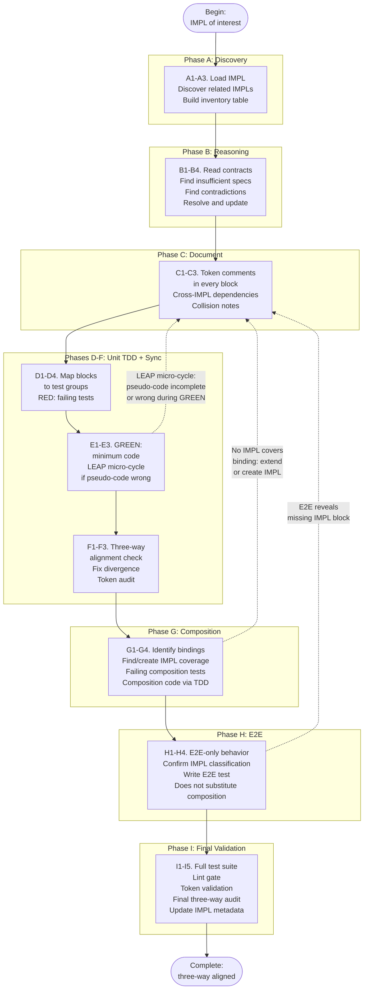

# IMPL-to-Code-and-Tests Linkage

**Audience**: AI agents and developers working in TIED client projects. Process token: `[PROC-IMPL_CODE_TEST_SYNC]`.

**Summary**: This document is the practical guide for analyzing IMPL pseudo-code, discovering related IMPLs, resolving insufficient or contradictory specifications, and synchronizing pseudo-code with managed code and tests so that all three carry identical REQ/ARCH/IMPL token comments. It covers the full path from initial IMPL discovery through unit TDD, composition testing, and E2E behavior.

See `tied/processes.md` § PROC-IMPL_CODE_TEST_SYNC for the canonical 33-step checklist. This document explains **why** each phase matters, **when** to apply key decisions, and provides worked examples.

---

## 1. The Three-Way Alignment Principle

IMPL `essence_pseudocode` is the **source of consistent logic** for an implementation decision. Tests validate that logic; code implements it. For traceability to hold, all three artifacts must carry the **same** REQ/ARCH/IMPL token set on every logical block, with descriptions that correspond:

| Artifact | What the comment says | Example |
|---|---|---|
| **Pseudo-code** | Names the tokens; states **what** the block implements | `# [IMPL-SAVE] [ARCH-PERSISTENCE] [REQ-DATA_SAVE] — validates input then persists via index update` |
| **Test** | Names the same tokens; states **what** the test validates | `// [IMPL-SAVE] [ARCH-PERSISTENCE] [REQ-DATA_SAVE] — validates SAVE_WORKFLOW returns { ok } when input is valid` |
| **Code** | Names the same tokens; states **how** the code implements | `// [IMPL-SAVE] [ARCH-PERSISTENCE] [REQ-DATA_SAVE] — SAVE_WORKFLOW: validates input, delegates index update, returns { ok }` |

**Why this matters**: When any of the three diverge — a token appears in code but not in pseudo-code, or a test validates behavior that pseudo-code does not describe — the traceability chain breaks. The agent (or reviewer) can no longer tell whether the code matches the documented intent. Three-way alignment is the mechanism that keeps TIED's promise: one logical representation (IMPL), with code and tests as its implementation and validation.

### Worked example

**Pseudo-code** (in IMPL detail YAML `essence_pseudocode`):

```
# [IMPL-SAVE] [ARCH-PERSISTENCE] [REQ-DATA_SAVE]
# Validates input and persists a record via the storage index.

INPUT: record (object), options? (object)
OUTPUT: { ok: boolean } or { error: string }

# How this procedure implements the contract.
SAVE_WORKFLOW(record, options):
  IF record empty: RETURN { error: "record required" }
  normalized = NORMALIZE(record)
  # [IMPL-INDEX] [ARCH-PERSISTENCE] [REQ-DATA_SAVE] — delegates index update to IMPL-INDEX.
  INDEX_UPDATE(normalized)
  RETURN { ok: true }
  ON error: RETURN { error: message }
```

**Test** (carries the same tokens, describes what it validates):

```javascript
// [IMPL-SAVE] [ARCH-PERSISTENCE] [REQ-DATA_SAVE] — validates SAVE_WORKFLOW
//   returns { ok: true } when record is valid and INDEX_UPDATE succeeds.
describe("SAVE_WORKFLOW REQ_DATA_SAVE", () => {
  it("returns ok for valid record", () => {
    // Arrange: valid record, mocked INDEX_UPDATE
    // Act: call saveWorkflow
    // Assert: { ok: true }
  });

  // Validates error path from the pseudo-code ON error branch.
  it("returns error when record is empty", () => {
    // Assert: { error: "record required" }
  });
});
```

**Code** (carries the same tokens, describes how it implements):

```javascript
// [IMPL-SAVE] [ARCH-PERSISTENCE] [REQ-DATA_SAVE] — SAVE_WORKFLOW: validates
//   input, normalizes, delegates index update to IMPL-INDEX, returns { ok }.
function saveWorkflow(record, options) {
  if (!record) return { error: "record required" };
  const normalized = normalize(record);
  // [IMPL-INDEX] [ARCH-PERSISTENCE] [REQ-DATA_SAVE] — delegates to INDEX_UPDATE.
  indexUpdate(normalized);
  return { ok: true };
}
```

All three name `[IMPL-SAVE] [ARCH-PERSISTENCE] [REQ-DATA_SAVE]` at the top level. The nested call to `INDEX_UPDATE` names `[IMPL-INDEX]` in all three. If the code added a call to a logging function governed by a different IMPL, the code would need a comment naming that IMPL — and pseudo-code and tests would need to be updated to match (via LEAP).

---

## 2. Phase-by-Phase Guide

The process has nine phases grouped into three stages. Each phase below states what to do, why, and the key decision points.

### Stage 1 — Analysis (Phases A, B, C)

These phases happen **before** any tests or code are written. They ensure the pseudo-code is complete, consistent, and properly documented.

#### Phase A — Discovery

**Goal**: Know which IMPLs are in scope and where their code and tests live.

- [ ] **A1.** Load the IMPL of interest. Record `cross_references`, `related_decisions`, and `traceability`.
- [ ] **A2.** Discover related IMPLs via four paths:
  - (a) Follow `composed_with` and `depends_on` links
  - (b) Query shared REQ/ARCH tokens (MCP `get_decisions_for_requirement` or index grep)
  - (c) Find code-location overlaps (same file/function across IMPLs)
  - (d) Search source for `[IMPL-*]` token references
- [ ] **A3.** Build an inventory table: IMPL token, pseudo-code loaded, code files, test files, testability classification.

**Key decision**: Stop expanding the set when no new IMPLs share code paths, REQ/ARCH tokens, or `composed_with` links with the current set. A large set is a signal that the IMPLs may need decomposition.

#### Phase B — Reasoning

**Goal**: Find and resolve gaps or conflicts in pseudo-code before writing tests.

- [ ] **B1.** Read each IMPL's `essence_pseudocode`. Catalog INPUT/OUTPUT/DATA contracts and procedure names.
- [ ] **B2.** Flag insufficient specs: missing contracts, undefined procedures, unhandled error paths, stub pseudo-code on Active IMPLs, blocks without token comments.
- [ ] **B3.** Flag contradictory specs across IMPLs: shared DATA conflicts, ordering conflicts, incompatible OUTPUT types, duplicate logic with different behavior.
- [ ] **B4.** Resolve: update the affected IMPL pseudo-code so contracts are compatible and ordering is explicit. Propagate to ARCH/REQ via LEAP if scope changed. Validate each changed YAML file with `lint_yaml` per [PROC-YAML_EDIT_LOOP].
- [ ] **B5.** Run pseudo-code validation per [pseudocode-writing-and-validation.md](pseudocode-writing-and-validation.md) using the checklist in [pseudocode-validation-checklist.yaml](pseudocode-validation-checklist.yaml). Address all required (gating) findings before proceeding to Phase C. (B2–B4 align with the checklist’s schema, contract, and symbol-resolution categories.)

**Key decision**: If two IMPLs have irreconcilable ordering or data assumptions, one must be refactored (split or restructured) before proceeding. Do not paper over contradictions — they become bugs in code.

#### Phase C — Documentation

**Goal**: Every pseudo-code block has a token comment naming the REQ/ARCH/IMPL it implements and stating how.

- [ ] **C1.** Apply `[PROC-IMPL_PSEUDOCODE_TOKENS]`:
  - Top-level: `# [IMPL-X] [ARCH-Y] [REQ-Z]` + one-line summary
  - Sub-blocks with same token set: comment only the *how*
  - Sub-blocks with different token set: open with full token list and *how*
- [ ] **C2.** Cross-IMPL dependencies: when IMPL-A's procedure calls or depends on IMPL-B, the calling block in IMPL-A names IMPL-B's tokens so the dependency is visible.
- [ ] **C3.** Collision and composition notes: for each `composed_with` pair, document ordering, shared data, and pre/post conditions.
- [ ] **C4.** Re-run validation (or the reporting/diagnostics pass) so that findings are emitted with severity and source location; confirm no required checks fail.

**Key decision**: When a block depends on another IMPL, name that IMPL in the comment even if the block is small. Invisible dependencies are the primary source of three-way alignment failures.

### Stage 2 — Unit TDD (Phases D, E, F)

These phases implement the IMPL via strict TDD while keeping token comments synchronized.

#### Phase D — Derive Tests

**Goal**: Map pseudo-code to failing tests.

- [ ] **D1.** One pseudo-code block/procedure maps to one test group (`describe`/`it` or test function).
- [ ] **D2.** Each test carries the same token comment as the pseudo-code block it validates, stating *what the test validates*.
- [ ] **D3.** RED: write failing tests before production code. Test names include REQ token.
- [ ] **D4.** Verify each assertion matches the pseudo-code OUTPUT. If no assertion can be written, mark the block `e2e_only` and document `e2e_only_reason`.

#### Phase E — Derive Code

**Goal**: Write minimum code to pass each test.

- [ ] **E1.** GREEN: write only enough code to pass the failing test. Run tests and lint.
- [ ] **E2.** Each code block carries the same token comment as the pseudo-code block it implements, stating *how the code implements*.
- [ ] **E3.** If GREEN reveals pseudo-code is wrong: apply **LEAP micro-cycle** (see Section 3 below).

#### Phase F — Synchronize

**Goal**: Verify three-way alignment after each TDD batch.

- [ ] **F1.** For every block: pseudo-code, test, and code carry the same token set with logically corresponding descriptions.
- [ ] **F2.** If any diverge: update pseudo-code first, then test, then code (LEAP order).
- [ ] **F3.** Run `[PROC-TOKEN_AUDIT]`: every token named in any of the three must exist in `semantic-tokens.yaml`.

### Stage 3 — Expansion (Phases G, H, I)

These phases extend validated unit modules to composition and E2E layers.

#### Phase G — Composition Testing

**Goal**: Test bindings between modules without invoking the UI.

- [ ] **G1.** Identify bindings: event listeners, IPC, entry-point delegation, function wiring.
- [ ] **G2.** For each binding, find the IMPL whose pseudo-code describes it. If none exists, extend an existing IMPL or create a new one.
- [ ] **G3.** Write failing composition test (component/integration/contract) for each binding. The test carries the IMPL block's token comments and verifies: trigger → correct unit → correct args → correct effect, without UI.
- [ ] **G4.** Write composition code to pass the test. Apply three-way alignment.

**Key decision — extend vs. create**: If the binding is a natural part of an existing IMPL's workflow (e.g., wiring up an event handler that the IMPL already describes), extend that IMPL's pseudo-code. If the binding represents a distinct design decision with its own rationale, create a new IMPL.

#### Phase H — E2E

**Goal**: Cover behavior that genuinely requires UI invocation.

- [ ] **H1.** Identify E2E-only behavior: native menus, visual rendering, platform behavior not simulable.
- [ ] **H2.** Confirm the IMPL has `testability: e2e_only` with `e2e_only_reason` naming the platform constraint.
- [ ] **H3.** Write E2E test referencing REQ and IMPL tokens. Comment justifies why composition testing is insufficient.
- [ ] **H4.** E2E does not substitute for composition tests. If a binding is testable below E2E, it must have a composition test.

**Key decision — is this really E2E-only?** Ask: "Can I fire this trigger programmatically (via a function call, message, or event) and observe the effect without a browser/UI?" If yes, it is a composition test, not E2E. E2E-only requires a named platform constraint (e.g., "requires native OS dialog interaction").

#### Phase I — Final Validation

**Goal**: Confirm everything is aligned and passing.

- [ ] **I1.** Run full test suite (unit, composition, E2E). All pass.
- [ ] **I2.** Run lint for each language in scope.
- [ ] **I3.** Run `[PROC-TOKEN_VALIDATION]` / `tied_validate_consistency`. Fix issues.
- [ ] **I4.** Final three-way alignment audit for every IMPL touched. Document remaining `e2e_only` blocks.
- [ ] **I5.** Update each changed IMPL detail: `traceability.tests`, `code_locations`, `metadata.last_updated`. Run `lint_yaml` on each changed detail file (or pass multiple paths in one `lint_yaml` invocation if your wrapper supports it per `processes.md`).

---

## 3. LEAP Micro-Cycle During TDD

The most common alignment failure happens during GREEN (Phase E): the agent writes code to pass a test and discovers the pseudo-code is incomplete, wrong, or missing a dependency. The temptation is to "fix it in code and update docs later." **Do not do this.** Silent divergence is the primary way traceability breaks.

Instead, apply a **LEAP micro-cycle** within the TDD iteration:

```
1. STOP writing code.
2. Update IMPL essence_pseudocode:
   - Add the missing block, fix the contract, or add the new dependency comment.
   - Run `lint_yaml` on the detail file (never raw multi-argument `yq` pretty-print on multiple paths in one process).
3. Update or add the test to match the corrected pseudo-code.
4. Update the production code to pass the corrected test.
5. Verify three-way alignment for the affected block.
```

### Example: TDD iteration triggers LEAP

**Situation**: While implementing `SAVE_WORKFLOW` (GREEN), the agent discovers that `NORMALIZE` can throw a validation error that the pseudo-code does not document.

**Wrong approach**: Add a try/catch in code, add a test for the error, and plan to "update the IMPL later."

**Correct approach (LEAP micro-cycle)**:

1. **Update pseudo-code** — Add an error path to `NORMALIZE`:
   ```
   normalized = NORMALIZE(record)
   ON NORMALIZE error: RETURN { error: "invalid record: " + message }
   ```
2. **Update test** — Add a test case for the normalize error:
   ```javascript
   // [IMPL-SAVE] [ARCH-PERSISTENCE] [REQ-DATA_SAVE] — validates that
   //   SAVE_WORKFLOW returns error when NORMALIZE fails.
   it("returns error when NORMALIZE fails", () => { ... });
   ```
3. **Update code** — Add the try/catch that satisfies the new test:
   ```javascript
   // How SAVE_WORKFLOW handles NORMALIZE failure.
   try { normalized = normalize(record); }
   catch (e) { return { error: `invalid record: ${e.message}` }; }
   ```
4. **Verify alignment** — Pseudo-code, test, and code all name `[IMPL-SAVE]` and describe the normalize-error path.

The pseudo-code remained authoritative at every point. No silent divergence occurred.

---

## 4. Composition and E2E Expansion

### From unit modules to composition

After Phase F, each module is validated independently. Phase G connects them. The key question for each connection point is:

**"Is there an IMPL block that describes this binding?"**

- **Yes** — The binding already has pseudo-code. Write a composition test per that block's token comments. Write composition code to pass it.
- **No, but the binding belongs to an existing IMPL** — Extend that IMPL's pseudo-code to describe the binding (add an ON/WHEN block or wiring procedure). Then write the composition test and code.
- **No, and the binding is a distinct design decision** — Create a new IMPL with its own rationale. Follow `[PROC-YAML_EDIT_LOOP]`. Then proceed with composition test and code.

### The E2E decision

After Phase G, most logic and wiring should be tested. E2E is reserved for the surface:

```
Is the behavior testable by:
  - calling a function?          → unit test (Phase D)
  - firing an event/message?     → composition test (Phase G)
  - only via UI interaction?     → E2E test (Phase H)
```

When marking a block `e2e_only`, the `e2e_only_reason` must name a **specific platform constraint**, not a vague justification. "Complex UI flow" is not sufficient. "Native OS file dialog cannot be triggered programmatically in the test environment" is sufficient.

---

## 5. Process Diagram



---

## 6. Quick Reference

| Phase | Primary output | Key rule |
|---|---|---|
| **A. Discovery** | IMPL inventory table (token, code files, test files, testability) | Follow all four discovery paths; stop when no new IMPLs share code or tokens |
| **B. Reasoning** | Resolved pseudo-code (no gaps, no contradictions) | Resolve spec issues in pseudo-code before writing any test or code |
| **C. Documentation** | Token-commented pseudo-code blocks; cross-IMPL dependency comments | Every block names its REQ/ARCH/IMPL set and states *how* |
| **D. Tests** | Failing unit tests mapped to pseudo-code blocks | One block ~ one test group; test comment names same tokens as pseudo-code |
| **E. Code** | Passing production code | GREEN minimum; LEAP micro-cycle if pseudo-code is wrong |
| **F. Sync** | Three-way alignment verified | Pseudo-code, test, and code carry the same token set per block |
| **G. Composition** | Composition tests for all bindings between modules | Every binding must have IMPL coverage and a composition test (no UI) |
| **H. E2E** | E2E tests for UI-only behavior | E2E-only requires named platform constraint; does not substitute composition |
| **I. Validation** | Full suite green; IMPL metadata updated | `tied_validate_consistency` passes; `traceability.tests` and `code_locations` current |

---

## 7. References

- **Canonical process definition**: `tied/processes.md` § `[PROC-IMPL_CODE_TEST_SYNC]` — the 33-step checklist this document explains
- **Pseudo-code block token rules**: `tied/processes.md` § `[PROC-IMPL_PSEUDOCODE_TOKENS]`; `tied/implementation-decisions.md` § Mandatory essence_pseudocode
- **TDD session workflow**: `tied/processes.md` § `[PROC-TIED_DEV_CYCLE]`; [implementation-order.md](implementation-order.md)
- **LEAP**: `tied/processes.md` § `[PROC-LEAP]`; [LEAP.md](LEAP.md)
- **Test strategy**: `tied/processes.md` § `[PROC-TEST_STRATEGY]`
- **Agent operating guide**: [AGENTS.md](../../AGENTS.md); [ai-principles.md](../../ai-principles.md)
- **IMPL detail schema**: `tied/implementation-decisions.md` § Core data object; `tied/detail-files-schema.md`
- **MCP usage**: [ai-agent-tied-mcp-usage.md](ai-agent-tied-mcp-usage.md)
- **Unified agent checklist**: [agent-req-implementation-checklist.md](agent-req-implementation-checklist.md) (`[PROC-AGENT_REQ_CHECKLIST]`) — sequences all nine phases with CITDP, LEAP, TDD, and validation into a single step-by-step procedure. A trackable YAML is at [agent-req-implementation-checklist.yaml](agent-req-implementation-checklist.yaml) (copy to a unique per-request file per its header).
- **Pseudo-code writing and validation**: [pseudocode-writing-and-validation.md](pseudocode-writing-and-validation.md) — how to write and validate IMPL pseudo-code; when to run validation; minimum gating rules. Checklist: [pseudocode-validation-checklist.yaml](pseudocode-validation-checklist.yaml) (`[PROC-PSEUDOCODE_VALIDATION]`)
