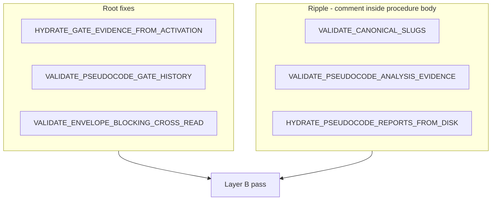

# Layer B sidecar fix — post-W8 close-out

**Status:** Close-out complete 2026-09-11 (`run_id: layerb-sidecar-fix-20260911`); committed.  
**Parent close-out:** [`adherence-realignment-wave8-close-out.md`](adherence-realignment-wave8-close-out.md) (Wave 8 committed `bb73e43`)  
**Grandparent analysis:** [`evidence-collection-conversation-patterns.md`](evidence-collection-conversation-patterns.md) (§13 Wave 8; §13.2 this follow-up)  
**Primary tokens:** `[REQ-TIED_CHECKLIST_GATE_ENFORCEMENT]`, `[IMPL-TIED_CHECKLIST_GATE_ENFORCEMENT]`

**Cursor draft source:** `~/.cursor/plans/layer_b_close-out_e9b854de.plan.md`

---

## Refinement decisions (close-out pass)

| Decision | Accepted value | Rationale |
|---|---|---|
| **Document role** | Post-W8 Layer B follow-up close-out procedure | Sidecar contract precision only; no new wave |
| **TIED applicability** | Full TIED under `[PROC-AGENT_REQ_CHECKLIST]`; extend existing IMPL — no new REQ/ARCH | Same owning REQ as Waves 5–8 |
| **depth_tier** | `minimal` | Sidecar-only; no behavior change; no production code |
| **Inquiry** | **Skip** with documented waiver `inquiry_not_required_sidecar_only` | Contract precision; not integrated activation |
| **Gate policy** | `advisory` | Inherited from Wave 8; no new inquiry findings expected |
| **CITDP timing** | Draft at refine-plan; **finalize at plan-close-out** (`persist-citdp-record`) | `evidence.commands` populated after PSA refresh + close_out runner |
| **Tracker strategy** | **New follow-up tracker** — do not mutate Wave 8 tracker | Preserves Wave 8 historical receipt |
| **Run identity** | `run_id: layerb-sidecar-fix-20260911` | Distinct from `wave8-closeout-20260911` |
| **Unified runner** | **Required** at `close_out` (not optional) | Refreshes envelope after post-W8 sidecar hash change; clears stale PSA/sidecar gaps without Wave 9 inquiry |
| **Commit posture** | `commit_deferred: true` on `traceable-commit` | plan-close-out default; no git commit unless sponsor requests |
| **Regression scope** | **Not required** — no code changed | Optional spot-check only; no FILEHASH smoke; no Wave 8 tracker mutation |

---

## 0. Resolved terms (close-out-specific)

| Sponsor / observed wording | Canonical meaning | Vocabulary RECORD |
|---|---|---|
| **commit_deferred** | `traceable-commit` completed with `policy.commit_deferred: true`; CHANGELOG + proposed message written; sponsor must explicitly request git commit | prompt-composer.md — **plan-close-out (commit deferred)** |
| **layerb-sidecar-fix-20260911** | Identity-bound `run_id` for close_out gate and unified runner on this follow-up | quality-assurance.md — **activation pairing** (minimal depth; no inquiry phases) |
| **inquiry_not_required_sidecar_only** | Documented CITDP waiver: `sub-adversarial-inquiry-pass` **not required** at minimal depth for sidecar-only contract precision | fidelity-research.md — **inquiry waiver** |
| **unified runner required** | Phase 4 **must** run `run-close-out-gates.mjs --phase close_out --envelope-blocking --sync-dispositions --reconcile` — not optional refresh | quality-assurance.md — **single completion entrypoint** |
| **post-W8 sidecar hash drift** | Sidecar changed after Wave 8 commit; PSA Layer C and envelope must refresh before close_out | pseudocode-and-citdp.md — **Layer C gate_mode** |
| **three completion signals** | **Machine close-out**, **process contract**, **adherence ledger** — never conflated in handoff | [`completion-signals-handoff.md`](../tools/bundled-prompt-type-skills/prompt-shared/completion-signals-handoff.md) |

**PRELOAD:** `tied/vocab/prompt-composer.md`, `tied/vocab/pseudocode-and-citdp.md`, `tied/vocab/quality-assurance.md`  
**VALIDATE:** Terms reconciled to §13.2 and Wave 8 template; no new glossary files required.

---

## 1. Context and current gap

**Build-plan handoff (complete):** Layer B sidecar fix applied (+7/−6 lines, 6 blocks); `pseudocode_validate` green (0 diagnostics); `tied_validate_consistency` green.

**Close-out gap:** Uncommitted sidecar delta post-W8 commit; PSA/envelope may reference pre-fix sidecar hash.

| Artifact | Path | Current state |
|---|---|---|
| Sidecar delta | `tied/implementation-decisions/IMPL-TIED_CHECKLIST_GATE_ENFORCEMENT-pseudocode.md` | Uncommitted; Layer B green |
| Validation evidence | `working/REQ-TIED_CHECKLIST_GATE_ENFORCEMENT/evidence/layerb-sidecar-fix-20260911-validation.json` | Present; refresh at plan-close-out |
| Tracker | `working/REQ-TIED_CHECKLIST_GATE_ENFORCEMENT/agent-req-implementation-checklist-layerb-sidecar-fix.yaml` | `planning_refine_complete` at refine-plan |
| CITDP | `working/REQ-TIED_CHECKLIST_GATE_ENFORCEMENT/CITDP-layerb-sidecar-fix.yaml` | `record_status: draft` |
| Pre_implementation receipt | `working/REQ-TIED_CHECKLIST_GATE_ENFORCEMENT/gates/layerb-pre-implementation-refine.json` | Written at refine-plan |
| Wave 8 tracker | `agent-req-implementation-checklist-wave8-adherence-realignment.yaml` | **Do not mutate** — historical W8 receipt |

**Root cause pattern:** External `# [TOKEN]` comments above `procedure` lines are invisible to block scanners or leak into the previous block body — causing false token links and hidden Layer B gaps. Fix: move block-lead comments inside procedure bodies; declare `DATA_TRANSITION: none` on read-only hydrate block.



---

## 2. Artifact paths (authoritative)

| Role | Path |
|---|---|
| Close-out procedure (this document) | `docs/layerb-sidecar-fix-close-out.md` |
| Wave 8 close-out (parent) | `docs/adherence-realignment-wave8-close-out.md` |
| Tracker (follow-up) | `working/REQ-TIED_CHECKLIST_GATE_ENFORCEMENT/agent-req-implementation-checklist-layerb-sidecar-fix.yaml` |
| CITDP (finalize at close-out) | `working/REQ-TIED_CHECKLIST_GATE_ENFORCEMENT/CITDP-layerb-sidecar-fix.yaml` |
| IMPL sidecar | `tied/implementation-decisions/IMPL-TIED_CHECKLIST_GATE_ENFORCEMENT-pseudocode.md` |
| Layer B validation evidence | `working/REQ-TIED_CHECKLIST_GATE_ENFORCEMENT/evidence/layerb-sidecar-fix-20260911-validation.json` |
| PSA Layer C (authoritative) | `working/REQ-TIED_CHECKLIST_GATE_ENFORCEMENT/pseudocode-analysis/IMPL-TIED_CHECKLIST_GATE_ENFORCEMENT.v1.json` |
| PSA evidence (dual path) | `working/REQ-TIED_CHECKLIST_GATE_ENFORCEMENT/evidence/psa-IMPL-TIED_CHECKLIST_GATE_ENFORCEMENT.json` |
| Envelope | `working/REQ-TIED_CHECKLIST_GATE_ENFORCEMENT/evidence/request-evidence-envelope.v1.json` |
| Pre_implementation gate receipt | `working/REQ-TIED_CHECKLIST_GATE_ENFORCEMENT/gates/layerb-pre-implementation-refine.json` |
| Close_out gate receipt (expected) | `working/REQ-TIED_CHECKLIST_GATE_ENFORCEMENT/gates/layerb-sidecar-fix-20260911.json` |
| Merged gate result (expected) | `working/REQ-TIED_CHECKLIST_GATE_ENFORCEMENT/evidence/layerb-closeout-gate-result.json` |
| Reconcile summary (expected) | `working/REQ-TIED_CHECKLIST_GATE_ENFORCEMENT/evidence/layerb-closeout-reconcile-summary.json` |
| Proposed commit message | `working/REQ-TIED_CHECKLIST_GATE_ENFORCEMENT/evidence/proposed-commit-message-layerb.txt` |

---

## 3. Tracker close-out checklist (slug gates)

Use **canonical checklist slugs only**. Do not invent `tied-validate-consistency` — fold MCP consistency evidence into `sync-tied-stack` `evidence_refs`.

### 3.1 Required slugs before `pre_implementation` (refine-plan)

| Slug | Required disposition | Notes |
|---|---|---|
| `session-bootstrap` through `test-strategy` | `completed` | Refine-plan pass |
| `gate-pseudocode-validation` | `completed` | Sidecar + `layerb-sidecar-fix-20260911-validation.json` |
| `sub-adversarial-inquiry-pass` | `not_applicable` | Waiver: `inquiry_not_required_sidecar_only` at minimal depth |

### 3.2 Required slugs before `close_out` gate (plan-close-out)

| Slug | Required disposition | Notes |
|---|---|---|
| All §3.1 slugs | `completed` or `not_applicable` | |
| `sub-pseudocode-validation-pass` | `completed` | If distinct from gate slug; Layer A/B re-run |
| `sub-pseudocode-static-analysis-pass` | `completed` | Refreshed PSA JSON (Phase 2) |
| `sub-close-out-evidence-sync` | `pending` → `completed` | **Completed by unified runner** — do not pre-complete |

### 3.3 Close-out output slugs (after gates pass)

| Slug | Target disposition | Notes |
|---|---|---|
| `sub-close-out-evidence-sync` | `completed` | Typed refs to runner outputs |
| `gitignore-close-out-hygiene` | `completed` | Track validation JSON; leave unrelated PSA gates untracked |
| `sync-tied-stack` | `completed` | Sidecar + close-out doc; include `tied_validate_consistency` receipt in `evidence_refs` |
| `persist-citdp-record` | `completed` | CITDP `record_status: final` |
| `traceable-commit` | `completed` with `commit_deferred: true` | **No git commit** |

**Out of scope slugs (not required at minimal depth):** `unit-test-red`, `unit-test-green`, `composition-integration`, `verification-gate`, `three-way-alignment-unit`, Wave 8 inquiry phases, disposable FILEHASH smoke.

**Dual-write rule:** Sync `execution_evidence.completed` **only** via `--sync-dispositions` in unified runner.

Set tracker `status: closeout_pending_commit` after Phase 5–6.

---

## 4. Blocking policy (close-out)

Aligned with Wave 8 advisory policy; minimal depth narrows scope:

| Diagnostic class | Close-out effect | Blocks Layer B close-out? |
|---|---|---|
| Layer B `pseudocode_validate` diagnostics | `error` | **Yes** |
| **`psa_missing`** when PSA files exist on disk | `error` (hydration regression) | **Yes** |
| **`thin_ledger`** under `--envelope-blocking` | `error` | **Yes** |
| **`tracker_sparse`** / **`tracker_dual_write`** without sync | `error` under `--envelope-blocking` | **Yes** |
| **`merged_decision.allowed: false`** | Gate or envelope blocking | **Yes** |
| Missing inquiry four-pack at minimal depth | **Waived** (`inquiry_not_required_sidecar_only`) | **No** |
| **`finding_unresolved`** (advisory) | `warn` in envelope | **No** |
| **`evidence_stale`** hash drift pre-runner | `warn` | **No** — runner refresh clears |

**Pass definition:** `close_out` gate `allowed: true` **and** envelope zero **blocking** error gaps under `--envelope-blocking`.

---

## 5. Three completion signals (close-out targets)

| Signal | Close-out target | Likely blockers (pre-close-out) |
|---|---|---|
| **Machine close-out** | `close_out` `merged_decision.allowed: true` + envelope zero blocking gaps | Stale PSA/envelope hash; runner not executed |
| **Process contract** | Follow-up tracker + PSA refresh + validation evidence synced | Dual-write until Phase 4 |
| **Adherence ledger** | **n/a** — no ledger-impacting code | Document explicitly in handoff |

If any **blocking** machine or process signal fails, label handoff **incomplete**.

---

## 6. Close-out phases

### Phase 0 — Bootstrap

1. Preface `Observing AI principles!`; PRELOAD vocab per §0.
2. Call **`tied_config_get_base_path`** — must resolve to `/Users/fareed/Documents/dev/chatgpt/stdd/tied/`.
3. Confirm uncommitted diff is **only** the sidecar (+ follow-up working artifacts).

**Gitignore hygiene:** Track `layerb-sidecar-fix-20260911-validation.json`. Leave unrelated untracked `working/REQ-PSEUDOCODE_STATIC_ANALYSIS/gates/*` out of scope.

---

### Phase 1 — Re-validate Layer A + Layer B

Re-run and persist fresh receipts (update evidence JSON):

```bash
# Layer B (mandatory)
# pseudocode_validate via MCP or:
node -e "
const fs=require('fs');
const {validateEssencePseudocode}=require('./mcp-server/dist/analysis/pseudocode-validator.js');
const pc=fs.readFileSync('tied/implementation-decisions/IMPL-TIED_CHECKLIST_GATE_ENFORCEMENT-pseudocode.md','utf8');
const r=validateEssencePseudocode({token:'IMPL-TIED_CHECKLIST_GATE_ENFORCEMENT',pseudocode:pc});
if(!r.ok) process.exit(1);
console.log('ok');
"

# Layer A — tied_validate_consistency (MCP or tied-cli)
```

**Pass criteria:** `pseudocode_validate` → `ok: true`, `diagnostics: []`; `tied_validate_consistency` → `ok: true`.

Update `working/REQ-TIED_CHECKLIST_GATE_ENFORCEMENT/evidence/layerb-sidecar-fix-20260911-validation.json`.

Mark tracker slugs: `gate-pseudocode-validation`, `sub-pseudocode-validation-pass` (if used), `sync-tied-stack` (include consistency receipt).

---

### Phase 2 — Layer C PSA refresh

Sidecar hash changed after Wave 8 commit; refresh PSA for owning IMPL:

```bash
node scripts/backfill-pseudocode-analysis.mjs \
  --req REQ-TIED_CHECKLIST_GATE_ENFORCEMENT \
  --project-root /Users/fareed/Documents/dev/chatgpt/stdd \
  --gate-mode \
  --impl IMPL-TIED_CHECKLIST_GATE_ENFORCEMENT
```

**Authoritative paths:**

- `working/REQ-TIED_CHECKLIST_GATE_ENFORCEMENT/pseudocode-analysis/IMPL-TIED_CHECKLIST_GATE_ENFORCEMENT.v1.json`
- `working/REQ-TIED_CHECKLIST_GATE_ENFORCEMENT/evidence/psa-IMPL-TIED_CHECKLIST_GATE_ENFORCEMENT.json` (if dual path)

**Pass criteria:** PSA `ok: true`, `gate_mode_applied: true`, token/hash match sidecar.

Mark `sub-pseudocode-static-analysis-pass` completed with typed PSA refs.

---

### Phase 3 — Follow-up Tracker + CITDP finalize prep

Confirm tracker slugs per §3. Set `status: verification_pending_closeout` when Phase 1–2 complete.

CITDP remains `record_status: draft` until Phase 5.

---

### Phase 4 — Unified close-out (**required**)

At minimal depth, **no** `sub-adversarial-inquiry-pass`. Unified runner is **mandatory** to refresh envelope after sidecar hash change.

#### 4a. Close_out gate (required)

```bash
node tools/bootstrap/templates/run-close-out-gates.mjs \
  --project-root /Users/fareed/Documents/dev/chatgpt/stdd \
  --request-token REQ-TIED_CHECKLIST_GATE_ENFORCEMENT \
  --tracker-path working/REQ-TIED_CHECKLIST_GATE_ENFORCEMENT/agent-req-implementation-checklist-layerb-sidecar-fix.yaml \
  --citdp-path working/REQ-TIED_CHECKLIST_GATE_ENFORCEMENT/CITDP-layerb-sidecar-fix.yaml \
  --phase close_out \
  --run-id layerb-sidecar-fix-20260911 \
  --envelope-blocking \
  --sync-dispositions \
  --reconcile
```

Also run **`tied_checklist_gate_validate`** with `phase: close_out`, same tracker/CITDP, `run_id: layerb-sidecar-fix-20260911`.

**Pass criteria:**

- `merged_decision.allowed: true`
- Envelope zero **blocking** gaps under `--envelope-blocking`
- Receipt: `gates/layerb-sidecar-fix-20260911.json`
- `sub-close-out-evidence-sync` completed via runner

#### 4b. Post-gate validation

```bash
# tied_validate_consistency (MCP or tied-cli)
```

**Not required:** verification phase runner, FILEHASH disposable smoke, full regression suite, Wave 8 tracker mutation.

---

### Phase 5 — CITDP, docs, CHANGELOG

| Task | Target | Pass criterion |
|---|---|---|
| Finalize CITDP | `CITDP-layerb-sidecar-fix.yaml` | `record_status: final`; `evidence.commands` = validation + PSA + close_out runner |
| Update §13.2 | `docs/evidence-collection-conversation-patterns.md` | Note close-out complete when executed |
| CHANGELOG | `CHANGELOG.md` `[Unreleased]` → **### Changed** | Layer B sidecar hygiene entry |
| Mark `persist-citdp-record` | Tracker slug | `completed` with CITDP ref |

**Gitignore hygiene:** Confirm validation JSON path is trackable; unrelated working gates remain out of scope.

---

### Phase 6 — traceable-commit (deferred)

Write `working/REQ-TIED_CHECKLIST_GATE_ENFORCEMENT/evidence/proposed-commit-message-layerb.txt`:

```
fix(pseudocode): Layer B sidecar hygiene for checklist gate enforcement

Declare DATA_TRANSITION: none on read-only HYDRATE block; move block-lead
token comments inside procedure bodies for six Wave-8-adjacent validators.
Clears post-W8 pseudocode_validate diagnostics without behavior change.

Refs: IMPL-TIED_CHECKLIST_GATE_ENFORCEMENT REQ-TIED_CHECKLIST_GATE_ENFORCEMENT
```

- Mark **`traceable-commit`**: `completed` with `policy.commit_deferred: true`.
- **Do not** `git add` or `git commit`.

**Pass criterion:** CHANGELOG + proposed message written; tracker `status: closeout_pending_commit`.

---

## 7. Close-out acceptance criteria

- [ ] Layer B + Layer A validation green; evidence JSON refreshed
- [ ] PSA Layer C refreshed for `IMPL-TIED_CHECKLIST_GATE_ENFORCEMENT` at authoritative paths
- [ ] Follow-up tracker populated with canonical slugs (no ad-hoc slug names)
- [ ] `sub-close-out-evidence-sync` completed with typed evidence refs via unified runner
- [ ] `close_out` gate `merged_decision.allowed: true`
- [ ] Envelope zero blocking gaps under `--envelope-blocking`
- [ ] CITDP finalized with validation commands
- [ ] `sync-tied-stack` includes `tied_validate_consistency` evidence (not separate slug)
- [ ] Inquiry skip documented: `inquiry_not_required_sidecar_only`
- [ ] CHANGELOG + proposed commit message written
- [ ] `traceable-commit` completed with `commit_deferred: true`; **git commit** pending until sponsor requests

**Delegation:** Invoke **plan-close-out** subagent with this document linked; follow [`tied-close-out-process.md`](../tools/bundled-prompt-type-skills/prompt-shared/tied-close-out-process.md).

---

## 8. Known risks and mitigations

| Risk | Mitigation |
|---|---|
| Stale envelope after sidecar hash change | **Required** unified runner at close_out (Phase 4) |
| Wave 8 tracker confusion | Use new follow-up tracker only; never mutate W8 tracker |
| Inquiry gate blocks minimal tracker | Document waiver `inquiry_not_required_sidecar_only` in CITDP |
| PSA path mismatch | Use authoritative paths in §2 |
| Unrelated untracked gates | `gitignore-close-out-hygiene` — exclude `working/REQ-PSEUDOCODE_STATIC_ANALYSIS/gates/*` |
| `--run-id` with minimal depth + Wave 8 inquiry on disk | `run-close-out-gates-activation.mjs` skips activation collect; `run_id` still used for manifest identity |

---

**Last updated:** 2026-09-11 (close-out complete; runner minimal-depth activation skip follow-up)
