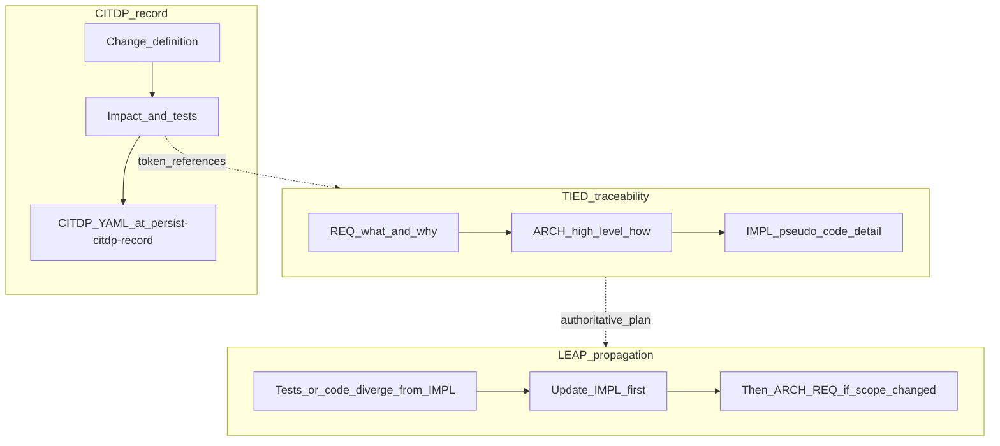
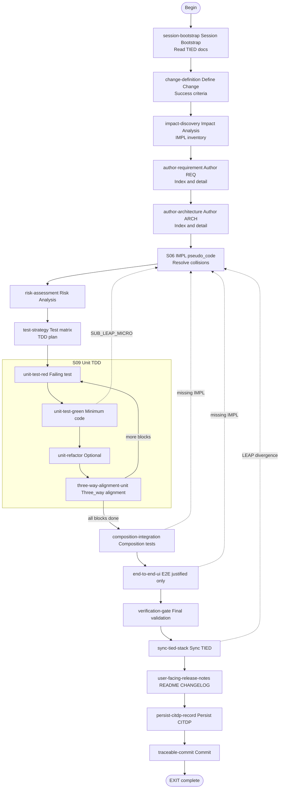

# LEAP, TIED, and CITDP: Costs, Benefits, and Checklist Reference

**TIED Methodology Version**: 2.2.0

**Audience**: Humans (product owners, engineers, reviewers). Process token for the unified procedure: `[PROC-AGENT_REQ_CHECKLIST]`.

This document explains what you gain and what you pay when you combine **TIED** (token-integrated requirements, architecture, and implementation records), **LEAP** (logic elevation and propagation—keeping the written plan and the code in sync), and **CITDP** (change impact and test design procedure—structured analysis before and after implementation). Together they are orchestrated by the **[agent requirement implementation checklist](agent-req-implementation-checklist.md)**; the executable form is **[agent-req-implementation-checklist.yaml](agent-req-implementation-checklist.yaml)**.

---

## How the three pieces fit together

| Piece | What it is | Role in the workflow |
| --- | --- | --- |
| **TIED** | Semantic tokens (`[REQ-*]`, `[ARCH-*]`, `[IMPL-*]`) linking requirements, decisions, tests, and code | Single traceable chain so intent does not get lost in files and commits |
| **LEAP** | When tests or code disagree with IMPL pseudo-code, update **IMPL first**, then propagate to ARCH/REQ if scope changed | Prevents “silent divergence” where the repo drifts from the documented plan |
| **CITDP** | Define the change, analyze impact, plan tests, record risks, persist a **CITDP YAML record** | Makes analysis auditable and reusable; connects back to TIED tokens |

The checklist **`[PROC-AGENT_REQ_CHECKLIST]`** is the spine: it sequences CITDP-style analysis (early steps), TIED authoring (REQ/ARCH/IMPL), strict TDD and validation, LEAP at divergence points, and CITDP persistence (persist-citdp-record). See [methodology-diagrams.md](methodology-diagrams.md) for additional diagrams.

### Three pillars (visual)

*TIED holds the plan; LEAP repairs the plan when reality disagrees; CITDP captures the change story for review and history.*

---

## Benefits

- **Traceability**: Decisions and code map to explicit tokens; reviews and audits have anchors.
- **Fewer silent mistakes**: IMPL pseudo-code is written before RED tests; **sub-leap-micro-cycle** and S09/verification-gate alignment checks reduce “the code works but nobody updated the spec.”
- **Controlled agent and team behavior**: The ordered checklist ([agent-req-implementation-checklist.yaml](agent-req-implementation-checklist.yaml)) gives a repeatable session shape—especially valuable when AI agents implement features in batches.
- **Test design up front**: risk-assessment–test-strategy force risk thinking and a test matrix before the heavy coding loop.
- **Composable quality**: Unit TDD (S09), composition tests (composition-integration), then E2E only where justified (end-to-end-ui)—matches [implementation-order.md](implementation-order.md).
- **Recoverable history**: persist-citdp-record CITDP records (when policy requires them—see `tied/docs/citdp-policy.md` after `copy_files.sh`) document what changed and why.

---

## Costs

- **Time and ceremony**: Authoring REQ/ARCH/IMPL with token-commented pseudo-code before production code is slower than hacking first—by design.
- **Learning curve**: Teams must learn tokens, YAML layout, MCP workflows (typical for TIED projects), and the RED–GREEN–REFACTOR–SYNC loop.
- **Tooling dependency**: Validating and mutating project TIED YAML often assumes the **TIED MCP server**, `lint_yaml`, and `tied_validate_consistency`; workflows degrade if those are skipped or misconfigured.
- **Documentation maintenance**: TIED only pays off if verification-gate–sync-tied-stack are taken seriously; otherwise YAML becomes **documentation rot**—worse than no docs because it misleads.
- **Overkill for tiny spikes**: Throwaway experiments may not warrant full CITDP persistence; project policy (`tied/docs/citdp-policy.md`) governs when to create vs skip records.

---

## For non-programmers

Think of **TIED** like labeled rooms in a building: every important decision has a **name** (a token) on the door, and hallways connect “what we need” → “how we structure it” → “how we build it in detail.”

**LEAP** is like fixing the blueprint when the construction crew discovers the walls are wrong: you **update the blueprint first**, then adjust the build—so the next person does not rely on a wrong plan.

**CITDP** is the **project file for one change**: what we wanted, what we touched, what could go wrong, how we tested it, and what we learned. It is stored as structured data (YAML) so it can be searched and reviewed later.

**What “tokens” are (one paragraph):** A **semantic token** is a stable label such as `[REQ-PAYMENT]` or `[IMPL-CHECKOUT_FLOW]`. It appears in requirements files, design files, pseudo-code, tests, and code comments so that everyone—and automated tools—can follow one thread from business intent to implementation.

**What the checklist prevents:** rushed coding without a shared definition of “done,” tests that do not match any documented requirement, and agents that “fix” code without updating the plan (which LEAP explicitly forbids).

---

## For experts and critics

**When this stack shines:** Long-lived products, regulated or audited environments, multi-developer codebases, and AI-driven implementation where you need **gated steps** and **evidence** (tokens, tests, consistency checks).

**Tradeoffs:**

- **Velocity vs safety:** Documentation-first TDD is slower than prototype-first. For disposable spikes, teams may intentionally run a **subset** of steps; that is a process choice, not a failure—provided someone documents the risk.
- **CITDP record overhead:** Not every one-line fix needs a full CITDP file. Client projects should follow **`tied/docs/citdp-policy.md`** (copied with methodology; see checklist references) for when to persist vs skip persist-citdp-record.
- **MCP as gatekeeper:** Direct edits to `tied/*.yaml` bypassing MCP where tools exist violate the intended workflow and often break consistency; experts should enforce MCP-first or document one-line exceptions per [yaml-update-mcp-runbook.md](yaml-update-mcp-runbook.md).
- **LEAP requires discipline:** If developers skip updating IMPL when behavior changes, LEAP cannot help—the process becomes token theater.
- **Critique of “documentation-first”:** In fast product discovery, you may **prototype first**, then **backfill** REQ/ARCH/IMPL and tests in one LEAP-aware pass. The checklist still applies; the entry point may emphasize change-definition–impact-discovery from observed behavior rather than greenfield intent.

**Related deep dives:** [LEAP.md](LEAP.md), [impl-code-test-linkage.md](impl-code-test-linkage.md), [methodology-diagrams.md](methodology-diagrams.md). After `copy_files.sh`, the same content also lives under `tied/docs/` in client projects.

---

## Full checklist flow (visual)

Adapted from [agent-req-implementation-checklist.md](agent-req-implementation-checklist.md). Node IDs avoid reserved Mermaid keywords.

---

## Compact reference: every checklist step

Canonical definitions, tasks, and branches live in **[agent-req-implementation-checklist.md](agent-req-implementation-checklist.md)** and **[agent-req-implementation-checklist.yaml](agent-req-implementation-checklist.yaml)**. The table below lists each **step id** and a one-line description (from each step’s `goals` in the YAML).

| Step ID | Name | Brief description |
| --- | --- | --- |
| session-bootstrap | Session Bootstrap | Confirm access to governing TIED documents; establish session context and priorities. |
| change-definition | Define Change or New Requirement | State current, desired, and unchanged behavior; non-goals; measurable success criteria. |
| impact-discovery | Impact Analysis and IMPL Discovery | Map affected modules and tokens; build IMPL inventory table for the change. |
| author-requirement | Author/Update REQ | Create or update requirement index and detail; register `[REQ-*]` in `semantic-tokens.yaml`. |
| author-architecture | Author/Update ARCH | Create or update architecture decisions with REQ cross-references. |
| catalog-pseudocode-contracts | Read and Catalog Contracts (Phase B — Reasoning) | Catalog INPUT/OUTPUT/DATA and structure of each IMPL’s `essence_pseudocode`. |
| flag-insufficient-specs | Identify Insufficient Specs | Flag gaps (missing I/O, undefined procedures, missing token comments, stubs on active IMPLs). |
| flag-contradictory-specs | Identify Contradictory Specs | Detect conflicts across IMPLs (data, ordering, outputs, duplicate logic). |
| resolve-pseudocode | Resolve and Update | Fix pseudo-code; GOTO author-architecture/author-requirement if ARCH/REQ scope changes. |
| apply-token-comments | Apply Block Token Comments (Phase C — Documentation) | Apply `[PROC-IMPL_PSEUDOCODE_TOKENS]`; document cross-IMPL dependencies and composition. |
| gate-pseudocode-validation | Run Pseudo-Code Validation | CALL **sub-pseudocode-validation-pass**; gate on validation checklist or documented waiver. |
| persist-implementation-records | Persist IMPL Records | Write implementation index and detail files; register `[IMPL-*]`; validate YAML. |
| risk-assessment | Risk Analysis | List risks with mitigations and token references. |
| test-strategy | Test Determination and Planning | Classify testability per block; build test matrix; plan unit → composition → E2E order. |
| unit-test-red | Write Failing Test (Phase D) | Map pseudo-code to a failing test with matching token comments; no production code. |
| unit-test-green | Write Minimum Production Code (Phase E) | Minimal code to pass; lint; CALL **sub-leap-micro-cycle** if pseudo-code was wrong. |
| unit-refactor | Refactor (optional) | Improve structure without behavior change; re-run tests and lint. |
| three-way-alignment-unit | Three-Way Alignment Check (Phase F) | Align pseudo-code, tests, and code tokens; run token audit; CALL **sub-yaml-edit-loop** as needed. |
| composition-integration | Composition Testing (Phase G) | Failing composition tests then code for bindings; no UI; extend IMPL if missing. |
| end-to-end-ui | E2E Testing (Phase H) | E2E only for UI-only or platform constraints; document `e2e_only_reason`. |
| verification-gate | Final Validation (Phase I) | Full suite, lint, `tied_validate_consistency`, three-way audit, IMPL metadata, module validation. |
| sync-tied-stack | Sync TIED to Code and Tests | Final TIED alignment; LEAP to S06/author-architecture/author-requirement if drift remains. |
| user-facing-release-notes | Update README and CHANGELOG | User-facing and release notes for the session. |
| persist-citdp-record | Persist CITDP Record | Store CITDP YAML under the client project per policy. |
| traceable-commit | Commit | Commit with `[PROC-COMMIT_MESSAGES]` format and token references. |

### Sub-procedures (invoked from steps above)

| Step ID | Name | Brief description |
| --- | --- | --- |
| sub-yaml-edit-loop | YAML Edit and Validation Loop | MCP-first mutations for project TIED YAML; `lint_yaml`; `tied_validate_consistency`; no silent IDE bypass. |
| sub-pseudocode-validation-pass | Pseudo-Code Validation | Run [pseudocode-validation-checklist.yaml](pseudocode-validation-checklist.yaml) categories; gate before tests/code. |
| sub-leap-micro-cycle | LEAP Micro-Cycle During TDD | Stop coding; fix IMPL pseudo-code and tests; align three ways; GOTO author-architecture/author-requirement if scope changes. |

---

## References

| Document | What it provides |
| --- | --- |
| [agent-req-implementation-checklist.md](agent-req-implementation-checklist.md) | Full step text, branches, and sub-procedures |
| [agent-req-implementation-checklist.yaml](agent-req-implementation-checklist.yaml) | Executable checklist with `steps` and `sub_procedures` |
| [methodology-diagrams.md](methodology-diagrams.md) | Traceability stack, TDD loop, CITDP, YAML edit loop |
| [LEAP.md](LEAP.md) | Why IMPL-first reasoning matters for humans and agents |
| [implementation-order.md](implementation-order.md) | Mandatory implementation order |
| `tied/docs/citdp-policy.md` | When to create vs skip a CITDP record (client path after `copy_files.sh`) |

---

**Last updated**: 2026-03-26
