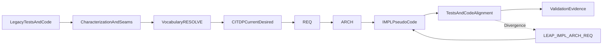

# Legacy C# TIED Adoption Plan

**Status:** Draft for later review and execution  
**Target:** A future non-TIED legacy C# client project  
**Pilot scope:** One bounded module and one representative composition boundary

## Purpose

Combine the legacy-code safety sequence from [Working Effectively with Legacy Code](https://understandlegacycode.com/blog/key-points-of-working-effectively-with-legacy-code/) with TIED vocabulary, CITDP, traceability, strict validation, and LEAP.

TIED adoption is not a rewrite. The first objective is a reliable, language-agnostic specification of accepted behavior while keeping the legacy C# runtime stable.

## Phases

### 1. Create a safe migration boundary

- Make a branch, tag, or separate worktree snapshot before touching the client.
- Create a unique per-request Tracker from [agent-req-implementation-checklist.md](../tied/docs/agent-req-implementation-checklist.md).
- Record the client root, absolute `TIED_BASE_PATH`, commit, .NET SDK, solution/projects, test framework, analyzers, and exact `dotnet restore`, `dotnet build`, and `dotnet test` commands.
- Bootstrap TIED non-destructively with [methodology-migration.md](../tied/docs/methodology-migration.md).
- Preserve project YAML, customized documentation, and existing `.cursor/mcp.json`; keep `tied/methodology/` read-only.
- Verify the effective base path before any project-YAML write.

### 2. Resolve vocabulary and define the change

- PRELOAD the matched glossaries from [routing.md](../tied/vocab/routing.md), especially methodology, TIED YAML MCP, pseudo-code/CITDP, quality assurance, and fidelity research.
- Add a client domain glossary only for genuinely new C# domain concepts.
- Use RESOLVE and RECORD to choose one preferred term for each module, boundary, dependency, state, and externally visible behavior.
- Persist a CITDP record for this behavior-changing brownfield adoption.
- State current behavior, desired behavior, unchanged behavior, non-goals, success criteria, affected modules, risks, and test strategy.
- Keep observed legacy behavior separate from approved desired behavior. Classify differences as specification change, implementation lag, missing specification, translation defect, or unresolved behavior.

### 3. Build the legacy safety net before refactoring

- Inventory the C# solution by bounded module: domain logic, orchestration, persistence, external services, API/UI/CLI, background work, and configuration.
- Run baseline commands and retain results with commit, environment, tool versions, exit codes, and artifacts.
- If tests exist, freeze their passing behavior as characterization evidence; do not rewrite passing tests merely to fit a new specification.
- If coverage is missing, add the smallest characterization tests at seams.
- Break hard dependencies with interfaces, adapters, constructor seams, fakes, or test doubles.
- Capture approval or golden-master outputs only where they represent a stable observable contract.
- Use Sprout and Wrap for isolated new logic.
- Permit scratch refactoring only in a disposable branch/worktree and revert it before the evidence baseline.
- Avoid a big-bang cleanup.

### 4. Translate one module into canonical TIED records

- Apply Track C from [pseudocode-writing-and-validation.md](../tied/docs/pseudocode-writing-and-validation.md): read tests and C# code, author the `IMPL-*-pseudocode.md` sidecar, then align comments.
- Use [impl-pseudocode-from-code-agent-prompt.md](../tied/docs/impl-pseudocode-from-code-agent-prompt.md) as the working procedure.
- Define module boundaries, interfaces, contracts, dependencies, invariants, and validation criteria before integration, satisfying `[REQ-MODULE_VALIDATION]` and `[IMPL-MODULE_VALIDATION]`.
- Author or approve project `[REQ-*]`, `[ARCH-*]`, and `[IMPL-*]` records only after vocabulary resolution.
- Register every token and cross-reference the REQ → ARCH → IMPL stack.
- Keep pseudo-code language-agnostic.
- For C#, explicitly model `Task`/await boundaries, cancellation/timeouts, exceptions as named `FAILURE_MODES`, database/filesystem/network effects, mutable state transitions, ordering, retries, and dependency delegation.
- Give every pseudo-code block a literal token/comment lead.
- For every new or changed Active procedure, include `INPUT`, `OUTPUT`, `DATA`, `CONTROL`, `PRE`, `POST`, `EFFECTS`, and applicable `FAILURE_MODES`, `DATA_TRANSITION`, and `TERMINATION`.

### 5. Gate pseudo-code before new implementation work

- Run Layer A `tied_validate_consistency`.
- Run the pre-RED Layer B pseudo-code pass in this order:
  `tied_data → parsing → schema → symbol_resolution → contract_validation → dependency_graph → reporting`.
- Use `pseudocode_validate`, dependency-cycle analysis, scoped traceability analysis, and collision checks for shared data, effects, ordering, and duplicate logic.
- Mark test-dependent behavioral coverage and traceability rows as N/A with “no tests yet” only during the pre-RED gate.
- Do not use `pre-contract-grammar` for new or changed Active blocks.
- Do not begin new tests or production changes until structural blockers are resolved and the IMPL sidecar is persisted through the TIED YAML tool surface.

### 6. Validate modules independently, then align TDD artifacts

- For newly changed behavior, use strict RED → GREEN → refactor: one test group per pseudo-code block, then minimal C# code.
- For existing characterization behavior, do not manufacture RED failures; retain the baseline and document it as current-behavior evidence.
- Copy each pseudo-code block lead verbatim into the corresponding C# test and production locus.
- Verify assertions against `OUTPUT`, `POST`, and `FAILURE_MODES`.
- Validate each module independently with mocks/test doubles, contract checks, normal and boundary inputs, malformed/empty/duplicate cases, exception/cancellation paths, and integration tests with doubles.
- Record validation results, assumptions, and limitations before integration.

### 7. Prove composition boundaries separately

- Maintain a binding inventory for every DI registration, controller/endpoint, message handler, hosted service, event, CLI entry point, adapter, or orchestration call.
- Each row must capture trigger → callee → arguments → effect → ordering/PRE → failure behavior → composition test.
- Write a failing UI-free composition test before wiring or changing the binding.
- Use in-process C# test hosts and doubles where appropriate.
- Reserve E2E for a named platform constraint that cannot be triggered or observed programmatically.
- Record `testability: e2e_only` and `e2e_only_reason` when E2E is required.
- E2E never replaces composition evidence.

### 8. Apply LEAP only for confirmed divergence

- During retrofit, evidence flows from tests/code into IMPL.
- After the IMPL becomes authoritative, ongoing changes flow IMPL → test → code.
- If behavior changes scope, propagate IMPL → ARCH → REQ in the same work item.
- If only the implementation is wrong, fix tests/code without silently rewriting intent.
- Keep fidelity research stages 0–4 read-only and outside the audited project’s project YAML.
- Require human review before promoting findings or applying Stage 5 remediation.

### 9. Close with reproducible validation and controlled rollout

- Run the full in-scope C# test/build/analyzer/lint commands.
- Run changed-file `lint_yaml`, token validation, `tied_validate_consistency`, pseudo-code minimum-gating validation, binding inventory validation, and applicable quality-profile/evidence-manifest commands.
- Run final vocabulary VALIDATE.
- Reconcile `traceability.tests`, `code_locations`, metadata, CITDP evidence, and proof boundaries.
- State explicitly that structural TIED passes do not prove runtime correctness, security, performance, or usability.
- Start report-only/non-strict.
- Pilot one module plus one binding.
- Define stop criteria and measure false blocks and reproducibility.
- Enable stricter gates only after evidence ownership and waiver expiry are clear.
- On failure, restore the snapshot/tooling and verify prior commands.
- Retain generated TIED records and research evidence rather than deleting them as a rollback shortcut.

## Pilot completion criteria

- One bounded C# module has resolved vocabulary, CITDP, REQ/ARCH/IMPL traceability, and a complete token-commented pseudo-code sidecar.
- Every pseudo-code block has mapped test and production loci with literal three-way alignment.
- Module validation passes independently before integration.
- Every binding has composition evidence or a justified platform-only E2E boundary.
- Structural, token, YAML, C# test/build, and applicable quality-evidence gates pass with provenance retained.
- No unresolved specification-state classification, symbol, contract, dependency, vocabulary, or TIED-base-path issue remains.
- The legacy system remains behavior-compatible unless a reviewed requirement and LEAP propagation explicitly authorize a change.

## Authoritative references

- [TIED client development index](../tied/docs/client-development-index.md)
- [Agent requirement implementation checklist](../tied/docs/agent-req-implementation-checklist.md)
- [TIED methodology migration](../tied/docs/methodology-migration.md)
- [IMPL pseudo-code writing and validation](../tied/docs/pseudocode-writing-and-validation.md)
- [CITDP policy](../tied/docs/citdp-policy.md)
- [Composition coverage](../tied/docs/composition-coverage.md)
- [TIED fidelity research plan](tied-fidelity-research-plan.md)
- [TIED vocabulary layer](vocabulary-layer-tied-leap-citdp.md)
