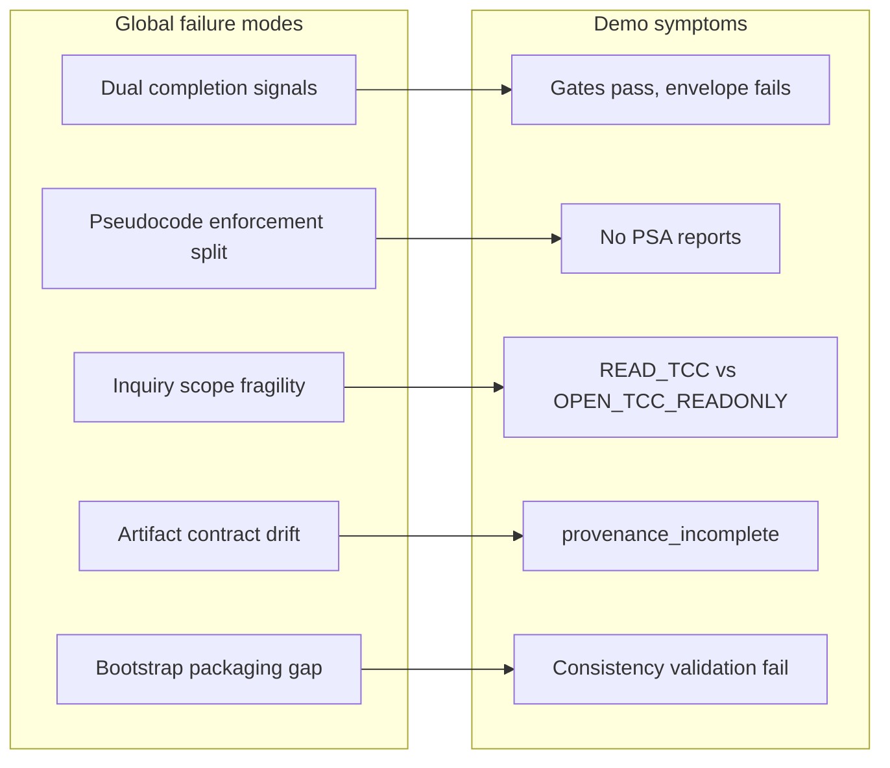
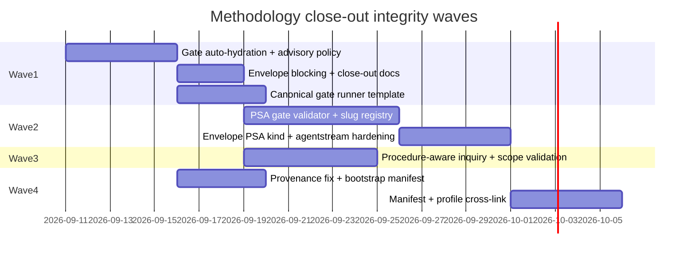

# Methodology Close-Out Integrity Plan

**Status:** Implemented (close-out complete 2026-09-10) — Waves 1–4 shipped; stdd primary REQ close_out gate and envelope reconciled; demo client `1789069630` remains document-only regression
**Scope:** Cross-cutting methodology fixes exposed by demo client `1789069630` (`mac-perms-report`) and confirmed in `stdd` tooling
**Primary tokens:** `[REQ-TIED_CHECKLIST_GATE_ENFORCEMENT]`, `[REQ-REQUEST_EVIDENCE_ENVELOPE]`, `[REQ-PSEUDOCODE_STATIC_ANALYSIS]`, `[REQ-TIED_ADVERSARIAL_INQUIRY]`, `[REQ-TIED_SETUP]`, `[REQ-QUALITY_ASSURANCE_EVIDENCE]`, `[REQ-EVIDENCE_CHAIN_PROFILE]`, `[PROC-AGENT_REQ_CHECKLIST]`, `[PROC-PSEUDOCODE_VALIDATION]`
**Regression fixture:** `/Users/fareed/Documents/dev/test/1789069630` (frozen after initial demo; re-run gates/envelope after each wave)
**Related plans:** [`checklist-adherence-improvement-plan.md`](checklist-adherence-improvement-plan.md) (Stages G–O complete; this plan extends producer/consumer alignment to envelope and pseudocode layers)

---

## Executive summary

Demo client `1789069630` was built to showcase updated pseudocode contracts and evidence tooling. It passes checklist gate receipts (`allowed: true`) while the request evidence envelope lists **10 severity:error gaps**, ships **zero Layer C pseudocode-analysis reports**, uses **non-canonical checklist slugs**, and triggers **systematic provenance validation failures**. These are not demo-client bugs alone—they reveal **five global failure modes** in methodology enforcement:

1. **Dual completion signals** — gate and envelope disagree; agents treat gate receipts as sole proof of close-out.
2. **Documentation–enforcement split** — Layer C pseudocode gates are mandatory in checklist prose but not validated by `tied_checklist_gate_validate`.
3. **Inquiry scope fragility** — adversarial inquiry block IDs are caller-supplied; sidecar procedure names are not validated.
4. **Artifact contract drift** — provenance producer/validator schema mismatch; stale root inquiry projections.
5. **Bootstrap packaging gap** — `ARCH-TIED_BOOTSTRAP_CROSS_PLATFORM` referenced in copied methodology pseudocode but not shipped to clients.

This plan sequences four **waves** of cohesive methodology work. Each wave delivers enforceable contracts, tests, and a regression re-run on demo client `1789069630`. **Do not patch the demo client in isolation** before Wave 1–2 land—manual fixes recreate false confidence.

**Recommendation:** Authorize Wave 1 immediately (highest leverage, unblocks truthful close-out). Wave 2 is prerequisite for typed-flow promotion (`REQ-PSEUDOCODE_TYPED_FLOW`). Waves 3–4 can parallelize after Wave 1.

## Refinement decision and gate posture

This document is an implementation-ready **plan**, not an implementation
authorization or a close-out receipt. The plan is refined with the following
accepted decisions:

- **TIED applicability:** full TIED workflow under `[PROC-AGENT_REQ_CHECKLIST]`;
  the work changes gate, envelope, inquiry, bootstrap, and evidence behavior.
- **Inquiry depth:** `depth_tier: integrated` for each behavior-changing wave.
  Close-out integrity is an explicit eligibility trigger; a downgrade to
  `minimal` requires a sponsor-approved `integrated_waiver` with owner, expiry,
  rationale, and approval.
- **Gate policy:** `gate_policy: advisory` for observed/unresolved inquiry
  findings during development. This does not waive structural or evidence
  contract failures, and it does not make an unsuccessful verification or
  close-out gate successful.
- **Quality profiles:** `baseline-functional` is required for every wave;
  `data-integrity-migration` applies to envelope/provenance layout changes;
  `stateful-reliability` applies to phase artifact persistence and replay.
  `[REQ-QUALITY_ASSURANCE_EVIDENCE]` remains the proof-boundary owner.
- **CITDP timing:** each wave gets its own CITDP before RED tests and after
  the plan is approved; the final persisted CITDP is produced at
  `persist-citdp-record` per `tied/docs/citdp-policy.md`. This refinement does
  not create a premature final CITDP.
- **Gate status:** the required `pre_implementation` gate is **not yet
  satisfied** for this plan because no wave-specific CITDP or identity-bound
  integrated inquiry receipt exists. Implementation must stop until the
  selected wave has both.
- **Eligibility triggers matched** (record at `risk-assessment` per
  `docs/integrated-activation-checklist-enforcement-plan.md` §7):
  `strict-close-out` (unifies gate and envelope close-out),
  `methodology-tooling-change` (stdd gate/envelope/inquiry/bootstrap),
  `persistence` (phase artifact directories, provenance, envelope layout),
  `external-input` (demo client and disposable-client replay). No
  `integrated_waiver`; `depth_tier: integrated` is mandatory for each wave.

### Blocking policy matrix

| Diagnostic class | Advisory inquiry policy | Close-out effect |
|---|---|---|
| Observed/unresolved inquiry finding | Visible, non-blocking | Envelope records `warn`; no error gap |
| Strict finding or confirmed error-severity finding | Blocking | Gate and envelope record `error` |
| Missing/malformed activation, stale phase artifact, invalid hash | Always blocking | `error`; waiver only where the contract explicitly permits it |
| Unknown slug, synthetic Tracker, missing PSA report, invalid provenance | Always blocking | `error`; no advisory downgrade |
| Valid documented waiver | Non-blocking only within waiver scope | Envelope records the waiver and residual risk |

The envelope’s “zero error gaps” target therefore means zero **blocking**
error gaps, not zero observations. Gate and envelope must derive the same
effective severity from this matrix.

### Refinement acceptance criteria

- Every wave names a single owning requirement/architecture/implementation
  chain, a Tracker copy, a CITDP location, and a phase-specific regression.
- Every behavior-changing deliverable has RED unit tests, module validation,
  composition coverage where wiring changes, and a verification command.
- Every integrated phase uses a distinct `run_id` and the authoritative
  `working/{REQ-TOKEN}/adversarial-inquiry/phase-{phase}/` directory.
- Every close-out claim requires `allowed: true` from
  `tied_checklist_gate_validate` **and** an envelope with no blocking error
  gaps; advisory findings remain explicitly visible.
- No demo-client repair is accepted as methodology evidence unless the same
  behavior is covered by a stdd regression and a disposable-client replay.

---

## 0. Resolved terms

| Sponsor / observed wording | Canonical meaning |
|---|---|
| dual completion signals | Gate receipt (`checklist-gate-receipt.v1`) vs request evidence envelope (`request-evidence-envelope.v1`) both claiming close-out completeness with different criteria |
| gate auto-hydration | `tied_checklist_gate_validate` loads phase artifact paths from activation and runs A3/A5 validators without requiring callers to pass optional `evidence` |
| envelope blocking | Close-out requires envelope `gaps[]` with zero `severity: error` entries (or documented waiver per gap code) |
| slug compression | Invented or shortened checklist slugs (e.g. `author-implementation`) substituting for the canonical IMPL pseudo-code chain |
| canonical slug registry | Validated set of checklist step slugs from `tied/docs/agent-req-implementation-checklist.yaml`; unknown slugs rejected at gate |
| Layer C artifact | `working/{REQ-TOKEN}/pseudocode-analysis/{IMPL-TOKEN}.v1.json` from `pseudocode_analyze` with `gate_mode: true` |
| PSA gate pass | Report satisfies PSA-GATE-001..004: `ok: true`, `gate_mode_applied: true`, no error diagnostics, no undocumented truncation |
| advisory finding policy | Inquiry findings with `lifecycle: observed` or gate `verdict: UNRESOLVED` are review evidence; under advisory policy they must not block progression **only when** policy is honored consistently in gate and envelope |
| stale root projection | Legacy copies under `working/{REQ}/adversarial-inquiry/` when authoritative phase dirs `phase-{phase}/` exist |
| procedure-aware discovery | Shared block-name extraction from sidecars via PSA `scanProcedureBlocks`, not first `##` heading alone |
| bootstrap packaging gap | Methodology files copied to clients reference tokens absent from client methodology indexes |

Vocabulary touchpoints: preload `tied/vocab/pseudocode-and-citdp.md`, `tied/vocab/quality-assurance.md`, `tied/vocab/fidelity-research.md` before implementation.

---

## 1. Confirmed gaps (evidence)

### 1.1 Demo client gate vs envelope (2026-09-10)

| Check | Gate result | Envelope result |
|---|---|---|
| `tied_checklist_gate_validate` verification | `allowed: true` | — |
| `tied_checklist_gate_validate` close_out | `allowed: true` | — |
| `request-evidence-envelope.v1.json` | Not consulted by gate | **10 error gaps** |
| Layer C reports | Not checked | **0 files** under `pseudocode-analysis/` |
| Canonical slugs | Not validated | `author-implementation`, `close-out` (invalid) |

Envelope gap codes observed: `artifact_path_root_projection_rejected` (×4), `finding_unresolved` (×2), `warn_not_success` (×2), `provenance_incomplete:schema_version` (×2).

### 1.2 Methodology repo self-check

| Check | Result |
|---|---|
| `working/REQ-*/pseudocode-analysis/` in stdd | **0 artifacts** — dogfood gap matches demo |
| `checklist-validator.ts` references to `pseudocode-analysis` | **None** |
| `validateFindingDisposition` honors `gatePolicy` | **No** — param accepted at call site but diagnostics always block `finding_unresolved` / `warn_not_success` |
| Canonical `run-close-out-gates.mjs` in `tools/bootstrap/templates/` | **Absent** — six working-folder copies exist (e.g. `working/REQ-PSEUDOCODE_STATIC_ANALYSIS/`) as promotion prototypes for W1-D6 |
| Provenance producer (`checklist-integration.ts`) | Writes `schemaVersion` at **file root** |
| Provenance validator (`validateProvenanceComplete`) | Reads `schemaVersion` from **inner** `provenance` object |
| `ARCH-TIED_BOOTSTRAP_CROSS_PLATFORM` in bootstrap manifest | **Absent** from `INHERITED_DETAIL_REQUIRED` |
| Demo client `tied_validate_consistency` | `ok: false` — missing ARCH ref in methodology `IMPL-TIED_FILES` |

### 1.3 Root cause map



---

## 2. Design principles

1. **One truthful close-out** — Progression gate and audit envelope must consume the same remediation diagnostics; neither alone suffices at integrated depth.
2. **Enforce what we document** — Every mandatory checklist step must have a mechanical validator or an explicit, test-covered waiver contract.
3. **Shared pseudocode primitives** — Inquiry block discovery, Layer C parser, and sidecar authoring must use the same procedure naming surface.
4. **Fail closed on integrated close-out** — Synthetic trackers, invented slugs, and optional evidence omission must not pass verification/close_out without waiver.
5. **Clients inherit intact methodology** — Copied pseudocode must not reference tokens absent from client methodology indexes.

---

## 3. Wave 1 — Unify completion signals (P0)

**Goal:** Eliminate false confidence where gate receipts say complete while envelope lists error gaps.

**Owning tokens:** `[REQ-TIED_CHECKLIST_GATE_ENFORCEMENT]`, `[REQ-REQUEST_EVIDENCE_ENVELOPE]`, `[IMPL-TIED_CHECKLIST_GATE_ENFORCEMENT]`, `[IMPL-REQUEST_EVIDENCE_ENVELOPE]`

### 3.1 Deliverables

| ID | Deliverable | Primary files |
|---|---|---|
| W1-D1 | **Gate evidence auto-hydration** — When `activation.artifacts` present at `verification`/`close_out`, load phase `gate-result.json`, `finding-ledger.jsonl`, `evidence-provenance.json` and run `validateProvenanceComplete` + `validateFindingDisposition` unconditionally | `mcp-server/src/checklist-validator.ts`, MCP tool wrapper |
| W1-D2 | **Advisory policy semantics** — Honor `gate_policy: advisory` in finding disposition: advisory → non-blocking diagnostics; strict → blocking | `checklist-validator.ts`, tests |
| W1-D3 | **Envelope blocking mode** — Add `fail_on_error_gaps: true` to envelope validate; document in `tied/docs/request-evidence-envelope.md` | `mcp-server/src/request-evidence-envelope/` |
| W1-D4 | **Unified close-out contract** — Update `plan-close-out` skill, `tied/docs/processes.md`, `[PROC-AGENT_REQ_CHECKLIST]` close-out step: completion = gate `allowed` **AND** envelope zero error gaps (or waiver registry entry per gap code) | `.cursor/skills/plan-close-out/`, docs |
| W1-D5 | **Synthetic tracker rejection** — At `verification`/`close_out`, reject in-memory trackers unless loaded from authoritative file path (extend A2 beyond explicit markers) | `checklist-validator.ts` |
| W1-D6 | **Canonical gate runner template** — Publish `tools/bootstrap/templates/run-close-out-gates.mjs` (or extend existing remediation runner) using `derivePhaseAwareSlugs`, authoritative tracker file, full evidence hydration, envelope build+validate | `tools/bootstrap/`, docs |

### 3.2 Acceptance criteria

- [ ] Demo client re-run: the legacy caller path is documented as legacy; the
  shipped gate runner auto-hydrates phase evidence and applies the blocking
  policy matrix.
- [ ] Demo client re-run: envelope blocking mode rejects structural/evidence
  errors and reports advisory findings as warnings; root stale projections
  remain blocking until removed.
- [ ] Unit tests: gate fails when phase `gate-result.json` has `verdict: UNRESOLVED` under strict policy; passes under advisory with documented waiver.
- [ ] Unit tests: in-memory tracker rejected at `close_out` integrated depth.
- [ ] `tied_verify` optional hook: when an envelope path is present, consult
  blocking validation before status mutation; the flag remains default-off
  until the Wave 1 regression is green.

### 3.3 LEAP / doc updates

- IMPL pseudo-code for `[IMPL-TIED_CHECKLIST_GATE_ENFORCEMENT]` — document auto-hydration in `VALIDATE_CHECKLIST_GATE`.
- IMPL pseudo-code for `[IMPL-REQUEST_EVIDENCE_ENVELOPE]` — document blocking validate mode.
- CITDP: `working/REQ-TIED_CHECKLIST_GATE_ENFORCEMENT/CITDP-wave1-unified-closeout.yaml` (or extend existing).

### 3.4 Demo regression (Wave 1 exit)

1. Remove root `adversarial-inquiry/*` copies (keep `phase-*` only).
2. Re-run canonical gate runner with authoritative tracker.
3. Expect: finding disposition matches the policy matrix; stale root
   projections remain visible as blocking envelope gaps until W4-D2; the
   regression records the exact blocking-gap count rather than assuming a
   fixed reduction.

---

## 4. Wave 2 — Enforce pseudocode pipeline (P0)

**Goal:** Layer C artifacts and canonical slug sequences become mechanical gate requirements, not checklist honor system.

**Owning tokens:** `[REQ-PSEUDOCODE_STATIC_ANALYSIS]`, `[REQ-QUALITY_ASSURANCE_EVIDENCE]`, `[IMPL-QUALITY_PSEUDOCODE_VALIDATOR]`, `[PROC-PSEUDOCODE_VALIDATION]`

### 4.1 Deliverables

| ID | Deliverable | Primary files |
|---|---|---|
| W2-D1 | **`validatePseudocodeAnalysisEvidence`** — For each changed in-scope IMPL in tracker `impl_inventory`: require PSA JSON path, validate schema, `ok`, `gate_mode_applied`, optional hash vs sidecar | `checklist-validator.ts` |
| W2-D2 | **Cross-phase invariant** — `verification-gate` / `close_out` cannot pass unless `gate-pseudocode-validation` completed (or waived with contract) appears in tracker history | `checklist-validator.ts`, tests |
| W2-D3 | **Canonical slug registry** — Reject unknown slugs in tracker `steps[]` and `execution_evidence.completed` against checklist YAML index | `checklist-validator.ts` or shared slug loader |
| W2-D4 | **Envelope artifact kind** — Add `pseudocode_analysis_report` to envelope builder with proof boundary `pseudocode_gate_only` | `request-evidence-envelope/build.ts` |
| W2-D5 | **Agentstream hardening** — Tracker writer validates slug names; composition test: pseudocode chain slugs precede `unit-test-red` in disposition order | `tools/agentstream/checklist/` |
| W2-D6 | **Backfill script** — `scripts/backfill-pseudocode-analysis.mjs`: run `pseudocode_analyze` with `gate_mode: true` for IMPL sidecars under a REQ scope | `scripts/` |

### 4.2 Acceptance criteria

- [ ] Demo client: five project IMPL PSA reports generated; each report has
  `ok: true`, `gate_mode_applied: true`, matching `input_identity`, and a
  phase-local evidence reference; the gate passes PSA checks at
  `verification`.
- [ ] Gate fails when PSA report missing, `ok: false`, or `gate_mode_applied: false`.
- [ ] Gate fails when tracker contains `author-implementation` slug (`invalid_slug` diagnostic).
- [ ] stdd dogfood: at least one `working/REQ-*/pseudocode-analysis/` populated for an integrated close-out REQ (e.g. `REQ-PSEUDOCODE_STATIC_ANALYSIS`).
- [ ] REQ `[REQ-PSEUDOCODE_STATIC_ANALYSIS]` satisfaction criteria met in validator tests.

### 4.3 Dependency

- Wave 2 gate checks assume Wave 1 auto-hydration and the blocking policy
  matrix (consistent evidence wiring and severity).
- **Block typed-flow Phase 3 production promotion** until W2-D1 and W2-D2 ship (avoid third unenforced pseudocode layer).

### 4.4 Demo regression (Wave 2 exit)

1. Run backfill for `REQ-MACOS_PERM_REPORT` (5 IMPLs).
2. Replace tracker slugs with canonical chain; mark `gate-pseudocode-validation` completed with typed `evidence_refs` pointing at PSA JSON.
3. Re-run gates + envelope; expect pseudocode-related envelope completeness.

### 4.5 PSA scope contract

`impl_inventory` is the authoritative set of changed/in-scope IMPL tokens for
the request. The validator must reject an empty inventory when the tracker
claims a changed IMPL set, and must reject a report whose sidecar hash,
request token, or IMPL token does not match that inventory. Unchanged legacy
IMPLs may use the documented `pre-psa-grammar` disposition, but a newly
changed sidecar may not silently inherit it.

---

## 5. Wave 3 — Inquiry scope alignment (P1)

**Goal:** Adversarial inquiry obligations derive from live sidecar procedures; scope IDs are validated at run time.

**Owning tokens:** `[REQ-TIED_ADVERSARIAL_INQUIRY]`, `[IMPL-TIED_ADVERSARIAL_INQUIRY]`, `[IMPL-TIED_ADVERSARIAL_INQUIRY_CHECKLIST]`

### 5.1 Deliverables

| ID | Deliverable | Primary files |
|---|---|---|
| W3-D1 | **Procedure-aware block discovery (Mode B)** — Use shared `scanProcedureBlocks` from pseudocode analysis; prefer explicit `block_name`, else all procedures, not first `##` only | `adversarial-inquiry/project-orchestrator.ts` |
| W3-D2 | **Scope validation** — At inquiry run: fail fast when scope block IDs don't match any sidecar procedure or `resolveBlockIdentity` output | `adversarial-inquiry/`, MCP tool |
| W3-D3 | **Mode A/B scope documentation** — CITDP template + `docs/adversarial-inquiry-adoption.md`: criterion IDs (Mode B) vs block IDs (Mode A); `#closeout` tag convention | docs, templates |
| W3-D4 | **Multi-block close-out support** — Optional scope list covering all changed IMPL procedures for integrated close_out | `project-orchestrator.ts`, checklist sub |

### 5.2 Acceptance criteria

- [ ] Demo client: re-run inquiry with aligned scope; `READ_TCC#closeout` finding eliminated or explicitly waived with scope fix documented.
- [ ] Test: refactored sidecar procedure names invalidate stale `block_name` in IMPL YAML with clear diagnostic.
- [ ] Test: Mode B produces criterion-scoped report; Mode A produces block-scoped report; docs distinguish them.

### 5.3 Demo regression (Wave 3 exit)

1. Set inquiry scope from live `IMPL-TCC_DB_READER` procedures (e.g. `OPEN_TCC_READONLY`, `MERGE_RESULTS`).
2. Re-run integrated inquiry at verification + close_out.
3. Expect: no `semantic_fidelity` completeness finding for phantom `READ_TCC` block.

---

## 6. Wave 4 — Artifact contracts and bootstrap integrity (P1–P2)

**Goal:** Fix systematic false positives/negatives in evidence artifacts; clients inherit consistent methodology tokens.

**Owning tokens:** `[REQ-TIED_SETUP]`, `[REQ-QUALITY_ASSURANCE_EVIDENCE]`, `[REQ-EVIDENCE_CHAIN_PROFILE]`, `[ARCH-TIED_BOOTSTRAP_CROSS_PLATFORM]`, `[IMPL-TIED_FILES]`

### 6.1 Deliverables

| ID | Deliverable | Primary files |
|---|---|---|
| W4-D1 | **Provenance schema contract** — Align producer and validator: either move `schemaVersion` into inner `provenance` **or** teach validator to read root wrapper (prefer validator fix for backward compatibility) | `checklist-validator.ts`, `checklist-integration.ts`, tests |
| W4-D2 | **Stop dual inquiry layout** — When persisting phase artifacts, do not write root projections; migration note for existing clients | `checklist-integration.ts` |
| W4-D3 | **Manifest in close-out template** — Gate runner invokes evidence manifest collection per CITDP quality matrix | canonical gate runner, `quality-evidence-collect` |
| W4-D4 | **Envelope ↔ evidence-chain-profile** — Optional cross-link when `profile_depth` measured; gap when integrated depth expects profile | envelope builder |
| W4-D5 | **Bootstrap manifest fix** — Add `ARCH-TIED_BOOTSTRAP_CROSS_PLATFORM` detail to `tools/bootstrap/manifest.json` `INHERITED_DETAIL_REQUIRED`; copy to `templates/` | `tools/bootstrap/`, `templates/` |
| W4-D6 | **Bootstrap verify lint** — `copy_files` post-verify: methodology pseudocode ARCH/REQ refs must exist in client methodology indexes | `tools/bootstrap/lib/verify.mjs` |

### 6.2 Acceptance criteria

- [ ] Demo client envelope: zero `provenance_incomplete:schema_version` gaps after re-run.
- [ ] New disposable client from pipeline: `tied_validate_consistency` passes
  for methodology refs, including `ARCH-TIED_BOOTSTRAP_CROSS_PLATFORM`.
- [ ] Demo client CITDP quality matrix linked to manifest artifact (or documented N/A with limitation).
- [ ] Bootstrap verification fails before publication when an inherited
  methodology detail references a missing REQ/ARCH/IMPL token; it reports the
  missing token and destination path deterministically.

---

## 7. Implementation sequence



| Wave | Can start after | Parallel with | Blocks |
|---|---|---|---|
| Wave 1 | Plan approval, wave-1 CITDP, pre-implementation gate | — | Waves 2–4 benefit from W1-D1 |
| Wave 2 | W1-D1 merged | Wave 3, Wave 4-D1 | Typed-flow production promotion |
| Wave 3 | W1-D2 (advisory semantics) and wave-3 CITDP | Wave 2, Wave 4 | — |
| Wave 4 | Wave-4 CITDP and bootstrap test fixture | Wave 1–3 | Full demo green envelope |

**Suggested REQ ownership for implementation tracking:**

| Wave | Primary REQ folder | Secondary |
|---|---|---|
| 1 | `working/REQ-TIED_CHECKLIST_GATE_ENFORCEMENT/` | `working/REQ-REQUEST_EVIDENCE_ENVELOPE/` |
| 2 | `working/REQ-PSEUDOCODE_STATIC_ANALYSIS/` | extend gate enforcement REQ |
| 3 | extend `REQ-TIED_ADVERSARIAL_INQUIRY` working folder | — |
| 4 | `working/REQ-TIED_SETUP/` (bootstrap) | quality/evidence REQs |

Each wave follows `[PROC-AGENT_REQ_CHECKLIST]`: change-definition →
impact-discovery → risk-assessment (depth/policy) → wave CITDP →
IMPL pseudo-code and Layer B/C validation → RED tests → independent module
validation → implementation → composition tests → integrated inquiry at
`pre_implementation`, `verification`, and `close_out` → gate receipt +
envelope regression on the demo client → `tied_verify` →
`tied_validate_consistency`.

The implementation order is strict within a wave. Cross-wave parallelism is
allowed only after the dependency row above is satisfied; a parallel wave
must not share a mutable Tracker, CITDP, phase artifact directory, or gate
receipt.

### 7.1 Per-wave planning artifacts

The plan-level Tracker copy is
`working/REQ-TIED_CHECKLIST_GATE_ENFORCEMENT/methodology-closeout-integrity-tracker.yaml`.
Each wave then copies that Tracker into its owning REQ folder and replaces the
plan-level `request` value with the wave’s primary request token.
Wave-specific CITDPs are deferred until sponsor approval, then use:

- `working/REQ-TIED_CHECKLIST_GATE_ENFORCEMENT/CITDP-wave1-unified-closeout.yaml`
- `working/REQ-PSEUDOCODE_STATIC_ANALYSIS/CITDP-wave2-pseudocode-enforcement.yaml`
- `working/REQ-TIED_ADVERSARIAL_INQUIRY/CITDP-wave3-inquiry-scope.yaml`
- `working/REQ-TIED_SETUP/CITDP-wave4-bootstrap-integrity.yaml`

Each CITDP records `depth_tier: integrated`, `gate_policy: advisory`,
`eligibility_triggers_matched`, quality profiles, scope hashes, and the three
required phase gate/replay commands. A missing CITDP is a planning blocker,
not a reason to reuse a prior stage record.

Minimum CITDP fields per wave (in addition to `tied/docs/citdp-record-template.yaml`):

| Field | Requirement |
|---|---|
| `risk_analysis.adversarial_inquiry.depth_tier` | `integrated` |
| `risk_analysis.adversarial_inquiry.gate_policy` | `advisory` (strict requires separate approval) |
| `risk_analysis.adversarial_inquiry.eligibility_triggers_matched` | Non-empty; wave-specific subset of program triggers |
| `risk_analysis.adversarial_inquiry.prior_depth_tier` | `null` on first wave CITDP; prior wave tier when upgrading |
| `risk_analysis.quality_profiles` | At least `baseline-functional`; add migration/reliability when envelope or phase persistence changes |
| `completion_criteria.activation` | Populated after each phase inquiry run; hashes must match phase dir |
| `evidence.commands` | Exact regression commands from §7.2 for that wave |

### 7.2 Wave verification commands

Commands populate each wave CITDP `evidence.commands`. Labels:

- **Today** — runnable against current `mcp-server/dist` without wave deliverables.
- **Target** — requires the named wave deliverable (script, flag, or template) first.

Replace `{REQ}`, `{PHASE}`, `{DEMO_ROOT}`, and `{DISPOSABLE_CLIENT}` before running.

**Shared (every wave, after wave CITDP + Tracker copy exist):**

| Step | Label | Command |
|---|---|---|
| Build | Today | `npm run build --prefix mcp-server` |
| Unit regression | Today | `node --test mcp-server/dist/checklist-validator.test.js` |
| Pre-implementation gate | Today | MCP `tied_checklist_gate_validate` with wave Tracker + CITDP + activation when integrated |
| TIED consistency | Today | MCP `tied_validate_consistency` |

**Wave 1 — unified close-out (`REQ-TIED_CHECKLIST_GATE_ENFORCEMENT`):**

| Step | Label | Command |
|---|---|---|
| Remediation matrix | Today | `node --test mcp-server/dist/checklist-remediation-acceptance.test.js` |
| Envelope unit tests | Today | `node --test mcp-server/dist/request-evidence-envelope/request-evidence-envelope.test.js` |
| Demo gate runner | Target (W1-D6) | Promote `working/REQ-PSEUDOCODE_STATIC_ANALYSIS/run-close-out-gates.mjs` pattern to `tools/bootstrap/templates/run-close-out-gates.mjs`; replay on `{DEMO_ROOT}` at `close_out` |
| Envelope blocking | Target (W1-D3) | Envelope validate with `fail_on_error_gaps: true` (MCP or CLI once shipped) |

**Wave 2 — pseudocode enforcement (`REQ-PSEUDOCODE_STATIC_ANALYSIS`):**

| Step | Label | Command |
|---|---|---|
| PSA MCP tests | Today | `node --test mcp-server/dist/tools/pseudocode-analyze-mcp.test.js` |
| PSA backfill | Target (W2-D6) | `scripts/backfill-pseudocode-analysis.mjs --req REQ-MACOS_PERM_REPORT --project-root {DEMO_ROOT} --gate-mode` |
| Integrated gate replay | Today (prototype) | `node working/REQ-PSEUDOCODE_STATIC_ANALYSIS/run-close-out-gates.mjs` (stdd-local; parameterize for `{DEMO_ROOT}` in W1-D6) |

**Wave 3 — inquiry scope (`REQ-TIED_ADVERSARIAL_INQUIRY`):**

| Step | Label | Command |
|---|---|---|
| Integration tests | Today | `node --test mcp-server/dist/adversarial-inquiry/checklist-integration.test.js` |
| PSA fixture scope | Today | `node --test mcp-server/dist/adversarial-inquiry/psa-fixture.test.js` |
| Scoped inquiry replay | Target (W3-D1/D2) | MCP `tied_adversarial_inquiry_run` with live sidecar-derived scope on `{DEMO_ROOT}` |

**Wave 4 — bootstrap integrity (`REQ-TIED_SETUP`):**

| Step | Label | Command |
|---|---|---|
| Bootstrap verify | Target (W4-D6) | `./copy_files.sh {DISPOSABLE_CLIENT}` then `node tools/bootstrap/lib/verify.mjs --project-root {DISPOSABLE_CLIENT}` |
| Envelope replay | Today (prototype) | `node working/REQ-REQUEST_EVIDENCE_ENVELOPE/run-close-out-gates.mjs` on `{DEMO_ROOT}` after W4-D1 |

**Plan-level gate (refinement pass — expect `allowed: false` until Wave 1 CITDP + inquiry):**

Run MCP `tied_checklist_gate_validate` with
`working/REQ-TIED_CHECKLIST_GATE_ENFORCEMENT/methodology-closeout-integrity-tracker.yaml`
and a plan-level CITDP stub carrying `depth_tier: integrated`,
`gate_policy: advisory`, and `eligibility_triggers_matched`. Record the
result under Tracker `operator_evidence`.

---

## 8. Success metrics (program level)

| Metric | Baseline (demo 1789069630) | Target (after Wave 1–4) |
|---|---|---|
| Envelope error gaps at close_out | 10 | 0 (or documented waivers only) |
| Gate vs envelope agreement | Disagree | Same blocking decision |
| Layer C reports for changed IMPLs | 0 / 5 | 5 / 5 with PSA gate pass |
| Invalid checklist slugs accepted | Yes | Rejected |
| `tied_validate_consistency` on new client | Fail (missing ARCH) | Pass |
| Phantom inquiry obligations | 1 (`READ_TCC`) | 0 |
| stdd working REQ with PSA artifacts | 0 | ≥ 1 integrated REQ |

---

## 9. Risks and mitigations

| Risk | Mitigation |
|---|---|
| Wave 1 breaks existing close-outs that relied on gate-only checks | Feature-flag auto-hydration; migration window; rerun canonical runner on active working REQ folders |
| Wave 2 increases close-out friction (PSA required) | Backfill script; clear diagnostics; waiver contract for legacy IMPL unchanged sidecars |
| Advisory vs strict policy confusion persists | Single policy matrix in docs; tests for both paths |
| Bootstrap manifest change affects all clients | `copy_files.sh` refresh note in CHANGELOG; verify.mjs catches drift before commit |
| Demo client frozen path differs from stdd paths | Parameterize runner with `PROJECT_ROOT`; document absolute paths as examples only |

---

## 10. Out of scope (this plan)

- Promoting typed-flow to blocking errors (`REQ-PSEUDOCODE_TYPED_FLOW` Phase 3) — blocked until Wave 2 completes.
- Feature orchestration CLI wiring (`FEAT-001` draft manifests) — separate track.
- Rewriting demo client feature logic — only methodology conformance and evidence artifacts.
- Strict-approved adversarial inquiry blocking policy — advisory remains default; strict requires separate CITDP approval per existing policy.

---

## 11. Immediate next steps

1. **Sponsor review** — Approve wave order, policy matrix, and success metrics.
2. **Create Wave 1 CITDP and Tracker** — Select integrated/advisory posture,
   record quality profiles, and run the pre-implementation gate.
3. **Run Wave 1 only after the gate allows it** — Create token-commented IMPL
   pseudo-code and RED tests before production changes.
4. **Do not** manually fix demo client gates before W1-D1 ships — use the
   client as a failing regression fixture until then.

---

## Appendix A — Demo client gap code → wave mapping

| Envelope gap code | Wave | Owner deliverable |
|---|---|---|
| `artifact_path_root_projection_rejected` | W1, W4-D2 | Auto-hydration + stop root writes |
| `finding_unresolved` | W1-D2, W3 | Advisory policy + scope alignment |
| `warn_not_success` | W1-D2 | Advisory policy semantics |
| `provenance_incomplete:schema_version` | W4-D1 | Provenance contract fix |
| (missing PSA artifacts) | W2 | PSA gate validator |
| (invalid slugs) | W2-D3 | Slug registry |
| (missing ARCH bootstrap) | W4-D5 | Bootstrap manifest |

## Appendix B — Canonical pseudocode chain (reference)

For any new/changed project IMPL set, the checklist requires this sequence before RED tests:

```
catalog-pseudocode-contracts
  → flag-insufficient-specs
  → flag-contradictory-specs
  → resolve-pseudocode
  → apply-token-comments
  → gate-pseudocode-validation          # Layer B + Layer C
  → persist-implementation-records
  → test-strategy
  → unit-test-red → unit-test-green
  → composition-integration
  → … → verification-gate → traceable-commit
```

Compressed substitutes (`author-implementation`, `unit-code`, `close-out`) are **invalid** after Wave 2.

## Appendix C — Wave 5 process-adherence extension

See [`process-adherence-evidence-grade-plan.md`](process-adherence-evidence-grade-plan.md) for dual-write detection (`tracker_dual_write`), process grade rubric, `sub-close-out-evidence-sync`, and `fail_on_process_gaps` envelope validate (shipped 2026-09-10).

## Appendix D — Wave 6 conversation-pattern alignment (2026-09-11)

**Analysis source:** [`evidence-collection-conversation-patterns.md`](evidence-collection-conversation-patterns.md)

Wave 6 closes the gap between **checklist prose** and **conversation exit behavior**:

| W6-D | Deliverable | Status |
|---|---|---|
| W6-D1 | `completion-signals-handoff.md` — three-signal parent handoff contract | Shipped |
| W6-D2 | Skills/agents require unified close-out before completion claims | Shipped |
| W6-D3 | Integrated close-out defaults process-strict when `fail_on_error_gaps: true` | Shipped |
| W6-D4 | Envelope `detectPsaExpectationGaps` for non-empty IMPL inventory | Shipped |
| W6-D5 | Evaluation corpus template with `require_envelope` on pilot rows | Shipped |
| W6-D6 | Transcript scoring rubric from §9 hypotheses | Deferred |

**Wave 6 verification:**

```bash
npm run build --prefix mcp-server
node --test mcp-server/dist/request-evidence-envelope/process-adherence-gaps.test.js
node --test mcp-server/dist/e2e/prompt-type-subagent.test.js
go test ./tools/agentstream/checklist/... -run TestCanonicalChecklist_stepMarkers -count=1
```

---

**Last updated:** 2026-09-11 (Wave 6 appendix)
**Authoring context:** Analysis of demo client `1789069630` adherence review; drills into gate validator, envelope builder, adversarial inquiry orchestrator, bootstrap manifest, and stdd working-folder dogfood state. Refinement pass 2 adds eligibility triggers, CITDP minimum fields, wave verification commands, and plan-level gate replay evidence.
