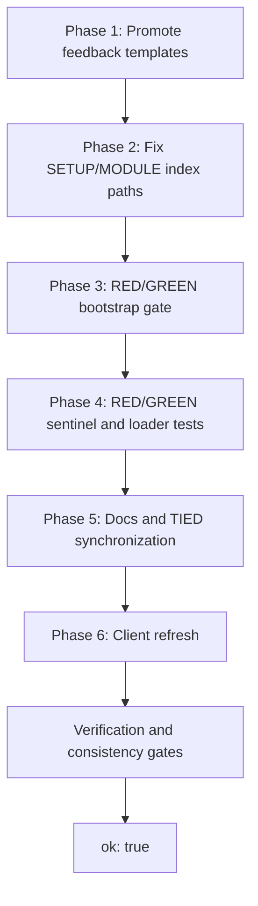

# Plan: Fix inherited methodology detail-file bootstrap gap

**Status:** Draft plan (2026-08-25)  
**Motivation:** Client `1787691672` (and likely other bootstrapped clients) fail `tied_validate_consistency` because inherited methodology indexes reference tokens whose detail files are missing or whose `detail_file` paths are stale `"null"` placeholders.  
**Fix layer:** TIED methodology source repository (`stdd`) — `templates/`, `copy_files.sh`, and MCP validator — **not** client project YAML ([PROC-TIED_METHODOLOGY_READONLY]). This document is the plan-only deliverable; implementation must not begin until the TIED tracker, CITDP, IMPL pseudo-code, and pre-implementation gate exist.

**Canonical terminology:** “methodology YAML” means the inherited, refreshable snapshot under a client’s `tied/methodology/`; “project YAML” means client-owned indexes/details directly under `tied/`. The source repository’s `templates/` is the canonical input to the former. `detail_file: null`, `"null"`, `"~"`, and whitespace-only values are sentinel/absent values, not usable paths.

---

## Problem statement

After a four-prompt deploy, `tied_validate_consistency` reported `ok: false` on client `1787691672`. The observed failure is reproducible from the inherited index/detail boundary:

| Token | Index `detail_file` | File on disk (`tied/methodology/`) | Validator result |
|-------|---------------------|----------------------------------|------------------|
| `REQ-FEEDBACK_TO_TIED` | `"null"` | **missing** | `Detail file not found` |
| `ARCH-FEEDBACK_STORAGE` | `"null"` | **missing** | `Detail file not found` |
| `IMPL-MCP_FEEDBACK_TOOLS` | `"null"` | **missing** | `Detail file not found` |
| `REQ-TIED_SETUP` | `"null"` | **present** | passes via `{token}.yaml` fallback; index path check fails |
| `REQ-MODULE_VALIDATION` | `"null"` | **present** | passes via fallback; index path check fails |

**Hard failures (block `ok: true`):** the three feedback-stack tokens — indexes declare `detail_file` (truthy string `"null"`), but no resolvable file exists under `tied/methodology/`.

**Hygiene gaps:** `REQ-TIED_SETUP` and `REQ-MODULE_VALIDATION` — detail YAML is copied by `copy_files.sh` into `methodology/requirements/`, but index templates still say `detail_file: "null"`. `getDetailPath()` finds files via `{token}.yaml` fallback; index scans still report path mismatches.

### Root cause and current behavior

1. **Feedback stack never promoted to `templates/`** — full records live in the TIED source repo project layer (`stdd/tied/requirements/`, `architecture-decisions/`, `implementation-decisions/`) but were not copied into `templates/` for client inheritance. Indexes in `templates/*.yaml` already reference these tokens with `detail_file: "null"`.

2. **Legacy index seed pattern** — bootstrap-critical tokens (`REQ-TIED_SETUP`, `REQ-MODULE_VALIDATION`) use `detail_file: "null"` in index YAML while detail files exist on disk under `templates/requirements/`. `copy_files.sh` copies files and indexes independently; nothing reconciles paths.

3. **Validator treats any truthy sentinel as a path** — `consistency-validator.ts` uses `if (rec?.detail_file)`, so the string `"null"` (and similarly `"~"` or whitespace) is reported as present and is joined as a path. This makes `with_detail_file` and `detail_file_exists` misleading even when the loader’s fallback can read `{token}.yaml`.

4. **Loader behavior is intentionally asymmetric** — `detail-loader.ts` first reads methodology tokens from `tied/methodology/`, then falls back to project `tied/` when no methodology detail resolves; `listDetailTokens()` currently scans only the project base. The fix must preserve the read-only methodology fallback and must not claim that list enumeration already covers methodology details.

---

## Scope and acceptance criteria

### In scope

- Promote feedback stack into inherited `templates/`.
- Correct `detail_file` paths for bootstrap-critical tokens that already have template detail files.
- Add bootstrap verification in `copy_files.sh` (fail closed on missing inherited detail artifacts), alongside the existing fidelity, adversarial-inquiry, and feature-orchestration gates.
- Harden validator/loader sentinel handling so only non-sentinel paths count as `detail_file` values.
- Client refresh procedure (re-run bootstrap, re-validate).

### Out of scope (separate work)

- Bulk cleanup of unrelated `detail_file: "null"` entries in `templates/semantic-tokens.yaml` (~30 rows) beyond the affected REQ/ARCH/IMPL indexes.
- Changing feedback MCP tool behavior (already implemented in source repo).
- Extending `listDetailTokens()` to enumerate methodology directories (useful follow-up, but not required for this bootstrap fix unless a test demonstrates an orphan-detail requirement).

### Done when

1. Fresh `./copy_files.sh "$CLIENT"` leaves all five listed tokens resolvable under `"$CLIENT/tied/methodology/"`.
2. Bootstrap’s detail-integrity gate fails closed when a required inherited detail artifact is absent; it does not replace the existing fidelity, adversarial-inquiry, or feature-orchestration gates.
3. `tied_validate_consistency` reports `ok: true` on a smoke client with no project-specific tokens and does not report sentinel values as `with_detail_file`.
4. The loader still resolves methodology details first, falls back to project details only when methodology is absent, and writes remain project-only.
5. Re-run on cohort client `1787691672` after refresh → `ok: true` (project feature tokens unchanged).

---

## Phase 1 — Promote feedback stack to `templates/` (required; blocks consistency)

**Priority:** P0 — fixes the three hard validator failures.

### Source of truth

Existing Implemented records in `stdd/tied/`:

- `tied/requirements/REQ-FEEDBACK_TO_TIED.yaml`
- `tied/architecture-decisions/ARCH-FEEDBACK_STORAGE.yaml`
- `tied/implementation-decisions/IMPL-MCP_FEEDBACK_TOOLS.yaml`
- `tied/implementation-decisions/IMPL-MCP_FEEDBACK_TOOLS-pseudocode.md`

### Actions

1. Copy the four source artifacts into matching `templates/` subdirectories:
   `templates/requirements/REQ-FEEDBACK_TO_TIED.yaml`,
   `templates/architecture-decisions/ARCH-FEEDBACK_STORAGE.yaml`,
   `templates/implementation-decisions/IMPL-MCP_FEEDBACK_TOOLS.yaml`, and
   `templates/implementation-decisions/IMPL-MCP_FEEDBACK_TOOLS-pseudocode.md`.
2. Audit project-specific metadata and test/code locations. Keep methodology contract content, but remove or generalize references that only make sense in the source clone (for example `feedback.test.ts`); do not invent client paths.
3. Update methodology **index templates** — replace `"null"` with real paths:
   - `templates/requirements.yaml` → `requirements/REQ-FEEDBACK_TO_TIED.yaml`
   - `templates/architecture-decisions.yaml` → `architecture-decisions/ARCH-FEEDBACK_STORAGE.yaml`
   - `templates/implementation-decisions.yaml` → `implementation-decisions/IMPL-MCP_FEEDBACK_TOOLS.yaml`
4. Align inner detail YAML top-level `detail_file` fields with the same paths.
5. Set inherited `status` consistently (`Implemented` where appropriate, matching source repo).
6. Update the three corresponding `templates/semantic-tokens.yaml` entries (path + status), mirroring already-promoted stacks such as quality-assurance and evidence-chain.

### Verify before merge

```bash
(cd mcp-server && npm run build)
./copy_files.sh /tmp/tied-bootstrap-smoke
TIED_BASE_PATH=/tmp/tied-bootstrap-smoke/tied \
  /tmp/tied-bootstrap-smoke/.cursor/skills/tied-yaml/scripts/tied-cli.sh tied_validate_consistency
# Expect ok: true. The built server is required because copy_files.sh fails closed before copying.
```

---

## Phase 2 — Fix index/detail path desync for SETUP + MODULE_VALIDATION (required)

**Priority:** P1 — removes false index diagnostics; aligns tooling with on-disk layout.

Detail files **already exist** in `templates/requirements/` and are copied to clients; only indexes are wrong.

| Token | Current index | Should be |
|-------|---------------|-----------|
| `REQ-TIED_SETUP` | `"null"` | `requirements/REQ-TIED_SETUP.yaml` |
| `REQ-MODULE_VALIDATION` | `"null"` | `requirements/REQ-MODULE_VALIDATION.yaml` |

Also update:

- Inner `detail_file` in `templates/requirements/REQ-TIED_SETUP.yaml`
- Inner `detail_file` in `templates/requirements/REQ-MODULE_VALIDATION.yaml`
- Matching rows in `templates/semantic-tokens.yaml`

---

## Phase 3 — Bootstrap verification gate in `copy_files.sh` (required)

**Priority:** P1 — prevents regression after template promotion.

Follow the existing fail-closed patterns: `verify_fidelity_methodology`, `verify_adversarial_inquiry_methodology`, and `verify_feature_orchestration_methodology` (currently near the end of `copy_files.sh`, after all methodology artifacts are copied). Do not remove, reorder, or weaken those gates.

### Add `verify_inherited_detail_files()`

1. Inspect the copied methodology index YAMLs under `${TIED_DIR}/methodology/` using an available YAML parser or a small testable helper; do not use truthiness alone to classify `detail_file`.
2. For each index record whose `detail_file` is a usable relative path (not `null`, `"null"`, `"~"`, or whitespace), assert that the path exists beneath `tied/methodology/` and reject traversal outside that boundary.
3. Maintain a required-files list for bootstrap-critical stacks:

```bash
INHERITED_DETAIL_REQUIRED=(
  "methodology/requirements/REQ-TIED_SETUP.yaml"
  "methodology/requirements/REQ-MODULE_VALIDATION.yaml"
  "methodology/requirements/REQ-FEEDBACK_TO_TIED.yaml"
  "methodology/architecture-decisions/ARCH-FEEDBACK_STORAGE.yaml"
  "methodology/architecture-decisions/ARCH-MODULE_VALIDATION.yaml"
  "methodology/implementation-decisions/IMPL-MCP_FEEDBACK_TOOLS.yaml"
  "methodology/implementation-decisions/IMPL-MCP_FEEDBACK_TOOLS-pseudocode.md"
  "methodology/implementation-decisions/IMPL-MODULE_VALIDATION.yaml"
  "methodology/implementation-decisions/IMPL-MODULE_VALIDATION-pseudocode.md"
)
```

4. Fail bootstrap (`exit 1`) if any required artifact is missing or any usable indexed path is unresolved. Emit a diagnostic naming the relative artifact and index.

### Optional CI helper (not a substitute for the runtime gate)

Script under `scripts/` (Ruby or shell) that diffs `templates/*.yaml` index `detail_file` paths against filesystem under `templates/**/` — run in TIED repo CI on template changes.

---

## Phase 4 — Validator and loader sentinel hardening (required)

**Priority:** P1 — required for accurate consistency-report semantics; narrower than bulk sentinel cleanup.

In `mcp-server/src/consistency-validator.ts` and `mcp-server/src/detail-loader.ts`:

- Introduce one shared notion of a usable `detail_file`: an actual non-empty relative path; treat `"null"`, `"~"`, and whitespace-only as absent.
- In the validator index scan, skip sentinel values so `with_detail_file` and `detail_file_exists` describe actual paths.
- In `listDetailTokens()`, do not add tokens merely because their index field contains a sentinel. Preserve its current project-base enumeration behavior.
- Preserve `getDetailPath()` methodology-first resolution, project fallback for missing methodology details, and project-only write protection. Add path-boundary tests so hardening does not accidentally make methodology YAML writable.

Add unit tests in the existing MCP suite for sentinel variants, real paths, methodology-first resolution, project fallback, and project-only writes. Extending `listDetailTokens()` to scan methodology subdirectories is an optional follow-up requiring a separate orphan-detail contract and tests; it is not part of this fix.

---

## Phase 5 — Documentation and migration notes (required)

**Priority:** P1 — operators need a single migration anchor.

Update canonical docs in `tied/docs/` (existing clients receive these only when missing; customized copies require deliberate comparison and merge):

1. **`methodology-migration.md`** — new subsection **“Feedback token packaging status”** (mirror “Quality-token packaging status” and “Evidence-chain profile packaging status”):
   - `[REQ-FEEDBACK_TO_TIED]`, `[ARCH-FEEDBACK_STORAGE]`, `[IMPL-MCP_FEEDBACK_TOOLS]`
   - Refresh overwrites `tied/methodology/**`; no project YAML duplication required.

2. **`processes.md`** — confirm inherited token list includes feedback stack with resolvable detail files.

3. **`client-development-index.md`** — note that post-bootstrap `tied_validate_consistency` should pass on an empty project tree.

4. **`tied/vocab/feedback-to-tied.md`** — verify the source-only glossary links and its methodology routing entry; do not install the source-only Prompt Composer glossary into clients.

---

## Phase 6 — Client cohort remediation (rollout, after source implementation)

For existing clients (including `1787691672`), after the source tests and validation gates pass:

```bash
export TIED_SOURCE=/path/to/stdd
export CLIENT=/path/to/client

(cd "${TIED_SOURCE}/mcp-server" && npm run build)
"${TIED_SOURCE}/copy_files.sh" "${CLIENT}"

TIED_BASE_PATH="${CLIENT}/tied" \
  "${CLIENT}/.cursor/skills/tied-yaml/scripts/tied-cli.sh" tied_validate_consistency
```

**Do not** edit client project YAML for methodology tokens. Refresh regenerates `tied/methodology/` from templates.

Rollback: revert client git commit if unexpected diff; methodology directory is fully overwritten each refresh.

---

## Phase 7 — TIED-tracked implementation and gates (required workflow)

Track this behavior-changing source-repository work using `[PROC-AGENT_REQ_CHECKLIST]`. This plan does not create the Tracker or CITDP while remaining in plan-only mode.

| Layer | Token (proposed) | Notes |
|-------|------------------|-------|
| REQ | Extend `REQ-TIED_SETUP`, or add `REQ-TIED_BOOTSTRAP_DETAIL_INTEGRITY` if the existing contract cannot express the invariant | Inherited indexes must resolve usable detail paths after bootstrap |
| ARCH | Extend `ARCH-TIED_STRUCTURE` | Template promotion, path boundary, and fail-closed verification architecture |
| IMPL | Extend `IMPL-TIED_FILES`; add/extend an MCP implementation decision only if sentinel normalization is a distinct decision | Bootstrap gate, template packaging, and loader/validator semantics |
| Tests | `mcp-server/src/e2e/bootstrap-and-load.test.ts` plus focused validator/loader tests | RED → GREEN per [PROC-TIED_DEV_CYCLE] |

### Required workflow and gates

1. **Refine:** resolve “inherited detail,” “usable path,” “sentinel,” “methodology-first,” and “project fallback” as the canonical meanings above; record new methodology vocabulary only if a new concept is introduced. Validate vocabulary before commit.
2. **Plan:** copy the canonical Tracker to a unique working path such as `working/REQ-TIED_BOOTSTRAP_DETAIL_INTEGRITY_<timestamp>.yaml`; perform CITDP change-definition, impact, risk-assessment, and test-strategy. Persist `tied/citdp/CITDP-REQ-*.yaml` after implementation as required by policy.
3. **Risk profile:** select `depth_tier: integrated` because the change alters bootstrap filesystem behavior, inherited/project boundaries, and consistency validation. Record gate policy independently (fail closed for missing or escaping artifacts); research and assurance profiles must remain separate fields. Integrated inquiry artifacts and identity-bound activation are required before implementation/verification if the project’s inquiry policy activates.
4. **Documentation first:** author/update the REQ→ARCH→IMPL stack and IMPL pseudo-code before tests or code. Every changed Active pseudo-code block has literal `[IMPL-*] [ARCH-*] [REQ-*]` lead comments plus PRE/POST/EFFECTS and applicable FAILURE_MODES/DATA_TRANSITION/TERMINATION. Run `pseudocode_validate` and Layer A consistency checks before RED tests.
5. **Unit TDD:** write failing tests first for sentinel classification, validator index reporting, `listDetailTokens()` sentinel exclusion, methodology-first reads, project fallback, and project-only write rejection. Then implement the smallest GREEN changes and run TypeScript build/tests after each iteration.
6. **Composition TDD:** add a failing bootstrap smoke/contract test for template copying, index path resolution, required-artifact failure, traversal rejection, and preservation of existing fidelity/adversarial/feature verification gates before changing `copy_files.sh`.
7. **Verification:** run the full MCP test suite, `npm run build`, vocabulary/token validation, `tied_validate_consistency`, the verification gate, and the client smoke/cohort refresh. A failed gate is incomplete work, not a successful partial rollout.

---

## Execution order



**Smallest shippable slice:** Phases 1–4 plus their RED/GREEN tests and required validation. Phase 5 is required before close-out; Phase 6 is rollout work and may be scheduled separately after the source change is verified. Bulk semantic-token sentinel cleanup and methodology enumeration remain optional.

---

## Risk notes

- **Do not** copy feedback detail files into client **project** YAML — violates methodology/project separation and duplicates tokens.
- **Do not** hand-edit `tied/methodology/` in clients — fix templates and re-run `copy_files.sh`.
- Promoted feedback records may reference tests/code that exist only in the TIED source repo; trim inherited detail traceability to methodology-relevant paths only.
- Re-running `copy_files.sh` overwrites `tied/methodology/**` from templates; project YAML and client vocabulary are preserved per [methodology-migration.md](../tied/docs/methodology-migration.md) bootstrap preservation matrix. Existing `tied/docs/*.md` and `.cursor/mcp.json` have separate copy-when-missing/byte-preservation rules.
- A detail path must be resolved relative to the selected methodology base and remain within it; do not silently accept an absolute path or `..` escape.
- Do not interpret a passing loader fallback as proof that the inherited index is correct: the validator’s index scan and bootstrap gate must agree on usable paths.
- `listDetailTokens()` remains project-base-only in this change. Treat methodology enumeration as a separately specified enhancement, not an implicit consequence of fallback support.

---

## Related documents

- [methodology-migration.md](../tied/docs/methodology-migration.md) — client refresh procedure and preservation matrix
- [checklist-adherence-improvement-plan.md](checklist-adherence-improvement-plan.md) — checklist enforcement context (client `1787691672` pilot)
- [integrated-activation-checklist-enforcement-plan.md](integrated-activation-checklist-enforcement-plan.md) — integrated activation gates
- `copy_files.sh` — bootstrap and methodology overwrite logic
- `mcp-server/src/consistency-validator.ts` — `tied_validate_consistency` implementation
- `tied/vocab/feedback-to-tied.md` — feedback domain vocabulary
