# New Feature Process (`[PROC-NEW_FEATURE]`)

This document describes the end-to-end procedure for implementing a new feature using the TIED methodology: from user prompt through documentation, testing, implementation, validation, and release. It invokes **[PROC-TIED_DEV_CYCLE](tied/processes.md)** and adds tooling and post-implementation steps. **For the agent-executable step-by-step procedure** (what to do in each phase), see **`tied/docs/agent-req-implementation-checklist.md`** (`[PROC-AGENT_REQ_CHECKLIST]`) which is the primary unified checklist; it sequences `tied/processes.md` § PROC-TIED_DEV_CYCLE with CITDP, IMPL_CODE_TEST_SYNC, LEAP, and validation. The diagram and phase summary below are for human reference.

## 1. Flow diagram: User prompt to commit

The following diagram captures the flow from a user prompt through TIED documentation, testing, implementation, validation, and release. It aligns with **PROC-TIED_DEV_CYCLE** (steps 1–9) and the additional steps (REQ/ARCH/IMPL sync, unit/e2e tests, README/CHANGELOG, commit).

```mermaid
flowchart TB
    subgraph input [Input]
        UserPrompt["User prompt / feature request"]
    end

    subgraph plan [1. Plan from TIED]
        ReadREQ["Read existing REQ / ARCH / IMPL for scope"]
        ResolveIMPL["Resolve all logic in IMPL essence_pseudocode first"]
        IdentifyUpdates["Identify required REQ/ARCH/IMPL updates"]
    end

    subgraph docs [2. Author TIED docs]
        UpdateREQ["Update or create REQ with tokens"]
        UpdateARCH["Update or create ARCH with tokens"]
        UpdateIMPL["Update IMPL: complete essence_pseudocode with block comments REQ/ARCH/IMPL"]
        UseTiedYaml["Use tied-yaml MCP tools for TIED YAML; document any direct file access"]
    end

    subgraph tests [3. Add and align tests]
        AddTests["Add or update tests to match IMPL"]
        TestBlockComments["Test blocks carry same REQ/ARCH/IMPL comments as IMPL"]
        ExtractLogic["Plan extraction from entry points so logic is unit-testable"]
    end

    subgraph impl [4. Implement via TDD]
        TDD["Code satisfies tests; entire IMPL pseudo-code via TDD"]
        BlockComments["Source blocks carry same REQ/ARCH/IMPL comments as IMPL"]
    end

    subgraph glue [5. Implement glue]
        MinimalGlue["Binding code (entry points, wiring); justify non-trivial glue in IMPL"]
    end

    subgraph e2e [6. Add E2E]
        AddE2E["E2E tests to protect glue and most basic features"]
    end

    subgraph validate [7. Validate and close gaps]
        RunSuite["Run full test suite"]
        AddMissing["Add missing unit tests"]
        TokenValidation["Run PROC-TOKEN_VALIDATION / tied_validate_consistency"]
    end

    subgraph sync [8. Sync TIED to code and tests]
        SyncREQARCHIMPL["Update REQ/ARCH/IMPL to match final code and tests"]
        SyncPseudocode["Include pseudo-code comments with semantic tokens per block"]
        SyncIndexes["Sync semantic-tokens.yaml and YAML indexes"]
    end

    subgraph release [9–10. Release and commit]
        UpdateReadme["Update README.md for changes"]
        UpdateChangelog["Update CHANGELOG.md for changes"]
        CommitMsg["Write commit message per PROC-COMMIT_MESSAGES (processes.md)"]
    end

    UserPrompt --> ReadREQ
    ReadREQ --> ResolveIMPL
    ResolveIMPL --> IdentifyUpdates
    IdentifyUpdates --> UpdateREQ
    UpdateREQ --> UpdateARCH
    UpdateARCH --> UpdateIMPL
    UpdateIMPL --> UseTiedYaml
    UseTiedYaml --> AddTests
    AddTests --> TestBlockComments
    TestBlockComments --> ExtractLogic
    ExtractLogic --> TDD
    TDD --> BlockComments
    BlockComments --> MinimalGlue
    MinimalGlue --> AddE2E
    AddE2E --> RunSuite
    RunSuite --> AddMissing
    AddMissing --> TokenValidation
    TokenValidation --> SyncREQARCHIMPL
    SyncREQARCHIMPL --> SyncPseudocode
    SyncPseudocode --> SyncIndexes
    SyncIndexes --> UpdateReadme
    UpdateReadme --> UpdateChangelog
    UpdateChangelog --> CommitMsg
```

### Summary of phases

| Phase | Activities |
|-------|------------|
| **Plan** | Read REQ/ARCH/IMPL; use IMPL `essence_pseudocode` as source of truth; resolve logic there before code/tests; identify doc updates. |
| **Document** | Author/update REQ, ARCH, IMPL (with block-level token comments); use tied-yaml MCP; document and validate any direct YAML edits. |
| **Test** | Add/align tests to IMPL (tests-first; tests conform to IMPL pseudo-code); same token comments in test blocks; no production code yet beyond minimum to run first test. |
| **Implement (TDD)** | Code is written to satisfy the tests; entire IMPL pseudo-code is implemented via TDD; block comments in code. |
| **Glue** | After TDD, implement binding/non-unit-test-covered code (entry points, wiring) so full REQ/ARCH/IMPL can run; justify non-trivial glue in IMPL. |
| **E2E** | Add E2E tests after glue to protect the glue and the most basic features; document E2E-only behavior in IMPL. |
| **Validate** | Full test suite; fill unit test gaps; run token/consistency validation. |
| **Sync** | REQ/ARCH/IMPL and pseudo-code match final code/tests; sync indexes. |
| **Release** | README, CHANGELOG, commit per [PROC-COMMIT_MESSAGES](../processes.md). |

---

## 2. Governing process and tools

- **Strictly follow** the procedure **[PROC-TIED_DEV_CYCLE](tied/processes.md)** for the full development cycle (all 10 steps). The mandatory implementation order (tests first, code via TDD, glue, E2E, validate, sync) is stated in that section.
- **Use tied-yaml MCP tools** as the primary way to read/write TIED YAML:
  - **Index read/write:** `yaml_index_read`, `yaml_index_insert`, `yaml_index_update`, `yaml_index_list_tokens`, `yaml_index_filter`
  - **Detail read/write:** `yaml_detail_read`, `yaml_detail_read_many`, `yaml_detail_list`, `yaml_detail_create`, `yaml_detail_update`, `yaml_detail_delete`
  - **Traceability:** `get_decisions_for_requirement`, `get_requirements_for_decision`
  - **Validation:** `yaml_index_validate`, `tied_validate_consistency`
  - **Config:** `tied_config_get_base_path`
- **Direct read/write of TIED YAML files** is allowed only when no MCP tool supports the operation. When used:
  - **Document** the occurrence (what was done and why MCP was not used).
  - **Report** it (e.g. in session notes or implementation decisions) so it can be considered for new MCP tooling.
  - **Validate and pretty-print** any manual YAML edits:  
    `lint_yaml <file>.yaml` (run from repo root or correct path; see `processes.md` `[PROC-YAML_EDIT_LOOP]`). Use **`lint_yaml`**—do not use raw multi-argument `yq` pretty-print, which merges YAML documents and corrupts files.

---

## 3. Steps (mapping to PROC-TIED_DEV_CYCLE)

1. **Plan from TIED** — Read existing REQ, ARCH, IMPL for the feature scope. Use each IMPL's `essence_pseudocode` as the full prescription; resolve all logical/flow issues there before tests or code. Identify required new or changed REQ/ARCH/IMPL.
2. **Author TIED docs** — Update or create REQ, ARCH, IMPL. Ensure IMPL `essence_pseudocode` is complete with block-level comments naming REQ/ARCH/IMPL and how the block implements them. Use tied-yaml tools; document and validate any direct file edits with `lint_yaml` per changed file (see `processes.md` `[PROC-YAML_EDIT_LOOP]`).
3. **Add and align tests** — Add or update tests to match IMPL. Test blocks must carry the same REQ/ARCH/IMPL comments as the corresponding IMPL blocks. Ensure testable logic is not in entry points; extract to modules if needed.
4. **Implement to tests (TDD)** — Implement in testable modules; entry points only call into them. Every source block carries the same REQ/ARCH/IMPL comments as in the IMPL. Iterate until tests pass.
5. **Implement minimal glue** — Implement only minimal glue (entry points, wiring). Non-trivial logic in glue must be justified in IMPL (`e2e_only_reason` or `test_coverage_note`).
6. **Validate and close test gaps** — Run full test suite; add any missing unit tests; run `[PROC-TOKEN_VALIDATION]` (e.g. `validate_tokens.sh`) and/or `tied_validate_consistency`; fix gaps.

---

## 4. After initial implementation, debugging, and validation

7. **Sync REQ / ARCH / IMPL to code and tests** — Update REQ, ARCH, and IMPL so they represent the final code and related fixes. Include pseudo-code comments with semantic tokens in each logical block. Sync `semantic-tokens.yaml`, `requirements.yaml`, `architecture-decisions.yaml`, `implementation-decisions.yaml`, and detail files so TIED remains the single source of truth.
8. **Unit tests** — If any unit tests are missing, add them and ensure they reference the appropriate REQ/ARCH/IMPL tokens.
9. **E2E tests** — Recommend e2e tests where appropriate (critical user journeys). After approval, implement them.
10. **README and CHANGELOG** — Update [README.md](../README.md) and [CHANGELOG.md](../CHANGELOG.md) for all changes in the session.
11. **Commit** — Write a single commit message for the entire session **per [PROC-COMMIT_MESSAGES](tied/processes.md)**. In projects set up with TIED, use **[tied/docs/commit-guidelines.md](../tied/docs/commit-guidelines.md)** as the quick reference (see also [CONTRIBUTING.md](../CONTRIBUTING.md) for the TIED repo). Use the format and types defined in tied/processes.md; reference main REQ/ARCH/IMPL tokens in the body or footer when relevant.
