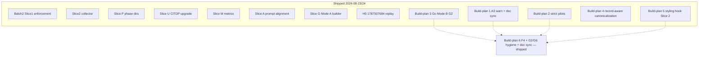

# Outstanding work — prioritized build-plan sequence

**Status:** Refined execution sequence (refine-plan pass 3, 2026-08-24)  
**Audience:** TIED methodology maintainers and agents executing `build-plan`  
**As of:** 2026-08-24  
**Basis:** Integrated activation stack close-out (Batch 2 Slices 0–2, P/U/M/A, Slice G.1, H5, A3, Slice S, Go Mode B G2, record-aware canonicalization, client YAML styling hook),
[`adversarial-inquiry-activation-recommendation.md`](adversarial-inquiry-activation-recommendation.md) §P2,
and working trackers under `working/`.

This document is the **execution order for the prioritized build-plan sequence**. Build-plans **1–6**
shipped on 2026-08-24 (see **Shipped baseline**). **The sequence is complete** — no remaining
build-plans or feature slices. It does not reopen shipped integrated
activation (enforcement, collector, phase persistence, metrics, Mode A builder, H5 replay,
A3 warn diagnostic, strict-approved pilots, Go Mode B adapter, record-aware canonicalization,
client_formatter styling hook).

**This refine pass:** `depth_tier: minimal` · `gate_policy: advisory` · no integrated inquiry
required for planning-only edits to this document.

---

## 0. Refinement gates (RESOLVE)

Sponsor terms resolved against [`fidelity-research.md`](../tied/vocab/fidelity-research.md),
[`quality-assurance.md`](../tied/vocab/quality-assurance.md), and
[`prompt-composer.md`](../tied/vocab/prompt-composer.md):

| Term | Resolution |
|------|------------|
| **build-plan** | Prompt-type execution of one slice from this sequence; owns RED tests, code, CITDP persist, and close-out. |
| **Slice A** (shipped) | Prompt-type / checklist prose alignment (`CITDP-REQ-TIED_CHECKLIST_GATE_ENFORCEMENT-sliceA.yaml`). **Not** the same as **A3**. |
| **A3** (shipped) | Validator **warn-only** diagnostic `minimal_depth_missing_waiver` when `depth_tier: minimal` on §7-eligible work lacks `integrated_waiver`; non-blocking (Batch 2 Slice A3, 2026-08-24). |
| **§7 eligibility triggers** | External input, auth, network, persistence, strict close-out — default `depth_tier` is `integrated`; minimal requires documented `integrated_waiver`. |
| **strict-approved pilot** (shipped) | Live client `1787416567` path where `evaluateScopedGate` sets `blocking: true` with recorded human approval (Slice S, 2026-08-24). |
| **Mode B (Go)** (shipped) | Native Go project-input evidence adapter with realpath confinement (Slice G2, 2026-08-24); fixture verification path; see deferred dogfood/G6 below. |
| **record-aware canonicalization** (shipped) | Registry-driven sort of recognized mapping-record lists in TS + Ruby (2026-08-24); prerequisite for honest styling hook — **satisfied**. |
| **client_formatter hook** (shipped) | Executable Slice 2 styling boundary: fail-closed path guards, semantic compare acceptance, optional MCP read-only apply (Build-plan 5, close-out 2026-08-24). |

**Ambiguity accepted (unchanged from pass 1):** A3 uses explicit CITDP field
`eligibility_triggers_matched: string[]` (recorded at `risk-assessment`). Strict blocking
remains pilot-scoped to Slice S evidence, not universal.

**Vocabulary RECORD/VALIDATE:** Pass 3 — **VALIDATE only**; no new glossary terms.

---

## Executive summary

| Priority | Build-plan | Change request | Why now |
|----------|------------|----------------|---------|
| **1** | Optional hardening + hygiene | Mixed | **Shipped 2026-08-24** — F4 parity, Bun runner note, G6 reload smoke, G2 stdd-repo dogfood, P2/H5 doc sync |

**Shipped since pass 1 (do not re-execute):**

| Build-plan | Slice | Close-out |
|------------|-------|-----------|
| 1 — A3 + doc sync | `batch2-sliceA3` | 2026-08-24 |
| 2 — Strict-approved pilots | `sliceS` | 2026-08-24 |
| 3 — Go Mode B adapter | `sliceG2` | 2026-08-24 (441 npm tests; fixture path) |
| 4 — Record-aware canonicalization | `record-aware` | 2026-08-24 |
| 5 — Client YAML styling hook | `slice2` | 2026-08-24 (441 npm tests; merged CITDP persisted) |

**Sequence status:** Complete (2026-08-24). Build-plans 1–6 shipped including optional hygiene
(F4 parity, G6 reload smoke, G2 stdd-repo dogfood).

**Explicitly not in sequence:** retroactive integrated upgrade of client `1787503424`
(valid minimal only); universal integrated depth on all REQs; feature-orchestration Git
integration (separate roadmap); deferred-stats orchestrator wiring (Phase 4 dormant
contracts only — master roadmap Phase 5 is complete).

---

## Shipped baseline (do not re-implement)

| Area | Evidence | Tracker / CITDP |
|------|----------|-----------------|
| Batch 2 Slice 0–1 validator auto-enforcement | `checklist-validator.test.ts` pairing fixtures | `CITDP-REQ-TIED_CHECKLIST_GATE_ENFORCEMENT-batch2.yaml`, slice0/slice2 |
| Slice 2 collector | `tied_checklist_activation_collect` | `CITDP-REQ-TIED_CHECKLIST_GATE_ENFORCEMENT-slice2.yaml` |
| Slices P / U / M / A | Phase dirs, CITDP upgrade, metrics, prompt alignment | `sliceP`, `sliceU`, `CITDP-REQ-MCP_USAGE_METRICS-sliceM`, `sliceA` |
| Slice G.1 Mode A builder | `build_adversarial_inquiry_from_tied.rb` + fixture | `CITDP-REQ-TIED_ADVERSARIAL_INQUIRY-sliceG.yaml` |
| H5 integrated replay | `1787507684` / `REQ-ROOTJOBS` | `working/client-1787507684-activation-audit/` |
| **Build-plan 1 — A3 warn diagnostic** | `minimal_depth_missing_waiver` in `checklist-validator.ts` | `REQ-TIED_CHECKLIST_GATE_ENFORCEMENT_sliceA3_tracker.yaml` · `CITDP-REQ-TIED_CHECKLIST_GATE_ENFORCEMENT-sliceA3.yaml` · `gate-sliceA3-*.json` |
| **Build-plan 1 — parent plan §4/§11 sync** | §4.1–4.3, §4.4 A3, §11 rows marked **Shipped** | `integrated-activation-checklist-enforcement-plan.md` |
| **Build-plan 2 — strict-approved pilots** | Runbook + blocking/negative-control gate JSON | `REQ-TIED_ADVERSARIAL_INQUIRY_sliceS_tracker.yaml` · `CITDP-REQ-TIED_ADVERSARIAL_INQUIRY-sliceS.yaml` · `working/client-1787416567-strict-pilot/` |
| **Build-plan 3 — Go Mode B G2** | `go-evidence-adapter.ts`, `go-project-orchestrator.ts`, `go-mode-b-composition.test.ts`, fixtures | `REQ-TIED_ADVERSARIAL_INQUIRY_sliceG2_tracker.yaml` · `CITDP-REQ-TIED_ADVERSARIAL_INQUIRY-sliceG2.yaml` · `gate-sliceG2-*.json` · `docs/adversarial-inquiry-adoption.md` §Go Mode B |
| **Build-plan 4 — record-aware canonicalization** | `yaml-canonicalizer.test.ts`, `yaml_list_sorter_test.rb` | `REQ-TIED_YAML_CANONICALIZATION_record-aware_tracker.yaml` · `CITDP-REQ-TIED_YAML_CANONICALIZATION-record-aware.yaml` |
| **Build-plan 5 — client YAML styling hook** | `yaml-client-formatter.ts`, `yaml-client-formatter.test.ts`, `yaml-client-styling-mcp.test.ts`, fixtures | `REQ-TIED_YAML_STYLING_GATES_tracker.yaml` · `CITDP-REQ-TIED_YAML_STYLING_GATES.yaml` · `gate-close_out-result.json` · `gate-verification-slice2.json` · `gate-pre-implementation-slice2.json` |
| Deferred stats master close-out | Phase 5 complete | `working/REQ-DEFERRED_STATS_ROADMAP/remaining-completion-plan.md` |
| Integration checklist Parts A–G (required) | 2026-08-24 verification | `adversarial-inquiry-checklist-integration-checklist.md` |

**G2 tracker deferred (completed 2026-08-24):**

- ~~Live stdd-repo dogfood close_out inquiry~~ — `working/REQ-TIED_ADVERSARIAL_INQUIRY/g2-dogfood/replay-g2-stdd-dogfood.sh`
- ~~Operator MCP reload smoke (G6-class)~~ — `working/BUILD_PLAN_6_HYGIENE/g6-mcp-reload-smoke.sh`

**Note:** G2 code may exist as uncommitted working-tree changes; trackers and `tied/citdp/` are
source of truth for close-out claims.

---

## Tracker and CITDP inventory

| Build-plan | Tracker path | Status | CITDP | Notes |
|------------|--------------|--------|-------|-------|
| 1 — A3 | `working/REQ-TIED_CHECKLIST_GATE_ENFORCEMENT/REQ-TIED_CHECKLIST_GATE_ENFORCEMENT_sliceA3_tracker.yaml` | **Shipped** — `complete`, close_out 2026-08-24 | `tied/citdp/CITDP-REQ-TIED_CHECKLIST_GATE_ENFORCEMENT-sliceA3.yaml` | Gates: `gate-sliceA3-{pre_implementation,verification,close_out}.json` |
| 2 — Strict pilots | `working/REQ-TIED_ADVERSARIAL_INQUIRY/REQ-TIED_ADVERSARIAL_INQUIRY_sliceS_tracker.yaml` | **Shipped** — `complete`, close_out 2026-08-24 | `tied/citdp/CITDP-REQ-TIED_ADVERSARIAL_INQUIRY-sliceS.yaml` | Pilot: `working/client-1787416567-strict-pilot/` |
| 3 — Go Mode B | `working/REQ-TIED_ADVERSARIAL_INQUIRY/REQ-TIED_ADVERSARIAL_INQUIRY_sliceG2_tracker.yaml` | **Shipped** — `complete`, close_out 2026-08-24 | `tied/citdp/CITDP-REQ-TIED_ADVERSARIAL_INQUIRY-sliceG2.yaml` | Dogfood + G6 smoke 2026-08-24 |
| 4 — Canonicalization | `working/REQ-TIED_YAML_CANONICALIZATION/REQ-TIED_YAML_CANONICALIZATION_record-aware_tracker.yaml` | **Shipped** — close_out 2026-08-24 | `tied/citdp/CITDP-REQ-TIED_YAML_CANONICALIZATION-record-aware.yaml` | Prerequisite for Build-plan 5 (shipped) |
| 5 — Styling Slice 2 | `working/REQ-TIED_YAML_STYLING_GATES/REQ-TIED_YAML_STYLING_GATES_tracker.yaml` | **Shipped** — `implemented`, close_out 2026-08-24 | `tied/citdp/CITDP-REQ-TIED_YAML_STYLING_GATES.yaml` | Gates: `gate-{pre-implementation-slice2,verification-slice2,close_out-result}.json`; 441/441 npm tests |
| 6 — Hygiene | `working/BUILD_PLAN_6_HYGIENE/BUILD_PLAN_6_hygiene_tracker.yaml` | **Shipped** — close-out 2026-08-24 | Deferred (doc/test-only) | All items including G6 + G2 dogfood |

---

## Depth and gate policy matrix

| Build-plan | `depth_tier` | `gate_policy` | Integrated inquiry | Status |
|------------|--------------|---------------|-------------------|--------|
| 1 — A3 | `minimal` | `advisory` | No | Shipped |
| 2 — Strict pilots | `integrated` | `strict-candidate` → `strict-approved` (pilot) | Yes — three phases + four artifacts | Shipped |
| 3 — Go Mode B | `integrated` | `advisory` | Yes — fixture path (not live dogfood) | Shipped |
| 4 — Canonicalization | `minimal` | `advisory` | No | Shipped |
| 5 — Styling Slice 2 | `minimal` | `advisory` | No | Shipped |
| 6 — Hygiene | `minimal` | `advisory` | No | Shipped |

---

## Dependency graph

Dotted arrows = optional hygiene (shipped 2026-08-24). **Sequence complete.**

---

## Shipped build-plans 1–5 (reference — do not re-execute)

### Build-plan 1 — A3 + parent narrative sync (shipped 2026-08-24)

- **Deliverables:** `minimal_depth_missing_waiver` warn diagnostic; `eligibility_triggers_matched`
  CITDP field; parent plan §4.1–4.4 and §11 reconciled.
- **Evidence:** `mcp-server/src/checklist-validator.ts`, `checklist-validator.test.ts`,
  `tied/citdp/CITDP-REQ-TIED_CHECKLIST_GATE_ENFORCEMENT-sliceA3.yaml`,
  `integrated-activation-checklist-enforcement-plan.md` §4.4.

### Build-plan 2 — Strict-approved pilots (shipped 2026-08-24)

- **Deliverables:** Live pilot on client `1787416567`; blocking + negative-control gate JSON;
  CITDP persist; activation recommendation §P2 strict pilots struck through.
- **Evidence:** `working/client-1787416567-strict-pilot/replay-strict-approved-pilot.sh`,
  `strict-approved-blocking-gate-result.json`, `strict-approved-negative-control-gate-result.json`.
- **Limitation:** MCP `human_approval` requires camelCase field names until LEAP maps snake_case.

### Build-plan 3 — Go Mode B adapter (shipped 2026-08-24)

- **Deliverables:** Go loader/orchestrator, evidence adapter, Mode B dispatch, fixture +
  composition test, adoption doc §Go Mode B, CITDP persist.
- **Evidence:** `mcp-server/src/adversarial-inquiry/go-evidence-adapter*.ts`,
  `go-project-orchestrator*.ts`, `go-mode-b-composition.test.ts`,
  `mcp-server/test/fixtures/adversarial-inquiry-go-mode-b/`, 441 npm tests pass.
- ~~**Deferred:** Live stdd-repo dogfood close_out inquiry; G6-class MCP reload smoke.~~ **Completed 2026-08-24** (Build-plan 6).

### Build-plan 4 — Record-aware canonicalization (shipped 2026-08-24)

- **Deliverables:** Record-list registry, TS + Ruby sort alignment, REQ LEAP, CITDP persist.
- **Evidence:** `yaml-canonicalizer.test.ts` (17/17), `yaml_list_sorter_test.rb`,
  `tied/citdp/CITDP-REQ-TIED_YAML_CANONICALIZATION-record-aware.yaml`,
  `tied_validate_consistency` ok.

### Build-plan 5 — Client YAML styling hook (Slice 2) (shipped 2026-08-24)

- **Deliverables:** Executable `client_formatter` hook with fail-closed path guards and semantic
  compare acceptance; optional MCP read-only `tied_client_yaml_styling_apply`; merged Slice 1 + Slice 2
  CITDP persist; REQ/ARCH/IMPL style stack LEAP.
- **Evidence:** `mcp-server/src/yaml-client-formatter.ts`, `yaml-client-formatter.test.ts`,
  `tools/yaml-client-styling-mcp.test.ts`, `mcp-server/fixtures/client-formatter/`,
  `mcp-server/src/tools/index.ts` (MCP tool), `checklist-yaml-styling-contract.test.ts`,
  `tied/citdp/CITDP-REQ-TIED_YAML_STYLING_GATES.yaml`,
  `working/REQ-TIED_YAML_STYLING_GATES/gate-close_out-result.json`, 441/441 npm tests pass,
  `tied_validate_consistency` ok.
- **Acceptance met:** `pseudocode_validate` on new IMPL blocks; no automatic hook invocation inside
  MCP writers (explicit apply only).

---

## Build-plan 6 — Optional hardening and hygiene

Run when sponsor bandwidth allows; **none block sequence completion.**

| Item | REQ / doc | Action | Status |
|------|-----------|--------|--------|
| **F4** automated YAML/MD parity | Adversarial inquiry checklist | Table-driven test: canonical checklist YAML slugs ↔ rendered task bullets (B14 automation) | **Shipped (2026-08-24)** — `checklist-yaml-md-parity.test.ts` |
| **G2** Bun full suite | Integration checklist Part G | Document `npm test` as canonical; Bun nested-test limitation documented | **Shipped (2026-08-24)** — `mcp-server/README.md` §Tests; G2 checked in integration checklist |
| **G6** operator IDE reload smoke | Integration checklist Part G | Post-rebuild fresh stdio tool catalog + invoke | **Shipped (2026-08-24)** — `working/BUILD_PLAN_6_HYGIENE/g6-mcp-reload-smoke.sh`; 66 tools; 6 required present |
| **G2 dogfood** | Slice G2 tracker deferred | Live stdd-repo Go Mode B close_out inquiry | **Shipped (2026-08-24)** — `working/REQ-TIED_ADVERSARIAL_INQUIRY/g2-dogfood/replay-g2-stdd-dogfood.sh`; gate `allowed: true` |
| **P2 doc sync** | `adversarial-inquiry-activation-recommendation.md` | Strike through Go adapter; note G2 shipped | **Shipped (2026-08-24)** |
| **H5 header sync** | `integrated-activation-checklist-enforcement-plan.md` | Update header line 14 "H5 pending" → shipped | **Shipped (2026-08-24)** |
| **Deferred stats adapters** | `REQ-DEFERRED_STATS_ROADMAP` | Reopen only if sponsor promotes Phase 4 orchestrator wiring | Closed (structural contracts only) |
| **Git integration** | Feature orchestration roadmap | Separate epic; not adversarial-inquiry scope | Out of scope |

---

## What stays explicitly out of scope

| Item | Rationale |
|------|-----------|
| Client `1787503424` integrated replay | Superseded by H5 (`1787507684`); retroactive upgrade not required |
| Universal integrated depth | Policy choice per CITDP; not mandated globally |
| Batch 2 + Build-plans 1–5 re-implementation | Trackers and `tied/citdp/` are source of truth |
| `tied/methodology/**` edits | `[PROC-TIED_METHODOLOGY_READONLY]` |
| Reopening deferred-stats Phases 1–5 | Master roadmap complete; only orchestrator wiring excluded |

---

## Execution checklist (every build-plan)

1. `tied_config_get_base_path` → confirm active `tied/`
2. Copy per-request tracker from `agent-req-implementation-checklist.yaml` (or advance existing)
3. CITDP at `risk-assessment` with explicit `depth_tier` and `gate_policy`
4. IMPL pseudo-code + `pseudocode_validate` before RED
5. `npm test` / language lint per `[PROC-TIED_DEV_CYCLE]`
6. Integrated depth: `sub-adversarial-inquiry-pass` + four phase artifacts when applicable
7. `tied_checklist_gate_validate` at `pre_implementation`, `verification`, and `close_out`
8. `tied_validate_consistency` before close-out
9. `./copy_files.sh` on pilot clients only when methodology prose/skills change

---

## Suggested immediate next action

**Build-plan 6 hygiene shipped 2026-08-24** (F4 parity test, G2 npm canonical docs, P2/H5 doc sync).
**Build-plan 6 complete (2026-08-24).** All hygiene items shipped including G6 reload smoke and G2 stdd-repo dogfood.

No further items in this prioritized sequence unless sponsor promotes new work.

---

## Related artifacts

| Document | Role |
|----------|------|
| [`integrated-activation-checklist-enforcement-plan.md`](integrated-activation-checklist-enforcement-plan.md) | Parent Batch 2 narrative — **§4/§11 synced** (A3 close-out 2026-08-24); **H5 header synced** (Build-plan 6, 2026-08-24) |
| [`integrated-activation-enforcement-operator-friction-plan.md`](integrated-activation-enforcement-operator-friction-plan.md) | Operator slices P/U/M/G/A (shipped) |
| [`adversarial-inquiry-activation-recommendation.md`](adversarial-inquiry-activation-recommendation.md) | P0/P1 shipped · P2 Go adapter + strict pilots shipped (Build-plan 6 doc sync, 2026-08-24) |
| [`adversarial-inquiry-checklist-integration-checklist.md`](adversarial-inquiry-checklist-integration-checklist.md) | F4 + G2 + G6 shipped (Build-plan 6 complete 2026-08-24) |
| [`tied-improvement-roadmap.md`](tied-improvement-roadmap.md) | Git integration deferred |
| [`working/REQ-DEFERRED_STATS_ROADMAP/remaining-completion-plan.md`](../working/REQ-DEFERRED_STATS_ROADMAP/remaining-completion-plan.md) | Stats master close-out complete; orchestrator wiring excluded |
