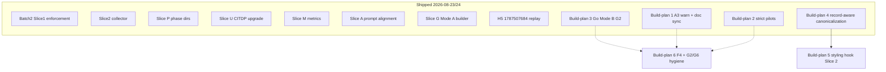

# Outstanding work — prioritized build-plan sequence

**Status:** Refined execution sequence (refine-plan pass 2, 2026-08-24)  
**Audience:** TIED methodology maintainers and agents executing `build-plan`  
**As of:** 2026-08-24  
**Basis:** Integrated activation stack close-out (Batch 2 Slices 0–2, P/U/M/A, Slice G.1, H5, A3, Slice S, Go Mode B G2, record-aware canonicalization),
[`adversarial-inquiry-activation-recommendation.md`](adversarial-inquiry-activation-recommendation.md) §P2,
and working trackers under `working/`.

This document is the **execution order for remaining planned work only**. Build-plans **1–4**
shipped on 2026-08-24 (see **Shipped baseline**). It does not reopen shipped integrated
activation (enforcement, collector, phase persistence, metrics, Mode A builder, H5 replay,
A3 warn diagnostic, strict-approved pilots, Go Mode B adapter, record-aware canonicalization).

**This refine pass:** `depth_tier: minimal` · `gate_policy: advisory` · no integrated inquiry
required for planning-only edits to this document.

---

## 0. Refinement gates (RESOLVE)

Sponsor terms resolved against [`fidelity-research.md`](../tied/vocab/fidelity-research.md),
[`quality-assurance.md`](../tied/vocab/quality-assurance.md), and
[`prompt-composer.md`](../tied/vocab/prompt-composer.md):

| Term | Resolution |
|------|------------|
| **build-plan** | Prompt-type execution of one slice from this sequence; owns RED tests, code, CITDP persist, and close-out. |
| **Slice A** (shipped) | Prompt-type / checklist prose alignment (`CITDP-REQ-TIED_CHECKLIST_GATE_ENFORCEMENT-sliceA.yaml`). **Not** the same as **A3**. |
| **A3** (shipped) | Validator **warn-only** diagnostic `minimal_depth_missing_waiver` when `depth_tier: minimal` on §7-eligible work lacks `integrated_waiver`; non-blocking (Batch 2 Slice A3, 2026-08-24). |
| **§7 eligibility triggers** | External input, auth, network, persistence, strict close-out — default `depth_tier` is `integrated`; minimal requires documented `integrated_waiver`. |
| **strict-approved pilot** (shipped) | Live client `1787416567` path where `evaluateScopedGate` sets `blocking: true` with recorded human approval (Slice S, 2026-08-24). |
| **Mode B (Go)** (shipped) | Native Go project-input evidence adapter with realpath confinement (Slice G2, 2026-08-24); fixture verification path; see deferred dogfood/G6 below. |
| **record-aware canonicalization** (shipped) | Registry-driven sort of recognized mapping-record lists in TS + Ruby (2026-08-24); prerequisite for honest styling hook — **satisfied**. |
| **client_formatter hook** (remaining) | Executable Slice 2 styling boundary: fail-closed path guards, semantic compare acceptance, optional MCP read-only apply. |

**Ambiguity accepted (unchanged from pass 1):** A3 uses explicit CITDP field
`eligibility_triggers_matched: string[]` (recorded at `risk-assessment`). Strict blocking
remains pilot-scoped to Slice S evidence, not universal.

**Vocabulary RECORD/VALIDATE:** Pass 2 — **VALIDATE only**; no new glossary terms. Cross-check
shipped Batch 2 + Go Mode B vocabulary in `fidelity-research.md` before Build-plan 5 commit.

---

## Executive summary

| Priority | Build-plan | Change request | Why now |
|----------|------------|----------------|---------|
| **1** | Client YAML styling hook (Slice 2) | `REQ-TIED_YAML_STYLING_GATES` | Only remaining feature slice; canonicalization prerequisite **shipped**; tracker at `slice2_planning` with pre_implementation gate passed |
| **2** | Optional hardening + hygiene | Mixed | F4 parity, Bun runner note, operator IDE reload smoke; G2 tracker deferred dogfood/G6 items |

**Shipped since pass 1 (do not re-execute):**

| Build-plan | Slice | Close-out |
|------------|-------|-----------|
| 1 — A3 + doc sync | `batch2-sliceA3` | 2026-08-24 |
| 2 — Strict-approved pilots | `sliceS` | 2026-08-24 |
| 3 — Go Mode B adapter | `sliceG2` | 2026-08-24 (416 npm tests; fixture path) |
| 4 — Record-aware canonicalization | `record-aware` | 2026-08-24 |

**Explicitly not in sequence:** retroactive integrated upgrade of client `1787503424`
(valid minimal only); universal integrated depth on all REQs; feature-orchestration Git
integration (separate roadmap); deferred-stats orchestrator wiring (Phase 4 dormant
contracts only — master roadmap Phase 5 is complete).

---

## Shipped baseline (do not re-implement)

| Area | Evidence | Tracker / CITDP |
|------|----------|-----------------|
| Batch 2 Slice 0–1 validator auto-enforcement | `checklist-validator.test.ts` pairing fixtures | `CITDP-REQ-TIED_CHECKLIST_GATE_ENFORCEMENT-batch2.yaml`, slice0/slice2 |
| Slice 2 collector | `tied_checklist_activation_collect` | `CITDP-REQ-TIED_CHECKLIST_GATE_ENFORCEMENT-slice2.yaml` |
| Slices P / U / M / A | Phase dirs, CITDP upgrade, metrics, prompt alignment | `sliceP`, `sliceU`, `CITDP-REQ-MCP_USAGE_METRICS-sliceM`, `sliceA` |
| Slice G.1 Mode A builder | `build_adversarial_inquiry_from_tied.rb` + fixture | `CITDP-REQ-TIED_ADVERSARIAL_INQUIRY-sliceG.yaml` |
| H5 integrated replay | `1787507684` / `REQ-ROOTJOBS` | `working/client-1787507684-activation-audit/` |
| **Build-plan 1 — A3 warn diagnostic** | `minimal_depth_missing_waiver` in `checklist-validator.ts` | `REQ-TIED_CHECKLIST_GATE_ENFORCEMENT_sliceA3_tracker.yaml` · `CITDP-REQ-TIED_CHECKLIST_GATE_ENFORCEMENT-sliceA3.yaml` · `gate-sliceA3-*.json` |
| **Build-plan 1 — parent plan §4/§11 sync** | §4.1–4.3, §4.4 A3, §11 rows marked **Shipped** | `integrated-activation-checklist-enforcement-plan.md` |
| **Build-plan 2 — strict-approved pilots** | Runbook + blocking/negative-control gate JSON | `REQ-TIED_ADVERSARIAL_INQUIRY_sliceS_tracker.yaml` · `CITDP-REQ-TIED_ADVERSARIAL_INQUIRY-sliceS.yaml` · `working/client-1787416567-strict-pilot/` |
| **Build-plan 3 — Go Mode B G2** | `go-evidence-adapter.ts`, `go-project-orchestrator.ts`, `go-mode-b-composition.test.ts`, fixtures | `REQ-TIED_ADVERSARIAL_INQUIRY_sliceG2_tracker.yaml` · `CITDP-REQ-TIED_ADVERSARIAL_INQUIRY-sliceG2.yaml` · `gate-sliceG2-*.json` · `docs/adversarial-inquiry-adoption.md` §Go Mode B |
| **Build-plan 4 — record-aware canonicalization** | `yaml-canonicalizer.test.ts`, `yaml_list_sorter_test.rb` | `REQ-TIED_YAML_CANONICALIZATION_record-aware_tracker.yaml` · `CITDP-REQ-TIED_YAML_CANONICALIZATION-record-aware.yaml` |
| Deferred stats master close-out | Phase 5 complete | `working/REQ-DEFERRED_STATS_ROADMAP/remaining-completion-plan.md` |
| Integration checklist Parts A–G (required) | 2026-08-24 verification | `adversarial-inquiry-checklist-integration-checklist.md` |

**G2 tracker deferred (optional hygiene, not blocking Slice 2):**

- Live stdd-repo dogfood close_out inquiry (fixture verification path used instead)
- Operator MCP reload smoke (G6-class; invoke smoke already passed 2026-08-22)

**Note:** G2 code may exist as uncommitted working-tree changes; trackers and `tied/citdp/` are
source of truth for close-out claims.

---

## Tracker and CITDP inventory

| Build-plan | Tracker path | Status | CITDP | Notes |
|------------|--------------|--------|-------|-------|
| 1 — A3 | `working/REQ-TIED_CHECKLIST_GATE_ENFORCEMENT/REQ-TIED_CHECKLIST_GATE_ENFORCEMENT_sliceA3_tracker.yaml` | **Shipped** — `complete`, close_out 2026-08-24 | `tied/citdp/CITDP-REQ-TIED_CHECKLIST_GATE_ENFORCEMENT-sliceA3.yaml` | Gates: `gate-sliceA3-{pre_implementation,verification,close_out}.json` |
| 2 — Strict pilots | `working/REQ-TIED_ADVERSARIAL_INQUIRY/REQ-TIED_ADVERSARIAL_INQUIRY_sliceS_tracker.yaml` | **Shipped** — `complete`, close_out 2026-08-24 | `tied/citdp/CITDP-REQ-TIED_ADVERSARIAL_INQUIRY-sliceS.yaml` | Pilot: `working/client-1787416567-strict-pilot/` |
| 3 — Go Mode B | `working/REQ-TIED_ADVERSARIAL_INQUIRY/REQ-TIED_ADVERSARIAL_INQUIRY_sliceG2_tracker.yaml` | **Shipped** — `complete`, close_out 2026-08-24 | `tied/citdp/CITDP-REQ-TIED_ADVERSARIAL_INQUIRY-sliceG2.yaml` | Deferred: dogfood close_out, G6 reload smoke |
| 4 — Canonicalization | `working/REQ-TIED_YAML_CANONICALIZATION/REQ-TIED_YAML_CANONICALIZATION_record-aware_tracker.yaml` | **Shipped** — close_out 2026-08-24 | `tied/citdp/CITDP-REQ-TIED_YAML_CANONICALIZATION-record-aware.yaml` | Unblocks Build-plan 5 |
| 5 — Styling Slice 2 | `working/REQ-TIED_YAML_STYLING_GATES/REQ-TIED_YAML_STYLING_GATES_tracker.yaml` | **Remaining** — `slice2_planning`, pre_implementation gate passed | Draft: `working/.../CITDP-REQ-TIED_YAML_STYLING_GATES-slice2-draft.yaml` | Merge slice1 + slice2 to `tied/citdp/` at close-out |
| 6 — Hygiene | N/A (doc/test-only) | **Remaining** — ad hoc | N/A | F4, G2 Bun note, G6 IDE reload optional |

---

## Depth and gate policy matrix

| Build-plan | `depth_tier` | `gate_policy` | Integrated inquiry | Status |
|------------|--------------|---------------|-------------------|--------|
| 1 — A3 | `minimal` | `advisory` | No | Shipped |
| 2 — Strict pilots | `integrated` | `strict-candidate` → `strict-approved` (pilot) | Yes — three phases + four artifacts | Shipped |
| 3 — Go Mode B | `integrated` | `advisory` | Yes — fixture path (not live dogfood) | Shipped |
| 4 — Canonicalization | `minimal` | `advisory` | No | Shipped |
| 5 — Styling Slice 2 | `minimal` | `advisory` | No | **Next** |
| 6 — Hygiene | `minimal` | `advisory` | No | Optional |

---

## Dependency graph

Solid arrow = hard prerequisite (canonicalization → styling). Dotted = optional hygiene when
sponsor bandwidth allows. **No remaining code dependency blocks Build-plan 5.**

---

## Shipped build-plans 1–4 (reference — do not re-execute)

### Build-plan 1 — A3 + parent narrative sync (shipped 2026-08-24)

- **Deliverables:** `minimal_depth_missing_waiver` warn diagnostic; `eligibility_triggers_matched`
  CITDP field; parent plan §4.1–4.4 and §11 reconciled.
- **Evidence:** `mcp-server/src/checklist-validator.ts`, `checklist-validator.test.ts`,
  `tied/citdp/CITDP-REQ-TIED_CHECKLIST_GATE_ENFORCEMENT-sliceA3.yaml`,
  `integrated-activation-checklist-enforcement-plan.md` §4.4.

### Build-plan 2 — Strict-approved pilots (shipped 2026-08-24)

- **Deliverables:** Live pilot on client `1787416567`; blocking + negative-control gate JSON;
  CITDP persist; activation recommendation §P2 strict pilots struck through.
- **Evidence:** `working/client-1787416567-strict-pilot/replay-strict-approved-pilot.sh`,
  `strict-approved-blocking-gate-result.json`, `strict-approved-negative-control-gate-result.json`.
- **Limitation:** MCP `human_approval` requires camelCase field names until LEAP maps snake_case.

### Build-plan 3 — Go Mode B adapter (shipped 2026-08-24)

- **Deliverables:** Go loader/orchestrator, evidence adapter, Mode B dispatch, fixture +
  composition test, adoption doc §Go Mode B, CITDP persist.
- **Evidence:** `mcp-server/src/adversarial-inquiry/go-evidence-adapter*.ts`,
  `go-project-orchestrator*.ts`, `go-mode-b-composition.test.ts`,
  `mcp-server/test/fixtures/adversarial-inquiry-go-mode-b/`, 416 npm tests pass.
- **Deferred:** Live stdd-repo dogfood close_out inquiry; G6-class MCP reload smoke.

### Build-plan 4 — Record-aware canonicalization (shipped 2026-08-24)

- **Deliverables:** Record-list registry, TS + Ruby sort alignment, REQ LEAP, CITDP persist.
- **Evidence:** `yaml-canonicalizer.test.ts` (17/17), `yaml_list_sorter_test.rb`,
  `tied/citdp/CITDP-REQ-TIED_YAML_CANONICALIZATION-record-aware.yaml`,
  `tied_validate_consistency` ok.

---

## Build-plan 5 — Client YAML styling hook (Slice 2) — **NEXT**

**Change request:** `REQ-TIED_YAML_STYLING_GATES`  
**Depth:** `minimal` · **Gate policy:** `advisory`  
**Estimated scope:** 2 sessions  
**Tracker status:** `slice2_planning` — advance to RED at build-plan start

### Problem

Slice 1 shipped checklist contract; Slice 2 adds executable `client_formatter` hook with
fail-closed path guards and semantic compare acceptance. Record-aware canonicalization
(Build-plan 4) is **shipped** — canonical bytes and `yaml_semantic_compare` are trustworthy.

### Prerequisites (verified)

- [x] Build-plan 4 merged — `CITDP-REQ-TIED_YAML_CANONICALIZATION-record-aware.yaml` persisted
- [x] Slice 1 checklist contract green — `checklist-yaml-styling-contract.test.ts`
- [x] Slice 2 CITDP draft + pre_implementation gate passed on tracker

### Deliverables

Use `working/REQ-TIED_YAML_STYLING_GATES/CITDP-REQ-TIED_YAML_STYLING_GATES-slice2-draft.yaml`:

| # | Deliverable | Location |
|---|-------------|----------|
| 1 | IMPL blocks `RESOLVE_CLIENT_FORMATTER`, `RUN_CLIENT_FORMATTER_HOOK`, `GUARD_PROJECT_TIED_PATH` | `IMPL-TIED_YAML_STYLE_RESOLVER-pseudocode.md` |
| 2 | LEAP extensions to REQ/ARCH/IMPL style stack | `REQ-TIED_YAML_STYLE_CONFIGURATION`, `ARCH-TIED_YAML_STYLE_RESOLUTION`, `IMPL-TIED_YAML_STYLE_RESOLVER` |
| 3 | Hook runner + path guards + semantic compare | `mcp-server/src/yaml-client-formatter.ts` |
| 4 | Fixture-backed tests (idempotence, preservation, rejection) | `mcp-server/src/yaml-client-formatter.test.ts`, `mcp-server/fixtures/client-formatter/` |
| 5 | Optional MCP `tied_client_yaml_styling_apply` (read-only) | `mcp-server/src/tools/index.ts` |
| 6 | CITDP persist — merge Slice 1 + Slice 2 | `tied/citdp/CITDP-REQ-TIED_YAML_STYLING_GATES*.yaml` |

### Test strategy

| Layer | Cases |
|-------|-------|
| Unit | `FMT-NOT-CONFIGURED`, `FMT-IDEMPOTENT`, `FMT-STABLE-OUTPUT`, scalar types, ordered lists, block scalars |
| Unit | Path guard rejects methodology paths and escapes outside `tiedBasePath` |
| Unit | Semantic compare rejects drift; accepts presentation-only diffs |
| Contract | Slice 1 `checklist-yaml-styling-contract.test.ts` remains green |
| Optional MCP | Read-only styling apply returns `styling_status` and fail-closed errors |

### Tracker advancement path

1. Confirm `tied_config_get_base_path` → active `tied/`
2. Advance tracker from `slice2_planning` → implement slugs (`unit-test-red` first)
3. `pseudocode_validate` on new IMPL blocks before RED
4. Gates at `pre_implementation` (refresh if scope changes), `verification`, `close_out`
5. Persist merged CITDP; `tied_validate_consistency` before close-out

### Acceptance

- `pseudocode_validate` passes on new blocks
- `npm test --prefix mcp-server` (yaml-client-formatter + styling contract subset) passes
- `lint_yaml` on changed YAML; `tied_validate_consistency` → `ok: true`
- No automatic hook invocation inside MCP writers (explicit apply only in Slice 2)

---

## Build-plan 6 — Optional hardening and hygiene

Run when sponsor bandwidth allows; **none block Build-plan 5.**

| Item | REQ / doc | Action | Status |
|------|-----------|--------|--------|
| **F4** automated YAML/MD parity | Adversarial inquiry checklist | Table-driven test: canonical checklist YAML slugs ↔ rendered task bullets (B14 automation) | Open — B14 manual gate retained; F4 deferred by sponsor (2026-08-22) |
| **G2** Bun full suite | Integration checklist Part G | Document `npm test` as canonical; add CI note or skip marker for `bun test` nested-test limitation (301→416 tests under npm) | Open |
| **G6** operator IDE reload smoke | Integration checklist Part G | One recorded IDE reload + tool catalog check; **MCP invoke smoke passed 2026-08-22**; also deferred in G2 tracker | Partial — reload deferred by sponsor |
| **G2 dogfood** | Slice G2 tracker deferred | Live stdd-repo close_out inquiry (fixture path used for close-out) | Deferred — optional follow-on |
| **P2 doc sync** | `adversarial-inquiry-activation-recommendation.md` | Strike through "Add native Go evidence adapter" when sponsor confirms G2 promotion | Open — G2 shipped in tracker; activation doc §P2 line still lists Go adapter |
| **Deferred stats adapters** | `REQ-DEFERRED_STATS_ROADMAP` | Reopen only if sponsor promotes Phase 4 orchestrator wiring | Closed (structural contracts only) |
| **Git integration** | Feature orchestration roadmap | Separate epic; not adversarial-inquiry scope | Out of scope |

---

## What stays explicitly out of scope

| Item | Rationale |
|------|-----------|
| Client `1787503424` integrated replay | Superseded by H5 (`1787507684`); retroactive upgrade not required |
| Universal integrated depth | Policy choice per CITDP; not mandated globally |
| Batch 2 + Build-plans 1–4 re-implementation | Trackers and `tied/citdp/` are source of truth |
| `tied/methodology/**` edits | `[PROC-TIED_METHODOLOGY_READONLY]` |
| Reopening deferred-stats Phases 1–5 | Master roadmap complete; only orchestrator wiring excluded |

---

## Execution checklist (every build-plan)

1. `tied_config_get_base_path` → confirm active `tied/`
2. Copy per-request tracker from `agent-req-implementation-checklist.yaml` (or advance existing)
3. CITDP at `risk-assessment` with explicit `depth_tier` and `gate_policy`
4. IMPL pseudo-code + `pseudocode_validate` before RED
5. `npm test` / language lint per `[PROC-TIED_DEV_CYCLE]`
6. Integrated depth: `sub-adversarial-inquiry-pass` + four phase artifacts when applicable
7. `tied_checklist_gate_validate` at `pre_implementation`, `verification`, and `close_out`
8. `tied_validate_consistency` before close-out
9. `./copy_files.sh` on pilot clients only when methodology prose/skills change

---

## Suggested immediate next action

**Start Build-plan 5 (client YAML styling hook — Slice 2)** — only remaining feature slice;
canonicalization prerequisite satisfied; tracker exists with pre_implementation gate passed.

**Prompt-type entry:** `build-plan` with tracker  
`working/REQ-TIED_YAML_STYLING_GATES/REQ-TIED_YAML_STYLING_GATES_tracker.yaml`  
(advance from `slice2_planning` → `unit-test-red`).

---

## Related artifacts

| Document | Role |
|----------|------|
| [`integrated-activation-checklist-enforcement-plan.md`](integrated-activation-checklist-enforcement-plan.md) | Parent Batch 2 narrative — **§4/§11 synced** (A3 close-out 2026-08-24); header line 14 still says "H5 pending" — cosmetic stale cross-ref |
| [`integrated-activation-enforcement-operator-friction-plan.md`](integrated-activation-enforcement-operator-friction-plan.md) | Operator slices P/U/M/G/A (shipped) |
| [`adversarial-inquiry-activation-recommendation.md`](adversarial-inquiry-activation-recommendation.md) | P0/P1 shipped · P2 strict pilots shipped · Go adapter shipped in tracker (doc line may lag) |
| [`adversarial-inquiry-checklist-integration-checklist.md`](adversarial-inquiry-checklist-integration-checklist.md) | F4, G2 open optional; G6 invoke done, IDE reload optional |
| [`tied-improvement-roadmap.md`](tied-improvement-roadmap.md) | Git integration deferred |
| [`working/REQ-DEFERRED_STATS_ROADMAP/remaining-completion-plan.md`](../working/REQ-DEFERRED_STATS_ROADMAP/remaining-completion-plan.md) | Stats master close-out complete; orchestrator wiring excluded |
