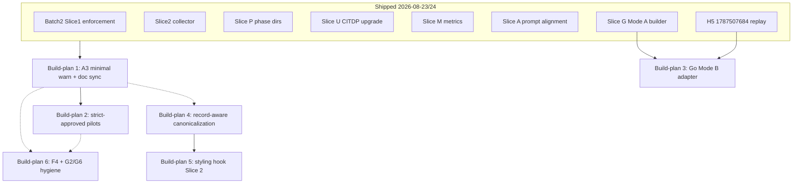

# Outstanding work — prioritized build-plan sequence

**Status:** Refined execution sequence (refine-plan pass 1, 2026-08-24)  
**Audience:** TIED methodology maintainers and agents executing `build-plan`  
**As of:** 2026-08-24  
**Basis:** Integrated activation stack close-out (Batch 2 Slices 0–2, P/U/M/A, Slice G.1, H5),
[`adversarial-inquiry-activation-recommendation.md`](adversarial-inquiry-activation-recommendation.md) §P2,
and working trackers under `working/`.

This document is the **execution order** for remaining planned work. It does not reopen
shipped integrated activation (enforcement, collector, phase persistence, metrics, Mode A
builder, H5 replay). Narrative plans that still read “open” — especially
`integrated-activation-checklist-enforcement-plan.md` §4 and §11 — should be reconciled at
Build-plan 1 close-out, not treated as blocking gates.

**This refine pass:** `depth_tier: minimal` · `gate_policy: advisory` · no integrated inquiry
required for planning-only edits to this document.

---

## 0. Refinement gates (RESOLVE)

Sponsor terms resolved against [`fidelity-research.md`](../tied/vocab/fidelity-research.md),
[`quality-assurance.md`](../tied/vocab/quality-assurance.md), and
[`prompt-composer.md`](../tied/vocab/prompt-composer.md):

| Term | Resolution |
|------|------------|
| **build-plan** | Prompt-type execution of one slice from this sequence; owns RED tests, code, CITDP persist, and close-out. |
| **Slice A** (shipped) | Prompt-type / checklist prose alignment (`CITDP-REQ-TIED_CHECKLIST_GATE_ENFORCEMENT-sliceA.yaml`). **Not** the same as **A3**. |
| **A3** (deferred) | Validator **warn-only** diagnostic when `depth_tier: minimal` on §7-eligible work lacks `integrated_waiver`; does not add fail-closed blocking beyond existing downgrade checks. |
| **§7 eligibility triggers** | External input, auth, network, persistence, strict close-out — default `depth_tier` is `integrated`; minimal requires documented `integrated_waiver`. |
| **strict-approved pilot** | Live client path where `evaluateScopedGate` may set `blocking: true` only after strict eligibility **and** recorded human approval. |
| **Mode B (Go)** | Native Go project-input evidence adapter with realpath confinement; distinct from shipped Ruby Mode B and Mode A builder. |
| **record-aware canonicalization** | Registry-driven sort of recognized mapping-record lists in TS + Ruby; prerequisite for honest styling hook. |

**Ambiguity accepted:** A3 trigger detection will use an explicit CITDP field
(`eligibility_triggers_matched: string[]`, recorded at `risk-assessment`) unless build-plan
RED proves a tag-derived classifier is sufficient. Warn-only semantics are fixed; blocking
eligibility remains the strict-pilot scope (Build-plan 2).

**Vocabulary RECORD/VALIDATE:** No new glossary terms this pass; cross-check against shipped
Batch 2 vocabulary in `fidelity-research.md` before Build-plan 1 commit.

---

## Executive summary

| Priority | Build-plan | Change request | Why now |
|----------|------------|----------------|---------|
| **1** | Policy hardening + doc sync | `REQ-TIED_CHECKLIST_GATE_ENFORCEMENT` (Slice A3) | Last deferred Batch 2 validator gap; no new MCP surface; stabilizes depth signals before strict pilots |
| **2** | Strict-approved pilots | `REQ-TIED_ADVERSARIAL_INQUIRY` (Slice S) | P2 activation maturity; code exists; needs human-approval + eligibility evidence |
| **3** | Native Go Mode B adapter | `REQ-TIED_ADVERSARIAL_INQUIRY` (Slice G.2) | Closes Go operator gap; Mode A builder + H5 fixture prove the envelope path |
| **4** | Record-aware YAML canonicalization | `REQ-TIED_YAML_CANONICALIZATION` | Unblocks honest `--sort-lists` and index/detail drift fixes; prerequisite for styling hook safety |
| **5** | Client YAML styling hook (Slice 2) | `REQ-TIED_YAML_STYLING_GATES` | Executable `client_formatter`; depends on canonical bytes + semantic compare |
| **6** | Optional hardening + hygiene | Mixed | F4 parity, Bun runner note, operator IDE reload smoke |

**Explicitly not in sequence:** retroactive integrated upgrade of client `1787503424`
(valid minimal only); universal integrated depth on all REQs; feature-orchestration Git
integration (separate roadmap); deferred-stats orchestrator wiring (Phase 4 dormant
contracts only — master roadmap Phase 5 is complete).

---

## Shipped baseline (do not re-implement)

| Area | Evidence | Tracker / CITDP |
|------|----------|-----------------|
| Batch 2 Slice 0–1 validator auto-enforcement | `checklist-validator.test.ts` pairing fixtures | `CITDP-REQ-TIED_CHECKLIST_GATE_ENFORCEMENT-batch2.yaml`, slice0/slice2 |
| Slice 2 collector | `tied_checklist_activation_collect` | `CITDP-REQ-TIED_CHECKLIST_GATE_ENFORCEMENT-slice2.yaml` |
| Slices P / U / M / A | Phase dirs, CITDP upgrade, metrics, prompt alignment | `sliceP`, `sliceU`, `CITDP-REQ-MCP_USAGE_METRICS-sliceM`, `sliceA` |
| Slice G.1 Mode A builder | `build_adversarial_inquiry_from_tied.rb` + fixture | `CITDP-REQ-TIED_ADVERSARIAL_INQUIRY-sliceG.yaml` |
| H5 integrated replay | `1787507684` / `REQ-ROOTJOBS` | `working/client-1787507684-activation-audit/` |
| Deferred stats master close-out | Phase 5 complete | `working/REQ-DEFERRED_STATS_ROADMAP/remaining-completion-plan.md` |
| Integration checklist Parts A–G (required) | 2026-08-24 verification | `adversarial-inquiry-checklist-integration-checklist.md` |

**Stale narrative (sync in Build-plan 1):** Parent enforcement plan §4.1–4.3 and §11 still list
Slice 1/2/3 and H5 as pending; §4.4 A3 correctly remains deferred.

---

## Tracker and CITDP inventory

| Build-plan | Tracker path | Status | CITDP draft | Persist target |
|------------|--------------|--------|-------------|----------------|
| 1 — A3 | `working/REQ-TIED_CHECKLIST_GATE_ENFORCEMENT/REQ-TIED_CHECKLIST_GATE_ENFORCEMENT_sliceA3_tracker.yaml` | **Create on first execution** | Draft at build-plan | `tied/citdp/CITDP-REQ-TIED_CHECKLIST_GATE_ENFORCEMENT-sliceA3.yaml` |
| 2 — Strict pilots | `working/REQ-TIED_ADVERSARIAL_INQUIRY/REQ-TIED_ADVERSARIAL_INQUIRY_sliceS_tracker.yaml` | **Create on first execution** | Draft at build-plan | `tied/citdp/CITDP-REQ-TIED_ADVERSARIAL_INQUIRY-sliceS.yaml` |
| 3 — Go Mode B | `working/REQ-TIED_ADVERSARIAL_INQUIRY/REQ-TIED_ADVERSARIAL_INQUIRY_sliceG2_tracker.yaml` | **Create on first execution** | Seed from `CITDP-REQ-TIED_ADVERSARIAL_INQUIRY-sliceG.yaml` deferred list | `tied/citdp/CITDP-REQ-TIED_ADVERSARIAL_INQUIRY-sliceG2.yaml` |
| 4 — Canonicalization | `working/REQ-TIED_YAML_CANONICALIZATION/REQ-TIED_YAML_CANONICALIZATION_record-aware_tracker.yaml` | **Exists** — `planning_complete`, pre_implementation gate passed | `working/.../CITDP-REQ-TIED_YAML_CANONICALIZATION-record-aware-draft.yaml` | `tied/citdp/CITDP-REQ-TIED_YAML_CANONICALIZATION-record-aware.yaml` |
| 5 — Styling Slice 2 | `working/REQ-TIED_YAML_STYLING_GATES/REQ-TIED_YAML_STYLING_GATES_tracker.yaml` | **Exists** — `slice2_planning` | `working/.../CITDP-REQ-TIED_YAML_STYLING_GATES-slice2-draft.yaml` | Merge slice1 + slice2 under `tied/citdp/` |
| 6 — Hygiene | N/A (doc/test-only) | Ad hoc | N/A | Optional notes in integration checklist |

---

## Depth and gate policy matrix

| Build-plan | `depth_tier` | `gate_policy` | Integrated inquiry |
|------------|--------------|---------------|-------------------|
| 1 — A3 | `minimal` | `advisory` | No |
| 2 — Strict pilots | `integrated` | `strict-candidate` → `strict-approved` (pilot) | Yes — three phases + four artifacts |
| 3 — Go Mode B | `integrated` | `advisory` | Yes — dogfood on TIED repo change |
| 4 — Canonicalization | `minimal` | `advisory` | No |
| 5 — Styling Slice 2 | `minimal` | `advisory` | No |
| 6 — Hygiene | `minimal` | `advisory` | No |

---

## Dependency graph

Solid arrows = recommended order. Dotted = optional / parallel when sponsor bandwidth allows.

**Parallelism:** After Build-plan 1 merges, Build-plans **3** (Go Mode B) and **4**
(canonicalization) may run in parallel — no code dependency between them. Build-plan **5**
remains blocked on **4**. Build-plan **2** should follow **1** (recommended, not hard-blocked).

---

## Build-plan 1 — Policy hardening (A3) + plan narrative sync

**Change request:** `REQ-TIED_CHECKLIST_GATE_ENFORCEMENT`  
**Slice id:** `batch2-sliceA3` (sibling to shipped `sliceA`, not a rename)  
**Depth:** `minimal` · **Gate policy:** `advisory`  
**Estimated scope:** 1 session · validator + tests + doc pass

### Problem

Integrated enforcement shipped, but **A3** remains deferred: the validator does not emit a
**warn-only** diagnostic when `depth_tier: minimal` is selected for §7-eligible work without a
documented `integrated_waiver` (`integrated-activation-checklist-enforcement-plan.md` §4.4,
§6 Phase A). Checklist prose and `citdp-policy.md` already describe sponsor confirmation;
A3 adds machine-visible signal without fail-closed blocking (distinct from
`depth_downgrade_requires_waiver`).

### Deliverables

| # | Deliverable | Location |
|---|-------------|----------|
| 1 | LEAP `VALIDATE_MINIMAL_WAIVER` block (PRE/POST/EFFECTS) | `IMPL-TIED_CHECKLIST_GATE_ENFORCEMENT-pseudocode.md` |
| 2 | Optional CITDP field `eligibility_triggers_matched: string[]` + template note | `tied/docs/citdp-record-template.yaml`, `citdp-policy.md` |
| 3 | Diagnostic `minimal_depth_missing_waiver` (warn-only, non-blocking) | `mcp-server/src/checklist-validator.ts` |
| 4 | RED fixtures: triggered minimal without waiver → warn; minimal with waiver → clean; non-triggered minimal unchanged; integrated unchanged | `checklist-validator.test.ts` |
| 5 | Reconcile parent plan §4.1–4.3 and §11 to shipped reality (see table below) | `integrated-activation-checklist-enforcement-plan.md` |
| 6 | CITDP persist | `tied/citdp/CITDP-REQ-TIED_CHECKLIST_GATE_ENFORCEMENT-sliceA3.yaml` |

#### Parent plan §4 / §11 reconciliation targets

| Section | Current text | Update to |
|---------|--------------|-----------|
| §4.1 items (phase-aware slugs, pairing, downgrade, etc.) | Listed as gaps | **Shipped** (Batch 2 Slice 1) |
| §4.2 collector | “No helper” | **Shipped** (`tied_checklist_activation_collect`) |
| §4.3 H5 | “Pending” | **Shipped** (2026-08-24, client `1787507684`) |
| §4.4 A3 | Deferred | Remains deferred until this build-plan closes |
| §11 success criteria rows for Slice 1/2/3 | Pending | Match shipped CITDP + checklist evidence |

### Test strategy

| Layer | Cases |
|-------|-------|
| Unit | `minimal_depth_missing_waiver` when `eligibility_triggers_matched` non-empty + `depth_tier: minimal` + no `integrated_waiver` |
| Unit | No diagnostic when waiver complete, triggers empty, or depth is `integrated` |
| Unit | `gate_policy: advisory` → `blocking: false` even when diagnostic present |
| Regression | Existing downgrade, pairing, and minimal counterexample fixtures unchanged |
| Validation | `pseudocode_validate`, `npm test --prefix mcp-server` (checklist-validator subset), `tied_validate_consistency` |

### Acceptance

- `pseudocode_validate` passes on new block(s)
- `npm test --prefix mcp-server` (checklist-validator subset) passes
- `tied_validate_consistency` → `ok: true`
- No change to minimal-client validity (`1787503424`, `1787507684` minimal history)

### Tracker bootstrap

Copy `tied/docs/agent-req-implementation-checklist.yaml` →  
`working/REQ-TIED_CHECKLIST_GATE_ENFORCEMENT/REQ-TIED_CHECKLIST_GATE_ENFORCEMENT_sliceA3_tracker.yaml`

---

## Build-plan 2 — Strict-approved pilots

**Change request:** `REQ-TIED_ADVERSARIAL_INQUIRY`  
**Slice id:** `sliceS-strict-pilots`  
**Depth:** `integrated` · **Gate policy:** `strict-candidate` → `strict-approved` (pilot)  
**Estimated scope:** 2 sessions · pilot design + one live client + CITDP

### Problem

`strict-approved` blocking is implemented but **not piloted**. Release acceptance for
“Activated (strict)” requires eligibility, human approval, and scoped blocking evidence
(`adversarial-inquiry-activation-recommendation.md` §Activation maturity model).

### Prerequisites

- Build-plan 1 merged (recommended — clearer minimal vs integrated signals)
- Pilot client with `./copy_files.sh` refresh and neutral checklist bootstrap
- Sponsor names **human approval owner** and **waiver expiry** before RED

### Pilot client selection

| Candidate | Pros | Cons |
|-----------|------|------|
| `1787416567` (VolumeStats) | Prior integrated pilot; Ruby stack | Already advisory-only evidence |
| Controlled fixture client | Reproducible | Less operator realism |
| `1787507684` (ROOTJOBS) | H5 replay runbook | Duplicate stack proof — sponsor opt-in only |

**Default:** refresh `1787416567` unless sponsor designates another client in CITDP.

### Deliverables

| # | Deliverable | Notes |
|---|-------------|-------|
| 1 | CITDP draft with `gate_policy: strict-candidate` at risk-assessment, promotion path to `strict-approved` | Template fields: negative controls, proof boundaries, waiver owner/expiry |
| 2 | Pilot script or runbook (mirror H5 replay shape) | inquiry → collect → gate; record `blocking: true` only when eligibility + approval pass |
| 3 | Live pilot on **one** client | Distinct phase `run_id`s; four artifacts per phase; pilot evidence per `pilot.ts` `CALIBRATE_PILOT` |
| 4 | Extend `pilot.test.ts` / checklist-integration tests only if pilot exposes a confirmed gap | LEAP before code |
| 5 | Update activation recommendation §P2 → move strict pilots to “shipped” or document limitations | `docs/adversarial-inquiry-activation-recommendation.md` |
| 6 | CITDP persist | `tied/citdp/CITDP-REQ-TIED_ADVERSARIAL_INQUIRY-sliceS.yaml` |

### Test strategy

| Layer | Cases |
|-------|-------|
| Unit | Existing `validateStrictEligibility` + approval negative controls (no new semantic rules without LEAP) |
| Composition | End-to-end: eligibility pass + approval → `blocking: true`; missing approval → warn-only / fail-closed per existing tests |
| Pilot | Recorded gate JSON under `working/{REQ}/adversarial-inquiry/` with human approval metadata |
| Metrics | `integrated_activation_complete: true` alongside strict evidence |

### Acceptance

- At least one end-to-end path where `evaluateScopedGate` sets `blocking: true` with recorded human approval
- At least one negative control: strict-approved **without** approval → does not block (or fails closed per existing tests)
- `integrated_activation_complete` still required alongside strict evidence
- Part H does **not** need a third client unless sponsor wants duplicate stack proof

### Out of scope

- Universal strict-approved on all REQs
- Retroactive strict upgrade of minimal-only clients

---

## Build-plan 3 — Native Go Mode B project-input adapter

**Change request:** `REQ-TIED_ADVERSARIAL_INQUIRY`  
**Slice id:** `sliceG2-go-mode-b` (extends closed Slice G)  
**Depth:** `integrated` · **Gate policy:** `advisory`  
**Estimated scope:** 3+ sessions · loader + orchestrator + fixture + composition

### Problem

Go operators still rely on the Ruby Mode A builder (`build_adversarial_inquiry_from_tied.rb`).
H5 proved integrated activation via Mode A; **Mode B** (explicit project-input dispatch with
realpath confinement) remains the native adapter gap (`Slice G tracker deferred`, adoption doc §Mode B).

Ruby Mode B shipped (`CITDP-REQ-TIED_ADVERSARIAL_INQUIRY_MODE_B.yaml`); Go adapter is a **new boundary**,
not a port of the Ruby Minitest adapter.

### Prerequisites

- Slice G.1 Mode A builder + `adversarial-inquiry-go-rootjobs` fixture (shipped)
- H5 replay runbook as operator reference
- IMPL pseudo-code blocks for Go loader/orchestrator **before RED**

### Deliverables

| # | Deliverable | Location |
|---|-------------|----------|
| 1 | ARCH/IMPL LEAP for Go project scope loader + orchestrator | `ARCH-TIED_ADVERSARIAL_INQUIRY`, `IMPL-TIED_ADVERSARIAL_INQUIRY` |
| 2 | Go evidence adapter boundary (read-only; no shell inference) | `mcp-server/src/adversarial-inquiry/` (new modules or `go-evidence-*`) |
| 3 | Mode B dispatch extension: `project` discriminator accepts Go test/production paths | `adversarial-inquiry-mcp` + zod boundary |
| 4 | Fixture under `mcp-server/test/fixtures/adversarial-inquiry-go-mode-b/` | Derived from 1787507684 layout; repo-relative paths only |
| 5 | Composition: Mode B Go fixture → bounded artifacts → collect → gate | Extend `checklist-activation-collect.test.ts` or sibling |
| 6 | Adoption doc §Go Mode B operator sequence | `docs/adversarial-inquiry-adoption.md` |
| 7 | CITDP persist | `tied/citdp/CITDP-REQ-TIED_ADVERSARIAL_INQUIRY-sliceG2.yaml` |

### Test strategy

| Layer | Cases |
|-------|-------|
| Unit | 8+ focused loader/orchestrator tests (mirror Ruby Mode B bar) |
| Unit | Mode B rejects mixed Mode A fields with stable `INVALID_INPUT` |
| Unit | Realpath confinement rejects paths outside project root |
| Composition | Fixture dispatch → four artifacts → collect → gate `allowed: true` |
| Optional smoke | MCP reload + one Go fixture dispatch (G6-class evidence) |

### Acceptance

- 8+ focused unit tests on loader/orchestrator (mirror Ruby Mode B bar)
- Mode B rejects mixed Mode A fields with stable `INVALID_INPUT`
- `npm test --prefix mcp-server` full suite passes
- Optional operator smoke: MCP reload + one Go fixture dispatch (G6 class evidence)
- **Does not** require replay of client `1787503424`

### Tracker bootstrap

Copy checklist YAML →  
`working/REQ-TIED_ADVERSARIAL_INQUIRY/REQ-TIED_ADVERSARIAL_INQUIRY_sliceG2_tracker.yaml`  
Seed from `CITDP-REQ-TIED_ADVERSARIAL_INQUIRY-sliceG.yaml` deferred list.

---

## Build-plan 4 — Record-aware YAML canonicalization

**Change request:** `REQ-TIED_YAML_CANONICALIZATION`  
**Depth:** `minimal` · **Gate policy:** `advisory`  
**Estimated scope:** 2–3 sessions

### Problem

Default canonicalizer and Ruby `--sort-lists` can reorder record lists incorrectly;
index/detail REQ drift (6 vs 7 satisfaction criteria) blocks honest promotion.

### Deliverables

Use scope from `working/REQ-TIED_YAML_CANONICALIZATION/CITDP-REQ-TIED_YAML_CANONICALIZATION-record-aware-draft.yaml`:

- Record-list registry in `ARCH-TIED_YAML_CANONICAL_PROFILE`
- `RECOGNIZE_RECORD_LIST` / `SORT_RECORD_LIST` IMPL blocks + tests (TS + Ruby)
- REQ index/detail LEAP alignment
- Persist CITDP to `tied/citdp/`

### Test strategy

| Layer | Cases |
|-------|-------|
| Unit (TS) | Single-line and multi-line `satisfaction_criteria` record-list fixtures |
| Unit (Ruby) | `yaml_list_sorter.rb --sort-lists` whole-block sort aligned with TS |
| Integration | `yaml_semantic_compare` accepts recognized record reordering; rejects unrelated drift |
| Regression | Unregistered object lists preserve order |

### Acceptance

- RED/GREEN on single-line and multi-line record-list fixtures
- `yaml_semantic_compare` accepts recognized record reordering
- `lint_yaml` + `tied_validate_consistency` pass

### Tracker

`working/REQ-TIED_YAML_CANONICALIZATION/REQ-TIED_YAML_CANONICALIZATION_record-aware_tracker.yaml` (exists; advance from `planning_complete`)

---

## Build-plan 5 — Client YAML styling hook (Slice 2)

**Change request:** `REQ-TIED_YAML_STYLING_GATES`  
**Depth:** `minimal` · **Gate policy:** `advisory`  
**Estimated scope:** 2 sessions

### Problem

Slice 1 shipped checklist contract; Slice 2 adds executable `client_formatter` hook with
fail-closed path guards and semantic compare acceptance.

### Prerequisites

- **Build-plan 4** merged (canonical bytes + semantic compare must be trustworthy)

### Deliverables

Use `working/REQ-TIED_YAML_STYLING_GATES/CITDP-REQ-TIED_YAML_STYLING_GATES-slice2-draft.yaml`:

- `yaml-client-formatter.ts` + fixtures
- Optional MCP `tied_client_yaml_styling_apply` (read-only styling apply)
- Merge Slice 1 + Slice 2 CITDP to `tied/citdp/`

### Test strategy

| Layer | Cases |
|-------|-------|
| Unit | Path guard rejects writes outside allowed roots |
| Unit | Semantic compare accepts presentation-only diffs |
| Contract | Slice 1 checklist contract tests remain green |
| Optional MCP | Read-only styling apply returns canonical bytes |

### Tracker

`working/REQ-TIED_YAML_STYLING_GATES/REQ-TIED_YAML_STYLING_GATES_tracker.yaml` (advance from `slice2_planning`)

---

## Build-plan 6 — Optional hardening and hygiene

Run when sponsor bandwidth allows; none block Build-plans 1–3.

| Item | REQ / doc | Action | Status |
|------|-----------|--------|--------|
| **F4** automated YAML/MD parity | Adversarial inquiry checklist | Table-driven test: canonical checklist YAML slugs ↔ rendered task bullets (B14 automation) | Open — B14 manual gate retained |
| **G2** Bun full suite | Integration checklist Part G | Document `npm test` as canonical; add CI note or skip marker for `bun test` nested-test limitation | Open |
| **G6** operator IDE reload smoke | Integration checklist Part G | One recorded IDE reload + tool catalog check; **MCP invoke smoke already passed 2026-08-22** | Partial — reload deferred by sponsor |
| **Deferred stats adapters** | `REQ-DEFERRED_STATS_ROADMAP` | Reopen only if sponsor promotes Phase 4 orchestrator wiring | Closed (structural contracts only) |
| **Git integration** | Feature orchestration roadmap | Separate epic; not adversarial-inquiry scope | Out of scope |

---

## What stays explicitly out of scope

| Item | Rationale |
|------|-----------|
| Client `1787503424` integrated replay | Superseded by H5 (`1787507684`); retroactive upgrade not required (`activation-recommendation` §Release acceptance) |
| Universal integrated depth | Policy choice per CITDP; not mandated globally |
| Batch 2 re-implementation | Slices 0–2, P, U, M, A, G.1 shipped — trackers and `tied/citdp/` are source of truth |
| `tied/methodology/**` edits | `[PROC-TIED_METHODOLOGY_READONLY]` |
| Reopening deferred-stats Phases 1–5 | Master roadmap complete; only orchestrator wiring excluded |

---

## Execution checklist (every build-plan)

1. `tied_config_get_base_path` → confirm active `tied/`
2. Copy per-request tracker from `agent-req-implementation-checklist.yaml` (or advance existing)
3. CITDP at `risk-assessment` with explicit `depth_tier` and `gate_policy`
4. IMPL pseudo-code + `pseudocode_validate` before RED
5. `npm test` / language lint per `[PROC-TIED_DEV_CYCLE]`
6. Integrated depth: `sub-adversarial-inquiry-pass` + four phase artifacts when applicable
7. `tied_checklist_gate_validate` at `pre_implementation`, `verification`, and `close_out`
8. `tied_validate_consistency` before close-out
9. `./copy_files.sh` on pilot clients only when methodology prose/skills change

---

## Suggested immediate next action

**Start Build-plan 1 (A3 + doc sync)** — smallest diff, closes the last deferred validator item in the
integrated enforcement parent plan, and clears the runway for strict-approved pilots without
new MCP surfaces.

**Prompt-type entry:** `build-plan` with tracker  
`working/REQ-TIED_CHECKLIST_GATE_ENFORCEMENT/REQ-TIED_CHECKLIST_GATE_ENFORCEMENT_sliceA3_tracker.yaml`  
(create on first execution).

---

## Related artifacts

| Document | Role |
|----------|------|
| [`integrated-activation-checklist-enforcement-plan.md`](integrated-activation-checklist-enforcement-plan.md) | Parent Batch 2 narrative (**§4 / §11 sync pending** — Build-plan 1) |
| [`integrated-activation-enforcement-operator-friction-plan.md`](integrated-activation-enforcement-operator-friction-plan.md) | Operator slices P/U/M/G/A (shipped) |
| [`adversarial-inquiry-activation-recommendation.md`](adversarial-inquiry-activation-recommendation.md) | P0/P1 shipped · P2 remaining |
| [`adversarial-inquiry-checklist-integration-checklist.md`](adversarial-inquiry-checklist-integration-checklist.md) | F4, G2 open optional; G6 invoke done, IDE reload optional |
| [`tied-improvement-roadmap.md`](tied-improvement-roadmap.md) | Git integration deferred |
| [`working/REQ-DEFERRED_STATS_ROADMAP/remaining-completion-plan.md`](../working/REQ-DEFERRED_STATS_ROADMAP/remaining-completion-plan.md) | Stats master close-out complete; orchestrator wiring excluded |
