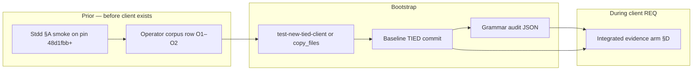

# Prior work plan — next graded client test (evidence + grammar v2)

**Status:** Refined plan (2026-09-11) — Refine + CITDP Plan gates complete; operator execution deferred  
**Grading arms:** Same disposable or `/dev/test` client, two **comparable** proof boundaries (no rollup score)  
**Execution runbook:** [`pre-cohort-client-test-grammar-v2-and-evidence.md`](pre-cohort-client-test-grammar-v2-and-evidence.md) (§A–D commands, acceptance criteria, corpus fields)  
**Methodology context:** [`pseudocode-grammar-v2-and-hygiene-plan.md`](pseudocode-grammar-v2-and-hygiene-plan.md) (Tracks A/C/B + Step 7 hygiene close-out)

---

## Executive summary

The next **client cohort test** is graded on two independent arms:

| Arm | Primary proof | Shipped stdd tokens / surfaces |
|-----|---------------|--------------------------------|
| **Grammar v2** | New-project bootstrap declares `Grammar-Version: v2` | [REQ-PSEUDOCODE_GRAMMAR_V2_DEFAULT](../tied/requirements/REQ-PSEUDOCODE_GRAMMAR_V2_DEFAULT.yaml), `scripts/audit-grammar-v2-default.mjs`, §14 in [`evidence-collection-conversation-patterns.md`](evidence-collection-conversation-patterns.md) |
| **Evidence** | Integrated client `REQ-*` close-out with zero blocking envelope gaps | [REQ-REQUEST_EVIDENCE_ENVELOPE](../tied/requirements/REQ-REQUEST_EVIDENCE_ENVELOPE.yaml), [REQ-TIED_CHECKLIST_GATE_ENFORCEMENT](../tied/requirements/REQ-TIED_CHECKLIST_GATE_ENFORCEMENT.yaml), Wave 6 profile/manifest/PSA expectations |

**Prior to starting the client test**, work splits into **stdd readiness** (once per methodology pin) and **operator setup** (corpus row + bootstrap). **During** the test, the client tree owns the evidence arm (Tracker, inquiry, gates, envelope).

Vocabulary: preload [`tied/vocab/pseudocode-and-citdp.md`](../tied/vocab/pseudocode-and-citdp.md) (grammar v2, `grammar_v2_header audit dimension`) and [`tied/vocab/quality-assurance.md`](../tied/vocab/quality-assurance.md) (evaluation corpus, comparable arms, proof boundary). Process-only label **prior-work plan** names this document’s S/O/D sequencing (not a new glossary entry).

---

## Refine gate — resolved scope and vocabulary

**Sponsor intent resolved:** Before the first graded client bootstrap, operators need an explicit **prior-work plan** that separates (1) **stdd readiness** (methodology pin + §A smoke), (2) **operator setup** (evaluation corpus row + bootstrap + grammar audit JSON), and (3) **during-test** work on the **client** tree (integrated evidence arm). The two **comparable arms** (grammar v2 header policy vs request evidence envelope) remain independent pass/fail boundaries; this document does not introduce a rollup score or new product REQ tokens.

**Work-item classes (authoritative matrices below):**

| Class | When | Owner | Matrix |
|-------|------|-------|--------|
| **S-items** | Before any client exists | stdd checkout + operator running §A | [Stdd prior work — status matrix](#stdd-prior-work--status-matrix) |
| **O-items** | Before bootstrap | Operator (gitignored corpus + client tree) | [Operator prior work](#operator-prior-work--before-client-bootstrap) |
| **D-items** | After baseline client commit | Client `working/{REQ}/` integrated Tracker | [During the client test](#during-the-client-test-evidence-arm--not-prior-but-graded) |

Vocabulary aligns with existing records in [`tied/vocab/pseudocode-and-citdp.md`](../tied/vocab/pseudocode-and-citdp.md) and [`tied/vocab/quality-assurance.md`](../tied/vocab/quality-assurance.md). No new glossary terms required.

### Refine disposition

- Ambiguity cleared: hygiene Tracks A/C/B and §E automation are **shipped** at **`48d1fbb+`**; the next test is operator sequencing plus client REQ execution, not another stdd hygiene close-out.
- **Non-goals** reaffirmed: no stdd REQ/ARCH/IMPL for operator-only steps; no `constraint_flow: true` cohort gate; no mass v2 retrofit.
- **Open questions** (defaults accepted until operator run):

| ID | Question | Default until resolved |
|----|----------|------------------------|
| OQ-P1 | Is `plumb-diff-impact-preview` flake blocking stdd preflight? | **Resolved:** pass explicit `tied_base_path` in impact preview; **305/305** analysis tests remain the hard gate (see runbook OQ-1) |
| OQ-P2 | Sync §14 “Track A close-out deferred” prose? | **Resolved (sponsor 2026-09-11):** §14 status synced in [`evidence-collection-conversation-patterns.md`](evidence-collection-conversation-patterns.md) |
| OQ-P3 | First bootstrap path? | **Resolved:** `test-new-tied-client` under `$TIED_TEST_ROOT` |
| OQ-P4 | Which client `REQ-*` carries the evidence arm? | **Resolved:** **Feature orchestration** (`FEAT-*` / feature MCP) spawns client `REQ-*`; CITDP **`depth_tier: integrated`** on that REQ |
| OQ-P5 | S1 methodology pin on every machine? | **Resolved (this machine):** sponsor confirmed **`48d1fbb+`**; re-check before O3 on other machines |

---

## CITDP Plan gate — operator prior-work design

**Working CITDP:** [`working/PRE-COHORT-CLIENT-TEST/CITDP-PRE-COHORT-CLIENT-TEST.yaml`](../working/PRE-COHORT-CLIENT-TEST/CITDP-PRE-COHORT-CLIENT-TEST.yaml)  
**Operator Tracker:** [`working/PRE-COHORT-CLIENT-TEST/agent-req-implementation-checklist.yaml`](../working/PRE-COHORT-CLIENT-TEST/agent-req-implementation-checklist.yaml)  
**Execution runbook (§A–D):** [`pre-cohort-client-test-grammar-v2-and-evidence.md`](pre-cohort-client-test-grammar-v2-and-evidence.md)

| Field | Value | Notes |
|-------|-------|-------|
| `change_request_id` | `PROCESS-PRE-COHORT-CLIENT-TEST` | Process orchestration; not a product REQ |
| `profile_depth` | `minimal` | Doc/runbook + prior-work refinement only |
| `gate_policy` | `advisory` | Integrated inquiry + activation belong to **client** `REQ-*` |
| Methodology pin | **`48d1fbb+`** | Hygiene `d3787ca` + §E `4deb586` + close-out hooks `48d1fbb` |

**CITDP updates (2026-09-11 refine):** `linked_plans` includes this prior-work plan; `current_behavior` / `desired_behavior` / `success_criteria` reference S/O/D gates and the pin rule. Falsification questions cover conflating grammar header pass with envelope close-out and stale stdd checkouts across machines.

**Test strategy:** Operator-executed verification per runbook §A–D and matrices in this document; **no new stdd RED tests** in this refine pass.

**Pre_implementation gate:** `tied_checklist_gate_validate` → **`allowed: true`**, `depth: minimal`, receipt [`pre_implementation-2026-09-12T01-09-47-399Z.json`](../working/PRE-COHORT-CLIENT-TEST/gates/pre_implementation-2026-09-12T01-09-47-399Z.json) (`run_id: pre-cohort-prior-work-refine-20260911`).

---

## Implement gate — not authorized

This refine pass does **not** authorize client bootstrap, corpus registration, integrated TDD, stdd product changes, or `/build-plan` for §E extensions. Operator executes **S-items → O-items → D-items** manually per runbook §A–D. Client **`/plan-close-out`** on the chosen **`REQ-*`** remains the evidence-arm completion path after D-items.

---

## Methodology baseline (hygiene plan → cohort-ready)

Tracks from the hygiene plan are **implementation-complete** in stdd; Step 7 combined close-out landed on the lineage below.

| Milestone | Commit (short) | What it adds for the next client test |
|-----------|------------------|----------------------------------------|
| Hygiene bundle (A+C+B product) | `d3787ca` | v2 template default, validator hardening, sidecar sweep, audit CLI |
| §E cohort automation | `4deb586` | Corpus grammar-v2 replay, versioned disposable baseline commit message |
| Close-out tooling fixes | `48d1fbb` | Envelope diff-or-stage hooks, agentstream CLI precedence |

**Pin rule:** Every machine that runs `copy_files.sh` or `test-new-tied-client` against this cohort must use **`48d1fbb` or later** on the stdd source (not only `d3787ca`), so §E replay and baseline commit behavior match the runbook.

**Not required before client test:** Another full-repo sidecar `--check` sweep, re-close-out of stdd hygiene REQs, or mass v2 migration of legacy clients.

---

## Stdd prior work — status matrix

Complete **§A** in the runbook before the first bootstrap of a graded client.

| # | Work item | Owner | Status (2026-09-11) | Verification |
|---|-----------|-------|----------------------|--------------|
| S1 | Methodology pin ≥ `48d1fbb` | Operator / CI | **Open** — confirm on each machine | `git log -1 --oneline` at stdd root |
| S2 | MCP build | Operator | **Pass** (this session) | `npm run build --prefix mcp-server` |
| S3 | Grammar v2 audit smoke (stdd self) | Operator | **Pass** | `node scripts/audit-grammar-v2-default.mjs` → `ok: true`, `dimensions.grammar_v2_header: pass` |
| S4 | Sidecar normalize tests | Operator | **Pass** | `node --test scripts/normalize-sidecar-block-leads.test.mjs` |
| S5 | Analysis unit suite | Operator | **Pass** (305/305) | `node --test mcp-server/dist/analysis/*.test.js` |
| S6 | `TIED_BASE_PATH` alignment when using MCP from stdd | Operator | **Confirm per session** | MCP `tied_config_get_base_path` → `{stdd}/tied` |
| S7 | §14 prose sync (Track A shipped vs operator grading) | stdd doc hygiene | **Done** (sponsor 2026-09-11) | [`evidence-collection-conversation-patterns.md`](evidence-collection-conversation-patterns.md) §14 status line |
| S8 | `MISSING_GRAMMAR_V2_HEADER` policy flag | stdd product | **Deferred** — not a cohort gate | Hygiene plan Track A follow-on |

**Stdd gate:** Items S2–S5 green on the pinned commit. Item S1 is the usual failure mode when one laptop runs an older stdd checkout.

---

## Operator prior work — before client bootstrap

These steps do **not** modify stdd; they must exist before the graded client tree is created.

| # | Work item | Runbook | Done when |
|---|-----------|---------|-----------|
| O1 | Copy evaluation corpus template → live file | §B | `working/evaluation/evaluation-corpus.v1.yaml` exists (gitignored) |
| O2 | Add row for **new** client | §B | `envelope_require_mode: require_envelope`, `grammar_v2_header_expect: pass`, paths filled |
| O3 | Choose bootstrap path | §C | `test-new-tied-client` (preferred) or `copy_files.sh` |
| O4 | Baseline git commit on client | §C | `TIED 3.0` / current version from [AGENTS.md](../AGENTS.md) **before** custom prompting |
| O5 | Grammar audit JSON archived | §C | `grammar-v2-default-audit.v1` with header dimension `pass` |

Optional baseline gap scan (does not substitute for close_out):

```bash
npm run request-evidence-envelope-batch-collect -- \
  --corpus ../working/evaluation/evaluation-corpus.v1.yaml \
  --yaml-out ../working/evaluation/envelope-gap-report.v1.yaml
```

**Operator gate:** O1–O2 complete **before** O3; O4 immediately after bootstrap; O5 before or in parallel with client REQ work (header grade is bootstrap-bound, not close_out-bound).

---

## During the client test (evidence arm — not “prior” but graded)

Standard **integrated** lifecycle on the **client** `working/{REQ}/` Tracker (authoritative checklist lives in the client repo, not stdd):

1. **Pre_implementation** — CITDP + pseudo-code gates + `tied_checklist_gate_validate` `allowed: true`; activation collect when `depth_tier: integrated`.
2. **Implementation** — TDD per Tracker; PSA artifacts under `working/{REQ}/pseudocode-analysis/`.
3. **Verification** — Gate `phase: verification` with activation; `allowed: true`; manifest/profile gaps addressed or waived per policy.
4. **Close_out** — `run-close-out-gates.mjs` with `--envelope-blocking --sync-dispositions --reconcile`; envelope validate with **`fail_on_error_gaps: true`** → **blocking_gaps = 0**.

Wave 6 integrated artifacts (typical error gaps if missing): `verification-evidence-manifest.v1.json`, `evidence-chain-profile.v1.json`, scoped `pseudocode-analysis/{IMPL}.v1.json`.

Post-session (envelope batch; grammar audit when corpus row expects it):

```bash
scripts/tied-post-session.sh {client_id} --corpus working/evaluation/evaluation-corpus.v1.yaml
```

Details: runbook §D and [`tied/docs/request-evidence-envelope.md`](../tied/docs/request-evidence-envelope.md).

---

## Proof boundaries (do not conflate)

| Signal | Establishes | Does **not** establish |
|--------|-------------|-------------------------|
| `grammar_v2_header: pass` | Template/bootstrap v2 preamble policy | Client REQ close-out, Layer C on all IMPLs, `constraint_flow` |
| Envelope file present | Machine index exists | Zero blocking gaps |
| Gate `allowed: true` | Phase checklist contract | Envelope blocking unless `--envelope-blocking` also passes |
| Replay fixtures green | Regression on **registered** corpus rows | New client audit if row omits `grammar_v2_header_expect: pass` |

---

## Cohort pass / fail (both arms)

**Pass** only when **all** hold (runbook §Acceptance criteria):

1. Corpus row complete with `grammar_v2_header_expect: pass` and `require_envelope`.
2. Grammar: audit `ok: true`; independent dimensions in JSON (`layer_b`, `layer_c`, `legacy_v1_compatibility`; `constraint_flow: false` on default smoke).
3. Evidence: verification + close_out receipts `allowed: true`; envelope **blocking_gaps = 0** at integrated depth.
4. Operator archives audit JSON, envelope path, gate receipts, activation artifacts under client `working/{REQ}/`.

**Fail** examples: audit header not `pass`; close_out without `--envelope-blocking`; treating replay-only green as grammar grade when corpus expects `pass`.

---

## Suggested order of work



1. **Stdd** — S1–S6 (runbook §A).  
2. **Operator** — O1–O2.  
3. **Bootstrap + grammar arm** — O3–O5 (runbook §C).  
4. **Evidence arm** — client REQ lifecycle (runbook §D).  
5. **Optional stdd** — S7 doc hygiene only if reviewers still see stale §14 deferral text.

---

## TIED orchestration artifacts (no product REQ)

| Artifact | Path |
|----------|------|
| Operator CITDP | [`working/PRE-COHORT-CLIENT-TEST/CITDP-PRE-COHORT-CLIENT-TEST.yaml`](../working/PRE-COHORT-CLIENT-TEST/CITDP-PRE-COHORT-CLIENT-TEST.yaml) |
| Operator Tracker | [`working/PRE-COHORT-CLIENT-TEST/agent-req-implementation-checklist.yaml`](../working/PRE-COHORT-CLIENT-TEST/agent-req-implementation-checklist.yaml) |
| Corpus template | [`working/evaluation/evaluation-corpus.v1.template.yaml`](../working/evaluation/evaluation-corpus.v1.template.yaml) |
| Hygiene process Tracker | [`working/pseudocode-hygiene-closeout/agent-req-implementation-checklist.yaml`](../working/pseudocode-hygiene-closeout/agent-req-implementation-checklist.yaml) |

Process id: `PROCESS-PRE-COHORT-CLIENT-TEST`. Client-owned `REQ-*` remains the primary token for the evidence grade.

---

## Explicit non-goals (prior phase)

- New stdd REQ/ARCH/IMPL for operator execution alone  
- `constraint_flow: true` as a grammar-v2 cohort gate  
- Mass retrofit of v2 headers on pre-existing client sidecars  
- Substituting stdd Track B capstone envelope for the **client** REQ envelope  

---

## Next prompt types

| When | Action |
|------|--------|
| Stdd S1 unset or S2–S5 red | Fix stdd / pin; re-run §A |
| Stdd green, no client yet | Operator O1–O2, then `/build-plan` or manual bootstrap per runbook §C |
| Client bootstrapped | Execute client integrated Tracker; `/plan-close-out` on **client** `REQ-*` |
| Repeat cohort automation only | Already shipped §E — extend corpus rows, use `replay-adherence-fixtures.mjs` |

**Cohort reference client:** First graded run [`docs/urlfetch-client-1789177584-agentic-analysis.md`](urlfetch-client-1789177584-agentic-analysis.md) (`1789177584`, `REQ-URLFETCH_CLI`).

**Last updated:** 2026-09-12 — cohort reference analysis linked.
