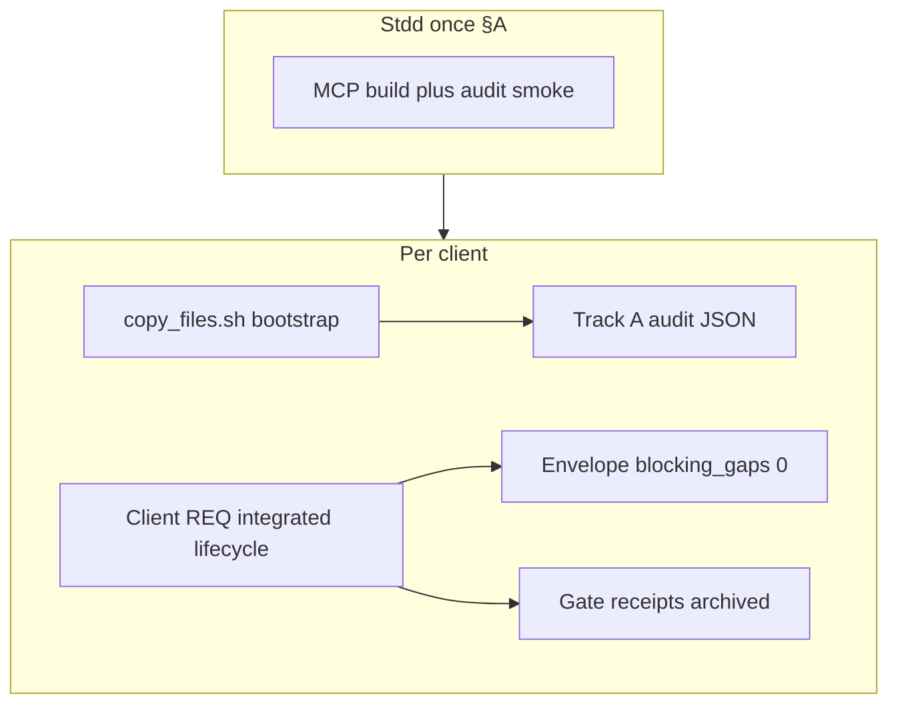

# Pre–cohort client test: grammar v2 + request evidence

**Status:** Refined operator runbook (2026-09-11) — Refine + CITDP Plan gates complete; client execution deferred  
**Context:** Post–hygiene close-out commit `d3787ca` ([`pseudocode-grammar-v2-and-hygiene-plan.md`](pseudocode-grammar-v2-and-hygiene-plan.md))  
**Authoritative working copy:** [`working/PRE-COHORT-CLIENT-TEST/`](../working/PRE-COHORT-CLIENT-TEST/) (Tracker + CITDP; not a product REQ)

---

## Refine gate — resolved scope and vocabulary

**Sponsor intent resolved:** The next **client cohort test** grades two **comparable arms** on the same disposable or `/dev/test` client without rollup scoring:

1. **Grammar v2 arm (Track A)** — proves **new-project bootstrap policy** for `Grammar-Version: v2` via [`REQ-PSEUDOCODE_GRAMMAR_V2_DEFAULT`](../tied/requirements/REQ-PSEUDOCODE_GRAMMAR_V2_DEFAULT.yaml) and the audit CLI ([`evidence-collection-conversation-patterns.md`](evidence-collection-conversation-patterns.md) §14).
2. **Evidence arm (Wave 6–8)** — proves **integrated request evidence** for a **client-owned** `REQ-*` via checklist gates, adversarial inquiry (when `depth_tier: integrated`), and [`request-evidence-envelope.v1.json`](../tied/docs/request-evidence-envelope.md) with **blocking error gaps = 0**.

**Proof boundaries (must not conflate):**

| Term | Establishes | Does **not** establish |
|------|-------------|------------------------|
| **grammar_v2_header** | Template copyable body has exact `Grammar-Version: v2` preamble | Layer B/C completeness, runtime, `constraint_flow`, client REQ close-out |
| **Envelope present** | Machine index exists with typed cross-links | Profile field completeness, grammar header, gate `allowed` |
| **Gate `allowed: true`** | Checklist dispositions satisfy phase contract | Envelope blocking gaps zero unless `--envelope-blocking` also passes |
| **Layer C `gate_mode: true`** | Static analysis gate on scoped IMPL pseudo-code | Full behavioral test coverage |

Vocabulary is aligned with [`tied/vocab/quality-assurance.md`](../tied/vocab/quality-assurance.md) (**evaluation corpus**, **comparable arms**, **proof boundary**) and [`tied/vocab/pseudocode-and-citdp.md`](../tied/vocab/pseudocode-and-citdp.md) (**grammar v2**, **grammar_v2_header audit dimension**). No new glossary terms required for this runbook.

### Refine disposition

- Ambiguity cleared: stdd ships tooling; **operator + client tree** execute the grade; two arms are independent pass/fail.
- **Non-goals** reaffirmed: mass v2 migration, `constraint_flow: true` as cohort gate, treating replay fixtures alone as Track A grade.
- **Open questions** (explicitly accepted until operator run):

| ID | Question | Default until resolved |
|----|----------|------------------------|
| OQ-1 | Is `plumb-diff-impact-preview` test flake blocking for stdd preflight? | **Resolved (§E build):** pass explicit `tied_base_path` in impact preview; use 305/305 as hard gate |
| OQ-2 | Sync §14 “Track A close-out deferred” prose in conversation patterns? | Optional doc hygiene in stdd (not blocking client test) |
| OQ-3 | Prioritize §E cohort automation in stdd? | **Resolved:** replay/post-session enforce pass rows; manual audit CLI still valid for one-off §C |

---

## CITDP Plan gate — operator runbook design

**Working CITDP:** [`working/PRE-COHORT-CLIENT-TEST/CITDP-PRE-COHORT-CLIENT-TEST.yaml`](../working/PRE-COHORT-CLIENT-TEST/CITDP-PRE-COHORT-CLIENT-TEST.yaml)  
**Operator Tracker:** [`working/PRE-COHORT-CLIENT-TEST/agent-req-implementation-checklist.yaml`](../working/PRE-COHORT-CLIENT-TEST/agent-req-implementation-checklist.yaml)

| Field | Value | Notes |
|-------|-------|-------|
| `profile_depth` | `minimal` | Runbook refinement; not the client REQ |
| `gate_policy` | `advisory` | Product inquiry runs on **client** `REQ-*` at integrated depth |
| Client REQ `depth_tier` | **`integrated`** (expected) | Eligibility: external input, persistence, or strict close-out per integrated plan §7 — confirm in client CITDP |

**Dependencies (shipped in stdd, read-only for test):**

| Token / artifact | Role in this test |
|------------------|------------------|
| [REQ-PSEUDOCODE_GRAMMAR_V2_DEFAULT](../tied/requirements/REQ-PSEUDOCODE_GRAMMAR_V2_DEFAULT.yaml) | Grammar arm satisfaction criteria + audit dimensions |
| [REQ-REQUEST_EVIDENCE_ENVELOPE](../tied/requirements/REQ-REQUEST_EVIDENCE_ENVELOPE.yaml) | Envelope build/validate/patch; close-out blocking mode |
| [REQ-TIED_CHECKLIST_GATE_ENFORCEMENT](../tied/requirements/REQ-TIED_CHECKLIST_GATE_ENFORCEMENT.yaml) | `pre_implementation`, `verification`, `close_out` gates |
| [REQ-EVIDENCE_CHAIN_PROFILE](../tied/requirements/REQ-EVIDENCE_CHAIN_PROFILE.yaml) | Wave 6 `evidence-chain-profile.v1.json` expectation at integrated depth |
| [REQ-PSEUDOCODE_STATIC_ANALYSIS](../tied/requirements/REQ-PSEUDOCODE_STATIC_ANALYSIS.yaml) | Layer C PSA under `working/{REQ}/pseudocode-analysis/` |
| [REQ-PSEUDOCODE_CONSTRAINT_LANGUAGE](../tied/requirements/REQ-PSEUDOCODE_CONSTRAINT_LANGUAGE.yaml) | Context only; **not** required activated for v2 header grade |

**Related plans (cross-read, do not duplicate):**

- [`pseudocode-grammar-v2-and-hygiene-plan.md`](pseudocode-grammar-v2-and-hygiene-plan.md) — Tracks A/C/B sequencing; Step 7 hygiene close-out complete at `d3787ca`
- [`layerb-sidecar-fix-close-out.md`](layerb-sidecar-fix-close-out.md) — Layer B SHAPE context for validator hardening (Track C)
- [`docs/tied-async-methodology-plan.md`](tied-async-methodology-plan.md) — Only if client REQ introduces async boundaries (preload [`tied/vocab/async-methodology.md`](../tied/vocab/async-methodology.md))

**Test strategy (operator-executed, no new stdd RED in this refine):**

| Layer | Grammar arm | Evidence arm |
|-------|-------------|--------------|
| Preflight | §A commands exit 0 (or documented OQ-1 exception) | MCP built; envelope CLI available |
| Bootstrap | Fresh `copy_files.sh` + audit JSON | Client REQ Tracker + CITDP on disk |
| Integrated | Audit dimensions independent in JSON | Gates + activation + envelope validate |
| Regression | Optional corpus batch collect | `replay-adherence-fixtures.mjs` for mature `/dev/test` rows |

**Pre_implementation gate:** `tied_checklist_gate_validate` → **`allowed: true`**, `depth: minimal`, receipt at [`working/PRE-COHORT-CLIENT-TEST/gates/gate-pre_implementation-result.json`](../working/PRE-COHORT-CLIENT-TEST/gates/gate-pre_implementation-result.json).

**Implement gate (this document):** **Not authorized.** Operator executes §A–D; stdd §E requires a scoped `/build-plan` if automation is prioritized.

---

## What “graded” means (two proof boundaries)

| Arm | Proves | Does **not** prove |
|-----|--------|-------------------|
| **Evidence** ([`request-evidence-envelope.md`](../tied/docs/request-evidence-envelope.md)) | Tracker, inquiry (integrated), verification + close_out gates **`allowed: true`**, envelope **`blocking_gaps: 0`**, manifest/profile/PSA as required by depth | Grammar v2 bootstrap policy |
| **Grammar v2** (§14, `REQ-PSEUDOCODE_GRAMMAR_V2_DEFAULT`) | Template copyable body has `Grammar-Version: v2`; audit JSON with **independent** dimensions | Client REQ close-out, mass v2 migration |

Tracks A/C/B are **shipped in stdd** at commit `d3787ca`. The next client test is mostly **operator + client tree** work; stdd needs only light preflight.



---

## Acceptance criteria (verifiable)

### Grade pass (both arms)

The client cohort row **passes** only when **all** of the following hold:

1. **Corpus:** Row in `working/evaluation/evaluation-corpus.v1.yaml` with `envelope_require_mode: require_envelope`, `grammar_v2_header_expect: pass`, valid `project_root`, `request_token`, `tied_base_path`, `envelope_artifact`, `grammar_v2_audit_artifact`.
2. **Grammar arm:** Audit file exists; schema `grammar-v2-default-audit.v1`; `audit.ok: true`; `dimensions.grammar_v2_header: pass`; independent dimensions present (`layer_b`, `layer_c`, `legacy_v1_compatibility`; `constraint_flow` documented as `false` on default smoke).
3. **Evidence arm:** Client `working/{REQ}/gates/` contains verification + close_out receipts with **`allowed: true`**; `request-evidence-envelope.v1.json` validates with **`fail_on_error_gaps: true`** (zero blocking errors); integrated depth includes activation collect evidence when inquiry applies.
4. **Archive:** Operator retains paths listed in §Pre-test checklist (envelope, audit JSON, gate receipts, optional `envelope-gap-report.v1.yaml` row).

### Grade fail (either arm)

- Missing corpus row or `grammar_v2_header_expect: not_measured` when sponsor expected Track A.
- Audit `audit.ok: false` or header dimension not `pass` after bootstrap.
- Close_out attempted without `--envelope-blocking` or with non-zero blocking envelope gaps.
- Treating `replay-adherence-fixtures.mjs` green as substitute for manual audit when `grammar_v2_header_expect: pass`.

---

## A. Stdd source readiness (once, before any new client)

| Task | Why | Pass criterion |
|------|-----|----------------|
| **Pin methodology at `d3787ca+`** | Template, bootstrap, audit script, validator hardening | `git log -1` shows `d3787ca` or later; push or pin for multi-machine `copy_files.sh` |
| **Build MCP** | Audit, envelope, validate/analyze | `npm run build --prefix mcp-server` succeeds |
| **Smoke stdd** | Catch regressions before client bootstrap | Commands below exit 0 (or OQ-1 documented waiver) |
| **Optional doc hygiene** | Align §14 status with shipped Track A | Update [`evidence-collection-conversation-patterns.md`](evidence-collection-conversation-patterns.md) if prose still says audit deferred |

**Not required:** Another full-repo sidecar sweep (`--check` already 0/0), or re-close-out stdd hygiene.

### A commands (copy-paste)

```bash
cd /path/to/stdd
git log -1 --oneline   # expect d3787ca or later
npm run build --prefix mcp-server
node --test scripts/normalize-sidecar-block-leads.test.mjs
node scripts/audit-grammar-v2-default.mjs
node --test mcp-server/dist/analysis/*.test.js
```

**Analysis tests:** `node --test mcp-server/dist/analysis/*.test.js` should report **305/305** pass (OQ-1 fixed via explicit `tied_base_path` on impact preview).

---

## B. Operator-local evaluation corpus (gitignored)

Copy [`working/evaluation/evaluation-corpus.v1.template.yaml`](../working/evaluation/evaluation-corpus.v1.template.yaml) → `working/evaluation/evaluation-corpus.v1.yaml` and add a row for the **new** client:

| Field | Required value |
|-------|----------------|
| `client_alias` | Stable id (e.g. timestamp folder name) |
| `project_root` | Absolute path to client repo |
| `request_token` | Client feature `REQ-*` under test |
| `tied_base_path` | `{project_root}/tied` |
| `envelope_require_mode` | `require_envelope` |
| `envelope_artifact` | `working/{REQ}/evidence/request-evidence-envelope.v1.json` (relative to client root) |
| `grammar_v2_header_expect` | **`pass`** for pre-cohort grade |
| `grammar_v2_audit_artifact` | e.g. `working/evaluation/grammar-v2-{alias}-audit.json` (operator path) |

Optional baseline gap report:

```bash
npm run request-evidence-envelope-batch-collect -- \
  --corpus ../working/evaluation/evaluation-corpus.v1.yaml \
  --yaml-out ../working/evaluation/envelope-gap-report.v1.yaml
```

**Cohort automation:** When `grammar_v2_header_expect: pass`, [`scripts/replay-adherence-fixtures.mjs`](../scripts/replay-adherence-fixtures.mjs) runs [`audit-grammar-v2-default.mjs`](audit-grammar-v2-default.mjs) against `project_root`, writes `grammar_v2_audit_artifact`, and fails replay if `audit.ok` is false or `dimensions.grammar_v2_header` is not `pass`. [`scripts/tied-post-session.sh`](tied-post-session.sh) with `--corpus` runs the same check via [`run-corpus-grammar-v2-audit.mjs`](run-corpus-grammar-v2-audit.mjs) (skip with `--skip-grammar-v2`). Rows with `not_measured` still replay **close_out gates only**.

---

## C. New client — grammar v2 arm (immediately after bootstrap)

### Bootstrap paths

| Path | When to use |
|------|-------------|
| **`test-new-tied-client`** | Preferred disposable cohort client. Source [`scripts/build-commands.sh`](../scripts/build-commands.sh) from stdd root, then run the alias (creates `$TIED_TEST_ROOT/<unix-seconds>` by default). Pipeline: `copy_files.sh`, `lint_yaml -F tied`, `agent mcp enable tied-yaml`, `git init` + initial commit. |
| **`./copy_files.sh /path/to/client`** | Explicit client directory (non-disposable or pre-created folder). Run lint and MCP enable manually if needed. |

Set `TIED_SOURCE_ROOT` / `TIED_TEST_ROOT` when stdd is not the default repo root (see `how smoke` in `build-commands.sh`).

### Baseline git commit (before custom prompting)

After **all TIED bootstrap files** are on disk (methodology copy, skills, hooks, client template indexes) and **immediately before** custom prompting starts (client `REQ-*` work, prompt-type router sessions, feature orchestration, or any agent-driven edits beyond bootstrap), the client repo must record a **clean baseline commit** so later LEAP and close-out gates can attribute changes.

**Commit message:** `TIED 3.0` (or the **current TIED methodology version** — see **`TIED Methodology Version`** in [`AGENTS.md`](../AGENTS.md); e.g. `TIED 3.0.0` when the registry reads `3.0.0`).

When using **`test-new-tied-client`**, the helper finishes bootstrap then commits; if the message is the short default `TIED`, amend **before** opening Cursor or sending the first custom prompt:

```bash
cd /path/to/client   # disposable: $TIED_TEST_ROOT/<timestamp>
git status           # expect clean tree after bootstrap
git commit --amend -m "TIED 3.0.0"   # use current version from AGENTS.md
```

Manual bootstrap (no disposable helper):

```bash
cd /path/to/client
git init
git add .
git commit -m "TIED 3.0.0"   # TIED 3.0 or full semver per AGENTS.md
```

Do **not** start the graded client REQ or §14 audit-dependent work on an uncommitted bootstrap tree unless sponsor explicitly waives baseline commit.

### Grammar v2 audit (Track A)

1. Ensure bootstrap (§C bootstrap paths) and baseline commit (above) are complete.
2. Run audit:

```bash
node scripts/audit-grammar-v2-default.mjs \
  --client-root /path/to/client \
  --json-out working/evaluation/grammar-v2-{alias}-audit.json
```

3. **Pass:** `audit.ok: true` and `dimensions.grammar_v2_header: pass` (plus independent `layer_b`, `layer_c`, `legacy_v1_compatibility` in JSON). Schema: `grammar-v2-default-audit.v1` ([`scripts/lib/audit-grammar-v2-default.mjs`](../scripts/lib/audit-grammar-v2-default.mjs)).
4. Confirm client template preamble: `Grammar-Version: v2` as first non-comment line after H1 ([`templates/impl-essence-pseudocode-template.md`](../templates/impl-essence-pseudocode-template.md) in client tree).

**Scope:** Track A grades **new-project template/bootstrap**, not v2 on every old sidecar. New `IMPL-*-pseudocode.md` should come from the v2 template; run `pseudocode_validate` and Layer C with `gate_mode: true`, `constraint_flow: false` per checklist ([`pseudocode-writing-and-validation.md`](../tied/docs/pseudocode-writing-and-validation.md)).

**Timing:** Run **§C before or in parallel with** client REQ implementation, but **do not** wait for close_out — header grade is bootstrap-bound.

---

## D. Client REQ — evidence arm (during the test)

Standard **integrated** path for the client’s own `REQ-*` (authoritative Tracker lives in **client** `working/{REQ}/`, not stdd):

| Phase | Must-have for integrated grade | Primary tools |
|-------|--------------------------------|---------------|
| **Pre_implementation** | CITDP + Tracker; pseudo-code validation gates; **`tied_checklist_gate_validate`** `allowed: true`; inquiry + **activation collect** when `depth_tier: integrated` | MCP / `tied-cli`; PSA pre-RED |
| **Implementation** | RED→GREEN per Tracker; PSA Layer C artifacts under `working/{REQ}/pseudocode-analysis/` | Tests reference `[REQ-*]` tokens |
| **Verification** | Gate `phase: verification` with activation; **`allowed: true`**; manifest/profile gaps addressed or waived per policy | `tied_checklist_gate_validate` |
| **Close_out** | `run-close-out-gates.mjs` with `--envelope-blocking --sync-dispositions --reconcile`; envelope **`blocking_gaps: 0`** | [`request-evidence-envelope.md`](../tied/docs/request-evidence-envelope.md) |

**Wave 6 integrated expectations (warn → blocking under process-strict):**

| Artifact | Gap if missing (integrated) |
|----------|----------------------------|
| `verification-evidence-manifest.v1.json` | `expected_artifact_missing` |
| `evidence-chain-profile.v1.json` | `expected_artifact_missing` |
| `pseudocode-analysis/{IMPL}.v1.json` | `expected_artifact_missing` when IMPL inventory non-empty |

Optional post-session (envelope batch only; **no** grammar audit):

```bash
scripts/tied-post-session.sh {client_id} --corpus working/evaluation/evaluation-corpus.v1.yaml
```

Mature `/dev/test/*` regression (gates only):

```bash
node scripts/replay-adherence-fixtures.mjs \
  --corpus working/evaluation/evaluation-corpus.v1.yaml \
  --filter {alias}
```

**Do not** treat `grammar_v2_header` pass as envelope or close-out completion.

---

## E. Optional stdd improvements (repeat cohort automation)

Repeat-cohort automation shipped in stdd (2026-09-11 §E build); operator §A–D client execution remains manual.

| Item | Status | Token home |
|------|--------|------------|
| Extend `replay-adherence-fixtures.mjs` / `tied-post-session.sh` for `grammar_v2_header_expect: pass` | **Shipped** — `scripts/lib/corpus-grammar-v2-replay.mjs`, tests in `scripts/corpus-grammar-v2-replay.test.mjs` | [REQ-PSEUDOCODE_GRAMMAR_V2_DEFAULT](../tied/requirements/REQ-PSEUDOCODE_GRAMMAR_V2_DEFAULT.yaml) |
| Fix `plumb-diff-impact-preview` test flake | **Shipped** — optional `tied_base_path` on impact preview | Analysis module |
| Bootstrap baseline commit `TIED {version}` | **Shipped** — `tools/bootstrap/lib/tied-baseline-commit-message.mjs`, `build-commands.sh` | [REQ-TIED_SETUP](../tied/requirements/REQ-TIED_SETUP.yaml) |
| `MISSING_GRAMMAR_V2_HEADER` policy flag | Deferred in hygiene plan | — |

---

## Pre-test checklist

### Stdd (once)

- [ ] Methodology at `d3787ca+`; MCP built
- [ ] `audit-grammar-v2-default.mjs` exit 0 on stdd smoke (and disposable bootstrap spot-check)
- [ ] Analysis tests green (or OQ-1 waiver documented)
- [ ] `tied_config_get_base_path` → intended `stdd/tied` when using MCP from stdd

### Per graded client

- [ ] Corpus row with `require_envelope` + `grammar_v2_header_expect: pass`
- [ ] Client bootstrapped from pinned stdd (`test-new-tied-client` or `copy_files.sh`)
- [ ] Baseline git commit on client (`TIED 3.0` or current version from `AGENTS.md`) **before** custom prompting
- [ ] Audit JSON saved; **`audit.ok: true`**; header dimension **pass**
- [ ] Client REQ: CITDP `depth_tier: integrated` (or sponsor waiver on record)
- [ ] Client REQ: verification + close_out gates **`allowed: true`** + envelope **blocking_gaps 0**
- [ ] Archive: envelope path, audit JSON path, gate receipts, activation artifacts (under client `working/{REQ}/`)

### Explicit non-goals

- Do not require `constraint_flow: true` for v2 header policy
- Do not require v2 headers on pre-existing client sidecars unless the test explicitly adds new IMPLs from template
- Do not add a new **stdd** REQ for operator execution alone (§E excepted)

---

## Suggested order of work

1. **A** — stdd source + smoke (+ resolve OQ-1)
2. **B** — register upcoming client in operator corpus
3. **C** — bootstrap (`test-new-tied-client` or `copy_files.sh`), baseline **`TIED 3.0`** commit, then grammar audit
4. **D** — throughout client REQ lifecycle (evidence arm)
5. **E** — only if automating repeat cohort grading is a scoped build priority

---

## Processing hooks (for downstream agents)

| Field | Value |
|-------|--------|
| `source_commit` | `d3787ca` (grammar v2 default, validator hardening, sidecar sweep) |
| `operator_process_id` | `PROCESS-PRE-COHORT-CLIENT-TEST` |
| `working_citdp` | `working/PRE-COHORT-CLIENT-TEST/CITDP-PRE-COHORT-CLIENT-TEST.yaml` |
| `operator_tracker` | `working/PRE-COHORT-CLIENT-TEST/agent-req-implementation-checklist.yaml` |
| `primary_req_evidence` | Client-owned `REQ-*` (integrated) |
| `primary_req_grammar` | `REQ-PSEUDOCODE_GRAMMAR_V2_DEFAULT` |
| `audit_cli` | `scripts/audit-grammar-v2-default.mjs` |
| `corpus_template` | `working/evaluation/evaluation-corpus.v1.template.yaml` |
| `bootstrap_alias` | `test-new-tied-client` in [`scripts/build-commands.sh`](../scripts/build-commands.sh) |
| `baseline_commit_message` | `TIED 3.0` or current `TIED Methodology Version` from `AGENTS.md` (before custom prompting) |
| `next_prompt_types` | Operator runbook execution; `/build-plan` for §E; `/plan-close-out` on client REQ |

**Last updated:** 2026-09-11 (bootstrap baseline commit + `test-new-tied-client`)
