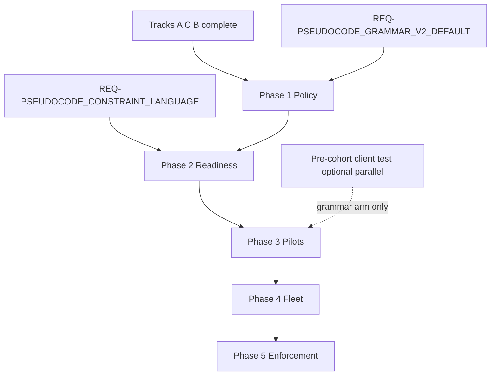

# Full constraint-language v2 — fleet migration grand plan

**Status:** Refine gate complete (2026-09-12) — grand plan only; phase-level build plans deferred  
**Governing foundation:** [`pseudocode-grammar-v2-and-hygiene-plan.md`](pseudocode-grammar-v2-and-hygiene-plan.md) (Tracks A/C/B **completed** at `48d1fbb+`)  
**Linked Cursor plan:** `constraint_v2_product_roadmap_83eab9db.plan.md` (5-phase sketch; this document is authoritative prose)  
**Technical foundation (shipped):** [REQ-PSEUDOCODE_CONSTRAINT_LANGUAGE](../tied/requirements/REQ-PSEUDOCODE_CONSTRAINT_LANGUAGE.yaml) (Complete; opt-in analyzer) · [REQ-PSEUDOCODE_GRAMMAR_V2_DEFAULT](../tied/requirements/REQ-PSEUDOCODE_GRAMMAR_V2_DEFAULT.yaml) (header-only new-project policy today)

---

## Executive summary

**Product direction:** Elevate TIED from **header-only** `Grammar-Version: v2` to **full constraint-language v2** as the long-term default: Layer B contract precision, Layer C with `typed_flow: true`, Tier-3 constructs where policy requires, and `constraint_flow: true` where the product contract dictates—without conflating proof layers.

**Fleet mandate (sponsor 2026-09-12):** Every TIED **client** repository must migrate through controlled, evidence-backed waves until it reaches the defined **fleet-migrated** state or a **time-bounded waiver**. This supersedes prior program **non-goals** that ruled out mass constraint migration and `constraint_flow` as a cohort gate **for the new fleet program only**; it does **not** retroactively change what Tracks A/C/B already shipped or what the pre-cohort client test grades today.

**This document:** Five phases (policy → analyzer readiness → pilot → fleet → enforcement), exit criteria, governance, proof boundaries, dependency map, CITDP-level change definition, and REQ token **candidates**. It does **not** contain wave file lists, CLI specs, per-client task breakdowns, or implementation checklists.

---

## Relationship to completed Tracks A / C / B

| Completed track | What it established | What it explicitly did **not** do |
|-----------------|---------------------|-----------------------------------|
| **A — Grammar v2 default** | New client projects emit `Grammar-Version: v2`; `grammar_v2_header` audit dimension; legacy headerless = v1-compatible | Mass sidecar migration; `constraint_flow: true` as default |
| **C — Validator hardening** | Layer B token scan range; fewer false positives on block-leads and mutates heuristics | Constraint-language activation |
| **B — Sidecar block-lead sweep** | stdd hygiene: internal block-lead placement; Layer B green on swept sidecars | Grammar v2 on every old sidecar; constraint annotations |

**Foundation handoff:** Track A gives **parser selection** and bootstrap policy. Track C/B give **structural hygiene** on stdd (and a pattern client repos may mirror). The fleet program **builds on** [REQ-PSEUDOCODE_CONSTRAINT_LANGUAGE](../tied/requirements/REQ-PSEUDOCODE_CONSTRAINT_LANGUAGE.yaml) and extends the **meaning** of [REQ-PSEUDOCODE_GRAMMAR_V2_DEFAULT](../tied/requirements/REQ-PSEUDOCODE_GRAMMAR_V2_DEFAULT.yaml) from “header for new projects” to “migration and enforcement roadmap” via LEAP (Phase 1), not by silent reinterpretation.

**Pre-cohort test (in flight):** [`pre-cohort-client-test-grammar-v2-and-evidence.md`](pre-cohort-client-test-grammar-v2-and-evidence.md) remains valid for its **narrow** arms (`grammar_v2_header`, request evidence). Proximus-style evidence (e.g. 20/20 headers, `constraint_flow: false`) is **consistent** with Track A; it is **not** fleet-migrated proof.

---

## Supersession of prior non-goals

| Prior non-goal (where stated) | Disposition under fleet program |
|-------------------------------|----------------------------------|
| Mass v2 constraint-language migration of existing sidecars | **Superseded** — fleet migration is now in scope, phased |
| `constraint_flow: true` as disposable/cohort **grade** gate | **Superseded for fleet** — becomes phased **client** gate per Phase 1 policy; pre-cohort test keeps `constraint_flow: false` on grammar arm |
| Header presence = v2 “done” | **Superseded** — header is necessary, not sufficient |
| Track A scoped to new projects only | **Preserved historically**; **extended** by new program for **existing** clients |

Historical non-goals in the hygiene plan and pre-cohort docs remain accurate **for those closed or in-flight scopes**; cross-link here when interpreting old runbooks.

---

## Resolved scope vocabulary

### Client migration states (ordered progression)

| State | Definition | Typical evidence (not exhaustive) |
|-------|------------|-----------------------------------|
| **legacy-v1** | Active sidecar without `Grammar-Version: v2` | Parser v1-compatible path; legacy audit dimension |
| **header-only-v2** | v2 header present; contracts may be minimal; `constraint_flow` not required | `grammar_v2_header: pass`; Layer B/C with `constraint_flow: false` |
| **constraint-ready-v2** | v2 + Layer B contract precision on changed/active procedures; Tier-3 annotations per **annotation profile**; `typed_flow: true`; `constraint_flow` **advisory** | PSA reports with constraint section; unknowns disclosed |
| **constraint-enforced-v2** | Same as ready, plus `constraint_flow: true` and **`constraint_gate_errors`** per Phase 1 policy on **constraint-annotated** procedures | Blocking proven violations; waivers for unknown/unsupported |
| **fleet-migrated-client** | All **active** project IMPL sidecars at **constraint-enforced-v2** (or documented waiver with owner, expiry, next action); client evidence envelope complete | Machine-readable migration receipt; not checklist text alone |

**fleet-migrated-client** is the Phase 4 exit target per repository. Methodology repo (stdd) sidecars follow the same states but may lead pilots because tooling lives here.

### Proof boundaries (mandatory separation)

| Claim | Establishes | Does **not** establish |
|-------|-------------|-------------------------|
| **grammar_v2_header** | Parser v2 selection on generated/copyable preamble | Contracts, Tier-3, `constraint_flow`, runtime |
| **Layer B (`pseudocode_validate`)** | Structural SHAPE / token / contract rows | Behavioral correctness, solver precision |
| **Layer C `gate_mode` (no constraint_flow)** | Bounded static analysis on CFG/call graph | Full constraint proof |
| **typed_flow** | Type-fact consistency on annotated procedures | Alias/mutation/refinement proof |
| **constraint_flow** | Refinement/summary/solver/alias policy results within budgets | Runtime, security, cross-repo integration |
| **Unit / composition tests** | Implemented behavior at tested loci | Unaffected sidecars, unannotated prose |
| **Request evidence envelope** | Checklist + inquiry + verification disposition for a **REQ** | Fleet-wide migration completeness |

**Unknown policy:** Unknown, truncation, and unsupported syntax are **first-class** outcomes; they must not be treated as pass. Phase 1 defines when unknown blocks **ship** vs **waiver**.

### Governance terms

| Term | Meaning |
|------|---------|
| **Migration wave** | Bounded set of sidecars or one client repo passing the same gate sequence before the next wave |
| **Migration waiver** | Documented exception: owner, reason, expiry, remediation REQ or sidecar list |
| **Annotation profile** | Per-procedure target: contract-only, refinement, interprocedural summary, alias/mutation, immutability (see [REQ-PSEUDOCODE_CONSTRAINT_LANGUAGE](../tied/requirements/REQ-PSEUDOCODE_CONSTRAINT_LANGUAGE.yaml)) |
| **Authoring burden gate (F11)** | Stop criteria on annotation load and semantic preservation before **blocking** constraint gates |
| **Client-owned migration REQ** | Each client may carry `REQ-*` for its migration; fleet program REQ lives in stdd/methodology as orchestrator |

Vocabulary **RECORD** (this refine pass): terms above are recorded in [`tied/vocab/pseudocode-and-citdp.md`](../tied/vocab/pseudocode-and-citdp.md) under **fleet constraint v2 migration**. **VALIDATE** at Phase 1 close-out / first commit touching fleet policy.

---

## Target end state (fleet)

Every **active** TIED client (and stdd as reference implementation):

1. Declares `Grammar-Version: v2` on every active IMPL sidecar.
2. Satisfies Layer B contract precision (PRE/POST/EFFECTS + conditional SHAPE rows) on active/changed procedures.
3. Uses Tier-3 constructs where the **annotation profile** requires them.
4. Runs qualification analysis with `typed_flow: true` and `constraint_flow: true` on in-scope sidecars, with explicit budgets.
5. Separates proven violations, unknowns, unsupported syntax, and legacy prose-only procedures in gate policy.
6. Retains three-way alignment (block-lead ↔ tests ↔ code) for production loci.
7. Stores auditable migration evidence under `working/{REQ}/` (client) or program `working/` (stdd orchestration)—**machine-readable**, not inferred from token presence.

---

## CITDP-style change definition (grand-plan level)

**Persisted CITDP (deferred):** Phase 1 should create `tied/citdp/CITDP-REQ-PSEUDOCODE_CONSTRAINT_V2_FLEET_MIGRATION.yaml` (or sponsor-chosen token) and `working/REQ-PSEUDOCODE_CONSTRAINT_V2_FLEET_MIGRATION/agent-req-implementation-checklist.yaml`. This refine pass does **not** persist YAML.

| Field | Content |
|-------|---------|
| **Current behavior** | New clients get v2 **header** only ([REQ-PSEUDOCODE_GRAMMAR_V2_DEFAULT](../tied/requirements/REQ-PSEUDOCODE_GRAMMAR_V2_DEFAULT.yaml)); constraint language is **Complete** but **opt-in**; existing clients may remain legacy-v1 or header-only-v2; cohort tests forbid conflating header with `constraint_flow`. |
| **Desired behavior** | Documented fleet program migrates **all** clients to **fleet-migrated-client**; new clients eventually bootstrap into **constraint-enforced-v2**; gates promote from advisory to blocking per policy; evidence proves state independently per client. |
| **Unchanged behavior** | v1 parser compatibility path for archival/migration; [REQ-PSEUDOCODE_CONSTRAINT_LANGUAGE](../tied/requirements/REQ-PSEUDOCODE_CONSTRAINT_LANGUAGE.yaml) analyzer semantics unless a later REQ amends them; Tracks A/C/B artifacts remain valid; LEAP order for any logic drift. |
| **Non-goals (this refine pass)** | Fleet edits; blocking `constraint_flow` in production CI; wave file lists; migration CLI design; per-client trackers; TIED YAML token creation; `tied_validate_consistency` on new tokens. |
| **Non-goals (program, until Phase 3+)** | Big-bang rewrite of all sidecars in one commit; treating PSA pass as runtime proof; silent mass edit without dry-run/inventory. |
| **Success criteria (program)** | Phase exit criteria met in order; pilot + ≥1 fleet wave documented; zero clients marked migrated on header alone; F11 and false-positive thresholds satisfied before fleet-blocking gates. |
| **Falsification questions** | Can a client show `grammar_v2_header: pass` while remaining legacy-v1 on most sidecars? (**Yes today** — must fail fleet-migrated claim.) Can `constraint_flow: true` pass with hidden truncation? (**Must fail** once enforcement on.) Does migration change runtime product behavior without LEAP? (**Must not** — pseudocode migration is fidelity/traceability, not feature work unless scoped.) |
| **Profile depth (Phase 1 planning)** | Recommend **`integrated`** for stdd orchestrator REQ; **`minimal`** for operator-only inventory scripts until scoped. |
| **Gate policy** | **`advisory`** until Phase 2 exit criteria; promotion path defined in Phase 1. |

### Module boundaries (program)

1. **Policy & vocabulary** — states, waivers, proof boundaries (Phase 1).
2. **Analyzer & template readiness** — constraint pipeline, templates, receipts (Phase 2).
3. **Migration workflow** — inventory, dry-run, revert, evidence (Phase 3 tooling + pilots).
4. **Client integration** — per-client REQ, tests, envelopes (Phases 3–4).
5. **Continuous governance** — CI/cohort defaults, waiver expiry (Phase 5).

---

## LEAP and REQ token candidates (do not create in this pass)

| Candidate token | Role |
|-----------------|------|
| **REQ-PSEUDOCODE_CONSTRAINT_V2_FLEET_MIGRATION** | Program-level fleet mandate, states, phase gates |
| **REQ-PSEUDOCODE_GRAMMAR_V2_DEFAULT** (amend) | Extend from new-project header to enforcement/migration expectations |
| **ARCH-PSEUDOCODE_FLEET_MIGRATION_GOVERNANCE** | Waves, waivers, evidence schema, client inventory manifest |
| **IMPL-PSEUDOCODE_FLEET_MIGRATION_ORCHESTRATION** | stdd-side tooling orchestration (if distinct from client REQs) |
| **REQ-PSEUDOCODE_MIGRATION_TOOLING** | Optional split if tooling scope large (inventory, scaffold, report) |

Client repos may introduce **client-owned** `REQ-{CLIENT}-PSEUDOCODE_MIGRATION` tokens; fleet REQ must not conflate operator steps with product requirements ([`pre-client-test-prior-work-plan.md`](pre-client-test-prior-work-plan.md) pattern).

---

## Phases

### Phase 1 — Product contract and migration governance

**Objective:** Authoritative TIED policy before fleet behavior changes.

| In scope | Out of scope (defer to Phase 1 `/refine-plan` or `/plan-new-feature` detail) |
|----------|-------------------------------------------------------------------------------|
| Target states, waiver schema, gate promotion timeline | Per-client wave assignments |
| Client inventory **schema** (not populated fleet-wide) | Migration CLI commands |
| LEAP draft for REQ/ARCH/IMPL candidates | Sidecar edits |
| Supersession doc + hygiene plan cross-links | Enabling blocking `constraint_flow` in CI |
| Pilot **selection criteria** (not final list) | Full adversarial inquiry activation |

**Primary artifacts (placeholders):** `CITDP-REQ-PSEUDOCODE_CONSTRAINT_V2_FLEET_MIGRATION.yaml`; `ARCH-PSEUDOCODE_FLEET_MIGRATION_GOVERNANCE`; vocab RECORD/VALIDATE; inventory manifest schema version.

**Exit criteria:** Approved product contract; gate policy written (advisory → blocking stages); migration states and waivers in vocab; inventory schema approved; explicit decision on when `constraint_gate_errors` blocks pre-RED vs verification; **no** ambiguous “v2 = done” language in new docs.

**Risks:** Policy drift vs shipped Track A cohort docs; conflating stdd hygiene with client fleet scope; operator-only steps recorded as REQs.

---

### Phase 2 — Analyzer, authoring, and evidence readiness

**Objective:** Full constraint-language v2 is **safe and measurable** before fleet rollout.

| In scope | Out of scope |
|----------|--------------|
| Qualification of existing constraint pipeline (parser, typed_flow, solver, alias, budgets) | Fleet sidecar rewrites |
| Template + checklist: demonstrate contracts + Tier-3 exemplars | Per-client customization |
| Deterministic validation receipts (Layer A/B/C, constraint_flow, unknowns) | Blocking fleet gates |
| F11 / false-positive thresholds; rollback to advisory mode | Wave dashboards |

**Primary artifacts (placeholders):** Amend [REQ-PSEUDOCODE_GRAMMAR_V2_DEFAULT](../tied/requirements/REQ-PSEUDOCODE_GRAMMAR_V2_DEFAULT.yaml) template deliverables; evidence schema version for constraint migration receipts; qualification manifest updates under `working/PSEUDOCODE-CONSTRAINT-STUDY/` (read-only panel pattern).

**Exit criteria:** Authoring template reflects full target; analyzer qualification green on fixture + pilot corpus; evidence schema stable; burden/FP thresholds met; documented rollback from blocking to advisory tested.

**Risks:** Solver truncation misread as pass; typed_flow promotion before annotations exist; v1 compatibility accidentally removed.

---

### Phase 3 — Pilot migration and migration-tool validation

**Objective:** Prove end-to-end migration on **representative** clients before fleet-wide rollout.

| In scope | Out of scope |
|----------|--------------|
| Pilots: diverse size/risk (include Proximus-class header-only and URL-fetch cohort client) | All remaining clients |
| Per-pilot client REQ/CITDP/tracker | Fleet wave partition file |
| Inventory → scaffold → validate → evidence; dry-run before write | Mandatory blocking gates fleet-wide |
| Rollback exercise from advisory constraint run | Phase 5 CI defaults |

**Primary artifacts (placeholders):** Client `working/{REQ}/` envelopes; pilot migration receipts; tooling REQ if split; composition tests for migration bindings.

**Exit criteria:** Pilots reach **constraint-enforced-v2** or explicit waiver; green or waived constraint reports per sidecar; tooling deterministic + reversible; rollback accepted; **no** runtime product behavior change from pseudocode-only migration.

**Risks:** Cross-IMPL calls and unsupported syntax hidden behind header pass; pilot not representative; tooling bypasses LEAP.

---

### Phase 4 — Fleet migration in controlled waves

**Objective:** Migrate **all** TIED clients with independent buildability and auditability.

| In scope | Out of scope |
|----------|--------------|
| Risk-based waves; per-client baseline pin + pre-migration envelope | Single big-bang |
| Per-wave gates: validate, PSA, tests, consistency, evidence manifest | Methodology YAML edits in clients |
| Waiver registry with expiry | Retiring v1 parser (Phase 5) |
| Stop criteria on analyzer regression / unknown growth | New Tier-3 language features |

**Primary artifacts (placeholders):** Fleet dashboard from machine-readable receipts; per-client `REQ-*-MIGRATION` CITDPs; wave stop/ go records.

**Exit criteria:** Every client **fleet-migrated-client** or current waiver; completed waves have zero blocking evidence gaps; metrics within thresholds; **no** client labeled migrated on header alone.

**Risks:** Wave coupling breaks client releases; stale waivers; evidence gaps masked by checklist completion.

---

### Phase 5 — Default enforcement and continuous governance

**Objective:** Full constraint-language v2 is the **normal** operating model; prevent regression.

| In scope | Out of scope |
|----------|--------------|
| New-client bootstrap → constraint-enforced-v2 expectations | Re-open Track B sweep scope |
| Default `constraint_flow: true` on qualifying paths; documented opt-out | Ad hoc sidecar edits outside LEAP |
| CI/cohort checks: headers, contracts, Tier-3, stale waivers, truncation | Re-design constraint solver |
| Periodic fleet audit → owning client REQ | |

**Primary artifacts (placeholders):** Bootstrap/checklist gate updates; cohort audit dimensions; waiver renewal process.

**Exit criteria:** New clients cannot silently enter header-only mode; active clients migrated or on valid waiver; continuous checks operational; v1/header-only exceptions retired or quarantined per policy.

**Risks:** CI noise from prose-only legacy; enforcement before annotations complete; methodology/client YAML confusion.

---

## Cross-phase controls

- **Traceability:** REQ → ARCH → IMPL → tests → client evidence; LEAP on drift.
- **TDD / module validation:** Analyzer, migration tooling, evidence collectors validated independently before composition.
- **Safety:** Inventories, dry-runs, bounded waves, hashes, branches/backups, rollback receipts—no destructive mass rewrite.
- **Compatibility:** v1 path time-bounded with tracked exceptions.
- **Evolution:** Detailed plans start each phase **after** prior exit criteria and risk review (`/refine-plan` or `/plan-new-feature`).

---

## Dependencies

| Dependency | Notes |
|------------|-------|
| stdd pin `48d1fbb+` | Hygiene + audit CLI baseline |
| Pre-cohort test | May complete on header arm while Phase 1 starts; does not block policy work |
| Client TIED baseline | Each wave pins `copy_files.sh` / methodology refresh policy |
| F11 qualification | Gates Phase 2 → 3 promotion |

---

## First execution package

**Phase 1 detailed plan:** [`pseudocode-constraint-v2-fleet-migration-phase-1-plan.md`](pseudocode-constraint-v2-fleet-migration-phase-1-plan.md) (Phase 1 exit complete 2026-09-12: P1-A–P1-G, TIED stack, schemas under `working/fleet-constraint-v2/`, integrated advisory close-out).

**Next command:** **`/refine-plan` or `/plan-new-feature` for Phase 2** (analyzer readiness), per Phase 1 plan § Exit review:

- Persist CITDP + Tracker under `working/REQ-PSEUDOCODE_CONSTRAINT_V2_FLEET_MIGRATION/` (token per OD-1: **REQ-PSEUDOCODE_CONSTRAINT_V2_FLEET_MIGRATION**)
- LEAP amendments to [REQ-PSEUDOCODE_GRAMMAR_V2_DEFAULT](../tied/requirements/REQ-PSEUDOCODE_GRAMMAR_V2_DEFAULT.yaml) rationale (not fleet edits)
- Client inventory schema + waiver schema
- Gate promotion decision record (`constraint_flow`, `constraint_gate_errors`, unknown handling)
- Pilot selection criteria (final list still Phase 3)

**Explicitly not in Phase 1 package:** fleet sidecar migration, blocking CI `constraint_flow`, migration CLI implementation.

---

## Open decisions for sponsor

| ID | Decision | Default if deferred |
|----|----------|---------------------|
| OD-1 | Canonical program REQ token name (`REQ-PSEUDOCODE_CONSTRAINT_V2_FLEET_MIGRATION` vs amend-only GRAMMAR_V2_DEFAULT) | Split orchestrator REQ + amend GRAMMAR_V2 |
| OD-2 | When `constraint_gate_errors` becomes blocking (pre-RED vs verification vs close-out) | Verification first; pre-RED advisory until Phase 3 pilots |
| OD-3 | Whether stdd migrates before any external client or in parallel with Phase 3 pilots | stdd as first pilot repo |
| OD-4 | Minimum annotation profile for **all** active procedures vs risk-tiered profiles | Risk-tiered with mandatory contract-only floor |
| OD-5 | Waiver max duration and renewal authority (sponsor vs client owner) | 90-day default; client owner renew with stdd audit |
| OD-6 | Pre-cohort test completion vs Phase 1 start sequencing | Parallel allowed; grammar arm stays header-only |
| OD-7 | Integrated adversarial inquiry depth for fleet orchestrator REQ | Integrated at Phase 1 persist; advisory until Phase 3 |
| OD-8 | Single stdd repo vs multi-repo inventory source of truth for “all TIED clients” | Qualification manifest + explicit registry extension |

---

## Refine pass disposition

- **Implement gate:** Not authorized (documentation-only grand plan).
- **Tracker:** None (Phase 1 creates per-request copy).
- **CITDP persistence:** Deferred to Phase 1 execution package.
- **Tests / lint / `tied_validate_consistency`:** N/A (no TIED token or code changes required for this pass).
