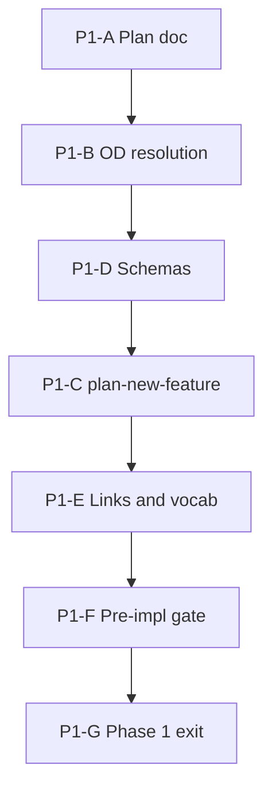

# Fleet constraint-language v2 — Phase 1 implementation plan

**Status:** Phase 1 exit complete (2026-09-12) — P1-A–P1-G; TIED stack + schemas; integrated advisory close_out gate green  
**Methodology pin:** `48d1fbb+` (hygiene Tracks A/C/B + §E cohort automation)  
**Parent program:** [`pseudocode-constraint-v2-fleet-migration-grand-plan.md`](pseudocode-constraint-v2-fleet-migration-grand-plan.md) (authoritative five-phase roadmap)  
**Foundation:** [`pseudocode-grammar-v2-and-hygiene-plan.md`](pseudocode-grammar-v2-and-hygiene-plan.md) · [REQ-PSEUDOCODE_CONSTRAINT_LANGUAGE](../tied/requirements/REQ-PSEUDOCODE_CONSTRAINT_LANGUAGE.yaml) · [REQ-PSEUDOCODE_GRAMMAR_V2_DEFAULT](../tied/requirements/REQ-PSEUDOCODE_GRAMMAR_V2_DEFAULT.yaml)  
**Cursor plans:** `phase_1_fleet_policy_plan_1fd94ee8.plan.md` · `constraint_v2_product_roadmap_83eab9db.plan.md`

---

## Executive summary

**Phase 1 objective:** Authoritative **product contract and migration governance** before any fleet sidecar migration, blocking `constraint_flow` CI, or migration CLI work.

| Deliverable ID | Description | Status |
|----------------|-------------|--------|
| **P1-01** | Product contract (states, proof boundaries, unknown policy) | **Done** (this doc) |
| **P1-02** | Supersession + hygiene / pre-cohort cross-links | **Done** (§ Refine) |
| **P1-03** | Gate promotion timeline | **Done** (§ Annex A + [`gate-promotion-stages.v1.yaml`](../working/fleet-constraint-v2/gate-promotion-stages.v1.yaml)) |
| **P1-04** | Client inventory manifest schema v1 | **Done** ([`client-inventory-manifest.v1.schema.json`](../working/fleet-constraint-v2/client-inventory-manifest.v1.schema.json)) |
| **P1-05** | Migration waiver schema v1 | **Done** ([`migration-waiver.v1.schema.json`](../working/fleet-constraint-v2/migration-waiver.v1.schema.json)) |
| **P1-06** | Pilot selection rubric (not final list) | **Done** (§ Pilot criteria) |
| **P1-07** | TIED stack (REQ/ARCH/CITDP/Tracker + GRAMMAR_V2 LEAP amend) | **Done** (P1-C 2026-09-12) |
| **P1-08** | Vocab VALIDATE + naming bridge for schemas | **Done** (close-out 2026-09-12) |

**Phase 1 exit criteria** (from grand plan): approved product contract; gate policy written; states and waivers in vocab (VALIDATE at close-out); inventory schema approved; explicit `constraint_gate_errors` blocking locus; no ambiguous “v2 = done” language in new docs.

**Program sequencing:**

Vocabulary: [`tied/vocab/pseudocode-and-citdp.md`](../tied/vocab/pseudocode-and-citdp.md) § **fleet constraint v2 migration**. Qualification context (read-only, Phase 2): [`working/PSEUDOCODE-CONSTRAINT-STUDY/`](../working/PSEUDOCODE-CONSTRAINT-STUDY/).

---

## Refine gate — resolved scope and vocabulary

**Sponsor intent resolved:** Phase 1 establishes fleet migration **policy**—states, waivers, gate promotion, inventory **schema** identity, and LEAP direction for orchestrator REQ plus amend to [REQ-PSEUDOCODE_GRAMMAR_V2_DEFAULT](../tied/requirements/REQ-PSEUDOCODE_GRAMMAR_V2_DEFAULT.yaml)—without executing migration on sidecars or enabling blocking constraint gates in production CI.

### In scope / out of scope

| In scope | Out of scope (Phase 1) |
|----------|-------------------------|
| Target states, waiver schema design, gate promotion timeline | Per-client wave assignments |
| Client inventory **schema** (not fleet-wide population) | Migration CLI |
| LEAP plan for REQ/ARCH/IMPL candidates | Sidecar edits |
| Supersession + hygiene / pre-cohort cross-links | Blocking `constraint_flow` in CI |
| Pilot **selection criteria** (rubric only) | Full adversarial **blocking** fleet gates |
| OD-1..OD-8 resolution (sponsor 2026-09-12) | Final pilot list (Phase 3) |

### Client migration states (summary)

Full definitions: [grand plan § Resolved scope vocabulary](pseudocode-constraint-v2-fleet-migration-grand-plan.md).

| State | One-line definition |
|-------|---------------------|
| **legacy-v1** | No `Grammar-Version: v2` on active sidecar |
| **header-only-v2** | v2 header; `constraint_flow` not required |
| **constraint-ready-v2** | Contract precision + `typed_flow`; `constraint_flow` **advisory** |
| **constraint-enforced-v2** | `constraint_flow: true`; **`constraint_gate_errors`** per policy on annotated procedures |
| **fleet-migrated-client** | All active sidecars at constraint-enforced-v2 or time-bounded waiver; machine-readable receipt |

**Rule:** `grammar_v2_header: pass` proves **header-only-v2 at best**, never **fleet-migrated-client**.

### Proof boundaries (summary)

| Claim | Establishes | Does **not** establish |
|-------|-------------|-------------------------|
| **grammar_v2_header** | Parser v2 selection on preamble | Contracts, Tier-3, `constraint_flow`, runtime |
| **Layer B** | Structural SHAPE / contract rows | Behavioral / solver proof |
| **Layer C without constraint_flow** | Bounded static analysis | Full constraint proof |
| **constraint_flow** | Policy-bounded refinement/solver/alias results | Runtime, fleet completeness |
| **Request evidence envelope** | One REQ close-out | Fleet-wide migration |

### Supersession (hygiene plan vs fleet program)

| Prior non-goal (hygiene / pre-cohort) | Fleet program disposition |
|---------------------------------------|---------------------------|
| Mass constraint migration | **Superseded** — phased fleet program |
| `constraint_flow` as cohort grade gate | **Superseded for fleet** — phased client gate; pre-cohort grammar arm stays `constraint_flow: false` |
| Header = v2 “done” | **Superseded** — header necessary, not sufficient |
| Track A new-project-only | **Preserved historically**; extended for **existing** clients in later phases |

Cross-links: [`pre-cohort-client-test-grammar-v2-and-evidence.md`](pre-cohort-client-test-grammar-v2-and-evidence.md) · [`pre-client-test-prior-work-plan.md`](pre-client-test-prior-work-plan.md) · [`urlfetch-client-1789177584-agentic-analysis.md`](urlfetch-client-1789177584-agentic-analysis.md) (header-only example, not fleet-migrated proof).

### Refine disposition

- Operator-only steps are **not** product REQs (PRE-COHORT pattern).
- Pre-cohort test may run **in parallel** with Phase 1; grammar arm unchanged (OD-6).
- Phase 1 does **not** mutate [`working/PSEUDOCODE-CONSTRAINT-STUDY/`](../working/PSEUDOCODE-CONSTRAINT-STUDY/) artifacts.

---

## Open decisions — resolution record

**Sponsor acceptance:** Defaults for OD-1..OD-8 **accepted** 2026-09-12 (author: sponsor). These decisions are **committed policy** for P1-C TIED persist and downstream phases.

| ID | Decision | Resolved value | Date | Owner |
|----|----------|----------------|------|-------|
| **OD-1** | Program REQ token | **Split:** create **REQ-PSEUDOCODE_CONSTRAINT_V2_FLEET_MIGRATION** + **LEAP amend** [REQ-PSEUDOCODE_GRAMMAR_V2_DEFAULT](../tied/requirements/REQ-PSEUDOCODE_GRAMMAR_V2_DEFAULT.yaml) (extend rationale to migration/enforcement roadmap; no silent reinterpretation of Implemented bootstrap) | 2026-09-12 | Sponsor |
| **OD-2** | `constraint_gate_errors` blocking locus | **Verification** first; **pre-RED advisory** until Phase 3 pilots | 2026-09-12 | Sponsor |
| **OD-3** | stdd vs external pilot order | **stdd first pilot repo** (Phase 3 execution; noted in Phase 1 policy) | 2026-09-12 | Sponsor |
| **OD-4** | Annotation profile floor | **Risk-tiered** profiles with mandatory **contract-only floor** on active/changed procedures | 2026-09-12 | Sponsor |
| **OD-5** | Waiver duration / renewal | **90-day** default max; **client owner** renews; **stdd audit** of renewals | 2026-09-12 | Sponsor |
| **OD-6** | Pre-cohort vs Phase 1 | **Parallel allowed**; grammar arm remains header-only, `constraint_flow: false` | 2026-09-12 | Sponsor |
| **OD-7** | Adversarial inquiry | **Integrated** inquiry at orchestrator REQ persist; **gate_policy advisory** until Phase 3 program blocking policy | 2026-09-12 | Sponsor |
| **OD-8** | Fleet registry source of truth | Extend **evaluation-corpus / qualification manifest** pattern; **no** fleet-wide population in Phase 1 | 2026-09-12 | Sponsor |

Grand plan OD table remains the historical default reference; this section is authoritative after acceptance.

---

## CITDP Plan gate — Phase 1 design (persist in P1-C)

**Target CITDP (not yet persisted):** `tied/citdp/CITDP-REQ-PSEUDOCODE_CONSTRAINT_V2_FLEET_MIGRATION.yaml`  
**Target Tracker:** `working/REQ-PSEUDOCODE_CONSTRAINT_V2_FLEET_MIGRATION/agent-req-implementation-checklist.yaml`  
**Template:** [`CITDP-REQ-PSEUDOCODE_GRAMMAR_V2_DEFAULT.yaml`](../tied/citdp/CITDP-REQ-PSEUDOCODE_GRAMMAR_V2_DEFAULT.yaml)

| Field | Phase 1 value |
|-------|----------------|
| `depth_tier` / `profile_depth` | **integrated** (orchestrator REQ) |
| `gate_policy` | **advisory** until Phase 2 exit (program-level blocking deferred) |
| Module boundary | **Policy & vocabulary** only in Phase 1; no migration CLI in CITDP scope |

### Change definition (draft for P1-C)

| Field | Content |
|-------|---------|
| **Current behavior** | New clients get v2 **header** only; constraint language Complete but opt-in; clients may remain legacy-v1 or header-only-v2; cohort tests forbid conflating header with `constraint_flow`. |
| **Desired behavior (Phase 1)** | Documented fleet program with committed OD decisions; frozen schema IDs; gate promotion record; orchestrator REQ/ARCH persisted; GRAMMAR_V2_DEFAULT amended for “header necessary, not sufficient.” |
| **Unchanged behavior** | v1 compatibility path; [REQ-PSEUDOCODE_CONSTRAINT_LANGUAGE](../tied/requirements/REQ-PSEUDOCODE_CONSTRAINT_LANGUAGE.yaml) analyzer semantics unless later REQ amends; Tracks A/C/B artifacts; bootstrap **Implemented** behavior until Phase 5. |
| **Non-goals (Phase 1)** | Fleet sidecar migration; blocking CI `constraint_flow`; migration CLI; populated fleet inventory; wave assignments; final pilot list. |
| **Success criteria (Phase 1 exit)** | Grand plan Phase 1 exit checklist satisfied; P1-F pre-implementation gate green where applicable. |

### Falsification questions (carry into CITDP)

- Can a client show `grammar_v2_header: pass` while most sidecars remain legacy-v1 and still claim **fleet-migrated-client**? (**Must fail.**)
- Can `constraint_flow: true` pass with hidden truncation treated as success? (**Must fail** once enforcement is on.)
- Does Phase 1 policy prose imply migration CLI or sidecar edits without a scoped REQ? (**Must not.**)

### REQ satisfaction criteria (draft — **REQ-PSEUDOCODE_CONSTRAINT_V2_FLEET_MIGRATION**)

1. Every migration state has a falsifiable evidence boundary (not checklist text alone).
2. ARCH references frozen waiver and inventory schema IDs (`migration-waiver.v1`, `client-inventory-manifest.v1`).
3. Gate promotion stages are documented and linked from REQ/ARCH.
4. No satisfaction criterion equates `grammar_v2_header` with `fleet-migrated-client`.
5. Phase 1–5 exit criteria traceable from REQ without requiring sidecar migration in Phase 1.

---

## LEAP / token map (P1-C)

| Token | Action |
|-------|--------|
| **REQ-PSEUDOCODE_CONSTRAINT_V2_FLEET_MIGRATION** | **Create** — fleet mandate, states, phase gates |
| **ARCH-PSEUDOCODE_FLEET_MIGRATION_GOVERNANCE** | **Create** — waves, waivers, schema refs, gate promotion |
| **IMPL-PSEUDOCODE_FLEET_MIGRATION_ORCHESTRATION** | **Defer unless** P1-C scope includes executable orchestration; policy-only Phase 1 must **not** create IMPL for prose alone |
| **REQ-PSEUDOCODE_GRAMMAR_V2_DEFAULT** | **Amend** — `related_to` fleet REQ; rationale + satisfaction criteria for migration roadmap; preserve Implemented bootstrap until Phase 5 |
| **REQ-PSEUDOCODE_MIGRATION_TOOLING** | **Optional split** in Phase 3+ if tooling scope grows |

Client repos: **client-owned** `REQ-{CLIENT}-PSEUDOCODE_MIGRATION` in Phases 3–4; not conflated with stdd orchestrator REQ.

---

## Work packages

### P1-A — Author Phase 1 plan document

**Status:** **Complete** (this file, 2026-09-12).

### P1-B — Open decisions

**Status:** **Complete** — OD-1..OD-8 accepted (§ Open decisions — resolution record).

### P1-D — Schemas and gate policy artifacts

**Status:** **Complete** (2026-09-12 `/build-plan` P1-D).

| Artifact | Path |
|----------|------|
| Inventory manifest schema | [`working/fleet-constraint-v2/client-inventory-manifest.v1.schema.json`](../working/fleet-constraint-v2/client-inventory-manifest.v1.schema.json) |
| Inventory template (empty) | [`working/fleet-constraint-v2/client-inventory-manifest.v1.template.yaml`](../working/fleet-constraint-v2/client-inventory-manifest.v1.template.yaml) |
| Waiver schema | [`working/fleet-constraint-v2/migration-waiver.v1.schema.json`](../working/fleet-constraint-v2/migration-waiver.v1.schema.json) |
| Waiver example (minimal) | [`working/fleet-constraint-v2/migration-waiver.v1.example.yaml`](../working/fleet-constraint-v2/migration-waiver.v1.example.yaml) |
| Gate stages (machine-readable) | [`working/fleet-constraint-v2/gate-promotion-stages.v1.yaml`](../working/fleet-constraint-v2/gate-promotion-stages.v1.yaml) |

**Inventory row (intended fields):** `schema_version`, `client_id`, `repository_root`, `methodology_pin`, `aggregate_migration_state`, `sidecar_counts_by_state`, `last_receipt_path`, `updated_at`.

**Do not** extend `evaluation-corpus.v1` schema for fleet inventory (OD-8: parallel registry pattern).

### P1-C — `/plan-new-feature` TIED persist

**Status:** **Complete** (2026-09-12).

Persisted: `REQ-PSEUDOCODE_CONSTRAINT_V2_FLEET_MIGRATION`, `ARCH-PSEUDOCODE_FLEET_MIGRATION_GOVERNANCE`, `IMPL-PSEUDOCODE_FLEET_MIGRATION_ORCHESTRATION`, `CITDP-REQ-PSEUDOCODE_CONSTRAINT_V2_FLEET_MIGRATION.yaml`, Tracker under `working/REQ-PSEUDOCODE_CONSTRAINT_V2_FLEET_MIGRATION/`; LEAP amend to `REQ-PSEUDOCODE_GRAMMAR_V2_DEFAULT` (related_to + satisfaction criteria).

Requires: `tied_config_get_base_path` → this repo’s `tied/`; MCP per [tied-yaml skill](../.cursor/skills/tied-yaml/SKILL.md). Integrated **`tied_adversarial_inquiry_run`** at persist (OD-7); four artifacts under `working/REQ-PSEUDOCODE_CONSTRAINT_V2_FLEET_MIGRATION/adversarial-inquiry/`. “Full adversarial inquiry **activation**” in grand plan means **blocking fleet enforcement**, not skipping inquiry at persist.

### P1-E — Cross-links and vocab VALIDATE

**Status:** **Partial** — doc links done; naming bridge for schema paths **RECORD** in [`tied/vocab/pseudocode-and-citdp.md`](../tied/vocab/pseudocode-and-citdp.md) (2026-09-12). Full VALIDATE at P1-G close-out.

### P1-F — Pre-implementation gate

**Status:** **Complete** (2026-09-12).

- Layer B `pseudocode_validate`: pass on `IMPL-PSEUDOCODE_FLEET_MIGRATION_ORCHESTRATION`
- Layer C `pseudocode_analyze`: pass (`gate_mode` true)
- Integrated inquiry: advisory `warn` — [`working/REQ-PSEUDOCODE_CONSTRAINT_V2_FLEET_MIGRATION/adversarial-inquiry/phase-pre_implementation/`](../working/REQ-PSEUDOCODE_CONSTRAINT_V2_FLEET_MIGRATION/adversarial-inquiry/phase-pre_implementation/)
- `tied_checklist_gate_validate` pre_implementation: **`allowed: true`**, receipt [`pre_implementation-2026-09-12T14-32-41-292Z.json`](../working/REQ-PSEUDOCODE_CONSTRAINT_V2_FLEET_MIGRATION/gates/pre_implementation-2026-09-12T14-32-41-292Z.json)
- `tied_validate_consistency`: ok

### P1-G — Phase 1 exit review

**Status:** **Pending** — checklist in § Exit review.

---

## Unknown, truncation, and waiver policy (Phase 1 contract)

Unknown, truncation, and unsupported syntax are **first-class outcomes**; they must **never** be treated as pass when enforcement is on.

| Outcome class | Advisory phase (Phases 1–2, pre-RED per OD-2) | Blocking enforcement (from verification onward per OD-2; fleet-blocking from Phase 3+ program policy) |
|---------------|-----------------------------------------------|--------------------------------------------------------------------------------------------------------|
| **Proven violation** (`constraint_gate_errors`) | Report; may block close-out only when stage enables blocking | **Block** on in-scope annotated procedures unless waiver |
| **Unknown / truncated analysis** | **Disclose**; does not alone block header-only or cohort grammar arm | **Block ship** of migration wave claim OR **require migration waiver** (OD-5) with owner, expiry, remediation REQ |
| **Unsupported syntax** | Same as unknown | Same as unknown |
| **Prose-only / unannotated procedure** | Allowed in legacy states; tracked in inventory counts | Must meet **annotation profile** floor (OD-4) or waiver before **constraint-enforced-v2** claim |

**Ship vs waiver (Phase 1 rule):** A client or wave may **ship** migration **state claims** only with machine-readable receipts matching the state definition. Any gap filled by unknown/truncation/unsupported on **constraint-annotated** loci requires an active **migration waiver** or corrected analysis—never silent pass.

---

## Annex A — Gate promotion record

Program **`gate_policy`** remains **advisory** through Phase 2 exit (grand plan). Stages below define **promotion intent**; CI wiring is Phase 5 unless noted.

| Stage | Scope | Layer C / analysis | `constraint_gate_errors` | Notes |
|-------|-------|--------------------|---------------------------|-------|
| **G0 — Today** | Cohort + new projects | `gate_mode`; `constraint_flow: false` on grammar arm | N/A | Track A Implemented |
| **G1 — Phase 1–2** | Policy + qualification | Advisory `typed_flow` / `constraint_flow` on fixtures | Advisory everywhere | F11 / FP thresholds in Phase 2 |
| **G2 — Phase 3 pilots** | Pilot clients + stdd first | Advisory default; pilot may trial blocking on subset | **Verification blocking** per OD-2; pre-RED advisory | Rollback exercises required |
| **G3 — Phase 4 fleet waves** | All clients | Per-wave receipts | Blocking on annotated procedures per policy | Waivers for unknown/unsupported |
| **G4 — Phase 5** | New-client default | `constraint_flow: true` on qualifying paths | Blocking + stale waiver CI | Bootstrap expectations |

**OD-2 committed:** **`constraint_gate_errors` blocks at verification first**; pre-RED remains advisory until Phase 3 pilots.

---

## Pilot selection criteria (P1-06 — rubric only)

Final pilot list is **Phase 3**. Examples (Proximus-class header-only, URL-fetch cohort) illustrate patterns only—not assignments.

| Dimension | Question for Phase 3 scoring |
|-----------|------------------------------|
| **State diversity** | legacy-v1, header-only-v2, or mixed active sidecars? |
| **Size / risk** | Sidecar count, cross-IMPL density, production criticality |
| **Evidence maturity** | Prior envelope + integrated inquiry history |
| **Tooling exercise** | inventory → validate → receipt without fleet-blocking gates |
| **Representativeness** | At least one “header pass only” and one greenfield v2 pattern |
| **Rollback safety** | Revert advisory constraint runs without product behavior change |

---

## Risk register

| Risk | Mitigation |
|------|------------|
| Policy drift vs Track A / pre-cohort | Supersession table; separate audit dimensions |
| stdd hygiene conflated with client fleet | Orchestrator REQ vs client `REQ-*-MIGRATION` |
| Operator steps as REQs | Process CITDP pattern; fleet REQ = mandate/governance |
| Header pass = migrated | Falsification questions; state machine in REQ |
| Schema version drift | Freeze v1 IDs; bump version on semantic change |
| Inquiry “activation” misunderstood | OD-7: integrated inquiry at persist; blocking enforcement deferred |

---

## Implement gate — build disposition

**Authorized (P1-A, 2026-09-12):**

- This document (`docs/pseudocode-constraint-v2-fleet-migration-phase-1-plan.md`)
- OD-1..OD-8 resolution record
- Grand plan cross-link update (First execution package)

**Authorized (P1-D, 2026-09-12):**

- Schema and policy artifacts under [`working/fleet-constraint-v2/`](../working/fleet-constraint-v2/)
- Vocab naming bridge rows for fleet schema paths

**Not authorized (explicit next commands):**

| Next | Scope |
|------|--------|
| **`/plan-new-feature`** | P1-C TIED persist + P1-F gates |
| Phase 2+ | Analyzer qualification, pilots, fleet waves |

No TIED MCP writes, no sidecar edits, no migration CLI, no fleet inventory population in P1-A/P1-D.

---

## Exit review checklist (P1-G)

- [x] Product contract in REQ + ARCH (after P1-C)
- [x] Gate promotion timeline written (Annex A)
- [x] States + waivers in vocab VALIDATE (P1-E)
- [x] Inventory + waiver schema approved (P1-D)
- [x] `constraint_gate_errors` blocking locus documented (OD-2)
- [x] No “v2 = done” ambiguity in **this** doc

**After Phase 1 exit:** `/refine-plan` or `/plan-new-feature` for **Phase 2** (analyzer, authoring, evidence readiness).
