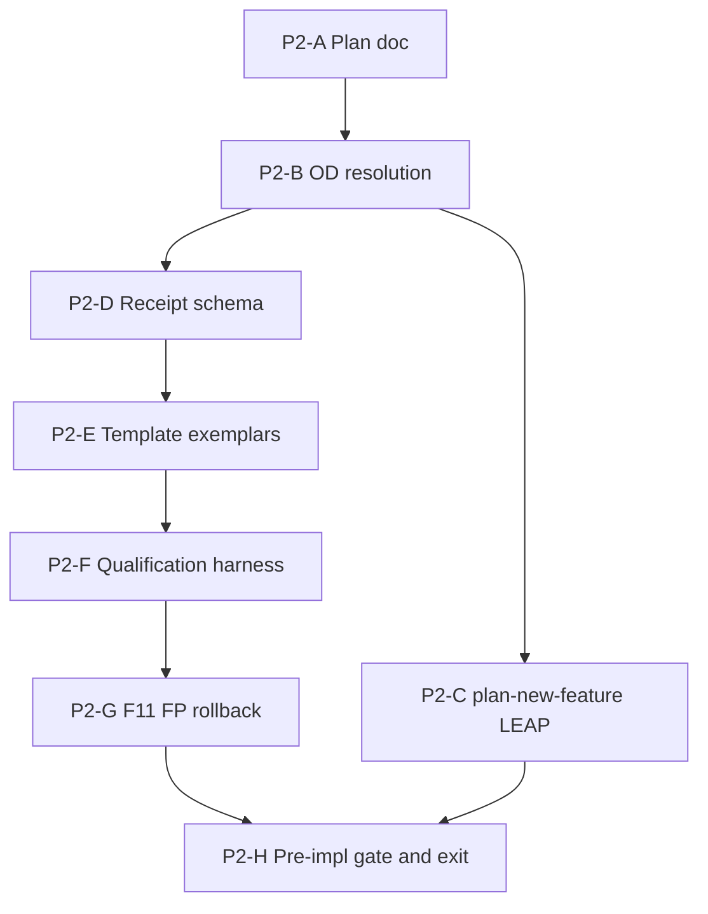

# Fleet constraint-language v2 — Phase 2 implementation plan

**Status:** **Phase 2 complete** (2026-09-12) — technical exit (P2-H) and TIED persist (P2-C)  
**Methodology pin:** `48d1fbb+` (hygiene Tracks A/C/B + §E cohort automation)  
**Parent program:** [`pseudocode-constraint-v2-fleet-migration-grand-plan.md`](pseudocode-constraint-v2-fleet-migration-grand-plan.md) (authoritative five-phase roadmap)  
**Prior phase:** [`pseudocode-constraint-v2-fleet-migration-phase-1-plan.md`](pseudocode-constraint-v2-fleet-migration-phase-1-plan.md) (Phase 1 exit complete 2026-09-12)  
**Foundation:** [`pseudocode-grammar-v2-and-hygiene-plan.md`](pseudocode-grammar-v2-and-hygiene-plan.md) · [REQ-PSEUDOCODE_CONSTRAINT_LANGUAGE](../tied/requirements/REQ-PSEUDOCODE_CONSTRAINT_LANGUAGE.yaml) · [REQ-PSEUDOCODE_GRAMMAR_V2_DEFAULT](../tied/requirements/REQ-PSEUDOCODE_GRAMMAR_V2_DEFAULT.yaml) · [REQ-PSEUDOCODE_CONSTRAINT_V2_FLEET_MIGRATION](../tied/requirements/REQ-PSEUDOCODE_CONSTRAINT_V2_FLEET_MIGRATION.yaml)  
**Cursor plans:** `constraint_v2_product_roadmap_83eab9db.plan.md`

---

## Executive summary

**Phase 2 objective:** Full constraint-language v2 is **safe and measurable** before any fleet sidecar migration, blocking fleet `constraint_flow` CI, or per-client customization. Phase 2 delivers analyzer qualification on fixtures + pilot corpus, authoring template/checklist alignment with **constraint-ready-v2** targets, stable **constraint migration receipt** schema, F11 / false-positive thresholds, and a tested rollback path from simulated blocking back to **G1 advisory**.

| Deliverable ID | Description | Status |
|----------------|-------------|--------|
| **P2-01** | Phase 2 plan (scope, work packages, exit checklist) | **Done** (this doc) |
| **P2-02** | Constraint migration receipt schema v1 (design + JSON Schema) | **Done** (P2-D, 2026-09-12) |
| **P2-03** | Authoring template + checklist: contracts + Tier-3 exemplars | **Done** (P2-E 2026-09-12) |
| **P2-04** | Qualification re-baseline at `48d1fbb+` (fixture + manifest corpus) | **Done** (P2-F, 2026-09-12) |
| **P2-05** | F11 / false-positive threshold policy (fleet Phase 2→3 gate) | **Done** (P2-G, 2026-09-12) |
| **P2-06** | Rollback exercise: G2-simulated blocking → G1 advisory | **Done** (P2-G, 2026-09-12) |
| **P2-07** | CITDP / REQ / ARCH module-boundary amend (Analyzer & template readiness) | **Done** (P2-C, 2026-09-12) |
| **P2-08** | Vocab RECORD for receipt + qualification terms; VALIDATE at exit | **Done** (P2-H VALIDATE 2026-09-12) |

**Phase 2 exit criteria** (from grand plan): authoring template reflects full **constraint-ready-v2** target (not header-only); analyzer qualification **green** on fixture + pilot corpus; evidence schema stable; burden/FP thresholds met; documented rollback from blocking to advisory **tested**. Program **`gate_policy`** remains **advisory** through Phase 2 exit (**G1**); F11 gates promotion to Phase 3.

**Program sequencing:**

Qualification panel (extend only per authorized work packages): [`working/PSEUDOCODE-CONSTRAINT-STUDY/`](../working/PSEUDOCODE-CONSTRAINT-STUDY/). Study deliverables **01–07** remain historical design input; Phase 2 **extends** harness scripts/metrics under `qualification/` only when this plan’s work package explicitly authorizes it.

---

## Refine gate — resolved scope and vocabulary

**Sponsor intent resolved:** Phase 2 prepares the **analyzer, authoring, and evidence** module boundary of the fleet program. It qualifies the existing constraint pipeline (parser v2, Layer B, Layer C `typed_flow`, `constraint_flow`, solver/alias/budgets) and makes migration outcomes **deterministic and receipt-backed**—without rewriting client sidecars, populating fleet inventory, or enabling fleet-blocking gates.

### In scope / out of scope

| In scope | Out of scope (Phase 2) |
|----------|-------------------------|
| Qualification of constraint pipeline on fixtures + [`qualification/manifest.yaml`](../working/PSEUDOCODE-CONSTRAINT-STUDY/qualification/manifest.yaml) corpus | Fleet sidecar rewrites in client repos |
| Template + checklist updates demonstrating PRE/POST/EFFECTS + Tier-3 exemplars | Per-client customization or wave assignments |
| Constraint migration receipt schema v1 (Layer A/B/C, `constraint_flow`, unknowns) | Blocking fleet gates in production CI |
| F11 / FP thresholds; rollback exercise to advisory **G1** | Wave dashboards; populated `client-inventory-manifest` |
| LEAP amend: GRAMMAR_V2_DEFAULT template deliverables; fleet REQ/ARCH Phase 2 satisfaction criteria | Phase 3 migration CLI (defer unless OD-P2-7 splits tooling REQ) |
| Authorized extensions to PSEUDOCODE-CONSTRAINT-STUDY scripts/metrics | Mutating external corpus `/Users/fareed/Documents/dev/test` |

### State vs proof (no conflation)

| Claim | Establishes in Phase 2 | Does **not** establish |
|-------|------------------------|-------------------------|
| **grammar_v2_header** | Parser v2 selection on preamble | Qualification complete; constraint-ready-v2 |
| **Template + exemplars updated** | Authoring **target** for new/changed sidecars | Fleet or stdd sidecars migrated |
| **Qualification green** | Analyzer safe/measurable on corpus at pinned commit | **fleet-migrated-client** |
| **constraint migration receipt** | Deterministic validation snapshot for one sidecar/fixture run | Client-wide migration completeness |
| **F11 / FP thresholds met** | Promotion readiness Phase 2→3 | Blocking enforcement (still G1 advisory) |

**Rule:** Phase 2 exit proves **readiness to pilot**, not **fleet migration complete**. Header-only-v2 and qualification-panel green are independent dimensions.

### Proof boundaries (summary — unchanged from Phase 1)

| Claim | Establishes | Does **not** establish |
|-------|-------------|-------------------------|
| **grammar_v2_header** | Parser v2 selection | Contracts, Tier-3, `constraint_flow`, runtime |
| **Layer B** | Structural SHAPE / contract rows | Behavioral / solver proof |
| **Layer C without constraint_flow** | Bounded static analysis | Full constraint proof |
| **typed_flow** | Type-fact consistency on annotated procedures | Alias/refinement proof unless `constraint_flow` |
| **constraint_flow** | Policy-bounded refinement/solver/alias within budgets | Runtime; fleet completeness |
| **Request evidence envelope** | One REQ close-out | Fleet-wide migration |

### Unknown, truncation, and waiver policy (Phase 2)

Same contract as [Phase 1 plan § Unknown policy](pseudocode-constraint-v2-fleet-migration-phase-1-plan.md): unknown/truncation/unsupported are **first-class**; receipts MUST surface them explicitly. Under **G1**, they **disclose** but do not alone block qualification **green**; they MUST NOT be serialized as `"ok": true` with empty unknowns when analysis truncated. Phase 2 receipt schema requires an `unknown_summary` block (see § Evidence schema).

### Supersession and study handoff

| Prior artifact | Phase 2 disposition |
|----------------|---------------------|
| PSEUDOCODE-CONSTRAINT-STUDY deliverables **01–07** | **Preserved** as design/rubric input; F11 median from annotation study feeds P2-G thresholds |
| Study go/no-go (bounded typed-flow first) | **Superseded for fleet end-state** by grand plan full constraint-language v2; Phase 2 qualifies **shipped** [REQ-PSEUDOCODE_CONSTRAINT_LANGUAGE](../tied/requirements/REQ-PSEUDOCODE_CONSTRAINT_LANGUAGE.yaml) path |
| Qualification harness anchor `7f3d5b0` in manifest | **Re-pin** to `48d1fbb+` in P2-F (OD-P2-1 default) |

Cross-links: [`pre-cohort-client-test-grammar-v2-and-evidence.md`](pre-cohort-client-test-grammar-v2-and-evidence.md) · [`urlfetch-client-1789177584-agentic-analysis.md`](urlfetch-client-1789177584-agentic-analysis.md) (header-only example).

### Refine disposition

- Documentation-first refine pass: **P2-01 only** committed from `/refine-plan`.
- TIED MCP writes deferred to **P2-C** (`/plan-new-feature`) unless sponsor narrows to doc-only LEAP pointers.
- Phase 2 **may extend** `working/PSEUDOCODE-CONSTRAINT-STUDY/qualification/` only in **P2-F**, **P2-G** (and receipt collector stubs in **P2-D** under `working/fleet-constraint-v2/`).

---

## Open decisions — resolution record

**Sponsor acceptance:** OD-P2-1..OD-P2-7 **accepted** 2026-09-12 (author: sponsor). These decisions are **committed policy** for P2-D onward.

| ID | Decision | Resolved value | Date | Owner |
|----|----------|----------------|------|-------|
| **OD-P2-1** | Qualification methodology pin | Re-baseline harness at **`48d1fbb+`**; update `manifest.yaml` `baseline_anchor_commit` | 2026-09-12 | Sponsor |
| **OD-P2-2** | Receipt schema ID | **`constraint-migration-receipt.v1`** under `working/fleet-constraint-v2/` | 2026-09-12 | Sponsor |
| **OD-P2-3** | F11 stop criteria (fleet) | Median annotation lines **≤ 8**, decisions **≤ 15**, all preservation reviews pass; corpus median unknown_delta **≤ 0** on annotation-study procedures | 2026-09-12 | Sponsor |
| **OD-P2-4** | False-positive threshold | Tier A manifest: **zero new** `gate_mode` failures vs typed_flow-off baseline; constraint_flow pilot: FP rate on labeled fixtures **≤ 5%** (see [`04-corpus-and-measurement-spec.md`](../working/PSEUDOCODE-CONSTRAINT-STUDY/deliverables/04-corpus-and-measurement-spec.md)) | 2026-09-12 | Sponsor |
| **OD-P2-5** | Tier-3 exemplar pack | **≥ 3** reference sidecars under `working/fleet-constraint-v2/exemplars/` (contract-only, refinement, alias/mutation profiles) — **copies**, not production `tied/implementation-decisions/` edits | 2026-09-12 | Sponsor |
| **OD-P2-6** | Rollback exercise scope | Run `run-constraint-phase-gate.ts` (simulated G2 flags) on **≤ 5** manifest entries; document revert to G1 advisory flags + receipt diff | 2026-09-12 | Sponsor |
| **OD-P2-7** | Tooling REQ split | **Defer** `REQ-PSEUDOCODE_MIGRATION_TOOLING` unless receipt collector + harness glue exceeds orchestrator IMPL scope in P2-C review | 2026-09-12 | Sponsor |

Committed Phase 1 decisions **OD-1..OD-8** remain authoritative; Phase 2 does not reopen gate promotion semantics except via P2-G rollback **test** of G1↔G2 **intent** (not production CI).

---

## CITDP Plan gate — Phase 2 design (persist in P2-C)

**Existing CITDP:** [`tied/citdp/CITDP-REQ-PSEUDOCODE_CONSTRAINT_V2_FLEET_MIGRATION.yaml`](../tied/citdp/CITDP-REQ-PSEUDOCODE_CONSTRAINT_V2_FLEET_MIGRATION.yaml)  
**Existing Tracker:** [`working/REQ-PSEUDOCODE_CONSTRAINT_V2_FLEET_MIGRATION/agent-req-implementation-checklist.yaml`](../working/REQ-PSEUDOCODE_CONSTRAINT_V2_FLEET_MIGRATION/agent-req-implementation-checklist.yaml) — **extend** with Phase 2 module steps in P2-C (do not replace Phase 1 history).

| Field | Phase 2 value |
|-------|----------------|
| `depth_tier` / `profile_depth` | **integrated** (unchanged orchestrator REQ) |
| `gate_policy` | **advisory** through Phase 2 exit (**G1**); unchanged from Phase 1 |
| Module boundary | **Analyzer & template readiness** (grand plan module 2); no fleet sidecar migration |

### Change definition (draft for P2-C)

| Field | Content |
|-------|---------|
| **Current behavior** | Phase 1 policy + schemas exist; constraint language **Complete** but opt-in; qualification harness anchored pre-hygiene; template shows v2 header + contract stubs; fleet states documented but no stable migration receipt; F11 measured only in typed-flow study panel. |
| **Desired behavior (Phase 2)** | Template/checklist show **constraint-ready-v2** authoring target; qualification **green** at `48d1fbb+` with `typed_flow` + `constraint_flow` advisory runs; **constraint-migration-receipt.v1** stable; F11/FP thresholds documented and met; rollback exercise recorded; REQ/ARCH satisfaction criteria extended for Phase 2 exit. |
| **Unchanged behavior** | v1 compatibility; no fleet inventory population; no blocking fleet CI; pre-cohort grammar arm `constraint_flow: false`; OD-2 verification-first blocking still Phase 3+. |
| **Non-goals (Phase 2)** | Client sidecar migration; migration CLI; G3/G4 CI wiring; final pilot list. |
| **Success criteria (Phase 2 exit)** | Grand plan Phase 2 exit checklist + § Exit review below. |

### Falsification questions (carry into CITDP amend)

- Can Phase 2 be marked complete when only **grammar_v2_header** passes on the corpus? (**Must fail.**)
- Can qualification be **green** if truncation is omitted from receipts or counted as pass? (**Must fail.**)
- Does template update imply **constraint-enforced-v2** default for new projects before Phase 5? (**Must not** — template targets **ready** state; enforcement is phased.)
- Can F11 thresholds be “met” without re-measurement at fleet pin? (**Must fail** — P2-F/P2-G require pin-aligned runs.)

### REQ satisfaction criteria (draft — Phase 2 module boundary)

Add to [REQ-PSEUDOCODE_CONSTRAINT_V2_FLEET_MIGRATION](../tied/requirements/REQ-PSEUDOCODE_CONSTRAINT_V2_FLEET_MIGRATION.yaml) (P2-C):

1. **SC-FLEET-P2-001:** ARCH or linked plan references **constraint-migration-receipt.v1** and receipt fields for Layer A/B/C, `typed_flow`, `constraint_flow`, and `unknown_summary`.
2. **SC-FLEET-P2-002:** Authoring template ([`templates/impl-essence-pseudocode-template.md`](../templates/impl-essence-pseudocode-template.md)) demonstrates contract precision + at least one Tier-3 exemplar pattern per OD-P2-5.
3. **SC-FLEET-P2-003:** Qualification manifest re-baseline at agreed pin shows **green** tier A/B gates per P2-F definition (zero new gate failures vs baseline; stdd tier B zero regression).
4. **SC-FLEET-P2-004:** F11 and FP thresholds documented, measured, and satisfied per P2-G; recorded in `gate-promotion-stages.v1.yaml` G1 `prerequisites` evidence pointer.
5. **SC-FLEET-P2-005:** Rollback exercise demonstrates advisory restoration without analyzer code rollback (config/receipt-only revert).

**Defer in P2-C (Phase 3+):** IMPL orchestration for migration CLI; client-owned REQs; populated inventory.

---

## LEAP / token map (P2-C)

| Token | Action |
|-------|--------|
| **REQ-PSEUDOCODE_CONSTRAINT_V2_FLEET_MIGRATION** | **Amend** — Phase 2 satisfaction criteria SC-FLEET-P2-001..005; link Phase 2 plan |
| **ARCH-PSEUDOCODE_FLEET_MIGRATION_GOVERNANCE** | **Amend** — receipt schema ref, qualification green definition, G1 prerequisite evidence |
| **IMPL-PSEUDOCODE_FLEET_MIGRATION_ORCHESTRATION** | **Amend only if** executable receipt collector or harness binding enters scope; else policy pointers in ARCH |
| **REQ-PSEUDOCODE_GRAMMAR_V2_DEFAULT** | **Amend** — template deliverable scope: constraint-ready-v2 authoring target (distinct from header-only bootstrap Implemented until Phase 5) |
| **REQ-PSEUDOCODE_MIGRATION_TOOLING** | **Optional split** (OD-P2-7) if receipt CLI exceeds orchestrator IMPL |
| **REQ-PSEUDOCODE_CONSTRAINT_LANGUAGE** | **Read-only** unless qualification exposes REQ-amending defect (LEAP per finding) |

No new **client fleet** REQs in Phase 2.

---

## Work packages

### P2-A — Author Phase 2 plan document

**Status:** **Complete** (this file, 2026-09-12 `/refine-plan`).

### P2-B — Open decisions

**Status:** **Complete** (2026-09-12) — OD-P2-1..OD-P2-7 accepted (§ Open decisions — resolution record).

### P2-D — Constraint migration receipt schema

**Status:** **Complete** (2026-09-12 `/build-plan`).

| Artifact | Path (intended) |
|----------|-----------------|
| JSON Schema | [`working/fleet-constraint-v2/constraint-migration-receipt.v1.schema.json`](../working/fleet-constraint-v2/constraint-migration-receipt.v1.schema.json) |
| Example receipt (fixture) | [`working/fleet-constraint-v2/constraint-migration-receipt.v1.example.json`](../working/fleet-constraint-v2/constraint-migration-receipt.v1.example.json) |
| Collector design note | [`working/fleet-constraint-v2/constraint-migration-receipt.v1.md`](../working/fleet-constraint-v2/constraint-migration-receipt.v1.md) |

**Design requirements:** Align with [ARCH-PSEUDOCODE_FLEET_MIGRATION_GOVERNANCE](../tied/architecture-decisions/ARCH-PSEUDOCODE_FLEET_MIGRATION_GOVERNANCE.yaml) evidence patterns and request-envelope provenance fields where applicable; include `gate_stage: G1`, `program_gate_policy: advisory`, `methodology_pin`, `analyzer_build_identity`, per-layer outcomes, `constraint_flow`/`typed_flow` flags, `constraint_gate_errors` summary, explicit `unknown_summary` (truncation, unsupported, budget-exceeded).

### P2-E — Template, checklist, Tier-3 exemplars

**Status:** **Complete** (2026-09-12 `/build-plan` P2-E).

| Target | Scope |
|--------|--------|
| [`templates/impl-essence-pseudocode-template.md`](../templates/impl-essence-pseudocode-template.md) | Full **constraint-ready-v2** contract rows + optional Tier-3 annotation examples (grammar v2 header retained) |
| [`tied/docs/agent-req-implementation-checklist.yaml`](../tied/docs/agent-req-implementation-checklist.yaml) or pseudocode validation checklist | Rows linking Layer B contract precision + advisory Layer C constraint section |
| `working/fleet-constraint-v2/exemplars/` | OD-P2-5 exemplars + [`receipts/`](../../working/fleet-constraint-v2/exemplars/receipts/) (schema-valid, live analyze at G1 advisory) |

**Dependency:** [REQ-PSEUDOCODE_GRAMMAR_V2_DEFAULT](../tied/requirements/REQ-PSEUDOCODE_GRAMMAR_V2_DEFAULT.yaml) LEAP amend in P2-C must not silently change Implemented bootstrap behavior—document “authoring target vs runtime default” in amend rationale.

### P2-F — Qualification harness extension

**Status:** **Complete** (`/build-plan` P2-F, 2026-09-12).

**Depends on:** P2-B (pin), P2-D (receipt output shape for harness emitters).

| Step | Script / artifact | Notes |
|------|-------------------|-------|
| Re-scan / pin | [`qualification/scripts/scan-corpus.ts`](../working/PSEUDOCODE-CONSTRAINT-STUDY/qualification/scripts/scan-corpus.ts), `manifest.yaml` | Update `baseline_anchor_commit` to OD-P2-1 pin |
| Baseline | `run-baseline.ts`, `run-harness.sh baseline` | `typed_flow: false`, `gate_mode: true` |
| Typed pilot | `run-pilot.ts`, `run-phase3.ts` | Existing typed_gate_errors path |
| Constraint pilot | [`run-constraint-pilot.ts`](../working/PSEUDOCODE-CONSTRAINT-STUDY/qualification/scripts/run-constraint-pilot.ts), [`run-constraint-baseline.ts`](../working/PSEUDOCODE-CONSTRAINT-STUDY/qualification/scripts/run-constraint-baseline.ts) | `constraint_flow: true` advisory |
| Compare | [`compare-reports.ts`](../working/PSEUDOCODE-CONSTRAINT-STUDY/qualification/scripts/compare-reports.ts), [`compare-constraint-reports.ts`](../working/PSEUDOCODE-CONSTRAINT-STUDY/qualification/scripts/compare-constraint-reports.ts) | FP/regression vs baseline |
| Emit receipts | New or extended runner hook | Write **constraint-migration-receipt.v1** per manifest entry |

**Qualification green (Phase 2 definition):**

- **Tier A:** 100% parse ok; **zero new** gate failures vs baseline at `gate_mode` (OD-P2-4).
- **Tier B (stdd):** Zero regression vs baseline summary for project sidecars in manifest.
- **Tier C/D:** Report-only; failures tracked but non-blocking for Phase 2 exit.
- **Receipts:** Sampled entries validate against JSON Schema; unknown/truncation never omitted when present in analyzer report.

**Read-only:** External corpus paths; no client `tied/` writes.

### P2-G — F11, false-positive thresholds, rollback exercise

**Status:** **Complete** (2026-09-12) — artifacts under `working/fleet-constraint-v2/` and `qualification/metrics/`.

**F11 measurement method:**

- Re-run or extend [`run-annotation-study.ts`](../working/PSEUDOCODE-CONSTRAINT-STUDY/qualification/scripts/run-annotation-study.ts) on copied Tier A procedures at fleet pin.
- Compare to study baseline [`annotation-overhead.yaml`](../working/PSEUDOCODE-CONSTRAINT-STUDY/qualification/metrics/annotation-overhead.yaml) (median **2.5** lines; stop criteria in `f11.stop_criteria`).
- Apply OD-P2-3 fleet thresholds; document in `working/fleet-constraint-v2/f11-fp-thresholds.v1.yaml`.

**False-positive measurement method:**

- **Fixtures:** Labeled cases from [`04-corpus-and-measurement-spec.md`](../working/PSEUDOCODE-CONSTRAINT-STUDY/deliverables/04-corpus-and-measurement-spec.md) + `mcp-server/src/analysis/fixtures/` — precision denominator per spec.
- **Corpus:** New gate failures from P2-F compare scripts; classify proven violation vs FP vs unknown per [`03-dataflow-claim-taxonomy.md`](../working/PSEUDOCODE-CONSTRAINT-STUDY/deliverables/03-dataflow-claim-taxonomy.md).
- Rubric context: [`06-evidence-rubric-and-cost-bands.md`](../working/PSEUDOCODE-CONSTRAINT-STUDY/deliverables/06-evidence-rubric-and-cost-bands.md) § FP/FN tradeoffs.

**Rollback exercise (G1 restoration before Phase 3):**

1. Select ≤ 5 manifest entries with constraint annotations (see `run-constraint-phase-gate.ts` classification).
2. Run phase-gate mode (`constraint_gate_errors: true`) — **simulated G2** locally only.
3. Record blocking disposition in receipt; then re-run with G1 flags (`constraint_gate_errors: advisory`, program advisory) without code revert.
4. Assert receipt diff shows advisory restoration and no silent loss of unknown disclosures.
5. Store exercise record: `working/fleet-constraint-v2/rollback-exercise-G1.v1.json`.

**Prerequisite link:** [`gate-promotion-stages.v1.yaml`](../working/fleet-constraint-v2/gate-promotion-stages.v1.yaml) G2 requires rollback accepted; Phase 2 satisfies **exercise** portion only (not pilot rollback).

### P2-C — `/plan-new-feature` CITDP / REQ / ARCH LEAP

**Status:** **Complete** (2026-09-12 `/plan-new-feature`).

Persisted SC-FLEET-P2-001..005 in REQ; ARCH governance artifacts for receipt, qualification green, F11/FP/rollback; LEAP amend to REQ-PSEUDOCODE_GRAMMAR_V2_DEFAULT (authoring target vs bootstrap); CITDP Phase 2 module amend; Tracker `fleet_program_phase_modules` extended. Integrated advisory `tied_adversarial_inquiry_run` + `tied_checklist_gate_validate` pre_implementation: **allowed** — receipt under `working/REQ-PSEUDOCODE_CONSTRAINT_V2_FLEET_MIGRATION/gates/pre_implementation-2026-09-12T16-24-29-823Z.json`. IMPL orchestrator metadata only (OD-P2-7); pseudo-code unchanged.

### P2-H — Pre-implementation gate and Phase 2 exit

**Status:** **Complete** (2026-09-12 `/build-plan`).

| Step | Result |
|------|--------|
| `tied_config_get_base_path` | `/Users/fareed/Documents/dev/chatgpt/stdd/tied` |
| `pseudocode_validate` + `pseudocode_analyze` (`gate_mode`) on `IMPL-PSEUDOCODE_FLEET_MIGRATION_ORCHESTRATION` | **ok** (production sidecar unchanged since Phase 1; P2-E did not edit production sidecars) |
| `tied_validate_consistency` | **ok** (read-only; no new TIED writes in P2-H) |
| `tied_checklist_gate_validate` | **Skipped** — Tracker/CITDP not amended this session; integrated gate re-run deferred to P2-C |
| § Exit review checklist | See below + [`working/fleet-constraint-v2/phase-2-exit-review.v1.json`](../working/fleet-constraint-v2/phase-2-exit-review.v1.json) |
| Working exit note | [`working/REQ-PSEUDOCODE_CONSTRAINT_V2_FLEET_MIGRATION/phase-2-exit.md`](../working/REQ-PSEUDOCODE_CONSTRAINT_V2_FLEET_MIGRATION/phase-2-exit.md) |

---

## Evidence schema — constraint migration receipts (design)

**Schema ID:** `constraint-migration-receipt.v1` (OD-P2-2).

| Section | Purpose |
|---------|---------|
| `receipt_meta` | `schema_version`, `receipt_id`, `generated_at`, `gate_stage`, `program_gate_policy` |
| `pin` | `methodology_pin`, `analyzer_build_identity`, optional `manifest_entry_id` |
| `subject` | Sidecar path (logical), `input_identity` hash, `grammar_version`, `annotation_profile` |
| `layer_a` | Token / index consistency snapshot if applicable |
| `layer_b` | `pseudocode_validate` outcome, SHAPE rows, contract precision flags |
| `layer_c` | `gate_mode`, `typed_flow`, `constraint_flow`, `ok`, diagnostics counts |
| `constraint` | Solver/alias/budget subsection mirrors analyzer report (truncation flags explicit) |
| `unknown_summary` | Counts by class: unknown, truncated, unsupported, prose_only |
| `constraint_gate_errors` | Proven violations list (may be non-empty under advisory) |
| `promotion_readiness` | `qualification_green`, `f11_pass`, `fp_within_threshold` (Phase 2 exit) |

**Relationship to inventory:** Phase 4 `client-inventory-manifest.v1` `last_receipt_path` will point at these receipts; Phase 2 validates schema only.

**Relationship to request evidence envelope:** Receipt proves **pseudocode analysis** for migration states; REQ envelopes remain checklist/inquiry/verification scope ([REQ-REQUEST_EVIDENCE_ENVELOPE](../tied/requirements/REQ-REQUEST_EVIDENCE_ENVELOPE.yaml)).

---

## Annex A — Gate promotion G1 (Phase 2 focus)

Program **`gate_policy`:** **advisory** through Phase 2 exit. Authoritative machine-readable: [`gate-promotion-stages.v1.yaml`](../working/fleet-constraint-v2/gate-promotion-stages.v1.yaml).

| G1 control | Phase 2 action |
|------------|----------------|
| `layer_c.constraint_flow` | **advisory** — run and receipt, do not block fleet CI |
| `layer_c.typed_flow` | **advisory** — qualification harness |
| `constraint_gate_errors` | **advisory** at all checklist phases (OD-2) |
| G2 prerequisite | F11 + FP thresholds met (P2-G); rollback exercise recorded |

Phase 2 **does not** promote to G2; it produces evidence that G2 prerequisites are satisfiable.

---

## Annex B — Qualification manifest and study deliverables

| Resource | Role in Phase 2 |
|----------|-----------------|
| [`qualification/manifest.yaml`](../working/PSEUDOCODE-CONSTRAINT-STUDY/qualification/manifest.yaml) | Corpus registry; re-pin in P2-F |
| Deliverable **04** | Measurement definitions for FP/unknown rate |
| Deliverable **05** | Capability matrix — expected analyzer claims |
| Deliverable **06** | Rubric + cost bands — FP/FN framing |
| Deliverable **07** | Historical go/no-go — **not** Phase 2 exit gate (fleet supersedes end-state) |
| `metrics/cohort-tier-results.yaml` | Update after P2-F runs |

---

## Annex C — Template and checklist artifact paths

| Artifact | Path |
|----------|------|
| Canonical template | [`templates/impl-essence-pseudocode-template.md`](../templates/impl-essence-pseudocode-template.md) |
| Grammar v2 guide | [`tied/docs/pseudocode-grammar.v2.md`](../tied/docs/pseudocode-grammar.v2.md) |
| Writing / validation | [`tied/docs/pseudocode-writing-and-validation.md`](../tied/docs/pseudocode-writing-and-validation.md) |
| Static analysis checklist | [`tied/docs/pseudocode-static-analysis-checklist.yaml`](../tied/docs/pseudocode-static-analysis-checklist.yaml) |
| Tier-3 exemplars (planned) | `working/fleet-constraint-v2/exemplars/` |

---

## Risk register

| Risk | Mitigation |
|------|------------|
| Solver truncation read as pass | Receipt `unknown_summary` mandatory; falsification questions |
| typed_flow promoted before annotations exist | Template + exemplars; annotation profile floor (OD-4) in docs |
| v1 compatibility removed | Harness parse compatibility metric; no parser default change in Phase 2 |
| Study harness pin drift | OD-P2-1 explicit re-baseline |
| Qualification conflated with fleet-migrated | State vs proof table; SC-FLEET-P2-003 wording |
| Scope creep into Phase 3 migration | Out-of-scope table; defer CLI to OD-P2-7 |

---

## Implement gate — build disposition

**Authorized (P2-A, 2026-09-12 `/refine-plan`; P2-D/E, 2026-09-12 `/build-plan`):**

- This document (`docs/pseudocode-constraint-v2-fleet-migration-phase-2-plan.md`)
- Grand plan § First execution package cross-link update
- Vocab RECORD rows for Phase 2 terms (see [`tied/vocab/pseudocode-and-citdp.md`](../tied/vocab/pseudocode-and-citdp.md))
- [`working/fleet-constraint-v2/constraint-migration-receipt.v1.schema.json`](../working/fleet-constraint-v2/constraint-migration-receipt.v1.schema.json)
- [`working/fleet-constraint-v2/constraint-migration-receipt.v1.example.json`](../working/fleet-constraint-v2/constraint-migration-receipt.v1.example.json)
- [`working/fleet-constraint-v2/constraint-migration-receipt.v1.md`](../working/fleet-constraint-v2/constraint-migration-receipt.v1.md)
- [`templates/impl-essence-pseudocode-template.md`](../templates/impl-essence-pseudocode-template.md) — constraint-ready-v2 + Tier-3 optional section (P2-E)
- Checklist rows in [`tied/docs/pseudocode-validation-checklist.yaml`](../tied/docs/pseudocode-validation-checklist.yaml) and [`tied/docs/pseudocode-static-analysis-checklist.yaml`](../tied/docs/pseudocode-static-analysis-checklist.yaml) (P2-E)
- [`working/fleet-constraint-v2/exemplars/`](../working/fleet-constraint-v2/exemplars/) — three profiles + schema-valid receipts (P2-E)
- [`working/PSEUDOCODE-CONSTRAINT-STUDY/qualification/scripts/lib/constraint-migration-receipt.ts`](../working/PSEUDOCODE-CONSTRAINT-STUDY/qualification/scripts/lib/constraint-migration-receipt.ts) — receipt collector (P2-F)
- [`working/PSEUDOCODE-CONSTRAINT-STUDY/qualification/scripts/run-fleet-g1-qualification.ts`](../working/PSEUDOCODE-CONSTRAINT-STUDY/qualification/scripts/run-fleet-g1-qualification.ts) — G1 sweep + `fleet-g1/summary.json` (P2-F)
- `run-harness.sh fleet-g1` target; `qualification/fleet-g1/` layout (P2-F)
- [`working/PSEUDOCODE-CONSTRAINT-STUDY/qualification/README.md`](../working/PSEUDOCODE-CONSTRAINT-STUDY/qualification/README.md) — fleet pin + receipt emit instructions (P2-F)
- [`working/fleet-constraint-v2/f11-fp-thresholds.v1.yaml`](../working/fleet-constraint-v2/f11-fp-thresholds.v1.yaml) — committed F11/FP thresholds + pass/fail (P2-G)
- [`working/fleet-constraint-v2/rollback-exercise-G1.v1.json`](../working/fleet-constraint-v2/rollback-exercise-G1.v1.json) — G2-simulated → G1 advisory exercise record (P2-G)
- P2-G scripts: `run-fleet-g1-fp-measurement.ts`, `run-fleet-g1-rollback-exercise.ts`, `write-f11-fp-thresholds.ts`; harness targets `fp-measurement`, `rollback-g1`, `p2g`
- Metrics: `qualification/metrics/f11-fleet-20260912.yaml`, `qualification/metrics/fp-fleet-20260912.json`; rollback receipts under `qualification/fleet-g1/rollback-exercise/`
- [`working/fleet-constraint-v2/gate-promotion-stages.v1.yaml`](../working/fleet-constraint-v2/gate-promotion-stages.v1.yaml) G1 prerequisite evidence pointers (P2-G)

**Authorized (P2-H, 2026-09-12 `/build-plan`):**

- [`working/fleet-constraint-v2/phase-2-exit-review.v1.json`](../working/fleet-constraint-v2/phase-2-exit-review.v1.json) — Phase 2 technical exit checklist
- [`working/REQ-PSEUDOCODE_CONSTRAINT_V2_FLEET_MIGRATION/phase-2-exit.md`](../working/REQ-PSEUDOCODE_CONSTRAINT_V2_FLEET_MIGRATION/phase-2-exit.md) — human exit note (does not complete P2-C Tracker steps)
- Vocab VALIDATE section in [`tied/vocab/pseudocode-and-citdp.md`](../tied/vocab/pseudocode-and-citdp.md) (2026-09-12)
- Grand plan § First execution package → Phase 3 next step

**Not authorized (explicit next commands):**

| Next command | Scope |
|--------------|--------|
| **`/refine-plan`** | **Phase 3** — pilot migration and tooling validation plan (primary after P2-H) |
| **`/plan-new-feature`** | **P2-C** — CITDP amend, REQ/ARCH/GRAMMAR_V2 LEAP, SC-FLEET-P2-001..005, Tracker Phase 2 module |
| Phase 3+ execution | Pilot sidecar migration, inventory population, G2 blocking in pilots |

No production `tied/implementation-decisions/` sidecar edits, no blocking fleet CI, no TIED MCP REQ/ARCH writes until **P2-C** (optional before or parallel to Phase 3 refine).

---

## Exit review checklist (P2-H)

- [x] OD-P2-1..OD-P2-7 accepted (P2-B)
- [x] constraint-migration-receipt.v1 schema + example (P2-D)
- [x] Template + exemplars reflect **constraint-ready-v2** target (P2-E)
- [x] Qualification harness + receipt emitter at fleet pin (P2-F); full Tier A green requires external corpus + baseline compare — see `fleet-g1/summary.json`
- [x] F11 and FP thresholds met and recorded (P2-G) — `f11-fp-thresholds.v1.yaml`
- [x] Rollback exercise G1 restoration tested (P2-G) — `rollback-exercise-G1.v1.json`
- [x] REQ/ARCH Phase 2 satisfaction criteria persisted (P2-C) — SC-FLEET-P2-001..005 in REQ; ARCH receipt/qualification evidence paths
- [x] Vocab VALIDATE for new receipt/qualification terms (P2-H, 2026-09-12)
- [x] No doc claims Phase 2 = fleet-migrated or header-only = qualification complete (P2-H doc audit; grand plan First execution package updated)

**After Phase 2 exit:** Phase 3 plan authored — [`pseudocode-constraint-v2-fleet-migration-phase-3-plan.md`](pseudocode-constraint-v2-fleet-migration-phase-3-plan.md).

**Recommended next execution command:** **`/refine-plan`** Phase 4 (fleet waves) after Phase 3 exit.
