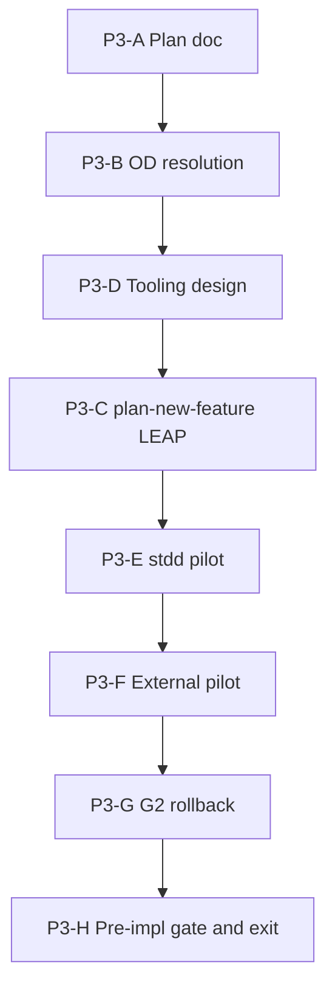

# Fleet constraint-language v2 — Phase 3 implementation plan

**Status:** **Phase 3 complete** (2026-09-12) — P3-A–P3-H + P3-C TIED persist  
**Methodology pin:** `48d1fbb+` (hygiene Tracks A/C/B + §E cohort automation)  
**Parent program:** [`pseudocode-constraint-v2-fleet-migration-grand-plan.md`](pseudocode-constraint-v2-fleet-migration-grand-plan.md) (authoritative five-phase roadmap)  
**Prior phase:** [`pseudocode-constraint-v2-fleet-migration-phase-2-plan.md`](pseudocode-constraint-v2-fleet-migration-phase-2-plan.md) (Phase 2 exit complete 2026-09-12)  
**Foundation:** [`pseudocode-grammar-v2-and-hygiene-plan.md`](pseudocode-grammar-v2-and-hygiene-plan.md) · [REQ-PSEUDOCODE_CONSTRAINT_LANGUAGE](../tied/requirements/REQ-PSEUDOCODE_CONSTRAINT_LANGUAGE.yaml) · [REQ-PSEUDOCODE_GRAMMAR_V2_DEFAULT](../tied/requirements/REQ-PSEUDOCODE_GRAMMAR_V2_DEFAULT.yaml) · [REQ-PSEUDOCODE_CONSTRAINT_V2_FLEET_MIGRATION](../tied/requirements/REQ-PSEUDOCODE_CONSTRAINT_V2_FLEET_MIGRATION.yaml)  
**Cursor plans:** `phase_3_pilot_plan_078b1efc.plan.md`

---

## Executive summary

**Phase 3 objective:** Prove **end-to-end pilot migration** and **migration-tool validation** on representative repos before Phase 4 fleet waves. Gate intent is **G2** ([`gate-promotion-stages.v1.yaml`](../working/fleet-constraint-v2/gate-promotion-stages.v1.yaml)): `constraint_gate_errors` **blocking at verification**, **advisory at pre-RED** (OD-2). Program **`gate_policy`** remains **advisory** at orchestrator level through Phase 3 exit (OD-P3-6); pilot client REQs may trial verification blocking locally.

| Deliverable ID | Description | Status |
|----------------|-------------|--------|
| **P3-01** | Phase 3 plan (scope, work packages, exit checklist) | **Done** (this doc, P3-A) |
| **P3-02** | Open decisions OD-P3-1..8 accepted | **Done** (P3-B, 2026-09-12) |
| **P3-03** | Pilot inventory manifest instance + migration workflow design | **Done** (P3-D) |
| **P3-04** | Migration tooling (inventory, dry-run, G2 receipts, revert) | **Done** (P3-D scripts) |
| **P3-05** | CITDP / REQ / ARCH / IMPL LEAP (SC-FLEET-P3-001..006) | **Done** (P3-C) |
| **P3-06** | stdd pilot (wave 1 sub-wave + receipts) | **Done** (P3-E) |
| **P3-07** | External pilot (client-owned REQ + inventory row) | **Done** (P3-F) |
| **P3-08** | G2 verification-blocking + rollback exercise | **Done** (P3-G) |

**Phase 3 exit criteria** (from grand plan): pilots reach **constraint-enforced-v2** or explicit **migration waiver** on in-scope sidecars; tooling deterministic + reversible; rollback accepted; **no** runtime product behavior change from pseudocode-only migration.

**Program sequencing:**

Qualification panel: extend only when this plan authorizes — pilot receipts under [`working/fleet-constraint-v2/pilots/`](../working/fleet-constraint-v2/pilots/) and harness scripts referenced in P3-D.

---

## Refine gate — resolved scope and vocabulary

**Sponsor intent resolved:** Phase 3 validates the **migration workflow module** (inventory → dry-run → validate → receipt → optional apply/revert) on **stdd first** (OD-3), then **≥1 external** representative client. It does **not** migrate the full fleet (Phase 4) or enable G3/G4 CI defaults (Phases 4–5).

### In scope / out of scope

| In scope | Out of scope (Phase 3) |
|----------|-------------------------|
| stdd pilot repo (sub-waves ≤10 sidecars per OD-P3-3) | All remaining TIED clients |
| External pilot: URL-fetch class client `1789177584` (OD-P3-1) | Fleet wave partition / dashboard |
| Populated **pilot** inventory instance (`stdd-fleet-inventory-pilots-v1`) | Full fleet inventory population |
| Migration tooling REQ + IMPL (OD-P3-2 split) | Methodology YAML edits in clients |
| G2 receipts + verification-blocking exercise | Program-wide G3 `constraint_flow: true` default |
| Per-pilot client-owned migration REQ / working evidence | Phase 5 bootstrap enforcement |

### State vs proof (no conflation)

| Claim | Establishes in Phase 3 | Does **not** establish |
|-------|------------------------|-------------------------|
| **G2 pilot receipt** for one sidecar | Analysis under pilot gate policy for that sidecar | Fleet-migrated-client for whole repo |
| **stdd wave 1 complete** | Tooling + reference path on first sub-wave | All 92 stdd sidecars enforced |
| **External pilot inventory row** | Operator registry + dry-run / scan evidence | External repo fully migrated without client REQ close-out |
| **constraint-enforced-v2** on a sidecar | Enforced constraint disposition per policy on annotated procedures | Runtime product proof |

**Rule:** Phase 3 exit proves **pilot migration workflow**, not **Phase 4 fleet-migrated-client** for every repository.

### Proof boundaries (carry from Phase 1–2)

Same table as [Phase 2 plan § Proof boundaries](pseudocode-constraint-v2-fleet-migration-phase-2-plan.md). Phase 3 adds: **pilot inventory instance** rows MUST NOT set `aggregate_migration_state: fleet-migrated-client` on header-only evidence alone.

### Unknown, truncation, and waiver policy (Phase 3)

Under **G2**, unknown/truncation/unsupported on **constraint-annotated** loci block **verification** state claims unless an active **migration waiver** (OD-5) documents owner, expiry, and remediation. Receipts MUST continue to disclose unknowns; waivers reference `migration-waiver.v1`.

### Refine disposition

- Documentation-first refine pass: **P3-A** committed from `/refine-plan` implement gate.
- TIED MCP writes in **P3-C**; sidecar/tooling code in **P3-D..G**.
- Phase 3 **may extend** `working/fleet-constraint-v2/pilots/` and qualification scripts when P3-D authorizes.

---

## Open decisions — resolution record

**Sponsor acceptance:** OD-P3-1..OD-P3-8 **accepted** 2026-09-12 (author: sponsor). Committed policy for P3-D onward.

| ID | Decision | Resolved value | Date | Owner |
|----|----------|----------------|------|-------|
| **OD-P3-1** | Final pilot list | **stdd** (`/Users/fareed/Documents/dev/chatgpt/stdd`) + external **1789177584** (`/Users/fareed/Documents/dev/test/1789177584`); max 2 repos for Phase 3 exit | 2026-09-12 | Sponsor |
| **OD-P3-2** | Tooling REQ split | **Split** [`REQ-PSEUDOCODE_MIGRATION_TOOLING`](../tied/requirements/REQ-PSEUDOCODE_MIGRATION_TOOLING.yaml) + [`IMPL-PSEUDOCODE_MIGRATION_TOOLING`](../tied/implementation-decisions/IMPL-PSEUDOCODE_MIGRATION_TOOLING.yaml); orchestrator IMPL retains governance validation | 2026-09-12 | Sponsor |
| **OD-P3-3** | stdd sidecar scope | All active project IMPL sidecars over **sub-waves of ≤10**; Phase 3 exit requires **wave 1** complete + tooling proven | 2026-09-12 | Sponsor |
| **OD-P3-4** | Scaffold automation | **Assist-only** (header/contract stubs); Tier-3 via agent LEAP; no solver auto-annotations in v1 tooling | 2026-09-12 | Sponsor |
| **OD-P3-5** | Dry-run artifact location | `working/fleet-constraint-v2/pilots/{client_id}/dry-run/` + `inventory-diff.v1.json` | 2026-09-12 | Sponsor |
| **OD-P3-6** | G2 blocking trial scope | **Verification** blocking on **pilot client REQ** checklist only; orchestrator program `gate_policy` **advisory** through Phase 3 exit | 2026-09-12 | Sponsor |
| **OD-P3-7** | External repo access | stdd tooling **read-only scan** by default; writes on client branch with owner approval | 2026-09-12 | Sponsor |
| **OD-P3-8** | Inventory manifest instance ID | **`stdd-fleet-inventory-pilots-v1`** → [`client-inventory-manifest.pilots.v1.yaml`](../working/fleet-constraint-v2/client-inventory-manifest.pilots.v1.yaml) | 2026-09-12 | Sponsor |

Committed Phase 1 **OD-1..OD-8** and Phase 2 **OD-P2-1..7** remain authoritative.

---

## CITDP Plan gate — Phase 3 design (persist in P3-C)

**Existing CITDP:** [`tied/citdp/CITDP-REQ-PSEUDOCODE_CONSTRAINT_V2_FLEET_MIGRATION.yaml`](../tied/citdp/CITDP-REQ-PSEUDOCODE_CONSTRAINT_V2_FLEET_MIGRATION.yaml)  
**Tracker:** [`working/REQ-PSEUDOCODE_CONSTRAINT_V2_FLEET_MIGRATION/agent-req-implementation-checklist.yaml`](../working/REQ-PSEUDOCODE_CONSTRAINT_V2_FLEET_MIGRATION/agent-req-implementation-checklist.yaml)

| Field | Phase 3 value |
|-------|----------------|
| Module boundary | **Migration workflow — pilot validation** (grand plan module 3) |
| `gate_policy` | **advisory** at orchestrator through Phase 3 exit; G2 verification blocking on client pilot REQ only |

### Change definition (P3-C)

| Field | Content |
|-------|---------|
| **Current behavior** | Phase 2 readiness complete; no populated pilot inventory; no migration CLI; orchestrator IMPL validates governance schemas only. |
| **Desired behavior (Phase 3)** | Pilot inventory instance; migration tooling; stdd wave 1 + external pilot evidence; G2 receipts; SC-FLEET-P3-001..006 satisfied. |
| **Unchanged behavior** | v1 compatibility; no fleet-wide G3 gates; no Phase 4 wave files. |
| **Non-goals (Phase 3)** | Every stdd sidecar in one commit; fleet-migrated-client for all clients. |
| **Success criteria** | Grand plan Phase 3 exit + § Exit review below. |

### Falsification questions

- Can Phase 3 close with only **header-only-v2** updates? (**Must fail.**)
- Can a pilot claim **enforced** with hidden truncation in receipt? (**Must fail** after G2 exercise.)
- Can orchestrator REQ substitute for **client-owned** migration REQ evidence on external pilot? (**Must fail.**)

### REQ satisfaction criteria (Phase 3 — persisted in P3-C)

1. **SC-FLEET-P3-001:** Pilot inventory manifest instance validates and lists every Phase 3 pilot without header-only → migrated inference.
2. **SC-FLEET-P3-002:** Each in-scope wave sidecar has schema-valid receipt with `gate_stage: G2`.
3. **SC-FLEET-P3-003:** Tooling supports dry-run → apply → receipt → revert with deterministic dry-run hash documented.
4. **SC-FLEET-P3-004:** stdd wave 1 complete before external pilot **apply** commits.
5. **SC-FLEET-P3-005:** Product tests green for pseudocode-only migration scope.
6. **SC-FLEET-P3-006:** G2 verification-blocking + pilot rollback recorded.

---

## LEAP / token map (P3-C)

| Token | Action |
|-------|--------|
| **REQ-PSEUDOCODE_CONSTRAINT_V2_FLEET_MIGRATION** | **Amend** — SC-FLEET-P3-001..006; link Phase 3 plan |
| **REQ-PSEUDOCODE_MIGRATION_TOOLING** | **Create** — pilot inventory, dry-run, receipt emit, revert |
| **ARCH-PSEUDOCODE_FLEET_MIGRATION_GOVERNANCE** | **Amend** — pilot inventory path, tooling artifact map, G2 evidence pointers |
| **IMPL-PSEUDOCODE_FLEET_MIGRATION_ORCHESTRATION** | **Amend** — cross-links to tooling; governance unchanged |
| **IMPL-PSEUDOCODE_MIGRATION_TOOLING** | **Create** — workflow pseudo-code |
| **REQ-PSEUDOCODE_CONSTRAINT_LANGUAGE** | **Read-only** unless pilot exposes defect |

---

## Work packages

### P3-A — Author Phase 3 plan document

**Status:** **Complete** (this file, 2026-09-12).

### P3-B — Open decisions

**Status:** **Complete** (2026-09-12) — OD-P3-1..8 accepted (§ Open decisions).

### P3-D — Migration tooling design and scripts

**Status:** **Complete** (2026-09-12).

| Artifact | Path |
|----------|------|
| Workflow design | [`working/fleet-constraint-v2/pilots/pilot-migration-workflow.v1.md`](../working/fleet-constraint-v2/pilots/pilot-migration-workflow.v1.md) |
| Pilot README | [`working/fleet-constraint-v2/pilots/README.md`](../working/fleet-constraint-v2/pilots/README.md) |
| Pilot inventory | [`working/fleet-constraint-v2/client-inventory-manifest.pilots.v1.yaml`](../working/fleet-constraint-v2/client-inventory-manifest.pilots.v1.yaml) |
| stdd wave 1 list | [`working/fleet-constraint-v2/pilots/stdd/wave-1-sidecars.yaml`](../working/fleet-constraint-v2/pilots/stdd/wave-1-sidecars.yaml) |
| Inventory scan | [`run-pilot-inventory-scan.ts`](../working/PSEUDOCODE-CONSTRAINT-STUDY/qualification/scripts/run-pilot-inventory-scan.ts) |
| G2 receipts | [`run-pilot-g2-receipts.ts`](../working/PSEUDOCODE-CONSTRAINT-STUDY/qualification/scripts/run-pilot-g2-receipts.ts) |
| G2 rollback | [`run-pilot-g2-rollback-exercise.ts`](../working/PSEUDOCODE-CONSTRAINT-STUDY/qualification/scripts/run-pilot-g2-rollback-exercise.ts) |
| Receipt collector G2 | [`constraint-migration-receipt.ts`](../working/PSEUDOCODE-CONSTRAINT-STUDY/qualification/scripts/lib/constraint-migration-receipt.ts) — `gate_stage` + `DEFAULT_G2_PILOT_OPTIONS` |

### P3-C — `/plan-new-feature` CITDP / REQ / ARCH LEAP

**Status:** **Complete** (2026-09-12 P3-C).

### P3-E — stdd pilot (wave 1)

**Status:** **Complete** (2026-09-12).

Wave 1 sidecars per OD-P3-3; receipts under `working/fleet-constraint-v2/pilots/stdd/receipts/`; dry-run under `pilots/stdd/dry-run/`.

### P3-F — External pilot (`1789177584`)

**Status:** **Complete** (2026-09-12).

Client-owned migration REQ pack under [`working/REQ-PSEUDOCODE_MIGRATION_PILOT_1789177584/`](../working/REQ-PSEUDOCODE_MIGRATION_PILOT_1789177584/); inventory row in pilot manifest; read-only scan + dry-run evidence (OD-P3-7).

### P3-G — G2 blocking + rollback

**Status:** **Complete** (2026-09-12) — [`rollback-exercise-G2-pilots.v1.json`](../working/fleet-constraint-v2/rollback-exercise-G2-pilots.v1.json).

### P3-H — Pre-implementation gate and Phase 3 exit

**Status:** **Complete** (2026-09-12) — [`phase-3-exit-review.v1.json`](../working/fleet-constraint-v2/phase-3-exit-review.v1.json).

---

## Annex A — Gate promotion G2 (Phase 3 focus)

| G2 control | Phase 3 action |
|------------|----------------|
| `layer_c.constraint_flow` | **advisory_default** on pilots unless sidecar explicitly enforced |
| `constraint_gate_errors` | **blocking at verification** on pilot client REQ (OD-2, OD-P3-6) |
| Receipt `gate_stage` | **G2** for pilot emits |
| G3 prerequisite | Phase 3 exit + Phase 4 wave planning |

---

## Risk register

| Risk | Mitigation |
|------|------------|
| Header pass masks missing contracts | Inventory counts + Layer B on receipts |
| Tooling bypasses LEAP | Dry-run diff + validate before apply |
| 92 stdd sidecars scope creep | Sub-waves ≤10; Phase 3 exit = wave 1 + tooling |
| External repo write without approval | OD-P3-7 read-only default |
| Orchestrator conflated with client migration | Separate client REQ folder (P3-F) |

---

## Implement gate — build disposition

**Authorized (P3-A refine, 2026-09-12):** this document; grand plan cross-link; vocab RECORD Phase 3 terms.

**Authorized (P3-D..H, 2026-09-12):** artifacts listed in work packages P3-D..H.

**Not authorized until Phase 4:**

| Next command | Scope |
|--------------|--------|
| **`/refine-plan`** | **Phase 4** — fleet waves plan |
| Phase 4 execution | All clients, G3 gates, populated fleet inventory |

---

## Exit review checklist (P3-H)

- [x] OD-P3-1..8 accepted (P3-B)
- [x] Pilot inventory instance + workflow design (P3-D)
- [x] Migration tooling REQ/IMPL + SC-FLEET-P3-001..006 (P3-C)
- [x] stdd wave 1 receipts at G2 (P3-E)
- [x] External pilot client REQ pack + inventory row (P3-F)
- [x] G2 rollback exercise (P3-G)
- [x] Vocab VALIDATE Phase 3 terms (P3-H)
- [x] No doc claims Phase 3 = fleet-wide migrated

**After Phase 3 exit:** **`/refine-plan`** for **Phase 4** (controlled fleet waves).
