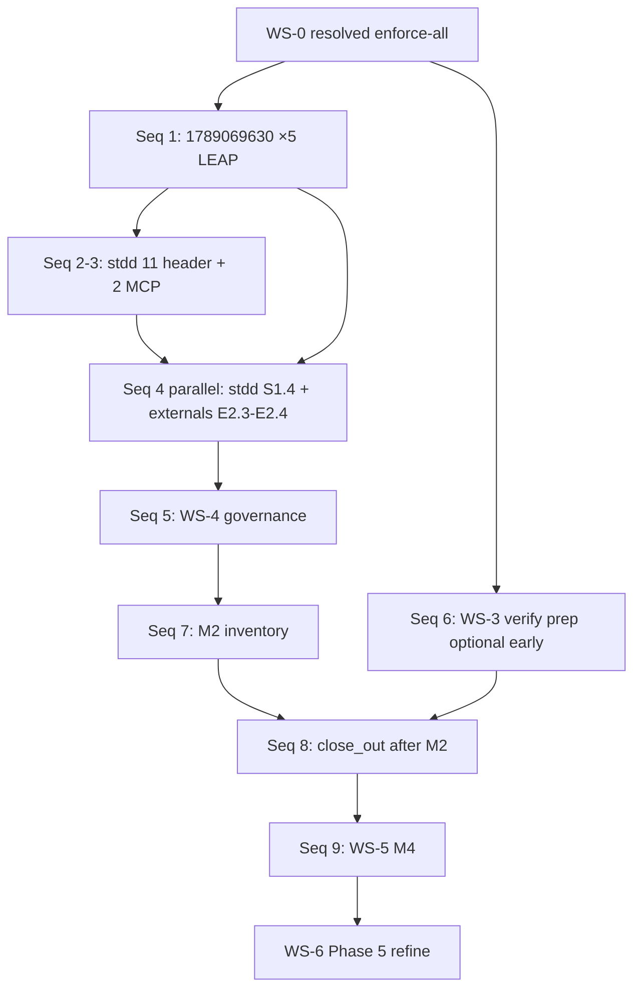

# Fleet constraint-language v2 — Phase 4 full exit plan (enforcement migration + program closeout, before Phase 5)

**Filename (stable link):** `pseudocode-constraint-v2-fleet-migration-phase-4-closeout-plan.md` — **closeout** = terminal gates (M2–M4, REQ verify/close_out, P4-H); **exit** = bulk LEAP enforcement on enrolled sidecars (no waiver shortcut on WS-0 gaps).

**Status:** **Active** — WS-0 **resolved** 2026-09-12 (full enforce on stdd 13 + 1789069630 ×5; orchestrator close_out after M2)  
**Created:** 2026-09-12  
**Refined:** 2026-09-12 (`/refine-plan` — closeout module clarity, CITDP/Implement gates)  
**WS-0 locked:** 2026-09-12 (sponsor — see § **Sponsor execution order**)  
**Methodology pin:** `48d1fbb+`  
**Parent:** [`pseudocode-constraint-v2-fleet-migration-grand-plan.md`](pseudocode-constraint-v2-fleet-migration-grand-plan.md)  
**Phase 4 machinery plan:** [`pseudocode-constraint-v2-fleet-migration-phase-4-plan.md`](pseudocode-constraint-v2-fleet-migration-phase-4-plan.md) (P4-A..P4-H; **machinery complete**, **full exit deferred**)  
**Prior phases:** [Phase 1](pseudocode-constraint-v2-fleet-migration-phase-1-plan.md) · [Phase 2](pseudocode-constraint-v2-fleet-migration-phase-2-plan.md) · [Phase 3](pseudocode-constraint-v2-fleet-migration-phase-3-plan.md) — all **complete**  
**Foundation:** [REQ-PSEUDOCODE_CONSTRAINT_V2_FLEET_MIGRATION](../tied/requirements/REQ-PSEUDOCODE_CONSTRAINT_V2_FLEET_MIGRATION.yaml) · [ARCH-PSEUDOCODE_FLEET_MIGRATION_GOVERNANCE](../tied/architecture-decisions/ARCH-PSEUDOCODE_FLEET_MIGRATION_GOVERNANCE.yaml) · [IMPL-PSEUDOCODE_FLEET_MIGRATION_ORCHESTRATION](../tied/implementation-decisions/IMPL-PSEUDOCODE_FLEET_MIGRATION_ORCHESTRATION-pseudocode.md) · [IMPL-PSEUDOCODE_MIGRATION_TOOLING](../tied/implementation-decisions/IMPL-PSEUDOCODE_MIGRATION_TOOLING-pseudocode.md)  
**CITDP (amend at closeout persist):** [`tied/citdp/CITDP-REQ-PSEUDOCODE_CONSTRAINT_V2_FLEET_MIGRATION.yaml`](../tied/citdp/CITDP-REQ-PSEUDOCODE_CONSTRAINT_V2_FLEET_MIGRATION.yaml)  
**Tracker (orchestrator REQ — extend, do not replace P4 history):** [`working/REQ-PSEUDOCODE_CONSTRAINT_V2_FLEET_MIGRATION/agent-req-implementation-checklist.yaml`](../working/REQ-PSEUDOCODE_CONSTRAINT_V2_FLEET_MIGRATION/agent-req-implementation-checklist.yaml) — add block **`phase_4_closeout`** in **P4-CLO-C**  
**Harness root:** `working/PSEUDOCODE-CONSTRAINT-STUDY/qualification/scripts/run-harness.sh` (from repo root)  
**Exit review (current):** [`working/fleet-constraint-v2/phase-4-exit-review.v1.json`](../working/fleet-constraint-v2/phase-4-exit-review.v1.json)  
**Conversation handoff (evidence ledger):** [`working/fleet-constraint-v2/phase-4-closeout-handoff.v1.json`](../working/fleet-constraint-v2/phase-4-closeout-handoff.v1.json) — **start new chat here** (updated 2026-09-13: slices **1–7** done; **seq 8** `/plan-close-out` next)  
**Orchestrator evidence stub:** [`working/REQ-PSEUDOCODE_CONSTRAINT_V2_FLEET_MIGRATION/evidence/phase-4-closeout-handoff.v1.json`](../working/REQ-PSEUDOCODE_CONSTRAINT_V2_FLEET_MIGRATION/evidence/phase-4-closeout-handoff.v1.json)  
**Phase 5 (blocked until this plan completes):** grand plan § Phase 5 — G4 CI defaults, new-client **constraint-enforced-v2** bootstrap, integrated envelope on FEAT-spawned REQs; **no Phase 5 `/refine-plan` until M4 (§ Milestones) or sponsor amends OD-P4-3 scope.**

---

## Executive summary

**Objective:** Close the gap between **Phase 4 G3 machinery complete** (P4-E..P4-G, partial P4-H) and **program Phase 4 fully closed** — every **OD-P4-3** enrolled repo at **`fleet-migrated-client`** (or waiver-backed), **SC-FLEET-P4-005** client-owned REQ close-out, orchestrator [REQ-PSEUDOCODE_CONSTRAINT_V2_FLEET_MIGRATION](../tied/requirements/REQ-PSEUDOCODE_CONSTRAINT_V2_FLEET_MIGRATION.yaml) **verification** + **close_out** gates **allowed**, and governance artifacts reconciled.

| Deliverable ID | Description | Status |
|----------------|-------------|--------|
| **P4-CLO-01** | Closeout plan (scope, milestones, work streams) | **Done** (this doc) |
| **P4-CLO-02** | Sponsor enforce / waiver / hybrid decisions (WS-0) | **Done** (2026-09-12 — enforce-all gaps; close_out after M2) |
| **P4-CLO-03** | Five-repo **`fleet-migrated-client`** (WS-1, WS-2) + **M2 formal assert** (seq 7) | **Done** (2026-09-13 — stdd 4A + externals **4B**; seq **7** EX-01..09) |
| **P4-CLO-04** | Client-owned migration REQ close-out ×4 (SC-FLEET-P4-005) | **Done** (2026-09-13 — client gates **allowed: true**) |
| **P4-CLO-05** | Orchestrator REQ machine close-out (WS-3, M3) | **Done** (2026-09-13 — seq **8** `/plan-close-out`) |
| **P4-CLO-06** | P4-H exit review + plan link maintenance (M4) | **Pending** |

**Documentation-first rule:** Sidecar promotion (enforce vs waiver) is **LEAP + pseudo-code** before apply; orchestrator REQ status changes only via **verification-gate** + checklist gates — not inventory prose.

---

## Prior phase dependencies (must hold before closeout execution)

| Dependency | Evidence | Closeout uses |
|------------|----------|---------------|
| Phase 1 policy + schemas | Phase 1 plan **Complete**; SC-FLEET-001..005 | State machine §3; falsification §9 |
| Phase 2 G1 readiness | [`working/PSEUDOCODE-CONSTRAINT-STUDY/qualification/fleet-g1/summary.json`](../working/PSEUDOCODE-CONSTRAINT-STUDY/qualification/fleet-g1/summary.json); SC-FLEET-P2-003 | EX-08 regression baseline |
| Phase 3 pilot workflow | Pilots + G2 rollback; SC-FLEET-P3-001..006 | Client REQ pattern §6; OD-P3-7 write policy |
| Phase 4 P4-C TIED persist | SC-FLEET-P4-001..006 in REQ; pre_implementation gate receipt under `working/REQ-PSEUDOCODE_CONSTRAINT_V2_FLEET_MIGRATION/gates/` | CITDP module **Fleet waves** (historical) |
| Phase 4 P4-E..G machinery | 14/14 waves; [`phase-4-exit-review.v1.json`](../working/fleet-constraint-v2/phase-4-exit-review.v1.json) `phase_4_g3_machinery_complete: true` | WS-4 refresh only; **no** re-partition |
| Partial P4-H | Exit review `phase_4_partial_technical_exit: true`; verification/close_out gates **allowed: false** (expected) | M2/M3/M4 flip flags + re-gate |

**Out of scope for this closeout plan:** Phase 5 G4 CI, `REQ-PSEUDOCODE_GRAMMAR_V2_DEFAULT` new-client bootstrap LEAP, migrating non-enrolled manifest clients (~22 qualification IDs).

---

## Refine gate — resolved scope and vocabulary

**Sponsor intent resolved:** Finish **legacy fleet** Phase 4 for the **five-repo OD-P4-3 set** only. **Phase 5** applies to **new** clients after M4 — do not conflate bootstrap enforcement with this closeout ([OD-P4-8](../docs/pseudocode-constraint-v2-fleet-migration-phase-4-plan.md)).

### In scope / out of scope

| In scope | Out of scope |
|----------|----------------|
| stdd + 4 externals → **`fleet-migrated-client`** or documented waiver mix | Remaining manifest `client_id` rows (`not_enrolled_phase_4`) |
| Tier-3 **constraint-enforced-v2** promotion or **migration-waiver-registry** rows | G4 `ci_expectations` / orchestrator pre-RED blocking |
| Client-owned REQ verify/close_out in **each client repo** (G3 blocking per OD-P4-8) | Orchestrator stubs alone satisfying SC-FLEET-P4-005 |
| Orchestrator REQ PSA, tests, integrated activation, envelope, **`tied_verify`** | Phase 5 plan authoring |
| CITDP amend module **Phase 4 closeout** + Tracker `phase_4_closeout` | Methodology YAML under `tied/methodology/` |

### State vs proof (no conflation)

| Claim | Establishes at closeout | Does **not** establish |
|-------|-------------------------|-------------------------|
| **G3 receipt** `layer_c.ok` | Analysis disposition for that sidecar at G3 | **`fleet-migrated-client`** for the repo |
| **constraint-ready-v2** / **header-only-v2** aggregate | Assist progress | Migration complete without enforce or waiver |
| **Orchestrator envelope** `fail_on_error_gaps: 0` | Orchestrator evidence pack integrity | External client REQ closed |
| **M2 technical exit** | Five enrolled rows + SC-FLEET-P4-001..007 | Full qualification fleet (~22 repos) |

### WS-0 sponsor decisions — resolved (2026-09-12)

| ID | Decision | Record |
|----|----------|--------|
| **OD-P4-CLO-1** | **Enforce all 13** on stdd — 11 **header-only-v2** + 2 **manual-flag** (`IMPL-MCP_*`); **Option A**; no waiver registry shortcut for these loci | Tracker `phase_4_closeout.ws0_od_p4_clo_1` when **P4-CLO-C** persists |
| **OD-P4-CLO-2** | **LEAP enforce all 5** sidecars on **1789069630** (`##` → `procedure` + Layer B + Tier-3/G3); **Option A** | Same; client repo `/Users/fareed/Documents/dev/test/1789069630` |
| **OD-P4-CLO-3** | Orchestrator **`close_out` after M2** — no machinery-only REQ split | O3.5 ordering unchanged |

**Not decided by WS-0 (unchanged):** **1789136889**, **1789147101**, **1789177584** — WS-2 **E2.3** remains **enforce Tier-3 or waiver** per sidecar until sponsor specifies otherwise.

### Refine disposition

- Vocabulary: **PRELOAD** [`tied/vocab/pseudocode-and-citdp.md`](../tied/vocab/pseudocode-and-citdp.md); **RECORD** enforcement batch terms at M4 (WS-5); waivers only if introduced under E2.3, not for OD-P4-CLO-1/2 loci.
- Execution follows **§ Sponsor execution order** (locked sequence); do not revert to plan silent defaults (Hybrid / 1789069630 waiver).

---

## CITDP Plan gate — Phase 4 closeout module (persist in P4-CLO-C)

**Existing CITDP:** [`CITDP-REQ-PSEUDOCODE_CONSTRAINT_V2_FLEET_MIGRATION.yaml`](../tied/citdp/CITDP-REQ-PSEUDOCODE_CONSTRAINT_V2_FLEET_MIGRATION.yaml) — preserve Phase 1–4 **Fleet waves** history; **append** closeout module at **`/plan-close-out`** or dedicated **P4-CLO-C** MCP session.

| Field | Closeout module value |
|-------|------------------------|
| `depth_tier` / `profile_depth` | **integrated** (unchanged); cross-repo + strict close-out trigger |
| `gate_policy` | **advisory** on orchestrator pre-RED; **G3 blocking** on client migration REQs + final orchestrator verify/close_out |
| Module boundary | **Phase 4 closeout** — fleet-migrated-client for OD-P4-3 set + SC-FLEET-P4-005 + orchestrator machine close-out |
| `run_id` (suggested) | `fleet-migration-phase4-closeout-20260912` |

### Change definition (draft for P4-CLO-C)

| Field | Content |
|-------|---------|
| **Current behavior** | G3 machinery complete; inventory shows `constraint-ready-v2` / `header-only-v2`; no enrolled **`fleet-migrated-client`**; orchestrator verification/close_out gates not allowed for full program narrative; client stubs under stdd `working/REQ-PSEUDOCODE_MIGRATION_*` without mirrored client-repo gates. |
| **Desired behavior** | All OD-P4-3 repos **`fleet-migrated-client`** or waiver-documented; SC-FLEET-P4-001..006 **satisfied** for enrolled set; client-owned REQ evidence in each external repo; orchestrator PSA + activation + envelope clean; REQ verification/close_out **allowed**; exit review M4 flags true. |
| **Unchanged behavior** | v1 parser compatibility; program orchestrator **advisory** pre-RED (OD-P4-8); non-enrolled inventory rows unchanged; Phase 5 bootstrap deferred. |
| **Non-goals** | Phase 5 plan; G4 CI; mass migration of non-enrolled clients; REQ scope split unless sponsor amends OD-P4-CLO-3. |
| **Success criteria** | Milestones M2–M4; EX-01..EX-11; Tracker `phase_4_closeout` complete; CITDP closeout module **final**. |

### Falsification questions (carry into CITDP amend)

- Inventory **`fleet-migrated-client`** with **`header-only-v2` > 0** and no matching waiver rows? **Must fail.**
- Orchestrator **close_out** complete while **SC-FLEET-P4-005** lacks client-repo gate receipts? **Must fail.**
- Phase 5 **refine/build** while **`phase_4_technical_exit`** false in exit review? **Must fail.**
- **Expired** waiver allows wave or program close? **Must fail** (SC-FLEET-P4-004).
- Closeout claimed for **~22 manifest repos** when only **five** are OD-P4-3 enrolled? **Must fail.**

### Test strategy (closeout module)

| Layer | Action | Acceptance |
|-------|--------|------------|
| Pseudo-code | `pseudocode_validate` + `pseudocode_analyze` (`gate_mode: true`, G3) on **IMPL-PSEUDOCODE_MIGRATION_TOOLING** and **IMPL-PSEUDOCODE_FLEET_MIGRATION_ORCHESTRATION** | Reports under `working/REQ-PSEUDOCODE_CONSTRAINT_V2_FLEET_MIGRATION/pseudocode-analysis/` |
| Unit | Existing assist bundle + extend if close-out adds composition paths | `bun test` / project test command on `working/PSEUDOCODE-CONSTRAINT-STUDY/qualification/scripts/**/*.test.ts` |
| Composition | `./run-harness.sh fleet-g3-refresh-stdd` after material sidecar edits | `waves/stdd/receipts/summary.json` — all targeted sidecars `layer_c.ok` |
| Fleet ops | `./run-harness.sh fleet-stop-go-closeout` after inventory change | `wave-stop-go.v1.json` + `run-fleet-waiver-registry-check.ts` exit 0 |
| Qualification regression | Optional: `./run-harness.sh fleet-g1` if sidecar/analyzer churn | [`f11-fp-thresholds.v1.yaml`](../working/fleet-constraint-v2/f11-fp-thresholds.v1.yaml); metrics [`metrics/f11-fleet-20260912.yaml`](../working/PSEUDOCODE-CONSTRAINT-STUDY/qualification/metrics/f11-fleet-20260912.yaml) |
| TIED | `lint_yaml` on changed project YAML; **`tied_validate_consistency`** | MCP / `.cursor/skills/tied-yaml/scripts/tied-cli.sh` |
| Checklist | `tied_checklist_activation_collect` + `tied_checklist_gate_validate` for **verification** and **close_out** | Receipts under `working/REQ-PSEUDOCODE_CONSTRAINT_V2_FLEET_MIGRATION/gates/` |
| Envelope | `request_evidence_envelope_validate` `fail_on_error_gaps: true` | [`request-evidence-envelope.v1.json`](../working/REQ-PSEUDOCODE_CONSTRAINT_V2_FLEET_MIGRATION/evidence/request-evidence-envelope.v1.json) |
| Close-out sync | `tools/bootstrap/templates/run-close-out-gates.mjs --envelope-blocking --sync-dispositions` (or **`sub-close-out-evidence-sync`**) | Three completion signals per `completion-signals-handoff.md` |

**Pre-implementation gate:** Re-run `tied_checklist_gate_validate` `phase: pre_implementation` **only if** CITDP closeout amend changes scope/depth; otherwise cite existing P4-C receipt and proceed to WS execution.

---

## Implement gate — work packages and command reference

Execute in order **WS-0 → (WS-1 ∥ WS-2) → WS-4 → WS-3 → WS-5 → WS-6**. Use **`/build-plan`** per repo batch; **`/plan-close-out`** for orchestrator REQ after M2.

| WP ID | Name | Depends on | Primary output |
|-------|------|------------|----------------|
| **P4-CLO-A** | WS-0 sponsor decisions | P4-CLO-01 | **Done** — enforce-all record § Refine gate; seq 1–3 batch list |
| **P4-CLO-B** | stdd fleet-migrated (WS-1) | P4-CLO-A | Inventory row stdd → `fleet-migrated-client` |
| **P4-CLO-C** | CITDP + Tracker closeout module | P4-CLO-A | CITDP amend + `phase_4_closeout` block |
| **P4-CLO-D** | External clients (WS-2) | P4-CLO-A; **1789069630** before M2 sign-off | Four inventory rows + client REQ gates |
| **P4-CLO-E** | Orchestrator REQ close-out (WS-3) | M2 | verification + close_out gates **allowed** |
| **P4-CLO-F** | Governance refresh (WS-4) | Any material B/D/E | Dashboard + stop/go reconciled |
| **P4-CLO-G** | P4-H final review (WS-5) | M2, M3 | exit review M4 flags |
| **P4-CLO-H** | Phase 5 entry gate (WS-6) | M4 | Grand plan **Next command** |

### Command prefix (all harness targets)

From repository root:

```bash
HARNESS=working/PSEUDOCODE-CONSTRAINT-STUDY/qualification/scripts/run-harness.sh
```

| Intent | Command |
|--------|---------|
| Inventory read | `"$HARNESS" fleet-inventory` |
| Inventory write | `"$HARNESS" fleet-inventory --apply` |
| stdd G3 refresh | `"$HARNESS" fleet-g3-refresh-stdd` |
| stdd constraint-ready report | `"$HARNESS" fleet-stdd-constraint-ready-report` |
| stdd constraint-ready dry-run | `"$HARNESS" fleet-stdd-constraint-ready-dry-run` |
| stdd constraint-ready apply | `node --experimental-strip-types working/PSEUDOCODE-CONSTRAINT-STUDY/qualification/scripts/run-fleet-stdd-constraint-ready.ts --all-waves --apply --receipts` (after dry-run hash OK) |
| External apply | `APPLY=1 "$HARNESS" fleet-external-apply` |
| Stop/go + waiver + dashboard | `"$HARNESS" fleet-stop-go-closeout` |
| Dashboard only | `"$HARNESS" fleet-dashboard` |
| Waiver registry check | `node --experimental-strip-types working/PSEUDOCODE-CONSTRAINT-STUDY/qualification/scripts/run-fleet-waiver-registry-check.ts` |
| Receipt sample validate | `node --experimental-strip-types working/PSEUDOCODE-CONSTRAINT-STUDY/qualification/scripts/validate-receipts-sample.ts` (paths per wave README) |
| Per-wave G3 | `"$HARNESS" fleet-g3-wave --wave-id W-ext-1789177584-1` (substitute wave id) |
| Fleet G1 regression (optional) | `"$HARNESS" fleet-g1` |
| YAML lint | `scripts/lint_yaml.sh` on changed `working/fleet-constraint-v2/*.yaml` and `tied/**/*.yaml` |

---

## 1. Purpose

Phase 4 **machinery** (P4-A..P4-H) is **complete**: 14/14 partition waves, G3 harness, inventory, waiver registry, stop/go, dashboard, and orchestrator SC-FLEET-P4 persist. **Full Phase 4 close** is **not** complete: no enrolled repo is **`fleet-migrated-client`**, and **SC-FLEET-P4-005** client-owned migration REQ close-out is incomplete for most externals.

This document is the **single ordered checklist** to reach:

| Milestone | Meaning | Blocks Phase 5? |
|-----------|---------|-----------------|
| **M1 — Partial technical exit** | G3 machinery + honest inventory | **No** (already reached 2026-09-12) |
| **M2 — Phase 4 technical exit** | All **OD-P4-3** enrolled repos **`fleet-migrated-client`** or **current waiver**; SC-FLEET-P4-001..006 satisfied for that set; zero **blocking** wave/stop-go gaps | **Yes** |
| **M3 — Orchestrator REQ fully closed** | [REQ-PSEUDOCODE_CONSTRAINT_V2_FLEET_MIGRATION](../tied/requirements/REQ-PSEUDOCODE_CONSTRAINT_V2_FLEET_MIGRATION.yaml) verification + close_out gates **allowed**; envelope `fail_on_error_gaps` clean | **Yes** (program narrative) |
| **M4 — Phase 4 fully closed** | M2 + M3 + updated P4-H exit review + vocab VALIDATE + `tied_validate_consistency` | **Yes** |

**Dual track (OD-P4-8):** Legacy enrolled clients stay **G3** until **fleet-migrated-client**; **Phase 5** applies only to **new** clients after close — do not conflate Phase 5 bootstrap LEAP with finishing Phase 4 legacy fleet.

---

## 2. Snapshot — enrolled five-repo set (2026-09-12)

Source: [`client-inventory-manifest.v1.yaml`](../working/fleet-constraint-v2/client-inventory-manifest.v1.yaml) after latest inventory scan.

| `client_id` | `aggregate_migration_state` | Sidecar mix (approx.) | G3 receipts | Apply / assist |
|-------------|----------------------------|------------------------|---------------|----------------|
| **stdd** | `constraint-ready-v2` | 82 constraint-ready, 11 header-only, 0 legacy; 93 total | 83/83 `layer_c.ok`, `layer_b.ok` | Header + constraint-ready assist **done**; 2 manual-flag sidecars |
| **1789177584** | `constraint-ready-v2` | 5 constraint-ready | Wave complete | Pilot path; no legacy |
| **1789136889** | `constraint-ready-v2` | 4 constraint-ready | Wave complete | External apply (headers) **done** |
| **1789147101** | `constraint-ready-v2` | 4 constraint-ready | Wave complete | External apply + 2 procedure stubs **done** |
| **1789069630** | `header-only-v2` | 5 header-only (`##` blocks) | Wave complete | Headers **done**; constraint-ready assist **N/A** until `procedure` migration or waiver |

**Orchestrator (stdd):** PSA path for [IMPL-PSEUDOCODE_MIGRATION_TOOLING](../tied/implementation-decisions/IMPL-PSEUDOCODE_MIGRATION_TOOLING-pseudocode.md) at `working/REQ-PSEUDOCODE_CONSTRAINT_V2_FLEET_MIGRATION/evidence/psa-IMPL-PSEUDOCODE_MIGRATION_TOOLING-g3.v1.json`; verification manifest and request envelope under `working/REQ-PSEUDOCODE_CONSTRAINT_V2_FLEET_MIGRATION/evidence/`; re-validate envelope before M3 — target **`fail_on_error_gaps: true` → 0 blocking gaps** (advisory inquiry warns only).

**Still false:** `phase_4_technical_exit`, `fleet_migrated_client_reached`, `phase_4_fully_closed` in exit review JSON.

---

## 3. Definition — `fleet-migrated-client` (per repo)

From grand plan and REQ state machine (Phase 4 exit target):

- Every **active** project `IMPL-*` sidecar is **`constraint-enforced-v2`** **or** covered by an **active** row in [`migration-waiver-registry.v1.yaml`](../working/fleet-constraint-v2/migration-waiver-registry.v1.yaml) (owner, expiry, rationale, sidecar scope).
- **`aggregate_migration_state`** on the inventory row is **`fleet-migrated-client`** only when counts show **zero** uncleared `legacy-v1`, `header-only-v2`, and `constraint-ready-v2` **unless** each remaining sidecar in those buckets has a matching waiver.
- **Not sufficient:** G3 receipts alone, grammar v2 header alone, constraint-ready-v2 alone, orchestrator checklist text, or stdd-only evidence for external repos (**SC-FLEET-P4-005**).

**Phase 4 enforcement posture:** G3 **`constraint_flow: true`** on receipts; **`constraint_gate_errors`** remains **advisory** at orchestrator (OD-P4-8). Promoting to **constraint-enforced-v2** in Phase 4 means **documented** Tier-3 constraint annotations + passing G3 disposition **or** explicit waiver — not Phase 5 CI blocking.

**Acceptance probe (per repo):** After inventory `--apply`, row satisfies:

```bash
# Expect aggregate_migration_state: fleet-migrated-client and waiver cross-ref in notes when mixed.
yq '.clients[] | select(.client_id == "stdd") | {client_id, aggregate_migration_state, sidecar_counts_by_state, notes}' \
  working/fleet-constraint-v2/client-inventory-manifest.v1.yaml
```

---

## 4. North-star exit checklist (all must pass for M2; EX-10..11 for M4)

| ID | Criterion | Verification (concrete) |
|----|-----------|-------------------------|
| **EX-01** | OD-P4-3 five repos each **`fleet-migrated-client`** or waiver-backed mixed state documented | `"$HARNESS" fleet-inventory --apply`; audit each enrolled row + `notes` waiver IDs |
| **EX-02** | **SC-FLEET-P4-001** full inventory falsifiable for enrolled set | JSON Schema validate manifest; `phase_4_enrollment: enrolled_phase_4` on five rows |
| **EX-03** | **SC-FLEET-P4-002** completed waves: stop/go **go**, no blocking receipt gaps | `wave-stop-go.v1.json`; per-wave `waves/*/receipts/summary.json` |
| **EX-04** | **SC-FLEET-P4-003** G3 receipts schema-valid, `gate_stage: G3`, waiver policy on annotated loci | `validate-receipts-sample.ts`; summaries under `waves/stdd/receipts/summaries/` |
| **EX-05** | **SC-FLEET-P4-004** waiver registry: no **expired** waivers for closed waves | `run-fleet-waiver-registry-check.ts` exit 0 |
| **EX-06** | **SC-FLEET-P4-005** each external client: **client-owned** migration REQ verify/close_out in **that repo’s** `working/{REQ}/` | Per-client `gates/verification-*.json` + `gates/close_out-*.json` with **allowed: true** |
| **EX-07** | **SC-FLEET-P4-006** dashboard reconciles inventory, receipts, waivers | `"$HARNESS" fleet-dashboard`; diff against [`fleet-dashboard.v1.yaml`](../working/fleet-constraint-v2/fleet-dashboard.v1.yaml) |
| **EX-08** | F11/FP within [`f11-fp-thresholds.v1.yaml`](../working/fleet-constraint-v2/f11-fp-thresholds.v1.yaml) if stop/go references regression | `./run-harness.sh fleet-g1` or recorded metrics in `working/PSEUDOCODE-CONSTRAINT-STUDY/qualification/metrics/f11-fleet-20260912.yaml` |
| **EX-09** | Doc falsification: no header-only → fleet-migrated inference | Exit review `doc_falsification_audit`; phase-4-plan P4-H boxes |
| **EX-10** | **`tied_validate_consistency`** ok after any TIED edits | MCP `tied_validate_consistency` or `tied-cli.sh` equivalent |
| **EX-11** | Vocab **VALIDATE** Phase 4 fleet terms | Audit `tied/vocab/pseudocode-and-citdp.md` + fleet terms pre-commit |

---

## 5. Work streams and ordered steps

### WS-0 — Sponsor path choice (**resolved** 2026-09-12)

Reference options (for E2.3 and future amendments only — **OD-P4-CLO-1/2 are enforce-all**):

| Option | When | Outcome |
|--------|------|---------|
| **A — Enforce** | Sidecars are migration-critical; team can LEAP `procedure` + Tier-3 constraints | `constraint-enforced-v2` without waiver |
| **B — Waiver** | Header-only / legacy `##` sidecars deferred to Phase 5 or manual program | Active waiver rows; aggregate may still be `fleet-migrated-client` if **all** non-enforced sidecars waived |
| **C — Hybrid** | Mix enforce + waiver by sidecar | Was plan silent default; **not** selected for stdd gap or 1789069630 |

**Decision record:** OD-P4-CLO-1/2 → LEAP evidence (sidecar diffs + G3 receipts), not waiver rows. E2.3 waivers (if any) still append to [`migration-waiver-registry.v1.yaml`](../working/fleet-constraint-v2/migration-waiver-registry.v1.yaml) (schema [`migration-waiver.v1.schema.json`](../working/fleet-constraint-v2/migration-waiver.v1.schema.json)).

---

### WS-1 — stdd → `fleet-migrated-client`

**Goal:** Move **stdd** inventory from `constraint-ready-v2` to **`fleet-migrated-client`**.

| Step | Action | Owner / gate | Evidence |
|------|--------|--------------|----------|
| **S1.1** | `"$HARNESS" fleet-stdd-constraint-ready-report` | Document-only vs LEAP | `working/fleet-constraint-v2/waves/stdd/dry-run/constraint-ready-all.v1.json` |
| **S1.2** | For each **header-only-v2** sidecar: **LEAP** to `procedure` + Layer B contracts + optional Tier-3 **or** register **waiver** | `/build-plan` per wave or thematic batch | Sidecar diffs under client `tied/implementation-decisions/` + snapshots |
| **S1.3** | Resolve **2 manual-flag** sidecars (`IMPL-MCP_*`): full manual contract migration **or** scoped waiver (no auto assist) | Sponsor | Registry row with `sidecar_scope` |
| **S1.4** | Promote enforced sidecars: add Tier-3 constraint annotations; MCP **`pseudocode_analyze`** G3 (`gate_mode: true`); fix **layer_c** / waiver | LEAP-13 pattern | Per-sidecar receipts under `waves/stdd/receipts/` |
| **S1.5** | `"$HARNESS" fleet-g3-refresh-stdd` after material sidecar changes | Harness | `waves/stdd/receipts/summary.json` — 83/83 `layer_c.ok` |
| **S1.6** | `"$HARNESS" fleet-inventory --apply`; assert **`aggregate_migration_state: fleet-migrated-client`** | EX-01 | Manifest row `client_id: stdd` |
| **S1.7** | If any sidecar remains constraint-ready/header-only **with waiver**, document waiver IDs on inventory row `notes` | EX-04 | Registry cross-ref |

**Harness references:** `fleet-stdd-constraint-ready-dry-run`, `run-fleet-stdd-constraint-ready.ts --all-waves --apply --receipts`, `fleet-g3-refresh-stdd`.

---

### WS-2 — External clients (four repos)

**Goal:** Each enrolled external repo **`fleet-migrated-client`** + **SC-FLEET-P4-005** client REQ close-out.

| Step | Client | Action | Evidence |
|------|--------|--------|----------|
| **E2.1** | All | Confirm G3 receipts post-apply: `"$HARNESS" fleet-g3-wave --wave-id W-ext-*` | `working/fleet-constraint-v2/waves/{client_id}/receipts/summary.json` |
| **E2.2** | **1789069630** | **`##` → `procedure` LEAP** or **waiver** for 5 sidecars (assist cannot auto-promote) | Client repo sidecars + `waves/1789069630/dry-run/` |
| **E2.3** | **1789136889**, **1789147101**, **1789177584** | Enforce Tier-3 **or** waiver remaining constraint-ready sidecars | Per-client inventory counts |
| **E2.4** | Each | **Client-owned REQ** (see §6): bootstrap `working/{REQ}/` **in client repo**; **`TIED_BASE_PATH`** = client `tied/`; checklist through **verification-gate** and **close_out** with **G3 blocking** (OD-P4-8) | Client `working/{REQ}/gates/*.json`, envelope |
| **E2.5** | Each | Orchestrator **stubs** under stdd `working/REQ-PSEUDOCODE_MIGRATION_*` are **templates only** — README must link to client gate receipts | Cross-ref paths in stub README |
| **E2.6** | All | `APPLY=1 "$HARNESS" fleet-external-apply` for further assist if needed | [`external-client-apply-report.v1.json`](../working/fleet-constraint-v2/external-client-apply-report.v1.json) |
| **E2.7** | All | `"$HARNESS" fleet-inventory --apply` + `fleet-dashboard` | EX-07 |

**Ordering:** Finish **1789069630** header-only gap (**E2.2**) before declaring five-repo **M2** technical exit.

**Client repo roots (default corpus):** `/Users/fareed/Documents/dev/test/{client_id}` — override with `EXTERNAL_CORPUS_ROOT` when running harness.

---

### WS-3 — Orchestrator REQ (stdd) — M3

**Goal:** [REQ-PSEUDOCODE_CONSTRAINT_V2_FLEET_MIGRATION](../tied/requirements/REQ-PSEUDOCODE_CONSTRAINT_V2_FLEET_MIGRATION.yaml) **verification** and **close_out** gates **allowed**.

| Step | Action | Notes |
|------|--------|-------|
| **O3.1** | **`pseudocode_validate`** + **`pseudocode_analyze`** (G3) on **IMPL-PSEUDOCODE_MIGRATION_TOOLING** and **IMPL-PSEUDOCODE_FLEET_MIGRATION_ORCHESTRATION** | Persist under `working/REQ-PSEUDOCODE_CONSTRAINT_V2_FLEET_MIGRATION/evidence/` and `pseudocode-analysis/` |
| **O3.2** | Unit + composition tests for **`run-fleet-*`** critical paths; extend beyond current assist bundle if close-out requires composition proof | `quality_evidence_collect` → `working/REQ-PSEUDOCODE_CONSTRAINT_V2_FLEET_MIGRATION/evidence/verification-evidence-manifest.v1.json` |
| **O3.3** | **Integrated activation:** `tied_checklist_activation_collect` for **verification** and **close_out** (`request_token: REQ-PSEUDOCODE_CONSTRAINT_V2_FLEET_MIGRATION`, `run_id: fleet-migration-phase4-closeout-*`) — four artifacts per phase under `adversarial-inquiry/phase-{phase}/` | Resolve advisory **finding_unresolved** warns or document waiver in CITDP |
| **O3.4** | **`request_evidence_envelope_build`** + **`request_evidence_envelope_validate`** with `fail_on_error_gaps: true` | Update tracker `execution_evidence.envelope_path` |
| **O3.5** | **`tied_checklist_gate_validate`** `phase: verification` then `close_out` with full CITDP + activation payload; persist receipts to `working/REQ-PSEUDOCODE_CONSTRAINT_V2_FLEET_MIGRATION/gates/` | Prior P4-H gates show **allowed: false** — expect replacement receipts |
| **O3.6** | Update tracker dispositions with typed **`evidence_refs`** (gate_receipt, manifest_ref, envelope_ref) | No prose-only evidence |
| **O3.7** | **`tied_verify`** with update for REQ/IMPL status (verification-gated project policy) | After verification gate **allowed: true** |
| **O3.8** | **`tied_validate_consistency`** | EX-10 |
| **O3.9** | **`run-close-out-gates.mjs --envelope-blocking --sync-dispositions`** | Unified machine close-out |

**Dependency:** O3.5 **close_out** runs **after** **M2** unless sponsor amends REQ scope (**OD-P4-CLO-3**).

**IMPL orchestration alignment:** Close-out steps must remain traceable to [IMPL-PSEUDOCODE_FLEET_MIGRATION_ORCHESTRATION](../tied/implementation-decisions/IMPL-PSEUDOCODE_FLEET_MIGRATION_ORCHESTRATION-pseudocode.md) governance blocks (inventory validation, stop/go, waiver registry) — executable fleet procedures live in **IMPL-PSEUDOCODE_MIGRATION_TOOLING**.

---

### WS-4 — Governance artifact refresh (cross-cutting)

Run after any material WS-1..WS-3 change:

| Step | Command / artifact |
|------|-------------------|
| **G4.1** | `"$HARNESS" fleet-inventory --apply` when sidecar states change |
| **G4.2** | `"$HARNESS" fleet-dashboard` |
| **G4.3** | `"$HARNESS" fleet-stop-go-closeout` (or append stop/go if new blocking event) |
| **G4.4** | `node --experimental-strip-types working/PSEUDOCODE-CONSTRAINT-STUDY/qualification/scripts/run-fleet-waiver-registry-check.ts` |
| **G4.5** | `scripts/lint_yaml.sh` on fleet + changed TIED project YAML |

---

### WS-5 — P4-H final exit review (M4)

| Step | Action |
|------|--------|
| **H5.1** | Update [`phase-4-exit-review.v1.json`](../working/fleet-constraint-v2/phase-4-exit-review.v1.json): set `phase_4_technical_exit: true`, `fleet_migrated_client_reached: true`, `phase_4_fully_closed: true` **only** when EX-01..EX-11 pass |
| **H5.2** | Refresh `remaining_work` to `[]` or Phase 5 pointers only |
| **H5.3** | Amend [`pseudocode-constraint-v2-fleet-migration-phase-4-plan.md`](pseudocode-constraint-v2-fleet-migration-phase-4-plan.md) status + P4-H checklist boxes (inventory + fleet-migrated rows) |
| **H5.4** | Grand plan: replace **Next command** with Phase 5 refine link |
| **H5.5** | Vocab RECORD any new waiver/enrollment terms; VALIDATE touchpoint 3 ([PROC-VOCABULARY_INDEX](../tied/docs/processes.md)) |
| **H5.6** | Tracker: set `fleet_program_phase_modules.phase_4_fleet_waves.status` → **`complete`** and add `phase_4_closeout.completed_at` |

---

### WS-6 — Phase 5 entry gate (do not start until M4)

Phase 5 work (**`/refine-plan`** on new-client bootstrap) starts only when:

- [ ] M2 technical exit checklist **EX-01..EX-09** green for OD-P4-3 set  
- [ ] M3 orchestrator REQ close_out gate **allowed: true** (or sponsor-approved REQ scope split per OD-P4-CLO-3)  
- [ ] M4 exit review JSON and phase 4 plan status updated  
- [ ] CITDP / grand plan explicitly note **legacy fleet** vs **new-client-only** dual track  
- [ ] [`phase-4-exit-review.v1.json`](../working/fleet-constraint-v2/phase-4-exit-review.v1.json) `phase_4_fully_closed: true`

**Phase 5 out of scope for this plan:** G4 `ci_expectations`, `constraint_gate_errors.pre_red` blocking at orchestrator, GRAMMAR_V2_DEFAULT bootstrap LEAP — see grand plan Phase 5 module.

---

## 6. Client-owned migration REQ map (SC-FLEET-P4-005)

Orchestrator templates (stdd) — **must be backed by client repo evidence**:

| `client_id` | Orchestrator stub | Client repo (default) | Client action |
|-------------|-------------------|----------------------|---------------|
| **1789177584** | `working/REQ-PSEUDOCODE_MIGRATION_PILOT_1789177584/` | `/Users/fareed/Documents/dev/test/1789177584` | Client `REQ-PSEUDOCODE_MIGRATION_PILOT_1789177584` (or renamed client REQ) + checklist + gates + G3 receipts |
| **1789069630** | `working/REQ-PSEUDOCODE_MIGRATION_CLIENT_1789069630/` | `/Users/fareed/Documents/dev/test/1789069630` | Same pattern |
| **1789136889** | `working/REQ-PSEUDOCODE_MIGRATION_CLIENT_1789136889/` | `/Users/fareed/Documents/dev/test/1789136889` | Same |
| **1789147101** | `working/REQ-PSEUDOCODE_MIGRATION_CLIENT_1789147101/` | `/Users/fareed/Documents/dev/test/1789147101` | Same |

**Close-out steps per client (repeat ×4):**

1. Bootstrap or sync TIED REQ/ARCH/IMPL tokens **in client `tied/`** (LEAP migration if tokens live only in stdd).  
2. Copy checklist template → `working/{REQ}/agent-req-implementation-checklist.yaml`; set `execution_evidence.request`.  
3. Attach wave receipts (client-local copies **or** pinned paths to stdd orchestrator receipts — document **proof boundary** in checklist `evidence_refs`).  
4. Run client **`tied_validate_consistency`** with client `TIED_BASE_PATH` (client `.cursor/mcp.json` or `tied-cli.sh`).  
5. **`pseudocode_validate`** / **`pseudocode_analyze`** on in-scope IMPL sidecars at **G3** where sidecars changed.  
6. **`tied_checklist_gate_validate`** verification + close_out (**G3 blocking** on client REQ).  
7. Record client close-out in stdd inventory row `notes` + optional `client_migration_req` field; link stub README → client gate receipt paths.

---

## 7. Sponsor execution order (critical path — locked 2026-09-12)

**Policy:** Full **enforce** on WS-0 gap sidecars; orchestrator **`close_out` only after M2** (OD-P4-CLO-3). Waiver registry **not** used for OD-P4-CLO-1/2 loci.

### Ordered `/build-plan` and gate slices

| Seq | Slice | Work stream | Scope | Blocks |
|-----|-------|-------------|-------|--------|
| **1** | **`/build-plan` 1789069630 — five `##` LEAPs** | WS-2 **E2.2** | Client `1789069630`: all 5 header-only → `procedure` + Layer B + Tier-3/G3 | M2 (critical path external) |
| **2** | **`/build-plan` stdd — 11 header-only LEAPs** | WS-1 **S1.2** | stdd `tied/implementation-decisions/` header-only batch | stdd `fleet-migrated-client` |
| **3** | **`/build-plan` stdd — 2 MCP manual LEAPs** | WS-1 **S1.3** | `IMPL-MCP_*` (no fleet assist) | stdd aggregate |
| **4A** | **Parallel — stdd constraint-ready → enforced** | WS-1 **S1.4**–**S1.5** | ~82 constraint-ready sidecars: Tier-3 + G3 refresh | stdd aggregate; may batch across multiple build plans |
| **4B** | **Parallel — other externals** | WS-2 **E2.3**–**E2.4** | **1789136889**, **1789147101**, **1789177584**: enforce or waiver per sidecar + client-owned REQ gates | M2 |
| **5** | **Governance refresh** | WS-4 | After material edits in seq 1–4 | EX-07 |
| **6** | **Orchestrator verification prep** | WS-3 **O3.1**–**O3.4**, **O3.6**–**O3.8** | PSA, tests, activation, envelope — may start early | M3 prep |
| **7** | **Assert M2** | EX-01..EX-09 | Five OD-P4-3 rows **`fleet-migrated-client`** (enforce-backed for 9630 + stdd gaps) | M3 |
| **8** | **`/plan-close-out` orchestrator REQ** | WS-3 **O3.5** | **`tied_checklist_gate_validate`** verification + **close_out** | M3 |
| **9** | **P4-H + M4** | WS-5, WS-6 | Exit review flags, plan links, vocab VALIDATE | Phase 5 refine allowed |



**Parallelism:** Seq **6** (orchestrator verification prep) may run alongside seq **1–4**. Seq **8** **`close_out`** must not run before seq **7** (M2).

**Next command (2026-09-13 handoff):** **`/build-plan seq 9`** — WS-5 P4-H + M4. Seq **8** done — [`seq-8-orchestrator-closeout-report.v1.json`](../working/fleet-constraint-v2/seq-8-orchestrator-closeout-report.v1.json).

### Execution progress ledger (build-plan slices)

| Seq | Status | Evidence |
|-----|--------|----------|
| **1** 1789069630 procedure LEAP ×5 | **Done** | Client repo sidecars; `waves/1789069630/receipts/summary.json` (5/5 G3) |
| **2** stdd 9 header-only → procedure | **Done** | Excl. 2 MCP (seq 3) |
| **3** stdd 2 MCP manual LEAP | **Done** | `seq-4a` reports under `waves/stdd/` |
| **4A** stdd enforce W-stdd-2..10 + stragglers + aggregate | **Done** | `seq-4a-batch-1` … `seq-4a-batch-10`, [`seq-4a-stdd-fleet-migrated-aggregate-report.v1.json`](../working/fleet-constraint-v2/waves/stdd/seq-4a-stdd-fleet-migrated-aggregate-report.v1.json); stdd **`fleet-migrated-client`** |
| **4B** externals | **Done** (2026-09-13) | Four clients **`fleet-migrated-client`**; enforce Tier-3 + G3; client **`REQ-PSEUDOCODE_MIGRATION*`** gates — see [`phase-4-closeout-handoff.v1.json`](../working/fleet-constraint-v2/phase-4-closeout-handoff.v1.json) |
| **5** WS-4 governance | **Done** (2026-09-13) | [`seq-5-ws4-governance-report.v1.json`](../working/fleet-constraint-v2/seq-5-ws4-governance-report.v1.json) — inventory/dashboard/stop-go/waiver/lint |
| **6** orchestrator verify prep | **Done** (2026-09-13) | [`seq-6-orchestrator-verification-prep-report.v1.json`](../working/fleet-constraint-v2/seq-6-orchestrator-verification-prep-report.v1.json) — envelope **0** blocking gaps |
| **7** M2 EX-01..09 assert | **Done** (2026-09-13) | [`seq-7-m2-ex-assertion-report.v1.json`](../working/fleet-constraint-v2/seq-7-m2-ex-assertion-report.v1.json) — **M2** technical exit |
| **8** `/plan-close-out` orchestrator | **Done** (2026-09-13) | [`seq-8-orchestrator-closeout-report.v1.json`](../working/fleet-constraint-v2/seq-8-orchestrator-closeout-report.v1.json) — **M3** |
| **9** P4-H + M4 | **Pending** | Exit review flags; CITDP P4-CLO-C; vocab VALIDATE |

---

## 8. Evidence index (closeout pack)

| Artifact | Path |
|----------|------|
| Full inventory | `working/fleet-constraint-v2/client-inventory-manifest.v1.yaml` |
| Wave partition | `working/fleet-constraint-v2/fleet-wave-partition.v1.yaml` |
| Stop/go | `working/fleet-constraint-v2/wave-stop-go.v1.json` |
| Waiver registry | `working/fleet-constraint-v2/migration-waiver-registry.v1.yaml` |
| Dashboard | `working/fleet-constraint-v2/fleet-dashboard.v1.yaml` |
| stdd G3 aggregate | `working/fleet-constraint-v2/waves/stdd/receipts/summary.json` |
| stdd LEAP reports | `working/fleet-constraint-v2/waves/stdd/leap-13-layer-c-report.v1.json`, `leap-layer-b-report.v1.json` |
| External apply | `working/fleet-constraint-v2/external-client-apply-report.v1.json` |
| Orchestrator envelope | `working/REQ-PSEUDOCODE_CONSTRAINT_V2_FLEET_MIGRATION/evidence/request-evidence-envelope.v1.json` |
| Orchestrator PSA tooling | `working/REQ-PSEUDOCODE_CONSTRAINT_V2_FLEET_MIGRATION/evidence/psa-IMPL-PSEUDOCODE_MIGRATION_TOOLING-g3.v1.json` |
| Qualification F11 snapshot | `working/PSEUDOCODE-CONSTRAINT-STUDY/qualification/metrics/f11-fleet-20260912.yaml` |
| Exit review (update on M4) | `working/fleet-constraint-v2/phase-4-exit-review.v1.json` |
| Tracker | `working/REQ-PSEUDOCODE_CONSTRAINT_V2_FLEET_MIGRATION/agent-req-implementation-checklist.yaml` |
| CITDP | `tied/citdp/CITDP-REQ-PSEUDOCODE_CONSTRAINT_V2_FLEET_MIGRATION.yaml` |
| Prior gates (partial P4-H) | `working/REQ-PSEUDOCODE_CONSTRAINT_V2_FLEET_MIGRATION/gates/verification-2026-09-12T22-12-27-248Z.json`, `close_out-2026-09-12T22-12-33-155Z.json` |
| **Closeout handoff ledger** | [`working/fleet-constraint-v2/phase-4-closeout-handoff.v1.json`](../working/fleet-constraint-v2/phase-4-closeout-handoff.v1.json) |
| stdd Seq 4A batch reports | `working/fleet-constraint-v2/waves/stdd/seq-4a-*.json` |
| stdd straggler wave list | `working/fleet-constraint-v2/waves/stdd/wave-stragglers-sidecars.yaml` |
| 1789069630 seq 1 client paths | `/Users/fareed/Documents/dev/test/1789069630/tied/implementation-decisions/` |

---

## 9. Falsification — stop if any occur

- Inventory row **`fleet-migrated-client`** while **`header-only-v2` > 0** without matching waivers.  
- Orchestrator checklist **close_out** marked complete without **SC-FLEET-P4-005** client artifacts.  
- Phase 5 **refine/build** starts while **`phase_4_technical_exit`** is false in exit review.  
- Expired waiver allows wave or program close (**SC-FLEET-P4-004** fail).  
- Claim **full qualification manifest (~22 repos)** migrated when only OD-P4-3 five-repo set is in scope.  
- **`tied_verify`** or REQ **status** updated without verification gate **allowed: true**.

---

## 10. Link maintenance

When M4 is reached, update in order:

1. This doc → **Status: Complete**  
2. [`phase-4-exit-review.v1.json`](../working/fleet-constraint-v2/phase-4-exit-review.v1.json)  
3. [`pseudocode-constraint-v2-fleet-migration-phase-4-plan.md`](pseudocode-constraint-v2-fleet-migration-phase-4-plan.md) executive summary  
4. [`pseudocode-constraint-v2-fleet-migration-grand-plan.md`](pseudocode-constraint-v2-fleet-migration-grand-plan.md) Phase 4 line + **Next command** → Phase 5 plan (to be authored)

**Next command after reading this plan:** **`/build-plan seq 9`** — see **§7 progress ledger** and [`phase-4-closeout-handoff.v1.json`](../working/fleet-constraint-v2/phase-4-closeout-handoff.v1.json).

---

## 11. Risk register (closeout)

| Risk | Mitigation |
|------|------------|
| Header / constraint-ready mistaken for migrated | EX-01 + §3 definition; waiver registry scope |
| Client REQ evidence only on orchestrator | EX-06; stub README must link client gate receipts |
| Orchestrator close_out before fleet-migrated proof | O3.5 after M2; OD-P4-CLO-3 |
| Manual-flag sidecars block aggregate state | S1.3 full manual LEAP (OD-P4-CLO-1 enforce-all) |
| 1789069630 blocks M2 | E2.2 before five-repo sign-off |
| Stale P4-H gates treated as final | Replace verification/close_out receipts in O3.5 |
| Analyzer regression on promote churn | EX-08 optional `fleet-g1` re-run |
