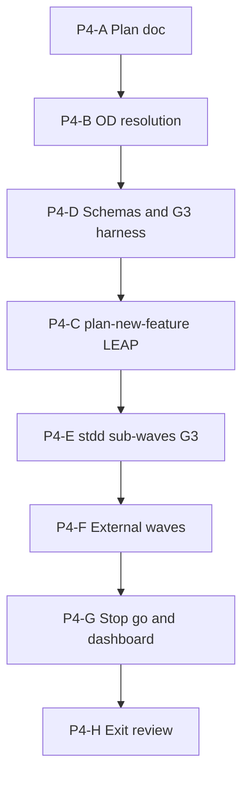

# Fleet constraint-language v2 — Phase 4 implementation plan

**Status:** **Machinery complete, fleet-migrated exit deferred** (2026-09-12) — P4-A..P4-H done; **P4-09 exit review** [`phase-4-exit-review.v1.json`](../working/fleet-constraint-v2/phase-4-exit-review.v1.json); enrolled **fleet-migrated-client** + orchestrator REQ full close-out remain open — **ordered steps:** [`pseudocode-constraint-v2-fleet-migration-phase-4-closeout-plan.md`](pseudocode-constraint-v2-fleet-migration-phase-4-closeout-plan.md)  
**Methodology pin:** `48d1fbb+` (hygiene Tracks A/C/B + §E cohort automation)  
**Parent program:** [`pseudocode-constraint-v2-fleet-migration-grand-plan.md`](pseudocode-constraint-v2-fleet-migration-grand-plan.md) (authoritative five-phase roadmap)  
**Prior phase:** [`pseudocode-constraint-v2-fleet-migration-phase-3-plan.md`](pseudocode-constraint-v2-fleet-migration-phase-3-plan.md) (Phase 3 exit complete 2026-09-12)  
**Foundation:** [REQ-PSEUDOCODE_CONSTRAINT_V2_FLEET_MIGRATION](../tied/requirements/REQ-PSEUDOCODE_CONSTRAINT_V2_FLEET_MIGRATION.yaml) · [REQ-PSEUDOCODE_MIGRATION_TOOLING](../tied/requirements/REQ-PSEUDOCODE_MIGRATION_TOOLING.yaml) · [ARCH-PSEUDOCODE_FLEET_MIGRATION_GOVERNANCE](../tied/architecture-decisions/ARCH-PSEUDOCODE_FLEET_MIGRATION_GOVERNANCE.yaml) · [IMPL-PSEUDOCODE_FLEET_MIGRATION_ORCHESTRATION](../tied/implementation-decisions/IMPL-PSEUDOCODE_FLEET_MIGRATION_ORCHESTRATION-pseudocode.md) · [IMPL-PSEUDOCODE_MIGRATION_TOOLING](../tied/implementation-decisions/IMPL-PSEUDOCODE_MIGRATION_TOOLING-pseudocode.md)  
**Cursor refine plan:** `phase_4_fleet_waves_6a14504a.plan.md`

---

## Executive summary

**Phase 4 objective:** Migrate **in-scope TIED clients** in **risk-based waves** with **G3** gate intent ([`gate-promotion-stages.v1.yaml`](../working/fleet-constraint-v2/gate-promotion-stages.v1.yaml)): `layer_c.constraint_flow: true`, `typed_flow: true`; waiver policy for unknown/truncation/unsupported on annotated loci (OD-5, 90-day default). Program **`gate_policy`** at orchestrator remains **advisory** through Phase 4 exit unless sponsor amends OD-P4-8; **G3 verification/close-out blocking** applies on **client migration REQs** per G3 stage.

| Deliverable ID | Description | Status |
|----------------|-------------|--------|
| **P4-01** | Phase 4 plan (scope, waves, work packages, exit checklist) | **Done** (this doc, P4-A) |
| **P4-02** | Open decisions OD-P4-1..8 accepted | **Done** (P4-B + P4-D defaults recorded 2026-09-12) |
| **P4-03** | Fleet wave partition + waiver registry + dashboard schemas (P4-D) | **Done** (P4-D refine implement gate) |
| **P4-04** | G3 receipt collector + harness (`fleet-g3-wave`, inventory scan) | **Done** (P4-E 2026-09-12) — `run-fleet-*.ts`, `run-harness.sh` targets `fleet-inventory` / `fleet-g3-wave` / `fleet-p4` |
| **P4-05** | CITDP / REQ / ARCH / IMPL LEAP (SC-FLEET-P4-001..006) | **Done** (P4-C 2026-09-12; pre_implementation gate receipt under `working/REQ-PSEUDOCODE_CONSTRAINT_V2_FLEET_MIGRATION/gates/`) |
| **P4-06** | stdd sub-waves 2..N → **fleet-migrated-client** or waivers | **In progress** — W-stdd-2 G3 receipts on file (10 sidecars); W-stdd-3..10 pending |
| **P4-07** | External client wave(s) with client-owned REQ evidence | **Done** (P4-F 2026-09-12) — `run-fleet-external-client-scan.ts`, four `W-ext-*` waves complete, orchestrator README/checklist stubs under `working/REQ-PSEUDOCODE_MIGRATION_*` |
| **P4-08** | G3 stop/go, waiver ops, fleet dashboard aggregate | **Done** (P4-G, 2026-09-12) |
| **P4-09** | Phase 4 exit review + vocab VALIDATE | **Done** (P4-H 2026-09-12) — partial technical exit; see exit review JSON |

**Phase 4 exit criteria** (grand plan): every **in-scope** client **fleet-migrated-client** or **current waiver**; completed waves have zero blocking evidence gaps; F11/FP/unknown-growth within [`f11-fp-thresholds.v1.yaml`](../working/fleet-constraint-v2/f11-fp-thresholds.v1.yaml); **no** client labeled migrated on header alone.

**Explicitly not Phase 4 exit:** G4 continuous CI; new-project enforcement defaults (Phase 5); v1 parser retirement.

**Program sequencing:**

Qualification panel: extend only when this plan authorizes — receipts under `working/fleet-constraint-v2/waves/` and harness targets in P4-D.

---

## Refine gate — resolved scope and vocabulary

**Sponsor intent (refine pass):** Phase 4 extends Phase 3 **pilot workflow** into **fleet completeness** for enrolled clients: full inventory instance, machine-readable **wave partition**, **G3** receipts, **waiver registry**, **wave stop/go**, and **fleet dashboard** aggregate. It does **not** wire G4 CI defaults or retire v1 parsing.

### In scope / out of scope

| In scope | Out of scope (Phase 4) |
|----------|-------------------------|
| Full fleet inventory manifest (`stdd-fleet-inventory-v1`) distinct from pilots instance | G4 `ci_expectations` in [`gate-promotion-stages.v1.yaml`](../working/fleet-constraint-v2/gate-promotion-stages.v1.yaml) |
| Risk-based **fleet wave partition** + per-wave sidecar lists (≤10 stdd sub-waves per OD-P3-3 carry-forward) | Edits to client `tied/methodology/` |
| stdd remaining sub-waves until **fleet-migrated-client** or documented waivers | Single big-bang migration; silent mass edit without dry-run |
| External clients with **client-owned** `REQ-*-PSEUDOCODE_MIGRATION` + `working/{REQ}/` evidence | Orchestrator REQ substituting for client migration close-out |
| Per-wave gates: `pseudocode_validate`, `pseudocode_analyze` (G3), client tests, `tied_validate_consistency`, evidence envelope where applicable | New Tier-3 language features |
| G3 receipts (`gate_stage: G3`, `constraint_flow: true`) | Program-wide **pre-RED blocking** at orchestrator (Phase 5) |
| Waiver registry + expiry audit (OD-5) | |
| Stop/go on F11/FP/unknown-growth regression | |

### State vs proof (no conflation)

| Claim | Establishes in Phase 4 | Does **not** establish |
|-------|------------------------|-------------------------|
| **Wave W complete** for client X | All sidecars in that wave’s list at constraint-enforced-v2 or active waiver for X | Other clients in the same calendar tranche |
| **`fleet-migrated-client`** on inventory row | All **active** project IMPL sidecars enforced or waived per Phase 1 state machine | Other repos in fleet |
| **G3 receipt** for one sidecar | G3 analysis disposition at pinned methodology/analyzer identity | Runtime/product proof |
| **Checklist completed** slugs on orchestrator Tracker | Process evidence for orchestrator REQ | SC-FLEET-P4-005 without client-owned REQ artifacts |
| **Pilot G2 receipts** (Phase 3) | Historical pilot evidence | G3 fleet wave close-out |

**Rule:** Phase 3 proved **workflow**; Phase 4 **machinery** (P4-H) proves G3 wave ops at fleet scale; **full** Phase 4 exit still requires **fleet-migrated-client** (or waivers) for the OD-P4-3 five-repo set — **not** achieved 2026-09-12.

**P4-H falsification posture (2026-09-12):** Receipts and stop/go **do** prove analyzer disposition and wave process for completed waves; they **do not** prove runtime migration, client-repo apply, or `fleet-migrated-client` when inventory still shows `legacy-v1` / `header-only-v2` aggregates.

### Proof boundaries (carry from Phase 1–3)

Same falsification posture as [Phase 3 plan § State vs proof](pseudocode-constraint-v2-fleet-migration-phase-3-plan.md). Full inventory rows MUST NOT set `aggregate_migration_state: fleet-migrated-client` when `sidecar_counts_by_state.header-only-v2` > 0 without waivers covering those sidecars.

### Unknown, truncation, and waiver policy (Phase 4 / G3)

Under **G3** ([`gate-promotion-stages.v1.yaml`](../working/fleet-constraint-v2/gate-promotion-stages.v1.yaml) `waiver_policy`), unknown/truncation/unsupported on **constraint-annotated** loci require **active waiver** or remediation in receipt (`require_active_waiver_or_receipt`). Expired waivers **block** wave close-out.

### Refine disposition

- **`/refine-plan` implement gate (P4-A):** this plan doc, grand plan First execution package link, vocab **RECORD** (fleet wave terms).
- **TIED MCP persist:** **P4-C** (`/plan-new-feature`) — SC-FLEET-P4-001..006, ARCH `governance_artifacts`, IMPL tooling pseudo-code blocks.
- **No** fleet sidecar mass apply, **no** G4 CI, **no** methodology YAML edits in clients during P4-A.

---

## Concrete wave definitions (draft — finalize in P4-B / P4-D)

**Registry source (OD-P4-1 default):** Unique `client_id` values from [`qualification/manifest.yaml`](../working/PSEUDOCODE-CONSTRAINT-STUDY/qualification/manifest.yaml) (**22** repos: **stdd** + **21** external Tier A/B entries under `corpus_root`) plus explicit `clients[]` rows in full inventory. Pilot instance [`client-inventory-manifest.pilots.v1.yaml`](../working/fleet-constraint-v2/client-inventory-manifest.pilots.v1.yaml) remains **historical** (`stdd-fleet-inventory-pilots-v1`).

**stdd baseline (post Phase 3):** 92 active project sidecars — **10** `constraint-ready-v2` (wave 1 tooling path), **82** `header-only-v2`, **0** `constraint-enforced-v2` ([pilot inventory row](../working/fleet-constraint-v2/client-inventory-manifest.pilots.v1.yaml)).

| Wave ID | Client(s) | Purpose | Gate | Depends on |
|---------|-----------|---------|------|------------|
| **W-stdd-1** | stdd | Pilot sub-wave (10 sidecars) | **G2** (complete) | Phase 3 P3-E |
| **W-stdd-2..W-stdd-10** | stdd | Remaining sidecars, **≤10 per wave** (OD-P3-3); lists under `working/fleet-constraint-v2/waves/stdd/wave-{n}-sidecars.yaml` | **G3** | P4-D tooling; prior stdd wave receipts |
| **W-ext-1789177584-1** | `1789177584` | Promote external pilot from dry-run scan to enforced/waived sidecars (5 sidecars) | **G3** | W-stdd-2+ recommended before **apply** commits (carry OD-P3-1 ordering spirit) |
| **W-ext-1789136889-1** | `1789136889` | Tier C peer wave (4 sidecars) | **G3** | After 1789177584 or parallel read-only scan per owner |
| **W-ext-1789147101-1** | `1789147101` | Tier C peer wave (4 sidecars) | **G3** | Partition pin + client REQ |
| **W-ext-1789069630-1** | `1789069630` | Tier C peer wave (5 sidecars) | **G3** | Partition pin + client REQ |

**Wave partition artifact (OD-P4-4):** `working/fleet-constraint-v2/fleet-wave-partition.v1.yaml` — ordered `waves[]` with `wave_id`, `client_ids[]`, `methodology_pin`, `gate_stage: G3`, optional `sidecar_list_path`, `blocking_policy` reference to G3 yaml.

**Phase 4 exit enrollment (OD-P4-3 — accepted 2026-09-12):**

- **Accepted:** Phase 4 **technical exit** covers exactly **5 repos total:** **stdd** (all sub-waves → **fleet-migrated-client** or waivers) + **four external clients**, including **`1789177584`** (already in pilot inventory) + **three** additional externals chosen in P4-B (see sponsor questions below).
- **Inventory implication:** Full manifest [`client-inventory-manifest.v1.yaml`](../working/fleet-constraint-v2/client-inventory-manifest.v1.yaml) still lists all qualification **client_id** values for dashboard/registry (OD-P4-1); rows outside the five-repo exit set remain **`not_enrolled_phase_4`** (or equivalent state) until a later tranche—**not** `fleet-migrated-client`.
- **Grand plan north star:** remaining manifest clients migrate in later Phase 4 tranches or Phase 5; Phase 4 exit proves **G3 wave machinery** at fleet scale without requiring all **~22** repos closed in one pass.

**Ordering default (OD-P4-3 proposed):** Finish **stdd** W-stdd-2..N → **W-ext-1789177584-1** → additional Tier A clients by ascending sidecar count / qualification tier (lowest risk first), subject to sponsor wave list.

---

## Open decisions — resolution record

**Status:** **Accepted for execution** (P4-B + P4-D, 2026-09-12). **OD-P4-3**, **OD-P4-8**, enrollment list, and **W-stdd-2..N batching** sponsor-accepted; **OD-P4-1,2,4,5,6,7** recorded as **accepted** using proposed defaults when P4-D artifacts landed (no conflicting sponsor override). Committed OD-1..8, OD-P2-*, OD-P3-* remain authoritative.

**Phase 4 enrolled repos (5 total):** `stdd`, `1789177584`, `1789136889`, `1789147101`, `1789069630` (Tier C peer set — same qualification arm as urlfetch pilot).

**W-stdd-2..N sidecar assignment:** **dependency-first** batches (core TIED/MCP/validation/platform IMPLs early; leaf/feature IMPLs later), still **≤10** sidecars per wave (OD-P3-3).

**OD-P4-8 (accepted):** **`program_gate_policy: advisory`** on orchestrator [REQ-PSEUDOCODE_CONSTRAINT_V2_FLEET_MIGRATION](../tied/requirements/REQ-PSEUDOCODE_CONSTRAINT_V2_FLEET_MIGRATION.yaml) for pre-RED and day-to-day stdd work; **G3 blocking** on each **client migration REQ** at verification/close-out and on **wave stop/go** (no G4 CI wiring in Phase 4).

| ID | Decision | Proposed default | Owner |
|----|----------|------------------|-------|
| **OD-P4-1** | Fleet client registry source | Qualification manifest client IDs + explicit inventory rows; pilots instance read-only history | Sponsor ✓ (P4-D) |
| **OD-P4-2** | Full inventory instance ID | `stdd-fleet-inventory-v1` at [`client-inventory-manifest.v1.yaml`](../working/fleet-constraint-v2/client-inventory-manifest.v1.yaml) (create from template; do not overwrite `pilots.v1`) | Sponsor ✓ (P4-D) |
| **OD-P4-3** | Phase 4 exit client set | **Accepted 2026-09-12:** **stdd** + **1789177584** + **3** other externals (**5 repos**); full manifest rows for non-enrolled clients stay not migrated | Sponsor ✓ |
| **OD-P4-4** | Wave partition artifact | `fleet-wave-partition.v1.yaml` + JSON Schema in P4-D | Sponsor ✓ (P4-D) |
| **OD-P4-5** | Waiver registry path | `migration-waiver-registry.v1.yaml` (array of docs validating against [`migration-waiver.v1.schema.json`](../working/fleet-constraint-v2/migration-waiver.v1.schema.json)) | Sponsor ✓ (P4-D) |
| **OD-P4-6** | Stop/go record | **Single append-only** [`wave-stop-go.v1.json`](../working/fleet-constraint-v2/wave-stop-go.v1.json) JSON array ([`wave-stop-go.v1.schema.json`](../working/fleet-constraint-v2/wave-stop-go.v1.schema.json)); not per-wave files | Sponsor ✓ (P4-D) |
| **OD-P4-7** | G3 harness entry | `run-harness.sh` target **`fleet-g3-wave`** → `run-fleet-g3-wave.ts`; **`fleet-inventory`** → `run-fleet-inventory-scan.ts`; composition **`fleet-p4`** — design in [`p4-d-g3-harness-design.v1.md`](../working/fleet-constraint-v2/p4-d-g3-harness-design.v1.md); scripts in P4-E | Sponsor ✓ (P4-D) |
| **OD-P4-8** | Program `gate_policy` during Phase 4 | **Accepted 2026-09-12:** orchestrator **advisory** (pre-RED + stdd daily); **G3 blocking** on client migration REQs at verify/close-out + wave stop/go; no G4 CI | Sponsor ✓ |

---

## TIED traceability — tokens and satisfaction criteria (persist in P4-C)

| Layer | Token | Phase 4 role |
|-------|-------|----------------|
| REQ | [REQ-PSEUDOCODE_CONSTRAINT_V2_FLEET_MIGRATION](../tied/requirements/REQ-PSEUDOCODE_CONSTRAINT_V2_FLEET_MIGRATION.yaml) | SC-FLEET-P4-001..006; orchestrator program scope |
| REQ | [REQ-PSEUDOCODE_MIGRATION_TOOLING](../tied/requirements/REQ-PSEUDOCODE_MIGRATION_TOOLING.yaml) | Tooling REQ for inventory/wave/receipt harness |
| ARCH | [ARCH-PSEUDOCODE_FLEET_MIGRATION_GOVERNANCE](../tied/architecture-decisions/ARCH-PSEUDOCODE_FLEET_MIGRATION_GOVERNANCE.yaml) | Extend `governance_artifacts` for partition, registry, dashboard, G3 prerequisites on gate yaml |
| IMPL | [IMPL-PSEUDOCODE_FLEET_MIGRATION_ORCHESTRATION](../tied/implementation-decisions/IMPL-PSEUDOCODE_FLEET_MIGRATION_ORCHESTRATION-pseudocode.md) | Governance validation; no replacement by tooling IMPL |
| IMPL | [IMPL-PSEUDOCODE_MIGRATION_TOOLING](../tied/implementation-decisions/IMPL-PSEUDOCODE_MIGRATION_TOOLING-pseudocode.md) | Add blocks: `BUILD_FLEET_INVENTORY`, `RUN_FLEET_WAVE`, `EMIT_G3_RECEIPT`, `RECORD_WAVE_STOP_GO`, `REFRESH_WAIVER_REGISTRY` (PRE/POST/EFFECTS, token comments) |

**Draft SC-FLEET-P4-001..006** (REQ persist in P4-C):

1. **SC-FLEET-P4-001:** Full fleet inventory instance validates against `client-inventory-manifest.v1` and includes every **Phase 4 in-scope** client with falsifiable `aggregate_migration_state`.
2. **SC-FLEET-P4-002:** Wave partition documents risk-based order and pins; each **completed** wave has stop/go record and zero blocking evidence gaps for enrolled clients.
3. **SC-FLEET-P4-003:** G3 receipts for all sidecars in completed waves; schema-valid with `gate_stage: G3` and waiver/disclosure rules for unknowns.
4. **SC-FLEET-P4-004:** Active waiver registry with expiry; G3 waiver_policy satisfied on annotated loci.
5. **SC-FLEET-P4-005:** Each migrated external client has client-owned migration REQ evidence in client `working/{REQ}/` (orchestrator cannot satisfy alone).
6. **SC-FLEET-P4-006:** Fleet dashboard aggregate reconciles inventory counts, `last_receipt_path`, and waiver IDs; F11/FP stop criteria referenced on wave halt.

**G3 prerequisites to add** (ARCH + `gate-promotion-stages.v1.yaml` in P4-C/D):

- `evidence: working/fleet-constraint-v2/phase-3-exit-review.v1.json`
- `evidence: working/fleet-constraint-v2/fleet-wave-partition.v1.yaml`
- `evidence: working/fleet-constraint-v2/client-inventory-manifest.v1.yaml`
- Phase 3 G2 pilot receipts accepted (rollback-exercise-G2-pilots)

---

## CITDP / tracker (P4-C)

- **CITDP amend:** [`CITDP-REQ-PSEUDOCODE_CONSTRAINT_V2_FLEET_MIGRATION`](../tied/citdp/CITDP-REQ-PSEUDOCODE_CONSTRAINT_V2_FLEET_MIGRATION.yaml) — module **Fleet waves — client integration** (grand plan module 4).
- **Tracker extend:** [`working/REQ-PSEUDOCODE_CONSTRAINT_V2_FLEET_MIGRATION/agent-req-implementation-checklist.yaml`](../working/REQ-PSEUDOCODE_CONSTRAINT_V2_FLEET_MIGRATION/agent-req-implementation-checklist.yaml) — block `phase_4_fleet_waves` (mirror `phase_3_pilot_migration`).
- **`profile_depth` / gate policy (plan default):** `integrated` advisory for tooling + cross-repo migration evidence; `depth_tier` recorded in CITDP at P4-C **risk-assessment**; re-run `tied_checklist_gate_validate` `phase: pre_implementation` before RED tests in P4-D/E.

**Falsification questions:**

- Phase 4 close with **fleet-migrated-client** but receipts still **G2** or header-only only? **Must fail.**
- Wave proceeds with **expired** waivers? **Must fail** (G3 waiver_policy).
- Orchestrator satisfies **SC-FLEET-P4-005** without client REQ artifacts? **Must fail.**

---

## Work packages

| ID | Name | Depends on | Notes |
|----|------|------------|-------|
| **P4-A** | Author Phase 4 plan document | Phase 3 exit | **Done** (this doc) |
| **P4-B** | Open decisions OD-P4-1..8 | P4-A | Sponsor table → resolution record |
| **P4-D** | Wave / waiver / dashboard schemas + G3 harness | P4-B | Under `working/fleet-constraint-v2/`; extend [`constraint-migration-receipt.ts`](../working/PSEUDOCODE-CONSTRAINT-STUDY/qualification/scripts/lib/constraint-migration-receipt.ts) for G3 |
| **P4-C** | `/plan-new-feature` CITDP / REQ / ARCH / IMPL LEAP | P4-B, P4-D sketch | SC-FLEET-P4-001..006 persist |
| **P4-E** | stdd W-stdd-2..N → fleet-migrated-client | P4-C, P4-D | Receipts under `working/fleet-constraint-v2/waves/stdd/receipts/` |
| **P4-F** | External client wave(s) | P4-E (ordering) | Client REQ + apply on approved branch; update full inventory |
| **P4-G** | G3 stop criteria, waiver ops, dashboard | P4-F | Registry + stop/go; optional F11/FP re-measure vs thresholds |
| **P4-H** | Phase 4 exit review | P4-C..G | [`phase-4-exit-review.v1.json`](../working/fleet-constraint-v2/phase-4-exit-review.v1.json); vocab VALIDATE; `tied_validate_consistency`; `pseudocode_validate` on tooling IMPL |

### P4-D — Schemas and tooling (refine disposition 2026-09-12)

**Refine implement gate:** **Complete** — governance artifacts and G3 harness **design** under `working/fleet-constraint-v2/`; **no** TIED MCP persist, **no** harness TypeScript bodies, **no** sidecar migration.

| Artifact | Path | Notes |
|----------|------|-------|
| Fleet wave partition | [`fleet-wave-partition.v1.yaml`](../working/fleet-constraint-v2/fleet-wave-partition.v1.yaml) + [`.schema.json`](../working/fleet-constraint-v2/fleet-wave-partition.v1.schema.json) | 14 waves: W-stdd-1 (G2 complete) + W-stdd-2..10 + 4× W-ext-* |
| Full inventory | [`client-inventory-manifest.v1.yaml`](../working/fleet-constraint-v2/client-inventory-manifest.v1.yaml) | `stdd-fleet-inventory-v1`; **23** `client_id` rows; `phase_4_enrollment` on schema |
| Inventory schema amend | [`client-inventory-manifest.v1.schema.json`](../working/fleet-constraint-v2/client-inventory-manifest.v1.schema.json) | Optional `phase_4_enrollment`: `enrolled_phase_4` \| `not_enrolled_phase_4` |
| Waiver registry | [`migration-waiver-registry.v1.yaml`](../working/fleet-constraint-v2/migration-waiver-registry.v1.yaml) + [`.schema.json`](../working/fleet-constraint-v2/migration-waiver-registry.v1.schema.json) | Empty `waivers: []` placeholder |
| Wave stop/go | [`wave-stop-go.v1.json`](../working/fleet-constraint-v2/wave-stop-go.v1.json) + [`.schema.json`](../working/fleet-constraint-v2/wave-stop-go.v1.schema.json) | **OD-P4-6:** single append-only JSON array (initial `[]`) |
| Fleet dashboard | [`fleet-dashboard.v1.yaml`](../working/fleet-constraint-v2/fleet-dashboard.v1.yaml) + [`.schema.json`](../working/fleet-constraint-v2/fleet-dashboard.v1.schema.json) | Read-only aggregate contract; refresh at P4-G |
| G3 harness design | [`p4-d-g3-harness-design.v1.md`](../working/fleet-constraint-v2/p4-d-g3-harness-design.v1.md) | CLI contracts, `DEFAULT_G3_FLEET_OPTIONS`, stub file list |
| stdd wave 2 skeleton | [`waves/stdd/wave-2-sidecars.yaml`](../working/fleet-constraint-v2/waves/stdd/wave-2-sidecars.yaml) | Dependency-first generation rule; `sidecars: []` until P4-E |

**Implement gate boundaries:**

| In scope (P4-D delivered) | Out of scope (P4-C / P4-E+) |
|---------------------------|-----------------------------|
| Schema + instance artifacts above | TIED SC-FLEET-P4-001..006 persist |
| `lint_yaml` on new/changed YAML | `run-fleet-*.ts` + `run-harness.sh` targets |
| Design note + receipt/G3 reuse plan | G3 receipt files under `waves/*/receipts/` |
| OD-P4-6 single-file stop/go | `tied_checklist_gate_validate` (P4-C pre-RED) |

**Validation:** `scripts/lint_yaml.sh` on fleet YAML instances (passed 2026-09-12). JSON Schema instance checks documented in design note; automated `jsonschema` optional at P4-E.

**Tooling evolution (reuse Phase 3):**

| Phase 3 asset | Phase 4 extension |
|---------------|-------------------|
| `run-pilot-inventory-scan.ts` | `run-fleet-inventory-scan.ts` — all clients in partition |
| `run-pilot-g2-receipts.ts` | `run-fleet-g3-receipts.ts` — `DEFAULT_G3_FLEET_OPTIONS`, `gate_stage: G3` |
| `client-inventory-manifest.pilots.v1.yaml` | Full `client-inventory-manifest.v1.yaml` |
| `pilots/stdd/wave-1-sidecars.yaml` | `waves/stdd/wave-{n}-sidecars.yaml` |

**Composition path:** harness → receipt batch → [`validate-receipts-sample.ts`](../working/PSEUDOCODE-CONSTRAINT-STUDY/qualification/scripts/validate-receipts-sample.ts).

**TDD order:** unit tests for wave partition parser and inventory merge → G3 receipt projection mocks → harness integration → stdd wave → external client.

### P4-E — stdd sub-waves

- Generate W-stdd-2..N sidecar lists via inventory scan (**dependency-first** batching among remaining header-only-v2 sidecars; document batch rationale in each `wave-{n}-sidecars.yaml` note).
- Track **IMPL-MODULE_VALIDATION** wave-1 G2 note (layer_c verification profile) — remediate or waiver before stdd **fleet-migrated-client**.
- Emit G3 receipts per sidecar; update inventory counts after each wave.

### P4-F — External clients

- Pattern: [`working/REQ-PSEUDOCODE_MIGRATION_PILOT_1789177584/README.md`](../working/REQ-PSEUDOCODE_MIGRATION_PILOT_1789177584/README.md) → client-local `REQ-*-PSEUDOCODE_MIGRATION` + checklist copy.
- Read-only scan default; writes on client branch with owner approval (carry OD-P3-7).

### P4-H — Exit review checklist

- [x] OD-P4-1..8 accepted and recorded
- [x] SC-FLEET-P4-001..006 persisted and traced in REQ/ARCH/IMPL
- [ ] Full inventory validates; in-scope clients fleet-migrated-client or current waiver — **deferred** (honest aggregates on all five enrolled repos)
- [x] Completed waves have G3 receipts + stop/go pass — **partial** (6/14 waves; W-stdd-3..10 pending)
- [x] Waiver registry: no expired waivers for closed waves
- [x] Fleet dashboard reconciles inventory + receipts + waivers
- [x] `tied_validate_consistency` ok
- [x] Vocab VALIDATE for Phase 4 fleet terms
- [x] Doc falsification audit (no header-only → fleet-migrated inference)

---

## Annex A — G3 vs G4 controls

| Control | G3 (Phase 4) | G4 (Phase 5) |
|---------|--------------|--------------|
| `layer_c.constraint_flow` | **true** (fleet waves) | **true** (default) |
| `constraint_gate_errors.pre_red` | advisory | blocking on qualifying paths |
| CI wiring | **none** (harness + client REQ only) | continuous cohort/client checks |
| Waiver stale checks | wave close-out + registry | CI + bootstrap |
| New client bootstrap | unchanged | constraint-enforced-v2 default |

---

## Risk register

| Risk | Mitigation |
|------|------------|
| Wave coupling breaks client releases | Independent pins per client; stop/go on regression |
| Stale waivers | Registry + expiry checks before wave close |
| Header pass = migrated | `sidecar_counts_by_state`; G3 receipts required |
| stdd scope drag | Sub-waves ≤10; explicit wave completion records |
| Tooling drift from IMPL | LEAP amend tooling IMPL before code (P4-C before P4-D RED) |
| Phase 4 exit vs full fleet confusion | OD-P4-3 documents enrolled client set |

---

## After P4-A — execution sequence

1. ~~Sponsor accepts **OD-P4-1..8** (P4-B).~~ **Partial + P4-D defaults recorded.**
2. ~~**P4-D** schemas + harness design.~~ **Done.**
3. **`/plan-new-feature`:** **P4-C** TIED persist + pre_implementation gate.
4. **`/build-plan`:** **P4-E** (harness + stdd G3 waves) → **P4-F** → **P4-G** → **P4-H**.

**Recommended next command:** **`/plan-new-feature`** for **P4-C**, then **`/build-plan`** for **P4-E** (G3 harness implementation follows P4-C LEAP).
