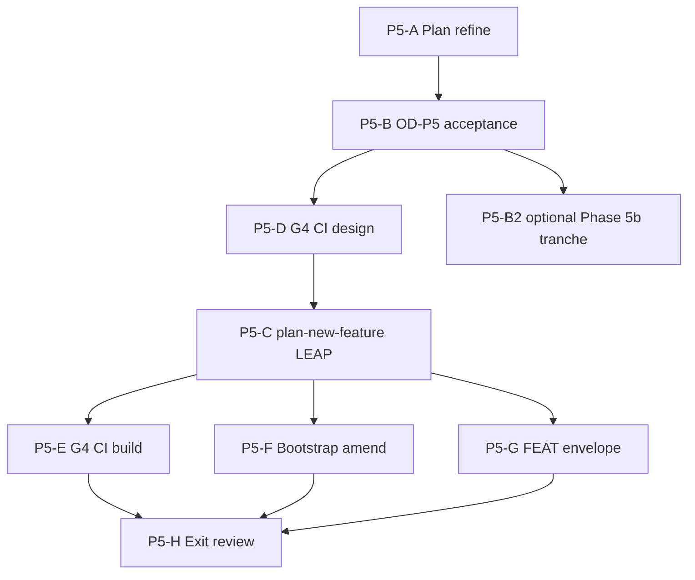

# Fleet constraint-language v2 — Phase 5 implementation plan

**Status:** **Complete** (2026-09-13) — P5-H Phase 5 program exit; G4 CI, bootstrap enforcement, FEAT envelope policy operational  
**Methodology pin:** `48d1fbb+`  
**Parent program:** [`pseudocode-constraint-v2-fleet-migration-grand-plan.md`](pseudocode-constraint-v2-fleet-migration-grand-plan.md)  
**Prior phases:** [Phase 1](pseudocode-constraint-v2-fleet-migration-phase-1-plan.md) · [Phase 2](pseudocode-constraint-v2-fleet-migration-phase-2-plan.md) · [Phase 3](pseudocode-constraint-v2-fleet-migration-phase-3-plan.md) · [Phase 4](pseudocode-constraint-v2-fleet-migration-phase-4-plan.md) · [Phase 4 closeout](pseudocode-constraint-v2-fleet-migration-phase-4-closeout-plan.md) — all **complete** (M4 2026-09-13)  
**Foundation:** [REQ-PSEUDOCODE_CONSTRAINT_V2_FLEET_MIGRATION](../tied/requirements/REQ-PSEUDOCODE_CONSTRAINT_V2_FLEET_MIGRATION.yaml) (orchestrator **closed** seq 8) · [REQ-PSEUDOCODE_GRAMMAR_V2_DEFAULT](../tied/requirements/REQ-PSEUDOCODE_GRAMMAR_V2_DEFAULT.yaml) · [ARCH-PSEUDOCODE_FLEET_MIGRATION_GOVERNANCE](../tied/architecture-decisions/ARCH-PSEUDOCODE_FLEET_MIGRATION_GOVERNANCE.yaml)  
**Phase 4 entry evidence:** [`phase-4-closeout-handoff.v1.json`](../working/fleet-constraint-v2/phase-4-closeout-handoff.v1.json) · [`seq-9-m4-p4-h-closeout-report.v1.json`](../working/fleet-constraint-v2/seq-9-m4-p4-h-closeout-report.v1.json) (WS-6 preconditions **Met**) · CITDP `phase_4_closeout_module` run_id **`fleet-migration-phase4-closeout-20260913`**  
**Gate promotion:** [`gate-promotion-stages.v1.yaml`](../working/fleet-constraint-v2/gate-promotion-stages.v1.yaml) stage **G4**

---

## Executive summary

**Phase 5 objective:** Make full constraint-language v2 the **normal** operating model — **G4** continuous enforcement and governance — without re-opening Phase 4 enrolled exit.

| Deliverable ID | Description | Status |
|----------------|-------------|--------|
| **P5-01** | Phase 5 plan (dual track, G4, CITDP boundary) | **Done** (this doc, refine 2026-09-13) |
| **P5-02** | Open decisions OD-P5-1..6 (proposed defaults) | **Done** (§ Open decisions — sponsor accept at P5-B) |
| **P5-03** | G4 CI / cohort dimension design | **Done** (2026-09-13 — [`p5-d-g4-ci-design.v1.md`](../working/fleet-constraint-v2/p5-d-g4-ci-design.v1.md)) |
| **P5-04** | GRAMMAR_V2 bootstrap LEAP (constraint-enforced-v2) | **Complete** (P5-C LEAP + P5-F implementation) |
| **P5-05** | FEAT-spawned REQ integrated envelope policy | **Complete** (P5-G 2026-09-13) |
| **P5-06** | v1 parser retirement / quarantine policy doc | **Done** (P5-H — [`v1-parser-quarantine-policy.v1.md`](../working/fleet-constraint-v2/v1-parser-quarantine-policy.v1.md)) |
| **P5-07** | CITDP `phase_5_module` + optional SC-FLEET-P5-* | **Done** (P5-C 2026-09-13) |
| **P5-08** | Phase 5 exit review + vocab VALIDATE | **Done** (P5-H — [`phase-5-exit-review.v1.json`](../working/fleet-constraint-v2/phase-5-exit-review.v1.json)) |

**Dual track (mandatory separation):**

| Track | Clients | Current state | Phase 5 work |
|-------|---------|---------------|--------------|
| **A — Legacy enrolled** | 5 (`phase_4_enrollment: enrolled_phase_4`) | **fleet-migrated-client** | G4 regression audit, stale waiver CI, dashboard |
| **B — Non-enrolled tranche** | 18 (`not_enrolled_phase_4` in full manifest) | Mostly **header-only-v2** | Optional **Phase 5b** G3 waves (OD-P5-2); **not** bootstrap |
| **C — New-client bootstrap** | Future `copy_files.sh` clients | Track A header-only today | **constraint-enforced-v2** after G4 LEAP (OD-P5-5) |

**Program sequencing:**

---

## Refine gate — resolved scope and vocabulary

**Sponsor intent resolved (refine pass):** Phase 5 **does not** repeat Phase 4 migration for the **five-repo OD-P4-3 set**. It promotes **G4** (`ci_expectations`, pre-RED blocking on qualifying paths), amends **new-client bootstrap** via [REQ-PSEUDOCODE_GRAMMAR_V2_DEFAULT](../tied/requirements/REQ-PSEUDOCODE_GRAMMAR_V2_DEFAULT.yaml), and defines **continuous governance** plus **FEAT-spawned REQ** integrated envelope expectations. **Non-enrolled** manifest clients remain a **separate tranche** until sponsor accepts OD-P5-2.

### In scope / out of scope

| In scope | Out of scope (Phase 5 unless OD-P5-2) |
|----------|----------------------------------------|
| G4 stage wiring in stdd CI/cohort path per [`gate-promotion-stages.v1.yaml`](../working/fleet-constraint-v2/gate-promotion-stages.v1.yaml) | Re-executing Phase 4 closeout (M2–M4) |
| `ci_expectations`: `header_and_contract_defaults_for_new_clients`, `stale_waiver_checks` | Mass sidecar edit without LEAP + dry-run |
| LEAP amend GRAMMAR_V2 — bootstrap → **constraint-enforced-v2** (OD-P5-5) | Track B **18** clients → fleet-migrated without tranche plan |
| Integrated envelope on **FEAT-spawned** REQs (checklist + gate policy) | Retiring v1 parser **code** unless OD-P5-1 accepted |
| Periodic fleet audit harness refresh (inventory + dashboard) | Edits to client `tied/methodology/` |
| Document v1 quarantine / retirement policy (OD-P5-1) | Orchestrator REQ re-open (closed seq 8) |

### Proof boundaries (Phase 5)

| Claim | Establishes | Does **not** establish |
|-------|-------------|-------------------------|
| **G4 CI dimension pass** | Continuous check on scoped paths | All **22** qualification repos migrated |
| **Bootstrap template change** | New projects start at enforced-v2 policy | Retroactive sidecar upgrade |
| **FEAT envelope complete** | One FEAT REQ close-out integrity | Fleet-wide migration |
| **Enrolled track audit green** | No regression on 5 repos | Non-enrolled tranche complete |

Cross-links: grand plan § Phase 5 · phase-4 plan [Annex A — G3 vs G4](pseudocode-constraint-v2-fleet-migration-phase-4-plan.md) · [`phase-4-exit-review.v1.json`](../working/fleet-constraint-v2/phase-4-exit-review.v1.json).

### Refine disposition

- **Implement gate (this pass):** plan doc + grand plan + vocab RECORD only.
- **Orchestrator REQ:** **Closed** — Phase 5 TIED work uses **amend** to GRAMMAR_V2 / ARCH governance, optional new FEAT REQ, and CITDP **`phase_5_module`** append (not orchestrator re-verification unless sponsor reopens scope).

---

## Open decisions — resolution record

**Status:** **Accepted** (2026-09-13) — sponsor defaults persisted in CITDP `phase_5_module.open_decisions_accepted` and Tracker `phase_5.od_p5_accepted_at`.

| ID | Decision | Proposed default | Owner |
|----|----------|------------------|-------|
| **OD-P5-1** | v1 parser retirement | **Defer removal** — publish quarantine policy + audit tagging; optional `REQ-PSEUDOCODE_PARSER_UNIFICATION` slice post-G4 | Sponsor |
| **OD-P5-2** | Non-enrolled tranche (~**18** rows) | **Defer Phase 5b** — complete Track A + C (G4 + bootstrap) first | Sponsor |
| **OD-P5-3** | Orchestrator `program_gate_policy` at G4 | Align with G4 yaml: **blocking on qualifying paths** for stdd pre-RED where scoped in P5-E | Sponsor |
| **OD-P5-4** | FEAT-spawned REQ envelope | **Integrated** profile mandatory for new FEAT REQs in stdd; checklist template for clients | Sponsor |
| **OD-P5-5** | New-client default state | **constraint-enforced-v2** after G4 promotion (LEAP amend GRAMMAR_V2; `copy_files.sh` + template) | Sponsor |
| **OD-P5-6** | CITDP module boundary | **`phase_5_module`** append to [`CITDP-REQ-PSEUDOCODE_CONSTRAINT_V2_FLEET_MIGRATION.yaml`](../tied/citdp/CITDP-REQ-PSEUDOCODE_CONSTRAINT_V2_FLEET_MIGRATION.yaml); bootstrap SC rows owned by **GRAMMAR_V2** detail | Sponsor |

**Closed elsewhere (do not re-open):** OD-1..OD-8 (Phase 1); OD-P2-* (Phase 2); OD-P3-* (Phase 3); OD-P4-1..8 (Phase 4); OD-P4-CLO-* (closeout WS-0).

---

## CITDP / tracker (P5-C)

### Module boundary

| Module | Owner token / file | Phase 5 content |
|--------|-------------------|-----------------|
| **`phase_5_module`** | CITDP fleet migration **append** | G4 CI scope, continuous governance, FEAT envelope policy, dual-track falsification |
| **Bootstrap enforcement** | **REQ-PSEUDOCODE_GRAMMAR_V2_DEFAULT** amend | SC-* for constraint-enforced-v2 bootstrap; template + `copy_files.sh` behavior |
| **Governance artifacts** | **ARCH-PSEUDOCODE_FLEET_MIGRATION_GOVERNANCE** amend | G4 evidence paths, audit schedule, optional Phase 5b tranche pointer |
| **Phase 5b (optional)** | Same CITDP or client-owned REQ | Only if OD-P5-2 accepted — reuse G3 harness; **not** G4 bootstrap |

**Do not create** a separate CITDP file unless sponsor splits program (default: single fleet CITDP history chain).

### Tracker

**Deferred until P5-C:** extend [`working/REQ-PSEUDOCODE_CONSTRAINT_V2_FLEET_MIGRATION/agent-req-implementation-checklist.yaml`](../working/REQ-PSEUDOCODE_CONSTRAINT_V2_FLEET_MIGRATION/agent-req-implementation-checklist.yaml) with block **`phase_5`** (steps P5-D..P5-H), **or** copy to `working/REQ-{FEAT}/` if Phase 5 ships under a new FEAT REQ per OD-P5-4.

**Refine pass:** no tracker stub file created (orchestrator closed; build owner selects tracker host at P5-C).

### CITDP Plan gate — Phase 5 design (persist in P5-C)

| Field | Content |
|-------|---------|
| **Current behavior** | G3 complete for enrolled set; `program_gate_policy: advisory`; G4 yaml stage defined but **CI not wired**; bootstrap header-only (GRAMMAR_V2 Implemented); ~18 manifest rows not fleet-migrated |
| **Desired behavior (Phase 5)** | G4 `ci_expectations` operational; bootstrap → constraint-enforced-v2; FEAT integrated envelope; enrolled-track continuous audit; v1 policy documented |
| **Unchanged behavior** | Phase 4 evidence and closed orchestrator REQ; v1 parser compatibility until OD-P5-1 retirement |
| **Non-goals (Phase 5)** | Phase 4 closeout replay; mandatory Track B migration without OD-P5-2 |
| **Success criteria** | § Exit criteria EX-P5-* below |
| **Profile depth** | Recommend **`integrated`** for G4 CI + bootstrap LEAP; **`minimal`** for audit-only scripts until scoped |
| **Gate policy** | Promote to G4-aligned blocking on qualifying paths (OD-P5-3) at P5-E |

### Falsification questions

- Can G4 close with only header audit on new clients? (**Must fail** — bootstrap must target constraint-enforced-v2 per OD-P5-5.)
- Can dashboard show **fleet-migrated-client** for non-enrolled rows after Phase 5 refine? (**Must fail** — Track B unchanged unless Phase 5b.)
- Does G4 CI prove Track B tranche complete? (**Must fail** — separate enrollment.)

**pre_implementation gate:** Run at **P5-C** after CITDP/REQ amend draft — **not** required for this refine-only pass.

---

## LEAP / token map (P5-C)

| Token | Action |
|-------|--------|
| **REQ-PSEUDOCODE_GRAMMAR_V2_DEFAULT** | **Amend** — bootstrap + satisfaction criteria for constraint-enforced-v2 default; rationale Phase 5 promotion |
| **REQ-PSEUDOCODE_CONSTRAINT_V2_FLEET_MIGRATION** | **Amend** (optional) — SC-FLEET-P5-* if program criteria remain on orchestrator REQ; else document-only closure |
| **ARCH-PSEUDOCODE_FLEET_MIGRATION_GOVERNANCE** | **Amend** — G4 artifact map, audit cadence |
| **IMPL-PSEUDOCODE_GRAMMAR_V2_DEFAULT** | **Amend** — bootstrap pseudo-code blocks |
| **REQ-PSEUDOCODE_PARSER_UNIFICATION** | **Read / optional amend** — only if OD-P5-1 accepts retirement scope |

New FEAT REQ creation: **`/plan-new-feature`** when OD-P5-4 routes envelope work off orchestrator REQ.

---

## Work packages

### P5-A — Author Phase 5 plan document

**Status:** **Complete** (this file, refine 2026-09-13).

### P5-B — Open decisions OD-P5-1..6

**Status:** **Complete** (accepted 2026-09-13; recorded in CITDP + Tracker).

### P5-D — G4 CI and cohort dimension design

**Status:** **Complete** (2026-09-13).

| Input | Output |
|-------|--------|
| [`gate-promotion-stages.v1.yaml`](../working/fleet-constraint-v2/gate-promotion-stages.v1.yaml) G4 | Design note: `working/fleet-constraint-v2/p5-d-g4-ci-design.v1.md` |
| phase-4 Annex A G3 vs G4 | Mapping table pre-RED / verification / CI |
| `scripts/audit-grammar-v2-default.mjs` | Extension plan for `ci_expectations` dimensions |

### P5-C — `/plan-new-feature` CITDP / REQ / ARCH LEAP

**Status:** **Complete** (2026-09-13). `phase_5_module` persisted; GRAMMAR_V2/ARCH/IMPL LEAP; `tied_checklist_gate_validate` `pre_implementation` (see Tracker gate receipt).

### P5-E — G4 CI implementation (build slice 1 candidate)

**Status:** **Complete** (2026-09-13).

- [`scripts/run-fleet-g4-ci-checks.mjs`](../scripts/run-fleet-g4-ci-checks.mjs) + [`scripts/fleet-g4-ci-checks.test.mjs`](../scripts/fleet-g4-ci-checks.test.mjs); harness **`fleet-g4-ci`**.
- Evidence: [`p5-e-g4-ci-build-report.v1.json`](../working/fleet-constraint-v2/p5-e-g4-ci-build-report.v1.json).
- **OD-P5-3** pre-RED MCP blocking deferred to post–P5-E slice; G4 CI wired via `gate-promotion-stages.v1.yaml` `g4_ci` metadata.

### P5-F — Bootstrap enforcement (GRAMMAR_V2)

**Status:** **Complete** (2026-09-13).

- G4 audit via `gateStage: "G4"` + `auditConstraintEnforcedBootstrap` (`bootstrap_enforcement` dimension; Layer C `constraint_flow: true`).
- Evidence: [`p5-f-bootstrap-enforcement-report.v1.json`](../working/fleet-constraint-v2/p5-f-bootstrap-enforcement-report.v1.json).
- Template HTML comment + smoke fixture contract floor; `fleet-g4-ci-checks` upgraded from P5-E header-only baseline.
- Do not conflate with Track B sidecar migration.

### P5-G — FEAT-spawned REQ integrated envelope

**Status:** **Complete** (2026-09-13).

- Policy: [`p5-g-feat-spawned-req-envelope-policy.v1.md`](../working/fleet-constraint-v2/p5-g-feat-spawned-req-envelope-policy.v1.md)
- Checklist template: [`templates/agent-req-checklist-feat-spawned-phase5.v1.yaml`](../templates/agent-req-checklist-feat-spawned-phase5.v1.yaml)
- Sample envelope: [`examples/feat-spawned-req-envelope.sample.v1.json`](../working/fleet-constraint-v2/examples/feat-spawned-req-envelope.sample.v1.json)
- Validator: `scripts/lib/validate-feat-spawned-envelope-policy.mjs` + tests
- Evidence: [`p5-g-feat-envelope-build-report.v1.json`](../working/fleet-constraint-v2/p5-g-feat-envelope-build-report.v1.json)
- `feature_create` returns `checklist_spawn_recommendation` (integrated defaults)

### P5-B2 — Optional Phase 5b (non-enrolled tranche)

**Status:** **Blocked** on OD-P5-2 acceptance.

- Reuse Phase 4 G3 harness + wave partition extension for manifest subset.
- Client-owned migration REQs per Phase 4 pattern.

### P5-H — Pre-implementation gate and Phase 5 exit

**Status:** **Complete** (2026-09-13).

- [`phase-5-exit-review.v1.json`](../working/fleet-constraint-v2/phase-5-exit-review.v1.json) · [`p5-h-phase-5-exit-report.v1.json`](../working/fleet-constraint-v2/p5-h-phase-5-exit-report.v1.json)
- Vocab VALIDATE Phase 5 terms (P5-H stamp in [`pseudocode-and-citdp.md`](../tied/vocab/pseudocode-and-citdp.md)).
- `tied_validate_consistency` receipt: [`p5-h-tied-validate-consistency.json`](../working/REQ-PSEUDOCODE_CONSTRAINT_V2_FLEET_MIGRATION/p5-h-tied-validate-consistency.json).

---

## Annex A — Gate promotion G4 (Phase 5 focus)

Source: [`gate-promotion-stages.v1.yaml`](../working/fleet-constraint-v2/gate-promotion-stages.v1.yaml) and phase-4 plan Annex A.

| Control | G3 (Phase 4 — done) | G4 (Phase 5) |
|---------|---------------------|--------------|
| `layer_c.constraint_flow` | **true** (fleet waves) | **true** (default) |
| `layer_c.typed_flow` | **true** | **true** |
| `constraint_gate_errors.pre_red` | advisory | **blocking on qualifying paths** |
| `constraint_gate_errors.verification` | blocking | blocking |
| `constraint_gate_errors.close_out` | blocking | blocking |
| CI wiring | none (harness + client REQ) | **continuous** cohort/client checks |
| `ci_expectations` | n/a | `header_and_contract_defaults_for_new_clients`, `stale_waiver_checks` |
| Waiver stale checks | wave close-out + registry | CI + bootstrap |
| New client bootstrap | unchanged (header-only) | **constraint-enforced-v2** default |
| `program_gate_policy` (orchestrator) | advisory through M4 | promote per OD-P5-3 |

**Notes field on yaml:** *CI wiring for G4 is Phase 5 unless explicitly scoped earlier.*

---

## Exit criteria (EX-P5-*)

| ID | Criterion | Evidence (planned) |
|----|-----------|-------------------|
| **EX-P5-01** | G4 `ci_expectations` checks run in stdd CI/cohort path | CI logs + audit script dimensions |
| **EX-P5-02** | New bootstrap cannot silently remain header-only-v2 | GRAMMAR_V2 SC + template/copy_files smoke |
| **EX-P5-03** | Enrolled 5-repo track audit green (no regression to header-only without waiver) | `fleet-dashboard.v1.yaml` + inventory scan |
| **EX-P5-04** | Stale waiver CI dimension operational | Registry check in CI |
| **EX-P5-05** | FEAT-spawned REQ envelope policy documented + gated | Checklist + sample envelope |
| **EX-P5-06** | v1 parser policy documented (retire or quarantine) | OD-P5-1 artifact in plan or REQ |
| **EX-P5-07** | Doc falsification — G4 ≠ full manifest migration | Inventory `not_enrolled_phase_4` rows honest |
| **EX-P5-08** | CITDP `phase_5_module` + `tied_validate_consistency` | CITDP yaml + validation receipt |
| **EX-P5-09** | Vocab VALIDATE Phase 5 terms | `tied/vocab/pseudocode-and-citdp.md` |

---

## Link maintenance

| Document | Action at Phase 5 exit |
|----------|------------------------|
| Grand plan | Status → Phase 5 complete; First execution package |
| Phase 4 plans | Historical **Complete** — no edits except cross-links |
| [`gate-promotion-stages.v1.yaml`](../working/fleet-constraint-v2/gate-promotion-stages.v1.yaml) | Update `updated_at`; optional G4 prerequisites evidence paths |
| Hygiene plan | Cross-link G4 bootstrap supersession note |

---

## Risk register

| Risk | Mitigation |
|------|------------|
| G4 CI noise on legacy prose | Qualifying-path scoping; OD-4 profile floor |
| Track B conflated with bootstrap | Dual track table + EX-P5-07 |
| Orchestrator REQ reopen confusion | Amend GRAMMAR_V2 / FEAT REQ; document closed orchestrator |
| Bootstrap breaks v1 clients | GRAMMAR_V2 SC preserves legacy parser path until OD-P5-1 |
| FEAT envelope blocks velocity | Advisory period option in OD-P5-4 (sponsor) |

---

## Implement gate — build disposition

**Authorized (P5-A refine, 2026-09-13):** this document; grand plan Phase 5 section; vocab RECORD.

**Not authorized until sponsor command:**

| Next command | Scope |
|--------------|--------|
| **`/plan-new-feature`** | **P5-C** — CITDP `phase_5_module`, GRAMMAR_V2 amend, pre_implementation gate |
| **`/build-plan`** | **P5-E** (G4 CI slice 1) after P5-C, or **P5-F** bootstrap parallel if LEAP ready |
| **`/refine-plan`** | Phase 5b tranche only if OD-P5-2 scope changes |

---

## After P5-A — execution sequence

1. Sponsor accepts **OD-P5-1..6** (P5-B) — record acceptance dates.
2. **P5-D** G4 CI design note.
3. **`/plan-new-feature`:** **P5-C** TIED persist + **`tied_checklist_gate_validate`** `pre_implementation`.
4. **`/build-plan`:** **P5-E** (G4 CI) → **P5-F** (bootstrap) → **P5-G** (FEAT envelope) → **P5-H** (exit).

**Next command:** Program **maintenance** (G4 CI in cohort path) or optional **Phase 5b** only if sponsor amends **OD-P5-2**. Do **not** re-open orchestrator REQ close_out.

---

## Exit review checklist (P5-H)

- [x] OD-P5-1..6 accepted (P5-B)
- [x] G4 design + CI wiring (P5-D, P5-E)
- [x] GRAMMAR_V2 bootstrap amend (P5-F)
- [x] FEAT envelope policy (P5-G)
- [x] EX-P5-01..09 green
- [x] Vocab VALIDATE Phase 5
- [x] No doc claims Phase 5 = all manifest clients migrated

**After Phase 5 exit:** program **fleet constraint v2** continuous governance; optional **Phase 5b** via OD-P5-2 amendment.

**Traceable commit (working tree → git):** `plan-close-out` with `git-condition: diff-or-stage`; anchor [grand plan](pseudocode-constraint-v2-fleet-migration-grand-plan.md); emit [`seq-10-p5-traceable-commit-report.v1.json`](../working/fleet-constraint-v2/seq-10-p5-traceable-commit-report.v1.json) after P5-H replay — **do not** re-open orchestrator REQ `close_out` (seq 8 remains authoritative).
