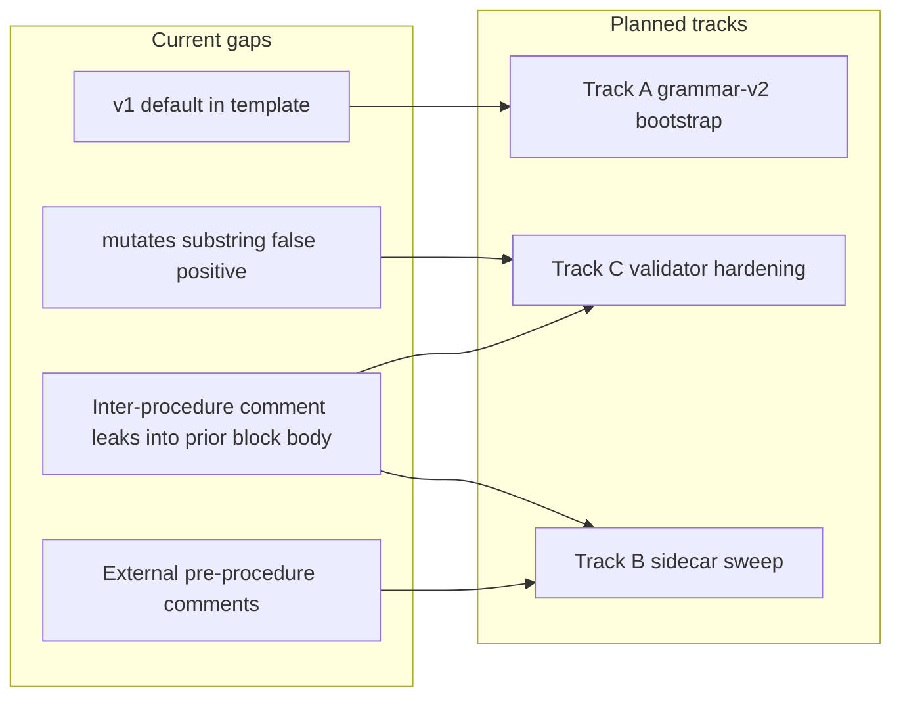
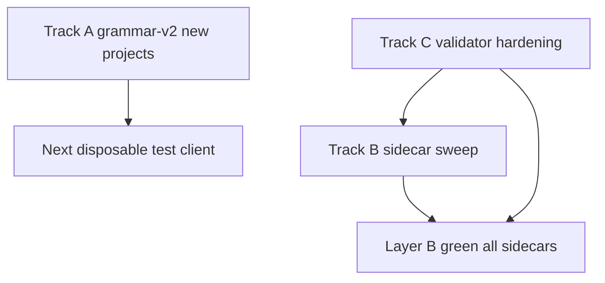

# Pseudocode quality plan — grammar-v2 default, sidecar sweep, validator hardening

**Status:** Refined plan 2026-09-11 — Tracks A/C/B implementation complete; Step 7 combined hygiene close-out refined (execution deferred to `/plan-close-out`)  
**Priority order:** Track A (P0) → Track C (P1) → Track B (P2)  
**Parent context:** Layer B close-out [`layerb-sidecar-fix-close-out.md`](layerb-sidecar-fix-close-out.md); cohort grading (FILEHASH v1 grammar); Wave 8 adherence realignment  
**Next product program (fleet):** [`pseudocode-constraint-v2-fleet-migration-grand-plan.md`](pseudocode-constraint-v2-fleet-migration-grand-plan.md) — full constraint-language v2 migration for all TIED clients (grand plan 2026-09-12; supersedes mass-migration non-goals **for that program only**)

---

## Executive summary

Three tracks address pseudocode fidelity gaps exposed by Wave 8 / Layer B close-out and disposable-client grading.

| Priority | Track | Scope | Outcome |
|----------|-------|-------|---------|
| **P0** | **A — Grammar v2 for new TIED projects** | Bootstrap + policy + cohort | Every **new** client project sidecar declares `Grammar-Version: v2` by default |
| **P1** | **C — Validator hardening** | `pseudocode-shared.ts`, `pseudocode-validator.ts` | Layer B scans block-leads on the **owning** procedure; fewer false positives |
| **P2** | **B — Sidecar comment-placement sweep** | 89 sidecars in `tied/implementation-decisions/` | All procedure block-leads **inside** procedure bodies |

**Sequencing:** A first (top priority) → C before/at start of B → B in phased waves.

**Non-goals:** Mass v2 constraint-language migration of existing stdd sidecars; breaking v1 compatibility for legacy clients without header.

---

## Refine gate — resolved scope and vocabulary

**Sponsor intent resolved:** Track A is a **new-project-only grammar v2 default** at the TIED template/bootstrap boundary. It is not a global parser-default change, a mass migration, or activation of `constraint_flow`. Existing headerless sidecars remain **legacy-v1 compatible**. Track C remains validator hardening, and Track B remains the later sidecar comment-placement sweep.

The chosen traceability stack is a new **[REQ-PSEUDOCODE_GRAMMAR_V2_DEFAULT]** with **[ARCH-PSEUDOCODE_GRAMMAR_V2_DEFAULT]** and **[IMPL-PSEUDOCODE_GRAMMAR_V2_DEFAULT]**. This does not extend the completed **[REQ-PSEUDOCODE_CONSTRAINT_LANGUAGE]**. The domain vocabulary record in [`tied/vocab/pseudocode-and-citdp.md`](../tied/vocab/pseudocode-and-citdp.md) records **grammar v2**, **grammar version boundary**, **new-project grammar v2 default**, **grammar_v2_header audit dimension**, and the three UPPER_SNAKE block names.

### Refine disposition

- Ambiguity is cleared: generated defaults and legacy compatibility are separate policy paths.
- Track A owns generation policy, audit dimensions, and compatibility classification; Track C and Track B are explicitly deferred follow-on scopes.
- No bootstrap/tooling code, RED tests, production implementation, mass migration, or sidecar sweep is authorized by this refinement.

## CITDP Plan gate — integrated advisory design

The persisted CITDP record is [`tied/citdp/CITDP-REQ-PSEUDOCODE_GRAMMAR_V2_DEFAULT.yaml`](../tied/citdp/CITDP-REQ-PSEUDOCODE_GRAMMAR_V2_DEFAULT.yaml). It records:

- `depth_tier: integrated`, `profile_depth: integrated`, and `gate_policy: advisory`, independently from the `baseline-functional` and `data-integrity-migration` assurance profiles.
- Change definition, unchanged behavior, non-goals, falsification questions, and risks for header generation, legacy preservation, proof-boundary separation, and Track A scope control.
- Module boundaries: generation/template-bootstrap, disposable-client audit, header-based parser compatibility, then bootstrap-to-audit composition.
- Test strategy: Layer A/B/C pre-RED checks; later RED tests for generation, audit dimensions, malformed headers, body preservation, and legacy compatibility; composition tests before wiring; no UI-only E2E.
- Proof boundaries: header presence is not runtime proof; Layer B is structural; Layer C is bounded static analysis; advisory inquiry observations remain review-gated.

The authoritative per-request Tracker is [`working/REQ-PSEUDOCODE_GRAMMAR_V2_DEFAULT/agent-req-implementation-checklist.yaml`](../working/REQ-PSEUDOCODE_GRAMMAR_V2_DEFAULT/agent-req-implementation-checklist.yaml). Its IMPL inventory contains only **[IMPL-PSEUDOCODE_GRAMMAR_V2_DEFAULT]**, records integrated depth and profile fields, and leaves implementation and verification pending/deferred.

## Implement gate — pre-implementation only

The IMPL sidecar is complete and validated before RED:

- Layer B `pseudocode_validate`: pass (`layer-b-pseudocode-validator.v1`).
- Layer C `pseudocode_analyze`: `ok: true`, `gate_mode_applied: true`, no truncation, and no unresolved internal calls; report at [`working/REQ-PSEUDOCODE_GRAMMAR_V2_DEFAULT/pseudocode-analysis/IMPL-PSEUDOCODE_GRAMMAR_V2_DEFAULT.v1.json`](../working/REQ-PSEUDOCODE_GRAMMAR_V2_DEFAULT/pseudocode-analysis/IMPL-PSEUDOCODE_GRAMMAR_V2_DEFAULT.v1.json).
- Integrated inquiry artifacts are phase-scoped under [`working/REQ-PSEUDOCODE_GRAMMAR_V2_DEFAULT/adversarial-inquiry/phase-pre_implementation/`](../working/REQ-PSEUDOCODE_GRAMMAR_V2_DEFAULT/adversarial-inquiry/phase-pre_implementation/). The inquiry gate is advisory `warn` because deferred tests and production evidence produce observed completeness findings; those observations are not confirmed defects or LEAP triggers.
- `tied_checklist_gate_validate` for `pre_implementation` returned `allowed: true`, `ok: true`, and `blocking: false` using the authoritative Tracker, CITDP, and collected activation evidence.

Actual bootstrap/template tooling, audit script, RED/GREEN TDD, independent module validation, composition wiring, verification, and close-out remain deferred to a later `/build-plan`. This refine pass does not claim implementation or verification completion.

## Context

**Repo audit (2026-09-11):**

| Metric | Count |
|--------|-------|
| Sidecar files (`tied/implementation-decisions/`) | 89 |
| Procedures with internal block-leads | ~236 |
| Inter-procedure `# [IMPL-…]` leak risk | ~54 |

Root cause: [`scanProcedureBlocks`](mcp-server/src/analysis/pseudocode-shared.ts) uses half-open `[procedure_line, next_procedure_line)` — inter-procedure comments attach to the **previous** block; comments **above** `procedure` are invisible.

**Grammar v2 today:** Opt-in via `Grammar-Version: v2` ([`tied/docs/pseudocode-grammar.v2.md`](../tied/docs/pseudocode-grammar.v2.md)). Migration guide keeps **v1 as default** for new sidecars ([`pseudocode-grammar-v2-migration.md`](../tied/docs/pseudocode-grammar-v2-migration.md) §Template note). **Policy change required for Track A.**

---

## Track A — Grammar v2 default for new TIED projects (P0)

### Goal

When a sponsor creates a **new TIED client project** (`copy_files.sh` or disposable test pipeline), every **new** `IMPL-*-pseudocode.md` sidecar:

1. Declares `Grammar-Version: v2` as first non-comment line in preamble (after H1).
2. Retains v1 procedure + contract rows (v2 is additive; constraints optional).
3. Passes `pseudocode_validate` and Layer C `gate_mode` at pre-RED without `constraint_flow: true`.

**Legacy:** Existing sidecars without header remain v1; no forced stdd mass migration.

### Deliverables

| ID | Deliverable | Primary files |
|----|-------------|---------------|
| A1 | REQ/ARCH/IMPL — new client projects default grammar v2 | New `REQ-PSEUDOCODE_GRAMMAR_V2_DEFAULT`, `ARCH-PSEUDOCODE_GRAMMAR_V2_DEFAULT`, and `IMPL-PSEUDOCODE_GRAMMAR_V2_DEFAULT` |
| A2 | Template default — `Grammar-Version: v2` | [`templates/impl-essence-pseudocode-template.md`](../templates/impl-essence-pseudocode-template.md) |
| A3 | Authoring docs — flip “new project” default | [`pseudocode-grammar-v2-migration.md`](../tied/docs/pseudocode-grammar-v2-migration.md), [`pseudocode-writing-and-validation.md`](../tied/docs/pseudocode-writing-and-validation.md), [`client-development-index.md`](../tied/docs/client-development-index.md) |
| A4 | Checklist gate — expect v2 header on new project IMPLs | [`agent-req-implementation-checklist.yaml`](../tied/docs/agent-req-implementation-checklist.yaml); optional Layer B SHAPE-007 |
| A5 | Evaluation cohort — `grammar_v2_header` dimension | `working/evaluation/evaluation-corpus.v1.yaml`; [`evidence-collection-conversation-patterns.md`](evidence-collection-conversation-patterns.md) §14 |
| A6 | Disposable client smoke | `scripts/audit-grammar-v2-default.mjs` (new) or extend replay fixtures |
| A7 | Vocab RECORD | [`tied/vocab/pseudocode-and-citdp.md`](../tied/vocab/pseudocode-and-citdp.md) |

### Phases

1. **Later `/build-plan` implementation sequence** — begin with the completed `depth_tier: integrated` CITDP design, then decide whether missing-header enforcement moves from advisory/warn to error for new IMPLs.
2. **TIED stack** — REQ SHALL use v2 header on new client sidecars; ARCH: bootstrap path authoritative.
3. **Bootstrap** — template preamble + internal block-lead pattern (template line 54 already correct).
4. **Tooling** — optional `MISSING_GRAMMAR_V2_HEADER` when project policy flag set; reuse `pseudocode-grammar-v2.ts`.
5. **Cohort** — next disposable test client grades grammar v2 pass; pilot FILEHASH client header-only retrofit (disposable tree only).
6. **Close-out** — unified runner, CHANGELOG, §14 evidence doc.

### Pass criteria

- Fresh `copy_files.sh` project: template contains `Grammar-Version: v2`.
- New IMPL in pilot client: header present; `pseudocode_validate` ok; PSA `gate_mode` ok.

### Track A boundaries and deferred implementation

Track A is limited to the new-client generation policy, its disposable-client audit, and header-based parser compatibility. Its independently validated modules are:

1. **Generation/template-bootstrap:** the canonical template and each fresh-client bootstrap path emit the exact v2 header while preserving the v1-compatible body.
2. **Disposable-client audit:** report header, Layer B, Layer C, `constraint_flow`, and legacy-v1 dimensions independently.
3. **Parser compatibility:** classify explicit v2, absent-header legacy-v1, and invalid headers without changing a global parser default.
4. **Composition boundary:** wire bootstrap output to the audit only after the three modules pass independently.

The selected profiles are `baseline-functional` and `data-integrity-migration`; the latter protects legacy sidecar bytes and header classification even though no database migration is proposed. The integrated inquiry and CITDP use `gate_policy: advisory`, so observations are review-gated rather than confirmed defects. Header presence is not Layer B, Layer C, runtime, or `constraint_flow` proof.

The following phases are implementation targets for a later `/build-plan`: generation and audit tests first, module validation, composition tests before wiring, then verification and close-out. The proposed missing-header warn→error rollout is a later policy decision; this refine pass does not change validator behavior, bootstrap tooling, or existing sidecars.

---

## Track C — Validator hardening (P1)

### Goal

Fix Layer B false positives/negatives without breaking D13 parser isolation.

### Problems

| Issue | Current | Target |
|-------|---------|--------|
| Inter-procedure block-lead leak | `# [IMPL-…]` between procedures in **previous** body | Attach to **next** procedure or exclude from previous |
| External pre-procedure lead | Comment above `procedure` invisible | Preceding `# [TOKEN]` lines attach to **following** procedure |
| Negated mutates | `/\bmutat\w*/` matches “never mutates” | Respect `DATA_TRANSITION` + negation context |

### Design

**1. `pseudocode-shared.ts`**

- Extend scan: walk upward from procedure line for contiguous `# [` block-leads.
- Trim end: exclude trailing inter-procedure `# [` lines from token scan range.
- Add `tokenScanRange` (or `bodyStart`/`bodyEnd`) separate from raw procedure range for CFG if needed.

**2. `pseudocode-validator.ts`**

- Token extraction and regex checks use `tokenScanRange`.
- Mutates heuristic excludes `never|does not|do not` before `mutat`.

**3. Tests (TDD first)**

- [`pseudocode-shared.test.ts`](../mcp-server/src/analysis/pseudocode-shared.test.ts) — external lead, inter-procedure lead fixtures.
- Validator tests for `MISSING_DATA_TRANSITION` negation and external-only token links.

### Pass criteria

- Layer B green on checklist gate sidecar without manual internal-comment hacks (validator-only).
- Full analysis unit tests green; constraint-language fixtures unchanged.

---

## Track B — Full sidecar comment-placement sweep (P2)

### Refine gate — resolved scope and vocabulary

**Sponsor intent resolved:** Track B is a **stdd hygiene sidecar edit** that moves procedure **block-lead comments** inside procedure bodies for **author clarity** and **literal-copy alignment**. It generalizes the manual pattern from [`layerb-sidecar-fix-close-out.md`](layerb-sidecar-fix-close-out.md). Track C already **accepts** external and inter-procedure leads for Layer B validation; Track B is still required because validator tolerance does not fix author-visible placement or three-way alignment.

The traceability stack is **[REQ-PSEUDOCODE_SIDECAR_BLOCK_LEAD_SWEEP]** with **[ARCH-PSEUDOCODE_SIDECAR_BLOCK_LEAD_SWEEP]** and **[IMPL-PSEUDOCODE_SIDECAR_BLOCK_LEAD_SWEEP]**. Vocabulary is recorded in [`tied/vocab/pseudocode-and-citdp.md`](../tied/vocab/pseudocode-and-citdp.md): **sidecar block-lead sweep**, **external block-lead**, **inter-procedure block-lead leak**, **block-lead inventory**, and UPPER_SNAKE blocks `SCAN_BLOCK_LEAD_PLACEMENT`, `NORMALIZE_EXTERNAL_BLOCK_LEAD`, `NORMALIZE_INTER_PROCEDURE_BLOCK_LEAD`, `APPLY_WAVE_SWEEP`, `SYNC_AUTHORING_GUIDANCE`.

**Non-goals (explicit):**

- Track A grammar v2 default or mass v2 constraint-language migration
- Track C validator behavior changes (`tokenScanStart` / `tokenScanEnd`, negated mutates)
- Single big-bang edit of all sidecars without wave gates
- Runtime product behavior beyond CLI/script and sidecar bytes

**Refine disposition:** Ambiguity cleared; Track B is sidecar hygiene only. No script implementation, `--write` sweep, RED tests, or production code is authorized by this refinement.

### CITDP Plan gate — integrated advisory design

Persisted CITDP: [`tied/citdp/CITDP-REQ-PSEUDOCODE_SIDECAR_BLOCK_LEAD_SWEEP.yaml`](../tied/citdp/CITDP-REQ-PSEUDOCODE_SIDECAR_BLOCK_LEAD_SWEEP.yaml).

- `depth_tier: integrated`, `profile_depth: integrated`, `gate_policy: advisory` — independent from `baseline-functional` and `data-integrity-migration` assurance profiles.
- Module boundaries: detection (aligned with `isBlockLeadCommentLine` / tokenScan bounds), external normalization, inter-procedure normalization, wave orchestration, B4 doc/template sync.
- Test strategy: RED unit tests for detection and verbatim moves; per-file `pseudocode_validate` after each swept file; per-wave `tied_validate_consistency`; full-repo `--check` audit after B3; no UI E2E.
- Proof boundaries: inventory JSON proves placement detection only; Layer B proves structure per swept file; wave gate proves zero leak-risk for the wave scope only.

Authoritative Tracker: [`working/REQ-PSEUDOCODE_SIDECAR_BLOCK_LEAD_SWEEP/agent-req-implementation-checklist.yaml`](../working/REQ-PSEUDOCODE_SIDECAR_BLOCK_LEAD_SWEEP/agent-req-implementation-checklist.yaml). IMPL inventory contains only **[IMPL-PSEUDOCODE_SIDECAR_BLOCK_LEAD_SWEEP]**; implementation steps remain pending/deferred.

### Implement gate — pre-implementation only

IMPL sidecar complete and validated before RED:

- Layer B `pseudocode_validate`: pass (0 diagnostics).
- Layer C `pseudocode_analyze`: `ok: true`, `gate_mode_applied: true`; report at [`working/REQ-PSEUDOCODE_SIDECAR_BLOCK_LEAD_SWEEP/pseudocode-analysis/IMPL-PSEUDOCODE_SIDECAR_BLOCK_LEAD_SWEEP.v1.json`](../working/REQ-PSEUDOCODE_SIDECAR_BLOCK_LEAD_SWEEP/pseudocode-analysis/IMPL-PSEUDOCODE_SIDECAR_BLOCK_LEAD_SWEEP.v1.json).
- Integrated inquiry artifacts under [`working/REQ-PSEUDOCODE_SIDECAR_BLOCK_LEAD_SWEEP/adversarial-inquiry/phase-pre_implementation/`](../working/REQ-PSEUDOCODE_SIDECAR_BLOCK_LEAD_SWEEP/adversarial-inquiry/phase-pre_implementation/) (`run_id: track-b-refine-20260911`); advisory `warn` / `UNRESOLVED` criteria expected at refine-only stage — observations are review-gated, not LEAP triggers.
- `tied_checklist_gate_validate` for `pre_implementation`: `allowed: true`, `ok: true`, `blocking: false` (receipt under `working/REQ-PSEUDOCODE_SIDECAR_BLOCK_LEAD_SWEEP/gates/`).
- `tied_validate_consistency`: pass.

Script, RED tests, wave `--write` passes, B4 doc sync, verification, and close-out remain deferred to `/build-plan Track B`.

### Goal

All procedure block-leads **inside** procedure bodies (matches Layer B close-out convention).

### Repo audit (2026-09-11, refined)

| Metric | Count |
|--------|-------|
| Sidecar files (`tied/implementation-decisions/`) | 90 (+1 new Track B IMPL sidecar = 91 total) |
| Sidecars with external and/or inter-procedure leak patterns | 29 |
| External-only block-leads (detected) | 73 |
| Inter-procedure block-lead leaks (detected) | 95 |

Detection aligns with [`pseudocode-shared.ts`](../mcp-server/src/analysis/pseudocode-shared.ts) `isBlockLeadCommentLine` and `resolveTokenScanBounds`. Track C safety net is **deployed** before B1 `--write`.

### Tooling — `scripts/normalize-sidecar-block-leads.mjs` (spec only; not implemented)

**Library:** `scripts/lib/normalize-sidecar-block-leads.mjs` — shared `scanBlockLeadPlacement` and `normalizeSidecarBlockLeads`.

| Flag / arg | Behavior |
|------------|----------|
| `--check` | Emit JSON inventory (`external_only`, `inter_procedure` per file); **no byte mutation** |
| `--write` | Apply edits in place (requires explicit wave or file list) |
| `--wave B1\|B2\|B3` | Restrict to plan wave file list |
| `--files path…` | Explicit sidecar paths (override wave) |
| `--root tied/implementation-decisions` | Sidecar root (default) |
| `--output path.json` | Optional inventory output path (default stdout) |
| `--dry-run` | With `--write`, emit diffs without disk mutation |

**Edit rules:**

1. **External-only:** Move contiguous `# [IMPL\|ARCH\|REQ` lines immediately above a `procedure` heading to the first line inside the body, before `Contract:`.
2. **Inter-procedure:** Move trailing `# [IMPL\|ARCH\|REQ` lines in the gap before the next procedure to that procedure's internal block-lead slot.
3. **Preserve** verbatim lead text; do not alter non-lead prose, grammar headers, or contract rows.

**Exit codes:** `0` = inventory clean or write success; `1` = validation/gate failure; `2` = usage/IO error.

### Phased rollout — concrete file lists

| Wave | Scope | Files | Sidecar paths |
|------|-------|-------|---------------|
| **B1** | Pilot — checklist, envelope, quality | 5 | `IMPL-TIED_CHECKLIST_GATE_ENFORCEMENT`, `IMPL-REQUEST_EVIDENCE_ENVELOPE`, `IMPL-QUALITY_PSEUDOCODE_VALIDATOR`, `IMPL-QUALITY_EVIDENCE_COMMAND_RUNNER`, `IMPL-QUALITY_BINDING_INVENTORY` |
| **B2** | MCP, pseudocode engine, agentstream core | 25 | `IMPL-PSEUDOCODE_ANALYSIS_ENGINE`, `IMPL-PSEUDOCODE_SHARED_PRIMITIVES`, `IMPL-PSEUDOCODE_CONSTRAINT_LANGUAGE`, `IMPL-PSEUDOCODE_TYPED_FLOW`, `IMPL-PSEUDOCODE_GRAMMAR_V2_DEFAULT`, `IMPL-TIED_YAML_CANONICALIZER`, `IMPL-TIED_YAML_STYLE_RESOLVER`, `IMPL-TIED_FILES`, `IMPL-MCP_LEAP_PROPOSAL_QUEUE`, `IMPL-MCP_FEEDBACK_TOOLS`, `IMPL-MCP_USAGE_METRICS`, `IMPL-GOAGENT-PIPELINE`, `IMPL-GOAGENT-EXECUTOR`, `IMPL-GOAGENT-CHECKLIST`, `IMPL-GOAGENT-FEATURESPEC`, `IMPL-GOAGENT-NON-COMPACT-HTML-FORMAT`, `IMPL-TIED_ADVERSARIAL_INQUIRY`, `IMPL-TIED_ADVERSARIAL_INQUIRY_CHECKLIST`, `IMPL-TIED_CLAIMS_EVIDENCE_REVIEW`, `IMPL-EVIDENCE_CHAIN_PROFILE`, `IMPL-EVIDENCE_CHAIN_REPORT`, `IMPL-PROMPT_TYPE_GLOBAL_SKILLS`, `IMPL-PROMPT_TYPE_SUBAGENT`, `IMPL-VOCABULARY_ANALYSIS`, `IMPL-FEAT_ORCHESTRATION_MCP` |
| **B3** | Remaining sidecars (excl. B1/B2 and `IMPL-PSEUDOCODE_SIDECAR_BLOCK_LEAD_SWEEP`) | 60 | All other `IMPL-*-pseudocode.md` under `tied/implementation-decisions/` |
| **B4** | Template + format guide sync | docs | [`pseudocode-format-and-practices.md`](../tied/docs/pseudocode-format-and-practices.md), [`impl-essence-pseudocode-template.md`](../templates/impl-essence-pseudocode-template.md) |

**Per-file gate:** `pseudocode_validate` ok for owning IMPL token. **Per-wave gate:** `--check` inventory zero for wave scope; `tied_validate_consistency` after each B1–B3 wave. Commit wave inventory JSON alongside sidecar diffs.

### Pass criteria

- Full-repo audit: 0 external-only leads, 0 inter-procedure leaks after B3.
- [`pseudocode-format-and-practices.md`](../tied/docs/pseudocode-format-and-practices.md) mandates internal placement for new/changed procedures (B4).
- Track C analysis tests remain green; no validator regressions.

### Track B risks

| Risk | Mitigation |
|------|------------|
| Detection diverges from `pseudocode-shared` scan bounds | Reuse `isBlockLeadCommentLine`; unit fixtures mirror shared tests |
| Bulk edits cause merge conflicts or prose mutation | Phased waves; `--check` inventory JSON; dry-run default |
| Track B absorbs Track C or Track A scope | Explicit CITDP non-goals; no `pseudocode-shared` edits in Track B build-plan |
| Wave gate passes while unscanned files retain leaks | Full-repo `--check` after B3; versioned wave lists in this plan |

### Track B build-plan deferral

**Completed:** `/build-plan Track B` — script, waves B1–B3, B4 doc sync, full-repo `--check` clean ([`full-repo-after-b3.json`](../working/REQ-PSEUDOCODE_SIDECAR_BLOCK_LEAD_SWEEP/waves/full-repo-after-b3.json)). Verification gate remains **blocked** until integrated verification/close_out inquiry and activation (see Step 7).

---

## Step 7 — Combined hygiene close-out

Orchestrates **process close-out only** for three already-implemented tracks under **one proposed commit** (sponsor-approved). No new product REQ, ARCH, or IMPL tokens; no additional production code. Execution belongs to **`/plan-close-out`**, not this refine pass.

Sponsor procedure source: Cursor plan `combined_hygiene_close-out_1da331ae.plan.md` (approved 2026-09-11; not repo-tracked; mirrored in this section).

### Refine gate — resolved scope and vocabulary

**Sponsor intent resolved:** Step 7 is a **combined hygiene close-out** — finish machine and process gates for Track B (integrated), minimal `close_out` for Track C (inquiry waived), reconcile Track A (already machine-closed), then one CHANGELOG narrative and **one** `proposed-commit-message.txt` spanning A + C + B. **Do not** `git add`, `git commit`, or `git push` during close-out preparation.

**Vocabulary** (RECORD in [`tied/vocab/pseudocode-and-citdp.md`](../tied/vocab/pseudocode-and-citdp.md)): **combined hygiene close-out**, **capstone envelope** (Track B integrated `request-evidence-envelope.v1.json` with verification + close_out inquiry runs), **single combined commit** (one feat message; `commit_deferred: true` in handoff).

**Non-goals (explicit):**

- New behavior-changing REQ unless methodology mandates a standalone `[PROC-*]` token (not required here)
- Re-running Track B sidecar `--write` or mutating A/C/B product code in close-out
- Re-running full Track A close_out unless sidecar sweeps invalidate Track A envelope hashes
- Per-track separate commits when sponsor chose one combined commit
- Executing inquiry, `tied_verify`, CHANGELOG edits, or envelope sync in this **`/refine-plan`** pass

**Refine disposition:** Ambiguity cleared; three-REQ artifact matrix and run_id policy documented. Close-out execution deferred to **`/plan-close-out`**.

### Multi-REQ artifact matrix

| Track | Priority | REQ (primary) | Authoritative Tracker | CITDP | Close-out role |
|-------|----------|---------------|----------------------|-------|------------------|
| **A** | P0 | [`REQ-PSEUDOCODE_GRAMMAR_V2_DEFAULT`](../tied/requirements/REQ-PSEUDOCODE_GRAMMAR_V2_DEFAULT.yaml) | [`working/REQ-PSEUDOCODE_GRAMMAR_V2_DEFAULT/agent-req-implementation-checklist.yaml`](../working/REQ-PSEUDOCODE_GRAMMAR_V2_DEFAULT/agent-req-implementation-checklist.yaml) | [`tied/citdp/CITDP-REQ-PSEUDOCODE_GRAMMAR_V2_DEFAULT.yaml`](../tied/citdp/CITDP-REQ-PSEUDOCODE_GRAMMAR_V2_DEFAULT.yaml) | **Reconcile only** — machine close-out already done; retire stale per-track proposed commit text |
| **C** | P1 | [`REQ-PSEUDOCODE_STATIC_ANALYSIS`](../tied/requirements/REQ-PSEUDOCODE_STATIC_ANALYSIS.yaml) (validator slice) | [`working/REQ-PSEUDOCODE_STATIC_ANALYSIS/agent-req-implementation-checklist-track-c.yaml`](../working/REQ-PSEUDOCODE_STATIC_ANALYSIS/agent-req-implementation-checklist-track-c.yaml) | Draft → persist: [`working/REQ-PSEUDOCODE_STATIC_ANALYSIS/CITDP-track-c-validator-hardening.yaml`](../working/REQ-PSEUDOCODE_STATIC_ANALYSIS/CITDP-track-c-validator-hardening.yaml) → `tied/citdp/CITDP-REQ-PSEUDOCODE_STATIC_ANALYSIS-track-c-validator-hardening.yaml` (or project naming per `citdp_record_write`) | **Minimal** `close_out` — `depth_tier: minimal`, waiver `inquiry_not_required_validator_only`; verification receipt already `allowed: true` |
| **B** | P2 | [`REQ-PSEUDOCODE_SIDECAR_BLOCK_LEAD_SWEEP`](../tied/requirements/REQ-PSEUDOCODE_SIDECAR_BLOCK_LEAD_SWEEP.yaml) | [`working/REQ-PSEUDOCODE_SIDECAR_BLOCK_LEAD_SWEEP/agent-req-implementation-checklist.yaml`](../working/REQ-PSEUDOCODE_SIDECAR_BLOCK_LEAD_SWEEP/agent-req-implementation-checklist.yaml) | [`tied/citdp/CITDP-REQ-PSEUDOCODE_SIDECAR_BLOCK_LEAD_SWEEP.yaml`](../tied/citdp/CITDP-REQ-PSEUDOCODE_SIDECAR_BLOCK_LEAD_SWEEP.yaml) | **Capstone** — integrated verification + close_out inquiry, gates, **`--envelope-blocking`** unified runner, **capstone envelope** |

**Process orchestration Tracker (no IMPL):** [`working/pseudocode-hygiene-closeout/agent-req-implementation-checklist.yaml`](../working/pseudocode-hygiene-closeout/agent-req-implementation-checklist.yaml) — references the three REQ trackers above; owns Step 7 refine/close-out checklist dispositions only.

### Current implementation state (2026-09-11)

| Track | Code / sweep | Tests / audit | Gates / envelope |
|-------|----------------|---------------|------------------|
| **A** | Shipped (template, bootstrap, audit) | Disposable smoke + unit tests per Track A evidence | Machine close-out complete; CHANGELOG entry exists; [`proposed-commit-message.txt`](../working/REQ-PSEUDOCODE_GRAMMAR_V2_DEFAULT/evidence/proposed-commit-message.txt) still mentions C/B deferred — supersede in combined message |
| **C** | `pseudocode-shared.ts` + `pseudocode-validator.ts` | **305/305** analysis tests; verification gate `allowed: true` (minimal) | `close_out_evidence.deferred: true` on Track C tracker; CITDP still draft under `working/` |
| **B** | `normalize-sidecar-block-leads.mjs` + waves B1–B3 + B4 | Full-repo `--check` → 0 `external_only` / 0 `inter_procedure` | **Verification blocked** — missing verification-phase activation; envelope lists **pre_implementation** runs only ([`request-evidence-envelope.v1.json`](../working/REQ-PSEUDOCODE_SIDECAR_BLOCK_LEAD_SWEEP/evidence/request-evidence-envelope.v1.json)); tracker pending `verification-gate`, `sync-tied-stack`, `traceable-commit` |

### CITDP Plan gate — process addendum (no new product REQ)

Persisted product CITDPs remain authoritative per track. Step 7 adds a **non-product process addendum** only:

- **Draft (refine):** [`working/pseudocode-hygiene-closeout/CITDP-combined-hygiene-close-out.yaml`](../working/pseudocode-hygiene-closeout/CITDP-combined-hygiene-close-out.yaml) — documents orchestration, single-commit policy, per-track persist paths, and proof boundaries. **Not** a fourth product CITDP; do not conflate with `[REQ-*]` tokens.
- **Track C persist path (close-out):** finalize validator-hardening draft into `tied/citdp/` via `citdp_record_write` + `lint_yaml`; record waiver `close_out_inquiry_waiver: inquiry_not_required_validator_only` on the persisted record (already in draft).
- **Track B:** use existing [`CITDP-REQ-PSEUDOCODE_SIDECAR_BLOCK_LEAD_SWEEP`](../tied/citdp/CITDP-REQ-PSEUDOCODE_SIDECAR_BLOCK_LEAD_SWEEP.yaml); optional **wave note** in CITDP body at close-out citing combined commit + capstone envelope run_id (append-only LEAP-safe note, not behavior change).
- **Track A:** no CITDP mutation unless envelope hash reconciliation fails after B sidecar edits.

**Profile summary:**

| Scope | `depth_tier` | `gate_policy` | Inquiry |
|-------|--------------|---------------|---------|
| Track B close-out path | integrated | advisory | New identity-bound runs for **verification** and **close_out** (do **not** reuse `track-b-refine-20260911`) |
| Track C close-out path | minimal | advisory | Waived — validator-only hardening |
| Combined orchestration | n/a (process) | advisory | Delegates to per-track policy above |

### Implement gate — pre-implementation only (Step 7)

**No new IMPL pseudo-code.** Close-out orchestration is process-only; existing IMPL sidecars for A, C, and B remain the implementation source of truth.

- **Layer B/C:** N/A for Step 7 refine (no pseudo-code edits).
- **Product code:** Out of scope for refine and for close-out except read-only re-runs cited as evidence.
- **`/plan-close-out` preflight (read-only):** script tests, full-repo `--check`, `npm run build --prefix mcp-server` && `node --test mcp-server/dist/analysis/*.test.js` (305/305), `tied_validate_consistency`.

**Process addendum gate:** `tied_checklist_gate_validate` on [`CITDP-combined-hygiene-close-out.yaml`](../working/pseudocode-hygiene-closeout/CITDP-combined-hygiene-close-out.yaml) may report `malformed_citdp:adversarial_inquiry` until the record uses a `CITDP-REQ-*` persist shape or gate schema extends process orchestration — refine does not block on that receipt. Authoritative **verification** and **close_out** gates run under **`/plan-close-out`** on each REQ tracker (B blocking; C minimal; A reconcile).

### Run IDs and gate sequence (delegate to `/plan-close-out`)

| Phase | Track | Suggested `run_id` | Notes |
|-------|-------|-------------------|--------|
| verification | B | `track-b-verification-20260911` (new) | `tied_adversarial_inquiry_run` with explicit in-scope paths; `tied_checklist_activation_collect` → `tied_checklist_gate_validate` until `allowed: true` |
| close_out | B | `track-b-closeout-20260911` | Unified runner: `tools/bootstrap/templates/run-close-out-gates.mjs` with `--envelope-blocking --sync-dispositions --reconcile` |
| close_out | C | `track-c-closeout-20260911` | No integrated inquiry; persist CITDP; `tied_verify` for `IMPL-PSEUDOCODE_SHARED_PRIMITIVES`, `IMPL-QUALITY_PSEUDOCODE_VALIDATOR` if status updates required |
| reconcile | A | (existing Track A close-out run_ids) | Refresh CHANGELOG cross-refs only unless envelope blocking gaps |

**Blocked path to clear (Track B):** receipt [`verification-2026-09-11T20-10-28-513Z.json`](../working/REQ-PSEUDOCODE_SIDECAR_BLOCK_LEAD_SWEEP/gates/verification-2026-09-11T20-10-28-513Z.json) — missing verification-phase activation.

### Single-commit policy

1. **One** feat-scoped proposed commit message covering Track A + C + B primary REQ/ARCH/IMPL tokens.
2. **Canonical path (sponsor):** `working/REQ-PSEUDOCODE_SIDECAR_BLOCK_LEAD_SWEEP/evidence/proposed-commit-message.txt` **or** `working/pseudocode-hygiene-closeout/evidence/proposed-commit-message.txt` — pick one at close-out; retire Track A-only message.
3. **`commit_deferred: true`** in close-out handoff; no git mutations.
4. CHANGELOG `[Unreleased]`: Track C (tokenScan + negated mutates), Track B (normalize CLI + waves + B4 mandate), combined run_ids and test counts; remove “Track C/B deferred” from Track A bullet.

### Step 7 completion criteria (three signals)

| Signal | Requirement |
|--------|-------------|
| **Machine close-out** | Track B `close_out` gate `allowed: true` **and** capstone envelope validate with `fail_on_error_gaps: true` → **blocking_gaps = 0** |
| **Process contract** | All three REQ trackers synced; wave JSON / verification manifests cited; advisory warn gaps documented |
| **Adherence ledger** | Unified runner reconcile on Track B; report `process_grade` if present |

If any **blocking** gate or envelope gap remains, label work **incomplete**.

### Step 7 risks

| Risk | Mitigation |
|------|------------|
| Verification activation reused from pre_implementation | New run_ids per phase; collect activation per `phase-{verification,close_out}/` |
| Track C CITDP never persisted | Explicit close-out step: draft → `tied/citdp/` + lint |
| Stale Track A commit message misleads reviewers | Combined message supersedes; cross-link hygiene plan Step 7 |
| `# [REQ\|ARCH\|IMPL]-` detection limit | Document non-blocking: multi-line `# How:` above procedures may remain visually external |
| Pre-existing Layer B diagnostics on individual sidecars | Not introduced by sweep; list in handoff if still present |
| Advisory inquiry warn at integrated depth | Review-gated; not LEAP triggers |

### Step 7 delegation

**Next command:** **`/plan-close-out`** with:

- This document § **Step 7 — Combined hygiene close-out**
- Sponsor plan: `combined_hygiene_close-out_1da331ae.plan.md`
- Orchestration Tracker: [`working/pseudocode-hygiene-closeout/agent-req-implementation-checklist.yaml`](../working/pseudocode-hygiene-closeout/agent-req-implementation-checklist.yaml)
- Instruction: **combined Step 7 close-out, single proposed commit, no git commit**

---

## Cross-track dependencies

- **A** independent — ship first.
- **C** before B1 — safety net during bulk edits.
- **B** still required for author clarity and literal-copy alignment even if C accepts external leads.

---

## Suggested execution (prompt types)

| Step | Action |
|------|--------|
| 1 | **Completed:** `/refine-plan` — Track A scope, CITDP, and REQ/ARCH/IMPL stack |
| 2 | `/build-plan` — Track A bootstrap + tooling |
| 3 | `/plan-close-out` — Track A |
| 4 | **Completed:** `/build-plan` — Track C validator (TDD) |
| 5 | **Completed:** `/refine-plan` — Track B waves + script spec + CITDP/REQ/ARCH/IMPL |
| 6 | **Completed:** `/build-plan` — Track B phased sweep |
| 7 | **Completed:** combined hygiene close-out (Tracks A+C+B); single feat commit |

---

## Risks

| Risk | Mitigation |
|------|------------|
| v2 header breaks v1-only tooling | Header-only v2; no constraints required; disposable client smoke |
| Sweep merge conflicts | Wave by directory; commit inventory JSON |
| Validator breaks Layer C | Separate token scan range from CFG range; full test suite |
| Policy vs legacy stdd | A scoped to **new client projects**; B is stdd hygiene only |
| F11 constraint burden | A mandates header only; `constraint_flow` opt-in |

---

## Acceptance summary

| Track | Ship signal |
|-------|-------------|
| **A** | Template + docs default v2; next cohort client grammar v2 pass |
| **C** | Shared + validator tests green; structural false positives eliminated |
| **B** | Zero leak-risk inventory; all sidecars Layer B green |

---

**Delegation:** Tracks A, C, and B implementation and Step 7 combined close-out are complete (2026-09-11). Canonical proposed commit message: [`working/pseudocode-hygiene-closeout/evidence/proposed-commit-message.txt`](../working/pseudocode-hygiene-closeout/evidence/proposed-commit-message.txt).

**Next graded client test:** Prior stdd vs operator work — [`pre-client-test-prior-work-plan.md`](pre-client-test-prior-work-plan.md); execution runbook — [`pre-cohort-client-test-grammar-v2-and-evidence.md`](pre-cohort-client-test-grammar-v2-and-evidence.md). Pin stdd at **`48d1fbb+`** before disposable bootstrap.
