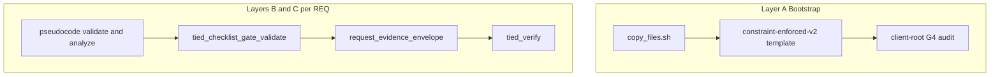

# New TIED client adherence — plan (post–fleet migration)

**Status:** **Build complete (2026-09-13)** — [REQ-TIED_NEW_CLIENT_ADHERENCE](../tied/requirements/REQ-TIED_NEW_CLIENT_ADHERENCE.yaml) **Implemented**; onboarding CLI + runbook shipped. WS-NC-1 (`copy_files.sh` bootstrap gate) remains **separate LEAP** per [methodology-detail-files-bootstrap-fix-plan.md](methodology-detail-files-bootstrap-fix-plan.md). Orchestrator [REQ-PSEUDOCODE_CONSTRAINT_V2_FLEET_MIGRATION](../tied/requirements/REQ-PSEUDOCODE_CONSTRAINT_V2_FLEET_MIGRATION.yaml) remains **closed**.

**TIED product REQ:** [REQ-TIED_NEW_CLIENT_ADHERENCE](../tied/requirements/REQ-TIED_NEW_CLIENT_ADHERENCE.yaml) · **CITDP:** [CITDP-REQ-TIED_NEW_CLIENT_ADHERENCE](../tied/citdp/CITDP-REQ-TIED_NEW_CLIENT_ADHERENCE.yaml) · **Tracker:** [`working/REQ-TIED_NEW_CLIENT_ADHERENCE/agent-req-implementation-checklist.yaml`](../working/REQ-TIED_NEW_CLIENT_ADHERENCE/agent-req-implementation-checklist.yaml)

### Artifact index (new-client adherence)

| Artifact | Path | Role |
|----------|------|------|
| Pre-implementation CITDP slice | [`working/REQ-TIED_NEW_CLIENT_ADHERENCE/NC-citdp-pre-implementation.v1.yaml`](../working/REQ-TIED_NEW_CLIENT_ADHERENCE/NC-citdp-pre-implementation.v1.yaml) | Gate input; `new_client_adherence_module` |
| Onboarding audit schema | [`working/REQ-TIED_NEW_CLIENT_ADHERENCE/tied-new-client-audit.v1.schema.json`](../working/REQ-TIED_NEW_CLIENT_ADHERENCE/tied-new-client-audit.v1.schema.json) | Report contract for build-plan CLI |
| Pre-implementation gate receipt | `working/REQ-TIED_NEW_CLIENT_ADHERENCE/gates/pre_implementation-2026-09-13T22-20-43-451Z.json` | `tied_checklist_gate_validate` evidence |
| IMPL onboarding pseudo-code | [`IMPL-TIED_NEW_CLIENT_ONBOARDING`](../tied/implementation-decisions/IMPL-TIED_NEW_CLIENT_ONBOARDING-pseudocode.md) | Layer B pass at refine |
| Per-request tracker | [`working/REQ-TIED_NEW_CLIENT_ADHERENCE/agent-req-implementation-checklist.yaml`](../working/REQ-TIED_NEW_CLIENT_ADHERENCE/agent-req-implementation-checklist.yaml) | `/build-plan` hook |
| Program status (prerequisite) | [`working/fleet-constraint-v2/program-status.v1.yaml`](../working/fleet-constraint-v2/program-status.v1.yaml) | Track B **18/18**; G4 maintenance complete |

**Traceability tokens:** [REQ-TIED_NEW_CLIENT_ADHERENCE](../tied/requirements/REQ-TIED_NEW_CLIENT_ADHERENCE.yaml) · [ARCH-TIED_NEW_CLIENT_ADHERENCE](../tied/architecture-decisions/ARCH-TIED_NEW_CLIENT_ADHERENCE.yaml) · [IMPL-TIED_NEW_CLIENT_ONBOARDING](../tied/implementation-decisions/IMPL-TIED_NEW_CLIENT_ONBOARDING.yaml)

**Purpose:** After **fleet migration** and **G4 maintenance**, define how to **design, implement, and assert** that **new** TIED clients (and new product REQs within them) adhere to strict **pseudo-code**, **constraint**, and **evidence** standards—without another fleet NB tranche.

**Canonical fleet context (complete):** [`pseudocode-constraint-v2-fleet-program.md`](pseudocode-constraint-v2-fleet-program.md) · [`pseudocode-constraint-v2-fleet-completion-plan.md`](pseudocode-constraint-v2-fleet-completion-plan.md) · G4 ops: [`pseudocode-constraint-v2-fleet-g4-maintenance-runbook.md`](pseudocode-constraint-v2-fleet-g4-maintenance-runbook.md) · [REQ-PSEUDOCODE_FLEET_G4_MAINTENANCE](../tied/requirements/REQ-PSEUDOCODE_FLEET_G4_MAINTENANCE.yaml)

**Hygiene / grammar context:** [`pseudocode-grammar-v2-and-hygiene-plan.md`](pseudocode-grammar-v2-and-hygiene-plan.md) · bootstrap fix: [`methodology-detail-files-bootstrap-fix-plan.md`](methodology-detail-files-bootstrap-fix-plan.md)

---

## 1. Refine disposition (2026-09-13)

### 1.1 Prerequisites (satisfied)

| Claim | Proof |
|-------|-------|
| Track B exit **18/18** not_enrolled **fleet-migrated-client** | [`program-status.v1.yaml`](../working/fleet-constraint-v2/program-status.v1.yaml) `not_enrolled_fleet_migrated_count: 18` |
| G4 maintenance REQ implemented | [REQ-PSEUDOCODE_FLEET_G4_MAINTENANCE](../tied/requirements/REQ-PSEUDOCODE_FLEET_G4_MAINTENANCE.yaml) · `g4_maintenance_complete: true` |
| Orchestrator REQ closed | `orchestrator_req_closed: true` — no re-verify |

### 1.2 Open decisions (OD-NC-* resolved — sponsor default-proceed)

| ID | Decision | Resolved value |
|----|----------|----------------|
| **OD-NC-1** | Product REQ token name | **REQ-TIED_NEW_CLIENT_ADHERENCE** |
| **OD-NC-2** | `tied_validate_consistency` in client audit | **Off by default** (`--with-consistency` opt-in) |
| **OD-NC-3** | Disposable-client smoke in G4 maintenance | **Separate script**; not in maintenance v1 |
| **OD-NC-4** | Enforcement surface | **Local runbook** (no client GitHub template v1) |
| **OD-NC-5** | IMPL token | **IMPL-TIED_NEW_CLIENT_ONBOARDING** (distinct from fleet G3 harness) |
| **OD-NC-6** | Integrated inquiry on client FEAT work | **Advisory** (align P5-G); sponsor may tighten per REQ |

**Profile depth:** `minimal` for refine pass. **Gate policy:** `advisory` on stdd pre-RED until `/build-plan` scopes RED tests.

### 1.3 Sponsor terms (RESOLVE)

| Term | Meaning |
|------|---------|
| **onboarding-adherent** | Layer A bootstrap proof after `copy_files.sh` + client-root G4 audit receipt — **not** fleet-migrated-client |
| **client-root G4 audit** | `runGrammarV2DefaultAudit(clientRoot, { gateStage: 'G4' })` wrapped by onboarding CLI (build-plan) |
| **new-client adherence program** | This plan + REQ-TIED_NEW_CLIENT_ADHERENCE workstreams WS-NC-1..6 |

---

## 2. Problem statement

| Fleet program (done) | New-client program (this plan) |
|----------------------|--------------------------------|
| Retrofit **registered inventory** to honest **fleet-migrated-client** + G3 receipts | **Prevent drift at birth** for repos created after policy lock-in |
| G4 maintenance proves **stdd template/reference** + **five enrolled** repos | Prove **each new client root** and **each behavior-changing REQ** meets gates |
| Batch sponsor acceptance (NB-*) | Per-client bootstrap + per-REQ checklist/envelope |

**Core falsification to avoid:** Treating **G4 maintenance green**, **grammar v2 header**, or **FEAT envelope validate** as proof that an arbitrary client is **fleet-migrated** or that all IMPL sidecars are **constraint-enforced-v2**.

---

## 3. Strict standards — three layers

| Layer | Question | Primary enforcement |
|-------|----------|---------------------|
| **A — Bootstrap** | Does a fresh client inherit v2 grammar and constraint-grade bootstrap IMPL stubs from templates? | `copy_files.sh`, [REQ-PSEUDOCODE_GRAMMAR_V2_DEFAULT](../tied/requirements/REQ-PSEUDOCODE_GRAMMAR_V2_DEFAULT.yaml), G4 `header_and_contract_defaults_for_new_clients` audit |
| **B — Pseudo-code & constraints** | Do IMPL sidecars pass structural and constraint analysis on changed tokens? | [REQ-PSEUDOCODE_CONSTRAINT_LANGUAGE](../tied/requirements/REQ-PSEUDOCODE_CONSTRAINT_LANGUAGE.yaml), `pseudocode_validate` / `pseudocode_analyze`, [PROC-PSEUDOCODE_VALIDATION](../tied/docs/pseudocode-writing-and-validation.md) |
| **C — Evidence & process gates** | Can a REQ reach verification/close_out without checklist, inquiry, and envelope proof? | [REQ-TIED_CHECKLIST_GATE_ENFORCEMENT](../tied/requirements/REQ-TIED_CHECKLIST_GATE_ENFORCEMENT.yaml), [REQ-REQUEST_EVIDENCE_ENVELOPE](../tied/requirements/REQ-REQUEST_EVIDENCE_ENVELOPE.yaml), [P5-G FEAT envelope policy](../working/fleet-constraint-v2/p5-g-feat-spawned-req-envelope-policy.v1.md) |



**Gate stage reference:** [gate-promotion-stages.v1.yaml](../working/fleet-constraint-v2/gate-promotion-stages.v1.yaml) — G4 scope includes **new-client bootstrap** and **continuous governance**; G3 remains the path for **inventory migration waves** when a client is added to the fleet manifest.

---

## 4. Design principles

1. **Do not reopen** closed [REQ-PSEUDOCODE_CONSTRAINT_V2_FLEET_MIGRATION](../tied/requirements/REQ-PSEUDOCODE_CONSTRAINT_V2_FLEET_MIGRATION.yaml) or NB batch REQs; add a **new product REQ** (proposed name below) for onboarding/adherence.
2. **Separate surfaces:** stdd **G4 maintenance** (reference template + enrolled regression) vs **client-root audit** vs **per-REQ** checklist/envelope (Layer C).
3. **Depth policy:** FEAT-spawned / behavior-changing work in stdd → **integrated** envelope per P5-G; client **REQ-PSEUDOCODE_MIGRATION** → minimal depth + G3 when joining fleet inventory; bootstrap-only → Layer A fail-closed gates in `copy_files.sh`.
4. **Local runbook default:** Mirror G4 maintenance sponsor choice—**no GitHub Actions required** in v1 unless OD-NC-* amends.
5. **Inventory honesty:** Adding a row to [client-inventory-manifest.v1.yaml](../working/fleet-constraint-v2/client-inventory-manifest.v1.yaml) does not imply adherence; **G3 receipts** still define **fleet-migrated-client** for tracked clones.

---

## 5. TIED stack (refine gate — Draft on disk)

| Token | Role |
|-------|------|
| **REQ-TIED_NEW_CLIENT_ADHERENCE** | Product REQ: bootstrap verification + client-root audit + evidence layout contract |
| **ARCH-TIED_NEW_CLIENT_ADHERENCE** | Proof boundaries vs fleet/G4/FEAT envelope; enforcement surfaces |
| **IMPL-TIED_NEW_CLIENT_ONBOARDING** | CLI/script: audit client root, optional consistency, onboarding report JSON |

**Depends on (existing):** REQ-PSEUDOCODE_GRAMMAR_V2_DEFAULT · REQ-PSEUDOCODE_MIGRATION_TOOLING · REQ-TIED_CHECKLIST_GATE_ENFORCEMENT · REQ-REQUEST_EVIDENCE_ENVELOPE · ARCH-PSEUDOCODE_FLEET_MIGRATION_GOVERNANCE (read-only policy pointers)

**Satisfaction criteria (in REQ detail — SC-NC-001..005):**

| ID | Criterion (draft) |
|----|-------------------|
| SC-NC-001 | Post–`copy_files.sh`, client-root G4 audit exits 0 or emits actionable report |
| SC-NC-002 | Onboarding report schema persisted under `working/` or client `working/` (refine path) |
| SC-NC-003 | P5-G checklist template + envelope validator referenced for FEAT-spawned REQs in stdd |
| SC-NC-004 | `copy_files.sh` fail-closed verification for inherited methodology detail paths (bootstrap fix plan) |
| SC-NC-005 | Falsification documented: onboarding pass ≠ fleet-migrated-client without G3 |

---

## 6. Workstreams (implement order)

### WS-NC-1 — Methodology bootstrap hardening (stdd)

**Source:** [`methodology-detail-files-bootstrap-fix-plan.md`](methodology-detail-files-bootstrap-fix-plan.md)

| Deliverable | Outcome |
|-------------|---------|
| Template index/detail alignment | REQ-TIED_SETUP, REQ-MODULE_VALIDATION, etc. resolvable after copy |
| `copy_files.sh` verification gate | Fail closed after copy; preserve existing fidelity/adversarial/feature gates |
| Composition test | Disposable client smoke: copy + resolve + reject traversal |

**Blocks:** trustworthy Layer A for every new client.

---

### WS-NC-2 — Client-root onboarding audit (CLI)

| Deliverable | Outcome |
|-------------|---------|
| `scripts/run-tied-new-client-audit.mjs` (name TBD) | Wraps `runGrammarV2DefaultAudit(clientRoot, { gateStage: 'G4' })` + optional flags |
| Report schema | e.g. `tied-new-client-audit.v1.json` |
| Unit tests | Fixture temp dirs; pass/fail bootstrap dimensions |
| Runbook section | When to run: after `copy_files.sh`, before first product REQ |

**Reuses:** [`scripts/lib/audit-grammar-v2-default.mjs`](scripts/lib/audit-grammar-v2-default.mjs), [`scripts/lib/fleet-g4-ci-checks.mjs`](scripts/lib/fleet-g4-ci-checks.mjs) patterns.

**Optional flag (OD-NC-2):** `--with-consistency` → `tied_validate_consistency` (may fail on large tooling clients; default off).

---

### WS-NC-3 — FEAT spawn + envelope policy wiring (stdd)

**Source:** [P5-G policy](../working/fleet-constraint-v2/p5-g-feat-spawned-req-envelope-policy.v1.md)

| Deliverable | Outcome |
|-------------|---------|
| Spawn hooks | `feature_create` / plan-new-feature always copy Phase 5 checklist template |
| Validator in cadence | Already in G4 maintenance test bundle; document as mandatory for FEAT REQs |
| Client copy pattern | Same `working/{REQ}/` tree documented for clients after `copy_files.sh` |

**Assert:** `node scripts/validate-feat-spawned-envelope-policy.mjs --checklist working/{REQ}/...`

---

### WS-NC-4 — Verify consumes gate result (Layer C)

| Deliverable | Outcome |
|-------------|---------|
| Documented sequence | `tied_checklist_gate_validate` (verification, close_out) before `tied_verify --update` |
| MCP/tooling gap list | Any code paths that promote REQ status without gate receipt → fix or waiver |
| Criterion | Align with REQ-TIED_CHECKLIST_GATE_ENFORCEMENT **verify-consumes-gate-result** |

**Reference:** P5-G gate sequence (pre_implementation → verification → close_out → envelope validate).

---

### WS-NC-5 — Pre-cohort / disposable client regression

**Source:** [`working/PRE-COHORT-CLIENT-TEST/`](working/PRE-COHORT-CLIENT-TEST/) themes

| Deliverable | Outcome |
|-------------|---------|
| Release smoke | One disposable client per methodology pin: copy_files + client audit |
| Tie to G4 maintenance | Optional dimension or separate script invoked from maintenance `--full` (OD-NC-3) |

---

### WS-NC-6 — Fleet inventory policy (when a *new* clone is registered)

| Deliverable | Outcome |
|-------------|---------|
| Manifest playbook | New row → G0 bootstrap audit first; schedule G3 wave only via sponsor REQ |
| Vocab RECORD | Distinguish **onboarding-adherent** vs **fleet-migrated-client** |

**Non-goal:** Automatic NB-* tranche for every new repo.

---

## 7. Assert matrix (operator-facing)

| Claim | Valid proof | Does **not** prove |
|-------|-------------|-------------------|
| Bootstrap meets v2 + constraint floor | Client-root G4 audit OK; `copy_files.sh` exit 0 + WS-NC-1 gate | All IMPLs fleet-migrated |
| Pseudo-code contract | `pseudocode_validate` + `pseudocode_analyze` on changed IMPL | REQ close_out alone |
| Process complete | Gate receipts under `working/{REQ}/gates/`; four inquiry artifacts when integrated | G4 `last-run.v1.json` |
| Envelope integrity | `request_evidence_envelope_validate`, `fail_on_error_gaps: true` at verification & close_out | Track B manifest row |
| REQ status | `tied_verify` with update after tests | Manual YAML status edits |
| stdd template healthy | `node scripts/run-fleet-g4-maintenance.mjs` | Specific external client compliance |

---

## 8. Open decisions (locked at refine)

See **§1.2** — all OD-NC-* resolved via sponsor default-proceed. Reopen only for costly/client-wide CI mandates (OD-NC-4) or integrated inquiry promotion (OD-NC-6).

---

## 9. Refine gate deliverables (`/refine-plan`) — complete

| # | Artifact | Status |
|---|----------|--------|
| R-1 | Plan amended with OD-NC-* decisions | **Done** (§1.2) |
| R-2 | REQ/ARCH/IMPL Draft + CITDP slice | **Done** |
| R-3 | IMPL sidecar; `pseudocode_validate` ok | **Done** |
| R-4 | Tracker under `working/REQ-TIED_NEW_CLIENT_ADHERENCE/` | **Done** |
| R-5 | Vocab RECORD | **Done** |
| R-6 | pre_implementation gate receipt | **Done** |
| R-7 | `tied-new-client-audit.v1.schema.json` | **Done** |

**Prerequisite:** [REQ-PSEUDOCODE_FLEET_G4_MAINTENANCE](../tied/requirements/REQ-PSEUDOCODE_FLEET_G4_MAINTENANCE.yaml) **Implemented**; fleet Track B **18/18** per [`program-status.v1.yaml`](../working/fleet-constraint-v2/program-status.v1.yaml).

---

## 10. Build gate deliverables (`/build-plan`) — complete

| # | Step | Proof | Status |
|---|------|-------|--------|
| B-1 | Unit tests for onboarding audit + report writer | `scripts/tied-new-client-audit.test.mjs` | **Done** |
| B-2 | CLI + lib | `scripts/run-tied-new-client-audit.mjs`, `scripts/lib/tied-new-client-audit.mjs` | **Done** |
| B-3 | WS-NC-1 bootstrap gate in `copy_files.sh` | Deferred — separate methodology LEAP | **Deferred** |
| B-4 | Runbook | [pseudocode-new-client-tied-adherence-runbook.md](pseudocode-new-client-tied-adherence-runbook.md) | **Done** |
| B-5 | Spawn recommendation text in feature orchestration | Optional; P5-G docs + G4 test bundle | **Deferred** |
| B-6 | `tied_validate_consistency`, `tied_verify` | REQ Implemented, IMPL Active | **Done** |
| B-7 | verification + close_out gates | `working/REQ-TIED_NEW_CLIENT_ADHERENCE/gates/` | **Done** |

**Test strategy (draft):** Unit tests for pure helpers; composition test with temp client tree; no UI E2E.

---

## 11. Non-goals

- Reopen fleet orchestrator REQ or NB-5 tranche
- Full-manifest G4 regression (all 18 not_enrolled rows)
- Restore **`tied-win-diff`** full IMPL essence
- v1 parser removal (OD-P5-1) unless separately sponsored
- Mandatory GitHub Actions on client repos (v1)

---

## 12. Related artifacts (existing)

| Artifact | Path |
|----------|------|
| G4 maintenance | [`scripts/run-fleet-g4-maintenance.mjs`](../scripts/run-fleet-g4-maintenance.mjs) |
| Grammar v2 audit | [`scripts/lib/audit-grammar-v2-default.mjs`](../scripts/lib/audit-grammar-v2-default.mjs) |
| FEAT envelope validator | [`scripts/lib/validate-feat-spawned-envelope-policy.mjs`](../scripts/lib/validate-feat-spawned-envelope-policy.mjs) |
| Checklist template (FEAT) | [`templates/agent-req-checklist-feat-spawned-phase5.v1.yaml`](../templates/agent-req-checklist-feat-spawned-phase5.v1.yaml) |
| Agent checklist proc | [`tied/docs/agent-req-implementation-checklist.md`](../tied/docs/agent-req-implementation-checklist.md) |
| Integrated activation plan | [`integrated-activation-enforcement-operator-friction-plan.md`](integrated-activation-enforcement-operator-friction-plan.md) |
| Client development index | [`tied/docs/client-development-index.md`](../tied/docs/client-development-index.md) |

---

## 13. Recommended handoff (build session)

```text
/build-plan @docs/pseudocode-new-client-tied-adherence-plan.md
```

**Working folder:** `working/REQ-TIED_NEW_CLIENT_ADHERENCE/`

---

## 14. Traceability

| Layer | Tokens |
|-------|--------|
| REQ | REQ-TIED_NEW_CLIENT_ADHERENCE |
| ARCH | ARCH-TIED_NEW_CLIENT_ADHERENCE |
| IMPL | IMPL-TIED_NEW_CLIENT_ONBOARDING |
| Process | PROC-AGENT_REQ_CHECKLIST · PROC-PSEUDOCODE_VALIDATION · PROC-VOCABULARY_INDEX |

Update [`pseudocode-constraint-v2-fleet-program.md`](pseudocode-constraint-v2-fleet-program.md) **after build-plan** with a one-line pointer to this plan as the post-fleet **new client** program (LEAP in same work item as B-4).
