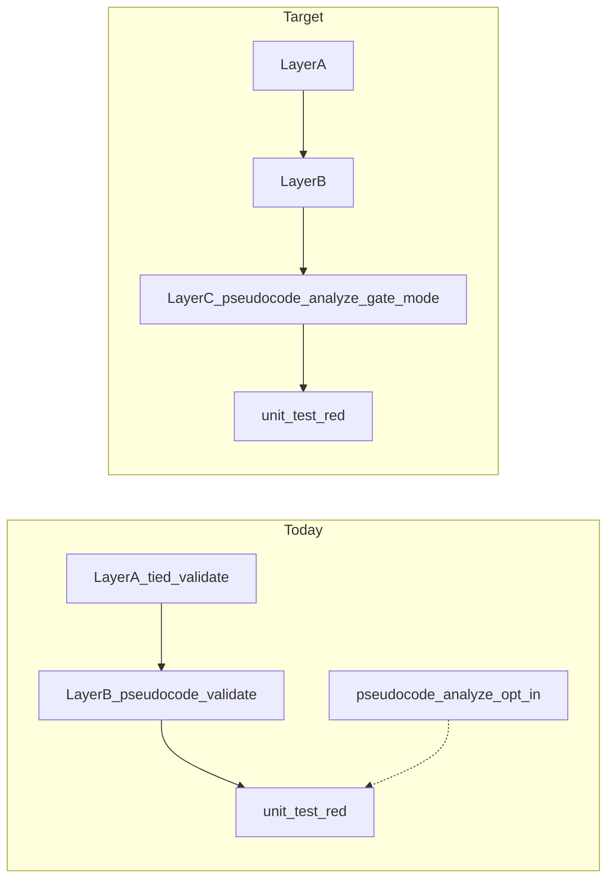

# Plan: Pseudo-code static analysis documentation and mandatory pre-RED gate

**Status:** Refined plan (2026-09-08; `refine-plan` pass 2)  
**Change ID:** `DOC-PSA-PSEUDOCODE-FULL-UPDATE`  
**Priority:** P1  
**Owner:** TIED methodology repository (`stdd`)  
**Traceability:** [REQ-PSEUDOCODE_STATIC_ANALYSIS](tied/requirements/REQ-PSEUDOCODE_STATIC_ANALYSIS.yaml), [REQ-PSEUDOCODE_PARSER_UNIFICATION](tied/requirements/REQ-PSEUDOCODE_PARSER_UNIFICATION.yaml), [ARCH-PSEUDOCODE_ANALYSIS_PIPELINE](tied/architecture-decisions/ARCH-PSEUDOCODE_ANALYSIS_PIPELINE.yaml), [IMPL-PSEUDOCODE_ANALYSIS_ENGINE](tied/implementation-decisions/IMPL-PSEUDOCODE_ANALYSIS_ENGINE.yaml)

**Scope boundary:** The original PSA engine is already implemented and has a completed
`REQ-PSEUDOCODE_STATIC_ANALYSIS` CITDP/Tracker. This plan is a follow-up change to
promote PSA from opt-in documentation to a mandatory pre-RED gate; the existing
close-out evidence is baseline context, not evidence for this follow-up.

**Canonical terminology:** **Layer A** = `tied_validate_consistency` (TIED traceability). **Layer B** = `pseudocode_validate` + [pseudocode-validation-checklist.yaml](tied/docs/pseudocode-validation-checklist.yaml). **Layer C** = `pseudocode_analyze` with `gate_mode: true` + [pseudocode-static-analysis-checklist.yaml](tied/docs/pseudocode-static-analysis-checklist.yaml) (new). **Gate path** = mandatory Layer C at `gate-pseudocode-validation` for changed in-scope Active project IMPLs. **Profile path** = optional `invoke_pseudocode_analyze` on `evidence_chain_profile_generate` (parse-only live validator today).

---

## 0. Refine outcomes

This pass resolves ambiguities and makes the plan implementation-ready. **No code, TIED YAML, or sidecar remediation in this pass.**

| Preferred term | Canonical meaning |
|---|---|
| **Layer C static analysis gate** | Mandatory `pseudocode_analyze` with `gate_mode: true` at `gate-pseudocode-validation`, after Layer A + Layer B, before `unit-test-red` |
| **gate_mode** | Caller flag on `pseudocode_analyze` / `analyzeEssencePseudocode`; when `true`, report `ok === false` on any error-severity diagnostic, parse/input fatal, or `truncated === true` (unless documented checklist waiver) |
| **pre-psa-grammar** | N/A rationale for **unchanged legacy Active procedure blocks** (parallel to Layer B `pre-contract-grammar`); does not exempt whole sidecar files when any block in scope changed |
| **Changed in-scope IMPL** | IMPL token listed in the per-request Tracker IMPL inventory (from `impact-discovery` / `persist-implementation-records` scope), not git diff alone |
| **Gate evidence artifact** | `working/{REQ-TOKEN}/pseudocode-analysis/{IMPL-TOKEN}.v1.json` with `ok: true`, `gate_mode_applied: true`, and stable `input_identity.hash` |
| **Profile PSA row** | Evidence-chain structural row `validator: "pseudocode_analyze"` from live validators — **parse pass only today**, distinct from mandatory gate path |

**Resolved decisions:**

1. **`gate_mode` code MUST ship before checklist mandates Layer C.** Reorder execution: Phase 4 (engine/MCP) before Phase 3 (checklist YAML/MD wiring). Enabling mandatory Layer C in the checklist before `gate_mode` would produce false passes (`ok: true` with `UNRESOLVED_CALL` errors).
2. **`pre-psa-grammar` is a block-level review disposition, but the current analyzer gate is file-scoped.** Therefore a changed sidecar cannot pass by hiding a failing legacy block behind a block-level N/A: if any block in a sidecar is changed, the complete sidecar submitted to Layer C must parse and satisfy gate-mode diagnostics. Block-level N/A applies to untouched sidecars/blocks that are not submitted by the current gate. Deterministic block extraction would be a separate follow-on, not an implicit checklist behavior.
3. **Changed IMPL detection uses Tracker IMPL inventory**, populated at `impact-discovery` and finalized at `persist-implementation-records`. Git diff is a supplementary audit signal, not the gate authority.
4. **Template `PROCEDURE:` → remediate to `procedure NAME:`** (parser form). The list-item `PROCEDURE: UPPER_SNAKE` pattern in [templates/impl-essence-pseudocode-template.md](templates/impl-essence-pseudocode-template.md) is **not** recognized by `PROCEDURE_HEADING_PATTERN`; authors must use `procedure UPPER_SNAKE:` (see fixture [minimal-branches.pseudocode.md](mcp-server/src/analysis/fixtures/pseudocode-analysis/minimal-branches.pseudocode.md)).
5. **`abstract` pass is recommended-only at gate** (included in default pass list). `CONTRADICTORY_PATH` fails `ok` only when `strict_paths: true` today; under `gate_mode`, only error-severity diagnostics fail `ok` — `abstract` warnings stay non-blocking unless promoted to error. Gate checklist documents this; do not require `strict_paths` at pre-RED.
6. **Truncation under `gate_mode` is hard fail** unless an explicit checklist waiver on `gate-pseudocode-validation` documents rationale (same waiver contract as other gates). `pre-psa-grammar` is N/A disposition, not waiver.
7. **Full sidecar corpus remediation is out of close-out scope.** Tier 1 fixes apply to **changed in-scope** IMPLs and fixture/template representatives; untouched legacy Active blocks use `pre-psa-grammar` per block until next edit. Bootstrap waiver documented in remediation log — not a gate bypass for changed IMPLs.
8. **`tied_checklist_gate_validate` needs no schema change** for Layer C. It validates step disposition + non-empty `evidence_refs` for `completed` steps; agents attach report paths. Optional follow-up: machine-validate report JSON `ok` (not required for this change).
9. **Evidence-chain live validator path stays parse-only** unless a separate follow-on extends `pseudocodeAnalyze` in [live-structural-validators.ts](mcp-server/src/fidelity-research/live-structural-validators.ts). Mandatory gate uses full default pass list via MCP/`tied-cli.sh` — do not conflate the two proof boundaries.
10. **Extend `[PROC-PSEUDOCODE_VALIDATION]`** in [processes.md](tied/docs/processes.md); **no new PROC token**.
11. **CITDP persistence deferred** until `build-plan` execution; reference `DOC-PSA-PSEUDOCODE-FULL-UPDATE` in PR and Tracker. Sketch retained in § CITDP below.
12. **`depth_tier: integrated`** — mandatory pre_implementation gate wiring, checklist enforcement, engine contract change, and doc/vocab pass justify integrated tracking (not minimal).

**Vocabulary RECORD/VALIDATE:** Terms above are resolved against the preloaded
`pseudocode-and-citdp`, `quality-assurance`, and `fidelity-research` glossaries.
Pass 1 already RECORDed Layer C terms (`Layer C static analysis gate`, `gate_mode`,
`pre-psa-grammar`, `file-scoped analysis input`) in
[pseudocode-and-citdp.md](tied/vocab/pseudocode-and-citdp.md) plus routing row 5 and
[domain-references.md](tied/vocab/domain-references.md) cross-topic notes. Phase 0
build still RECORDs grammar-construct rows (`SWITCH`/`CASE`, `CALL UPPER_SNAKE(...)`,
etc.) when [pseudocode-grammar.v1.md](tied/docs/pseudocode-grammar.v1.md) lands.
VALIDATE (`ruby scripts/validate_vocab_index.rb`) is a build/close-out responsibility.

**TIED status (verified 2026-09-08 pass 2):**

| Token | Index `status` | Detail `status` | Notes |
|-------|----------------|-----------------|-------|
| `REQ-PSEUDOCODE_STATIC_ANALYSIS` | **Implemented** | **Planned** | Index reflects shipped engine; detail still Planned until Phase 5 adds mandatory-gate criterion and LEAP reconciles both |
| `ARCH-PSEUDOCODE_ANALYSIS_PIPELINE` | **Active** | **Planned** | Same index/detail drift; Phase 5 promotes detail and adds gate-integration note |
| `IMPL-PSEUDOCODE_ANALYSIS_ENGINE` | **Active** | **Active** | Sidecar already uses `procedure NAME:` form |

**Sidecar inventory baseline (re-verified 2026-09-08 pass 2):** **78** project
sidecars; **8** files with list-style `- PROCEDURE:` headings; **50** with
`procedure NAME:` headings. Build execution MUST re-run the inventory and derive
the changed-IMPL set from the authoritative Tracker IMPL inventory; these counts
are planning context, not gate evidence.

---

## Problem statement

Shared pseudocode docs describe **two layers** (A + B). Static analysis (`pseudocode_analyze`, grammar v1) shipped separately but authors lack grammar spec, process wiring at `gate-pseudocode-validation`, aligned vocabulary, and **gate-safe `ok` semantics**.

| Layer | Observed | Expected |
|-------|----------|----------|
| Docs | "Two validation layers"; PSA opt-in | Three complementary layers A / B / C; mandatory Layer C at pre-RED for changed Active IMPLs |
| `analyzeEssencePseudocode` `ok` | `true` when only `UNRESOLVED_CALL` / other errors present (unless `strict_paths` + `CONTRADICTORY_PATH`) | Under `gate_mode: true`, any error-severity diagnostic → `ok: false` |
| `gate-pseudocode-validation` | Layer B only (`sub-pseudocode-validation-pass`) | Layer B then Layer C (`sub-pseudocode-static-analysis-pass`) |
| Template | `PROCEDURE: UPPER_SNAKE` list item | `procedure UPPER_SNAKE:` heading (parser-recognized) |



---

## Verified current code (2026-09-08)

### Analyzer `ok` logic — ignores most error diagnostics

`mcp-server/src/analysis/pseudocode-analyzer.ts` lines 162–165:

```typescript
const hasError =
  input.strict_paths === true &&
  capped.diagnostics.some((d) => d.severity === "error" && d.code === "CONTRADICTORY_PATH");
const ok = !hasError && !capped.diagnostics.some((d) => d.severity === "error" && d.code === "INPUT_TOO_LARGE");
```

`UNRESOLVED_CALL` is emitted with `severity: "error"` ([pseudocode-symbols.ts](mcp-server/src/analysis/pseudocode-symbols.ts) ~127–134) but does **not** affect `ok` unless `strict_paths` + `CONTRADICTORY_PATH`. No orchestrator test asserts gate failure on `UNRESOLVED_CALL` today.

### MCP handler — no `gate_mode` parameter

`mcp-server/src/tools/index.ts` lines 2131–2224 — `pseudocode_analyze` schema includes `strict_paths`, `include_structural_compat`, but **not** `gate_mode`. Handler forwards args to `analyzeEssencePseudocode` without gate semantics.

Default passes when `analyses` omitted: all passes including `abstract` ([pseudocode-analyze-report.ts](mcp-server/src/analysis/pseudocode-analyze-report.ts) `normalizePasses` → `ALL_ANALYSIS_PASSES`).

### Evidence-chain live validator — parse-only, inherits loose `ok`

`mcp-server/src/fidelity-research/live-structural-validators.ts` lines 92–109:

```typescript
pseudocodeAnalyze: (token: string) => {
  if (!token.startsWith("IMPL-")) return { ok: true };
  // ...
  const report = analyzeEssencePseudocode({
    token,
    pseudocode,
    known_tokens: knownTokens,
    analyses: ["parse"],
  });
  return { ok: "schema_version" in report && report.ok === true };
},
```

Structural rows mapped in [structural-analysis.ts](mcp-server/src/fidelity-research/structural-analysis.ts) lines 61–68. Opt-in via `invoke_pseudocode_analyze: true` on `evidence_chain_profile_generate` ([index.ts](mcp-server/src/tools/index.ts) ~2034–2086).

### Checklist gate — Layer B only; no PSA evidence schema

`gate-pseudocode-validation` calls `sub-pseudocode-validation-pass` only ([agent-req-implementation-checklist.yaml](tied/docs/agent-req-implementation-checklist.yaml) ~885–901). No `sub-pseudocode-static-analysis-pass` stub exists yet.

`mcp-server/src/checklist-validator.ts` — `INTEGRATED_REQUIRED_SLUGS.pre_implementation` includes `gate-pseudocode-validation` (line 51). `validateTracker` requires `completed` steps to have non-empty `evidence_refs` (lines 305–306); **does not** parse pseudocode report contents.

### Parser procedure heading — not list-style `PROCEDURE:`

`mcp-server/src/analysis/pseudocode-shared.ts` lines 9–10:

```typescript
export const PROCEDURE_HEADING_PATTERN =
  /^\s*(procedure|function|block)\s+([A-Z][A-Z0-9_]*)\b/i;
```

Template line 45 uses `- PROCEDURE: UPPER_SNAKE_NAME` — **unsupported** for CFG/call-graph analysis.

---

## Scope and acceptance criteria

### In scope

- New author docs: [tied/docs/pseudocode-grammar.v1.md](tied/docs/pseudocode-grammar.v1.md), [tied/docs/pseudocode-static-analysis-checklist.yaml](tied/docs/pseudocode-static-analysis-checklist.yaml)
- Shared doc/vocab/checklist updates (Phase 0–2, 3 prose/YAML)
- **`gate_mode` on analyzer + MCP** with TDD tests **before** checklist enablement
- Extend `[PROC-PSEUDOCODE_VALIDATION]` in processes.md and writing guide (three layers)
- TIED LEAP: REQ/ARCH status + satisfaction criterion for mandatory gate (via MCP)
- Tier 1 sidecar remediation for **changed in-scope** IMPLs; template/fixture alignment
- Tracker copy at `working/DOC-PSA-PSEUDOCODE-FULL-UPDATE/tracker.yaml`
- Parity test extension for new checklist sub-stub

### Out of scope

- Changing Layer B `pseudocode_validate` behavior or schema
- Extending evidence-chain live validator to full Layer C pass list (document divergence only)
- Machine validation of PSA JSON inside `tied_checklist_gate_validate` (optional follow-on)
- Full remediation of all 78 legacy sidecars in one pass
- New PROC token (extend existing)
- Methodology read-only YAML under `tied/methodology/`
- Client-repo CITDP copies (methodology repo only)

### Done when

1. §0 ambiguities reflected in docs; no guide describes "two layers only" without Layer C
2. `gate_mode: true` fails `ok` on error diagnostics and `truncated` (proven by unit + MCP tests)
3. Phase 4 merged **before** Phase 3 checklist mandates Layer C
4. `gate-pseudocode-validation` invokes `sub-pseudocode-static-analysis-pass` for changed in-scope Active IMPLs
5. Grammar guide lists every construct parser accepts in v1; template uses `procedure NAME:`
6. `tied_validate_consistency` passes after TIED LEAP
7. `cd mcp-server && npm test` passes including checklist parity markers
8. Remediation log documents Tier 1 fixes and the file-scoped rule: changed
   sidecars cannot rely on `pre-psa-grammar` for an unparseable block; untouched
   sidecars may retain the documented N/A disposition

---

## CITDP sketch (persist at build time)

**Recommendation:** Write full CITDP to `working/DOC-PSA-PSEUDOCODE-FULL-UPDATE/citdp.yaml` during `build-plan`; defer index persistence until implementation starts.

### change_definition

| Aspect | Current | Desired |
|--------|---------|---------|
| Validation layers | A + B documented; C opt-in | A + B + **mandatory C** at pre-RED for changed Active IMPLs |
| Author grammar | Scattered in writing guide; no v1 spec | Canonical [pseudocode-grammar.v1.md](tied/docs/pseudocode-grammar.v1.md) |
| Gate checklist | Layer B YAML only | Layer C YAML + sub-stub wired to agent checklist |
| `pseudocode_analyze` `ok` | Ignores most errors | `gate_mode: true` → strict pass/fail for checklist |
| REQ status | Planned | Active with mandatory-gate satisfaction criterion |

### impact_analysis

| Module / surface | Impact |
|------------------|--------|
| `mcp-server/src/analysis/pseudocode-analyzer.ts` | `gate_mode`, `gate_mode_applied`, ok derivation |
| `mcp-server/src/tools/index.ts` | MCP schema + handler |
| `tied/docs/*` pseudocode + processes + checklist YAML/MD | Three-layer narrative, gate tasks |
| `tied/vocab/*` | Layer C terms, routing keywords |
| `templates/impl-essence-pseudocode-template.md` | Procedure heading remediation |
| `tied/requirements/`, `architecture-decisions/` | Status + criteria via MCP |
| Project sidecars (subset) | Tier 1 grammar fixes for changed IMPLs |

### risk_analysis

| Risk | Proof boundary | Mitigation |
|------|----------------|------------|
| False pass before `gate_mode` ships | Unit test: `UNRESOLVED_CALL` + `ok: true` today | **Phase 4 before Phase 3** |
| Authors confuse B vs C | Doc tables + separate checklist files | Phase 2 three-layer table |
| 78 sidecars block all work | Gate applies to **changed** IMPLs only and submits changed sidecars as whole files | `pre-psa-grammar` for untouched blocks/files; Tier 1 scoped remediation |
| Truncation on large sidecars | Report `truncated: true` | Split procedures; explicit waiver only |
| Profile PSA row misread as gate | Live validator parse-only | Document in evidence-chain-profile.md |
| Template heading drift | Parser scan | Template + grammar guide alignment |

### test_strategy (TDD order)

1. **RED:** `pseudocode-analyzer.test.ts` — `UNRESOLVED_CALL` fails `ok` when `gate_mode: true`; `truncated` fails `ok`; warnings alone pass; non-gate behavior remains backward-compatible
2. **RED:** `pseudocode-analyze-mcp.test.ts` — `gate_mode` propagated; `gate_mode_applied: true` in report
3. **GREEN:** Implement analyzer + MCP + report field
4. **RED:** Checklist parity markers for `sub-pseudocode-static-analysis-pass`
5. **GREEN:** Checklist YAML/MD Phase 3 (after engine GREEN)
6. Regression: `pseudocode_validate` golden tests unchanged; Layer B checklist unchanged
7. Gate fixture: `tied_checklist_gate_validate` with tracker listing Layer C `evidence_refs`
8. Spot-check: full pre-RED sequence on one Tracker copy

### depth_tier

**`integrated`** — checklist gate enforcement, mandatory pre_implementation step,
engine contract change, vocab/doc sweep, and scoped remediation. The build must
provide the independent identity-bound adversarial-inquiry activation evidence
required for an integrated gate; the compact PSA gate fixture below is not by
itself proof that an integrated gate is allowed.

---

## Implementation phase order

**Critical:** Phase numbers below reflect **execution order**. Phase 4 (engine) runs **before** Phase 3 (checklist mandate).

| Order | Phase | ID | Deliverable |
|-------|-------|-----|-------------|
| 0 | Bootstrap + vocab | phase0-vocab | routing, pseudocode-and-citdp, domain-references |
| 1 | Grammar guide | phase1-grammar-doc | `pseudocode-grammar.v1.md` |
| 2 | Shared docs | phase2-shared-docs | writing guide, format, index, processes, migration/QA/MCP, template |
| **4** | **Engine `gate_mode` (TDD)** | **phase4-gate-mode** | **analyzer + MCP + tests — MUST ship before row 3** |
| 3 | Layer C checklist + gate wiring | phase3-checklist-gate | static-analysis checklist YAML; agent checklist; sub-stub |
| 5 | TIED LEAP | phase5-tied-leap | REQ/ARCH/IMPL via MCP |
| 6 | Scoped remediation | phase6-remediation | Tier 1 changed IMPLs; template; remediation log |
| 7 | Verify + close-out | phase7-verify | test suite, vocab validation, consistency, gate fixture |

```text
phase0 → phase1 → phase2 → phase4 (TDD gate_mode) → phase3 (enable mandatory Layer C) → phase5 → phase6 → phase7
```

---

## Phase 0 — Bootstrap and vocabulary

PRELOAD [tied/vocab/pseudocode-and-citdp.md](tied/vocab/pseudocode-and-citdp.md).

**Already RECORDed (pass 1 — do not duplicate):** routing row 5 keywords; Layer C
terms in pseudocode-and-citdp; domain-references cross-topic note for Layer A/B/C
vs runtime/test proof.

**Remaining at build (pass 2 scope):**

1. **Grammar table rows** in pseudocode-and-citdp (after Phase 1 draft): `SWITCH`/`CASE`, `CALL UPPER_SNAKE(...)`, `RUN external_target`, `target := value`, `procedure NAME:` heading
2. **Alphabetical index** entries for any new grammar rows
3. Re-run `ruby scripts/validate_vocab_index.rb` after RECORD

---

## Phase 1 — Grammar guide

Create [tied/docs/pseudocode-grammar.v1.md](tied/docs/pseudocode-grammar.v1.md) from parser ([pseudocode-parser.ts](mcp-server/src/analysis/pseudocode-parser.ts)), IR/budgets ([pseudocode-ir.ts](mcp-server/src/analysis/pseudocode-ir.ts)), fixture [minimal-branches.pseudocode.md](mcp-server/src/analysis/fixtures/pseudocode-analysis/minimal-branches.pseudocode.md).

Required sections: scope, supported syntax, unsupported → `unsupported_syntax[]`, author patterns (named procedures, CALL/RUN), budgets/truncation, reading reports, gate expectations (link Phase 3 checklist).

**Explicit remediation rule:** Authors MUST use `procedure NAME:` / `function NAME:` / `block NAME:` — not list-item `PROCEDURE:`.

---

## Phase 2 — Shared pseudocode docs

Single narrative pass updating:

- [pseudocode-writing-and-validation.md](tied/docs/pseudocode-writing-and-validation.md) — three layers; `#layer-c-static-analysis-gate`; replace stale "does not share a parser" with shared-primitives wording ([pseudocode-shared.ts](mcp-server/src/analysis/pseudocode-shared.ts))
- [pseudocode-format-and-practices.md](tied/docs/pseudocode-format-and-practices.md) — §6 three layers; §6a grammar link
- [client-development-index.md](tied/docs/client-development-index.md) — Core seven row 6 + optional grammar read
- [processes.md](tied/docs/processes.md) § `[PROC-PSEUDOCODE_VALIDATION]` — Layer C activities, artifacts under `working/{REQ-TOKEN}/pseudocode-analysis/`
- Migration/QA/MCP/skill/template surfaces per original plan file list

---

## Phase 4 — Engine and MCP `gate_mode` (required before Phase 3)

### Changes

1. Add `gate_mode?: boolean` to `AnalyzeEssencePseudocodeInput` and MCP schema
2. When `gate_mode === true`:
   - `ok = false` if any diagnostic has `severity === "error"`
   - `ok = false` if `truncated === true`
   - Parse/input fatal paths unchanged (`ok: false`)
3. Add `gate_mode_applied: boolean` to successful reports (backward-compatible
   optional field). Existing `AnalyzeInputError` and MCP input-error shapes
   remain unchanged and do not claim that gate mode was applied.
4. Update [IMPL-PSEUDOCODE_ANALYSIS_ENGINE-pseudocode.md](tied/implementation-decisions/IMPL-PSEUDOCODE_ANALYSIS_ENGINE-pseudocode.md) `EMIT_ANALYSIS_REPORT` POST for `gate_mode`

### TDD tests (RED before GREEN)

| # | File | Assertion |
|---|------|-----------|
| 1 | `pseudocode-analyzer.test.ts` | `UNRESOLVED_CALL` + `gate_mode: true` → `ok: false` |
| 2 | `pseudocode-analyzer.test.ts` | `truncated: true` + `gate_mode: true` → `ok: false` |
| 3 | `pseudocode-analyzer.test.ts` | warning-only + `gate_mode: true` → `ok: true` |
| 4 | `pseudocode-analyze-mcp.test.ts` | MCP propagates `gate_mode`; report includes `gate_mode_applied: true` |

### Verify

```bash
cd mcp-server && npm run build && npm test
```

---

## Phase 3 — Layer C checklist and mandatory gate wiring

**Precondition:** Phase 4 GREEN.

### 3a. New checklist — [pseudocode-static-analysis-checklist.yaml](tied/docs/pseudocode-static-analysis-checklist.yaml)

Mirror Layer B structure:

```yaml
recommended_validation_order:
  - input_resolution
  - parse
  - symbols
  - cfg
  - call_graph
  - obligations
  - traceability
  - reporting
minimum_gating_rules:
  - id: PSA-GATE-001  # report.ok true with gate_mode_applied
  - id: PSA-GATE-002  # no error-severity diagnostics
  - id: PSA-GATE-003  # truncated false OR documented waiver on gate-pseudocode-validation
  - id: PSA-GATE-004  # unsupported_syntax disclosed when present
```

Note: `abstract` in default MCP pass list is **recommended**; gate minimum rules do not require `strict_paths`.

### 3b. Agent checklist YAML/MD

1. **`gate-pseudocode-validation`** — after `sub-pseudocode-validation-pass`, add `CALL sub-pseudocode-static-analysis-pass` per **changed in-scope Active project IMPL**. Because the current analyzer is file-scoped, the report input is the complete sidecar for each changed IMPL; `pre-psa-grammar` cannot suppress errors inside that submitted sidecar.
2. **New sub-stub `sub-pseudocode-static-analysis-pass`** — load Layer C checklist; run `pseudocode_analyze` with `essence_pseudocode_path`, `gate_mode: true`, `known_tokens` from scope; persist reports; re-run at `verification-gate` only if `input_identity.hash` differs
3. Update `consideration_before_proceeding` strings and header description

**Changed IMPL rule:** Use Tracker IMPL inventory table — tokens touched by this change request. Untouched Active IMPLs: block-level N/A `pre-psa-grammar` where no block in that IMPL was edited.

### 3c. Checklist contract tests

1. Add `sub-pseudocode-static-analysis-pass` under `sub_procedures` in checklist YAML with a mirrored `### sub-pseudocode-static-analysis-pass` section in [agent-req-implementation-checklist.md](tied/docs/agent-req-implementation-checklist.md) (same pattern as `sub-pseudocode-validation-pass`).
2. Extend [checklist-yaml-styling-contract.test.ts](mcp-server/src/checklist-yaml-styling-contract.test.ts) (or add a sibling test) asserting:
   - `gate-pseudocode-validation` tasks include `CALL sub-pseudocode-static-analysis-pass`
   - new sub-stub `invoked_by` includes `gate-pseudocode-validation` (and `verification-gate` when hash differs)
3. Optionally extend [checklist-yaml-md-parity.test.ts](mcp-server/src/adversarial-inquiry/checklist-yaml-md-parity.test.ts) `ADVERSARIAL_SLUG_MARKERS` for `gate-pseudocode-validation` to require a `sub-pseudocode-static-analysis-pass` marker alongside `sub-adversarial-inquiry-pass` when adversarial parity applies.

### Gate invocation examples (`tied-cli.sh`)

From repo root after `mcp-server` build:

```bash
TIED_BASE_PATH="$(pwd)/tied" \
  .cursor/skills/tied-yaml/scripts/tied-cli.sh pseudocode_analyze \
  "$(cat <<'JSON'
{
  "token": "IMPL-PSEUDOCODE_ANALYSIS_ENGINE",
  "essence_pseudocode_path": "implementation-decisions/IMPL-PSEUDOCODE_ANALYSIS_ENGINE-pseudocode.md",
  "gate_mode": true,
  "known_tokens": ["IMPL-PSEUDOCODE_ANALYSIS_ENGINE", "ARCH-PSEUDOCODE_ANALYSIS_PIPELINE", "REQ-PSEUDOCODE_STATIC_ANALYSIS"]
}
JSON
)"
```

Inline corpus fixture:

```bash
TIED_BASE_PATH="$(pwd)/tied" \
  .cursor/skills/tied-yaml/scripts/tied-cli.sh pseudocode_analyze \
  '{"token":"IMPL-PSEUDOCODE_ANALYSIS_ENGINE","pseudocode":"procedure MAIN:\n  Contract:\n    INPUT: x\n    OUTPUT: y\n    PRE: x\n    POST: y\n    EFFECTS: pure\n  CALL MISSING()\n  RETURN y","gate_mode":true}'
# Expect ok: false (UNRESOLVED_CALL) after Phase 4
```

Pre-RED gate validation:

```bash
TIED_BASE_PATH="$(pwd)/tied" \
  .cursor/skills/tied-yaml/scripts/tied-cli.sh tied_checklist_gate_validate \
  "$(cat <<'JSON'
{
  "phase": "pre_implementation",
  "tracker": {
    "steps": [
      {"slug":"risk-assessment","disposition":"completed","evidence_refs":["working/DOC-PSA-PSEUDOCODE-FULL-UPDATE/citdp.yaml"]},
      {"slug":"sub-adversarial-inquiry-pass","disposition":"not_applicable","policy":"integrated-gate-test","rationale":"PSA gate fixture"},
      {"slug":"gate-pseudocode-validation","disposition":"completed","evidence_refs":["working/REQ-EXAMPLE/pseudocode-analysis/IMPL-EXAMPLE.v1.json"]}
    ]
  },
  "citdp": {"risk_analysis":{"adversarial_inquiry":{"depth_tier":"integrated","gate_policy":"advisory"}}},
  "activation": "<identity-bound integrated activation receipt and four artifacts supplied by the build Tracker>"
}
JSON
)"
```

The compact invocation above is a shape example only. A real `allowed: true`
result at integrated depth requires the valid activation payload and request/
phase identity; do not report this example as a passing integrated gate without
those artifacts.

---

## Phase 5 — TIED stack LEAP

Via TIED MCP / `tied-cli.sh`:

| Token | Update |
|-------|--------|
| `REQ-PSEUDOCODE_STATIC_ANALYSIS` | Add satisfaction criterion: mandatory pre-RED Layer C gate for changed Active IMPLs; reconcile **index** (`Implemented`) and **detail** (`Planned`) to a single authoritative status after criterion lands |
| `ARCH-PSEUDOCODE_ANALYSIS_PIPELINE` | Gate integration note; reconcile index (`Active`) and detail (`Planned`) |
| `IMPL-PSEUDOCODE_ANALYSIS_ENGINE` | `implementation_approach` + sidecar `gate_mode` block (index and detail already Active) |

No new IMPL for grammar doc — link from existing tokens.

Run `tied_validate_consistency` + `lint_yaml` on changed TIED paths. Confirm no
index/detail status drift remains for the three PSA tokens.

---

## Phase 6 — Scoped remediation

1. **Inventory:** changed in-scope IMPLs from Tracker (not full 78-file sweep)
2. **Tier 1 (gate blockers):** parse fatals, error diagnostics under `gate_mode`
   — fix `procedure` headings, resolve internal `CALL` targets, and make every
   submitted changed sidecar file pass as a whole
3. **Tier 2 (warnings):** DEREF_OBLIGATION, unsupported_syntax — opportunistic; defer with CITDP note
4. **Template + fixtures:** align [impl-essence-pseudocode-template.md](templates/impl-essence-pseudocode-template.md) and analysis fixture corpus
5. **Log:** `working/DOC-PSA-PSEUDOCODE-FULL-UPDATE/psa-remediation-log.yaml`

**Bootstrap disposition (this repo close-out):** Untouched legacy Active
procedure blocks may remain non-parseable for Layer C until next edit, with
block-level N/A `pre-psa-grammar`. A changed sidecar is a file-scoped Layer C
input and MUST pass as a whole before `unit-test-red`; no block-level N/A
exception is valid inside that submitted file.

---

## Phase 7 — Verification and close-out

| Command | Proof boundary |
|---------|----------------|
| `cd mcp-server && npm test` | Analyzer, MCP, checklist parity |
| `ruby scripts/validate_vocab_index.rb` | Vocab routing/index parity |
| `pseudocode_analyze` + `gate_mode: true` on fixture + changed IMPLs | Layer C gate semantics |
| `pseudocode_validate` golden tests | Layer B regression |
| `tied_validate_consistency` | TIED stack integrity |
| `tied_checklist_gate_validate` pre_implementation fixture | Gate accepts Layer C evidence_refs |

---

## Tracker and working artifacts

| Artifact | Path |
|----------|------|
| Per-request Tracker (copy at build) | `working/DOC-PSA-PSEUDOCODE-FULL-UPDATE/tracker.yaml` |
| CITDP (write at build) | `working/DOC-PSA-PSEUDOCODE-FULL-UPDATE/citdp.yaml` |
| PSA reports | `working/{REQ-TOKEN}/pseudocode-analysis/{IMPL-TOKEN}.v1.json` |
| Remediation log | `working/DOC-PSA-PSEUDOCODE-FULL-UPDATE/psa-remediation-log.yaml` |

Copy source: [tied/docs/agent-req-implementation-checklist.yaml](tied/docs/agent-req-implementation-checklist.yaml)

---

## File touch summary

**New:** `docs/pseudocode-static-analysis-docs-and-gate-plan.md` (this file), `tied/docs/pseudocode-grammar.v1.md`, `tied/docs/pseudocode-static-analysis-checklist.yaml`, `working/DOC-PSA-PSEUDOCODE-FULL-UPDATE/*`

**Updated docs/vocab/checklist:** per Phase 0–3 lists in original draft

**Updated code:** `pseudocode-analyzer.ts`, `pseudocode-analyze-report.ts`, `tools/index.ts`, tests

**TIED YAML (MCP):** REQ/ARCH/IMPL per Phase 5

**Sidecars (subset):** changed in-scope Tier 1 blockers only

---

## Build-plan handoff (pass 2)

Execute in order when invoking `@build-plan` on this plan:

| Step | Action |
|------|--------|
| 1 | Set `working/DOC-PSA-PSEUDOCODE-FULL-UPDATE/tracker.yaml` → `execution_evidence.request: REQ-PSEUDOCODE_STATIC_ANALYSIS` (done in pass 2) |
| 2 | Write `working/DOC-PSA-PSEUDOCODE-FULL-UPDATE/citdp.yaml` from § CITDP sketch; set `depth_tier: integrated`, `gate_policy: advisory` |
| 3 | At `impact-discovery`, populate Tracker **IMPL inventory** for changed in-scope tokens (authoritative gate scope — not git diff alone) |
| 4 | Before Phase 4 code: run `tied_checklist_gate_validate` with `phase: pre_implementation`, Tracker + CITDP, and **identity-bound integrated activation evidence** per [integrated-activation-checklist-enforcement-plan.md](docs/integrated-activation-checklist-enforcement-plan.md) §8 (`tied_checklist_activation_collect` → four artifacts under `working/REQ-PSEUDOCODE_STATIC_ANALYSIS/adversarial-inquiry/`) |
| 5 | **Phase order:** 0 → 1 → 2 → **4 (gate_mode TDD)** → **3 (checklist mandate)** → 5 → 6 → 7 |
| 6 | Close-out: `npm test`, vocab VALIDATE, `tied_validate_consistency`, integrated gate fixture with real PSA report paths |

**Entry scenario:** "Change to existing system" — start at `session-bootstrap`.

**Primary REQ token:** `REQ-PSEUDOCODE_STATIC_ANALYSIS` (Change ID `DOC-PSA-PSEUDOCODE-FULL-UPDATE` is the working-folder label only).

---

## Risk notes (residual)

| Risk | Status after refine |
|------|---------------------|
| Phase 3 before Phase 4 | **Mitigated** — explicit reorder |
| 78-sidecar remediation blast radius | **Mitigated** — changed-IMPL scope + pre-psa-grammar |
| Profile vs gate proof boundary | **Documented** — parse-only live validator unchanged |
| `tied_checklist_gate_validate` content validation | **Accepted** — evidence_refs only; optional follow-on |
| Index/detail TIED status drift (REQ/ARCH) | **Documented** — Phase 5 LEAP must reconcile |
| Integrated gate without activation artifacts | **Blocked** — build must supply identity-bound four-artifact evidence before pre_implementation gate passes |
