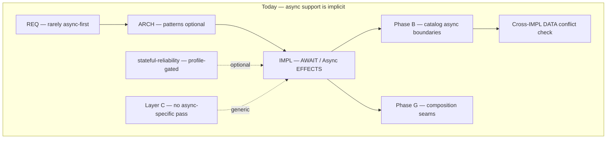
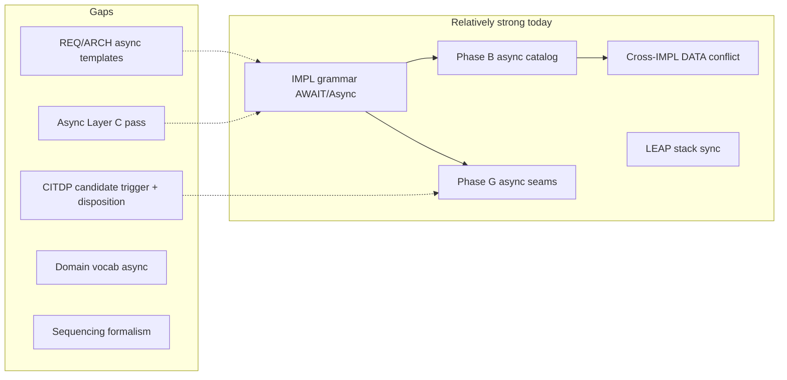
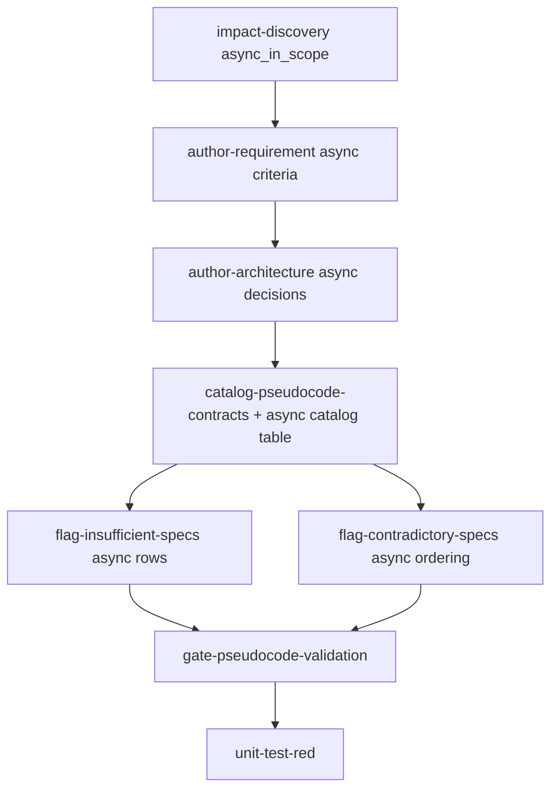
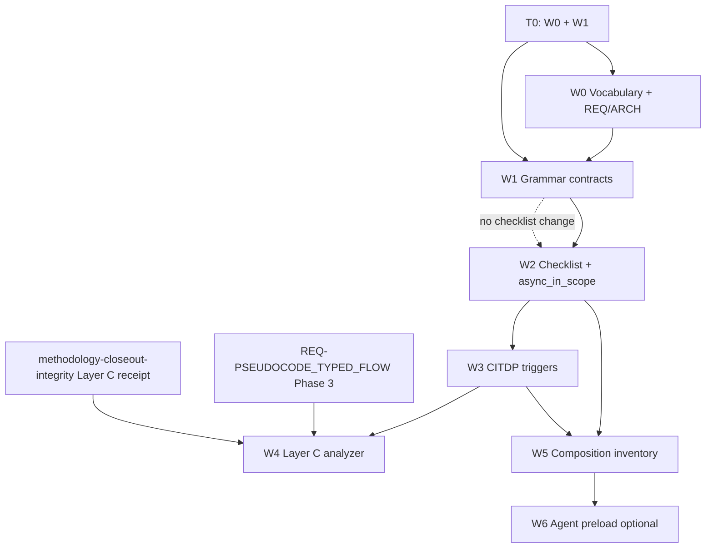

# TIED Async Methodology Plan

**Status:** Fourth refined plan (2026-09-10) — W0–W2 artifacts are present in the working tree; W2 remains in progress; W3–W6 are deferred and no close-out is claimed
**Change ID:** `PLAN-TIED-ASYNC-METHODOLOGY`  
**Priority:** P1 (methodology comprehension gap)  
**Owner:** Canonical TIED source repository (`stdd`)  
**Scope:** Methodology and tooling — how TIED supports **asynchronous logic** across CITDP, REQ, ARCH, IMPL, pseudocode grammar, checklist, static analysis, composition, and vocabulary. This is **not** a product-application async feature.

**Refinement boundary:** This refinement edits this Markdown file only. Existing W0–W2 project records, source/tests, Tracker copies, CITDP, and pilot artifacts are inspected as current working-tree context; no new TIED record, gate receipt, source, test, or implementation evidence is created here. W3–W6 tokens and evidence paths remain proposed/deferred unless explicitly marked otherwise.

**Current delivery boundary:** W0–W1 (T0) delivered the vocabulary, REQ/ARCH guidance, optional v1 grammar rows, structural fixture corpus, and legacy compatibility coverage. W2 delivered the checklist catalog/contradiction dispositions, `async_in_scope` Tracker field, checklist MD/YAML updates, tests, and reference-pilot rehearsal. The W2 CITDP is `in_progress`, its Tracker execution evidence is empty, and no authoritative W2 `pre_implementation`, verification, or close-out receipt is present. These artifacts establish structural implementation evidence, not wave close-out or runtime concurrency proof.

**Related work:** [REQ-PSEUDOCODE_TYPED_FLOW](../tied/requirements/REQ-PSEUDOCODE_TYPED_FLOW.yaml), [REQ-PSEUDOCODE_STATIC_ANALYSIS](../tied/requirements/REQ-PSEUDOCODE_STATIC_ANALYSIS.yaml), [REQ-TIED_CHECKLIST_GATE_ENFORCEMENT](../tied/requirements/REQ-TIED_CHECKLIST_GATE_ENFORCEMENT.yaml), [REQ-QUALITY_ASSURANCE_EVIDENCE](../tied/requirements/REQ-QUALITY_ASSURANCE_EVIDENCE.yaml), [methodology-closeout-integrity-plan.md](methodology-closeout-integrity-plan.md), [pseudocode-format-and-practices.md](../tied/docs/pseudocode-format-and-practices.md), [agent-req-implementation-checklist.md](../tied/docs/agent-req-implementation-checklist.md) § `catalog-pseudocode-contracts`, [composition-coverage.md](../tied/docs/composition-coverage.md)

---

## Executive summary

TIED already provides **implicit async support** through IMPL grammar (`AWAIT`, `Promise` in OUTPUT, `Async` in EFFECTS, `SEND`, `TERMINATION`) and checklist Phase B cataloging of async boundaries. Cross-IMPL collision detection catches sync-vs-async DATA assumptions. Composition Phase G covers async seams (event listeners, IPC, message handlers, subprocess streams). CITDP's `stateful-reliability` profile and adversarial inquiry cover retry, concurrency, timeout, and ordering at integrated depth.

These hooks are **scattered and opt-in**. REQ and ARCH layers are not async-first. Async depth in CITDP is profile-gated rather than universally triggered when pseudocode declares `Async` effects. Static validation does not prove deadlock- or race-freedom. Agents can pass structural gates while leaving async ordering, cancellation, and timeout contracts implicit until late composition or runtime failure.

The plan treats these as distinct semantic obligations; one must never be inferred from another:

| Semantic obligation | What the plan requires | What it does not prove |
|---|---|---|
| **Await sequencing** | Which awaited operations must complete before a later step, including each success/failure continuation | Global scheduling, fairness, or race-freedom |
| **Message/event delivery** | Trigger, channel, delivery assumption, handler completion/ack behavior, and duplicate/loss policy | Exactly-once delivery unless an independent runtime contract proves it |
| **Cancellation** | Who may request cancellation and the DATA/POST outcome after cancellation | That an already-running external operation can be physically stopped |
| **Timeout** | Deadline, named failure mode, and whether timeout causes cancellation, retry, fallback, or return | That the provider honors the deadline |
| **Retry/idempotency** | Retry count/backoff and the idempotency or deduplication obligation for repeated execution/delivery | That retries are safe merely because they are declared |
| **Shared DATA** | DATA ownership, reads/writes across yields, DATA_TRANSITION, and documented ordering edges | Absence of races or atomicity without runtime evidence |
| **Termination/open wait** | Completion condition, unsubscribe/close path, or explicit `TERMINATION: may_diverge` rationale | Liveness, deadlock-freedom, or eventual delivery |

This plan sequences **seven numbered waves (W0–W6)**: six core capability waves (W0–W5) plus one optional preload/tooling wave (W6). Together they make async comprehension **explicit, traceable, and gate-enforceable** at each stack layer — without claiming full formal verification of concurrent systems.

**Recommendation:** Treat **T0 (W0–W1)** and the W2 implementation tranche as the current delivered scope, but do not infer W2 close-out from those artifacts. Complete W2 gate/verification evidence through a scoped `build-plan` invocation before any `plan-close-out`; keep W3–W5 separately authorized and W6 optional.

---

## 0. Refine outcomes

### Resolved sponsor terms

| Preferred term | Canonical meaning |
|---|---|
| **async features** | TIED methodology and tooling enhancements for asynchronous logic — not an application product feature |
| **async boundary** | A point where control may yield before completion: `AWAIT`, `Promise` OUTPUT, `Async` in EFFECTS, `SEND` / message dispatch, or open wait |
| **async seam** | A composition binding where trigger and effect are temporally decoupled (event listener, IPC channel, message handler, subprocess stream, callback registration) |
| **async contract** | Explicit PRE/POST/EFFECTS/FAILURE_MODES/CONTROL/DATA_TRANSITION rows plus applicable timeout, cancellation, sequencing, delivery, retry, idempotency, and termination declarations |
| **async formalism** | Structured notation for sequencing and concurrency assumptions, bounded to documented ordering and structural consistency rather than model checking |
| **sync/async DATA conflict** | Two IMPLs read/write the same DATA key with incompatible yield, ownership, or ordering assumptions (existing `flag-contradictory-specs` category) |
| **async comprehension** | An agent or reviewer can answer, from REQ→ARCH→IMPL→tests alone: what may yield, what delivery/retry/cancel/timeout semantics apply, what shared DATA transitions occur, what terminates, and which bindings prove the seam |

### Accepted decisions (refinement)

1. **TIED applicability:** Full TIED workflow under `[PROC-AGENT_REQ_CHECKLIST]` applies when a wave is authorized. T0 was documentation-focused but was executed with TIED records, Tracker context, fixtures, and tests; this refinement adds no new implementation or gate evidence.
2. **Inquiry activation:** Async markers produce a deterministic **candidate trigger**, not a silent inquiry run. `impact-discovery` must record `profile_depth`, `gate_policy`, trigger rationale, owner, and waiver/activation disposition before any expensive inquiry. Behavior-changing waves with message/event input, persistence, retry, cancellation, or strict close-out default to `integrated`; pure documentation defaults to `minimal` or N/A with rationale.
3. **Gate policy:** `gate_policy: advisory` may classify observed/unresolved inquiry findings during development. Structural contract failures (missing async catalog rows, unresolved async DATA conflicts, malformed evidence, or missing activation) remain blocking.
4. **Proof boundary:** TIED will document and statically check structural async contracts (declared boundaries, typed Promise shapes, ordering rows, shared DATA declarations, termination claims, and binding inventory completeness). TIED will not claim deadlock-freedom, race-freedom, livelock-freedom, fairness, or full happens-before proof without a separate sponsor-approved formal-methods scope.
5. **Grammar strategy:** Extend grammar v1 with optional async contract rows first; defer actor-model or state-machine surface syntax to grammar v2 opt-in (`ARCH-PSEUDOCODE_GRAMMAR_V2`) if sponsor approves after T0.
6. **Normative versus advisory:** REQ/ARCH/IMPL criteria, required rows when an async marker is in scope, checklist dispositions, and enabled analyzer diagnostics are normative. Examples, preload hints, metrics, fault-injection catalogs, and grammar-v2 exploration are advisory until separately authorized.
7. **Non-goals:** No host-language async runtime; no replacement for integration/load testing; no mandatory happens-before solver in Layer C for initial waves.

### Vocabulary RECORD/VALIDATE status

Terms above are **RESOLVE**d against preloaded glossaries (`async-methodology`, `pseudocode-and-citdp`, `quality-assurance`, `prompt-composer`). W0 **RECORD** is present in the methodology-owned `tied/vocab/async-methodology.md`, routing, and domain-reference entries; `copy_files.sh` remains the client refresh boundary. This refinement introduces no new vocabulary. The read-only TIED consistency check passed; pre-commit vocabulary **VALIDATE** remains a later commit responsibility.

### Decisions needing sponsor input

| # | Decision | Options | Recorded/current value | Recommended sponsor answer for remaining scope |
|---|----------|---------|-------------------|-----------------------------------|
| D1 | Concurrency model depth | (A) Lightweight ordering `CONTROL`; (B) documented ordering edges; (C) actor/state-machine notation in grammar v2 | **A recorded**; B only as documentation after explicit review; C deferred | Preserve `CONTROL: ordering`; defer B/C to post-T0 review. |
| D2 | CITDP async trigger scope | (A) profile-gated; (B) silent auto-trigger; (C) deterministic candidate trigger requiring recorded disposition | **C recorded**; never run inquiry solely because a marker was parsed | Preserve candidate-trigger-only behavior; W3 must wire activation explicitly. |
| D3 | Static analysis claims | (A) structural/type consistency; (B) bounded race detection on annotated DATA | **A recorded** | Preserve structural-only claims; no race/deadlock/liveness proof. |
| D4 | Grammar version for new keywords | (A) v1 optional rows; (B) v2 opt-in block | **A recorded** | Preserve optional v1 rows; defer grammar-v2 surface. |
| D5 | Wave authorization | All six core waves (W0–W5), optional W6, T0 (W0–W1), or another bounded tranche | **T0 and W2 recorded/current**; W3–W6 deferred | Do not extend authorization beyond W2 without a separate decision. |

**Remaining sponsor decisions:** authorize any wave beyond W2 and name/approve the owner for future integrated inquiry activation. The current W2 CITDP uses a placeholder owner and does not supply activation evidence; that is a documented unresolved gate, not a close-out waiver. Retry/delivery semantics currently use only the documented categories; no project-specific vocabulary extension is recorded.

**Cannot be defaulted (require explicit sponsor text even when other defaults are accepted):**

- Owner name for any future `integrated` inquiry disposition (the current W2 CITDP placeholder is not sufficient; a real owner is required before W3–W5 behavior-changing waves).
- Whether retry/delivery semantics stay within the seven documented categories or add project-specific vocabulary extensions (the current records use documented categories only; extension remains a Wave 3+ vocabulary RECORD decision).

---

## 1. Problem statement

Asynchronous logic is **first-class in real systems** but **second-class in TIED documentation flow**. An agent following the checklist today can:

- Write `AWAIT` steps without declaring timeout or cancellation in FAILURE_MODES.
- Omit `CONTROL` ordering when two async procedures touch shared DATA.
- Pass REQ/ARCH authoring without any async acceptance criteria.
- Skip `stateful-reliability` CITDP rows when the change is "just adding a promise."
- Discover sync/async DATA conflicts only at `flag-contradictory-specs` — late, and only when two IMPLs happen to share a DATA key.

**Why AWAIT/EFFECTS vocabulary alone is insufficient:**

| Gap | Consequence |
|-----|-------------|
| No REQ/ARCH async acceptance criteria templates | Sponsors cannot specify timeout, retry, or ordering requirements traceably |
| No dedicated async contract rows | Cancellation and timeout live in prose; tooling cannot compare |
| CITDP async depth profile-gated | Concurrency/retry evidence missing on "small" async changes |
| No async-specific static analysis | `Promise`/`AWAIT` mismatches and unresolved async ordering surface late |
| Composition inventory lacks async column patterns | Event/IPC bindings under-specify ordering PRE and failure_behavior |
| No happens-before / sequencing formalism | Agents infer interleaving from host-language idioms; LEAP drift |

The goal is not to turn TIED into a concurrency verifier. The goal is to make **async assumptions explicit at every layer** so comprehension, collision detection, composition tests, and inquiry have **structured hooks** — aligned with how TIED already treats PRE/POST/EFFECTS for sync logic.

---

## 2. Goals and non-goals

### Goals

1. **REQ/ARCH async-first templates** — Acceptance criteria and architecture decision prompts when a change introduces or modifies async boundaries.
2. **Pseudocode async contract extensions** — Optional, comparable rows for timeout, cancellation, sequencing, and message-style async — without breaking grammar v1 default.
3. **Checklist integration** — Phase A/B/G steps that **require** async catalog entries when `Async` appears; enhanced contradiction flags for async ordering.
4. **CITDP triggers and evidence matrix** — Deterministic candidate triggers plus a documented profile disposition for `stateful-reliability` (or a dedicated async profile); adversarial cases for retry/timeout/ordering only when activated.
5. **Static analysis / typed-flow hooks** — Layer C diagnostics for async boundary consistency (Promise OUTPUT vs AWAIT, missing Async in EFFECTS, CALL across async boundary).
6. **Composition patterns** — Binding inventory columns and examples for async seams; fault-injection rows for ordering and timeout faults.
7. **Vocabulary glossary** — `tied/vocab/async-methodology.md` with RESOLVE/RECORD terms bridging domain language and IMPL grammar.

### Non-goals

- Implementing async runtimes or host-language async libraries.
- Proving deadlock-freedom or race-freedom in Layer C (document proof boundary explicitly).
- Mandating actor-model or CSP notation in v1 (optional v2 follow-on only).
- Replacing integration, load, or chaos testing for production async systems.
- Retrofitting all legacy IMPL sidecars in one wave (migration grace per `pre-contract-grammar` / `pre-async-contract` parallels).

---

## 3. Current state audit

### 3.1 Pseudocode grammar and format

| Location | Async support today |
|----------|---------------------|
| [implementation-decisions.md](../tied/docs/implementation-decisions.md) § Preferred vocabulary | `AWAIT`; `Promise` in OUTPUT; `Async` in EFFECTS; `SEND` for message-style async |
| [pseudocode-format-and-practices.md](../tied/docs/pseudocode-format-and-practices.md) §4 | Same keywords; TERMINATION for open-ended wait |
| [pseudocode-and-citdp.md](../tied/vocab/pseudocode-and-citdp.md) | `AWAIT` / `Promise` cataloged under IMPL grammar keywords |
| SHAPE-003..006 | No async-specific shape checks |
| Layer C (`pseudocode_analyze`) | Generic CFG/call-graph; typed-flow can type `Promise` if annotated — no async ordering pass |

### 3.2 Checklist (`[PROC-AGENT_REQ_CHECKLIST]`)

| Step | Async hook |
|------|------------|
| `catalog-pseudocode-contracts` (Phase B) | Explicit bullet: catalog async boundaries (`AWAIT`, `Promise`) and whether EFFECTS includes `Async` |
| `flag-contradictory-specs` | Shared DATA conflict includes sync vs async assumptions; ordering conflict between IMPLs |
| `resolve-pseudocode` | Requires explicit ordering when fixing contradictions |
| `collision and composition notes` (S06) | Ordering, shared DATA, pre/post at boundaries |
| `composition-integration` (Phase G) | Event listeners, IPC, message handlers, subprocess streams; binding-local adversarial cases; `CONTROLLED_COMPOSITION_FAULT` for ordering faults |
| `author-requirement` / `author-architecture` | **No async-specific acceptance criteria templates** |

### 3.3 CITDP and quality assurance

| Artifact | Async hook |
|----------|------------|
| `stateful-reliability` assurance profile | Retry, recovery, concurrency, restart behavior |
| [quality-assurance.md](../tied/vocab/quality-assurance.md) | Profile definition for stateful-reliability |
| Adversarial inquiry (integrated) | Retry, concurrency, timeout, ordering cases when depth tier applies |
| Profile selection | **Manual / impact-discovery** — not auto-triggered by `Async` in pseudocode |

### 3.4 Composition and binding inventory

| Artifact | Async hook |
|----------|------------|
| [composition-coverage.md](../tied/docs/composition-coverage.md) | Binding kinds include event listener, IPC/message channel; `ordering` column required |
| `binding_inventory_validate` | Validates row completeness; no async-specific semantics |
| STDD inventory examples | Mostly sync CLI/pipeline bindings |

### 3.5 Static analysis and typed-flow

| Capability | Async relevance |
|------------|-----------------|
| [REQ-PSEUDOCODE_TYPED_FLOW](../tied/requirements/REQ-PSEUDOCODE_TYPED_FLOW.yaml) | Can annotate `Promise of T` on OUTPUT; no async sequencing rules yet |
| [REQ-PSEUDOCODE_CONSTRAINT_LANGUAGE](../tied/requirements/REQ-PSEUDOCODE_CONSTRAINT_LANGUAGE.yaml) | Future interleaving/refinement predicates — dependency for advanced ordering |
| Cross-IMPL collision (Layer B) | Sync vs async DATA — **reactive**, not async-scheduled |

### 3.6 Summary diagram

### 3.7 Verified repository boundaries

- Existing linked records are project-owned at `tied/requirements/`, `tied/architecture-decisions/`, and `tied/implementation-decisions/`; the referenced tokens currently include `[REQ-PSEUDOCODE_TYPED_FLOW]` (`In Progress`), `[REQ-PSEUDOCODE_STATIC_ANALYSIS]`, `[REQ-TIED_CHECKLIST_GATE_ENFORCEMENT]`, and `[REQ-QUALITY_ASSURANCE_EVIDENCE]`.
- Existing source guides are `tied/docs/requirements.md`, `tied/docs/architecture-decisions.md`, `tied/docs/implementation-decisions.md`, `tied/docs/pseudocode-format-and-practices.md`, `tied/docs/composition-coverage.md`, and `tied/docs/agent-req-implementation-checklist.md`. The exact checklist slugs used by this plan are `catalog-pseudocode-contracts`, `flag-contradictory-specs`, `gate-pseudocode-validation`, `composition-integration`, and `sub-vocabulary-sync`.
- The canonical methodology vocabulary source is `tied/vocab/` in this repository. Client refresh places it under client `tied/methodology/vocab/`; client-owned vocabulary remains client `tied/vocab/`. There is no `tied/methodology/vocab/routing.md` in this source tree, so this plan does not cite that client snapshot as a source path.
- `templates/impl-essence-pseudocode-template.md`, `tied/agent-preload-contract.yaml`, `mcp-server/src/analysis/binding-inventory.ts`, and `tools/agentstream/` exist. W0–W2 async token/detail records, fixture corpus, checklist helpers/tests, and pilot artifacts are present in the current tree. `mcp-server/src/analysis/fixtures/async-boundary/`, W3–W5 token/detail records, and W6 preload changes remain future/deferred.
- `methodology-closeout-integrity-plan.md` exists at `docs/methodology-closeout-integrity-plan.md`; its status header says implemented, while its body retains typed-flow dependency language. Wave 4 therefore requires reconciliation evidence, not an assumption based on the heading.

### Wave traceability and registration contract

| Wave | Draft REQ → ARCH → IMPL | Future test/evidence surface | Registration location |
|---|---|---|---|
| **W0** | `REQ-ASYNC_REQ_ARCH_TEMPLATES` → `ARCH-ASYNC_REQ_ARCH_CONTRACT` → `IMPL-ASYNC_VOCABULARY` + `IMPL-ASYNC_REQ_ARCH_GUIDANCE` | **Delivered:** glossary/routing and REQ/ARCH guidance are registered in project TIED records | W0 docs, vocabulary, indexes, details, and token payloads are present; no runtime behavior |
| **W1** | `REQ-ASYNC_PSEUDOCODE_CONTRACTS` → `ARCH-ASYNC_CONTRACT_GRAMMAR` → `IMPL-ASYNC_PSEUDOCODE_GRAMMAR` | **Delivered:** 14 positive/negative fixtures plus legacy no-async corpus; targeted fixture suite passes | Grammar docs/template and fixture artifacts are present; no Layer C analyzer |
| **W2** | `REQ-ASYNC_CHECKLIST_CATALOG` → `ARCH-ASYNC_CHECKLIST_INTEGRATION` → `IMPL-ASYNC_CHECKLIST_DISPOSITIONS` | **Implemented in working tree:** checklist catalog, contradiction routing, `async_in_scope`, tests, and GOAGENT reference-pilot rehearsal; close-out evidence is absent | Project indexes, checklist docs/YAML, source/tests, and pilot artifacts are present |
| **W3** | `REQ-ASYNC_CITDP_TRIGGERS` → `ARCH-ASYNC_CITDP_EVIDENCE` → `IMPL-ASYNC_CITDP_PROFILE_WIRING` | CITDP trigger/disposition fixtures, evidence matrix, inquiry activation receipts; **consumes** `async_in_scope` from Tracker | Project indexes plus per-request `tied/citdp/` only after authorization |
| **W4** | `REQ-ASYNC_BOUNDARY_ANALYSIS` → `ARCH-ASYNC_ANALYSIS_PASS` → `IMPL-ASYNC_BOUNDARY_ANALYZER` | `mcp-server/src/analysis/` unit fixtures, Layer C reports, MCP composition wiring | Project indexes plus analyzer source/tests; async fixtures are future additions |
| **W5** | `REQ-ASYNC_COMPOSITION_INVENTORY` → `ARCH-ASYNC_COMPOSITION_BINDING` → `IMPL-ASYNC_BINDING_VALIDATOR` | Binding inventory and UI-free composition fault tests | Project indexes plus `mcp-server/src/analysis/binding-inventory.ts` and composition docs |
| **W6** (optional) | — (preload/tooling only; no new REQ/ARCH/IMPL umbrella tokens) | Agent preload and scoped-analysis preview | `tied/agent-preload-contract.yaml`, `tools/agentstream/` checklist render |

For every future wave, the implementation record must point to the owning architecture and requirement, each changed pseudo-code block must carry the literal REQ/ARCH/IMPL lead comment, and tests must reference the REQ token. If implementation reveals a new async semantic or changes a proof claim, loop back `IMPL → ARCH → REQ` before proceeding.

---

## 4. Proposed enhancements (waves)

### W0 — Vocabulary and REQ/ARCH async templates

**Objective:** Establish domain terms and sponsor-facing acceptance criteria before grammar or tooling changes.

**Deliverables:**

- Methodology glossary: `tied/vocab/async-methodology.md` in this source repository, with entries in the source routing/catalog. `copy_files.sh` later refreshes it to client `tied/methodology/vocab/`; it is not client-owned here.
- REQ authoring guidance in `tied/docs/requirements.md` and the applicable detail-file schema/template surface: **Async acceptance criteria** covering await sequencing, delivery, cancellation, timeout, retry/idempotency, shared DATA, and termination/open wait.
- ARCH authoring guidance in `tied/docs/architecture-decisions.md`: **Async architecture decisions** covering concurrency model, message versus promise boundary, backpressure, failure propagation, and ownership of shared DATA.
- A naming bridge from each semantic class to the eventual REQ/ARCH/IMPL token and pseudo-code block name. No final token is registered until the wave is authorized.
- Routing keywords in the canonical source `tied/vocab/routing.md`: `async`, `await`, `promise`, `concurrency`, `IPC`, `event listener`, `timeout`, `cancellation`, `retry`, `idempotency`, `shared DATA`, `open wait`.

**Ownership boundary:** W0 owns vocabulary and authoring guidance. It does not change checklist execution, CITDP profiles, analyzer behavior, binding validation, or client project YAML.

**Entry gate:** Sponsor terms are resolved; D1–D5 defaults are accepted or explicitly changed; the exact authoring insertion points in `tied/docs/requirements.md`, `tied/docs/architecture-decisions.md`, and `tied/docs/detail-files-schema.md` are named.

**Exit gate:** (1) all seven semantic classes have a preferred term, definition, example, and non-claim; (2) REQ/ARCH guidance requires either criteria or explicit N/A rationale; (3) source/client vocabulary ownership is unambiguous; (4) links and glossary indexes validate; (5) no checklist, CITDP, analyzer, or project YAML behavior changed.

**Loop-back:** Missing sponsor semantics returns to `change-definition`; conflicting names return to `sub-vocabulary-sync`/RESOLVE; an authoring rule that would affect enforcement returns to W1 scope review.

**Success signal:** A future async REQ/ARCH author can express all seven semantic classes and trace each criterion to a planned IMPL block without ad-hoc prose.

---

### W1 — Pseudocode grammar extensions (async contracts)

**Objective:** Extend IMPL grammar with **optional, comparable** async contract rows — v1-compatible.

**Proposed grammar additions (v1 optional rows):**

| Row | Purpose | Example |
|-----|---------|---------|
| `ASYNC_BOUNDARY:` | Declares the boundary kind, not merely a boolean | `ASYNC_BOUNDARY: await` |
| `TIMEOUT:` | Max wait before FAILURE_MODE | `TIMEOUT: 30s → TIMEOUT_EXCEEDED` |
| `CANCELLATION:` | Who may cancel; POST on cancel | `CANCELLATION: caller → CANCELLED; POST: no state change` |
| `SEQUENCING:` | Local or cross-block documented order; not a proof | `SEQUENCING: PERSIST before NOTIFY` |
| `MESSAGE_CONTRACT:` | Delivery and handler/ack assumptions | `MESSAGE_CONTRACT: at-least-once; handler deduplicates` |
| `RETRY:` | Retry count/backoff and retryable failures | `RETRY: 2 attempts; timeout only; exponential backoff` |
| `IDEMPOTENCY:` | Duplicate execution/delivery protection | `IDEMPOTENCY: request_id; POST: one DATA transition` |

`DATA`/`DATA_TRANSITION` remain the source of shared-state ownership and before/after semantics. `TERMINATION` remains the source of completion versus `may_diverge` open waits. These existing rows must not be replaced by a generic `ASYNC_BOUNDARY` flag.

**CONTROL enhancement:** Document that `CONTROL: ordering` is the **primary v1 vehicle** for documented ordering when `SEQUENCING:` is omitted. A sequencing row describes an assumption; it does not establish global happens-before.

**Future checklist expectations (Phase B — documented in W1, enforced in W2):**

W1 **documents** the Phase B catalog mapping and insufficient-spec rules that W2 will **implement** as gating checklist dispositions. T0 (W0–W1) does **not** change checklist YAML, gate behavior, render output, or introduce `async_in_scope`.

- **Documented mapping (for W2 implementation):** Extend the async catalog bullet to map each boundary to the applicable rows: TIMEOUT/CANCELLATION for deadline or stop behavior; MESSAGE_CONTRACT for SEND/events; RETRY/IDEMPOTENCY for re-execution or duplicate delivery; DATA/DATA_TRANSITION for shared state; TERMINATION for open waits.
- **Documented flag (for W2 implementation):** `Async` in EFFECTS without an AWAIT, SEND, Promise OUTPUT, or explicit async boundary rationale. Do not reject a deliberate fire-and-forget block when its delivery and termination assumptions are documented.

**Migration:** New N/A rationale `pre-async-contract` for untouched legacy blocks (parallel to `pre-contract-grammar`).

**Template update:** [impl-essence-pseudocode-template.md](../templates/impl-essence-pseudocode-template.md) optional async section.

**Ownership boundary:** W1 owns grammar wording, template examples, and Layer B shape rules. It does not enable Layer C diagnostics, change checklist execution, or make all legacy IMPLs retroactively noncompliant.

**Entry gate:** W0 exit evidence exists; v1 row names do not conflict with existing preferred vocabulary; each row has a parsing shape, applicability rule, failure behavior, and proof-boundary note.

**Exit gate:** (1) v1 documents remain valid when no async rows are present; (2) the seven semantic classes map to existing or new rows without conflation; (3) `pre-async-contract` is limited to untouched legacy blocks; (4) positive/negative structural examples cover each new row; (5) `PROC-PSEUDOCODE_VALIDATION` can distinguish missing, malformed, and not-applicable rows; (6) future Phase B expectations are documented but checklist behavior is unchanged.

**Loop-back:** Grammar ambiguity returns to W0 vocabulary; a requirement for interleaving/refinement semantics returns to D1 and is deferred to grammar v2; any proposed runtime claim returns to the proof-boundary review.

---

### W2 — Checklist clarifications and contradiction detection

**Objective:** Make async comprehension **gating** at catalog and contradiction steps.

**Deliverables:**

- **`catalog-async-boundaries`** sub-procedure (or expanded Phase B): closed catalog table per IMPL:

  | Block | Boundary kind | Await/message/event | Timeout | Cancellation | Retry/idempotency | Shared DATA | Termination/order |
  |-------|---------------|-------------------|---------|--------------|--------------------|-------------|--------------------|

- **`flag-async-contradictions`** extensions:
  - AWAIT on a procedure whose OUTPUT is not Promise-typed or whose async effect is not declared, when typed evidence is available.
  - SEQUENCING/CONTROL mismatch between caller and callee IMPLs.
  - Message/event delivery assumptions that disagree with handler/ack or duplicate handling.
  - Retry declared without an idempotency/deduplication outcome for repeated DATA transitions.
  - Open wait with no close/unsubscribe condition or explicit `TERMINATION: may_diverge` rationale.
  - Timeout in REQ not reflected in IMPL TIMEOUT row (warn at Phase B; error at verification when REQ declares timeout).

- **Phase A (`impact-discovery`) — `async_in_scope` introduction:** W2 **introduces** the Tracker disposition `async_in_scope: true|false`. If any in-scope file or sponsor text suggests async, set `async_in_scope: true` and record the matched semantic class. This is a candidate trigger marker only; it is **not** inquiry activation and does not exist before W2 is authorized.

- **Adversarial inquiry binding:** If the recorded profile is `integrated`, request the four bounded inquiry cases at `pre_implementation`: timeout without FAILURE_MODE, double AWAIT on non-idempotent DATA, missing ordering between SEND and AWAIT, and retry without duplicate protection. If the profile is `minimal` or N/A, record the narrower evidence and rationale; do not silently run integrated inquiry.

**Ownership boundary:** W2 owns checklist cataloging, contradiction classification, `async_in_scope` disposition wiring, and loop-back routing. It does not decide the assurance profile, prove runtime ordering, or change binding execution.

**Entry gate:** W1 exit evidence exists; canonical checklist slugs are identified; the gate authority and Tracker schema locations are confirmed.

**Exit gate:** (1) every async-marked changed IMPL has one closed catalog row per async block; (2) each semantic class has a deterministic missing/contradictory outcome; (3) findings route to `resolve-pseudocode` before RED; (4) `async_in_scope` is written to the Tracker when async is detected and does not invoke inquiry; (5) legacy non-async checklist output is unchanged.

**Loop-back:** Missing contract data returns to `catalog-pseudocode-contracts`; cross-IMPL disagreement returns to `flag-contradictory-specs`; an unresolved profile/depth choice returns to `risk-assessment` before evidence is collected.

---

### W3 — CITDP profiles, triggers, and evidence matrix

**Objective:** Async changes produce **consistent CITDP evidence** without relying on author memory.

**Proposed CITDP candidate triggers (impact-discovery):** W3 **consumes** the `async_in_scope` disposition introduced by W2. When `async_in_scope: true`, candidate triggers recommend actions and create required disposition rows; they do not call adversarial inquiry or collect expensive evidence by themselves. Before W2, CITDP has no `async_in_scope` field to read.

| Trigger | Profile / action |
|---------|------------------|
| Any in-scope IMPL with `Async` in EFFECTS or an async boundary row | Recommend `async-boundary-catalog`; select `minimal` for pure documentation or `integrated` for behavior change |
| SEND / IPC / event-handler composition binding | Add `composition-async-seam` test-strategy row; assess external-input trigger |
| REQ async criteria include retry or at-least-once delivery | Recommend duplicate-delivery and idempotency evidence |
| REQ async criteria include timeout or cancellation | Recommend slow-provider and cancellation-outcome evidence |
| Shared persistent DATA crosses a yield | Recommend `stateful-reliability` and `data-integrity-migration` only when the change mutates persistence |

**Evidence matrix additions (quality assurance):**

| Attribute | Evidence artifact | Proof boundary | Minimum acceptance |
|-----------|-------------------|----------------|-------------------|
| async-boundary-catalog | Phase B catalog table in Tracker | Structural completeness | One row for every changed async block |
| async-await-sequencing | IMPL `SEQUENCING`/`CONTROL` + unit tests | Documented local ordering | Success and failure continuation named |
| async-delivery | `MESSAGE_CONTRACT` + composition test | Declared delivery/ack behavior | Delivery category and duplicate/loss outcome named |
| async-cancellation | `CANCELLATION` + unit test | Named cancellation POST | Caller, cancellation point, and DATA outcome named |
| async-timeout-recovery | `TIMEOUT`/`FAILURE_MODES` + unit test | Named failure path exercised | Deadline and timeout consequence match |
| async-retry-idempotency | `RETRY`/`IDEMPOTENCY` + duplicate test | Re-execution behavior | Retryable failures and deduplication key/outcome named |
| async-shared-data | `DATA_TRANSITION` + collision report | Structural ownership/order | Reads, writes, and ordering edges named |
| async-termination | `TERMINATION` + close/unsubscribe test | Declared completion/open wait | Close condition or `may_diverge` rationale |
| async-composition-seam | Binding inventory row + composition test | Trigger-to-effect boundary | Async PRE/POST exercised without UI |

**Adversarial inquiry cases (integrated):**

- `ASYNC-001`: Timeout declared in REQ, absent in IMPL.
- `ASYNC-002`: Two AWAITs on shared mutable DATA without DATA_TRANSITION ordering.
- `ASYNC-003`: SEND without idempotency when MESSAGE_CONTRACT at-least-once.
- `ASYNC-004`: Composition binding missing `ordering` for async handler.
- `ASYNC-005`: Cancellation is declared but no post-cancel DATA outcome is specified.
- `ASYNC-006`: Open wait has no close/unsubscribe path or `may_diverge` rationale.

**Activation contract:** Before `tied_adversarial_inquiry_run`, CITDP must record `depth_tier`, research profile, assurance profile, `gate_policy`, matched triggers, selected cases, owner, and any waiver with expiry. A marker alone never authorizes the call.

**Ownership boundary:** W3 owns CITDP disposition and evidence selection. It reads but does not define `async_in_scope` (W2 owns definition). `[REQ-QUALITY_ASSURANCE_EVIDENCE]` owns proof-boundary and residual-risk rules; `[REQ-TIED_ADVERSARIAL_INQUIRY]` owns inquiry artifacts and lifecycle; neither is replaced by an async flag.

**Entry gate:** W2 exit evidence exists (including working `async_in_scope` disposition); profile depth and gate policy are selected independently; current quality and inquiry schemas are read and their owners confirmed.

**Exit gate:** (1) every candidate trigger yields a recorded disposition; (2) no inquiry runs without activation evidence; (3) each selected evidence row has an artifact owner, proof boundary, and acceptance threshold; (4) waivers are owner/expiry/rationale-bound; (5) advisory findings cannot mask structural failures.

**Loop-back:** A missing disposition returns to `risk-assessment`; a profile mismatch returns to `test-strategy`; an observed finding does not trigger LEAP, while a confirmed defect routes to the owning checklist step.

---

### W4 — Static analysis and typed-flow hooks

**Objective:** Layer C catches **structural** async mismatches before RED tests.

**Dependency:** [REQ-PSEUDOCODE_TYPED_FLOW](../tied/requirements/REQ-PSEUDOCODE_TYPED_FLOW.yaml) Phase 3 implementation and verification must be closed for the relevant typed-flow scope. Its current project status is `In Progress`, so this dependency is **not satisfied by this plan**. [methodology-closeout-integrity-plan.md](methodology-closeout-integrity-plan.md) is marked close-out complete, but its text also says typed-flow promotion remains blocked until its Layer C work; verify the authoritative gate receipt and reconcile that wording before authorizing Wave 4.

**Proposed analyzer pass: `async_boundary` (opt-in → promote to gate)**

| Diagnostic code | Severity | Condition |
|-----------------|----------|-----------|
| `ASYNC_EFFECTS_WITHOUT_BOUNDARY` | error (gate) | EFFECTS includes Async; no AWAIT/SEND/Promise OUTPUT or explicit boundary rationale |
| `AWAIT_NON_PROMISE_OUTPUT` | error (gate) | AWAIT target procedure OUTPUT not Promise-typed (when typed-flow on) |
| `MISSING_TIMEOUT_FAILURE_MODE` | warn → error | TIMEOUT row references undefined FAILURE_MODE |
| `SEQUENCING_UNDEFINED_SHARED_DATA` | warn | Multiple AWAITs touch DATA; no SEQUENCING/CONTROL |
| `CALL_ACROSS_ASYNC_BOUNDARY` | warn | CALL to procedure with Async EFFECTS without AWAIT in caller |
| `RETRY_WITHOUT_IDEMPOTENCY` | warn | Retry or at-least-once delivery has no declared duplicate outcome |
| `OPEN_WAIT_WITHOUT_TERMINATION` | warn | Stream/subscription/event wait has no close condition or `may_diverge` rationale |

**Typed-flow integration:**

- Tier-2 type: `Promise of T` required on OUTPUT when body contains AWAIT returning value.
- `typed_flow` promotion: `AWAIT_NON_PROMISE_OUTPUT` → gate error on annotated procedures.

**Proof boundary statement (mandatory in report):**

> Layer C async pass validates **declared structure and type consistency** only. It does not prove freedom from deadlock, livelock, or data races.

**Fixtures (future):** `mcp-server/src/analysis/fixtures/async-boundary/` (labeled cases ≥20), created only when Wave 4 is authorized. This directory does not exist in the current repository.

**Ownership boundary:** W4 owns read-only pseudo-code analysis and report proof labels. It does not infer runtime scheduling, mutate TIED YAML, replace typed-flow, or turn warnings into gates without a separately recorded promotion decision.

**Entry gate:** W3 exit evidence exists; typed-flow and close-out dependency status is reconciled; Layer C report schema, `gate_mode`, input identity, and legacy compatibility rules are fixed.

**Exit gate:** (1) analyzer-off behavior is unchanged; (2) every diagnostic has positive, negative, and unknown/truncated cases; (3) reports state the structural-only proof boundary; (4) no diagnostic claims race/deadlock freedom; (5) gate promotion is explicitly authorized per code and severity.

**Loop-back:** Type uncertainty returns to typed-flow scope; missing contract syntax returns to W1; an attempted concurrency proof returns to D1/D3 and is rejected or separately planned.

---

### W5 — Composition binding inventory patterns for async seams

**Objective:** Phase G bindings for async seams are **first-class** in inventory and validation.

**Binding inventory extensions:**

| Column | Async seam usage |
|--------|------------------|
| `ordering` | Required: e.g. `subscribe before publish`, `handler completes before ACK` |
| `failure_behavior` | Timeout, retry, dead-letter, nack |
| `async_semantics` | `fire-and-forget`, `request-response`, `streaming`, or declared delivery category |
| `cancellation` | Who cancels and what the binding does after cancellation |
| `composition_test` | Must assert async PRE (e.g. subscription active) before trigger and the relevant POST |

**`binding_inventory_validate` extensions:**

- When `async_semantics` present, `ordering` and `failure_behavior` non-empty.
- When trigger is `event` or `message`, `async_semantics` required.
- When retry or at-least-once delivery is declared, idempotency/deduplication evidence is required.
- Inventory validation reports missing fields; it does not certify runtime ordering, delivery, or race-freedom.

**Documentation:** Expand [composition-coverage.md](../tied/docs/composition-coverage.md) with async seam examples (IPC, event emitter, subprocess stdout stream).

**Fault injection (`CONTROLLED_COMPOSITION_FAULT`):**

- Ordering fault: trigger before listener registered.
- Timeout fault: slow callee exceeds IMPL TIMEOUT.
- Duplicate delivery fault: message delivered twice (idempotency POST).

**Ownership boundary:** W5 owns the binding inventory schema, validator, composition test contract, and documentation examples. Runtime adapters and application-specific delivery guarantees remain outside TIED methodology.

**Entry gate:** W2 catalog and W3 evidence rows are stable; the existing `binding_inventory_validate` boundary at `mcp-server/src/analysis/binding-inventory.ts` is confirmed; composition tests can fire triggers without a UI.

**Exit gate:** (1) every async binding row has a semantic category, ordering, failure behavior, and test reference; (2) duplicate, timeout, cancellation, and listener-order faults have deterministic expected outcomes; (3) non-async inventory remains compatible; (4) evidence says “binding exercised,” never “system is race-free.”

**Loop-back:** Missing procedure semantics returns to W1/W2; a runtime-only concern is documented as an application test obligation; a missing proof boundary returns to W3 quality-assurance review.

---

### W6 — LEAP tooling and agent preload (optional tranche)

**Objective:** Agents preloaded with async checklist dispositions and analyzer flags.

- `tied/agent-preload-contract.yaml` pattern: when an authorized session has `async_in_scope`, preload the methodology glossary and expose Layer C flags only when the selected analyzer capability is available. Do not force `typed_flow: true` merely because async was detected.
- `agentstream` checklist render: highlight Phase B async catalog and Phase G async columns.
- Scoped analysis (`tied_scoped_analysis_run`): include async diagnostic summary in impact preview.

**Defer** until W0–W5 stable.

**Status:** Advisory/optional. W6 must not be a dependency of T0 or of correctness claims. Its entry gate includes a client-refresh compatibility check because canonical source vocabulary is installed under client `tied/methodology/vocab/`, while client-owned vocabulary remains under client `tied/vocab/`.

---

### Wave dependency graph

| Wave | Blocks | Blocked by | External dependencies |
|------|--------|------------|------------------------|
| **T0 (W0–W1)** | W2–W6 (indirectly) | Sponsor T0 authorization | None |
| **W0** | W1 | T0 authorization | — |
| **W1** | W2, W4 (grammar) | W0 exit | — |
| **W2** | W3, W5 | W1 exit | — |
| **W3** | W4, W5 | W2 exit (`async_in_scope` live) | `[REQ-QUALITY_ASSURANCE_EVIDENCE]`, `[REQ-TIED_ADVERSARIAL_INQUIRY]` schemas |
| **W4** | — | W3 exit | `[REQ-PSEUDOCODE_TYPED_FLOW]` Phase 3 closed; [methodology-closeout-integrity-plan.md](methodology-closeout-integrity-plan.md) reconciled Layer C gate receipt |
| **W5** | W6 (optional) | W2 catalog + W3 evidence stable | `[REQ-MODULE_VALIDATION]`, `binding_inventory_validate` |
| **W6** | — | W0–W5 stable | Client `copy_files.sh` refresh compatibility |

W4 and W5 may proceed in parallel after W3 exit if staffing allows; W5 still requires W2 catalog semantics. W6 is never on the critical path.

---

## 4A. Async documentation anti-patterns

TIED methodology should catch or flag these common async documentation mistakes. W1 documents the rows; W2 flags insufficiency/contradiction; W4 adds structural diagnostics where applicable.

| Anti-pattern | Symptom | Expected TIED response | Primary wave |
|---|---|---|---|
| **AWAIT without `Async` in EFFECTS** | Procedure yields but EFFECTS omits `Async` | Insufficient-spec flag at Phase B; `ASYNC_EFFECTS_WITHOUT_BOUNDARY` at Layer C (W4) | W1 doc → W2/W4 |
| **Fire-and-forget without termination** | SEND or callback with no close/unsubscribe or `TERMINATION: may_diverge` | `OPEN_WAIT_WITHOUT_TERMINATION` warn; catalog row incomplete | W2 |
| **Retry without idempotency key** | `RETRY:` or at-least-once delivery without `IDEMPOTENCY:` or dedup POST | Contradiction flag; `RETRY_WITHOUT_IDEMPOTENCY` diagnostic | W2/W4 |
| **Timeout without FAILURE_MODE** | `TIMEOUT:` references undefined or missing failure path | `MISSING_TIMEOUT_FAILURE_MODE`; REQ/IMPL mismatch at verification | W1/W2 |
| **Shared DATA across AWAIT without DATA_TRANSITION** | Multiple yields touch mutable DATA with no ownership/ordering row | Cross-IMPL collision; `SEQUENCING_UNDEFINED_SHARED_DATA` | W2/W4 |
| **Message/event without delivery category** | SEND/handler with no `MESSAGE_CONTRACT` or ack/dedup policy | Catalog insufficiency; composition binding missing `async_semantics` (W5) | W1 → W5 |
| **Cancellation without POST outcome** | `CANCELLATION:` names caller but not DATA/POST after cancel | Adversarial case `ASYNC-005`; contradiction at Phase B | W2/W3 |
| **Implicit ordering from host language** | Go/Rust/TS idioms substituted for `CONTROL`/`SEQUENCING` | LEAP drift; flag at `flag-contradictory-specs` when typed evidence exists | W2 |
| **Structural pass over-claim** | Report or checklist text implies race/deadlock freedom | Rejected at proof-boundary review; mandatory disclaimer in Layer C report | All waves |
| **Silent inquiry on async marker** | `Async` in EFFECTS triggers adversarial run without disposition | Blocked by D2/CITDP activation contract; candidate trigger only until W3 wiring | W3 |

---

## 5. REQ / ARCH / IMPL token proposals

**Registration status:** W0–W2 tokens in the tables below are **registered** in project TIED indexes and detail files (`tied/requirements.yaml`, `tied/architecture-decisions.yaml`, `tied/implementation-decisions.yaml`, `tied/semantic-tokens.yaml`). W3–W6 tokens remain **proposals** until separately authorized and registered via `tied_token_create_with_detail`; do not cite W3–W6 names as existing TIED records.

### Requirement tokens

| Token | Description | Wave |
|-------|-------------|------|
| **REQ-TIED_ASYNC_METHODOLOGY** | Umbrella: TIED shall provide explicit async comprehension across stack layers | W0 |
| **REQ-ASYNC_REQ_ARCH_TEMPLATES** | REQ/ARCH records shall include async acceptance criteria or documented N/A | W0 |
| **REQ-ASYNC_PSEUDOCODE_CONTRACTS** | IMPL grammar shall support optional async contract rows (TIMEOUT, CANCELLATION, SEQUENCING, MESSAGE_CONTRACT) | W1 |
| **REQ-ASYNC_CHECKLIST_CATALOG** | Checklist shall catalog async boundaries and flag async-specific insufficiency/contradiction | W2 |
| **REQ-ASYNC_CITDP_TRIGGERS** | CITDP shall produce explicit, proportionate async trigger dispositions and evidence rows when async is in scope | W3 |
| **REQ-ASYNC_BOUNDARY_ANALYSIS** | Layer C shall provide async_boundary pass with documented proof boundary | W4 |
| **REQ-ASYNC_COMPOSITION_INVENTORY** | Binding inventory shall validate async seam columns and fault-injection patterns | W5 |

### Architecture tokens

| Token | Description | Wave |
|-------|-------------|------|
| **ARCH-ASYNC_REQ_ARCH_CONTRACT** | Methodology-owned REQ/ARCH authoring contract and source/client ownership boundary | W0 |
| **ARCH-ASYNC_CONTRACT_GRAMMAR** | Optional v1 async contract rows; v2 opt-in for extended notation | W1 |
| **ARCH-ASYNC_CHECKLIST_INTEGRATION** | Phase A/B/G disposition wiring for async_in_scope | W2 |
| **ARCH-ASYNC_CITDP_EVIDENCE** | Evidence matrix layout for async attributes | W3 |
| **ARCH-ASYNC_ANALYSIS_PASS** | Analyzer pass pipeline slot after typed-flow | W4 |
| **ARCH-ASYNC_COMPOSITION_BINDING** | Extended binding inventory schema for async_semantics | W5 |

### Implementation tokens

| Token | Description | Wave |
|-------|-------------|------|
| **IMPL-ASYNC_VOCABULARY** | Glossary and routing implementation | W0 |
| **IMPL-ASYNC_REQ_ARCH_GUIDANCE** | REQ/ARCH criteria and N/A guidance with semantic-class naming bridges | W0 |
| **IMPL-ASYNC_PSEUDOCODE_GRAMMAR** | Grammar docs, template, validation SHAPE rows | W1 |
| **IMPL-ASYNC_CHECKLIST_DISPOSITIONS** | Checklist YAML/MD sub-procedures | W2 |
| **IMPL-ASYNC_CITDP_PROFILE_WIRING** | Impact-discovery trigger implementation in MCP/checklist | W3 |
| **IMPL-ASYNC_BOUNDARY_ANALYZER** | `async_boundary` pass in pseudocode-analyzer | W4 |
| **IMPL-ASYNC_BINDING_VALIDATOR** | `binding_inventory_validate` async extensions | W5 |

### Traceability sketch

```mermaid
flowchart TB
  REQU[REQ-TIED_ASYNC_METHODOLOGY]
  REQU --> R0[REQ-ASYNC_REQ_ARCH_TEMPLATES]
  REQU --> R1[REQ-ASYNC_PSEUDOCODE_CONTRACTS]
  REQU --> R2[REQ-ASYNC_CHECKLIST_CATALOG]
  REQU --> R3[REQ-ASYNC_CITDP_TRIGGERS]
  REQU --> R4[REQ-ASYNC_BOUNDARY_ANALYSIS]
  REQU --> R5[REQ-ASYNC_COMPOSITION_INVENTORY]
  R1 --> A1[ARCH-ASYNC_CONTRACT_GRAMMAR]
  R1 --> I1[IMPL-ASYNC_PSEUDOCODE_GRAMMAR]
  R0 --> A0[ARCH-ASYNC_REQ_ARCH_CONTRACT]
  R0 --> I0a[IMPL-ASYNC_VOCABULARY]
  R0 --> I0b[IMPL-ASYNC_REQ_ARCH_GUIDANCE]
  R2 --> A2[ARCH-ASYNC_CHECKLIST_INTEGRATION]
  R2 --> I2[IMPL-ASYNC_CHECKLIST_DISPOSITIONS]
  R3 --> A3[ARCH-ASYNC_CITDP_EVIDENCE]
  R3 --> I3[IMPL-ASYNC_CITDP_PROFILE_WIRING]
  R4 --> A4[ARCH-ASYNC_ANALYSIS_PASS]
  R4 --> I4[IMPL-ASYNC_BOUNDARY_ANALYZER]
  R5 --> A5[ARCH-ASYNC_COMPOSITION_BINDING]
  R5 --> I5[IMPL-ASYNC_BINDING_VALIDATOR]
  R4 -.-> TF[REQ-PSEUDOCODE_TYPED_FLOW]
  R5 -.-> MV[REQ-MODULE_VALIDATION]
```

---

## 6. CITDP outline

**Current record:** `working/REQ-TIED_ASYNC_METHODOLOGY/CITDP-REQ-TIED_ASYNC_METHODOLOGY.yaml` exists for W2 with `record_status: in_progress`, `depth_tier: integrated`, and `gate_policy: advisory`. It is not a close-out receipt. The current Tracker is `working/REQ-TIED_ASYNC_METHODOLOGY/REQ-TIED_ASYNC_METHODOLOGY_20260910-w2.yaml`; the earlier T0 Tracker is `REQ-TIED_ASYNC_METHODOLOGY_20260910-202608.yaml`.
**Tracker rule for the next invocation:** Reuse the current W2 scope only after reconciling its required checklist steps and evidence fields; do not create a duplicate Tracker or treat its empty `execution_evidence.completed` list as completion evidence.

**Known W2 evidence gaps (re-inspected this pass):**

| Gap | Current state | Reconciliation owner |
|-----|---------------|----------------------|
| W2 Tracker shape | Header-only (14 lines): no `steps` array; `execution_evidence.completed` is empty | `build-plan` must expand to full checklist Tracker or merge from canonical template |
| Semantic class parity | Tracker lists 5 `async_matched_semantic_classes`; CITDP impact lists 7 (missing `cancellation`, `retry_idempotency`) | Align Tracker and CITDP before gate re-run |
| Auxiliary gate input | `gate-tracker-pre-implementation.yaml` has 4 partial step dispositions with T0/minimal `sub-adversarial-inquiry-pass` rationale — inconsistent with CITDP `depth_tier: integrated` | Merge or replace; do not treat as authoritative gate input |
| Gate receipt path | CITDP `completion_criteria.pre_implementation_gate_receipt` points to `working/REQ-TIED_ASYNC_METHODOLOGY/gates/pre_implementation-w2-gate-receipt.json`; `gates/` directory is absent | Create only after an allowed gate run in `build-plan` |
| CITDP depth tension | `completion_criteria.pre_implementation_gate` text says "allowed true at minimal depth"; `risk_analysis.adversarial_inquiry.depth_tier` is `integrated` | Resolve in `build-plan`: either complete integrated pairing or loop back with justified depth downgrade |

### Change definition

Methodology enhancement: explicit async comprehension across REQ, ARCH, IMPL, checklist, CITDP, static analysis, composition, vocabulary. No application runtime.

### Impact discovery (recorded for W2; future extensions remain deferred)

| Area | Impact |
|------|--------|
| `tied/docs/*` | Requirements/architecture guidance, checklist, pseudo-code format, composition-coverage, processes |
| `tied/vocab/*` | Methodology-owned async glossary in this source repository |
| `templates/` | `impl-essence-pseudocode-template.md` and any exact authoring-template surface confirmed at entry |
| `mcp-server/src/analysis/` | New async_boundary pass (Wave 4) |
| MCP tools | binding_inventory_validate, pseudocode_analyze, checklist gate |
| Methodology clients | Refreshed via `copy_files.sh` for source docs/vocab; analyzer behavior arrives through the distributed MCP/tooling release |

### Risk assessment

| Risk | Tier | Mitigation |
|------|------|------------|
| Authors overwhelmed by new contract rows | Medium | Optional rows Wave 1; mandatory only when Async in EFFECTS; migration grace |
| False confidence from structural async pass | High | Mandatory proof boundary in reports; no race/deadlock claims |
| Checklist gate bloat | Medium | Wave 2 dispositions scoped to `async_in_scope` |
| Conflict with typed-flow/constraints | Medium | Wave 4 after typed-flow Phase 3; sequence dependencies enforced |
| Grammar fragmentation (v1 vs v2) | Low | D4 default: v1 optional rows only |

**Candidate eligibility triggers:** `methodology-tooling-change`; `persistence` only for checklist/analyzer/evidence storage changes; `strict-close-out` only for gate wiring; `external-input` only for actual external-input bindings or fixtures. The W2 CITDP records its matched methodology/checklist triggers independently from research profile, assurance profile, `depth_tier`, and `gate_policy`; each future wave must do the same.

**Current W2 disposition:** The persisted CITDP records `depth_tier: integrated`, `gate_policy: advisory`, matched methodology/checklist triggers, and a placeholder owner. W2 documents four integrated inquiry cases but deliberately does not invoke `tied_adversarial_inquiry_run`; MCP activation is deferred to W3. The current read-only `pre_implementation` gate validation is **blocked** (`allowed: false`) with diagnostics: `tracker_sparse`, `malformed_tracker:steps`, `missing_required_step:risk-assessment`, `missing_required_step:sub-adversarial-inquiry-pass`, `missing_required_step:gate-pseudocode-validation`, `integrated_depth_requires_pairing`, `activation_pairing_incomplete`. Future waves must record their own depth, profiles, policy, owner, expiry, and activation before any inquiry call.

### Test strategy

**Current read-only validation:** `npm run build` plus the two async suites passed 37/37 tests. This validates the current structural helpers and fixture corpus only; it is not a W2 gate receipt, verification result, or runtime async proof.

| Layer | Tests |
|-------|-------|
| Unit | **Delivered:** checklist disposition helpers and Layer B fixture validation; future analyzer diagnostics remain W4 |
| Composition | W3/W4/W5 MCP, analyzer, and binding wiring remains deferred |
| Contract | **Delivered:** 14-row async contract corpus, legacy compatibility case, and W2 catalog/contradiction pilot |
| Pilot | **Delivered rehearsal:** `IMPL-GOAGENT-EXECUTOR` before/after-T0/after-W2 artifacts; no runtime proof claimed |
| Regression | **Current targeted regression:** async suites green; broader wave verification remains pending |

### Adversarial cases (integrated)

See Wave 3 case list (`ASYNC-001`..`ASYNC-006`). Add composition fault-injection cases in Wave 5. These are test obligations for a future authorized wave, not evidence for this plan.

---

## 6A. Validation and evidence matrix

This matrix separates evidence for the plan from evidence required after a wave is authorized:

| Check | Current evidence | Required before wave close-out or later authorization | Owner/boundary |
|---|---|---|---|
| Referenced paths | W0–W2 records, docs, source/tests, fixture corpus, and pilot artifacts resolve; W3–W6 future paths are labeled | Recheck all changed links at each wave close-out | Plan/TIED owner; no client methodology edits |
| Token relationships | Four TIED indexes validate; `tied_validate_consistency` returns `ok: true`; W0–W2 records resolve | Run the same validators after any TIED mutation and before close-out | TIED YAML owner |
| Vocabulary ownership | Source `tied/vocab/` glossary, routing, and catalog entries exist; no new terms added in this refinement | Run vocabulary **VALIDATE** at traceable-commit; client refresh remains a separate check | Vocabulary owner |
| Async semantic coverage | Seven classes and proof boundary are in the glossary/manifest; 14 fixtures plus legacy corpus pass targeted tests | Preserve positive/negative/N/A coverage when W3+ changes the contract | REQ/ARCH/IMPL authors |
| Legacy compatibility | Targeted fixture and checklist tests pass; sync-only catalog behavior remains covered | Run broader regression before W2 close-out and each later wave | Pseudocode/checklist owners |
| CITDP activation | W2 CITDP exists but is `in_progress`; no inquiry run; current pre-implementation gate validation is `allowed: false` with sparse Tracker and incomplete integrated pairing | Enrich W2 Tracker/CITDP and obtain an authoritative allowed gate before close-out; W3 must own inquiry activation | CITDP/checklist owner |
| Traceability | W0–W2 `REQ → ARCH → IMPL → tests` records are registered; W2 Tracker has no completed dispositions | Record canonical step evidence and run verification/close-out gates; LEAP remains IMPL → ARCH → REQ | TIED implementation owner |
| Proof claims | Glossary, fixture manifest, and pilot explicitly limit evidence to structural checks; no race/deadlock/liveness claim | Keep the disclaimer in analyzer, binding, and evidence artifacts | Analyzer/quality owners |

### T0 file scope (methodology source vs client refresh)

T0 changes live in the **canonical TIED source repository** (`stdd`). Clients receive refreshed methodology docs and vocabulary via `copy_files.sh`; T0 does **not** require client-owned project YAML edits in downstream repos.

**Delivered in T0/W2 working tree (create or modify in `stdd`):**

| Path | W0 / W1 | Change type |
|------|---------|-------------|
| `tied/vocab/async-methodology.md` | W0 | **Create** — methodology glossary |
| `tied/vocab/routing.md` | W0 | **Modify** — async keyword routes |
| `tied/vocab/domain-references.md` | W0 | **Modify** — index entry for async glossary |
| `tied/docs/requirements.md` | W0 | **Modify** — async acceptance criteria guidance |
| `tied/docs/architecture-decisions.md` | W0 | **Modify** — async architecture decision prompts |
| `tied/docs/detail-files-schema.md` | W0 | **Modify** — optional async criteria fields (if schema extension approved) |
| `tied/docs/pseudocode-format-and-practices.md` | W1 | **Modify** — optional async contract rows |
| `tied/docs/implementation-decisions.md` | W1 | **Modify** — preferred vocabulary / SHAPE guidance |
| `templates/impl-essence-pseudocode-template.md` | W1 | **Modify** — optional async section |
| `tied/requirements.yaml` + `tied/requirements/REQ-TIED_ASYNC_METHODOLOGY.yaml` (+ W0/W1 child REQ details) | W0/W1 | **Create** — token registration |
| `tied/architecture-decisions.yaml` + `tied/architecture-decisions/ARCH-ASYNC_*.yaml` | W0/W1 | **Create** |
| `tied/implementation-decisions.yaml` + `tied/implementation-decisions/IMPL-ASYNC_*.yaml` | W0/W1 | **Create** |
| `tied/implementation-decisions/IMPL-ASYNC_*-pseudocode.md` | W0/W1 | **Create** — sidecar pseudo-code |
| `tied/semantic-tokens.yaml` | W0/W1 | **Modify** — register approved tokens |
| `working/REQ-TIED_ASYNC_METHODOLOGY/` | T0/W2 | **Present** — T0 and W2 Trackers, CITDP, fixtures, token payloads, and pilot artifacts |
| `working/REQ-TIED_ASYNC_METHODOLOGY/pilot/` | T0/W2 | **Present** — reference pilot before/after-T0/after-W2 artifacts (see §9) |

**Deferred after T0, with W2 now delivered:**

| Path | Deferred to | Reason |
|------|-------------|--------|
| `tied/docs/agent-req-implementation-checklist.md` / `.yaml` | W2 (**delivered**) | Checklist catalog/contradiction dispositions and `async_in_scope`; deeper CITDP wiring remains W3 |
| `tied/citdp/*` | W3 | CITDP trigger wiring; W2’s in-progress CITDP remains under `working/` |
| `mcp-server/src/analysis/*` | W4 | Layer C `async_boundary` pass |
| `mcp-server/src/analysis/binding-inventory.ts` | W5 | Async binding columns |
| `tied/agent-preload-contract.yaml`, `tools/agentstream/` | W6 | Agent preload (optional) |
| Client `tied/methodology/` trees | Post-`copy_files.sh` refresh | Read-only in clients; refreshed from source, not edited in this plan |
| Client `tied/vocab/` (project-owned) | Per-client RECORD | Not part of this methodology source tranche |

**Client refresh expectation after T0/W2 reconciliation:** Run `copy_files.sh` on a pilot client only as a separately authorized refresh check; verify `tied/methodology/vocab/async-methodology.md` and updated docs appear under the client snapshot. W3–W6 analyzer, CITDP wiring, composition, and preload behavior remain deferred.

### T0/W2 evidence and remaining close-out conditions

The following evidence is present in the current working tree; it must not be confused with a completed W2 gate or close-out:

1. One canonical glossary defines the seven semantic classes, their preferred spellings, at least one demoted synonym per ambiguous class, and a naming bridge to the planned token/block names.
2. REQ/ARCH guidance contains one complete example and one explicit-N/A example for timeout, cancellation, retry/idempotency, shared DATA, and termination/open wait; await sequencing and message/event delivery are also represented.
3. Wave 1 grammar guidance defines the applicability, shape, and failure/unknown behavior of every proposed row (`ASYNC_BOUNDARY`, `TIMEOUT`, `CANCELLATION`, `SEQUENCING`, `MESSAGE_CONTRACT`, `RETRY`, `IDEMPOTENCY`) and preserves existing `DATA`, `DATA_TRANSITION`, and `TERMINATION`.
4. **Observed:** At least 14 structural fixtures (one positive and one negative for each of seven semantic classes) plus a no-async legacy corpus are green in the targeted suite.
5. No T0 diagnostic or report claims race-freedom, deadlock-freedom, livelock-freedom, fairness, or complete happens-before proof.
6. **Observed:** Index syntax and `tied_validate_consistency` pass, and the targeted TypeScript build/tests pass. **Not evidenced:** a W2 gate receipt, verification/close-out gate, vocabulary pre-commit validation, or a complete Tracker execution-evidence record. These omissions prevent a close-out claim.

---

## 7. Implementation order and current position

Aligned with `[PROC-TIED_DEV_CYCLE]` and `[PROC-AGENT_REQ_CHECKLIST]`. The implementation sequence has reached W2 in the working tree; the remaining work is evidence reconciliation, not an assertion that the required gates already passed.

| Order | Activity | TDD note |
|-------|----------|----------|
| 1 | **T0 entry:** authorize W0–W1; copy a cleared Tracker and create a wave CITDP | **Executed:** T0 records and artifacts exist; no retroactive close-out claim |
| 2 | W0: vocabulary + REQ/ARCH guidance | **Delivered:** glossary/routing and authoring guidance |
| 3 | W1: grammar docs + SHAPE rows + template | **Delivered:** optional rows, fixtures, and legacy corpus; targeted tests green |
| 4 | T0 exit review | **Pending evidence reconciliation:** no standalone T0 close-out receipt is present |
| 5 | W2: checklist catalog/contradiction routing | **Delivered in working tree:** helper/test/checklist/pilot artifacts; W2 Tracker evidence remains empty |
| 6 | W2 gate and verification reconciliation | **Next:** enrich the authoritative Tracker/CITDP and obtain allowed gate receipts |
| 7 | W3: CITDP disposition/evidence wiring | Deferred; RED impact-discovery fixture → recorded profile selection; no silent inquiry |
| 8 | W4: analyzer pass | Deferred; RED fixture diagnostics (≥20 cases) before pass implementation |
| 9 | W5: binding validator + composition docs | Deferred; RED `binding_inventory_validate` and UI-free composition cases |
| 10 | W6: agent preload/agentstream (optional) | Deferred; never a prerequisite for correctness |
| 11 | LEAP and close-out per wave | IMPL → ARCH → REQ if scope shifts; preserve advisory findings |
| 12 | YAML lint, verification gate, `tied_validate_consistency` | Required for W2 close-out and each later authorized wave |

**Per-wave gate:** `tied_checklist_gate_validate` with `phase: pre_implementation` is authoritative and must be rerun for W2 evidence reconciliation. The current W2 validation returned `allowed: false` with `tracker_sparse`, missing required steps, and `activation_pairing_incomplete`. If `depth_tier` is `integrated` or `strict_candidate`, identity-bound activation evidence is required; do not carry the current placeholder owner/waiver into a close-out claim.

**Do not start W4 until:**

- [REQ-PSEUDOCODE_TYPED_FLOW](../tied/requirements/REQ-PSEUDOCODE_TYPED_FLOW.yaml) Phase 3 implementation and verification are closed for the required typed scope; its current index status is `In Progress`.
- [methodology-closeout-integrity-plan.md](methodology-closeout-integrity-plan.md) has an authoritative reconciled Layer C gate receipt. Its header says close-out is implemented, but the body still contains typed-flow blocking language; do not treat the document title alone as evidence.
- W3 has selected the async analyzer depth and gate policy; W4 is not a default consequence of declaring `Async`.

---

## 8. Dependencies

| Dependency | Relationship |
|------------|--------------|
| **REQ-PSEUDOCODE_TYPED_FLOW** | Promise typing for AWAIT/CALL diagnostics (Wave 4) |
| **REQ-PSEUDOCODE_STATIC_ANALYSIS** | Layer C pipeline slot and gate_mode semantics |
| **REQ-TIED_CHECKLIST_GATE_ENFORCEMENT** | Truthful gate receipts for new checklist dispositions |
| **REQ-QUALITY_ASSURANCE_EVIDENCE** | stateful-reliability profile ownership; evidence matrix |
| **REQ-MODULE_VALIDATION** | Composition coverage and binding inventory |
| **REQ-PSEUDOCODE_CONSTRAINT_LANGUAGE** | Future: interleaving refinements (post Wave 4) |
| **REQ-TIED_ADVERSARIAL_INQUIRY** | Integrated async cases |
| **methodology-closeout-integrity-plan.md** | Layer C close-out contract; reconcile its implemented header with its typed-flow blocking text before Wave 4 |

---

## 9. Success metrics

**Historical T0 exit metrics (W0–W1; W2 is a separate current tranche):**

- 100% of the seven semantic classes have a canonical definition, an applicability rule, and a proof-boundary disclaimer.
- 100% of proposed v1 rows have one valid example, one invalid/insufficient example, and one explicit legacy/N/A rule where applicable.
- 0 checklist, CITDP, Layer C, binding-validator, or client-refresh behaviors are changed by T0.
- 100% of current T0 acceptance evidence names its owning REQ/ARCH/IMPL chain; W0–W2 tokens shown as delivered are registered, while W3–W6 remain deferred/proposed.

| Metric | Baseline (today) | Target (after W0–W5) |
|--------|------------------|----------------------------|
| REQ records with async changes including async criteria block | ~0% (ad hoc) | ≥90% when `async_in_scope` |
| IMPL blocks with `Async` in EFFECTS and complete async catalog row | Unknown; partial Phase B | ≥95% at gate-pseudocode-validation |
| Sync/async DATA conflicts caught at Phase B vs verification | Late / opportunistic | ≥80% at Phase B contradiction step |
| Async composition bindings with `async_semantics` + `ordering` | Rare | 100% of async seam bindings in scope |
| Layer C async diagnostic coverage on annotated async procedures | 0 | ≥90% of structural mismatch classes |
| Adversarial ASYNC-* cases per integrated async change | Inconsistent | 100% when integrated depth |
| LEAP reversions attributed to async misunderstanding | Qualitative | Decreasing trend in pilot cohort |

### Reference pilot (current structural rehearsal)

The current **reference pilot** is a structural rehearsal, not a close-out proof. Primary target: **[IMPL-GOAGENT-EXECUTOR](../tied/implementation-decisions/IMPL-GOAGENT-EXECUTOR-pseudocode.md)** subprocess stream-json executor (`REQ-GOAGENT-AGENT-EXECUTOR`, `ARCH-ATDD-E2E_SUBPROCESS_STREAM_JSON`). Secondary target for message/async-handler semantics: **[IMPL-MCP_LEAP_PROPOSAL_QUEUE](../tied/implementation-decisions/IMPL-MCP_LEAP_PROPOSAL_QUEUE-pseudocode.md)** MCP async tool handlers.

| Pilot aspect | Before (today) | After T0 (documentation) | After W2 (rehearsal; not close-out) |
|---|---|---|---|
| **Await sequencing** | `executor_Run`: spawn → parse stdout lines → wait process; ordering implicit in pseudo-code | Explicit `SEQUENCING`/`CONTROL` rows documented in grammar examples mirroring spawn/wait | Catalog row required; contradiction if AWAIT lacks Promise typing when typed-flow on |
| **Message/event delivery** | NDJSON line stream; parse errors logged, loop continues | `MESSAGE_CONTRACT` example: at-least-once lines; handler dedup by line identity | Delivery category in catalog; composition binding if seam extracted |
| **Cancellation** | Context cancel via `ctx`; stderr goroutine join on wait | `CANCELLATION:` example: caller cancel → POST: partial output discarded | REQ/IMPL cancellation POST named |
| **Timeout** | Not declared in pseudo-code | `TIMEOUT:` example tied to FAILURE_MODE | Timeout REQ reflected in IMPL row |
| **Retry/idempotency** | N/A for single subprocess run | N/A example documented | — |
| **Shared DATA** | `session_id` captured across stream; no DATA_TRANSITION | DATA_TRANSITION example for session capture | Cross-IMPL collision if shared DATA reappears |
| **Termination/open wait** | Open read until process exit | `TERMINATION:` on stream close | Open-wait flag if unsubscribe missing |

**Pilot artifact paths (present in the current working tree):**

- `working/REQ-TIED_ASYNC_METHODOLOGY/pilot/before/` — snapshot of current IMPL pseudo-code and Phase B catalog (manual or scripted extract).
- `working/REQ-TIED_ASYNC_METHODOLOGY/pilot/after-t0/` — same IMPL rewritten with W1 optional rows applied as documentation exercise.
- `working/REQ-TIED_ASYNC_METHODOLOGY/pilot/after-w2/` — checklist catalog table and contradiction report (current W2 gate rehearsal; not an authoritative gate receipt).

**Pilot measurement:** The before/after-T0/after-W2 artifacts document structural progression and W2 catalog rehearsal. They do not substitute for a gate receipt, verification evidence, or runtime concurrency test.

---

## 10. Gate status and next steps

| Item | Status |
|------|--------|
| Plan document | **Fourth refined** (this file; token registration and W2 evidence-gap corrections) |
| Sponsor decisions D1–D5 | **Recorded for T0/W2** in the current CITDP; W3–W6 authorization and a real integrated-inquiry owner remain unresolved |
| Build-plan entry checklist | **Reframed** (§10) for W2 evidence reconciliation; no duplicate Tracker/CITDP should be created |
| Wave dependency graph | **Defined** (§4); W0–W6 numbering reconciled |
| Reference pilot | **Present** (§9); IMPL-GOAGENT-EXECUTOR before/after-T0/after-W2 artifacts |
| Per-wave Tracker copies | **Present for T0 and W2**; W2 is header-only (no `steps`); `execution_evidence.completed` is empty; auxiliary `gate-tracker-pre-implementation.yaml` is partial/stale |
| CITDP persistence | **Present for W2**; `record_status: in_progress`, not a close-out record |
| `pre_implementation` gate | **Blocked/not satisfied:** read-only validation returned `allowed: false` (7 diagnostics; see §6); no receipt under `working/REQ-TIED_ASYNC_METHODOLOGY/gates/` |
| Verification/close-out evidence | **Absent:** no authoritative W2 gate receipt, `tied_verify` result, or close-out envelope is claimed |
| Implementation | **W0–W2 artifacts present**; W3–W6 remain deferred and no completion status is inferred |

### Build-plan entry checklist

Use this checklist at the next W2 `build-plan` invocation to reconcile and verify the existing artifacts. All paths are relative to repository root `/Users/fareed/Documents/dev/chatgpt/stdd`.

| # | Artifact | Exact path / action |
|---|----------|---------------------|
| 1 | **Working folder** | Reuse `working/REQ-TIED_ASYNC_METHODOLOGY/`; do not create a parallel request folder |
| 2 | **Tracker copy** | Reconcile `REQ-TIED_ASYNC_METHODOLOGY_20260910-w2.yaml` with canonical required slugs and typed evidence refs; expand from header-only to full `steps` array; align seven semantic classes with CITDP; retire or merge stale `gate-tracker-pre-implementation.yaml` |
| 3 | **CITDP record** | Reconcile the existing `CITDP-REQ-TIED_ASYNC_METHODOLOGY.yaml`; resolve minimal-vs-integrated tension in `completion_criteria`; preserve W2 `in_progress` status until evidence is actually collected |
| 4 | **Pilot folder** | Reuse existing `pilot/before/`, `after-t0/`, and `after-w2/`; compare artifacts without treating them as gate receipts |
| 5 | **TIED records** | Keep registered W0–W2 REQ/ARCH/IMPL records; use the TIED YAML interface for any record mutation |
| 6 | **Profile depth** | Preserve the current W2 `depth_tier: integrated` only if activation pairing is completed; otherwise loop back and record a justified depth decision before proceeding |
| 7 | **Gate policy** | Preserve `gate_policy: advisory` for observed findings; structural contract failures remain blocking |
| 8 | **Pre-implementation gate** | Run `tied_checklist_gate_validate` with `phase: pre_implementation`, the reconciled W2 Tracker/CITDP, and identity-bound activation evidence when integrated |
| 9 | **D1–D5 lock** | Preserve the recorded values; obtain separate authorization and a named owner before W3+ integrated inquiry |

**Recorded D1–D5 values for T0/W2:**

| Decision | Recorded value |
|----------|---------------------|
| D1 | **A** — `CONTROL: ordering` as v1 vehicle |
| D2 | **C** — candidate trigger only; no silent inquiry |
| D3 | **A** — structural/type consistency; no race claims |
| D4 | **A** — v1 optional rows only |
| D5 | **T0 (W0–W1) plus W2 artifacts; W3–W6 deferred** |

**Minimum sponsor approval text for a future wave beyond W2:**

> Authorize [W3/W4/W5/W6] for REQ-TIED_ASYNC_METHODOLOGY with the recorded D1–D5 defaults unless overridden. Owner for integrated inquiry: [named owner], expiry: [date].

W2 completion does not authorize W3–W6. A future wave requires explicit scope, depth, gate policy, owner, and evidence plan.

### Recommended next steps

1. Invoke `build-plan` scoped to W2 evidence reconciliation: complete the Tracker/CITDP required steps, collect authoritative gate receipts, run verification, and synchronize evidence.
2. Run `plan-close-out` only after the W2 verification and close-out gates are allowed and their evidence is persisted; do not claim close-out from the current pilot or targeted test results.
3. If W3–W6 are desired, invoke a new refinement/authorization cycle with a named integrated-inquiry owner and independent scope/depth/policy decisions.

**Build-plan readiness:** **Ready for W2 reconciliation**, not close-out. The next invocation must treat the current `allowed: false` gate result and missing evidence as blockers to resolve.

---

**Document history**

| Date | Change |
|------|--------|
| 2026-09-10 | Refined async plan: T0 tranche, semantic taxonomy, explicit wave gates, traceability matrix, candidate-trigger CITDP policy, and structural proof boundaries |
| 2026-09-10 | Second refinement: build-plan entry checklist, W0–W6 numbering reconciliation, wave dependency graph, T0 file scope table, anti-patterns (§4A), reference pilot (IMPL-GOAGENT-EXECUTOR), D1–D5 "recommended sponsor answer for T0" column, W1/W2 checklist documentation-vs-enforcement split, `async_in_scope` W2-introduce/W3-consume timeline |
| 2026-09-10 | Third refinement: reconciled delivered W0–W2 scope, current TIED/CITDP/Tracker evidence, blocked W2 gate posture, deferred W3–W6 boundary, and explicit no-close-out/no-runtime-proof claims |
| 2026-09-10 | Fourth refinement: corrected §5 W0–W2 token registration status; documented W2 Tracker/CITDP/gate evidence gaps, auxiliary gate-tracker staleness, explicit gate diagnostics, and absent `gates/` receipt path |
