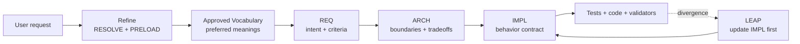

# Thesis: Certified TIED Workflows Make Downstream Review Exceptional

**TIED Methodology Version**: 3.0.0  
**Audience**: Product owners, engineers, reviewers, and people evaluating agentic software development.

## Thesis claim

> Once Vocabulary and REQ meaning are approved, certified TIED workflows can make downstream human review largely unnecessary. Human review becomes front-loaded and exception-based rather than repeated at every layer.

This thesis is intentionally scoped. **Certified** means that a defined TIED workflow, revision, repository, toolchain, and evidence set passed its declared checks. It does not mean that the original business intent is universally correct, that tests are complete, or that runtime behavior is safe in every environment.

## Abstract

Traditional software development asks humans to repeatedly reconstruct meaning as a request moves through tickets, designs, code, tests, and reviews. TIED changes the economics of that repetition:

1. the Vocabulary layer establishes preferred meanings and naming bridges;
2. REQ records approved intent, rationale, boundaries, and criteria;
3. ARCH records structural decisions and trade-offs;
4. IMPL pseudo-code records operational behavior before production code;
5. tests and code become executable realizations of that recorded intent;
6. validators check the connections and evidence;
7. LEAP repairs the written stack when implementation reality diverges.

The result is not merely more documentation. It is a machine-auditable translation chain from meaning to implementation. Once the semantic baseline is approved, downstream review can concentrate on changes to meaning, scope, risk, or evidence rather than rechecking every routine connection.

## 1. The semantic premise

A semantic token is useful because it is attached to a meaning that was established before the token was propagated:

```text
user language
  -> preferred Vocabulary term
  -> semantic token
  -> REQ
  -> ARCH
  -> IMPL pseudo-code
  -> tests
  -> production code
```

The token is not the meaning by itself. The meaning is established in the Vocabulary and REQ records; the token gives that meaning a stable identity that tools and agents can carry across files.

This creates two different kinds of work:

- **Semantic work** decides what a concept means and what the system must do.
- **Translation work** carries that approved meaning into architecture, implementation logic, tests, and code.

Human judgment is most valuable in the first category. Automation is strongest in the second.

## 2. How users establish Vocabulary and REQ meaning

TIED does not require users to author a complete YAML database by hand. Users establish meaning through interaction with planning and refinement workflows. The agent performs the mechanical recording, while the user supplies or confirms the semantic decisions.

### 2.1 Start with sponsor language

The user begins with an ordinary request:

```text
Add a feature that lets a project resume an interrupted task safely.
```

At this point, the words are context, not yet a complete requirement. They may contain ambiguous terms such as “resume,” “safe,” “task,” or “interrupted.”

### 2.2 Refine the request

`plan-new-feature` begins with **Refine**. `refine-plan` also begins with Refine when an existing linked plan is being improved.

During refinement:

1. the agent identifies ambiguous or overloaded terms;
2. the Vocabulary layer performs **RESOLVE** against preferred terms and synonyms;
3. the agent performs **PRELOAD** by routing the task to the relevant glossaries before reading the deeper TIED records;
4. the user answers clarification questions and corrects unintended interpretations;
5. the workflow records new preferred terms, distinctions, and naming bridges;
6. the request is bounded with goals, non-goals, examples, and observable behavior.

The user is not reviewing every later token occurrence. The user is establishing the semantic baseline from which later occurrences derive their meaning.

### 2.3 Convert meaning into a requirement

After ambiguity is cleared, the Plan phase turns the refined meaning into a REQ:

- what behavior must be true;
- why it matters;
- what is in and out of scope;
- what acceptance or satisfaction criteria apply;
- how the requirement will be validated;
- which risks or dependencies affect it.

The user confirms that the REQ says the right thing. The agent then records the REQ detail and index entry, registers the semantic token, and prepares the linked ARCH and IMPL work.

### 2.4 Establish the implementation contract

The Plan gate does not permit code merely because a REQ exists. The workflow resolves the architecture and implementation contract:

- ARCH defines boundaries, ownership, data flow, and alternatives;
- IMPL defines operational behavior in language-agnostic pseudo-code;
- each changed Active procedure has the applicable PRE, POST, EFFECTS, FAILURE_MODES, DATA_TRANSITION, and TERMINATION contract;
- each pseudo-code block carries the REQ, ARCH, and IMPL linkage required for traceability;
- the test strategy maps behavior blocks to unit, composition, or justified E2E evidence.

Only after this gate is satisfied can `build-plan` execute the approved plan. `build-plan` omits Refine and assumes that the linked plan is already approved; its sequence is Guiding Vocabulary → Plan → Implement.



The planning interaction therefore establishes meaning before the workflow begins repeating the meaning across implementation artifacts.

## 3. What certification can establish

A certified TIED workflow can verify that the recorded translation chain is internally connected and that the implemented behavior meets the declared executable checks.

Automated checks can verify that:

- every referenced semantic token exists in the registry;
- Vocabulary names, token names, record names, and documented identifiers are consistent;
- REQ, ARCH, and IMPL records have the required cross-references;
- project YAML and detail files are syntactically valid and canonicalized;
- the configured TIED base path points to the intended project;
- IMPL pseudo-code has the required block comments and structural contracts;
- procedures, branches, dependencies, and failure modes are represented well enough for the applicable pseudo-code validator;
- tests reference the intended requirements and implementation blocks;
- production code carries the required token and block relationships;
- unit tests cover module behavior before integration;
- composition tests cover bindings between validated units without hiding wiring defects inside E2E;
- E2E behavior is limited to boundaries that genuinely require UI or platform invocation;
- declared quality commands ran with recorded environment, tool, threshold, result, and artifact provenance;
- feature lifecycle transitions, revisions, references, and generated-view freshness are valid when feature orchestration is enabled;
- TIED consistency, vocabulary structure, binding inventory, test adequacy, and verification-gated status checks pass;
- an observed divergence is either reconciled through LEAP or remains explicitly unresolved.

These checks replace repeated human inspection of mechanical propagation. They do not replace judgment about what the system ought to mean.

## 4. Where human judgment remains necessary

Human judgment remains necessary at semantic boundaries:

- selecting the preferred meaning when sponsor language is ambiguous;
- deciding whether two similar terms are synonyms or distinct concepts;
- confirming that a Vocabulary term reflects the product domain rather than merely the current implementation;
- approving REQ rationale, priority, constraints, non-goals, and acceptance criteria;
- deciding whether the architecture’s boundaries and rejected alternatives are acceptable;
- deciding whether a quality profile applies to the change;
- accepting residual risk, waivers, exceptions, or incomplete evidence;
- distinguishing a product defect from an approved specification change, missing specification, implementation lag, or translation defect;
- approving feedback, research findings, or LEAP proposals for promotion into canonical project intent;
- judging whether the tests are meaningful rather than merely present;
- approving external assumptions, regulatory interpretations, user impact, and release readiness.

These are not repetitive connection checks. They are decisions about meaning, authority, risk, and the world outside the repository.

## 5. What was developed versus what was intended

TIED makes the distinction between intention and implementation explicit. A useful fidelity model has six states:

### Intended meaning

The approved Vocabulary and REQ define what the project means and what must be true.

This is the semantic baseline. It is not inferred from code.

### Encoded design

ARCH and IMPL translate the REQ into system boundaries and operational behavior.

This shows how the project intends to realize the requirement. It is not yet evidence that the code does so.

### Implemented behavior

Production code realizes the IMPL, and tests exercise the relevant paths.

This is what the current revision was built to do. It may still contain defects or uncovered behavior.

### Observed behavior

Tests, quality commands, validators, and runtime evidence report what was observed under declared conditions.

This is evidence about a bounded execution, not a universal statement about all inputs, environments, or users.

### Fidelity

Fidelity analysis compares both directions:

- pseudo-code → tests and code: did every intended behavior receive an implementation and evidence path?
- tests and code → pseudo-code: did implementation reality introduce behavior that the specification does not explain?

This is where TIED’s fidelity research distinguishes specification change, implementation lag, missing specification, translation defects, binding defects, and unresolved cases.

### Certified conformance

Certification means that, for a stated scope, revision, environment, and evidence set:

```text
approved meaning
  -> recorded intent
  -> declared design and behavior
  -> tested implementation
  -> passing structural and quality gates
```

has no unaddressed connection or evidence failure within the certification boundary.

Certification does not prove that the approved meaning was wise, that the tests cover every possible behavior, or that the product satisfies every human expectation.

## 6. Why review becomes front-loaded and exceptional

Without a semantic baseline, every layer requires fresh interpretation:

```text
What did the request mean?
Did the design preserve it?
Did the implementation change it?
Do these tests prove the same thing?
Did the code introduce an unrecorded behavior?
```

With an approved Vocabulary and REQ, most downstream questions become mechanical:

```text
Does the reference resolve?
Does the record link?
Does the IMPL cover the REQ?
Does the test cover the IMPL block?
Does the code match the tested behavior?
Did the declared checks pass?
```

The workflow can answer those questions repeatedly and consistently. Human review is then triggered by exceptions:

- a new or changed meaning;
- a changed REQ or scope;
- a new architectural alternative;
- a changed risk profile;
- missing or contradictory evidence;
- a failed validator or test;
- a code/test divergence;
- a waiver, exception, or promotion decision.

The review budget moves from checking repetition to deciding semantics.

## 7. Limits of the thesis

This thesis does not claim that TIED creates formal verification automatically. It claims that TIED can certify preservation and evidence of an approved meaning within an explicit workflow boundary.

The distinction matters:

- `tied_validate_consistency` can prove record and graph consistency;
- pseudo-code validation can prove structural properties of the IMPL representation;
- tests can prove observed behavior for covered cases;
- quality evidence can prove that declared checks ran and produced bounded results;
- fidelity analysis can locate divergence between specification and implementation;
- none of these alone proves universal runtime correctness, security, usability, compliance, or stakeholder satisfaction.

The stronger the certification claim, the stronger the required controls must be: trusted Vocabulary and REQ approval, adequate tests, appropriate quality profiles, reproducible evidence, complete fidelity analysis, and explicit handling of residual risk.

## 8. Conclusion

The full TIED methodology makes a different allocation of human and machine work:

- humans establish and approve meaning;
- agents record and propagate that meaning;
- validators check identity, structure, coverage, and evidence;
- tests and quality tools observe bounded behavior;
- LEAP repairs the specification when implementation reality changes;
- humans return when meaning, scope, risk, or authority changes.

The resulting claim is therefore:

> Once Vocabulary and REQ meaning are approved, and the TIED workflow is certified for an explicit scope and revision, downstream human review of routine traceability and propagation can be largely unnecessary. Human review becomes front-loaded and exception-based rather than repeated at every layer.

TIED does not remove human responsibility. It concentrates human responsibility at the places where machines cannot decide what the project should mean.

## Related documents

- [TIED Value Proposition Matrix](tied-value-proposition-matrix.md)
- [Vocabulary layer, TIED, LEAP, and CITDP](vocabulary-layer-tied-leap-citdp.md)
- [TIED fidelity research methodology](../tied/docs/tied-fidelity-research.md)
- [Client development index](../tied/docs/client-development-index.md)
- [TIED processes](../tied/docs/processes.md)
- [Implementation decisions and pseudo-code](../tied/docs/implementation-decisions.md)
- [LEAP: Logic Elevation And Propagation](../tied/docs/LEAP.md)
- [Quality evidence manifest](../tied/docs/quality-evidence-manifest.md)

---

*This is an explanatory thesis, not a canonical requirement, architecture decision, implementation decision, or certification record. Certification claims must be defined and evidenced by the project that makes them.*
