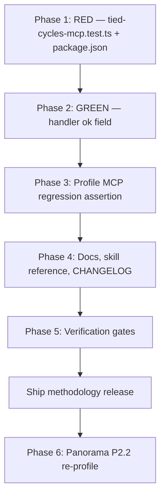

# Plan: `tied_cycles` MCP tool must emit `ok` aligned with `has_cycles`

**Status:** Refined plan (2026-08-27; `refine-plan` pass)  
**Fix ID:** `FIX-TIED_CYCLES_OK_FIELD`  
**Priority:** Medium  
**Owner:** TIED methodology repository (`stdd`) — MCP server maintainers  
**Reporter:** Panorama client — `TIED-3.0-ALIGNMENT-SYNC` follow-on P2.1 investigation  
**Blocks:** Panorama P2.2 E4 re-profile (external tranche 5)

**Canonical terminology:** “MCP tool contract” means the JSON body returned by a registered MCP handler. “Structural partition” means `evidence_chain.structural[]` rows produced when `evidence_chain_profile_generate` runs with `invoke_structural_validators: true`. “Graph partition” means `evidence_chain.graph` cycle counts from `collectGraphCounts()` (independent of the MCP `tied_cycles` response shape). “Live structural validators” means `createLiveStructuralValidators()` callbacks wired by the evidence-chain MCP handler — they call `findCycles()` directly and **do not** invoke the `tied_cycles` MCP tool.

---

## 0. Refine outcomes

This pass resolves ambiguities and makes the plan implementation-ready. No code changes in this pass.

| Preferred term | Canonical meaning |
|---|---|
| **MCP contract gap** | `tied_cycles` handler omits `ok`; cycle detection is correct |
| **Live validator path** | Profile generation with `invoke_structural_validators: true` uses `createLiveStructuralValidators().cycles` → already `{ ok: reqCycles.length === 0 && implCycles.length === 0 }` |
| **E4 structural comparison** | Panorama workflow that invokes the standalone `tied_cycles` MCP tool and compares raw JSON to profile structural rows |
| **Option B (adapter fallback)** | Normalization layer that maps MCP JSON → `ok` when the field is absent |

**Resolved decisions:**

1. **Option B is not needed in this repository.** Grep across `mcp-server/` shows no code parses raw `tied_cycles` MCP JSON for `.ok`. Profile generation uses live validators only (`mcp-server/src/fidelity-research/evidence-chain-profile.ts` ~1932–1944; `live-structural-validators.ts` ~100–104). Fix at the MCP handler (Option A) only.
2. **Panorama E4 false-negative is an MCP-contract issue, not a profile bug.** `working/evidence-chain/stdd-integrated.json` already records structural `tied_cycles` `ok: true` on this repo via live validators. E4 compares MCP tool output (missing `ok`) to profile rows → `structural_validator_delta`.
3. **Acceptance criterion #3** (profile structural row `ok: true`) is already satisfied on zero-cycle trees; Phase 3 adds an explicit regression assertion, not new profile logic.
4. **`depth_tier: minimal`** for implementation tracking — additive MCP field, no algorithm or bootstrap behavior change.
5. **CITDP persistence deferred** for build execution under operational fix policy; reference `FIX-TIED_CYCLES_OK_FIELD` in PR and Panorama handoff only.

**Vocabulary RECORD/VALIDATE:** Terms above recorded in this plan; no new glossary file required. Cross-reference `[PROC-TIED_DEPENDENCY_GRAPH]`, `[REQ-EVIDENCE_CHAIN_PROFILE]`, and `tied/vocab/tied-yaml-mcp.md` at doc update time.

---

## Problem statement

The `tied_cycles` MCP tool returns `{ cycles, has_cycles }` but **omits** `ok`. Downstream E4 structural-comparison workflows normalize validator results through a shared `ok` predicate. When `ok` is absent, adapters treat the check as failed even when the graph has zero cycles.

| Layer | Observed | Expected |
|-------|----------|----------|
| `tied_cycles` MCP JSON | `{ cycles: [], has_cycles: false }` — no `ok` | `{ cycles: [], has_cycles: false, ok: true }` |
| E4 structural comparison (Panorama) | MCP-side `tied_cycles` row `ok: false` while `graph.cycles === 0` | MCP JSON `ok: true` when `cycles.length === 0` |
| Profile structural row (this repo) | `ok: true` via live validators (already correct) | Unchanged |
| Panorama project YAML | No circular REQ dependencies | Unchanged — **not** a client product defect |

**Symptom:** E4 structural comparison shows `tied_cycles` `ok` flipping `true → false` on the MCP arm while cycle counts remain `0`.

**Root cause:** Contract inconsistency at the MCP handler — not incorrect cycle detection. `findCycles()` in `dependency-graph.ts` and graph counts in `collectGraphCounts()` are already correct.

### Current code (verified 2026-08-27)

**MCP handler** — `mcp-server/src/tools/index.ts` lines 1271–1279:

```typescript
const cycles = findCycles(g);
return textContent(
  JSON.stringify({ cycles, has_cycles: cycles.length > 0 }, null, 2)
);
```

**Live structural validators** — `mcp-server/src/fidelity-research/live-structural-validators.ts` lines 100–104 (does **not** call `tied_cycles` MCP):

```typescript
cycles: () => {
  const reqCycles = findCycles(buildRequirementGraph());
  const implCycles = findCycles(buildImplementationGraph());
  return { ok: reqCycles.length === 0 && implCycles.length === 0 };
},
```

**Evidence-chain wiring** — `evidence_chain_profile_generate` attaches live validators when `invoke_structural_validators: true` (`mcp-server/src/tools/index.ts` ~1932–1944). Structural rows are built by `runStructuralAnalysis()` mapping validator `ok` into `value.ok` (`structural-analysis.ts` ~62–68).

**Derivation rule (canonical):**

```text
ok === !has_cycles
     === (cycles.length === 0)
```

For the default `graph: "requirements"` parameter, `ok` reflects requirement-graph cycles only. For `graph: "implementation"`, `ok` reflects implementation-graph cycles only. This matches single-graph MCP scope; live validators check **both** graphs (stricter). Document in skill reference; do not change live-validator semantics in this fix.

---

## Scope and acceptance criteria

### In scope

- Add `ok: !has_cycles` to `tied_cycles` MCP JSON in `mcp-server/src/tools/index.ts`.
- Update MCP tool `description` string to mention `ok`.
- New contract test file `mcp-server/src/tools/tied-cycles-mcp.test.ts` plus **registration in `mcp-server/package.json`** `test` script (tools tests are explicitly listed, not globbed).
- Extend `mcp-server/src/fidelity-research/evidence-chain-profile.mcp.test.ts` with explicit `tied_cycles` structural-row assertion (regression guard).
- Update `tools/bundled-tied-yaml-skill/reference.md`, `tied/vocab/tied-yaml-mcp.md`, and `CHANGELOG.md`.

### Out of scope

- Changing cycle-detection algorithms, graph builders, or `has_cycles` semantics.
- Modifying live-validator dual-graph logic in `live-structural-validators.ts`.
- Modifying Panorama project YAML or client CITDP records (client Phase 6 only).
- Option B adapter fallback (no in-repo consumer; rejected — see §0).
- Adding `ok` to `tied_backlog` responses (separate contract).
- New REQ/ARCH/IMPL tokens unless sponsor mandates traceability (see Phase 5).
- Refreshing golden profile fixtures under `working/evidence-chain/` (optional; not required for ship).

### Done when

1. `tied_cycles` returns `ok: true` when `cycles` is empty and `has_cycles` is `false`.
2. `tied_cycles` returns `ok: false` when `has_cycles` is `true` (non-empty `cycles`).
3. `evidence_chain_profile_generate` with `invoke_structural_validators: true` at integrated depth records structural row `value.validator === "tied_cycles"` with `value.ok === true` on this repo's zero-cycle tree (regression test).
4. Existing callers reading only `cycles` / `has_cycles` remain unaffected (additive field).
5. `cd mcp-server && npm test` passes (includes new contract test).
6. Panorama P2.2 can clear `structural_validator_delta` for `tied_cycles` and shorten/remove CITDP waiver at `evidence.validator_hygiene.tied_cycles` (client action after ship).

---

## Fix options

| Option | Location | Disposition |
|--------|----------|-------------|
| **A — MCP handler** | `mcp-server/src/tools/index.ts` — `tied_cycles` handler (~1271–1279) | **Required.** Single-line contract fix at source. |
| **B — Profile adapter fallback** | Any normalization layer parsing raw `tied_cycles` MCP JSON | **Rejected for this repo.** No in-repo parser found; Panorama E4 compares external MCP JSON — fixed by Option A. |
| **Do not** | `dependency-graph.ts`, `live-structural-validators.ts`, `collectGraphCounts()` | No cycle-logic changes. |

---

## Phase 1 — RED: contract tests for `tied_cycles` (required)

**Priority:** P0 — gates the fix.

### Test file

Create **`mcp-server/src/tools/tied-cycles-mcp.test.ts`**.

Follow patterns from `batch-5-mcp.test.ts` (`allTools`, `tool(name).handler`, `JSON.parse(response.content[0].text)`) and temp-fixture setup from `citdp-writer.test.ts` / `verify.test.ts` (`TIED_BASE_PATH`, `clearBasePathCache()`).

Register in **`mcp-server/package.json`** — add `dist/tools/tied-cycles-mcp.test.js` to the `test` script immediately after `dist/tools/batch-5-mcp.test.js`.

### Test harness setup

```typescript
import { clearBasePathCache } from "../yaml-loader.js";

function useRepoTiedBase() {
  process.env.TIED_BASE_PATH = path.resolve(process.cwd(), "..", "tied");
  clearBasePathCache();
}

function useTempTiedBase(root: string) {
  process.env.TIED_BASE_PATH = path.join(root, "tied");
  clearBasePathCache();
}
```

Run tests from `mcp-server/` (`npm test` cwd). Repo base path is `../tied` relative to `mcp-server/`.

### RED test cases (exact assertions)

| # | Case | Setup | Handler args | Assertions |
|---|------|-------|--------------|------------|
| 1 | Zero cycles — requirements | `useRepoTiedBase()` | `{}` or `{ graph: "requirements" }` | `typeof parsed.ok === "boolean"`; `parsed.has_cycles === false`; `parsed.cycles.length === 0`; **`parsed.ok === true`** |
| 2 | Zero cycles — implementation | `useRepoTiedBase()` | `{ graph: "implementation" }` | Same `ok`/`has_cycles`/`cycles` invariants |
| 3 | Non-empty cycles — requirements | Temp dir; write minimal `tied/requirements.yaml` with `REQ-CYCLE-A` → `depends_on: [REQ-CYCLE-B]` and `REQ-CYCLE-B` → `depends_on: [REQ-CYCLE-A]` | `{ graph: "requirements" }` | `parsed.has_cycles === true`; `parsed.cycles.length > 0`; **`parsed.ok === false`** |
| 4 | Derivation invariant | Either setup from #1 or #3 | Same | **`parsed.ok === !parsed.has_cycles`** |
| 5 | Backward compatibility | #1 setup | `{}` | `Array.isArray(parsed.cycles)`; `typeof parsed.has_cycles === "boolean"` (existing keys unchanged) |

Minimal cycle fixture YAML (case #3):

```yaml
REQ-CYCLE-A:
  related_requirements:
    depends_on: [REQ-CYCLE-B]
REQ-CYCLE-B:
  related_requirements:
    depends_on: [REQ-CYCLE-A]
```

Optional follow-up (not blocking): implementation-graph cycle fixture using `implementation-decisions.yaml` with `IMPL-CYCLE-A` / `IMPL-CYCLE-B` and `related_decisions.depends_on`.

### Token comments

Top-level describe block:

```typescript
// [IMPL-MCP_DEPENDENCY_GRAPH] [ARCH-TIED_STRUCTURE] [REQ-EVIDENCE_CHAIN_PROFILE]
// Contract: tied_cycles MCP JSON must expose ok aligned with has_cycles for E4 structural parity.
```

### Verify (RED)

```bash
cd mcp-server && npm run build && node --test dist/tools/tied-cycles-mcp.test.js
# Expect failure: parsed.ok is undefined (or test file missing from dist until first build)
```

---

## Phase 2 — GREEN: MCP handler change (required)

**Priority:** P0.

### Actions

1. In `tied_cycles` handler (`mcp-server/src/tools/index.ts` ~1276–1278), emit:

   ```typescript
   const has_cycles = cycles.length > 0;
   return textContent(
     JSON.stringify({ cycles, has_cycles, ok: !has_cycles }, null, 2)
   );
   ```

2. Update tool `description` (~1261–1262) to state response includes `cycles`, `has_cycles`, and `ok` (`ok === !has_cycles`).

3. **Do not** add Option B fallback — grep confirmed no in-repo MCP JSON parser.

4. Re-run Phase 1 tests — expect GREEN.

### Verify

```bash
cd mcp-server && npm run build && node --test dist/tools/tied-cycles-mcp.test.js
cd mcp-server && npm test
```

Manual MCP / CLI check from repo root (after build):

```bash
TIED_BASE_PATH="$(pwd)/tied" \
  .cursor/skills/tied-yaml/scripts/tied-cli.sh tied_cycles '{}'
# Expect JSON with cycles: [], has_cycles: false, ok: true
```

Implementation graph spot check:

```bash
TIED_BASE_PATH="$(pwd)/tied" \
  .cursor/skills/tied-yaml/scripts/tied-cli.sh tied_cycles '{"graph":"implementation"}'
```

---

## Phase 3 — Evidence-chain regression assertion (required)

**Priority:** P1 — confirms acceptance criterion #3; **no profile production-code change expected**.

Live validators already produce `tied_cycles` `ok: true` on zero-cycle trees. This phase locks that behavior and documents the MCP vs live-validator split.

### Actions

1. Extend **`mcp-server/src/fidelity-research/evidence-chain-profile.mcp.test.ts`** — add test case inside existing `describe("evidence_chain_profile_generate MCP binding ...")`:

   ```typescript
   it("records tied_cycles structural row ok:true when invoke_structural_validators is true on zero-cycle tree", async () => {
     const tiedBasePath = path.resolve(process.cwd(), "..", "tied");
     process.env.TIED_BASE_PATH = tiedBasePath;
     clearBasePathCache();
     const projectRoot = path.resolve(tiedBasePath, "..");
     const generate = handler("evidence_chain_profile_generate");
     const result = body(await generate({
       project_root: projectRoot,
       tied_base_path: tiedBasePath,
       profile_depth: "integrated",
       invoke_structural_validators: true,
       run_metadata: { run_id: "mcp-cycles-ok", commit: "local" },
     }));
     assert.equal(result.ok, true);
     const structural = (result.profile as { evidence_chain?: { structural?: Array<{ value?: { validator?: string; ok?: boolean } }> } } })
       .evidence_chain?.structural ?? [];
     const cyclesRow = structural.find((row) => row.value?.validator === "tied_cycles");
     assert.ok(cyclesRow, "expected tied_cycles structural row");
     assert.equal(cyclesRow.value?.ok, true);
     const graph = (result.profile as { evidence_chain?: { graph?: { value?: { cycles?: number } } } }).evidence_chain?.graph;
     assert.equal(graph?.value?.cycles, 0);
   });
   ```

2. Optional: regenerate `working/evidence-chain/stdd-integrated.json` only if maintainers want fixture refresh in the same PR (not required).

### Verify

```bash
cd mcp-server && npm run build
node --test dist/fidelity-research/evidence-chain-profile.mcp.test.js
```

Manual profile check from repo root:

```bash
TIED_BASE_PATH="$(pwd)/tied" \
  .cursor/skills/tied-yaml/scripts/tied-cli.sh evidence_chain_profile_generate \
  "$(cat <<'JSON'
{
  "project_root": "<repo-root>",
  "tied_base_path": "<repo-root>/tied",
  "profile_depth": "integrated",
  "invoke_structural_validators": true,
  "run_metadata": { "run_id": "fix-tied-cycles-ok", "commit": "local" }
}
JSON
)"
# Expect structural tied_cycles row value.ok: true; evidence_chain.graph.value.cycles: 0
```

Replace `<repo-root>` with absolute path to `stdd`.

---

## Phase 4 — Documentation and bundled skill (required)

**Priority:** P1.

### Actions

1. **`tools/bundled-tied-yaml-skill/reference.md`** — under `### tied_cycles`, add response fields table:

   | Field | Type | Description |
   |-------|------|-------------|
   | `cycles` | array | List of cycle paths (each path is a token array) |
   | `has_cycles` | boolean | `true` when `cycles.length > 0` |
   | `ok` | boolean | Pass/fail for the selected graph: `ok === !has_cycles` |

2. **`tied/vocab/tied-yaml-mcp.md`** — extend MCP catalog note for `tied_cycles`: structural tools expose **`ok`** as pass/fail; for `tied_cycles`, `ok === !has_cycles` for the requested `graph` scope.

3. **`CHANGELOG.md`** — entry under MCP tools: `tied_cycles` now includes `ok` aligned with `has_cycles` for evidence-chain / E4 structural parity.

4. **`copy_files.sh` client install:** bundled skill update in `tools/bundled-tied-yaml-skill/` is the source; clients receive it on next bootstrap. No `copy_files.sh` smoke required for methodology-repo merge unless validating install path.

---

## Phase 5 — TIED traceability and implement gates (minimal)

**Priority:** P2 — methodology-repo policy.

Operational fix on existing MCP tooling referenced by `[PROC-TIED_DEPENDENCY_GRAPH]` and `[REQ-EVIDENCE_CHAIN_PROFILE]`. Full new REQ/ARCH/IMPL stack is **not** required unless sponsor mandates a tracked change request.

| Artifact | Action |
|----------|--------|
| `[PROC-TIED_DEPENDENCY_GRAPH]` | Optional one-line note: `tied_cycles` returns `ok` alongside `has_cycles`. |
| `[REQ-EVIDENCE_CHAIN_PROFILE]` | No scope change; structural validator parity already in intent. |
| Client CITDP / LEAP | None in methodology repo. Panorama owns waiver removal. |

### Implement gate (for `build-plan` execution)

Before marking complete, executor must satisfy:

| Gate | Command / artifact | Pass criterion |
|------|-------------------|----------------|
| Unit RED → GREEN | Phase 1 then Phase 2 | New contract tests pass |
| Composition regression | Phase 3 | `evidence-chain-profile.mcp.test.js` passes |
| TypeScript build | `cd mcp-server && npm run build` | Exit 0 |
| Full MCP suite | `cd mcp-server && npm test` | Exit 0 |
| Manual MCP contract | `tied-cli.sh tied_cycles '{}'` | JSON includes `ok: true` on zero-cycle tree |
| TIED consistency | `tied-cli.sh tied_validate_consistency` with `TIED_BASE_PATH=<repo>/tied` | `ok: true` |
| Docs | Phase 4 files | Response shape documented |

**Tracker (create at build time):** copy `tied/docs/agent-req-implementation-checklist.yaml` to  
`working/FIX-TIED_CYCLES_OK_FIELD/tracker-20260827.yaml`  
and record steps: RED contract tests → GREEN handler → profile regression → docs → verification.

**Risk profile for build:** `depth_tier: minimal`; `gate_policy: advisory`; no adversarial-inquiry activation required for this contract fix.

**CITDP:** defer persistence; reference `FIX-TIED_CYCLES_OK_FIELD` in PR description and Panorama investigation link.

**Pseudo-code:** no new IMPL blocks required; if `[PROC-TIED_DEPENDENCY_GRAPH]` prose is updated, no pseudo-code sidecar change unless sponsor requires it.

---

## Phase 6 — Downstream client unblock (Panorama P2.2)

**Priority:** After methodology release — client-owned.

Executed in Panorama repo after consuming fixed TIED version (`copy_files.sh` / MCP rebuild):

1. Re-run `evidence_chain_profile_generate` at integrated depth with `invoke_structural_validators: true`.
2. Regenerate `working/TIED-3.0-ALIGNMENT-SYNC/e4-structural-comparison.v1.json`.
3. Confirm `structural_validator_delta` for `tied_cycles` is cleared (MCP JSON now includes `ok`).
4. Remove or shorten CITDP waiver at `evidence.validator_hygiene.tied_cycles` (expiry `2026-11-27`) if parity restored.

**Client artifacts (reference):**

- `working/TIED-3.0-ALIGNMENT-SYNC/tied-cycles-investigation.md`
- `working/TIED-3.0-ALIGNMENT-SYNC/e4-structural-comparison.v1.json`
- `working/TIED-3.0-ALIGNMENT-SYNC/evidence-chain-profile-e4-post.v1.json`
- `working/TIED-3.0-ALIGNMENT-SYNC/e0-pilot-baseline-reference.v1.json`
- `tied/citdp/CITDP-TIED-3.0-ALIGNMENT-SYNC.yaml`

**Panorama MCP target check:** confirm `tied_config_get_base_path` before writes ([AGENTS.md](../AGENTS.md)).

---

## Execution order



**Smallest shippable slice:** Phases 1–4 plus full `mcp-server` `npm test` and manual `tied-cli.sh tied_cycles` check. Phase 5 tracker optional at refine time; required at build close-out. Phase 6 is client rollout.

---

## Risk notes

- **Additive contract only:** Do not remove or rename `cycles` / `has_cycles`.
- **Single-graph vs dual-graph ok:** MCP `tied_cycles` `ok` reflects the requested `graph` only; live validators require **both** REQ and IMPL graphs acyclic. E4 must compare like scopes (MCP per-graph vs profile dual-graph). Document in skill reference; do not unify semantics in this fix.
- **Do not conflate graph partition with structural ok:** `evidence_chain.graph` uses `collectGraphCounts()`; structural `tied_cycles` row uses live validators. Both should agree on zero cycles for this repo but serve different proof-boundary roles.
- **Test script registration:** Forgetting `package.json` registration silently skips the new test file — include in Phase 1 checklist.
- **Wrong TIED_BASE_PATH:** Tests and Panorama re-profile must set `TIED_BASE_PATH` to the intended project's `tied/`.

---

## Verification checklist (close-out)

- [ ] `tied_cycles` JSON includes `ok: true` for empty `cycles` (requirements and implementation graphs)
- [ ] `tied_cycles` JSON includes `ok: false` when cycles present (fixture-backed test)
- [ ] `dist/tools/tied-cycles-mcp.test.js` registered in `package.json` and passes
- [ ] `evidence-chain-profile.mcp.test.js` asserts `tied_cycles` structural row `ok: true`
- [ ] `npm test` in `mcp-server/` passes
- [ ] `tied-cli.sh tied_cycles '{}'` returns `ok: true` on methodology repo
- [ ] Bundled skill reference and `tied/vocab/tied-yaml-mcp.md` updated
- [ ] `CHANGELOG.md` updated
- [ ] `tied_validate_consistency` passes on repo `tied/`
- [ ] Panorama notified to execute Phase 6 on pinned TIED version

---

## Related documents

- [tied-project-alignment-recommendations.md](tied-project-alignment-recommendations.md) — cohort structural validator observations
- [tied-methodology-evaluation-framework.md](tied-methodology-evaluation-framework.md) — `tied_cycles` in evaluation matrix
- [tied-fidelity-research-plan.md](tied-fidelity-research-plan.md) — evidence-chain profile context
- [methodology-detail-files-bootstrap-fix-plan.md](methodology-detail-files-bootstrap-fix-plan.md) — plan format and implement-gate reference
- Panorama: `working/TIED-3.0-ALIGNMENT-SYNC/tied-cycles-investigation.md` (client repo)
