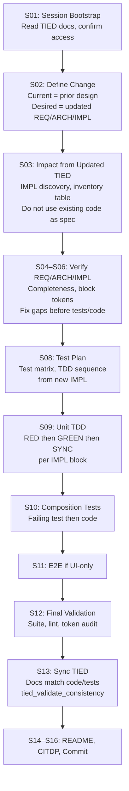

# TIED-First Implementation Procedure

**Audience**: AI agents and developers. Process token: `[PROC-TIED_FIRST_IMPLEMENTATION]`.

**Purpose**: Single reference for implementing when REQ+ARCH+IMPL have already been updated in TIED and implementation (tests + code) is pending. Ensures agents treat the updated IMPL as the source of truth, verify REQ/ARCH/IMPL completeness, then run impact analysis and strict TDD from the new design—replacing or rewriting existing tests and code to match.

---

## When This Procedure Applies

- REQ/ARCH/IMPL (and IMPL `essence_pseudocode` with block token comments) have been **authored or updated** in the TIED indexes and detail files.
- Tests and/or code still reflect a **prior design** or are **missing** for the new design.
- The remaining work is to **align tests and code** with the updated TIED stack.

---

## Relationship to the Agent Checklist

This procedure uses [agent-req-implementation-checklist.md](agent-req-implementation-checklist.md) (`[PROC-AGENT_REQ_CHECKLIST]`) as the base. It defines a **variant**: same step sequence (S01–S16) with specific entry-point semantics and step modifiers. The agent executes the checklist from S01; the following sections describe how S02–S06 differ when TIED is already prepared.

---

## Entry Point and Step Modifiers

### Entry point

**Start at S01** (Session Bootstrap). Complete S01 as in the main checklist (read `ai-principles.md`, review semantic tokens, architecture and implementation indexes, implementation-decisions guide, confirm MCP and priority order).

### S02: Define Change

- **Current behavior**: Prior design—existing tests and code as they are today.
- **Desired behavior**: New design described by the **updated** REQ/ARCH/IMPL.
- **Unchanged behavior**: Explicit boundaries of what is not affected by this change.
- **Non-goals**: What this work intentionally does not address.
- **Success criteria**: All tests and code align to the **new** IMPL; three-way alignment (pseudo-code ↔ tests ↔ code) holds; `tied_validate_consistency` passes.

Use the **updated** TIED stack as the source of "desired behavior"; existing tests/code are "current behavior" to be replaced or updated.

### S03: Impact Analysis and IMPL Discovery

- Build impact and IMPL inventory from the **updated** REQ/ARCH/IMPL and related links (composed_with, depends_on, shared REQ/ARCH, code_locations, source grep for `[IMPL-*]`).
- **Do not** treat existing code as the source of truth for what to implement. The updated IMPL pseudo-code defines the target; existing code and tests are inputs to the impact table (files/functions that may need to change), not the specification.

### S04–S06: REQ/ARCH/IMPL — Verify Only

REQ/ARCH/IMPL are already updated; do **not** re-author from scratch.

- **Verify** REQ/ARCH/IMPL index and detail files are complete (all required fields, tokens in `semantic-tokens.yaml`).
- **Verify** IMPL pseudo-code per checklist S06.1–S06.5:
  - Contracts: INPUT/OUTPUT/DATA (and CONTROL when present) declared; procedure names and key branches/loops/error paths present.
  - No insufficient specs: no missing contracts, undefined procedures, unhandled error paths, stub pseudo-code on Active IMPLs, or blocks without token comments.
  - No contradictory specs across IMPLs (shared DATA, ordering, OUTPUT types, duplicate logic).
  - **Every block** has a token comment per `[PROC-IMPL_PSEUDOCODE_TOKENS]` (top-level and sub-blocks naming REQ/ARCH/IMPL and how the block implements them).
- **If** something is missing or wrong: fix in IMPL first (then ARCH/REQ if scope changed); re-validate YAML (`yq -i -P` or equivalent); then proceed to tests/code. Do not proceed with gaps in pseudo-code.

### S07–S16: Execute as in Main Checklist

- **S07**: Risk analysis (risks with token references, mitigations).
- **S08**: Test determination and planning (testability classification, test matrix, TDD sequence from **new** IMPL).
- **S09**: Unit TDD (Phases D–F): RED → GREEN → REFACTOR → SYNC per IMPL block; three-way alignment; SUB-LEAP-MICRO if GREEN reveals pseudo-code wrong.
- **S10**: Composition testing (bindings; failing composition test then composition code).
- **S11**: E2E (only for behavior requiring UI invocation; justify `e2e_only_reason`).
- **S12**: Final validation (full suite, lint, token validation, three-way audit, IMPL metadata).
- **S13**: Sync TIED to code and tests; run `tied_validate_consistency`.
- **S14**: README and CHANGELOG.
- **S15**: Persist CITDP record.
- **S16**: Commit per `[PROC-COMMIT_MESSAGES]`.

No changes to the task content of S07–S16; only the source of "what to implement" is the updated TIED stack.

---

## Strict TDD from New IMPL

- Tests are written to **conform to** the updated IMPL pseudo-code. They are written **before** production code (RED first).
- **Existing tests** that encode the **old** design must be **updated or removed** so they do not assert prior behavior that contradicts the new IMPL. Do not leave passing tests that validate the old design.
- Production code is written **only** to satisfy the new tests (GREEN). No production code without a preceding failing test.
- **Entire** IMPL pseudo-code is implemented via TDD: write failing test → make it pass → refactor; repeat until every IMPL block is covered and all unit tests pass.

---

## Three-Way Alignment and LEAP

- **Three-way alignment**: For every IMPL block, pseudo-code, test, and code must carry the **same** REQ/ARCH/IMPL token set with logically corresponding descriptions (what the block implements / what the test validates / how the code implements).
- **LEAP**: If during GREEN the pseudo-code is found incomplete, wrong, or missing a dependency: **SUB-LEAP-MICRO**. Stop; update IMPL first; then test; then code. Never fix only in code and defer docs.

---

## Flow Diagram

---

## References

| Document | What it provides |
|----------|------------------|
| [agent-req-implementation-checklist.md](agent-req-implementation-checklist.md) | Full step sequence S01–S16; SUB-YAML, SUB-LEAP-MICRO; flow control |
| [impl-code-test-linkage.md](impl-code-test-linkage.md) | Three-way alignment, phases A–I, LEAP micro-cycle during TDD |
| [implementation-order.md](implementation-order.md) | Mandatory order: unit tests → unit code (TDD) → composition tests → composition code → E2E → close loop |
| [processes.md](../processes.md) | § LEAP, § PROC-TIED_DEV_CYCLE, § PROC-IMPL_CODE_TEST_SYNC, § PROC-IMPL_PSEUDOCODE_TOKENS |
| [AGENTS.md](../AGENTS.md) | Agent operating guide; session bootstrap; mandatory acknowledgment |
