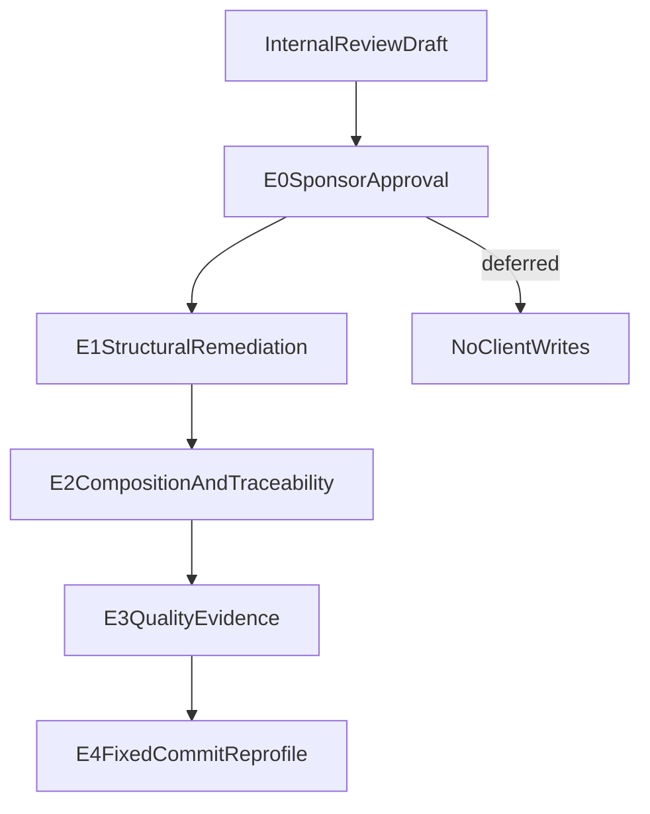

# TIED Client Alignment Recommendations

**Status:** E0 approved (2026-08-27)  
**Evidence date:** 2026-08-27  
**Audience:** TIED methodology sponsors and maintainers of nsync, panorama, treegrep, and indescript

> **Execution boundary:** Phase 1 pilot observations and E0 approval live in the TIED methodology repository (`stdd`). Client remediation (E1–E4) runs in each client repository under a separate per-client tracker. See [`working/evaluation/client-remediation-handoffs.yaml`](../working/evaluation/client-remediation-handoffs.yaml). Do not edit client project YAML or the inherited methodology snapshot from this document alone.

## A. Charter and scope

This document translates the Phase 1 operator pilot into actionable alignment
recommendations for four TIED clients. It complements the
[TIED Methodology Evaluation Framework](tied-methodology-evaluation-framework.md);
the framework defines the evaluation questions and evidence program, while this
document identifies practical next actions.

The recommendations use TIED 3.0 vocabulary and preserve the distinction between:

- **observed (structural):** a result emitted by a structural validator or an
  evidence-chain profile;
- **observed (executable):** a retained test or lint result with command
  provenance and exit status;
- **observed (supplemental):** a manual audit result with explicit command or
  path provenance;
- **recommended:** work not yet performed;
- **residual risk:** a limitation that remains after the available evidence or
  recommendation.

The clients are listed alphabetically. The list is not a ranking. Structural
completeness, test results, and quality evidence answer different questions and
must not be collapsed into a single cross-project judgment.

### Governing TIED references

- [`tied/docs/ai-principles.md`](../tied/docs/ai-principles.md) — documentation-first flow, LEAP, module validation, and evidence obligations.
- [`tied/docs/implementation-decisions.md`](../tied/docs/implementation-decisions.md) — IMPL pseudo-code grammar and contract precision.
- [`tied/docs/pseudocode-writing-and-validation.md`](../tied/docs/pseudocode-writing-and-validation.md) — pseudo-code validation and three-way alignment.
- [`tied/docs/composition-coverage.md`](../tied/docs/composition-coverage.md) — binding inventories, composition evidence, and E2E boundaries.
- [`tied/docs/evidence-chain-profile.md`](../tied/docs/evidence-chain-profile.md) — profile depths, denominators, and proof boundaries.
- [`tied/vocab/quality-assurance.md`](../tied/vocab/quality-assurance.md) — quality evidence, provenance, and risk-triggered assurance.
- [`tied/vocab/fidelity-research.md`](../tied/vocab/fidelity-research.md) — read-only research, finding lifecycle, and inquiry activation.
- [`tied/docs/agent-req-implementation-checklist.md`](../tied/docs/agent-req-implementation-checklist.md) — approved remediation sequencing.

## B. Evidence method and proof boundaries

### Fixed Phase 1 snapshot

The cross-client evidence is the strict v2 report generated from four accepted
profiles at `integrated` evidence-chain profile depth. The report has one
compatible denominator sub-cohort (`n=4`), no excluded inputs, and no
validation errors. Profile artifacts and reports are operator-local under
`working/evaluation/`; this document does not publish absolute client paths.

| Client alias | Fixed HEAD commit | Historical comparison | Language | Profile artifact |
|---|---|---|---|---|
| indescript | `76a3060026c81c4d1e42bcd26aba4a05b16fb246` | `140b9a558076150ca54da49a1afc24290d908d6b` (`first-tied`) | Swift | `profiles/indescript.v1.json` |
| nsync | `07aeca0fb6326c6d9f30e217e95f6e7e735a94ed` | `03a5985482d026d3ff05aac6dafb2b85fe19ae28` (`HEAD~5`) | Go | `profiles/nsync.v1.json` |
| panorama | `595d323e24e56642d83ed631124a0e14e70ace56` | `a3979737fcc1c30310048878c64d3b096fcbd94b` (`first-tied`) | TypeScript | `profiles/panorama.v1.json` |
| treegrep | `47f1530ceaebe1e384d3fccc95a879c3bb1b9657` | `f69c7d7639ad6d6d274dd06afef69f92864496ec` (`first-tied`) | Ruby | `profiles/treegrep.v1.json` |

Primary machine artifacts:

- [`working/evaluation/evaluation-corpus.v1.yaml`](../working/evaluation/evaluation-corpus.v1.yaml)
- [`working/evaluation/phase1-pilot-evidence-chain-report.yaml`](../working/evaluation/phase1-pilot-evidence-chain-report.yaml)
- [`working/evaluation/phase1-within-repo-evidence-chain-report.yaml`](../working/evaluation/phase1-within-repo-evidence-chain-report.yaml)
- [`working/evaluation/phase1-pilot-residual-risks.yaml`](../working/evaluation/phase1-pilot-residual-risks.yaml)
- [`working/evaluation/phase1-pilot-evidence-chain-report.md`](../working/evaluation/phase1-pilot-evidence-chain-report.md)

The operator used `invoke_structural_validators: true`. No verification
evidence manifest was attached, so every profile reports
`quality.command_results` as `not_measured` at the `executable_behavior` proof
boundary. The profiles also report vocabulary drift as `not_measured`.

### What each evidence source proves

| Evidence source | It establishes | It does not establish |
|---|---|---|
| `tied_validate_consistency` | TIED index, detail, and reference integrity at the snapshot | Runtime correctness, security, UX, or defect rate |
| `pseudocode_validate` | Pseudo-code shape, token comments, and applicable contract grammar | Agreement between pseudo-code and implementation |
| `traceability_gap_report` | Presence or absence of recorded REQ-to-test and related linkage | Test adequacy or binding behavior |
| `binding_inventory_validate` | Inventory schema and required binding fields | Correct runtime wiring or passing composition tests |
| Retained test/lint command result | The declared command completed with its recorded outcome | Complete TIED traceability or product quality |
| Evidence-chain report | Count-only structural measurements within a compatible cohort | Cross-project ranking or causal improvement |
| Human audit note | A supplemental observation bounded by its command/path provenance | A machine-validated result when provenance is absent |

These boundaries implement
[REQ-EVIDENCE_CHAIN_PROFILE](../tied/requirements/REQ-EVIDENCE_CHAIN_PROFILE.yaml),
[REQ-EVIDENCE_CHAIN_REPORT](../tied/requirements/REQ-EVIDENCE_CHAIN_REPORT.yaml),
[REQ-QUALITY_ASSURANCE_EVIDENCE](../tied/requirements/REQ-QUALITY_ASSURANCE_EVIDENCE.yaml),
and [REQ-TIED_FIDELITY_RESEARCH](../tied/requirements/REQ-TIED_FIDELITY_RESEARCH.yaml).

## C. Shared TIED 3.0 alignment themes

The following recommendations apply across clients. They are ordered by
dependency for remediation, not by client quality.

### 1. Repair the specification stack with LEAP

When tests or code differ from approved IMPL pseudo-code, use
[PROC-LEAP](../tied/docs/processes.md) to update IMPL first, then ARCH and REQ
when the intended scope changes. Do not silently encode a discovered behavior
only in code or tests.

### 2. Make changed Active blocks contract-precise

New and changed Active procedure blocks should declare `INPUT`, `OUTPUT`,
`PRE`, `POST`, and `EFFECTS`. Add `FAILURE_MODES` for fallible outcomes,
`DATA_TRANSITION` for mutable state, and `TERMINATION` for loops, recursion, or
open-ended waits. These are the SHAPE-003 through SHAPE-006 checks in
[PROC-PSEUDOCODE_VALIDATION](../tied/docs/processes.md).

### 3. Make pseudo-code sidecars discoverable and complete

Each product IMPL row should have a matching
`IMPL-*-pseudocode.md` sidecar, or an explicit documented exception. Sidecar
presence must be reconciled with index paths; an untracked sidecar is not
reproducible evidence from a pinned commit.

### 4. Preserve literal three-way alignment

Every logical pseudo-code block needs a block-lead comment naming the applicable
REQ, ARCH, and IMPL tokens and explaining how the block implements them. Copy
that lead literally into the corresponding test and production locations under
[PROC-IMPL_PSEUDOCODE_TOKENS](../tied/docs/processes.md) and
[PROC-IMPL_CODE_TEST_SYNC](../tied/docs/processes.md).

### 5. Validate modules before integrating them

Identify module boundaries, interfaces, contracts, edge cases, and failure
paths before integration. Validate each module independently with appropriate
unit and contract tests, then add integration coverage. This is the obligation
in [REQ-MODULE_VALIDATION](../tied/requirements/REQ-MODULE_VALIDATION.yaml)
and its [ARCH-MODULE_VALIDATION](../tied/architecture-decisions/ARCH-MODULE_VALIDATION.yaml)
and [IMPL-MODULE_VALIDATION](../tied/implementation-decisions/IMPL-MODULE_VALIDATION.yaml)
records.

### 6. Inventory and prove bindings at composition level

Maintain one row per trigger-to-callee binding with asserted arguments, effects,
ordering, failure behavior, composition test, and E2E decision. If the trigger
can be fired programmatically, prove it with a UI-free composition test.
Reserve E2E for a named platform constraint; E2E must supplement rather than
replace composition evidence.

### 7. Use vocabulary as an agent-control layer

For each approved remediation, use
[PROC-VOCABULARY_INDEX](../tied/docs/processes.md) at its three touchpoints:
`RESOLVE` sponsor terms, `PRELOAD` routed glossaries before reading project
artifacts, and `RECORD` new names. Perform `VALIDATE` before commit. Keep
methodology vocabulary and client vocabulary under their respective ownership
boundaries.

### 8. Attach executable evidence provenance

Select applicable quality attributes using
[PROC-QUALITY_ASSURANCE](../tied/docs/processes.md), collect declared commands
with `quality_evidence_collect_manifest`, and attach the resulting manifest to
`evidence_chain_profile_generate`. Preserve command identity, environment,
tool versions, thresholds, exit codes, and artifact references under
[PROC-QUALITY_EVIDENCE_PROVENANCE](../tied/docs/processes.md).

### 9. Treat `tied_verify` as policy-dependent

None of the four clients is treated as verification-gated by this pilot plan.
Use `tied_verify` only where the client explicitly enables
[PROC-TIED_VERIFICATION_GATED](../tied/docs/processes.md). When enabled, derive
status from test results rather than editing status by hand.

### 10. Re-profile after each remediation tranche

Generate a new evidence-chain profile at a pinned post-remediation commit.
Compare named structural fields and proof-boundary statuses only when schema,
profile depth, and denominators are compatible. Do not interpret a changed
structural field as proof of a causal product improvement without a separate
fidelity study.

## D. Per-client recommendations

The shared DRI for each client is **TBD — sponsor assign**. The owner field is
intentionally visible so sponsor assignment is part of the E0 approval record.

### D.1 indescript

**Snapshot:** `76a3060026c81c4d1e42bcd26aba4a05b16fb246`, Swift,
`profiles/indescript.v1.json`, project ID `af185e7e62bb1bfb`.

**Observed strengths (structural):** `pseudocode_validate`,
`binding_inventory_validate`, `test_adequacy_validate`, and
`tied_validate_consistency` reported success. The pilot recorded 184
pseudo-code sidecars.

**Observed gaps (structural):** `traceability_gap_report` and `tied_cycles`
reported failure. The profile does not measure vocabulary drift or executable
command results.

**Observed (supplemental):** The manual pilot audit reported a strong Swift
test and composition-test footprint, but formal contract precision on only a
minority of sidecars, incomplete REQ/IMPL test backlinks, persistent-shell
specification contradictions, and dual-package/test-harness evidence
complexity. These supplemental observations are not profile-derived and should
be rechecked when the corresponding remediation tracker opens.

**Shared DRI:** TBD — sponsor assign.

**Prioritized recommendations:**

- **P0 — Contract precision:** Expand `PRE`/`POST`/`EFFECTS` and applicable
  failure, state-transition, and termination clauses across changed Active
  blocks. Target: project IMPL detail files and their pseudo-code sidecars.
  Acceptance: strict `pseudocode_validate` passes with SHAPE-003 through
  SHAPE-006 findings resolved.
- **P0 — Specification contradictions:** Resolve the persistent-shell
  contradictions before changing implementation behavior. Target: the owning
  REQ/ARCH/IMPL records and the shell-related test strategy. Acceptance:
  one explicit intended behavior with aligned tests and no unresolved
  contradictory-specification finding.
- **P1 — Backlinks and composition:** Complete REQ/IMPL test backlinks and
  expand binding inventory rows for shell, package, and harness seams.
  Acceptance: `traceability_gap_report` improves; every composition-testable
  row has a UI-free composition test.
- **P2 — Risk-triggered inquiry:** For shell and remote boundaries, run
  integrated [REQ-TIED_ADVERSARIAL_INQUIRY](../tied/requirements/REQ-TIED_ADVERSARIAL_INQUIRY.yaml)
  inquiry with explicit scope and bounded phase artifacts. Acceptance:
  paired inquiry metric and four identity-bound artifacts, or a documented
  advisory result and residual risk.
- **P2 — Evidence attachment:** Attach a verification evidence manifest to the
  next behavior-changing profile. Acceptance: `quality.command_results` is
  observed with command provenance rather than `not_measured`.

**Follow-up profile:** Pin the commit after the P0 tranche and regenerate the
profile with the same scope and compatible denominators.

**Residual risk:** Structural success does not establish shell correctness,
remote reliability, security, or user-facing behavior.

### D.2 nsync

**Snapshot:** `07aeca0fb6326c6d9f30e217e95f6e7e735a94ed`, Go,
`profiles/nsync.v1.json`, project ID `8cc4c7db8ac063e6`.

**Observed strengths (structural):** `binding_inventory_validate`,
`pseudocode_validate`, `test_adequacy_validate`, and `tied_cycles` reported
success.

**Observed gaps (structural):** `tied_validate_consistency` and
`traceability_gap_report` reported failure. The profile recorded zero sidecars
because the pinned Git revision does not contain the untracked `tied/` tree.

**Observed (supplemental):** The current nsync working tree contains 19
`IMPL-*-pseudocode.md` files. The pinned commit contains none because `tied/`
is not tracked there. A prior manual audit also reported approximately 63 IMPL
rows, REQ-only test annotations, token registration drift, no project binding
inventory, and untested SDK, entry-point, mirror-delete, and cross-platform
seams. The latter observations require their original command provenance
before being used as completion evidence.

**Shared DRI:** TBD — sponsor assign.

**Prioritized recommendations:**

- **P0 — Reconcile sidecars and index paths:** Make the 19 working-tree
  sidecars and their IMPL rows reproducible in the client’s chosen workflow;
  reconcile any missing or mismatched detail paths. Acceptance:
  `tied_validate_consistency` passes on the intended project tree and the
  profile no longer silently treats the working TIED tree as absent.
- **P0 — Binding inventory:** Add rows for SDK, entry-point, mirror-delete,
  and cross-platform seams. Acceptance: each programmatically triggerable row
  has a UI-free composition test; each genuine platform boundary has a named
  E2E reason.
- **P1 — Three-way alignment:** Backfill ARCH/IMPL/REQ comments and test
  backlinks, then audit token registration and naming drift. Acceptance:
  block leads match literally across sidecar, tests, and production code;
  `traceability_gap_report` trends toward no unresolved gaps.
- **P1 — Composition proof:** Validate modules independently before adding more
  E2E coverage. Acceptance: composition tests fail when SDK or entry-point
  wiring is removed and pass after the binding is restored.
- **P2 — Executable evidence:** On the next behavior-changing change, collect
  and attach the verification evidence manifest. Acceptance:
  `quality.command_results` becomes observed with exit codes and artifact
  references.

**Git-tracking decision:** Git-tracking `tied/` is not a P0 prerequisite in this
recommendation set. The client may continue with a working-tree-only workflow,
but the choice must remain visible in reproducibility evidence.

**Follow-up profile:** Pin the post-P0 commit and record whether the profile
scope intentionally includes the working-tree TIED files.

**Residual risk:** A working-tree-only TIED tree cannot be reconstructed from
the fixed Git commit alone. Profile claims that depend on that tree require
preserved operator-local artifacts and explicit path provenance.

### D.3 panorama

**Snapshot:** `595d323e24e56642d83ed631124a0e14e70ace56`, TypeScript,
`profiles/panorama.v1.json`, project ID `d5dba3d9186254ca`.

**Observed strengths (structural):** `binding_inventory_validate`,
`pseudocode_validate`, `test_adequacy_validate`, `tied_cycles`, and
`tied_validate_consistency` reported success. The pilot recorded 99
pseudo-code sidecars.

**Observed gaps (structural):** `traceability_gap_report` reported failure.
The profile does not measure vocabulary drift or executable command results.

**Observed (supplemental):** The manual pilot audit reported 1,268 Vitest
tests, TypeScript validation, vocabulary validation, no standalone `PRE:`
lines in project sidecars, strict Layer-B contract gaps, shallow or legacy
sidecars, approximately 45 of 74 REQ rows without test metadata, one product
composition test file, and no attached QA matrix or evidence-chain artifacts.
These are supplemental observations and should be retained with their command
and path provenance.

**Shared DRI:** TBD — sponsor assign.

**Prioritized recommendations:**

- **P0 — Contract precision:** Add standalone `PRE`, `POST`, and `EFFECTS`
  clauses to changed Active blocks, with `FAILURE_MODES`, `DATA_TRANSITION`,
  and `TERMINATION` where applicable. Acceptance: strict pseudo-code validation
  reports no applicable SHAPE-003 through SHAPE-006 gaps.
- **P0 — REQ test metadata:** Backfill the reported REQ rows with test
  metadata and resolve the traceability gap. Acceptance:
  `traceability_gap_report` passes or remaining rows have documented,
  approved exceptions.
- **P1 — Composition inventory:** Expand beyond the single product composition
  test file to cover workspace, UI-triggered, and entry-point bindings without
  invoking the UI. Acceptance: every inventory row names trigger, callee,
  arguments, effect, ordering, failure behavior, and composition test.
- **P1 — Risk-triggered QA:** Select assurance profiles for external-input,
  workspace, UI, and persistence boundaries as applicable. Acceptance: the QA
  matrix records applicability, rationale, evidence, owner, limitation, and
  any expiry-bound waiver.
- **P2 — Evidence chain:** Collect a verification manifest and regenerate the
  profile. Acceptance: executable command results are observed and linked to
  provenance.

**Follow-up profile:** Pin the commit after the P0 tranche and compare only
  compatible structural fields.

**Residual risk:** A large passing test count does not prove IMPL fidelity,
binding completeness, or contract precision.

### D.4 treegrep

**Snapshot:** `47f1530ceaebe1e384d3fccc95a879c3bb1b9657`, Ruby,
`profiles/treegrep.v1.json`, project ID `69cb84308c3d6924`.

**Observed strengths (structural):** `binding_inventory_validate`,
`pseudocode_validate`, `test_adequacy_validate`, and
`tied_validate_consistency` reported success. The profile reports
`tied_validate_consistency` success while `tied_cycles` and
`traceability_gap_report` report failure.

**Observed (supplemental):** The manual pilot audit reported approximately 56
inline pseudo-code bodies with no project sidecars, no `EFFECTS` coverage,
stub or minimal contracts, sparse binding metadata, `docs/citdp/` policy
divergence, CLI documentation/code drift, test-runner/tooling gaps, and 471
Minitest/composition runs. These observations are supplemental and must retain
their original command provenance.

**Shared DRI:** TBD — sponsor assign.

**Prioritized recommendations:**

- **P0 — Migrate inline pseudo-code:** Move the largest behavior-bearing
  inline bodies into project sidecars and reconcile each sidecar with its IMPL
  row. Acceptance: sidecar paths resolve, block leads are present, and strict
  pseudo-code validation passes for changed blocks.
- **P0 — Reconcile CITDP policy:** Align `docs/citdp/` guidance with
  [`tied/docs/citdp-policy.md`](../tied/docs/citdp-policy.md). Acceptance:
  behavior-changing work has a CITDP record or an intentional, policy-backed
  skip; docs do not imply a conflicting lifecycle.
- **P0 — Contract precision:** Add `EFFECTS` and applicable Layer-B clauses to
  changed Active blocks. Acceptance: no unresolved contract-shape findings for
  the migrated blocks.
- **P1 — CLI bindings:** Add binding inventory rows and UI-free composition
  tests for CLI entry-point seams. Acceptance: missing or miswired trigger
  paths fail composition tests before integration.
- **P1 — Documentation/code alignment:** Reconcile CLI documentation with
  actual behavior and test the documented paths. Acceptance: the documented
  commands and options have matching executable evidence.
- **P2 — Refresh methodology snapshot:** Use the documented bootstrap refresh
  flow to reconcile the inherited methodology snapshot. Acceptance:
  methodology files match the source snapshot without altering project-owned
  YAML.

**Follow-up profile:** Pin the commit after sidecar migration and compare the
same structural fields and denominator fingerprint.

**Residual risk:** Inline pseudo-code, sparse bindings, and documentation drift
make it difficult to distinguish a missing specification from an implementation
or runtime defect.

## E. Shared execution roadmap

E0 is approved. Client remediation may begin when a per-client tracker is opened in
the target repository with `TIED_BASE_PATH` aligned to that client's `tied/`.

| Phase | Scope | Exit evidence | Execution site |
|---|---|---|---|
| E0 — Document approval | Internal review and sponsor approval of this document | Approved scope, assigned shared DRI, no client writes | TIED repo (`stdd`) — **complete** |
| E1 — P0 structural | Sidecars, contract precision, consistency, and binding inventory | `tied_validate_consistency` passes; applicable pseudo-code validation passes; structural gaps trend is recorded | Each client repo |
| E2 — P1 composition and traceability | Three-way alignment, backlinks, module validation, UI-free binding tests | Inventory validates and composition tests prove each programmatic binding | Each client repo |
| E3 — P2 quality evidence | Risk-triggered QA, verification manifest, and selected inquiry | Command identity, exit codes, artifacts, proof boundaries, owner, and residual risk are retained | Each client repo |
| E4 — Re-profile | Generate a fixed-commit evidence-chain profile | Compatible profile comparison with denominators and limitations preserved | Operator-local; artifacts under client or `working/evaluation/` |

## F. Completion checklist for approved remediation

- [ ] Resolve sponsor language and preload only matched glossaries under
  [PROC-VOCABULARY_INDEX](../tied/docs/processes.md).
- [ ] Record new domain terms in the client-owned vocabulary layer and validate
  names before commit.
- [ ] Keep `tied/methodology/` read-only; write only project-owned TIED YAML.
- [ ] Update IMPL pseudo-code before tests or code when intent or flow changes.
- [ ] Give every pseudo-code block its required token comment under
  [PROC-IMPL_PSEUDOCODE_TOKENS](../tied/docs/processes.md).
- [ ] Add failing unit tests before production code, then validate modules
  independently under [REQ-MODULE_VALIDATION](../tied/requirements/REQ-MODULE_VALIDATION.yaml).
- [ ] Add failing UI-free composition tests before binding/wiring code.
- [ ] Use E2E only for a named platform constraint and retain the justification.
- [ ] Run `lint_yaml` on changed TIED YAML and the language-specific lint/test
  command for the client.
- [ ] Run `tied_validate_consistency` after TIED changes.
- [ ] Select risk-triggered quality profiles and retain a quality evidence
  matrix where applicable.
- [ ] Attach a verification evidence manifest before making executable quality
  claims in an evidence-chain profile.
- [ ] Run `tied_verify` only when the client’s policy enables
  [PROC-TIED_VERIFICATION_GATED](../tied/docs/processes.md).
- [ ] Run a scoped adversarial inquiry when its requirement or risk trigger
  applies; persist only the bounded artifacts under the request working tree.
- [ ] Re-profile at a pinned commit and record residual risks.

## G. Residual risks and re-evaluation triggers

- **Residual risk:** Structural completeness is not a defect rate. Questions
  about defect frequency or prediction require the planned fidelity and control
  sample work in the evaluation framework.
- **Residual risk:** The pilot has no attached verification evidence manifest;
  executable behavior remains `not_measured` in all four profiles.
- **Residual risk:** Vocabulary drift is `not_measured` because the adapter is
  not configured in the pilot.
- **Residual risk:** nsync’s untracked `tied/` tree prevents reconstruction of
  its structural evidence from the pinned Git commit alone.
- **Residual risk:** Profiles were generated from operator-local checkouts and
  are not sealed container runs.
- **Residual risk:** Supplemental manual observations are not substitutes for
  retained command output and artifact provenance.
- **Recommended re-evaluation:** Re-run this alignment review after a
  methodology version change, a new evaluation phase, or an E4 profile that
  materially changes the measured structural fields.
- **Recommended re-evaluation:** Do not activate dormant file-inventory or
  vocabulary-drift adapters from this document; activation requires a separate
  governed change with independent module validation.

## H. Redacted training excerpt

The following excerpt is suitable for methodology training material. It uses
only client aliases and hashed project identifiers from the
`shareable_hashed` boundary; it omits absolute paths, source trees, and client
repository details.

> A four-client TIED operator pilot at `integrated` evidence-chain profile
> depth produced one compatible denominator sub-cohort with four accepted
> inputs. The pilot measured structural chain fields and recorded executable
> command results as `not_measured` because no verification evidence manifest
> was attached. The appropriate response is to repair the owning traceability,
> pseudo-code, binding, or evidence-provenance boundary and then re-profile at
> a pinned commit; a structural count is not a product-quality conclusion.

| Client alias | Hashed project ID | Training focus |
|---|---|---|
| indescript | `af185e7e62bb1bfb` | Contract precision, shell/remote boundary evidence, and inquiry scoping |
| nsync | `8cc4c7db8ac063e6` | Reproducible sidecar/index linkage and binding inventory |
| panorama | `d5dba3d9186254ca` | Contract precision, REQ backlinks, and composition breadth |
| treegrep | `69cb84308c3d6924` | Sidecar migration, policy reconciliation, and CLI composition |

## Review and publication record

- **E0 approval:** 2026-08-27; document published in `stdd`; client handoffs at
  `working/evaluation/client-remediation-handoffs.yaml`.
- **Publication decision:** Ship after internal review — **complete**.
- **Shared DRI:** `TBD — sponsor assign` (assign before opening client trackers).
- **nsync Git policy:** Working-tree-only `tied/` remains allowed; it is a
  residual reproducibility risk rather than a P0 prerequisite.
- **Verification-gated policy:** None of the four clients is assumed to enable
  it; `tied_verify` remains optional and policy-dependent.
- **Indescript inquiry:** Integrated inquiry is recommended at P2 for
  shell/remote boundaries under [REQ-TIED_ADVERSARIAL_INQUIRY](../tied/requirements/REQ-TIED_ADVERSARIAL_INQUIRY.yaml).
- **Training reuse:** The redacted excerpt above may be copied into methodology
  training documents after internal review.

