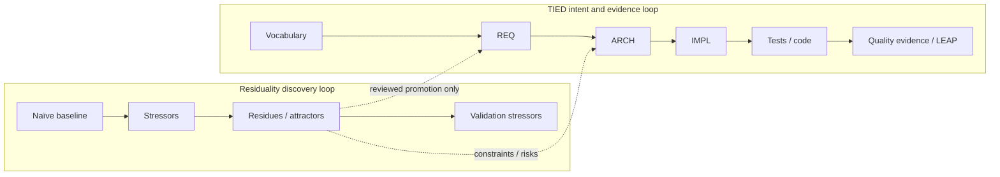

# TIED Residuality Analysis Methodology Plan

**Status:** Proposed methodology feature plan — Batch A plan-doc closed (2026-09-27, commit f90f871); W1–W4 pilot complete (25 stressors, P0 LEAP, 27 W4 tests green); **W5 refine complete (2026-09-27)** — DoD assessed with documented partials; default recommendation **Adopt (revise)**; canonical promotion deferred to build-plan W5; machine PLAN close-out still deferred

**Change ID:** `PLAN-TIED-RESIDUALITY-ANALYSIS`

**Priority:** P1 (methodology integration — optional, risk-triggered architecture discovery)

**Owner:** Canonical TIED source repository (`stdd`)

**Scope:** Methodology and planning — how TIED may integrate **Residuality Theory** as an optional, risk-triggered **architecture-discovery and residue-preservation workflow** that feeds the canonical vocabulary → REQ → ARCH → IMPL → tests → code → quality evidence → LEAP chain. This is **not** a product-application resilience feature and **not** a second specification authority.

**Planning-artifact disclaimer:** This document and its linked Cursor plan do **not** create new project REQ/ARCH/IMPL tokens, do **not** authorize mutating canonical project TIED YAML for residuality tooling until pilot completion and explicit W5 promotion, and do **not** claim runtime resilience or antifragility. Each behavior-changing implementation batch (W3+) must establish or update its own REQ/ARCH/IMPL traceability before RED tests.

**Related work:**

- [Residuality Theory and TIED — tracked excerpt](residuality-theory-and-tied-excerpt.md) — git-tracked summary; full synthesis local at `docs/comparisons/residuality-theory-and-tied.md` (gitignored)
- [tied/vocab/residuality.md](../tied/vocab/residuality.md) — provisional glossary (RECORD)
- [tied-adversarial-inquiry-plan.md](tied-adversarial-inquiry-plan.md) — falsification / authority tone (§1)
- [tied-async-methodology-plan.md](tied-async-methodology-plan.md) — wave and gate structure exemplar
- **Tracker:** `working/PLAN-TIED-RESIDUALITY-ANALYSIS/agent-req-implementation-checklist.yaml`
- **Working CITDP:** `working/PLAN-TIED-RESIDUALITY-ANALYSIS/CITDP-PLAN-TIED-RESIDUALITY-ANALYSIS.yaml`
- **Linked Cursor plan:** `plan_residuality_feature_07582e06.plan.md` (authoritative build-plan spec)

---

## 0. Refine outcomes

### Resolved sponsor terms

- **stressor** — Disruptive technical, organizational, commercial, environmental, or human condition applied to a baseline.
- **naïve architecture** — Deliberately simple baseline meeting current functional need; preferred starting form of a **candidate system** (broader framing still valid).
- **residue** — What remains possible, trustworthy, recoverable, explainable, or operational after a stressor (software, data, and operational/human capability).
- **desirable residue** — Intentionally preserved post-stressor property; candidate for REQ/ARCH after review.
- **harmful residue** — Accidental or damaging remainder; candidate for ARCH constraint, remediation, defect, or accepted **residual risk** — never auto-promoted as a positive REQ.
- **attractor** — Recurring state/pattern across stressors; analytical, not a token authority.
- **incidence matrix** — Read-only stressor-by-capability view; never a second requirements database.
- **validation stressor** — Holdout/unfamiliar scenario after redesign; required for pilot DoD unless N/A is documented with rationale.
- **stressor-residue claim** — “After S, R remains…”; claim to test, not evidence.

### Authority integration (non-negotiable)

```text
RESIDUALITY DISCOVERY LOOP          TIED INTENT AND EVIDENCE LOOP
baseline / naïve architecture       vocabulary
  -> stressors                        -> REQ
  -> impact paths / residues          -> ARCH
  -> attractors / coupling            -> IMPL (+ PRE/POST/EFFECTS/…)
  -> candidate design changes         -> tests / code
  -> validation stressors             -> quality evidence / proof boundaries
                                      -> LEAP on confirmed divergence
```

- Residuality **discovers** cross-cutting properties.
- TIED **owns**, formalizes, implements, and proves accepted properties.
- Observations stay in working/research artifacts until classified and promoted (`[REQ-TIED_FIDELITY_RESEARCH]` boundary).
- **Antifragility** is **not** adopted as a TIED claim.

### Critical contrasts (do not conflate)

- **residue** ≠ **residual risk** — residue is system remainder after a stressor; residual risk is risk remaining after controls and evidence (`quality-assurance.md`).
- **attractor** ≠ **risk tier** — attractor is observed dynamic tendency; risk tier is assurance-depth classification.
- **incidence matrix** ≠ **quality evidence matrix** — incidence matrix is a discovery view; quality evidence matrix is obligation/evidence rows with provenance.
- **stressor-residue record** ≠ **REQ/ARCH/IMPL** — working artifact until reviewed promotion via LEAP.

### Accepted open items (documented; do not block authoring)

1. Exact academic provenance of Residuality Theory — research pointer only (see comparison doc).
2. Whether operational/human residues become REQ criteria vs operational notes — classify per finding in W2.
3. Whether `stressor-residue.v1` becomes a canonical schema — W5 decision after pilot field use.
4. Stressor count 20–30 (pilot) / 20–50 (workshop heuristic) — guidance, not a universal gate.

### Vocabulary RECORD/VALIDATE status

- **RESOLVE:** Sponsor and comparison terms mapped to preferred terms in `tied/vocab/residuality.md` (Touchpoint 1).
- **RECORD:** Provisional glossary + routing row 5h present; no new semantic tokens beyond planning Change ID in this batch.
- **PRELOAD:** `residuality.md`, `quality-assurance.md`, `fidelity-research.md` for authority-boundary work.
- **VALIDATE:** Deferred to traceable-commit on the plan-doc batch; build-plan must not introduce conflating names (residue vs residual_risk, matrix vs quality evidence matrix).

---

## 1. Executive summary and dual-loop problem statement

TIED already supports failure-aware design through REQ satisfaction criteria, ARCH constraints, IMPL contracts (`PRE`/`POST`/`EFFECTS`/`FAILURE_MODES`), composition coverage, CITDP assurance profiles, adversarial inquiry, and quality evidence collection. Those mechanisms are **intent-first**: vocabulary → REQ → ARCH → IMPL → tests → code → evidence → LEAP.

Residuality Theory starts from a different angle — **stressor-first discovery** on a deliberately simple **naïve architecture**, asking what **remains** (residues) and what **recurs** (attractors) when the world interferes. That loop can surface cross-cutting architecture constraints that component-first authoring misses until late integration or production failure.

The integration proposal is a **dual loop**, not a merge of authorities:

```text
domain vocabulary (shared)
  ┌─────────────────────────────┐     ┌──────────────────────────────┐
  │ Residuality discovery loop  │     │ TIED intent & evidence loop  │
  │ (optional, risk-triggered)  │────▶│ (canonical)                  │
  └─────────────────────────────┘     └──────────────────────────────┘
         discovers                              owns / proves
```

**Core boundary sentence:** Residuality **discovers** cross-cutting properties under stress; TIED **owns**, formalizes, implements, and **proves** only properties that survive human review and stack elevation via LEAP.

**Component-first vs stressor-first (problem framing):**

- **Component-first (today’s default TIED flow):** Decompose by module/feature → specify REQ/ARCH/IMPL per unit → bind at composition → evidence at gates. Failure modes appear when criteria exist or when profiles (e.g. `stateful-reliability`) trigger deeper assurance.
- **Stressor-first (proposed optional pass):** Hold a naïve baseline → enumerate coherent stressors → trace impact paths → classify residues → compare to existing REQ/ARCH/IMPL → feed **candidates** into the TIED loop. The pass does **not** replace REQ/ARCH/IMPL with worksheets or matrices.



**Falsification stance (aligned with adversarial-inquiry plan §1):** Worksheets, incidence matrices, and candidate YAML records are **hypothesis generators**. They become engineering truth only after classification, stack elevation, RED tests, composition faults, and evidenced quality artifacts — never by structural presence alone.

---

## 2. Goals and non-goals

### Goals

- Define an **optional, risk-triggered** residuality discovery pass that integrates with CITDP, checklist touchpoints, and composition fault patterns **without** competing with REQ/ARCH/IMPL authority.
- Provide **W0–W5** normative waves with entry/exit evidence, depth tiers, and explicit TIED-loop handoffs.
- Specify **provisional** artifacts (five-field worksheet, candidate `stressor-residue.v1`, proposed CITDP hook) marked **NON-CANONICAL** until W5 promotion.
- Bound a **pilot** on read-only targets `[REQ-FEAT_TASK_EXECUTION_RECOVERY]` and `[REQ-FEAT_IDEMPOTENT_CREATION]` with a 12-item definition of done (W1–W2 execution deferred to a separate batch).

### Non-goals

- Mutating project REQ/ARCH/IMPL YAML for residuality tooling in the plan-doc batch.
- Editing `tied/methodology/` for client convenience.
- Running the W1 pilot workshop in the plan-doc batch.
- Implementing `sub-residuality-analysis-pass` or MCP validators before W5 evidence.
- Claiming pilot DoD complete, universal resilience, formal correctness, or **antifragility** as TIED doctrine.
- Auto-promoting unreviewed residues into project YAML.

---

## 3. Current state audit

### What exists today

- **Comparison synthesis:** [docs/comparisons/residuality-theory-and-tied.md](comparisons/residuality-theory-and-tied.md) documents dual-loop fit, existing TIED hooks (module validation, quality evidence, fidelity research, CITDP profiles, LEAP), and pilot-oriented mappings to task recovery and idempotent creation REQs.
- **Provisional vocabulary:** [tied/vocab/residuality.md](../tied/vocab/residuality.md) with routing row **5h** in [tied/vocab/routing.md](../tied/vocab/routing.md).
- **Working analysis record:** `working/PLAN-TIED-RESIDUALITY-ANALYSIS/CITDP-PLAN-TIED-RESIDUALITY-ANALYSIS.yaml` with `risk_analysis.residuality_analysis.status: planned_section`.
- **This feature plan** (build-plan deliverable) — normative roadmap for W0–W5.

### Gaps vs desired hooks (document-only until W5)

- No canonical **checklist sub-procedure** `sub-residuality-analysis-pass` near `impact-discovery` / `author-architecture`.
- No canonical **CITDP field** `risk_analysis.residuality_analysis` in policy (candidate snippet only in §6).
- No stable **lint/validate** for `stressor-residue.v1`.
- No dedicated residuality tooling REQ/ARCH/IMPL (optional W5 only if validators/CLI/MCP need durable contracts).
- **Touchpoints to wire at promotion (W5):** [tied/docs/processes.md](../tied/docs/processes.md), [tied/docs/citdp-policy.md](../tied/docs/citdp-policy.md), [tied/docs/composition-coverage.md](../tied/docs/composition-coverage.md) (`CONTROLLED_COMPOSITION_FAULT`), [tied/docs/agent-req-implementation-checklist.md](../tied/docs/agent-req-implementation-checklist.md).

### Unresolved theory / provenance questions (from comparison)

- Academic provenance of Residuality Theory — treat comparison article as working account until research pointer is added.
- Operational/human residues vs REQ criteria — resolve per residue in W2 classification.

---

## 4. Proposed waves (W0–W5)

Normative wave specs. Depth and gate policy per batch are summarized in §10.

### W0 — Vocabulary, provisional definitions, worksheet contract

- **Goal:** Usable language without premature canonization.
- **Depth:** `minimal` (documentation/vocab only).
- **Entry:** Comparison synthesis accepted; `tied/vocab/residuality.md` seeded.
- **Actions:**
  1. Keep multi-account comparison + provenance in the comparison doc.
  2. Maintain provisional terms in `tied/vocab/residuality.md` + routing keywords (row 5h).
  3. Define minimum worksheet fields: Stressor, Impact Path, Residue, Business Priority, Design Response (§5).
  4. Define candidate machine-readable record `stressor-residue.v1` extending the worksheet (§5).
  5. List unresolved theory/provenance questions in §0/§3.
- **Deliverables:** `tied/vocab/residuality.md`; feature plan §5 embeds; optional `working/PLAN-TIED-RESIDUALITY-ANALYSIS/schemas/stressor-residue.v1.example.yaml` (deferred until W1 if not copied).
- **TIED loop handoff:** Vocabulary only — no REQ/ARCH/IMPL writes. Discovery supplies terms; TIED owns promotion at W3/W5.
- **Exit evidence:** Term map, worksheet contract, candidate schema sketch, unresolved list in feature plan.
- **Does not:** Create residuality REQ/ARCH/IMPL tokens; edit methodology YAML.

### W1 — Bounded discovery pilot

- **Goal:** Test whether stressor analysis surfaces architecture constraints the current TIED flow would miss.
- **Depth:** `integrated` (default); `gate_policy: advisory`. **Profiles:** `stateful-reliability`, `data-integrity-migration` (pilot REQs match persistence eligibility; no `integrated_waiver` without sponsor text).
- **Refine-plan (2026-09-27):** W1 specification and **scaffold templates** complete; full stressor workshop deferred to build-plan W1. Integrated `pre_implementation` receipt: `working/PLAN-TIED-RESIDUALITY-ANALYSIS/gates/pre_implementation-2026-09-27T05-03-59-503Z.json`.
- **Entry evidence:** Batch A feature plan closed; W0 worksheet contract; `gate-tracker-pre-implementation-w1.yaml`; pilot tree scaffold under `working/PLAN-TIED-RESIDUALITY-ANALYSIS/pilot/`.
- **Pilot targets (read-only — read detail YAML before gap analysis):**
  - `[REQ-FEAT_TASK_EXECUTION_RECOVERY]` + `[ARCH-FEAT_TASK_EXECUTION_STATE]` + `[IMPL-FEAT_TASK_EXECUTION_STATE]` — deterministic status/reason; append-only evidence; stale/cancel dependent lock.
  - `[REQ-FEAT_IDEMPOTENT_CREATION]` + `[ARCH-FEAT_IDEMPOTENT_CREATION]` + `[IMPL-FEAT_IDEMPOTENT_CREATE]` — repeat vs collision; concurrent serialization; no partial publish.
- **Artifact layout:** `baseline.md`, `participant-scope.md`, `stressor-catalog.md`, `worksheets/` (five-field template), optional `records/*.yaml`, `incidence-matrix.md`, `gap-list.md`, `limitations.md`; example schema `working/PLAN-TIED-RESIDUALITY-ANALYSIS/schemas/stressor-residue.v1.example.yaml`.
- **Stressor heuristic:** 20–30 coherent stressors; seed list in `pilot/stressor-catalog.md` (duplicate delivery, crash mid-write, store loss, timeout-after-side-effect, reorder, stale resume, concurrent creators, partial publish, version skew, dependency loss, load spike, support recovery, human cancel/override, key rotation, clock skew).
- **Adversarial inquiry:** Integrated structural pass at W1 refine (`run_id: refine-plan-w1-pre-impl-2026-09-27`); artifacts under `working/REQ-FEAT_TASK_EXECUTION_RECOVERY/adversarial-inquiry/phase-pre_implementation/` (REQ-* path required for MCP). Advisory policy — findings are review-gated, not LEAP triggers.
- **Workshop actions (build-plan):** Populate baseline, worksheets, matrix, gap list from read-only stack comparison.
- **TIED loop handoff:** Discovery-only; **no** project YAML mutation until W2 classification and W3 LEAP on a **separate** behavior-changing CITDP.
- **Exit evidence:** Filled baseline, 20–30 worksheets, matrix, gap list, limitations, participant scope → **W2** `classification-ledger.md`.

### W2 — Residue classification and risk gating

- **Goal:** Separate discovery from promotion.
- **Depth:** `integrated` (same pilot batch as W1).
- **Entry:** W1 exit evidence present.
- **Per residue, classify:** desirable capability → candidate REQ/ARCH; harmful attractor/coupling → ARCH constraint, remediation, or **accepted residual risk**; implementation/test finding; missing/ambiguous requirement; not applicable; unresolved (research).
- **Assurance categories (when applicable):** `stateful-reliability`, `data-integrity-migration`, `performance-scale-cost`, `external-input-security`.
- **Deliverable:** `working/PLAN-TIED-RESIDUALITY-ANALYSIS/pilot/classification-ledger.md` (or `.jsonl`) with disposition enum + proof_boundary per row.
- **TIED loop handoff:** Only **desirable** and reviewed **harmful→constraint** rows enter W3; harmful residues never auto-become positive REQs.
- **Exit evidence:** Classification ledger keyed to stressors + proof boundaries.

### W3 — Stack elevation via LEAP

- **Goal:** Convert only reviewed desirable residues into the traceability stack.
- **Depth:** `integrated`; requires **new** behavior-changing CITDP (not `CITDP-PLAN-TIED-RESIDUALITY-ANALYSIS`).
- **Entry:** W2 ledger with human-reviewed dispositions; sponsor approval to mutate pilot REQ stack.
- **Per confirmed desirable residue:** REQ satisfaction criterion; ARCH ownership/constraints; IMPL contracts with block-lead token comments; stressor/residue as facet/reference only; `[PROC-LEAP]` on divergence.
- **TIED loop handoff:** This wave **is** the canonical intent loop — discovery stops at references in traceability metadata.
- **Exit evidence:** REQ/ARCH/IMPL diffs in dedicated CITDP; pseudo-code validation before RED tests.

### W4 — Executable test strategy and composition fault injection

- **Goal:** Make residuality-derived intent executable without bypassing TIED controls.
- **Depth:** `integrated`; follows `[PROC-TIED_DEV_CYCLE]` (unit RED → GREEN → composition RED → GREEN → justified E2E).
- **Entry:** W3 IMPL pseudo-code validated and persisted.
- **Actions:** Unit RED from IMPL under failure; UI-free composition tests with `CONTROLLED_COMPOSITION_FAULT` (ordering, timeout, duplicate delivery, incorrect args, suppressed failure/recovery) on pilot seams; module validation; validation stressor set in `pilot/validation-stressors.md`; provenance + proof boundaries.
- **TIED loop handoff:** Tests and quality evidence **prove** accepted properties; discovery artifacts remain citations only.
- **Exit evidence:** Commands, seeds, manifests when applicable, limitations, holdout-stressor results.

### W5 — Tooling and checklist integration (optional / proposed)

- **Goal:** Promote only what the pilot proves useful.
- **Depth:** Sponsor-selected; tooling behavior changes default `integrated`. **W5 refine-plan (2026-09-27):** `minimal` + `advisory` for promotion planning batch only.
- **Refine-plan status (2026-09-27):** DoD checklist `working/PLAN-TIED-RESIDUALITY-ANALYSIS/pilot/pilot-dod-checklist.md`; promotion menu `working/PLAN-TIED-RESIDUALITY-ANALYSIS/w5-promotion/`; CITDP `CITDP-W5-PROMOTION.yaml`; default recommendation **Adopt (revise)** in `evidence/w5-refine-outcomes.md`. **build-plan W5** (`w5-build-plan-promotion`) pending sponsor SD-W5-* decisions.
- **Entry:** Pilot DoD §7 complete; written recommendation adopt / revise / defer / reject.
- **Candidates (additive, TIED-source only):**
  1. Canonical glossary promotion in `tied/vocab/residuality.md`.
  2. Optional checklist sub-procedure `sub-residuality-analysis-pass` (NON-CANONICAL until merged via TDD + checklist gate).
  3. Optional CITDP section `risk_analysis.residuality_analysis` after policy update.
  4. Stable schema + lint/validate for `stressor-residue.v1` if field use justified.
  5. Dedicated tooling REQ/ARCH/IMPL only if validators/CLI/MCP need durable contracts.
- **TIED loop handoff:** W5 promotes **process hooks**; it does not retroactively canonize W1 worksheets as REQ substitutes.
- **Promotion gate:** All pilot DoD items met; recommendation recorded in §10 and working CITDP.

---

## 5. Artifact and schema specifications

All candidate machine-readable shapes below are **provisional** until W5 promotion removes the NON-CANONICAL marker and updates policy.

### Five-field worksheet (minimum)

Discovery input only — not a specification substitute.

- **Stressor** — Named disruption with category (technical, organizational, commercial, environmental, human).
- **Impact Path** — People, functions, data, dependencies, bindings affected.
- **Residue** — What remains or becomes observable (desirable, harmful, accidental, unresolved).
- **Business Priority** — Sponsor-relative importance for classification ordering.
- **Design Response** — Candidate mitigation or architecture change (feeds W2/W3 review).

### Candidate schema `stressor-residue.v1`

```yaml
# Candidate only — not canonical until W5 promotion gate
schema_version: stressor-residue.v1
baseline:
  objective: ""
  naive_architecture_summary: ""
  assumptions: []
stressor:
  id: ""
  category: technical|organizational|commercial|environmental|human
  description: ""
impact_path:
  people: []
  functions: []
  data: []
  dependencies: []
  bindings: []
residue:
  description: ""
  class: desirable|harmful|accidental|unresolved
business_priority: ""
attractor: null
design_response: ""
validation_stressor: null
evidence:
  method: ""
  references: []
  limitation: ""
  proof_boundary: ""
disposition:
  status: candidate_requirement|architecture_constraint|finding|accepted_residual_risk|not_applicable|unresolved
  tied_refs: []
```

### Composition fault binding notes (W4)

Use existing [CONTROLLED_COMPOSITION_FAULT](../tied/docs/composition-coverage.md) patterns against pilot seams:

- **Ordering** — queue/worker delivery vs processing order for task recovery and idempotent create paths.
- **Timeout** — side effect committed before client observes timeout.
- **Duplicate delivery** — same `task_id` or idempotency key retried.
- **Incorrect args** — collision vs retry with divergent payload.
- **Suppressed failure/recovery** — worker crash mid-write, store unavailable, partial manifest publish.

Each composition test maps to a **reviewed** stressor-residue claim or REQ criterion — not to an unclassified worksheet row.

### Proposed checklist hook (W5 candidate)

```yaml
# Candidate only — not canonical until W5 promotion gate
sub_procedure:
  slug: sub-residuality-analysis-pass
  placement: near impact-discovery and author-architecture
  mode: optional_risk_triggered
  output: working/.../pilot/ or attach-as-evidence refs only
```

---

## 6. CITDP integration outline

### Now (plan-doc / working record)

- Working analysis: `working/PLAN-TIED-RESIDUALITY-ANALYSIS/CITDP-PLAN-TIED-RESIDUALITY-ANALYSIS.yaml`.
- `risk_analysis.residuality_analysis.status: planned_section` — documents intent without requiring the field in canonical policy yet.
- Until W5, residuality findings attach as **evidence references** under existing `risk_analysis` / adversarial / quality matrix rows.

### Proposed W5 snippet (attach-as-evidence pattern before promotion)

```yaml
# Candidate only — not canonical until W5 promotion gate
risk_analysis:
  residuality_analysis:
    applied: true|false|not_applicable
    baseline_ref: working/PLAN-TIED-RESIDUALITY-ANALYSIS/pilot/baseline.md
    worksheet_dir: working/PLAN-TIED-RESIDUALITY-ANALYSIS/pilot/worksheets/
    incidence_matrix_ref: working/PLAN-TIED-RESIDUALITY-ANALYSIS/pilot/incidence-matrix.md
    validation_stressor_set_ref: working/PLAN-TIED-RESIDUALITY-ANALYSIS/pilot/validation-stressors.md
    dispositions_summary:
      desirable: 0
      harmful: 0
      unresolved: 0
    proof_boundary: "Discovery aid only; runtime claims require executable evidence."
```

---

## 7. Pilot definition of done

**Scope:** Read-only analysis targets `[REQ-FEAT_TASK_EXECUTION_RECOVERY]` and `[REQ-FEAT_IDEMPOTENT_CREATION]`. **Default depth for W1 execution:** `integrated`.

**Working tree layout (W1+):**

- `working/PLAN-TIED-RESIDUALITY-ANALYSIS/pilot/baseline.md`
- `working/PLAN-TIED-RESIDUALITY-ANALYSIS/pilot/participant-scope.md`
- `working/PLAN-TIED-RESIDUALITY-ANALYSIS/pilot/stressor-catalog.md`
- `working/PLAN-TIED-RESIDUALITY-ANALYSIS/pilot/worksheets/` (+ `_template.md`)
- `working/PLAN-TIED-RESIDUALITY-ANALYSIS/pilot/records/` (optional candidate YAML)
- `working/PLAN-TIED-RESIDUALITY-ANALYSIS/pilot/incidence-matrix.md`
- `working/PLAN-TIED-RESIDUALITY-ANALYSIS/pilot/gap-list.md`
- `working/PLAN-TIED-RESIDUALITY-ANALYSIS/pilot/limitations.md`
- `working/PLAN-TIED-RESIDUALITY-ANALYSIS/pilot/classification-ledger.md` (W2)
- `working/PLAN-TIED-RESIDUALITY-ANALYSIS/pilot/validation-stressors.md` (W4 or documented N/A)
- `working/PLAN-TIED-RESIDUALITY-ANALYSIS/schemas/stressor-residue.v1.example.yaml` (optional reference)

**Pilot execution status (2026-09-27):** W1–W4 complete. Scored assessment: `working/PLAN-TIED-RESIDUALITY-ANALYSIS/pilot/pilot-dod-checklist.md` (**11/12 met or met-with-caveats**; item 12 in W5 refine).

**12-item DoD checklist** (pilot complete only when all are satisfied):

1. Documented baseline / naïve architecture
2. System boundary including relevant human/operational actors
3. Diverse coherent stressor set (pilot target 20–30)
4. Worksheets (five fields minimum)
5. Useful and harmful residue classifications
6. Attractors / coupling patterns when present
7. Exploratory incidence matrix (or equivalent)
8. Explicit mapping to existing/proposed REQ/ARCH/IMPL for the two pilot REQs
9. Separate validation stressor set **or** documented N/A rationale
10. Executable or qualified evidence with provenance and proof boundaries
11. Unresolved theory / accepted-risk log
12. Recommendation: adopt / revise / defer / reject canonical integration

**Status:** **Assessed promotion-ready with partials** (P1 LEAP defer, S-T13, V-H01, comparison gitignore, PLAN close-out defer) — see pilot DoD checklist; not a claim of universal resilience.

---

## 8. Proof boundaries and guardrails

### Proves (when evidenced)

- Structured discovery of failure behaviors for **examined** stressors.
- Explicit degradation/recovery **targets** after review and stack elevation.
- Tested paths for stressors mapped to REQ criteria and composition faults (W4).

### Does not prove

- Universal resilience or immunity to unexamined disruptions.
- Formal correctness or happens-before guarantees from discovery artifacts alone.
- Runtime survival from structural validators, worksheets, or incidence matrices without executable evidence.

### Never rules

- Replace REQ/ARCH/IMPL with a stressor worksheet or incidence matrix.
- Treat matrix/schema presence as runtime proof.
- Auto-promote unreviewed residues into project YAML.
- Bypass TDD, module validation, or composition-before-E2E ordering.
- Edit `tied/methodology/` for client convenience.
- Claim antifragility as TIED doctrine.

### Fidelity-research observation boundary

Observed residues and attractors remain **research/working artifacts** until classified and promoted per `[REQ-TIED_FIDELITY_RESEARCH]`. Silent mutation of canonical intent from discovery output is forbidden.

---

## 9. Implementation order and batch boundaries

### Batch A — Plan-doc (this build-plan batch)

- **depth_tier / profile_depth:** `minimal`
- **gate_policy:** `advisory`
- **Deliverables:** This feature plan; cross-link from comparison doc; confirm routing row 5h; provisional vocab already in `tied/vocab/residuality.md`.
- **Does not:** Open product REQ/ARCH/IMPL tokens for residuality tooling; run W1 pilot; claim pilot DoD.

### Batch B — W1–W4 pilot (separate authorization)

- **depth_tier:** `integrated` (default for persistence/stateful-reliability pilot REQs).
- **W1 refine-plan (2026-09-27):** CITDP + Tracker updated; integrated `pre_implementation` allowed; pilot scaffold only — **workshop = build-plan W1** (`w1-build-plan-workshop` in linked Cursor plan).
- **Deliverables:** Pilot artifact tree under `working/.../pilot/`; W2 classification ledger; optional W3 behavior-changing CITDP for stack elevation; W4 tests and composition faults.
- **Requires:** `gate-tracker-pre-implementation-w1.yaml`; adversarial inquiry pairing at integrated depth (advisory); read-only pilot REQ/ARCH/IMPL detail YAML for gap analysis.

### Batch C — W5 promotion (optional)

- **Requires:** Pilot DoD §7 complete; sponsor recommendation; separate policy/checklist/TDD work for hooks and schema canonization.
- **May:** Remove NON-CANONICAL markers from promoted snippets; add `sub-residuality-analysis-pass`; persist canonical CITDP residuality section.

### LEAP reminder

When code or tests diverge from elevated IMPL during W3–W4, apply `[PROC-LEAP]` **IMPL → ARCH → REQ** in the same work item.

---

## 10. Gate status and next steps

### Profile depth batches

- **Plan-doc / refine / build-plan (Batch A):** `minimal` + `advisory` — docs and provisional vocab only.
- **W1–W4 pilot (Batch B):** `integrated` + `advisory` (strict blocking only after eligibility demonstrated).
- **W5 tooling (Batch C):** sponsor-selected; behavior changes default `integrated`.

Invalidate downstream Tracker dispositions and re-run `tied_checklist_gate_validate` if depth or policy changes.

### Gate receipts

**Batch A (plan-doc — closed):**

- **pre_implementation:** `working/PLAN-TIED-RESIDUALITY-ANALYSIS/gates/pre_implementation-2026-09-27T04-46-04-773Z.json` (`allowed: true`, depth `minimal`); `gate-tracker-pre-implementation.yaml`.
- **verification:** `working/PLAN-TIED-RESIDUALITY-ANALYSIS/gates/verification-2026-09-27T04-51-45-189Z.json` (`allowed: true`, depth `minimal`); `gate-tracker-verification.yaml`.
- **close_out:** `working/PLAN-TIED-RESIDUALITY-ANALYSIS/gates/close_out-2026-09-27T04-58-24-396Z.json` (Batch A).

**Batch B W1 refine-plan (integrated planning — 2026-09-27):**

- **pre_implementation:** `working/PLAN-TIED-RESIDUALITY-ANALYSIS/gates/pre_implementation-2026-09-27T05-03-59-503Z.json` (`allowed: true`, depth `integrated`); sparse input `gate-tracker-pre-implementation-w1.yaml`.
- **Adversarial inquiry pairing:** `run_id: refine-plan-w1-pre-impl-2026-09-27`; artifacts under `working/REQ-FEAT_TASK_EXECUTION_RECOVERY/adversarial-inquiry/phase-pre_implementation/`.

### build-plan → plan-close-out handoff criteria

- **Batch A complete:** §0–§10 feature plan; comparison cross-link; minimal verification/close_out gates (commit `f90f871`).
- **W1 refine complete:** Linked plan `w1-*` todos through scaffold + integrated pre_implementation; **not** pilot DoD §7.
- **Deferred:** Git commit for W1 refine (sponsor-initiated); W1 workshop content; W2–W5; pilot DoD; W5 promotion.

**Batch B W5 refine-plan (minimal planning — 2026-09-27):**

- **pre_implementation:** `working/PLAN-TIED-RESIDUALITY-ANALYSIS/gates/pre_implementation-2026-09-27T06-13-03-814Z.json` (`allowed: true`, depth `minimal`); `gate-tracker-pre-implementation-w5.yaml` + `CITDP-W5-PROMOTION.yaml`.
- **Deliverables:** `pilot/pilot-dod-checklist.md`, `w5-promotion/w5-promotion-decisions.md`, NON-CANONICAL checklist/CITDP scaffolds; feature plan §7/§10 planning updates.

### Recommended next steps

1. **build-plan W5** (`w5-build-plan-promotion`) — sponsor confirms SD-W5-* in `evidence/w5-refine-outcomes.md`; copy approved proposals into canonical `tied/docs/*` and vocab; optional integrated depth if tooling REQ opened.
2. **Optional:** W3 P1 LEAP batch 2 (separate behavior-changing CITDP) before or after process promotion.
3. **Optional:** Machine PLAN close-out envelope when sponsor ends waiver pattern.

---

**Inspection note:** Feature plan authored per linked Cursor plan `plan_residuality_feature_07582e06.plan.md` and build-plan todo map (doc-s0 … doc-s10).
