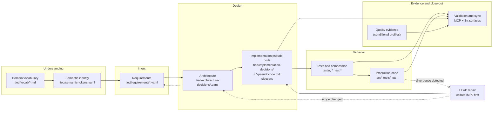

# TIED Value Proposition Matrix

**TIED Methodology Version**: 3.0.0

**Audience**: Humans evaluating or adopting TIED — product owners, engineers, reviewers, and sponsors. This page is **not** a canonical source of requirements and must not replace project YAML, process guides, or agent operating instructions.

**What this page is**: a reader-oriented map of how **one behavior-changing requirement** (for example `[REQ-FEAT_MANIFEST_SCHEMA]` or `[REQ-MODULE_VALIDATION]`) is represented from shared vocabulary through executable evidence and close-out. It explains **what each layer is for**, **who owns it**, **when it appears in the lifecycle**, and **what it can and cannot prove**.

**What this page is not**: a dump of tokens, a generated feature view, or a substitute for the canonical indexes under `tied/`. For worked examples, see [tied-feature-demo.md](tied-feature-demo.md), [tied-feature-extended-demo.md](tied-feature-extended-demo.md), and [tied-certified-workflows-thesis.md](tied-certified-workflows-thesis.md). For costs and checklist context, see [leap-tied-citdp-costs-and-benefits.md](leap-tied-citdp-costs-and-benefits.md).

---

## Legend — artifact kinds and proof boundaries

| Kind | Meaning | Typical examples |
| --- | --- | --- |
| **Canonical source** | Authoritative record humans and tools mutate through governed workflows. Changes here change the project's stated intent or design. | `tied/requirements/*.yaml`, `tied/implementation-decisions/*-pseudocode.md`, project source |
| **Executable evidence** | Commands, tests, or validators that run and produce pass/fail or artifact output. Proves **observed behavior or structure at execution time**, not business approval by itself. | Unit tests, composition tests, `tied_validate_consistency`, quality evidence collection |
| **Derived view** | Human-readable projection from canonical data. Useful for navigation and review; **must not** become a second source of truth. | Generated `spec.md` / `tasks.md` in feature directories, checklist renders, this matrix |
| **Governance / change record** | Auditable decision about scope, risk, tests, or promotion. Proves **process was followed and rationale was captured**, not that runtime behavior is correct. | CITDP YAML (`tied/citdp/CITDP-*.yaml`), LEAP proposal queue entries, waivers |
| **Conditional / not applicable** | Selected by policy, feature type, or risk profile. Absence in a lightweight workflow is normal — do not infer every row applies to every change. | Full CITDP persistence, specialized quality profiles, feature orchestration manifests, E2E UI tests |

**Proof boundary** (used throughout): the explicit claim limit of an artifact or check. Structural consistency, generated Markdown, and documentation reviews **do not** establish runtime correctness, security, usability, regulatory compliance, or human approval unless paired with the appropriate executable evidence and accountable review.

---

## Representation flow (one requirement, many layers)

*Understanding shared terms → stating intent → shaping design → proving behavior in tests and code → collecting bounded evidence. When executable reality disagrees with the plan, LEAP updates IMPL first, then ARCH and REQ if scope changed.*

---

## Primary representations

Each row traces **one layer** in the chain. Representative paths use this repository's layout; client projects mirror the same shape after `copy_files.sh`.

| Layer | Audience question | Canonical artifacts / owner | Lifecycle point | User-visible value | What it proves | What it does **not** prove | Canonical reference |
| --- | --- | --- | --- | --- | --- | --- | --- |
| **Domain vocabulary** | "Do we mean the same words?" | `tied/vocab/*.md`, routing index; owner: team + `[PROC-VOCABULARY_INDEX]` discipline | Before and during authoring — RESOLVE at prompt intake, PRELOAD before reading specs, VALIDATE before commit | Shared language across sponsors, agents, and implementers; fewer ambiguous REQ/ARCH/IMPL names | Terminology is recorded, cross-linked, and auditable against glossaries | Correctness of behavior, test pass rates, or YAML validity | [tied/vocab/routing.md](../tied/vocab/routing.md), [vocabulary-index-analysis-and-standards.md](../tied/docs/vocabulary-index-analysis-and-standards.md) |
| **Semantic identity** | "What is the stable name for this concept?" | `tied/semantic-tokens.yaml`; owner: project maintainers via TIED MCP / `tied-cli` | Token creation when a new REQ/ARCH/IMPL family is introduced | One registry linking labels used in docs, tests, code comments, and YAML | Token exists, is spelled consistently, and is registered | Semantic meaning beyond its linked records; runtime behavior | [semantic-tokens.md](../tied/docs/semantic-tokens.md), index: [tied/semantic-tokens.yaml](../tied/semantic-tokens.yaml) |
| **Requirements** | "What must the system do, and why?" | `tied/requirements.yaml` + `tied/requirements/REQ-*.yaml`; owner: product/engineering | Early change definition — before ARCH/IMPL and before RED tests | Traceable acceptance intent, rationale, and success criteria | Stated need, constraints, and validation expectations are documented and linkable | Implementation details, passing tests, or deployed behavior | Example: [REQ-TIED_SETUP.yaml](../tied/requirements/REQ-TIED_SETUP.yaml), [REQ-FEAT_MANIFEST_SCHEMA.yaml](../tied/requirements/REQ-FEAT_MANIFEST_SCHEMA.yaml), [requirements guide](../tied/docs/requirements.md) |
| **Architecture** | "How is responsibility divided at a high level?" | `tied/architecture-decisions.yaml` + `tied/architecture-decisions/ARCH-*.yaml`; owner: engineering / architects | After REQ sketch, before detailed IMPL | Boundaries, major components, and decision rationale with REQ backlinks | Structural intent and trade-offs are explicit and reviewable | Line-level algorithms, test coverage, or operational metrics | [architecture-decisions.md](../tied/docs/architecture-decisions.md), indexes under [tied/architecture-decisions/](../tied/architecture-decisions/) |
| **Implementation / pseudo-code** | "What exact behavior will we build?" | `tied/implementation-decisions.yaml`, detail YAML, and `*-pseudocode.md` sidecars; owner: implementers | After ARCH, **before** production code — gating artifact for TDD | Executable-grade plan: blocks, contracts (PRE/POST/EFFECTS), and token comments per block | Planned logic is complete enough to derive tests and detect drift later | Code compiles, tests pass, or production safety | [implementation-decisions.md](../tied/docs/implementation-decisions.md), [pseudocode-writing-and-validation.md](../tied/docs/pseudocode-writing-and-validation.md), example sidecar: [IMPL-MODULE_VALIDATION-pseudocode.md](../tied/implementation-decisions/IMPL-MODULE_VALIDATION-pseudocode.md) |
| **Tests / composition** | "How do we know modules and bindings work?" | Project test tree (`*_test.go`, `*_test.rb`, etc.), binding inventory rows; owner: implementers | RED before production code; composition after unit validation per `[REQ-MODULE_VALIDATION]` | Failing-then-passing proof at unit and seam level without invoking full UI | Observed behavior at tested boundaries matches IMPL for covered cases | Full-system correctness, security, UX, or untested paths | [composition-coverage.md](../tied/docs/composition-coverage.md), [agent-req-implementation-checklist.md](../tied/docs/agent-req-implementation-checklist.md) |
| **Production code** | "What actually ships?" | Application source (`tools/`, `mcp-server/`, etc.); owner: implementers | GREEN/refactor loops; composition wiring last | Running software | Runtime behavior for exercised paths | Documented intent stays true without LEAP/sync; untested edge cases | Repository source trees referenced by IMPL detail `implementation_approach` |
| **Documentation / process** | "How must the team work?" | `tied/docs/processes.md`, `AGENTS.md`, checklists; owner: methodology + project leads | Continuous — bootstrap, during work, at close-out | Repeatable sessions for humans and agents | Process expectations and gate order are written and linkable | Automatic enforcement unless paired with tests/validators | [processes.md](../tied/docs/processes.md), [client-development-index.md](../tied/docs/client-development-index.md) |

---

## Cross-cutting overlays

These surfaces span multiple primary layers. Rows marked **(conditional)** apply only when policy, risk, or feature type requires them.

| Layer | Audience question | Canonical artifacts / owner | Lifecycle point | User-visible value | What it proves | What it does **not** prove | Canonical reference |
| --- | --- | --- | --- | --- | --- | --- | --- |
| **Controlled bootstrap / access** | "How does a client get a safe TIED layout?" | `copy_files.sh`, [tools/bundled-tied-yaml-skill/](../tools/bundled-tied-yaml-skill/) (installed to `.cursor/skills/tied-yaml/` in clients), `.cursor/mcp.json` with `TIED_BASE_PATH`; owner: platform / dev experience | Day zero and refresh — before project YAML authoring | Consistent tree: project indexes, methodology read-only copy, MCP skill | Bootstrap produced expected files and MCP targets the intended `tied/` directory | Wrong-base-path mistakes are impossible without operator verification; methodology content is project-specific | [REQ-TIED_SETUP.yaml](../tied/requirements/REQ-TIED_SETUP.yaml), [tied-yaml MCP vocab](../tied/vocab/tied-yaml-mcp.md) |
| **CITDP change record (conditional)** | "What was analyzed, risked, and tested for this change?" | `tied/citdp/CITDP-*.yaml`; owner: change author at persist step | After impact analysis and test strategy; skipped for non-behavior docs per policy | Durable audit of scope, risks, tokens touched, and verification notes | Structured change story and explicit proof-boundary notes were captured | Runtime correctness or approval to ship without other gates | [citdp-policy.md](../tied/docs/citdp-policy.md), example: [CITDP-REQ-QUALITY_ASSURANCE_EVIDENCE.yaml](../tied/citdp/CITDP-REQ-QUALITY_ASSURANCE_EVIDENCE.yaml) |
| **LEAP synchronization** | "What happens when code and plan disagree?" | `[PROC-LEAP]` in processes; optional non-canonical proposal queue; owner: whoever changed behavior | Whenever tests/code diverge from IMPL — before claiming done | Plan and executable reality reconverge; tokens stay meaningful | Documented stack was updated in reverse order (IMPL → ARCH → REQ) when required | The divergence should not have happened; future drift prevention | [LEAP.md](../tied/docs/LEAP.md), [leap-proposal-queue.md](../tied/vocab/leap-proposal-queue.md) |
| **Quality / evidence (conditional)** | "Which quality risks need executable proof?" | `[REQ-QUALITY_ASSURANCE_EVIDENCE]`, assurance profiles, evidence matrix, manifest tooling; owner: quality-aware implementers | After test strategy; profiles selected by risk triggers | Risk-relative proof collection instead of one-size-fits-all testing | Declared commands ran, artifacts exist, and matrix rows have bounded results | All security/performance/a11y properties unless profile triggers and evidence exist | [quality-evidence-manifest.md](../tied/docs/quality-evidence-manifest.md), [quality-assurance.md](../tied/vocab/quality-assurance.md) |
| **Feature orchestration (conditional)** | "How do we govern a multi-step feature without duplicating REQ/ARCH/IMPL?" | **When used:** `tied/features/FEAT-NNN-*/feature.yaml`, clarifications, generated views; owner: feature lead | Parallel to canonical stack — specification-first or brownfield migration workflows | Lifecycle phases, task graphs, and readable views referencing canonical tokens | Orchestration state and references are consistent; views are stale-checked where configured | Feature manifest replaces REQ/ARCH/IMPL; generated Markdown is authoritative | [tied-improvement-roadmap.md](tied-improvement-roadmap.md), [feature-orchestration.md](../tied/vocab/feature-orchestration.md), [REQ-FEAT_MANIFEST_SCHEMA.yaml](../tied/requirements/REQ-FEAT_MANIFEST_SCHEMA.yaml) |
| **Validation / close-out** | "Is the written stack internally consistent and verified?" | MCP: `tied_validate_consistency`, `yaml_index_validate`, `pseudocode_validate`, `binding_inventory_validate`, `test_adequacy_validate`, `tied_verify`; shell: [scripts/lint_yaml.sh](../scripts/lint_yaml.sh), [scripts/validate_vocab_index.rb](../scripts/validate_vocab_index.rb); owner: implementers at verification gate | End of implementation loops and before commit/merge | Mechanical detection of broken links, pseudo-code gaps, and index drift | Structural/traceability consistency; pseudo-code and binding rules for in-scope tokens; vocab index shape | Runtime correctness, security, product acceptance, or human review by itself | [processes.md](../tied/docs/processes.md) § validation, [agent-req-implementation-checklist.md](../tied/docs/agent-req-implementation-checklist.md) |

---

## The weight of one REQ

Use this checklist when scoping a **single** behavior-changing requirement. Not every item requires a new artifact — but skipping without an explicit **not applicable** decision creates traceability debt.

| # | Concern | Where it lives | Proof boundary reminder |
| --- | --- | --- | --- |
| 1 | **Terminology** | `tied/vocab/*.md` via `[PROC-VOCABULARY_INDEX]` | RESOLVE names before writing tokens |
| 2 | **Rationale and intent** | `REQ-*` detail — problem, constraints, non-goals | Documents *why*; does not execute |
| 3 | **Acceptance / validation criteria** | REQ detail + linked tests | Criteria must be testable or explicitly human-verified |
| 4 | **Design boundaries** | `ARCH-*` — components, interfaces, rejected alternatives | High-level structure only |
| 5 | **Operational behavior** | `IMPL-*` pseudo-code blocks with PRE/POST/EFFECTS | Source for RED tests; not substitute for them |
| 6 | **Test strategy** | Checklist `test-strategy`, binding inventory, adequacy notes | Declares what evidence types apply |
| 7 | **Unit evidence** | Failing-then-passing unit tests | Proves module behavior under mocks |
| 8 | **Composition evidence** | Composition/integration tests per `[REQ-MODULE_VALIDATION]` | Proves trigger→callee seams without full UI |
| 9 | **Code evidence** | Production code referencing tokens in comments/names | Proves runtime for covered paths only |
| 10 | **Quality applicability (conditional)** | Assurance profile / evidence matrix when triggers fire | Profile selects depth; manifest proves commands ran |
| 11 | **E2E (conditional)** | UI-only paths with documented `e2e_only` justification | Last resort — proves full stack invocation, not spec quality |
| 12 | **Synchronized close-out** | LEAP updates if drifted; `tied_validate_consistency`; verification gate | Proves stack consistency, not product launch approval |
| 13 | **Change record (conditional)** | CITDP YAML when policy requires persistence | Proves analysis happened, not correctness |

---

## Unique value — why bother with the full chain?

- **One thread from sponsor language to code** — vocabulary and semantic tokens reduce "we used the same word for different things" across REQ, tests, and comments.
- **Plan before pixels** — IMPL pseudo-code with block-level token comments gives TDD a stable target and makes agent sessions reproducible.
- **Honest proof limits** — quality profiles, CITDP notes, and validators distinguish *structure/traceability* from *runtime/security/UX* proof.
- **Recoverable divergence** — LEAP prevents silent drift: when reality wins, the blueprint updates first.
- **Composable rigor** — `[REQ-MODULE_VALIDATION]` separates unit proof from composition proof so integration seams are not guessed at merge time.
- **Optional feature orchestration** — lifecycle manifests and generated views organize large features without forking the canonical REQ/ARCH/IMPL graph.
- **Tool-assisted consistency** — MCP and lint surfaces catch broken indexes and pseudo-code gaps early, before review time is wasted on unlinked work.

---

## Honest trade-offs

| Trade-off | What you pay | When a lighter workflow is reasonable |
| --- | --- | --- |
| **Ceremony** | Authoring REQ/ARCH/IMPL and token-commented pseudo-code before code is slower than spike-first coding | Throwaway prototypes, personal scripts, or time-boxed experiments with explicit discard policy |
| **Maintenance** | Tokens, YAML, vocab, and sidecars must stay aligned with code or they become misleading | Small teams must commit to LEAP and verification gate — otherwise skip TIED rather than run it halfway |
| **Learning curve** | Tokens, MCP/`tied-cli`, checklist order, and proof-boundary vocabulary take onboarding time | Single-file tools with no audit need may not justify bootstrap |
| **Tooling dependency** | Validating and mutating project YAML assumes built MCP server, correct `TIED_BASE_PATH`, and lint scripts | Manual workflow documented in [using-tied-without-mcp.md](../tied/docs/using-tied-without-mcp.md) — with more formatting risk |
| **Conditional surfaces look mandatory** | Feature orchestration, CITDP, specialized quality profiles, and E2E add rows to the matrix | Documentation-only or low-risk internal changes often need baseline-functional evidence only |
| **Generated views seduce authors** | Readable Markdown is easier to edit than YAML | Views are derived — edits belong in canonical REQ/ARCH/IMPL or orchestration references, not in stale `spec.md` |

For a narrative on costs and benefits across TIED, LEAP, and CITDP together, see [leap-tied-citdp-costs-and-benefits.md](leap-tied-citdp-costs-and-benefits.md).

---

## Canonical links (start here)

| Topic | Link |
| --- | --- |
| Vocabulary routing and PRELOAD | [tied/vocab/routing.md](../tied/vocab/routing.md) |
| Core seven documents for client work | [tied/docs/client-development-index.md](../tied/docs/client-development-index.md) |
| LEAP — logic elevation and propagation | [tied/docs/LEAP.md](../tied/docs/LEAP.md) |
| IMPL decisions and pseudo-code contract | [tied/docs/implementation-decisions.md](../tied/docs/implementation-decisions.md) |
| Processes, checklists, validation gates | [tied/docs/processes.md](../tied/docs/processes.md) |
| Quality evidence manifest and proof boundaries | [tied/docs/quality-evidence-manifest.md](../tied/docs/quality-evidence-manifest.md) |
| Feature orchestration roadmap and batch proof limits | [tied-improvement-roadmap.md](tied-improvement-roadmap.md) |
| Certified workflow thesis | [tied-certified-workflows-thesis.md](tied-certified-workflows-thesis.md) |
| Staged feature-orchestration demo | [tied-feature-demo.md](tied-feature-demo.md) |

---

*This matrix is explanatory documentation only. It introduces no new semantic tokens and does not modify project TIED YAML. For agent authoring rules, use [AGENTS.md](../AGENTS.md) and the TIED MCP skill — not this page.*
