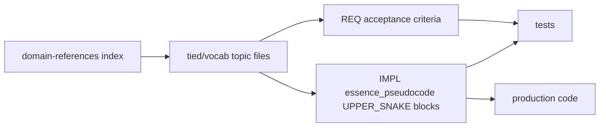

# We turned our project glossary into part of the build chain. Here's how (TIED domain vocab).

*Draft Reddit post — r/programming / r/ExperiencedDevs tone. Source analysis: [`vocabulary-index-analysis-and-standards.md`](../tied/docs/vocabulary-index-analysis-and-standards.md).*

---

Most teams have a glossary somewhere. Confluence page, README footnote, maybe a wiki nobody opens after onboarding. It describes what terms *mean* after the code already exists. Nothing fails when someone renames a flag in YAML but the wiki still says the old name. Nothing enforces that the test helper, the pseudo-code block, and the UI label all refer to the same thing.

We've been building with **TIED** (Traceable Implementation Engineering Decisions) — requirements, architecture, and implementation as linked YAML with semantic tokens like `[REQ-*]`, `[ARCH-*]`, `[IMPL-*]`. The interesting part for this post isn't the YAML schema; it's what we did with **domain vocabulary indices**: plain Markdown glossaries that sit *inside* the methodology instead of beside it.

Short version: the glossary isn't documentation you read once. It's a **controlled-vocabulary layer** whose preferred terms become literal identifiers in pseudo-code, tests, code, and TIED records. Pick one name, reuse it everywhere, or three-way alignment breaks and requirements stop being testable.

---

## What actually exists (the resources)

The vocabulary system is three layers, not one flat page.

### 1. Routing index + full index page

In the TIED methodology repo:

- **Routing index** — [`tied/vocab/domain-references-routing.md`](../tied/vocab/domain-references-routing.md) (~70 lines). Session bootstrap: match task keywords, PRELOAD only the matched glossaries. Mature clients add this when the full index grows too large for agents to read at every session start.
- **Full index** — [`tied/vocab/domain-references.md`](../tied/vocab/domain-references.md). Directory: priority, scope, one row per glossary, plus "authoring guides (not glossaries)" and cross-topic notes. Read on-demand for cross-cutting concerns—not at bootstrap when a routing index exists.

Other TIED client repos may use `docs/*-vocabulary.md` instead; the structural idea is the same. The meta-standard lives in [`tied/docs/vocabulary-index-analysis-and-standards.md`](../tied/docs/vocabulary-index-analysis-and-standards.md). Outreach framing: [`vocabulary-layer-tied-leap-citdp.md`](vocabulary-layer-tied-leap-citdp.md).

### 2. Canonical glossaries

Topic files under `tied/vocab/<topic>.md` — plain Markdown, **no** `-vocabulary` filename suffix. Examples in this repo:

| File | What it covers |
|------|----------------|
| `tied-methodology.md` | TIED layout, semantic tokens, bootstrap, methodology vs project YAML |
| `tied-yaml-mcp.md` | MCP server, `tied-cli`, validation, verify |
| `pseudocode-and-citdp.md` | Domain vocab vs IMPL grammar; three-way alignment |
| `agentstream.md` | Go CLI pipeline, turns, checklist render |
| `leap-proposal-queue.md` | Non-canonical LEAP proposals |

Each glossary follows a repeatable skeleton:

1. Title with **(canonical)** — this file is the single source of preferred terms.
2. **Scope** — what the subsystem covers and what it *excludes* ("vocabulary only"; algorithms live in IMPL pseudo-code sidecars).
3. **Traceability** — links to primary `[REQ-*]`, `[ARCH-*]`, `[IMPL-*]` tokens.
4. **See also** — sibling glossaries and the index; shared concepts defined once, linked many times.
5. **Body** — built from a small set of reusable shapes (below).
6. **Alphabetical index** — `Term | Section` table for quick lookup.

These are **not** TIED YAML. You edit them directly, like the `IMPL-*-pseudocode.md` sidecars. No `tied-cli`, no `lint_yaml`.

### 3. A replication prompt

The analysis doc references [`tied-domain-vocabulary-research-prompt.md`](tied-domain-vocabulary-research-prompt.md) — a copy-paste agent prompt (Phases 1–4, acceptance criteria) so other TIED client repos can reproduce the same pattern. Same standards, different path layout if the project prefers `docs/*-vocabulary.md`.

### What makes them "indices" and not prose docs

Five content shapes show up over and over:

- **Preferred-term vs synonym table** — one row picks the winner; the rest are "avoid in UI" or legacy.
- **Naming bridge table** — one concept mapped across UI label, YAML key, CLI flag, env var, storage path, TIED token suffix.
- **Named-concept bullets** — bold stable terms with definitions (often the same words pseudo-code reuses as `UPPER_SNAKE` block names).
- **Catalogs / enums** — verbatim code values, greppable.
- **Key/attribute tables** — exact spellings in backticks for symbols, CSS classes, YAML keys.

Behavioral rules that matter:

- **Exact spellings, in backticks** — so `rg` finds the same string in vocab, tests, and production code.
- **Define-once-link-many** — federated glossaries with an index, not one 200-term page.
- **Vocabulary, not algorithm** — step-by-step logic stays in `tied/implementation-decisions/*-pseudocode.md`; the glossary survives refactors.
- **Bidirectional TIED linkage** — glossaries cite REQ/ARCH/IMPL; REQ acceptance criteria cite the glossary path *and* the pseudo-code block name together.

`copy_files.sh` seeds `tied/vocab/` into client projects when absent, so the discipline travels with the methodology bootstrap.

---

## How it's operated (the processes)

The process token is **`[PROC-VOCABULARY_INDEX]`** — "Domain vocabulary index discipline" in [`tied/docs/processes.md`](../tied/docs/processes.md).

The implementation checklist ([`tied/docs/agent-req-implementation-checklist.md`](../tied/docs/agent-req-implementation-checklist.md), trackable YAML v1.7.0 with `VOCAB_INDEX: ./tied/vocab`) invokes **`sub-vocabulary-sync`** at mandatory **touchpoints** and at each naming point. Four modes:

### RESOLVE (Touchpoint 1 — prompt intake)

Look up the concept in `tied/vocab/*.md`. Choose the **one preferred term**. Reword fuzzy sponsor wording, synonyms, or ambiguous phrasing to that canonical term. Primary steps: `translate-sponsor-intent`, `change-definition`.

### PRELOAD (Touchpoint 2 — before reading docs/code)

Read `tied/vocab/domain-references-routing.md`; match task keywords; open **only** matched glossaries; build a term map **before** reading TIED indexes, detail files, source, or tests so symbols and paths are interpreted with canonical names. For cross-cutting concerns, search the full `domain-references.md` on demand. Primary steps: `session-bootstrap`, `impact-discovery`.

### RECORD (inline during work)

Add or update the index immediately: preferred-term-vs-synonym row, naming-bridge row (concept ↔ token ↔ storage ↔ UI label), UPPER_SNAKE block-name row, alphabetical index entry. Cite the relevant REQ/ARCH/IMPL.

Reconcile after tests, code, design docs, or UI copy change — not as a quarterly wiki cleanup.

### VALIDATE (Touchpoint 3 — before commit)

Audit changed artifacts vs the index; block commit on synonym drift or missing bridges. Primary step: `traceable-commit`.

### Critical distinction: two different "vocabularies"

This trips people up.

| Layer | Location | Governs |
|-------|----------|---------|
| **Domain vocabulary** | `tied/vocab/*.md` | Which **name** a concept has |
| **IMPL grammar vocabulary** | `tied/docs/implementation-decisions.md` | How a **block** is written (`INPUT`, `OUTPUT`, `DATA`, `IF`, `AWAIT`, …) |

`sub-vocabulary-sync` uses **domain** vocab. INPUT/OUTPUT/DATA are pseudo-code keywords, not product terms.

---

## What it does (effects on TIED, tests, code, docs)

### In TIED YAML

The preferred domain term drives:

- **REQ/ARCH/IMPL token suffixes** and record `name` fields — e.g. you don't invent `REQ-FOO-BAR` from a meeting nickname if the vocab already says **leap-proposal-queue**.
- **Acceptance criteria wording** — criteria reference the glossary path plus the owning pseudo-code block name, so "satisfied" has a precise, grep-friendly anchor.
- **Traceability blocks** in glossaries link back to detail files under `tied/requirements/`, `tied/architecture-decisions/`, `tied/implementation-decisions/`.

After wiring glossary references into REQ/ARCH/IMPL, you run `tied_validate_consistency` — same as any other TIED edit loop.

Governance expectation from the standards: a glossary should be cited by at least one REQ criterion so terms aren't orphaned.

### In IMPL pseudo-code

This is the sharpest integration. The preferred domain term **is** the `UPPER_SNAKE` block name in `essence_pseudocode`.

Example pattern (from a product repo that uses the same standards): if the vocab canonicalizes **data fence wrap**, the block is named `DATA_FENCE_WRAP`, not "handle the fence" or `processFence`. Block lead comments name `[IMPL-*] [ARCH-*] [REQ-*]` and state how the block implements them — per `[PROC-IMPL_PSEUDOCODE_TOKENS]`.

The glossary deliberately holds **terms and relationships**, not algorithms. When behavior changes, you update pseudo-code first; the glossary stays stable unless the *concept* or *name* changed.

### In tests and code

`[PROC-IMPL_CODE_TEST_SYNC]` requires **three-way alignment**: IMPL block lead comment ↔ test comment ↔ production code comment — literal copy, same tokens, same block name.

So a vocabulary choice isn't cosmetic. If pseudo-code says `UX_RESOLVE_ACT_PRECEDENCE` but the test file comments say `resolveActOrder`, you've broken alignment. Imprecise or synonym-heavy wording in the glossary propagates into untestable REQ criteria.

Module and function names in code, test describe blocks, and storage paths (`code_locations` in IMPL detail) are expected to derive from the same preferred terms recorded in naming-bridge tables.

### In docs and UI

Where product repos tie glossaries to in-app Help, the naming bridge keeps **user-facing labels** and **developer-facing identifiers** converged: one concept row might list UI string, L10n key prefix, YAML key, and Swift enum case.

Authoring guides (`tied/docs/pseudocode-writing-and-validation.md`, `AGENTS.md`, agent preload contracts) reference the vocab index at session start so agents and humans pick the same terms before writing.

---

## Traditional glossary vs this approach

| Traditional glossary | TIED domain vocabulary index |
|----------------------|------------------------------|
| Onboarding / communication | Active traceability artifact |
| Describes terms after the fact | Terms chosen **before** REQ/ARCH/IMPL naming |
| One flat list, often stale | Federated glossaries + index + naming bridges |
| Outside build/verification | Feeds pseudo-code block names that thread into tests and code |
| Nothing fails on drift | Drift breaks three-way alignment and testability |
| Passive reference | RESOLVE/RECORD discipline in the agent checklist |

A traditional glossary *describes* the system for humans. These indices are a **controlled-vocabulary layer in the TIED chain**:

**REQ → ARCH → IMPL pseudo-code → tests → code**

…whose terms become the literal identifiers that keep requirements testable.

---

## TL;DR (comment-section edition)

- We keep domain glossaries as plain Markdown under `tied/vocab/`, indexed by `domain-references.md`, with `domain-references-routing.md` for lightweight session bootstrap.
- They're not wiki fluff — they're wired into `[PROC-VOCABULARY_INDEX]` and the agent REQ checklist via `sub-vocabulary-sync`.
- **RESOLVE** before you name anything (tokens, blocks, files, UI copy). **PRELOAD** via the routing index before reading TIED/docs/code. **RECORD** when new concepts show up or artifacts change. **VALIDATE** before commit.
- The preferred term becomes the `UPPER_SNAKE` pseudo-code block name, then copies into test/code comments. One name, three places, or alignment breaks.
- Domain vocab (what things are *called*) ≠ IMPL grammar vocab (`INPUT`/`OUTPUT`/`DATA` — how blocks are *written*).
- REQ criteria cite both the glossary and the block name; glossaries cite REQ/ARCH/IMPL back. Bidirectional, grep-friendly, deliberately thin on algorithms.
- If you've ever had a requirement that nobody could write a test for because three subsystems used three names for the same thing — this is the boring structural fix.

---

*Further reading: [`tied/docs/vocabulary-index-analysis-and-standards.md`](../tied/docs/vocabulary-index-analysis-and-standards.md) · [`tied/vocab/domain-references-routing.md`](../tied/vocab/domain-references-routing.md) · [`tied/vocab/domain-references.md`](../tied/vocab/domain-references.md) · [`vocabulary-layer-tied-leap-citdp.md`](vocabulary-layer-tied-leap-citdp.md) · [`tied-domain-vocabulary-research-prompt.md`](tied-domain-vocabulary-research-prompt.md) · [`tied/docs/processes.md`](../tied/docs/processes.md) § `[PROC-VOCABULARY_INDEX]`*
