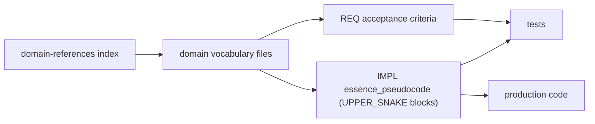

# Vocabulary index analysis and recommended standards

Analysis of the canonical domain vocabulary indices under [`docs/`](.) — what they contain, recommended authoring standards, and how their TIED integration differs from a traditional software glossary.

**Index of the corpus:** [`markscope-domain-references.md`](markscope-domain-references.md). **Replication prompt:** [`tied-domain-vocabulary-research-prompt.md`](tied-domain-vocabulary-research-prompt.md).

**Scope:** This is a meta-document *about* the glossaries; it is not itself a domain glossary and is not the source of canonical terms. For canonical terms, use the individual `docs/*-vocabulary.md` files.

---

## 1. What the vocabulary indices are (replication brief)

### 1a. The corpus (three layers)

The vocabulary system is three layers, not just the nine glossaries:

- **One index page** — [`markscope-domain-references.md`](markscope-domain-references.md). A single-page directory with a `Priority | Document | Scope` table (one row per glossary), plus separate sections for "Authoring guides (not glossaries)," "Behavior inventories (not glossaries)," and cross-topic notes (e.g. the `--emit-full-script` feature that spans five glossaries).
- **Nine canonical glossaries** (`docs/*-vocabulary.md`):

  | Glossary | Index priority | Scope |
  |----------|----------------|-------|
  | [`markdown-fence-dispatch-vocabulary.md`](markdown-fence-dispatch-vocabulary.md) | 1 | Fence to HTML dispatch ladder, directives |
  | [`markdown-ux-fence-vocabulary.md`](markdown-ux-fence-vocabulary.md) | 1 | `ux` YAML keys, init/act, transform/validate |
  | [`prose-layout-and-preview-chrome-vocabulary.md`](prose-layout-and-preview-chrome-vocabulary.md) | 2 | `RenderProseLayout`, CSS classes, panels |
  | [`document-index-vocabulary.md`](document-index-vocabulary.md) | 2b | Document Index panel groups/sub-lists |
  | [`shell-evaluation-vocabulary.md`](shell-evaluation-vocabulary.md) | 3c | Shell wrapper strictness presets |
  | [`host-preferences-and-menu-vocabulary.md`](host-preferences-and-menu-vocabulary.md) | 5b | YAML to UI to menu bridge |
  | [`diagnostics-and-observability-vocabulary.md`](diagnostics-and-observability-vocabulary.md) | 6 | Log/diagnostic IDs, render correlation |
  | [`macos-distribution-vocabulary.md`](macos-distribution-vocabulary.md) | — | Build/sign/notarize/ship terms |
  | [`mermaid-layout-and-presentation-vocabulary.md`](mermaid-layout-and-presentation-vocabulary.md) | — | Diagram structure, SVG sizing |

- **One replication prompt** — [`tied-domain-vocabulary-research-prompt.md`](tied-domain-vocabulary-research-prompt.md). A copy-paste agent prompt that codifies the standard (Phases 1-4, acceptance criteria, output format) so other TIED client repos can reproduce the pattern.

### 1b. The recurring anatomy of a glossary file

Every glossary follows a near-identical skeleton. To replicate, reproduce these sections in order:

1. **Title with `(canonical)`** — signals it is the single source of preferred terms.
2. **Scope paragraph** — what the subsystem covers and, importantly, what it *excludes* (e.g. "This page is vocabulary only"). Algorithms are delegated to IMPL pseudo-code.
3. **Traceability block** — bold `Traceability:` line linking primary `REQ-*`, `ARCH-*`, `IMPL-*` tokens via relative links into `../tied/...`.
4. **Help coverage block** — which in-app Help tab and L10n key prefixes summarize the same material, with the owning IMPL block.
5. **See also / cross-links** — links to sibling glossaries and the index; shared concepts are defined once and linked.
6. **Body sections** built from the reusable shapes below.
7. **Alphabetical index** — a `Term | Section` table for quick lookup.

### 1c. The five reusable content shapes

The glossary bodies are built from a small set of patterns. These five suffice to author a faithful copy:

- **Preferred-term vs synonym table** — `Preferred prose | Avoid in UI | Notes` or `Preferred | Synonyms / notes`. Picks one term, demotes the rest.
- **Naming bridge table** — maps one concept across its serialized forms: `Canonical concept | UI label | ~/.markscope.yaml key | CLI flag | Swift enum`.
- **Named-concept bullets/tables** — bold stable terms with definitions (often the UPPER_SNAKE block names pseudo-code reuses, e.g. `DATA_FENCE_WRAP`, `HIDE_DIRECTIVE_RENDER_SKIP`).
- **Catalogs / enums** — verbatim code values (e.g. `LogEventID`, `DiagnosticKind`, the 9-step dispatch ladder).
- **Key/attribute tables** — L10n keys, `data-*` attributes, CSS classes, YAML keys — always backticked with exact spellings.

### 1d. The defining behavioral rules

What makes these "indices" rather than prose docs:

- **Exact spellings, in backticks** — symbols, `data-markscope-*` attributes, CSS classes, YAML keys, enum cases are quoted verbatim so they are greppable and match code/tests.
- **Define-once-link-many** — a concept that spans modules is defined in one file and cross-linked from the others.
- **Vocabulary, not algorithm** — they record *terms and relationships*; step-by-step logic stays in `tied/implementation-decisions/*-pseudocode.md`.
- **Bidirectional TIED linkage** — glossaries cite REQ/ARCH/IMPL tokens, and REQ acceptance criteria cite the glossary path *plus* the pseudo-code block name together.

---

## 2. Recommended standards for structure, format, and content

These consolidate what the corpus does well and tighten observed inconsistencies. They apply both here and to other vocabulary databases.

### Structure standards

- **Mandatory section order**: Title `(canonical)` → Scope (with explicit exclusions) → Traceability → See also → body → Alphabetical index. Make this a template/checklist.
- **One index page is required** and must list *every* glossary with a scope line; segregate non-glossaries (authoring guides, behavior inventories) into clearly labeled sections.
- **Add a "Pseudo-code block names" section to every glossary.** The replication prompt *requires* this (Phase 2), but the lower-priority glossaries (`shell-evaluation`, `macos-distribution`, `diagnostics`, `mermaid-layout`) lacked it while the priority-1/2 glossaries reference blocks inline. Standardize a `Preferred term | UPPER_SNAKE block | Owning IMPL` table, with `(proposed)` for gaps. This is the single most valuable structural fix.
- **Split/merge rule**: split at ~15+ named concepts or distinct audiences; merge when two areas share one dispatch/order story. Promote this note into each file.

### Format standards

- **Exact spelling discipline**: every symbol, key, attribute, CSS class, enum case in backticks.
- **Consistent suffix**: standardize on `-vocabulary` (this repo's convention) rather than mixing `-glossary`.
- **Stable bold for canonical terms**; reserve backticks for literal identifiers and bold for prose concepts.
- **Relative links only** into `../tied/...` and sibling docs, so the tree is portable.
- **Cap alphabetical-index drift**: every bold canonical term should appear in the alphabetical index and vice-versa; consider a lightweight lint check.

### Content standards

- **Preferred-term-vs-synonym table is mandatory** when any concept has more than one surface form. Record user-facing, config-serialized, and code-symbol forms in separate columns.
- **Naming bridge for any concept crossing UI/YAML/CLI/code.** The Mermaid width-mode and host-prefs YAML-rename tables are the gold standard.
- **No algorithms.** Enforce "vocabulary only" — link to the owning IMPL for behavior so the glossary stays stable as code changes.
- **Traceability + Help-coverage blocks required**, anchoring each term to a requirement and to its user-facing help.
- **Deprecation policy**: keep "legacy"/"avoid" rows but mark them explicitly and state the replacement.

### Governance standards (the part most glossaries miss)

- **Acceptance checklist per file** (the prompt's Phase 4) adopted as a PR gate.
- **A glossary must be cited by at least one REQ criterion**, closing the loop so terms are not orphaned.
- **Run `tied_validate_consistency`** after wiring glossary references into REQ/ARCH/IMPL.

---

## 3. Traditional glossary use vs. this project's integration

### Traditional use in software projects

A conventional glossary / data dictionary is typically:

- **Onboarding/communication oriented** — a human reference for shared vocabulary (DDD "ubiquitous language," API data dictionaries, wiki glossaries).
- **Descriptive and passive** — it documents what terms mean *after* the code exists, with no formal link back to requirements, tests, or code beyond prose.
- **A single flat list**, often one page, frequently stale because nothing enforces updates.
- **Outside the build/verification loop** — no tooling fails when a term drifts; correctness is not defined in terms of it.

### How Markscope integrates them (TIED-specific)

Here the glossaries are an active traceability artifact wired into the methodology:

- **They feed IMPL `essence_pseudocode`.** The stated purpose is to make pseudo-code "precise, comparable, and traceable." Authors pick *one* preferred term and reuse it as **UPPER_SNAKE block names** (`UX_RESOLVE_ACT_PRECEDENCE`, `DATA_FENCE_WRAP`, `HIDE_DIRECTIVE_RENDER_SKIP`). The glossary term *is* the block name.
- **They participate in three-way alignment.** Block lead comments are copied into tests and production code (`[PROC-IMPL_CODE_TEST_SYNC]`), so a vocabulary term threads IMPL ↔ tests ↔ code. Imprecise wording "breaks three-way alignment and makes REQ criteria untestable."
- **They are bidirectionally cross-referenced with REQ/ARCH/IMPL.** REQ criteria cite the glossary path *and* the pseudo-code block name together.
- **They are a federated set with an index and a multi-axis naming bridge,** not one flat list. A single concept is tracked across UI label, `~/.markscope.yaml` key, CLI flag, and Swift enum.
- **They are deliberately thin and stability-seeking** — algorithms live in IMPL pseudo-code so the glossary survives refactors; terms are tied to in-app Help so user-facing and developer-facing terms converge.
- **They are replicable methodology** — the repo ships a reusable prompt plus a verification table so other TIED client repos reproduce the exact pattern.

In short: a traditional glossary *describes* the system for humans; these vocabulary indices are a **controlled-vocabulary layer in the TIED chain** (REQ → ARCH → IMPL pseudo-code → tests → code) whose terms become the literal identifiers that keep requirements testable and three-way alignment intact.

---

## 4. STDD / TIED repository convention

This **TIED methodology repository** (stdd) uses a project-local vocabulary tree distinct from the Markscope `docs/*-vocabulary.md` layout described in §1:

| Element | Location in this repo |
|---------|------------------------|
| Index page | [`tied/vocab/domain-references.md`](../tied/vocab/domain-references.md) |
| Canonical glossaries | `tied/vocab/<topic>.md` (plain Markdown; **no** `-vocabulary` suffix) |
| Checklist pointer | `VOCAB_INDEX: ./tied/vocab` in [`tied/docs/agent-req-implementation-checklist.yaml`](../tied/docs/agent-req-implementation-checklist.yaml) |
| Process token | `[PROC-VOCABULARY_INDEX]` in [`tied/docs/processes.md`](../tied/docs/processes.md) |
| Bootstrap | `copy_files.sh` seeds `tied/vocab/` into client projects when absent |

**Replication:** Other TIED client repos may follow [`tied-domain-vocabulary-research-prompt.md`](tied-domain-vocabulary-research-prompt.md) with `docs/*-vocabulary.md` instead; the structural standards in §2 apply to both layouts. When authoring in **this** repo, use `tied/vocab/` only.
