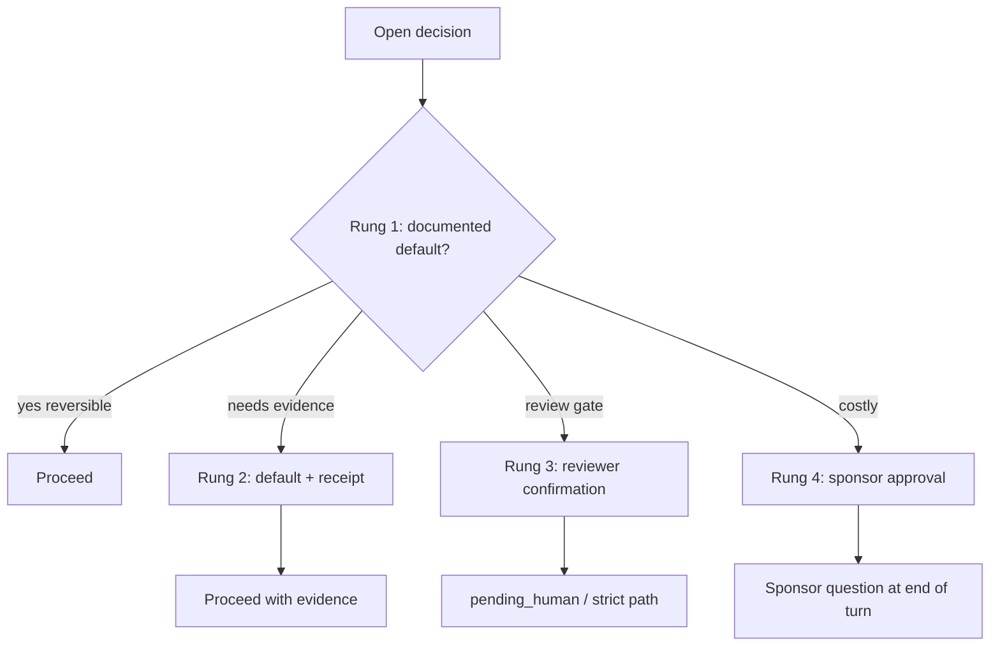

# Sponsor–agent relationship (methodology guide)

**Traceability:** [REQ-TIED_SPONSOR_AGENT_RELATIONSHIP](../requirements/REQ-TIED_SPONSOR_AGENT_RELATIONSHIP.yaml) · Glossary: [`../vocab/sponsor-agent-relationship.md`](../vocab/sponsor-agent-relationship.md)

---

## Consequence ladder

| Rung | When | Action |
|------|------|--------|
| 1 | Reversible **reversible choice** with documented default | Proceed without sponsor Q&A |
| 2 | Default plus evidence/receipt required | Proceed and record evidence path |
| 3 | Reviewer confirmation | `review_status: pending_human`, strict eligibility |
| 4 | **costly choice** | Sponsor approval (integrated waiver, strict approval, OD acceptance, decision-copilot tier 4) |

Link **depth_tier**, **gate_policy**, BBCE **review_status**, and decision-copilot tier 4 to rung 3–4 per [`../vocab/decision-copilot.md`](../vocab/decision-copilot.md).

---

## Failure-mode review prompts

**RP-1 over-asking:** Does any reversible checklist step insert a sponsor question where a documented default exists? If yes, fail review.

**RP-2 instrumentalizing the sponsor:** Does the agent proceed on placeholder waivers, treat sponsor disagreement as IMPL contradiction, or optimize sponsor choices? If yes, fail review.

---

## Sponsor-vs-TIED disagreement routing

| Situation | Route |
|-----------|--------|
| Inside **delegated work envelope** | `sub-leap-micro-cycle` / LEAP |
| Costly or outside envelope | Sponsor question (end of turn) |
| IMPL-vs-IMPL spec conflict | `flag-contradictory-specs` (not sponsor disagreement) |
