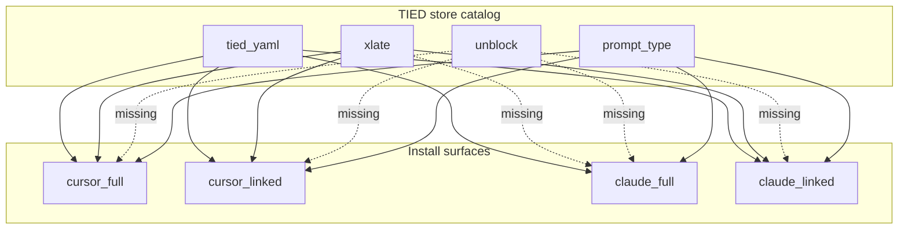

# [REQ-TIED_CLIENT_BOOTSTRAP_SKILLS] Client bootstrap skills distribution

**Plan status:** Refined (refine-plan pass). **No** REQ/ARCH/IMPL YAML, bootstrap code, or commit in this pass.

**Canonical skill (already in store):** [`tools/bundled-unblock-skill/SKILL.md`](tools/bundled-unblock-skill/SKILL.md)

**Primary install path:** `tied-install.sh` → [`tools/bootstrap/lib/install-layers-core.mjs`](tools/bootstrap/lib/install-layers-core.mjs) → `installSkillsLinked` | `installSkillsFull` → [`bootstrap.mjs`](tools/bootstrap/lib/bootstrap.mjs) (legacy/full client bootstrap).

---

## Refine (Touchpoint 1 — RESOLVE)

### Intent (one line)

Distribute **client bootstrap skills** from the TIED store through **`tied-install.sh`** so every **managed skill category** appears consistently across **install mode** (`full` | `linked`) and **harness** (Cursor | Claude), including the new **`unblock`** standalone skill.

### Canonical terms

| Term | Meaning in this REQ |
|------|---------------------|
| **standalone bundled skill** | Small store tree under `tools/bundled-<name>-skill/` (not prompt-type bundle); today **xlate**, **unblock** |
| **prompt-type bundle** | [`tools/bundled-prompt-type-skills/`](tools/bundled-prompt-type-skills/) dirs listed in `manifest.json` → `PROMPT_TYPE_SKILL_DIRS` |
| **tied-yaml skill** | [`tools/bundled-tied-yaml-skill/`](tools/bundled-tied-yaml-skill/) with scripts + MCP CLI wrappers |
| **linked install** | Stubs under client `.cursor/skills/` (or reroot `skills/`) pointing at store canonical `SKILL.md` |
| **full install** | Tree copy (or Claude symlink opt-in for prompt-type only) into harness skills dir |
| **managed inventory** | Minimum set of paths that must exist after bootstrap for a harness (see parity matrix) |

### Sponsor decisions (recorded)

1. **Harness parity:** Standalone bundled skills install to **Cursor and Claude** in **`--mode full`** and **`--mode linked`** (2026-10-07 conversation).
2. **Implementation shape:** **Manifest-driven** installer (refactor), not a one-off `installUnblockSkill` duplicate — **reversible choice**; small blast radius (`tools/bootstrap/lib/**` only).
3. **Adversarial depth:** **`depth_tier: minimal`**, **`gate_policy: advisory`** for this change (bootstrap read/copy/stub; no new auth, network, or persistence in product runtime). Re-select at `build-plan` if scope expands.
4. **REQ shape:** **One** behavior-changing REQ — **[REQ-TIED_CLIENT_BOOTSTRAP_SKILLS]** — subsumes completion of **[REQ-TIED_XLATE_SKILL]** install criterion via LEAP cross-ref (do not delete XLATE token).

### Non-goals

- Changing **`tied_sponsor_questions`** MCP behavior (read-only extract).
- Prompt Composer / `.cursor/agents/` Task wrappers (TIED-source dev only).
- Personal skills under `~/.cursor/skills-cursor/`.
- Adding **`/unblock`** to prompt-type router or `tied-boundary.md` TIED leaf list (standalone explicit skill only, like **xlate**).

### RESOLVE charter

Agent may document **defaults** for install order and test markers; **sponsor** owns intent for parity matrix and REQ scope.

---

## Goal

1. Ship **unblock** through **`tied-install.sh`** on par with **xlate**.
2. Fix **Claude full** gap: **xlate** (and **unblock**) missing from [`installClaudeSkills`](tools/bootstrap/lib/skills.mjs) while **linked** mode already stubs **xlate** for Claude.
3. Replace one-off **`installXlateSkill`** call sites with a **catalog** so future standalone skills are manifest-only.
4. Enforce distribution with **tests** tied to **[REQ-TIED_CLIENT_BOOTSTRAP_SKILLS]** satisfaction criteria.

---

## Current state (gaps)



**Evidence in code**

- **Unblock:** documented in [`tied-project/vocab/project-operations-mcp.md`](tied-project/vocab/project-operations-mcp.md); no bootstrap hook.
- **Claude full:** [`installClaudeSkills`](tools/bootstrap/lib/skills.mjs) ends after tied-yaml + prompt-type; no standalone copy.
- **Duplication:** [`installXlateSkill`](tools/bootstrap/lib/skills.mjs) + [`installLinkedXlateSkill`](tools/bootstrap/lib/layers/skills-linked.mjs) per skill; four entry paths ([`bootstrap.mjs`](tools/bootstrap/lib/bootstrap.mjs), [`installSkillsFull`](tools/bootstrap/lib/layers/skills-linked.mjs), [`installSkillsLinked`](tools/bootstrap/lib/layers/skills-linked.mjs), Claude path).
- **Inventory:** [`claudeManagedInventoryComplete`](tools/bootstrap/lib/assert-windows-bootstrap-claude.mjs) checks tied-yaml + `build-plan` + `prompt-shared` only — not standalone skills, not full `PROMPT_TYPE_SKILL_DIRS` list.
- **[REQ-TIED_XLATE_SKILL](tied-project/requirements/REQ-TIED_XLATE_SKILL.yaml):** status **Planned**; criterion `xlate-install` satisfied by this work via LEAP.

---

## TIED stack (mint at build-plan)

| Layer | Token | Role |
|-------|-------|------|
| REQ | **[REQ-TIED_CLIENT_BOOTSTRAP_SKILLS]** | Manifest, parity, tests, unblock distribution |
| ARCH | **[ARCH-TIED_CLIENT_BOOTSTRAP_SKILLS]** | Categories, install surfaces, managed inventory policy |
| ARCH | **[ARCH-TIED_UNBLOCK_SKILL_BOUNDARY]** | Standalone bundle; complements **xlate** + `tied_sponsor_questions`; not prompt-type |
| IMPL | **[IMPL-TIED_CLIENT_BOOTSTRAP_SKILLS]** | `client-skills-catalog.mjs`, inventory helpers, bootstrap wiring |
| IMPL | **[IMPL-TIED_UNBLOCK_SKILL]** | Bundled skill body (exists); bootstrap registration traceability |

**Cross-refs:** [REQ-TIED_SETUP], [REQ-TIED_LAYERED_CLIENT_INSTALL], [REQ-PROMPT_TYPE_GLOBAL_SKILLS], [REQ-TIED_XLATE_SKILL], [REQ-TIED_CLAUDE_BOOTSTRAP_OPS], [REQ-TIED_CLAUDE_SKILLS_REROOT], [REQ-TIED_SPONSOR_QUESTIONS], [REQ-TIED_SPONSOR_AGENT_RELATIONSHIP].

**Working folder (at implement):** `tied-project/working/REQ-TIED_CLIENT_BOOTSTRAP_SKILLS/` — Tracker from [`agent-req-implementation-checklist.yaml`](tied-bundle/docs/agent-req-implementation-checklist.yaml), `PLAN.md` copy of this doc, CITDP at `tied-project/citdp/CITDP-REQ-TIED_CLIENT_BOOTSTRAP_SKILLS.yaml` on close-out.

---

## CITDP sketch (persist on close-out)

```yaml
# CITDP-REQ-TIED_CLIENT_BOOTSTRAP_SKILLS (draft)
change_definition:
  current_behavior: >
    Bootstrap special-cases xlate only; unblock not installed; Claude full omits standalone skills;
    inventory asserts do not cover standalone manifest; adding a skill requires new install functions.
  desired_behavior: >
    manifest.json lists BUNDLED_STANDALONE_CLIENT_SKILLS; one catalog installs copy or linked stub on all four surfaces;
    Claude and Cursor full+linked receive xlate and unblock; tests assert managed inventory includes standalone skills.
  non_goals:
    - MCP tied_sponsor_questions behavior changes
    - Prompt-type skill procedure changes
  success_criteria:
    - tied-install (full) places unblock and xlate under .cursor/skills and .claude/skills
    - tied-install (linked) stubs unblock and xlate for both harnesses
    - store reachability fails if bundled-unblock-skill missing
    - REQ-TIED_XLATE_SKILL xlate-install criterion met via LEAP note on parent REQ
    - tied_validate_consistency passes after token stack
test_strategy:
  focused_tests: >
    tools/bootstrap/lib/client-skills-catalog.test.mjs;
    mcp-server/src/e2e/client-bootstrap-skills.test.ts;
    assert-windows-bootstrap-claude.mjs inventory;
    xlate-skill.test.ts remains green
  module_validation:
    - module: client_skills_catalog
      boundary: pure manifest load + path resolution under TIED_REPO_ROOT
    - module: install_standalone_copy
      boundary: filesystem copy only; no git
    - module: install_standalone_linked_stub
      boundary: writes SKILL.md stub; store path in body
risk_analysis:
  adversarial_inquiry:
    depth_tier: minimal
    gate_policy: advisory
  risks:
    - id: RISK-CBS-001
      description: Reroot skills dir hides standalone skills from default .cursor path asserts
      mitigation: Tests run with and without TIED_SKILLS_REROOT where harness tests already cover reroot
    - id: RISK-CBS-002
      description: Manifest drift — new skill added to store but not manifest
      mitigation: Single catalog loader; test iterates manifest entries
```

---

## Design

### Manifest extension

[`tools/bootstrap/manifest.json`](tools/bootstrap/manifest.json):

```json
"BUNDLED_STANDALONE_CLIENT_SKILLS": [
  { "skillName": "xlate", "storeDir": "tools/bundled-xlate-skill" },
  { "skillName": "unblock", "storeDir": "tools/bundled-unblock-skill" }
]
```

Optional per-entry **`contentMarkers`**: `{ "xlate": ["/xlate", "routing.md"], "unblock": ["/unblock", "tied_sponsor_questions"] }` for tests (keep in test table if not in manifest).

### Module: `tools/bootstrap/lib/client-skills-catalog.mjs`

| Block | Responsibility |
|-------|----------------|
| **LOAD_STANDALONE_CLIENT_SKILLS** | Read manifest; resolve absolute paths under store root; throw if `SKILL.md` missing |
| **INSTALL_STANDALONE_SKILLS_COPY** | For each entry: `copyTreeWithAttributes(storeDir, skillsInstallDir/skillName)` |
| **INSTALL_STANDALONE_SKILLS_LINKED_STUB** | For each entry: [`buildSkillStubBody`](tools/bootstrap/lib/layers/skills-linked.mjs) + [`writeSkillStub`](tools/bootstrap/lib/layers/skills-linked.mjs) |
| **ASSERT_STANDALONE_INVENTORY** | Given `skillsRoot`, every manifest `skillName/SKILL.md` exists |

Keep **`installXlateSkill`** exported as thin wrapper → **INSTALL_STANDALONE_SKILLS_COPY** filtered to `xlate` (or full list) for backward compat until tests migrate.

### Wiring (install order unchanged)

1. prompt-type **or** tied-yaml first per existing harness — **preserve today’s order** in each function to avoid subtle regressions:
   - **Cursor full** ([`bootstrap.mjs`](tools/bootstrap/lib/bootstrap.mjs)): tied-yaml → **standalone** → prompt-type (matches L121–123 today).
   - **Linked** ([`installSkillsLinked`](tools/bootstrap/lib/layers/skills-linked.mjs)): prompt-type stub → tied-yaml stub+wrappers → **standalone stubs** (replace single xlate call).
   - **Claude full** ([`installClaudeSkills`](tools/bootstrap/lib/skills.mjs)): prompt-type → tied-yaml → **standalone copy** (new).
2. [`checkStoreReachable`](tools/bootstrap/lib/layers/store.mjs): append each `storeDir` from standalone manifest.
3. [`constants.mjs`](tools/bootstrap/lib/constants.mjs): keep `xlateSkillCanonical` or derive from catalog for existing callers.

### Parity matrix (authoritative — ARCH detail)

| Category | Cursor full | Cursor linked | Claude full | Claude linked |
|----------|-------------|---------------|-------------|---------------|
| tied-yaml | tree copy + CLI patch | stub + exec wrappers | tree copy + CLI patch | stub + wrappers |
| prompt-type | copy | stubs | copy or Unix symlink | stubs |
| standalone | copy | stub → store | **copy** | stub → store |

### Managed inventory policy (extend ARCH + assert helper)

After bootstrap, **`skillsRoot`** must contain at minimum:

- `tied-yaml/scripts/tied-cli.sh`
- `prompt-shared/` (dir)
- `build-plan/SKILL.md` (representative prompt-type leaf)
- For each **`BUNDLED_STANDALONE_CLIENT_SKILLS`** entry: `<skillName>/SKILL.md` with YAML `name:` matching `skillName`

Update [`claudeManagedInventoryComplete`](tools/bootstrap/lib/assert-windows-bootstrap-claude.mjs) to call **ASSERT_STANDALONE_INVENTORY**. Optionally add **`cursorManagedInventoryComplete`** mirroring the same policy for symmetry in e2e (Claude smoke already uses Claude helper).

**Docs sync:** Note in [`windows_smoke_assert_list.md`](tied-project/working/REQ-TIED_CLAUDE_BOOTSTRAP_OPS/phase0/windows_smoke_assert_list.md) that “managed inventory” includes standalone skills once GREEN (residual doc drift OK until touched in same PR).

### Vocab

[`project-operations-mcp.md`](tied-project/vocab/project-operations-mcp.md): remove “bootstrap install not yet wired”; state install dir `.cursor/skills/unblock` and `.claude/skills/unblock` via **`tied-install.sh`**.

---

## REQ satisfaction criteria (draft)

| criterion_id | Criterion |
|--------------|-----------|
| `standalone-manifest` | `manifest.json` defines `BUNDLED_STANDALONE_CLIENT_SKILLS` including xlate and unblock |
| `cursor-full-standalone` | Full bootstrap installs all standalone skills under Cursor skills dir |
| `claude-full-standalone` | Full bootstrap installs all standalone skills under Claude skills dir |
| `linked-standalone-stubs` | Linked bootstrap writes stubs for all standalone skills for both harnesses when `harness: both` |
| `store-reachability` | Linked store check fails if any standalone storeDir missing |
| `inventory-assert` | `claudeManagedInventoryComplete` (and tests) require standalone skills |
| `xlate-leap` | [REQ-TIED_XLATE_SKILL] criterion `xlate-install` verified and status updated via verification-gated flow |

---

## Test strategy (RED → GREEN)

| Order | Test | Assert |
|-------|------|--------|
| 1 | `client-skills-catalog.test.mjs` | Loader returns 2 entries; missing dir throws |
| 2 | `client-bootstrap-skills.test.ts` | `INSTALL_STANDALONE_SKILLS_COPY` → `.cursor/skills/{xlate,unblock}/SKILL.md`; markers |
| 3 | `client-bootstrap-skills.test.ts` | `installClaudeSkills` → `.claude/skills/unblock/SKILL.md` |
| 4 | `skills-linked.test.mjs` | Stub body contains store path to `bundled-unblock-skill/SKILL.md` |
| 5 | `claude-harness.test.mjs` | Inventory false without `xlate`/`unblock`; true after install |
| 6 | `xlate-skill.test.ts` | Still passes (wrapper or shared helper) |
| 7 | Optional | `bootstrapTied` temp dir — spot-check all `PROMPT_TYPE_SKILL_DIRS` for `SKILL.md` (heavy; defer unless flaky smaller tests insufficient) |

**Run command (focused):** `cd mcp-server && npm test -- client-bootstrap-skills` and `node --test tools/bootstrap/lib/client-skills-catalog.test.mjs` (adjust to repo convention).

---

## Implement sequence (build-plan)

1. Mint TIED tokens + IMPL pseudo-code ([PROC-IMPL_PSEUDOCODE_TOKENS]) + pre_implementation gate (minimal depth).
2. RED tests (table above).
3. GREEN catalog + wire all call sites + store reachability.
4. LEAP: [REQ-TIED_XLATE_SKILL] + vocab + `semantic-tokens.yaml`.
5. `lint_yaml` on new YAML; `tied_validate_consistency`; verification gate; CHANGELOG.

---

## Declared change surface (files)

- `tools/bootstrap/manifest.json`
- `tools/bootstrap/lib/client-skills-catalog.mjs` (+ `.test.mjs`)
- `tools/bootstrap/lib/skills.mjs`
- `tools/bootstrap/lib/bootstrap.mjs`
- `tools/bootstrap/lib/layers/skills-linked.mjs`
- `tools/bootstrap/lib/layers/store.mjs`
- `tools/bootstrap/lib/assert-windows-bootstrap-claude.mjs`
- `mcp-server/src/e2e/client-bootstrap-skills.test.ts`
- `tied-project/requirements*.yaml`, architecture, implementation, citdp, semantic-tokens
- `tied-project/vocab/project-operations-mcp.md`
- `CHANGELOG.md`

**Pre-existing (no content change required for REQ close):** `tools/bundled-unblock-skill/SKILL.md`

---

## Gates (next session)

- **`tied_checklist_gate_validate`** `phase: pre_implementation` with Tracker + CITDP before RED tests.
- **`tied_validate_consistency`** before close-out.
- Do **not** claim [REQ-TIED_CLIENT_BOOTSTRAP_SKILLS] complete from tests alone if project uses verification-gated mode — run **`tied_verify`** with update.

---

## Open questions

None blocking refine-plan. Optional later: fold **`contentMarkers`** into manifest vs hardcode in tests (default: hardcode in tests for minimal manifest schema).
